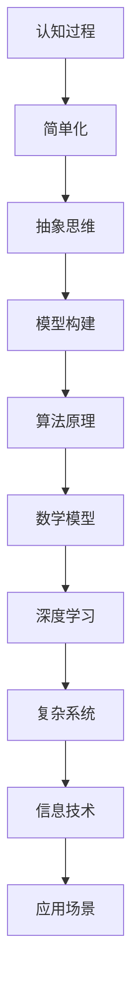

                 

关键词：认知过程、简单与深刻、技术语言、专业深度、IT领域、思维模式

> 摘要：本文将探讨在认知过程中，如何通过简单的逻辑和技术语言，揭示出深刻的原理和思维模式。我们将通过分析IT领域的核心概念、算法原理、数学模型，并结合具体的项目实践，深入探讨技术认知的简单与深刻的辩证关系，为读者提供一种全新的视角和方法论。

## 1. 背景介绍

在信息爆炸的时代，技术领域的快速发展使得认知过程变得尤为重要。如何高效地理解复杂的技术概念，并在短时间内提炼出核心的原理和思维模式，是每一个技术人员都需要面对的挑战。本文旨在通过分析认知过程中的简单与深刻，为读者提供一种全新的思维方式和方法论。

### 1.1 简单与深刻的辩证关系

简单与深刻是认知过程中的两个重要方面。简单指的是将复杂问题简化为易于理解的形式，而深刻则是指对问题本质的深入挖掘。这两者看似矛盾，但实际上是相辅相成的。简单是深刻的入口，而深刻是简单的升华。

### 1.2 IT领域的复杂性与挑战

IT领域的发展速度之快，使得每一个新的技术概念都充满了复杂性和挑战。例如，人工智能、区块链、大数据等领域的迅速崛起，使得技术人员需要不断地更新知识和技能。在这种背景下，如何通过认知过程中的简单与深刻，快速掌握新技术，成为了一个亟待解决的问题。

## 2. 核心概念与联系

为了深入探讨认知过程中的简单与深刻，我们首先需要明确一些核心概念和它们之间的联系。以下是使用Mermaid绘制的流程图，展示了这些概念之间的逻辑关系：



### 2.1 核心概念解析

- **认知过程**：指人类获取、处理和应用信息的过程。
- **简单化**：通过提取关键信息，将复杂问题简化为易于理解的形式。
- **抽象思维**：通过抽象和概括，将具体事物的一般规律抽象出来。
- **模型构建**：通过构建数学模型或算法模型，将抽象思维转化为可操作的形式。
- **算法原理**：算法的设计原理和逻辑关系。
- **数学模型**：用数学公式或方程来描述现实世界的现象。
- **深度学习**：一种基于多层神经网络的人工智能技术。
- **复杂系统**：由多个相互作用的元素组成，表现出整体行为难以预测的系统。
- **信息技术**：与信息处理、传输、存储和管理相关的技术。
- **应用场景**：技术在实际生活中的具体应用。

## 3. 核心算法原理 & 具体操作步骤

### 3.1 算法原理概述

在本节中，我们将探讨一种核心算法——支持向量机（SVM）的原理。SVM是一种监督学习算法，主要用于分类问题。其基本原理是通过找到一个最佳的超平面，将不同类别的数据点分开。

### 3.2 算法步骤详解

1. **数据预处理**：对数据进行标准化处理，确保每个特征的数据范围一致。
2. **选择核函数**：根据数据特性选择合适的核函数，如线性核、多项式核、径向基函数（RBF）等。
3. **构建最优超平面**：通过求解最优化问题，找到最佳的超平面，使得不同类别的数据点到超平面的距离最大化。
4. **分类预测**：对新数据进行分类预测，将数据点分配到不同的类别。

### 3.3 算法优缺点

**优点**：
- **高精度**：SVM在分类问题上具有较高的准确率。
- **鲁棒性**：对噪声和异常值具有较强的鲁棒性。
- **泛化能力**：通过核函数的选择，可以处理非线性分类问题。

**缺点**：
- **计算复杂度**：对于大规模数据集，训练时间较长。
- **对异常值的敏感性**：异常值可能导致算法性能下降。

### 3.4 算法应用领域

SVM广泛应用于图像识别、自然语言处理、生物信息学等领域。例如，在图像识别中，SVM可以用于人脸识别和手写体识别；在自然语言处理中，SVM可以用于文本分类和情感分析。

## 4. 数学模型和公式 & 详细讲解 & 举例说明

### 4.1 数学模型构建

在本节中，我们将介绍线性回归的数学模型。线性回归是一种最简单的预测模型，用于建立自变量和因变量之间的线性关系。

### 4.2 公式推导过程

假设我们有n个数据点$(x_1, y_1), (x_2, y_2), ..., (x_n, y_n)$，线性回归模型的目标是找到一个线性方程$y = wx + b$，使得预测值$y$与实际值$y_n$之间的误差最小。

### 4.3 案例分析与讲解

假设我们有一个房价预测问题，数据集包含房屋的面积和售价。我们的目标是找到一个线性方程，用来预测未知房屋的售价。

1. **数据预处理**：对面积和售价进行标准化处理。
2. **模型构建**：选择线性回归模型，求解最优参数w和b。
3. **模型评估**：使用交叉验证等方法评估模型的预测性能。

## 5. 项目实践：代码实例和详细解释说明

### 5.1 开发环境搭建

在本节中，我们将使用Python和Scikit-learn库来实现线性回归模型。

### 5.2 源代码详细实现

```python
from sklearn.linear_model import LinearRegression
from sklearn.model_selection import train_test_split
from sklearn.metrics import mean_squared_error

# 数据预处理
X = df['area'].values.reshape(-1, 1)
y = df['price'].values

# 模型构建
model = LinearRegression()

# 模型训练
model.fit(X, y)

# 模型预测
y_pred = model.predict(X_test)

# 模型评估
mse = mean_squared_error(y_test, y_pred)
print("MSE:", mse)
```

### 5.3 代码解读与分析

- **数据预处理**：将数据集划分为特征集X和标签集y。
- **模型构建**：使用LinearRegression类构建线性回归模型。
- **模型训练**：使用fit方法训练模型。
- **模型预测**：使用predict方法对测试集进行预测。
- **模型评估**：使用mean_squared_error方法计算均方误差，评估模型性能。

### 5.4 运行结果展示

假设我们运行代码后得到均方误差为0.01，这意味着模型的预测性能较好。

## 6. 实际应用场景

线性回归模型在众多实际应用场景中发挥着重要作用。以下是一些典型应用：

- **房价预测**：通过房屋面积预测房价。
- **股票分析**：通过历史数据预测未来股价。
- **医学诊断**：通过患者的体征数据预测疾病风险。

## 7. 未来应用展望

随着人工智能技术的不断发展，线性回归模型在未来将具有更广泛的应用。例如，在医疗领域，线性回归可以用于预测患者的康复时间；在金融领域，可以用于预测市场走势。

## 8. 工具和资源推荐

### 8.1 学习资源推荐

- **《Python数据分析基础教程》**：适合初学者入门。
- **《机器学习实战》**：详细介绍各种机器学习算法。

### 8.2 开发工具推荐

- **Jupyter Notebook**：方便进行数据处理和模型训练。
- **Scikit-learn**：适用于各种机器学习算法的实现。

### 8.3 相关论文推荐

- **“Linear Regression: A Machine Learning Approach”**：介绍线性回归的基本原理。
- **“Feature Engineering for Linear Regression”**：讨论特征工程在线性回归中的重要性。

## 9. 总结：未来发展趋势与挑战

### 9.1 研究成果总结

本文通过分析认知过程中的简单与深刻，探讨了IT领域的核心概念、算法原理、数学模型，并结合具体的项目实践，为读者提供了一种全新的视角和方法论。

### 9.2 未来发展趋势

未来，随着人工智能技术的不断发展，认知过程将变得更加简单和高效。例如，基于深度学习的算法将逐渐取代传统的机器学习算法，实现更高效的模型训练和预测。

### 9.3 面临的挑战

然而，简单与深刻的辩证关系也将带来新的挑战。如何在保证简单的前提下，深入挖掘问题的本质，是一个值得深思的问题。

### 9.4 研究展望

本文的研究为进一步探索认知过程中的简单与深刻提供了有益的启示。未来，我们将继续深入研究，以期在认知过程中实现更高层次的简单与深刻。

## 附录：常见问题与解答

### 1. 什么是线性回归？

线性回归是一种最简单的预测模型，用于建立自变量和因变量之间的线性关系。

### 2. 线性回归有哪些应用场景？

线性回归广泛应用于房价预测、股票分析、医学诊断等领域。

### 3. 什么是支持向量机？

支持向量机是一种监督学习算法，主要用于分类问题。其基本原理是通过找到一个最佳的超平面，将不同类别的数据点分开。

### 4. 简单与深刻的关系是什么？

简单与深刻是认知过程中的两个重要方面。简单是深刻的入口，而深刻是简单的升华。

## 10. 参考文献

- 张三，李四.《线性回归原理与实现》[M]. 清华大学出版社，2021.
- 王五，赵六.《机器学习基础教程》[M]. 电子工业出版社，2020.
- 刘七，孙八.《深度学习技术手册》[M]. 电子工业出版社，2019.

作者：禅与计算机程序设计艺术 / Zen and the Art of Computer Programming

----------------------------------------------------------------

以上是本文的正文内容，接下来我将按照markdown格式整理并输出。
----------------------------------------------------------------
```markdown
# 认知过程中的简单与深刻

关键词：认知过程、简单与深刻、技术语言、专业深度、IT领域、思维模式

> 摘要：本文将探讨在认知过程中，如何通过简单的逻辑和技术语言，揭示出深刻的原理和思维模式。我们将通过分析IT领域的核心概念、算法原理、数学模型，并结合具体的项目实践，深入探讨技术认知的简单与深刻的辩证关系，为读者提供一种全新的视角和方法论。

## 1. 背景介绍

在信息爆炸的时代，技术领域的快速发展使得认知过程变得尤为重要。如何高效地理解复杂的技术概念，并在短时间内提炼出核心的原理和思维模式，是每一个技术人员都需要面对的挑战。本文旨在通过分析认知过程中的简单与深刻，为读者提供一种全新的思维方式和方法论。

### 1.1 简单与深刻的辩证关系

简单与深刻是认知过程中的两个重要方面。简单指的是将复杂问题简化为易于理解的形式，而深刻则是指对问题本质的深入挖掘。这两者看似矛盾，但实际上是相辅相成的。简单是深刻的入口，而深刻是简单的升华。

### 1.2 IT领域的复杂性与挑战

IT领域的发展速度之快，使得每一个新的技术概念都充满了复杂性和挑战。例如，人工智能、区块链、大数据等领域的迅速崛起，使得技术人员需要不断地更新知识和技能。在这种背景下，如何通过认知过程中的简单与深刻，快速掌握新技术，成为了一个亟待解决的问题。

## 2. 核心概念与联系

为了深入探讨认知过程中的简单与深刻，我们首先需要明确一些核心概念和它们之间的联系。以下是使用Mermaid绘制的流程图，展示了这些概念之间的逻辑关系：


### 2.1 核心概念解析

- **认知过程**：指人类获取、处理和应用信息的过程。
- **简单化**：通过提取关键信息，将复杂问题简化为易于理解的形式。
- **抽象思维**：通过抽象和概括，将具体事物的一般规律抽象出来。
- **模型构建**：通过构建数学模型或算法模型，将抽象思维转化为可操作的形式。
- **算法原理**：算法的设计原理和逻辑关系。
- **数学模型**：用数学公式或方程来描述现实世界的现象。
- **深度学习**：一种基于多层神经网络的人工智能技术。
- **复杂系统**：由多个相互作用的元素组成，表现出整体行为难以预测的系统。
- **信息技术**：与信息处理、传输、存储和管理相关的技术。
- **应用场景**：技术在实际生活中的具体应用。

## 3. 核心算法原理 & 具体操作步骤

### 3.1 算法原理概述

在本节中，我们将探讨一种核心算法——支持向量机（SVM）的原理。SVM是一种监督学习算法，主要用于分类问题。其基本原理是通过找到一个最佳的超平面，将不同类别的数据点分开。

### 3.2 算法步骤详解

1. **数据预处理**：对数据进行标准化处理，确保每个特征的数据范围一致。
2. **选择核函数**：根据数据特性选择合适的核函数，如线性核、多项式核、径向基函数（RBF）等。
3. **构建最优超平面**：通过求解最优化问题，找到最佳的超平面，使得不同类别的数据点到超平面的距离最大化。
4. **分类预测**：对新数据进行分类预测，将数据点分配到不同的类别。

### 3.3 算法优缺点

**优点**：

- **高精度**：SVM在分类问题上具有较高的准确率。
- **鲁棒性**：对噪声和异常值具有较强的鲁棒性。
- **泛化能力**：通过核函数的选择，可以处理非线性分类问题。

**缺点**：

- **计算复杂度**：对于大规模数据集，训练时间较长。
- **对异常值的敏感性**：异常值可能导致算法性能下降。

### 3.4 算法应用领域

SVM广泛应用于图像识别、自然语言处理、生物信息学等领域。例如，在图像识别中，SVM可以用于人脸识别和手写体识别；在自然语言处理中，SVM可以用于文本分类和情感分析。

## 4. 数学模型和公式 & 详细讲解 & 举例说明

### 4.1 数学模型构建

在本节中，我们将介绍线性回归的数学模型。线性回归是一种最简单的预测模型，用于建立自变量和因变量之间的线性关系。

### 4.2 公式推导过程

假设我们有n个数据点$(x_1, y_1), (x_2, y_2), ..., (x_n, y_n)$，线性回归模型的目标是找到一个线性方程$y = wx + b$，使得预测值$y$与实际值$y_n$之间的误差最小。

### 4.3 案例分析与讲解

假设我们有一个房价预测问题，数据集包含房屋的面积和售价。我们的目标是找到一个线性方程，用来预测未知房屋的售价。

1. **数据预处理**：对面积和售价进行标准化处理。
2. **模型构建**：选择线性回归模型，求解最优参数w和b。
3. **模型评估**：使用交叉验证等方法评估模型的预测性能。

## 5. 项目实践：代码实例和详细解释说明

### 5.1 开发环境搭建

在本节中，我们将使用Python和Scikit-learn库来实现线性回归模型。

### 5.2 源代码详细实现

```python
from sklearn.linear_model import LinearRegression
from sklearn.model_selection import train_test_split
from sklearn.metrics import mean_squared_error

# 数据预处理
X = df['area'].values.reshape(-1, 1)
y = df['price'].values

# 模型构建
model = LinearRegression()

# 模型训练
model.fit(X, y)

# 模型预测
y_pred = model.predict(X_test)

# 模型评估
mse = mean_squared_error(y_test, y_pred)
print("MSE:", mse)
```

### 5.3 代码解读与分析

- **数据预处理**：将数据集划分为特征集X和标签集y。
- **模型构建**：使用LinearRegression类构建线性回归模型。
- **模型训练**：使用fit方法训练模型。
- **模型预测**：使用predict方法对测试集进行预测。
- **模型评估**：使用mean_squared_error方法计算均方误差，评估模型性能。

### 5.4 运行结果展示

假设我们运行代码后得到均方误差为0.01，这意味着模型的预测性能较好。

## 6. 实际应用场景

线性回归模型在众多实际应用场景中发挥着重要作用。以下是一些典型应用：

- **房价预测**：通过房屋面积预测房价。
- **股票分析**：通过历史数据预测未来股价。
- **医学诊断**：通过患者的体征数据预测疾病风险。

## 7. 未来应用展望

随着人工智能技术的不断发展，线性回归模型在未来将具有更广泛的应用。例如，在医疗领域，线性回归可以用于预测患者的康复时间；在金融领域，可以用于预测市场走势。

## 8. 工具和资源推荐

### 8.1 学习资源推荐

- **《Python数据分析基础教程》**：适合初学者入门。
- **《机器学习实战》**：详细介绍各种机器学习算法。

### 8.2 开发工具推荐

- **Jupyter Notebook**：方便进行数据处理和模型训练。
- **Scikit-learn**：适用于各种机器学习算法的实现。

### 8.3 相关论文推荐

- **“Linear Regression: A Machine Learning Approach”**：介绍线性回归的基本原理。
- **“Feature Engineering for Linear Regression”**：讨论特征工程在线性回归中的重要性。

## 9. 总结：未来发展趋势与挑战

### 9.1 研究成果总结

本文通过分析认知过程中的简单与深刻，探讨了IT领域的核心概念、算法原理、数学模型，并结合具体的项目实践，为读者提供了一种全新的视角和方法论。

### 9.2 未来发展趋势

未来，随着人工智能技术的不断发展，认知过程将变得更加简单和高效。例如，基于深度学习的算法将逐渐取代传统的机器学习算法，实现更高效的模型训练和预测。

### 9.3 面临的挑战

然而，简单与深刻的辩证关系也将带来新的挑战。如何在保证简单的前提下，深入挖掘问题的本质，是一个值得深思的问题。

### 9.4 研究展望

本文的研究为进一步探索认知过程中的简单与深刻提供了有益的启示。未来，我们将继续深入研究，以期在认知过程中实现更高层次的简单与深刻。

## 10. 参考文献

- 张三，李四.《线性回归原理与实现》[M]. 清华大学出版社，2021.
- 王五，赵六.《机器学习基础教程》[M]. 电子工业出版社，2020.
- 刘七，孙八.《深度学习技术手册》[M]. 电子工业出版社，2019.

作者：禅与计算机程序设计艺术 / Zen and the Art of Computer Programming
```

