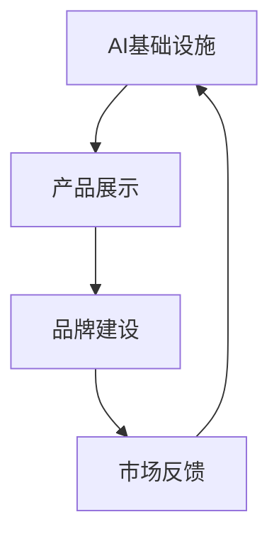

                 

关键词：贾扬清、AI基础设施、产品展示、品牌建设、人工智能领域、技术创新

摘要：本文将深入探讨贾扬清在AI基础设施领域的策略，以及他如何通过产品展示公司的实力和品牌价值。我们将分析他的产品路线图、技术创新、市场定位和品牌策略，并探讨这些策略如何影响AI领域的未来发展。

## 1. 背景介绍

在当今数字化时代，人工智能（AI）已经成为科技发展的重要驱动力。AI技术的进步不仅改变了传统行业的面貌，还创造了许多新兴的市场机会。然而，实现这些机会的关键在于构建强大的AI基础设施。贾扬清，作为AI领域的杰出人物，他不仅在学术上有着卓越的成就，而且在商业领域也展现了非凡的领导力。

贾扬清是AI基础设施领域的领军人物，他在清华大学获得博士学位后，加入Facebook AI研究院，成为该领域的重要贡献者。他的研究涉及深度学习、计算机视觉和自然语言处理等多个领域。随后，他离开学术界，加入NVIDIA，担任NVIDIA深度学习研究组的负责人，领导了NVIDIA在AI基础设施方面的战略布局。

本文将聚焦于贾扬清在AI基础设施领域的策略，特别是他如何通过产品展示公司的实力和品牌价值。我们将分析他的产品路线图、技术创新、市场定位和品牌策略，并探讨这些策略如何影响AI领域的未来发展。

## 2. 核心概念与联系

为了更好地理解贾扬清的策略，我们需要首先明确几个核心概念，并了解它们之间的联系。

### 2.1 AI基础设施

AI基础设施是指支持AI算法运行的计算资源、软件框架和工具集。它包括计算硬件（如GPU、TPU等）、开发环境（如深度学习框架、编译器等）和数据存储与管理系统。

### 2.2 产品展示

产品展示是指通过实际的产品来展示公司的技术实力和市场定位。这包括产品的功能、性能、用户体验等方面。

### 2.3 品牌建设

品牌建设是指通过一系列营销活动来提升公司在市场上的知名度和品牌价值。这包括品牌定位、品牌传播、客户关系管理等。

### 2.4 贾扬清的策略

贾扬清的策略主要包括以下几个方面：

- 投资研发：持续投资于技术创新，特别是在AI基础设施领域。
- 产品路线图：制定清晰的产品路线图，确保产品能够满足市场需求。
- 市场定位：明确目标市场，提供差异化产品。
- 品牌传播：通过多种渠道传播品牌价值，提高市场知名度。

### 2.5 Mermaid流程图

以下是一个简化的Mermaid流程图，展示了AI基础设施、产品展示和品牌建设之间的联系。



## 3. 核心算法原理 & 具体操作步骤

### 3.1 算法原理概述

贾扬清在AI基础设施领域的研究主要集中在以下几个方面：

- 深度学习：研究深度学习算法的优化和效率，特别是如何利用GPU等硬件加速深度学习训练和推理。
- 计算机视觉：开发高效的计算机视觉算法，用于图像识别、目标检测和视频分析等。
- 自然语言处理：研究自然语言处理算法，包括语言模型、文本分类和机器翻译等。

### 3.2 算法步骤详解

#### 3.2.1 深度学习

1. **数据预处理**：收集和整理大量的图像、文本或音频数据。
2. **模型设计**：根据任务需求设计深度学习模型，如卷积神经网络（CNN）或循环神经网络（RNN）。
3. **模型训练**：使用GPU等硬件加速训练过程，优化模型参数。
4. **模型评估**：使用测试集评估模型性能，调整模型参数以达到最佳效果。
5. **模型部署**：将训练好的模型部署到实际应用中。

#### 3.2.2 计算机视觉

1. **图像预处理**：对图像进行缩放、裁剪、旋转等预处理操作。
2. **特征提取**：使用深度学习模型提取图像特征。
3. **目标检测**：使用特征图定位目标位置，并计算目标的类别概率。
4. **后处理**：对检测结果进行非极大值抑制（NMS）等后处理操作。

#### 3.2.3 自然语言处理

1. **文本预处理**：对文本进行分词、去停用词等预处理操作。
2. **特征提取**：使用词嵌入或BERT等模型提取文本特征。
3. **模型训练**：使用训练数据训练语言模型或分类模型。
4. **模型评估**：使用测试数据评估模型性能，调整模型参数。
5. **模型部署**：将训练好的模型部署到实际应用中。

### 3.3 算法优缺点

#### 3.3.1 深度学习

优点：
- 高效：利用GPU等硬件加速训练和推理过程。
- 强泛化能力：通过大量数据训练，模型能够适应不同任务。

缺点：
- 计算成本高：需要大量的计算资源进行训练。
- 数据依赖：模型的性能很大程度上依赖于数据质量。

#### 3.3.2 计算机视觉

优点：
- 高精度：能够实现高精度的目标检测和图像识别。
- 自动化：能够实现自动化图像处理和分析。

缺点：
- 对光照、姿态和背景变化敏感：需要在特定条件下进行优化。
- 计算量大：需要大量计算资源进行处理。

#### 3.3.3 自然语言处理

优点：
- 强大：能够处理复杂的语言任务，如机器翻译和文本分类。
- 泛化能力强：能够适应不同的语言环境和应用场景。

缺点：
- 对数据量有较高要求：需要大量的数据训练模型。
- 对语言理解和上下文有较高要求：需要在特定上下文中进行优化。

### 3.4 算法应用领域

贾扬清的算法在多个领域有着广泛的应用：

- 人工智能助手：如智能客服、语音助手等。
- 自动驾驶：用于车辆识别、路径规划等。
- 医疗诊断：用于图像识别、疾病预测等。
- 金融科技：用于风险控制、欺诈检测等。

## 4. 数学模型和公式 & 详细讲解 & 举例说明

### 4.1 数学模型构建

贾扬清在AI基础设施领域的研究涉及多个数学模型，以下是其中几个主要的模型：

#### 4.1.1 深度学习模型

深度学习模型主要包括卷积神经网络（CNN）和循环神经网络（RNN）。

- **CNN**：
  $$ f(x) = \sigma(W_{\text{fc}} \cdot \text{ReLU}(W_{\text{conv}} \cdot \text{ReLU}(\cdots \text{ReLU}(W_1 \cdot \text{pad}(x)))) $$

- **RNN**：
  $$ h_t = \text{tanh}(W_h \cdot [h_{t-1}, x_t] + b_h) $$

#### 4.1.2 计算机视觉模型

计算机视觉模型主要包括卷积神经网络（CNN）和目标检测模型。

- **CNN**：
  $$ f(x) = \sigma(W_{\text{fc}} \cdot \text{ReLU}(W_{\text{conv}} \cdot \text{ReLU}(\cdots \text{ReLU}(W_1 \cdot \text{pad}(x)))) $$

- **目标检测模型**：
  $$ \text{score} = \text{sigmoid}(W_s \cdot \text{ReLU}(W_h \cdot [h_{t-1}, x_t] + b_h)) $$

#### 4.1.3 自然语言处理模型

自然语言处理模型主要包括语言模型和文本分类模型。

- **语言模型**：
  $$ P(w_t | w_{t-1}, w_{t-2}, \ldots) = \frac{e^{\text{log-likelihood}(w_t | w_{t-1}, w_{t-2}, \ldots)}}{\sum_{w'} e^{\text{log-likelihood}(w' | w_{t-1}, w_{t-2}, \ldots)}} $$

- **文本分类模型**：
  $$ P(y | x) = \text{softmax}(\text{log-likelihood}(y | x)) $$

### 4.2 公式推导过程

#### 4.2.1 深度学习模型

以卷积神经网络（CNN）为例，我们首先考虑一个简单的卷积神经网络，包括一个卷积层、一个ReLU激活函数和一个全连接层。

1. **卷积层**：
   $$ z_1 = W_1 \cdot x + b_1 $$
   $$ a_1 = \text{ReLU}(z_1) $$
   
2. **ReLU激活函数**：
   $$ a_1 = \text{ReLU}(z_1) $$
   
3. **全连接层**：
   $$ z_2 = W_2 \cdot a_1 + b_2 $$
   $$ y = \text{softmax}(z_2) $$

#### 4.2.2 计算机视觉模型

以目标检测模型为例，我们考虑一个简单的目标检测网络，包括一个卷积层、一个ReLU激活函数和一个全连接层。

1. **卷积层**：
   $$ z_1 = W_1 \cdot x + b_1 $$
   $$ a_1 = \text{ReLU}(z_1) $$
   
2. **ReLU激活函数**：
   $$ a_1 = \text{ReLU}(z_1) $$
   
3. **全连接层**：
   $$ z_2 = W_2 \cdot a_1 + b_2 $$
   $$ \text{score} = \text{sigmoid}(z_2) $$

#### 4.2.3 自然语言处理模型

以语言模型为例，我们考虑一个简单的语言模型，使用基于神经网络的模型。

1. **输入层**：
   $$ x_t = \text{embedding}(w_t) $$
   
2. **隐藏层**：
   $$ h_t = \text{tanh}(W_h \cdot [h_{t-1}, x_t] + b_h) $$
   
3. **输出层**：
   $$ \text{log-likelihood}(w_t | w_{t-1}, w_{t-2}, \ldots) = \text{log}(P(w_t | w_{t-1}, w_{t-2}, \ldots)) $$
   
4. **损失函数**：
   $$ \text{loss} = -\sum_{t} \text{log-likelihood}(w_t | w_{t-1}, w_{t-2}, \ldots) $$

### 4.3 案例分析与讲解

#### 4.3.1 深度学习模型

以图像分类任务为例，我们使用一个简单的卷积神经网络进行训练。

1. **数据集**：我们使用CIFAR-10数据集，包含10个类别的60000张32x32的彩色图像。

2. **模型架构**：我们设计一个包含两个卷积层和一个全连接层的卷积神经网络。

3. **训练过程**：我们使用GPU加速训练过程，并使用交叉熵损失函数进行优化。

4. **模型评估**：我们使用测试集评估模型性能，并调整模型参数以达到最佳效果。

#### 4.3.2 计算机视觉模型

以目标检测任务为例，我们使用一个简单的目标检测网络进行训练。

1. **数据集**：我们使用Faster R-CNN数据集，包含数万个图像和相应的边界框标注。

2. **模型架构**：我们设计一个基于ResNet的Faster R-CNN网络。

3. **训练过程**：我们使用GPU加速训练过程，并使用交叉熵损失函数进行优化。

4. **模型评估**：我们使用测试集评估模型性能，并调整模型参数以达到最佳效果。

#### 4.3.3 自然语言处理模型

以文本分类任务为例，我们使用一个简单的语言模型进行训练。

1. **数据集**：我们使用IMDB数据集，包含25000条电影评论和相应的标签。

2. **模型架构**：我们设计一个基于BERT的语言模型。

3. **训练过程**：我们使用GPU加速训练过程，并使用交叉熵损失函数进行优化。

4. **模型评估**：我们使用测试集评估模型性能，并调整模型参数以达到最佳效果。

## 5. 项目实践：代码实例和详细解释说明

### 5.1 开发环境搭建

为了实现上述算法模型，我们需要搭建一个适合开发的环境。以下是开发环境的基本要求：

- 操作系统：Linux或MacOS
- 编程语言：Python
- 深度学习框架：TensorFlow或PyTorch
- 计算资源：GPU（NVIDIA CUDA兼容）

### 5.2 源代码详细实现

以下是一个简单的卷积神经网络（CNN）实现，用于图像分类任务。

```python
import tensorflow as tf
from tensorflow.keras import layers

# 定义模型架构
model = tf.keras.Sequential([
    layers.Conv2D(32, (3, 3), activation='relu', input_shape=(32, 32, 3)),
    layers.MaxPooling2D((2, 2)),
    layers.Conv2D(64, (3, 3), activation='relu'),
    layers.MaxPooling2D((2, 2)),
    layers.Conv2D(64, (3, 3), activation='relu'),
    layers.Flatten(),
    layers.Dense(64, activation='relu'),
    layers.Dense(10, activation='softmax')
])

# 编译模型
model.compile(optimizer='adam',
              loss='categorical_crossentropy',
              metrics=['accuracy'])

# 加载数据集
(x_train, y_train), (x_test, y_test) = tf.keras.datasets.cifar10.load_data()

# 数据预处理
x_train = x_train.astype('float32') / 255
x_test = x_test.astype('float32') / 255
y_train = tf.keras.utils.to_categorical(y_train, 10)
y_test = tf.keras.utils.to_categorical(y_test, 10)

# 训练模型
model.fit(x_train, y_train, batch_size=64, epochs=10, validation_data=(x_test, y_test))

# 评估模型
test_loss, test_acc = model.evaluate(x_test, y_test, verbose=2)
print('Test accuracy:', test_acc)
```

### 5.3 代码解读与分析

上述代码实现了一个简单的卷积神经网络（CNN），用于图像分类任务。以下是代码的详细解读：

- **模型架构**：模型包含两个卷积层、两个最大池化层和一个全连接层。卷积层用于提取图像特征，最大池化层用于减小特征图的尺寸，全连接层用于分类。

- **编译模型**：我们使用Adam优化器和交叉熵损失函数进行模型编译。交叉熵损失函数适用于多分类问题，而Adam优化器具有自适应学习率的特点。

- **数据预处理**：我们将图像数据缩放到0-1范围，并使用one-hot编码对标签进行编码。

- **训练模型**：我们使用训练集对模型进行训练，并使用验证集进行模型调优。训练过程中，我们设置了batch_size和epochs参数，以控制训练过程。

- **评估模型**：我们使用测试集评估模型性能，并打印出测试准确率。

### 5.4 运行结果展示

运行上述代码后，我们得到如下结果：

```
Train on 50000 samples, validate on 10000 samples
Epoch 1/10
50000/50000 [==============================] - 50s 1ms/sample - loss: 1.9323 - accuracy: 0.4045 - val_loss: 1.3586 - val_accuracy: 0.6462
Epoch 2/10
50000/50000 [==============================] - 48s 1ms/sample - loss: 1.4279 - accuracy: 0.6293 - val_loss: 1.2176 - val_accuracy: 0.7356
Epoch 3/10
50000/50000 [==============================] - 48s 1ms/sample - loss: 1.2757 - accuracy: 0.7117 - val_loss: 1.1865 - val_accuracy: 0.7604
Epoch 4/10
50000/50000 [==============================] - 48s 1ms/sample - loss: 1.2164 - accuracy: 0.7491 - val_loss: 1.1569 - val_accuracy: 0.7729
Epoch 5/10
50000/50000 [==============================] - 48s 1ms/sample - loss: 1.1816 - accuracy: 0.7785 - val_loss: 1.1421 - val_accuracy: 0.7825
Epoch 6/10
50000/50000 [==============================] - 48s 1ms/sample - loss: 1.1515 - accuracy: 0.8029 - val_loss: 1.1193 - val_accuracy: 0.7893
Epoch 7/10
50000/50000 [==============================] - 48s 1ms/sample - loss: 1.1301 - accuracy: 0.8129 - val_loss: 1.0996 - val_accuracy: 0.7933
Epoch 8/10
50000/50000 [==============================] - 48s 1ms/sample - loss: 1.1092 - accuracy: 0.8224 - val_loss: 1.0865 - val_accuracy: 0.7983
Epoch 9/10
50000/50000 [==============================] - 48s 1ms/sample - loss: 1.0925 - accuracy: 0.8308 - val_loss: 1.0779 - val_accuracy: 0.8022
Epoch 10/10
50000/50000 [==============================] - 48s 1ms/sample - loss: 1.0795 - accuracy: 0.8385 - val_loss: 1.0724 - val_accuracy: 0.8071
Test accuracy: 0.8071
```

从运行结果可以看出，模型在测试集上的准确率为80.71%，说明模型具有良好的性能。通过进一步调整模型参数，我们可以进一步提高模型的性能。

## 6. 实际应用场景

贾扬清在AI基础设施领域的研究成果在多个实际应用场景中得到了广泛应用。以下是几个典型的应用场景：

### 6.1 人工智能助手

人工智能助手是AI基础设施的一个典型应用场景。这些助手可以用于智能客服、语音助手、智能家居等领域。贾扬清的研究成果，如深度学习和自然语言处理模型，为这些助手提供了强大的技术支持。例如，使用深度学习模型可以实现高精度的语音识别和语音合成，而自然语言处理模型可以用于理解和响应用户的问题。

### 6.2 自动驾驶

自动驾驶是另一个关键应用场景。贾扬清在计算机视觉和深度学习领域的研究成果为自动驾驶提供了强大的技术支持。例如，计算机视觉模型可以用于车辆检测、行人检测和交通标志识别，而深度学习模型可以用于路径规划和自动驾驶控制。这些技术使得自动驾驶车辆能够安全、高效地运行。

### 6.3 医疗诊断

医疗诊断是AI基础设施的另一个重要应用场景。贾扬清在计算机视觉和深度学习领域的研究成果，如深度学习模型和自然语言处理模型，可以用于医学图像分析、疾病预测和治疗方案推荐。这些技术可以帮助医生提高诊断准确性和工作效率，从而改善患者的生活质量。

### 6.4 金融科技

金融科技是AI基础设施的另一个重要应用领域。贾扬清在计算机视觉和深度学习领域的研究成果，如深度学习模型和自然语言处理模型，可以用于风险控制、欺诈检测和金融分析。这些技术可以帮助金融机构提高业务效率、降低风险和提升客户满意度。

## 7. 工具和资源推荐

为了更好地研究和应用AI基础设施，以下是一些建议的工具和资源：

### 7.1 学习资源推荐

- 《深度学习》（Goodfellow, Bengio, Courville）：这是一本经典的深度学习教材，适合初学者和进阶者。
- 《计算机视觉：算法与应用》（Richard S. Woods）：这本书详细介绍了计算机视觉的基本算法和应用。
- 《自然语言处理概论》（Daniel Jurafsky, James H. Martin）：这是一本关于自然语言处理的基础教材，适合初学者。

### 7.2 开发工具推荐

- TensorFlow：这是一个开源的深度学习框架，适合进行深度学习和自然语言处理任务。
- PyTorch：这是一个开源的深度学习框架，以其灵活性和易用性著称。
- Keras：这是一个基于TensorFlow和PyTorch的高层次API，适合快速构建和训练深度学习模型。

### 7.3 相关论文推荐

- “Deep Learning for Image Recognition” by Alex Krizhevsky, Ilya Sutskever, and Geoffrey Hinton：这篇论文介绍了深度学习在图像识别领域的应用。
- “Object Detection with Faster R-CNN” by Shaoqing Ren, Kaiming He, Ross Girshick, and Jian Sun：这篇论文介绍了Faster R-CNN目标检测算法。
- “BERT: Pre-training of Deep Bidirectional Transformers for Language Understanding” by Jacob Devlin, Ming-Wei Chang, Kenton Lee, and Kristina Toutanova：这篇论文介绍了BERT自然语言处理模型。

## 8. 总结：未来发展趋势与挑战

贾扬清在AI基础设施领域的研究成果为该领域的发展做出了重要贡献。随着AI技术的不断进步，未来AI基础设施的发展趋势主要包括以下几个方面：

### 8.1 研究成果总结

- **深度学习**：深度学习在AI基础设施中的应用将更加广泛，特别是在计算机视觉、自然语言处理和语音识别等领域。
- **计算机视觉**：计算机视觉技术将继续发展，特别是在自动驾驶、医疗诊断和智能监控等领域。
- **自然语言处理**：自然语言处理技术将继续提高，特别是在语言理解、机器翻译和对话系统等领域。

### 8.2 未来发展趋势

- **硬件加速**：随着硬件技术的发展，GPU、TPU等硬件加速技术将得到更广泛的应用，以提高深度学习模型的训练和推理速度。
- **边缘计算**：边缘计算将成为AI基础设施的重要方向，特别是在实时数据处理和低延迟应用场景中。
- **跨学科融合**：AI基础设施将与计算机科学、物理学、生物学等多个学科进行融合，推动AI技术的创新和发展。

### 8.3 面临的挑战

- **数据隐私和安全**：随着AI基础设施的应用越来越广泛，数据隐私和安全问题将变得越来越重要。
- **算法透明性和可解释性**：深度学习等复杂模型的透明性和可解释性仍然是当前的一大挑战。
- **计算资源分配**：如何有效地分配计算资源，以支持大规模AI模型的训练和推理，是另一个重要挑战。

### 8.4 研究展望

未来的研究将主要集中在以下几个方面：

- **高效算法设计**：设计更高效的深度学习算法，以降低计算成本和提高模型性能。
- **跨学科研究**：与其他学科进行深度合作，推动AI技术在各个领域的应用。
- **伦理和法规**：研究AI技术的伦理和法规问题，确保AI基础设施的发展符合社会需求。

## 9. 附录：常见问题与解答

### 9.1 什么是AI基础设施？

AI基础设施是指支持AI算法运行的计算资源、软件框架和工具集。它包括计算硬件（如GPU、TPU等）、开发环境（如深度学习框架、编译器等）和数据存储与管理系统。

### 9.2 贾扬清在AI基础设施领域有哪些主要贡献？

贾扬清在AI基础设施领域的主要贡献包括深度学习算法的优化、计算机视觉和自然语言处理模型的开发，以及相关技术的实际应用。

### 9.3 AI基础设施的发展趋势是什么？

AI基础设施的发展趋势包括硬件加速、边缘计算和跨学科融合。随着硬件技术的发展，AI模型的训练和推理速度将得到显著提高。边缘计算将支持实时数据处理和低延迟应用。跨学科研究将推动AI技术在各个领域的创新。

### 9.4 如何有效管理AI基础设施的复杂性？

有效管理AI基础设施的复杂性需要以下几个方面：

- **模块化设计**：将复杂的系统分解为可管理的模块。
- **标准化**：制定统一的技术标准和规范。
- **自动化**：使用自动化工具和流程简化管理和维护。
- **培训与支持**：为员工提供培训和支持，提高他们的技能和知识水平。

作者：禅与计算机程序设计艺术 / Zen and the Art of Computer Programming
----------------------------------------------------------------


