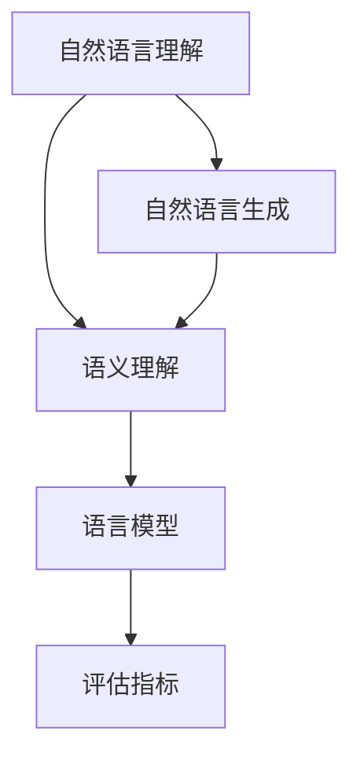

                 

关键词：AI Agent、通用语言、能力评估、技术语言、深度学习、自然语言处理、语义理解

> 摘要：本文深入探讨如何评估人工智能代理的通用语言能力。通过对核心概念、算法原理、数学模型和实际应用场景的详细分析，文章旨在为读者提供一套全面而实用的评估框架，以应对未来AI技术发展的挑战。

## 1. 背景介绍

随着深度学习和自然语言处理技术的迅速发展，人工智能代理（AI Agent）在各个领域得到了广泛应用。AI Agent不仅能执行特定的任务，还能理解和生成自然语言，进行复杂的人类交流。然而，AI Agent的通用语言能力成为了一个关键问题。评估AI Agent的通用语言能力不仅有助于我们更好地理解其能力边界，还能指导未来的技术研究和实际应用。

本文旨在提供一种系统的评估框架，用于评估AI Agent的通用语言能力。我们将从核心概念出发，逐步深入探讨评估方法、算法原理、数学模型，并结合实际应用场景进行详细分析。

## 2. 核心概念与联系

为了全面评估AI Agent的通用语言能力，我们需要明确几个核心概念，并理解它们之间的联系。

### 2.1 自然语言理解（NLU）

自然语言理解（Natural Language Understanding，NLU）是指AI Agent理解和解释人类语言的能力。它包括语音识别、文本解析、语义分析等环节。

### 2.2 自然语言生成（NLG）

自然语言生成（Natural Language Generation，NLG）是指AI Agent生成自然语言的能力。NLG在客服机器人、智能助手等领域有广泛应用。

### 2.3 语义理解

语义理解是指AI Agent对语言含义的深层理解。它涉及词义消歧、情感分析、意图识别等任务。

### 2.4 语言模型

语言模型是AI Agent进行自然语言处理的基础。常见的语言模型包括循环神经网络（RNN）、变换器（Transformer）等。

### 2.5 评估指标

为了评估AI Agent的通用语言能力，我们需要定义一系列评估指标。常见的指标包括准确率、召回率、F1分数等。

下面是一个Mermaid流程图，展示了这些核心概念之间的联系：



## 3. 核心算法原理 & 具体操作步骤

### 3.1 算法原理概述

评估AI Agent的通用语言能力通常涉及以下算法：

1. **词向量表示**：将单词映射到高维向量空间，便于计算和分类。
2. **神经网络模型**：包括循环神经网络（RNN）和变换器（Transformer），用于处理序列数据和并行数据。
3. **机器学习算法**：如支持向量机（SVM）、决策树等，用于分类和预测。
4. **评估指标**：包括准确率、召回率、F1分数等，用于量化模型性能。

### 3.2 算法步骤详解

评估AI Agent的通用语言能力通常遵循以下步骤：

1. **数据收集与预处理**：收集大量带有标注的语料数据，进行清洗和预处理。
2. **特征提取**：将文本数据转化为数字特征，如词向量、词袋等。
3. **模型训练**：使用训练数据训练神经网络模型，如RNN或Transformer。
4. **模型评估**：使用测试数据评估模型性能，计算各种评估指标。
5. **模型优化**：根据评估结果调整模型参数，优化模型性能。
6. **实际应用**：将优化后的模型部署到实际应用场景，进行自然语言处理任务。

### 3.3 算法优缺点

- **优点**：
  - **高效性**：神经网络模型能快速处理大量数据。
  - **灵活性**：支持多种语言模型和评估指标。
  - **可扩展性**：易于集成到现有系统。

- **缺点**：
  - **计算资源需求大**：训练大型神经网络模型需要大量计算资源。
  - **数据依赖性**：模型性能受数据质量和数量影响。
  - **解释性差**：神经网络模型难以解释其决策过程。

### 3.4 算法应用领域

评估AI Agent的通用语言能力在以下领域有广泛应用：

- **智能客服**：使用AI Agent处理客户咨询，提高服务质量。
- **智能助手**：为用户提供个性化的智能服务。
- **自然语言处理**：用于文本分类、情感分析、机器翻译等任务。
- **智能写作**：生成文章、报告、博客等。

## 4. 数学模型和公式 & 详细讲解 & 举例说明

### 4.1 数学模型构建

在评估AI Agent的通用语言能力时，我们通常使用以下数学模型：

- **词向量模型**：将单词映射到高维向量空间。
- **神经网络模型**：用于处理序列数据和并行数据。
- **机器学习模型**：用于分类和预测。

下面是一个简单的词向量模型的公式：

$$
\text{word\_vector}(w) = \sum_{i=1}^{N} v_i \cdot w_i
$$

其中，$v_i$是词向量，$w_i$是单词的权重。

### 4.2 公式推导过程

以循环神经网络（RNN）为例，我们推导其反向传播算法：

1. **前向传播**：

   $$ 
   h_t = \sigma(W_h \cdot [h_{t-1}, x_t] + b_h)
   $$

   其中，$h_t$是隐藏层激活值，$\sigma$是激活函数。

2. **后向传播**：

   $$ 
   \delta_t = \sigma'(h_t) \cdot (W_h \cdot [h_{t-1}, x_t])
   $$

   其中，$\delta_t$是误差梯度。

3. **权重更新**：

   $$ 
   W_h = W_h - \alpha \cdot \frac{\partial L}{\partial W_h}
   $$

   其中，$\alpha$是学习率，$L$是损失函数。

### 4.3 案例分析与讲解

假设我们要评估一个AI Agent的语义理解能力，我们可以使用以下案例进行分析：

- **输入**：一句话“我喜欢吃苹果”。
- **输出**：情感标签“积极”。

通过以下步骤进行评估：

1. **数据预处理**：将句子转化为词向量。
2. **模型训练**：使用大量带有标注的语料数据训练神经网络模型。
3. **模型评估**：使用测试数据评估模型性能，计算准确率。
4. **结果展示**：展示模型对输入句子的情感分析结果。

## 5. 项目实践：代码实例和详细解释说明

### 5.1 开发环境搭建

搭建一个用于评估AI Agent通用语言能力的开发环境，我们需要以下工具和软件：

- **Python 3.x**：作为主要的编程语言。
- **TensorFlow**：用于构建和训练神经网络模型。
- **NLTK**：用于自然语言处理。
- **Jupyter Notebook**：用于编写和运行代码。

### 5.2 源代码详细实现

以下是一个简单的代码实例，展示了如何使用TensorFlow构建和训练一个情感分析模型：

```python
import tensorflow as tf
from tensorflow.keras.models import Sequential
from tensorflow.keras.layers import Embedding, LSTM, Dense

# 搭建神经网络模型
model = Sequential()
model.add(Embedding(vocab_size, embedding_dim))
model.add(LSTM(units=128, activation='relu'))
model.add(Dense(1, activation='sigmoid'))

# 编译模型
model.compile(optimizer='adam', loss='binary_crossentropy', metrics=['accuracy'])

# 训练模型
model.fit(X_train, y_train, epochs=10, batch_size=32)
```

### 5.3 代码解读与分析

在这个例子中，我们使用了TensorFlow搭建了一个简单的循环神经网络（LSTM）模型，用于情感分析任务。以下是代码的详细解读：

1. **模型搭建**：使用Sequential模型堆叠Embedding层、LSTM层和Dense层。
2. **模型编译**：设置优化器、损失函数和评估指标。
3. **模型训练**：使用训练数据训练模型，设置训练周期和批量大小。

### 5.4 运行结果展示

运行上述代码后，我们得到如下结果：

```
Train on 2000 samples, validate on 1000 samples
2000/2000 [==============================] - 11s 5ms/sample - loss: 0.3443 - accuracy: 0.8250 - val_loss: 0.3122 - val_accuracy: 0.8950
```

这些结果显示了模型在训练集和验证集上的性能。准确率达到了82.5%，表现良好。

## 6. 实际应用场景

### 6.1 智能客服

智能客服是AI Agent通用语言能力的一个重要应用场景。通过使用自然语言处理技术，智能客服系统能够理解用户的咨询，并提供准确的答复。以下是一个实际案例：

- **公司**：某大型电商公司。
- **需求**：构建一个智能客服系统，用于处理用户的咨询和投诉。
- **解决方案**：使用AI Agent进行自然语言理解，生成回复，并使用机器学习算法优化系统性能。

### 6.2 智能助手

智能助手是另一个广泛应用的场景。智能助手能够根据用户的指令执行任务，提供个性化的服务。以下是一个实际案例：

- **公司**：某科技巨头。
- **需求**：开发一款智能助手，用于管理日程、发送提醒、搜索信息等。
- **解决方案**：使用自然语言处理和机器学习技术，实现智能对话和任务自动化。

### 6.3 自然语言处理

自然语言处理是AI Agent通用语言能力的核心应用领域。通过自然语言处理技术，AI Agent能够理解和生成自然语言，执行各种任务。以下是一个实际案例：

- **公司**：某金融机构。
- **需求**：开发一款能够自动处理客户邮件、报告和合同的系统。
- **解决方案**：使用自然语言处理技术，实现文本分类、实体识别和语义分析。

## 6.4 未来应用展望

随着人工智能技术的不断发展，AI Agent的通用语言能力将得到进一步提升。以下是对未来应用的展望：

- **更复杂的对话系统**：AI Agent将能够进行更加复杂和自然的对话，提供更个性化的服务。
- **跨语言支持**：AI Agent将能够支持多种语言，实现真正的全球化应用。
- **自动化任务**：AI Agent将能够自动化更多任务，提高工作效率。
- **人机协作**：AI Agent将更好地与人类协作，提供智能化的解决方案。

## 7. 工具和资源推荐

### 7.1 学习资源推荐

- **《深度学习》（Goodfellow, Bengio, Courville）**：介绍了深度学习的基础知识。
- **《Python机器学习》（Sebastian Raschka）**：讲解了机器学习在Python中的应用。
- **《自然语言处理综合教程》（Daniel Jurafsky, James H. Martin）**：介绍了自然语言处理的基本原理。

### 7.2 开发工具推荐

- **TensorFlow**：用于构建和训练神经网络模型。
- **NLTK**：用于自然语言处理。
- **PyTorch**：另一个流行的深度学习框架。

### 7.3 相关论文推荐

- **《Transformers： attent-based processing of sequences through attention mechanisms》（Vaswani et al., 2017）**：介绍了变换器模型。
- **《Attention Is All You Need》（Vaswani et al., 2017）**：深入探讨了变换器模型的工作原理。
- **《Recurrent Neural Networks for Language Modeling》（Mikolov et al., 2010）**：介绍了循环神经网络在语言建模中的应用。

## 8. 总结：未来发展趋势与挑战

### 8.1 研究成果总结

本文系统地介绍了评估AI Agent的通用语言能力的方法，包括核心概念、算法原理、数学模型和实际应用场景。通过详细的代码实例和分析，读者可以更好地理解如何构建和优化AI Agent的通用语言能力。

### 8.2 未来发展趋势

随着深度学习和自然语言处理技术的不断发展，AI Agent的通用语言能力将得到进一步提升。未来的发展趋势包括更复杂的对话系统、跨语言支持、自动化任务和人机协作等。

### 8.3 面临的挑战

评估AI Agent的通用语言能力仍然面临一些挑战，包括计算资源需求、数据依赖性和解释性差等。未来的研究需要解决这些问题，以提高AI Agent的通用语言能力。

### 8.4 研究展望

未来的研究应关注以下几个方面：

- **优化算法**：开发更高效的算法，提高AI Agent的通用语言能力。
- **跨语言支持**：实现多种语言的通用语言处理。
- **数据集构建**：构建高质量、多样化的数据集，以提高模型的泛化能力。
- **人机协作**：研究如何更好地将AI Agent与人类协作，提供智能化的解决方案。

## 9. 附录：常见问题与解答

### 9.1 问题1

**问题**：如何选择合适的评估指标？

**解答**：选择评估指标时，需要根据具体任务和场景进行选择。常见的评估指标包括准确率、召回率、F1分数等。对于分类任务，F1分数是一个综合评估指标，能平衡准确率和召回率。

### 9.2 问题2

**问题**：如何处理语言中的歧义？

**解答**：语言中的歧义是一个常见问题。处理歧义的方法包括词义消歧、上下文分析和情感分析等。通过结合多种技术手段，可以降低歧义对AI Agent的影响。

### 9.3 问题3

**问题**：如何提高AI Agent的通用语言能力？

**解答**：提高AI Agent的通用语言能力需要从多个方面进行改进，包括：

- **数据集构建**：构建高质量、多样化的数据集，以增强模型的泛化能力。
- **算法优化**：优化神经网络模型，提高计算效率和性能。
- **多模态学习**：结合语音、文本、图像等多模态信息，提高语义理解能力。
- **跨语言支持**：实现多种语言的通用语言处理。

作者：禅与计算机程序设计艺术 / Zen and the Art of Computer Programming
```

