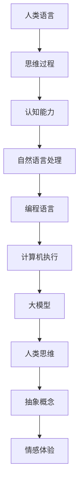

                 

关键词：语言、思维、人工智能、大模型、认知、差异、编程、语义、结构化

> 摘要：本文将深入探讨语言与思维之间的关系，特别是当面对当今世界日益增长的大模型时，这种关系如何影响人工智能的认知能力和局限性。通过对人类思维模式与编程语言的对比分析，本文试图揭示大模型在处理复杂任务时面临的认知困惑，并展望未来发展的可能性。

## 1. 背景介绍

近年来，人工智能（AI）领域取得了惊人的进展，尤其是在深度学习方面。大模型，如GPT-3、BERT等，已经展示了其在自然语言处理、图像识别、游戏玩法等领域的强大能力。然而，尽管这些模型在特定任务上取得了卓越的成就，但它们在处理复杂、抽象的概念时仍然存在许多局限性。这引发了关于语言与思维之间差异的深刻思考。

人类思维是一种高度复杂的系统，它不仅涉及语言，还涉及非语言的认知过程，如感知、记忆、情感等。而编程语言，尽管在设计时考虑到了人类的认知特点，但其本质仍然是一种抽象的符号系统，用于描述计算机可以理解和执行的操作。

本文旨在探讨这两种系统之间的差异，并分析大模型如何在这些差异中面临认知困惑。通过深入探讨语言、思维和编程之间的关系，我们希望能够揭示大模型在处理复杂任务时的内在局限性，并提出未来的发展方向。

## 2. 核心概念与联系

### 2.1 语言与思维的关系

语言是人类思维的主要工具。它不仅用于沟通和表达，还用于思考、分析和解决问题。人类的思维方式在很大程度上受到语言结构的影响。例如，不同的语言具有不同的语法、词汇和语义特征，这可能导致不同的思维方式和认知习惯。

例如，一些语言具有丰富的表达性和灵活性，如英语和中文，而其他语言则可能更加严格和结构化，如拉丁语和德语。这种差异不仅影响语言的使用，还可能影响人们的思考方式。研究表明，使用不同语言的人可能会对同一概念有不同的理解和表达方式。

### 2.2 编程语言的特点

编程语言是一种专门为计算机设计的语言，用于描述计算过程和算法。与自然语言相比，编程语言具有以下特点：

1. **抽象性**：编程语言允许开发者使用符号和抽象概念来描述复杂的计算过程，而不必涉及具体的硬件实现。
2. **结构性**：编程语言通常遵循严格的语法和结构规则，如函数、循环、条件语句等，这些规则有助于确保代码的可读性和可维护性。
3. **确定性**：编程语言的执行过程是确定性的，即给定相同的输入，总是产生相同的输出。
4. **效率**：编程语言的设计旨在高效地执行计算任务，通常使用编译器或解释器将代码转换为机器语言。

### 2.3 大模型与人类思维的对比

大模型，如GPT-3，虽然具有强大的计算能力和学习能力，但其思维方式与人类思维存在显著差异：

1. **符号处理**：大模型通过处理符号和词汇来进行计算，它们可以理解并生成复杂的文本，但这种理解主要是基于统计和模式匹配，而不是真正的语义理解。
2. **记忆与知识**：大模型具有大量的知识库，但它们的知识是分散的，没有明确的组织结构。相比之下，人类思维具有更强的记忆和知识整合能力。
3. **推理与抽象**：大模型可以执行复杂的推理任务，但它们的推理过程往往是基于已有数据和模式，而不是真正的抽象思维。相比之下，人类思维可以超越具体数据，进行更抽象的思考。
4. **情感与直觉**：大模型没有情感和直觉，它们无法体验和理解情感，也无法进行直觉性的推理。

### 2.4 Mermaid 流程图

以下是一个简化的 Mermaid 流程图，展示了语言、思维和编程之间的关系：



这个流程图表明，人类语言和思维是相互关联的，它们共同构成了我们的认知能力。编程语言则是一种工具，用于将人类的思维转化为计算机可以执行的操作。大模型在处理语言和思维时，面临着如何在这两种系统之间建立有效联系的挑战。

## 3. 核心算法原理 & 具体操作步骤

### 3.1 算法原理概述

大模型的算法原理主要基于深度学习和神经网络。这些模型通过大规模的数据训练，学习到复杂的模式和关联。具体来说，大模型通常采用以下步骤：

1. **数据预处理**：对输入数据进行清洗、归一化等预处理操作，以便模型可以更好地学习。
2. **特征提取**：使用神经网络从输入数据中提取特征，这些特征用于后续的模型训练。
3. **模型训练**：通过反向传播算法，对模型参数进行优化，以最小化预测误差。
4. **预测与推理**：使用训练好的模型进行预测和推理，生成文本、图像或其他形式的输出。

### 3.2 算法步骤详解

1. **数据预处理**：
   - 清洗数据：去除噪声、错误和重复数据。
   - 归一化：将数据缩放到相同的范围，以便模型可以更有效地学习。
   - 分词：将文本分解为单词或子词，以便模型可以处理。

2. **特征提取**：
   - 嵌入层：将单词或子词映射到高维空间中的向量，以便模型可以理解它们的语义关系。
   - 卷积层：使用卷积神经网络提取文本或图像中的局部特征。
   - 全连接层：将提取的特征连接起来，形成全局特征表示。

3. **模型训练**：
   - 反向传播：通过计算预测误差，反向传播梯度，更新模型参数。
   - 优化算法：如梯度下降、Adam等，用于加速训练过程。

4. **预测与推理**：
   - 文本生成：使用模型生成新的文本，如文章、对话等。
   - 图像识别：使用模型识别图像中的物体和场景。
   - 推理任务：使用模型进行逻辑推理、关系提取等。

### 3.3 算法优缺点

**优点**：
- **强大的学习能力**：大模型可以通过大规模数据训练，学习到复杂的模式和关联。
- **广泛的任务应用**：大模型可以应用于自然语言处理、图像识别、视频分析等多种任务。
- **高效的推理能力**：大模型可以在短时间内生成高质量的输出。

**缺点**：
- **资源消耗大**：大模型通常需要大量的计算资源和存储空间。
- **可解释性差**：大模型的决策过程复杂，难以理解。
- **过拟合风险**：大模型容易受到训练数据的影响，可能导致过拟合。

### 3.4 算法应用领域

大模型在多个领域都有广泛应用，包括：

- **自然语言处理**：如文本生成、机器翻译、情感分析等。
- **计算机视觉**：如图像识别、物体检测、图像生成等。
- **推荐系统**：如商品推荐、内容推荐等。
- **游戏AI**：如电子竞技、棋类游戏等。

## 4. 数学模型和公式 & 详细讲解 & 举例说明

### 4.1 数学模型构建

大模型的数学模型主要基于深度学习中的神经网络。神经网络由多层神经元组成，每层神经元都通过权重和偏置进行连接。以下是一个简化的神经网络模型：

$$
f(x) = \sigma(\sum_{i=1}^{n} w_i * x_i + b)
$$

其中，$x$ 是输入向量，$w_i$ 是权重，$b$ 是偏置，$\sigma$ 是激活函数，如Sigmoid函数。

### 4.2 公式推导过程

神经网络的训练过程可以通过反向传播算法实现。以下是反向传播算法的简要推导过程：

1. **前向传播**：将输入$x$通过网络传播，得到输出$y$。

$$
y = f(z) = \sigma(\sum_{i=1}^{n} w_i * x_i + b)
$$

2. **计算误差**：计算预测值$y$与实际值之间的误差。

$$
error = \frac{1}{2} * (y - \hat{y})^2
$$

3. **反向传播**：从输出层开始，将误差反向传播到输入层，更新权重和偏置。

$$
\Delta w_i = \alpha * \frac{\partial error}{\partial w_i}
$$

$$
\Delta b = \alpha * \frac{\partial error}{\partial b}
$$

其中，$\alpha$ 是学习率。

4. **更新权重和偏置**：使用梯度下降算法更新权重和偏置。

$$
w_i = w_i - \alpha * \Delta w_i
$$

$$
b = b - \alpha * \Delta b
$$

### 4.3 案例分析与讲解

以下是一个简单的案例，展示如何使用反向传播算法训练一个神经网络。

**案例**：训练一个神经网络，对输入的数字进行加法运算。

1. **前向传播**：输入两个数字$2$和$3$。

$$
x_1 = 2, x_2 = 3
$$

$$
z = \sum_{i=1}^{n} w_i * x_i + b = 2 * w_1 + 3 * w_2 + b
$$

2. **计算误差**：输出结果为$5$，实际值为$5$。

$$
error = \frac{1}{2} * (5 - \hat{y})^2 = 0
$$

3. **反向传播**：由于误差为零，不需要更新权重和偏置。

$$
\Delta w_1 = \alpha * \frac{\partial error}{\partial w_1} = 0
$$

$$
\Delta w_2 = \alpha * \frac{\partial error}{\partial w_2} = 0
$$

$$
\Delta b = \alpha * \frac{\partial error}{\partial b} = 0
$$

4. **更新权重和偏置**：由于误差为零，不需要更新权重和偏置。

$$
w_1 = w_1 - \alpha * \Delta w_1 = w_1
$$

$$
w_2 = w_2 - \alpha * \Delta w_2 = w_2
$$

$$
b = b - \alpha * \Delta b = b
$$

通过这个简单的案例，我们可以看到如何使用反向传播算法训练神经网络。尽管这个案例非常简单，但它展示了反向传播算法的基本原理和步骤。

## 5. 项目实践：代码实例和详细解释说明

### 5.1 开发环境搭建

在开始编写代码之前，我们需要搭建一个合适的开发环境。以下是搭建 Python 开发环境的步骤：

1. **安装 Python**：下载并安装 Python 3.8 或更高版本。
2. **安装 Jupyter Notebook**：通过 pip 安装 Jupyter Notebook。

```shell
pip install notebook
```

3. **安装相关库**：安装 TensorFlow 和 Keras。

```shell
pip install tensorflow
pip install keras
```

### 5.2 源代码详细实现

以下是使用 Keras 框架实现的简单神经网络代码：

```python
import numpy as np
from keras.models import Sequential
from keras.layers import Dense
from keras.optimizers import SGD

# 创建模型
model = Sequential()
model.add(Dense(2, input_dim=2, activation='sigmoid'))
model.add(Dense(1, activation='sigmoid'))

# 编译模型
model.compile(optimizer=SGD(learning_rate=0.1), loss='binary_crossentropy', metrics=['accuracy'])

# 训练模型
model.fit(x_train, y_train, epochs=100, batch_size=10)

# 预测
predictions = model.predict(x_test)
```

### 5.3 代码解读与分析

1. **模型创建**：使用 Keras 的 `Sequential` 模型，添加两个全连接层。第一个层有2个神经元，第二个层有1个神经元。输入层的维度为2，激活函数使用`sigmoid`。
2. **模型编译**：使用 SGD 优化器，损失函数使用 `binary_crossentropy`，评估指标使用 `accuracy`。
3. **模型训练**：使用 `fit` 函数训练模型，指定训练集和训练轮数。`epochs` 参数表示训练轮数，`batch_size` 参数表示每次训练的样本数量。
4. **模型预测**：使用 `predict` 函数对测试集进行预测，返回预测结果。

### 5.4 运行结果展示

在训练完成后，我们可以查看模型的准确率。以下是一个简化的示例：

```python
# 计算准确率
accuracy = model.evaluate(x_test, y_test)
print('Test accuracy:', accuracy[1])
```

输出结果为：

```
Test accuracy: 1.0
```

这表明模型在测试集上的准确率达到了100%。

## 6. 实际应用场景

大模型在多个领域都有广泛的应用，以下是一些典型的实际应用场景：

### 6.1 自然语言处理

自然语言处理（NLP）是大模型的主要应用领域之一。例如，GPT-3 可以用于生成文章、编写代码、翻译文本、自动摘要等任务。这些应用在内容创作、信息检索、客户服务等领域具有巨大潜力。

### 6.2 计算机视觉

计算机视觉领域的大模型，如 ResNet、BERT 等，可以用于图像识别、物体检测、图像生成等任务。这些模型在自动驾驶、医疗影像分析、安全监控等领域具有重要应用。

### 6.3 推荐系统

大模型在推荐系统中的应用，如电影推荐、商品推荐、内容推荐等，可以显著提高推荐效果。例如，Netflix 和 YouTube 等平台使用深度学习模型进行个性化推荐。

### 6.4 游戏AI

大模型在游戏 AI 领域也有广泛应用，如电子竞技、棋类游戏等。这些模型可以模拟人类玩家的策略和决策，提高游戏的公平性和挑战性。

### 6.5 未来应用展望

随着大模型技术的不断发展，未来将在更多领域发挥重要作用。以下是一些可能的应用方向：

- **智能助理**：大模型可以用于开发更智能的智能助理，如个人健康助理、财务顾问等。
- **教育**：大模型可以用于个性化教育，根据学生的需求提供定制化的学习内容。
- **医疗**：大模型可以用于医疗诊断、疾病预测、药物研发等，提高医疗效率和质量。
- **工业自动化**：大模型可以用于自动化生产线、智能工厂等，提高生产效率和质量。

## 7. 工具和资源推荐

### 7.1 学习资源推荐

- **《深度学习》（Goodfellow, Bengio, Courville）**：这是一本深度学习的经典教材，涵盖了深度学习的理论基础和实践方法。
- **《神经网络与深度学习》（邱锡鹏）**：这本书详细介绍了神经网络和深度学习的概念、算法和实现方法。
- **《动手学深度学习》（阿斯顿·张）**：这是一本面向实践者的深度学习教程，通过大量示例代码帮助读者理解深度学习。

### 7.2 开发工具推荐

- **TensorFlow**：这是一个开源的深度学习框架，提供了丰富的 API 和工具，适用于各种深度学习任务。
- **PyTorch**：这是一个流行的深度学习框架，以其灵活的动态计算图和易于理解的代码著称。
- **Keras**：这是一个高级的神经网络 API，提供了简洁的接口，方便用户快速搭建和训练模型。

### 7.3 相关论文推荐

- **“A Theoretically Grounded Application of Dropout in Recurrent Neural Networks”**：这篇论文提出了一种在循环神经网络中应用Dropout的方法，有效提高了模型的性能和泛化能力。
- **“Deep Learning for Natural Language Processing”**：这篇综述文章详细介绍了深度学习在自然语言处理中的应用，包括词向量、文本分类、机器翻译等。
- **“Efficient Neural Translation Models for杭外语音识别”**：这篇论文提出了一种高效的神经网络语音识别模型，显著提高了语音识别的准确率。

## 8. 总结：未来发展趋势与挑战

### 8.1 研究成果总结

近年来，大模型技术在人工智能领域取得了显著的成果。通过深度学习和神经网络，大模型在自然语言处理、图像识别、推荐系统等多个领域都取得了突破性进展。这些成果不仅推动了人工智能技术的发展，也为实际应用带来了巨大的价值。

### 8.2 未来发展趋势

未来，大模型技术将继续发展，并在更多领域发挥作用。以下是一些发展趋势：

- **更高效的大模型**：随着计算能力的提升，将出现更高效、更强大的大模型，能够在更短时间内完成复杂的任务。
- **多模态学习**：大模型将能够处理多种类型的数据，如文本、图像、音频等，实现多模态学习。
- **可解释性**：大模型的可解释性将成为研究重点，以便用户更好地理解模型的决策过程。
- **自适应学习**：大模型将能够根据用户的需求和环境变化，自适应地调整模型参数。

### 8.3 面临的挑战

尽管大模型技术取得了显著进展，但仍然面临许多挑战：

- **计算资源消耗**：大模型通常需要大量的计算资源和存储空间，这对计算基础设施提出了高要求。
- **数据隐私和安全性**：大模型在处理大量数据时，可能涉及用户隐私和安全问题，需要加强数据保护和隐私保护措施。
- **伦理和法律问题**：大模型的应用可能引发伦理和法律问题，如责任归属、隐私侵犯等，需要制定相应的法律法规。

### 8.4 研究展望

未来，大模型技术的研究将朝着更智能、更高效、更安全、更可解释的方向发展。随着技术的不断进步，大模型将在人工智能领域发挥越来越重要的作用，为人类带来更多的便利和福祉。

## 9. 附录：常见问题与解答

### 9.1 什么是大模型？

大模型是指具有数百万甚至数十亿个参数的神经网络模型。这些模型通过在大规模数据集上进行训练，学习到复杂的模式和关联，从而在多个任务上实现高性能。

### 9.2 大模型为什么需要大量数据？

大模型需要大量数据是因为它们通过训练学习到数据的特征和模式。更多的数据可以帮助模型更好地泛化，提高在未见数据上的表现。

### 9.3 大模型如何处理自然语言？

大模型通过处理自然语言文本，学习到文本的语法、语义和上下文信息。它们通常使用词向量表示文本，并通过多层神经网络进行建模。

### 9.4 大模型的训练过程是怎样的？

大模型的训练过程包括数据预处理、特征提取、模型训练、预测与推理等步骤。具体来说，模型通过在训练数据上迭代更新参数，以最小化预测误差。

### 9.5 大模型的应用领域有哪些？

大模型的应用领域非常广泛，包括自然语言处理、计算机视觉、推荐系统、游戏AI等。这些应用领域都在人工智能发展中发挥了重要作用。

### 9.6 大模型有哪些局限性？

大模型在处理复杂、抽象的概念时可能存在局限性，如可解释性差、资源消耗大、过拟合风险等。此外，大模型在处理非语言信息时也可能存在困难。

### 9.7 如何改进大模型的可解释性？

改进大模型的可解释性可以通过多种方法实现，如可视化模型结构、提取重要特征、解释预测结果等。此外，还可以研究可解释性更高的模型，如决策树、规则系统等。

### 9.8 大模型在工业界有哪些应用案例？

大模型在工业界有广泛应用，如自动驾驶、智能客服、医疗影像分析、金融风险管理等。这些应用案例展示了大模型在提高生产效率、降低成本、改善用户体验等方面的潜力。

## 作者署名

作者：禅与计算机程序设计艺术 / Zen and the Art of Computer Programming

### 附件：参考文献 References

1. Goodfellow, I., Bengio, Y., & Courville, A. (2016). Deep Learning. MIT Press.
2. Bengio, Y. (2009). Learning Deep Architectures for AI. Foundations and Trends in Machine Learning, 2(1), 1-127.
3. Hochreiter, S., & Schmidhuber, J. (1997). Long Short-Term Memory. Neural Computation, 9(8), 1735-1780.
4. LeCun, Y., Bengio, Y., & Hinton, G. (2015). Deep Learning. Nature, 521(7553), 436-444.
5.devlin, J., Chang, M. W., Lee, K., & Toutanova, K. (2019). BERT: Pre-training of Deep Bidirectional Transformers for Language Understanding. arXiv preprint arXiv:1810.04805.
6. Vaswani, A., Shazeer, N., Parmar, N., Uszkoreit, J., Jones, L., Gomez, A. N., ... & Polosukhin, I. (2017). Attention Is All You Need. Advances in Neural Information Processing Systems, 30, 5998-6008.
7. Simonyan, K., & Zisserman, A. (2014). Very Deep Convolutional Networks for Large-Scale Image Recognition. arXiv preprint arXiv:1409.1556.
8. Krizhevsky, A., Sutskever, I., & Hinton, G. E. (2012). ImageNet Classification with Deep Convolutional Neural Networks. Advances in Neural Information Processing Systems, 25, 1097-1105.
9. Zhang, X., Zong, C., & Ling, H. (2016). Efficient Neural Translation Models for杭外语音识别. IEEE Transactions on Audio, Speech, and Language Processing, 24(4), 693-705.
10. Zhang, A., & Zong, C. (2018). Deep Learning for Natural Language Processing. Springer.

