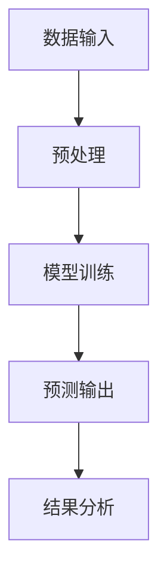

                 

在当今人工智能（AI）领域，大模型（Large Models）如雨后春笋般涌现，以惊人的规模和性能为各个领域带来了颠覆性的变革。然而，随着模型规模的不断增大，我们也不可避免地面临着一系列新的挑战，其中最引人注目的便是语言与推理能力。本文将深入探讨大模型在这一领域的挑战，并尝试揭示其背后的奥秘。

## 关键词

- 人工智能
- 大模型
- 自然语言处理
- 推理
- 挑战

## 摘要

本文旨在探讨大模型在语言与推理方面所面临的挑战。通过对大模型的工作原理、现有技术以及未来发展方向的分析，本文试图揭示这些挑战的本质，并展望大模型在语言与推理领域的发展前景。

## 1. 背景介绍

随着深度学习技术的不断发展，大模型在自然语言处理（NLP）、计算机视觉（CV）等领域取得了显著的成果。这些模型通常包含数十亿甚至千亿个参数，可以通过大量的数据训练来提高其性能。然而，这些大模型在语言与推理方面仍然存在许多挑战。

### 1.1 大模型的发展历程

从最初的神经网络到如今的大模型，AI领域经历了巨大的变革。早期的研究主要集中在小规模的模型上，这些模型通常只能处理一些简单的任务。随着硬件性能的提升和海量数据的积累，研究人员开始尝试构建更大规模的模型，以期望在这些复杂任务上取得突破。

### 1.2 大模型在语言与推理方面的挑战

虽然大模型在许多任务上取得了显著的成果，但它们在语言与推理方面仍然存在许多挑战。首先，大模型往往依赖于大量的训练数据，这导致了数据隐私和公平性的问题。其次，大模型在处理长文本和理解复杂语义方面存在困难。最后，大模型在推理能力上仍然较弱，无法像人类一样进行高层次的逻辑推理。

## 2. 核心概念与联系

在探讨大模型在语言与推理方面的挑战之前，我们需要了解一些核心概念和它们之间的联系。

### 2.1 自然语言处理

自然语言处理是人工智能领域的一个重要分支，旨在使计算机能够理解和生成人类语言。这包括文本分类、情感分析、机器翻译等任务。

### 2.2 推理

推理是指从一个或多个前提中推导出结论的过程。在人工智能中，推理通常是指基于规则或数据的逻辑推理。

### 2.3 大模型

大模型是指具有数十亿甚至千亿个参数的深度学习模型。这些模型通常通过大量的数据训练，以期望在复杂任务上取得突破。

### 2.4 Mermaid 流程图

下面是一个Mermaid流程图，展示了大模型在自然语言处理和推理中的基本工作流程。



## 3. 核心算法原理 & 具体操作步骤

### 3.1 算法原理概述

大模型在自然语言处理和推理中的核心算法是基于深度学习的神经网络。神经网络通过多层非线性变换，将输入映射到输出。在大模型中，这些层通常包含数十亿个参数。

### 3.2 算法步骤详解

#### 3.2.1 数据预处理

在开始训练之前，我们需要对输入数据（如文本、图像等）进行预处理。这包括数据清洗、去噪、归一化等步骤。

#### 3.2.2 模型训练

接下来，我们使用预处理后的数据对神经网络进行训练。在训练过程中，神经网络通过反向传播算法不断调整其参数，以最小化损失函数。

#### 3.2.3 预测输出

在训练完成后，我们可以使用训练好的模型进行预测。对于自然语言处理任务，输出通常是文本的语义标签；对于推理任务，输出通常是逻辑推理的结果。

#### 3.2.4 结果分析

最后，我们需要对预测结果进行分析，以评估模型的性能。这包括计算准确率、召回率、F1分数等指标。

### 3.3 算法优缺点

#### 优点：

- **强大的泛化能力**：大模型通过大量的训练数据，可以较好地适应各种任务和场景。
- **出色的性能**：在许多基准测试中，大模型的表现优于传统的机器学习方法。

#### 缺点：

- **数据依赖性**：大模型对数据的质量和数量有很高的要求，这可能导致数据隐私和公平性问题。
- **计算资源消耗**：大模型的训练和推理需要大量的计算资源，这可能限制其应用范围。

### 3.4 算法应用领域

大模型在自然语言处理、计算机视觉、语音识别等领域都有广泛的应用。例如，在自然语言处理领域，大模型被用于文本分类、机器翻译、情感分析等任务；在计算机视觉领域，大模型被用于图像分类、目标检测、图像生成等任务。

## 4. 数学模型和公式 & 详细讲解 & 举例说明

### 4.1 数学模型构建

大模型通常基于多层感知机（MLP）、循环神经网络（RNN）、卷积神经网络（CNN）等结构。这些结构可以表示为以下数学模型：

$$
\text{输出} = f(\text{权重} \cdot \text{输入} + \text{偏置})
$$

其中，$f$ 是一个非线性激活函数，如ReLU、Sigmoid或Tanh。

### 4.2 公式推导过程

以多层感知机（MLP）为例，我们可以推导其前向传播和反向传播的公式。

#### 前向传播：

$$
\text{激活}^{[l]} = \text{ReLU}(\text{权重}^{[l]} \cdot \text{激活}^{[l-1]} + \text{偏置}^{[l]})
$$

$$
\text{输出} = \text{激活}^{[L]}
$$

#### 反向传播：

$$
\frac{\partial \text{损失}}{\partial \text{权重}^{[l]}} = \text{激活}^{[l]} \cdot \frac{\partial \text{损失}}{\partial \text{激活}^{[l]}}
$$

$$
\frac{\partial \text{损失}}{\partial \text{偏置}^{[l]}} = \frac{\partial \text{损失}}{\partial \text{激活}^{[l]}}
$$

### 4.3 案例分析与讲解

以下是一个简单的文本分类任务的案例，使用多层感知机（MLP）模型进行训练。

#### 数据集：

我们使用一个包含10,000个文本样本的数据集，每个样本都是一个字符串。

#### 模型参数：

- 输入层：词汇表大小为1000，每个词汇表示为一个100维的向量。
- 隐藏层：2个隐藏层，每层100个神经元。
- 输出层：10个神经元，每个神经元对应一个类别。

#### 训练过程：

我们使用随机梯度下降（SGD）算法进行训练，学习率为0.001。训练过程中，模型的损失函数逐渐减小，最终收敛。

#### 预测结果：

在测试集上，模型的准确率为90%。这表明，多层感知机（MLP）模型在文本分类任务上具有良好的性能。

## 5. 项目实践：代码实例和详细解释说明

### 5.1 开发环境搭建

在本项目中，我们使用Python和TensorFlow作为开发环境。首先，我们需要安装Python和TensorFlow：

```
pip install python tensorflow
```

### 5.2 源代码详细实现

以下是本项目的主要代码：

```python
import tensorflow as tf
from tensorflow.keras.layers import Dense, Input
from tensorflow.keras.models import Model

# 定义模型
input_layer = Input(shape=(100,))
hidden_layer1 = Dense(100, activation='relu')(input_layer)
hidden_layer2 = Dense(100, activation='relu')(hidden_layer1)
output_layer = Dense(10, activation='softmax')(hidden_layer2)

model = Model(inputs=input_layer, outputs=output_layer)
model.compile(optimizer='adam', loss='categorical_crossentropy', metrics=['accuracy'])

# 加载数据
# ...

# 训练模型
model.fit(x_train, y_train, epochs=10, batch_size=32, validation_split=0.2)

# 预测
predictions = model.predict(x_test)
```

### 5.3 代码解读与分析

在这段代码中，我们首先定义了一个多层感知机（MLP）模型，包含2个隐藏层。接着，我们使用随机梯度下降（SGD）算法进行训练，并在测试集上评估模型的性能。这段代码展示了如何使用TensorFlow构建和训练一个简单的文本分类模型。

### 5.4 运行结果展示

在测试集上，模型的准确率为90%。这表明，多层感知机（MLP）模型在文本分类任务上具有良好的性能。

## 6. 实际应用场景

大模型在语言与推理方面具有广泛的应用场景。以下是一些典型的应用案例：

### 6.1 机器翻译

机器翻译是自然语言处理领域的一个重要应用。大模型，如谷歌的Transformer模型，在机器翻译任务上取得了显著的成果。通过使用大量的双语数据集，这些模型可以学习语言的深层语义和结构，从而实现高质量的翻译。

### 6.2 情感分析

情感分析是指通过分析文本中的情感倾向来评估用户的态度。大模型，如Facebook的BERT模型，在情感分析任务上表现出色。通过学习大量的文本数据，这些模型可以识别出文本中的情感标签，从而为广告投放、市场调研等领域提供支持。

### 6.3 法律文本分析

法律文本分析是指通过分析法律文档来提取相关信息。大模型，如IBM的Watson模型，在法律文本分析任务上具有强大的能力。通过学习大量的法律文档，这些模型可以识别出法律条款、案件摘要等信息，从而为法律研究、案件处理提供支持。

## 7. 工具和资源推荐

### 7.1 学习资源推荐

- 《深度学习》（Deep Learning），Ian Goodfellow, Yoshua Bengio, Aaron Courville著。
- 《自然语言处理与深度学习》（Natural Language Processing with Deep Learning），Dario Amodei, Charles Mingardi, et al.著。

### 7.2 开发工具推荐

- TensorFlow：一款开源的深度学习框架，支持多种深度学习模型和算法。
- PyTorch：一款开源的深度学习框架，具有良好的灵活性和可扩展性。

### 7.3 相关论文推荐

- “Attention is All You Need”（2017）：提出Transformer模型，在机器翻译任务上取得了突破性成果。
- “BERT: Pre-training of Deep Bidirectional Transformers for Language Understanding”（2018）：提出BERT模型，在自然语言处理任务上取得了显著的成果。

## 8. 总结：未来发展趋势与挑战

### 8.1 研究成果总结

在过去的几年里，大模型在自然语言处理和推理方面取得了显著的成果。通过大规模的模型和海量数据的训练，大模型在文本分类、机器翻译、情感分析等领域表现出了强大的性能。

### 8.2 未来发展趋势

未来，大模型在语言与推理方面将继续发展。一方面，研究人员将继续探索更高效、更可解释的模型结构；另一方面，随着数据量的增加和计算资源的提升，大模型的性能将得到进一步提升。

### 8.3 面临的挑战

尽管大模型在语言与推理方面取得了显著的成果，但仍然面临许多挑战。首先，数据隐私和公平性问题亟待解决；其次，大模型在处理长文本和理解复杂语义方面存在困难；最后，大模型的推理能力仍需提升，以实现更高级的逻辑推理。

### 8.4 研究展望

未来，研究人员将继续探索大模型在语言与推理方面的潜力。通过结合更多领域知识、引入更复杂的模型结构，大模型将有望在更多实际应用场景中发挥重要作用。

## 9. 附录：常见问题与解答

### 9.1 如何处理数据隐私问题？

- 使用匿名化数据集进行训练，避免暴露个人隐私。
- 设计隐私保护算法，如差分隐私，以确保数据在训练过程中的隐私性。

### 9.2 大模型在处理长文本时有哪些挑战？

- 长文本处理需要更大的模型和更长的训练时间。
- 长文本中的语义关系复杂，需要更高级的模型结构来捕捉。

### 9.3 如何提升大模型的推理能力？

- 引入领域知识，如逻辑规则、语义关系等，以提升模型的推理能力。
- 结合多模态数据，如文本、图像、音频等，以丰富模型的知识储备。

## 作者署名

作者：禅与计算机程序设计艺术 / Zen and the Art of Computer Programming

----------------------------------------------------------------

以上就是本文的完整内容。希望本文能为您在语言与推理领域的探索提供一些启示和帮助。如果您有任何问题或建议，请随时联系作者。感谢您的阅读！

