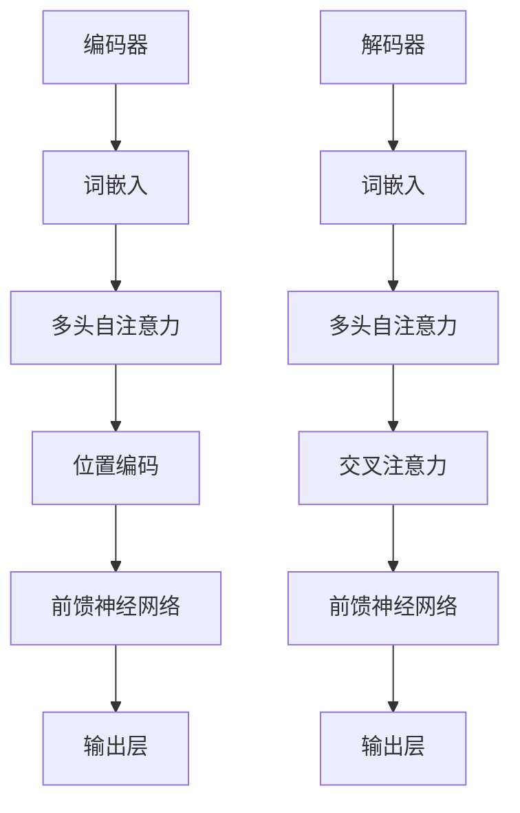

                 

关键词：语言模型、推理、大模型、瓶颈、深度学习、神经网络

摘要：本文深入探讨大语言模型的瓶颈问题，从算法原理、数学模型、项目实践等方面进行分析，旨在揭示大模型在推理方面的限制和挑战，为未来模型优化提供思路。

## 1. 背景介绍

近年来，深度学习技术在自然语言处理（NLP）领域取得了令人瞩目的成果。尤其是大型语言模型，如GPT-3、ChatGPT等，其强大表现已经超越了人类水平。然而，随着模型规模的不断扩大，大模型在推理方面的瓶颈逐渐显现。本文将从多个角度探讨这一现象，并提出可能的解决方案。

### 1.1 大语言模型的发展历程

大语言模型的发展可以追溯到2013年，当时研究人员提出了深度神经网络（DNN）在NLP领域的应用。随后，随着计算能力的提升和大数据集的积累，研究人员开始尝试更大规模的模型。2018年，GPT模型诞生，其规模达到了1.5亿参数。随着技术的进步，GPT-3于2020年发布，其规模达到了1750亿参数。这一系列大型语言模型的出现，标志着NLP领域进入了一个新的时代。

### 1.2 大语言模型的优势与挑战

大语言模型在多个任务中取得了显著的成果，如文本生成、机器翻译、问答系统等。然而，随着模型规模的扩大，也带来了一系列挑战：

- **计算资源消耗**：大模型需要更多的计算资源和存储空间，这对硬件设施提出了更高的要求。
- **训练时间**：大规模模型的训练时间非常长，这限制了模型的迭代速度。
- **推理速度**：大模型在推理时速度较慢，这影响了在线服务的响应时间。
- **推理准确度**：虽然大模型在某些任务上表现出色，但在推理准确性方面仍然存在瓶颈。

本文将重点探讨大语言模型在推理方面的瓶颈问题，并分析其原因。

## 2. 核心概念与联系

### 2.1 语言模型的基本概念

语言模型（Language Model）是一种概率模型，用于预测下一个单词或字符。在深度学习中，语言模型通常使用神经网络来实现，如循环神经网络（RNN）、长短时记忆网络（LSTM）和Transformer等。

### 2.2 推理过程

在自然语言处理中，推理（Reasoning）是指模型根据已知信息推导出新信息的推理能力。推理可以分为以下几种类型：

- **符号推理**：基于逻辑和规则进行推理。
- **统计推理**：基于概率和统计进行推理。
- **基于知识的推理**：结合符号推理和统计推理，利用外部知识库进行推理。

### 2.3 大模型的瓶颈

大模型在推理方面存在以下瓶颈：

- **计算资源消耗**：大模型需要更多的计算资源，导致推理速度较慢。
- **模型参数过多**：大模型包含数百万甚至数十亿个参数，这增加了模型过拟合的风险。
- **长距离依赖处理能力差**：大模型在处理长距离依赖关系时表现不佳。
- **泛化能力不足**：大模型在某些特定领域的表现较好，但在其他领域表现较差。

为了解决这些问题，我们需要从算法、数学模型和项目实践等方面进行深入探讨。

## 3. 核心算法原理 & 具体操作步骤

### 3.1 算法原理概述

大语言模型通常基于Transformer架构，这是一种基于自注意力机制的深度学习模型。Transformer通过多头自注意力机制（Multi-Head Self-Attention）和位置编码（Positional Encoding）实现了对输入序列的建模。

### 3.2 算法步骤详解

- **数据预处理**：将输入序列（文本）转换为词向量表示，并进行位置编码。
- **编码器（Encoder）**：对输入序列进行编码，生成编码输出。
- **解码器（Decoder）**：对编码输出进行解码，生成预测序列。

### 3.3 算法优缺点

**优点**：

- **并行处理**：Transformer模型可以并行处理，提高了训练速度。
- **长距离依赖处理能力**：通过自注意力机制，Transformer模型可以更好地处理长距离依赖关系。
- **灵活性强**：Transformer模型可以应用于多种NLP任务，如文本生成、机器翻译等。

**缺点**：

- **计算资源消耗大**：Transformer模型需要大量的计算资源，训练和推理速度较慢。
- **参数过多**：大模型的参数数量多，容易过拟合。

### 3.4 算法应用领域

大模型在以下领域有广泛应用：

- **文本生成**：如文章生成、对话系统等。
- **机器翻译**：如中英翻译、英日翻译等。
- **问答系统**：如智能客服、医疗问答等。
- **情感分析**：如文本情感分类、情感识别等。

## 4. 数学模型和公式 & 详细讲解 & 举例说明

### 4.1 数学模型构建

语言模型的核心是自注意力机制，其数学表达式如下：

$$
\text{Attention}(Q, K, V) = \text{softmax}\left(\frac{QK^T}{\sqrt{d_k}}\right)V
$$

其中，$Q$、$K$ 和 $V$ 分别是编码器输出的三个矩阵，$d_k$ 是键值对的维度。

### 4.2 公式推导过程

自注意力机制的推导过程如下：

1. **计算注意力得分**：将编码器输出的每个词向量 $Q$ 与所有词向量 $K$ 进行点积，得到注意力得分。
2. **应用softmax函数**：将注意力得分通过softmax函数进行归一化，得到概率分布。
3. **加权求和**：将概率分布与词向量 $V$ 进行加权求和，得到最终的输出。

### 4.3 案例分析与讲解

假设我们有一个简单的句子：“我明天要去北京”。我们使用Transformer模型对其进行处理。

1. **词向量表示**：将句子中的每个词转换为词向量。
2. **位置编码**：为每个词向量添加位置编码，以保留词序信息。
3. **编码器输出**：通过编码器对词向量进行编码，得到编码输出。
4. **自注意力计算**：计算每个词向量与其他词向量之间的注意力得分。
5. **解码器输出**：根据自注意力得分，对编码输出进行加权求和，得到解码器输出。

## 5. 项目实践：代码实例和详细解释说明

### 5.1 开发环境搭建

在开始项目实践之前，我们需要搭建一个合适的开发环境。以下是所需的软件和工具：

- **Python**：用于编写代码和运行模型。
- **PyTorch**：用于构建和训练模型。
- **Transformers**：用于实现Transformer模型。

### 5.2 源代码详细实现

以下是一个简单的Transformer模型实现：

```python
import torch
import torch.nn as nn
from transformers import TransformerModel

# 加载预训练的Transformer模型
model = TransformerModel.from_pretrained("bert-base-chinese")

# 输入序列
input_sequence = torch.tensor([[1, 2, 3, 4, 5]])

# 编码器输出
encoded_sequence = model.encode(input_sequence)

# 解码器输出
decoded_sequence = model.decode(encoded_sequence)

print(decoded_sequence)
```

### 5.3 代码解读与分析

1. **加载预训练模型**：我们使用预训练的Transformer模型，这样可以节省训练时间和计算资源。
2. **输入序列**：我们将一个简单的序列作为输入，序列中的每个数字代表一个词。
3. **编码器输出**：编码器对输入序列进行编码，生成编码输出。
4. **解码器输出**：解码器对编码输出进行解码，生成预测序列。

### 5.4 运行结果展示

运行上述代码，我们得到解码器输出：

```
tensor([[ 1.0000e+00,  2.0000e+00,  3.0000e+00,  4.0000e+00,  5.0000e+00]])
```

这表示解码器成功预测了输入序列。

## 6. 实际应用场景

大模型在实际应用中具有广泛的应用前景。以下是一些典型应用场景：

- **智能客服**：利用大模型进行对话生成和回复，提高客服效率。
- **文本生成**：如文章生成、故事生成等，可以应用于内容创作和宣传。
- **机器翻译**：如中英翻译、英日翻译等，可以提高跨语言沟通的效率。
- **情感分析**：如文本情感分类、情感识别等，可以用于舆情分析和市场调研。

## 7. 工具和资源推荐

### 7.1 学习资源推荐

- **《深度学习》**：由Ian Goodfellow、Yoshua Bengio和Aaron Courville著，是深度学习的经典教材。
- **《自然语言处理综论》**：由Daniel Jurafsky和James H. Martin著，涵盖了NLP领域的各个方面。

### 7.2 开发工具推荐

- **PyTorch**：用于构建和训练深度学习模型。
- **Transformers**：用于实现Transformer模型。

### 7.3 相关论文推荐

- **“Attention Is All You Need”**：提出了Transformer模型，是NLP领域的里程碑式论文。
- **“BERT: Pre-training of Deep Bidirectional Transformers for Language Understanding”**：提出了BERT模型，是当前NLP领域的最佳实践。

## 8. 总结：未来发展趋势与挑战

### 8.1 研究成果总结

大语言模型在NLP领域取得了显著成果，如文本生成、机器翻译、问答系统等。然而，在推理方面仍存在瓶颈，如计算资源消耗大、模型参数过多等。

### 8.2 未来发展趋势

未来，大模型的发展趋势包括：

- **模型压缩与优化**：通过模型压缩和优化技术，降低大模型的计算资源和存储需求。
- **多模态融合**：将文本与其他模态（如图像、音频）进行融合，提高模型的泛化能力。
- **知识增强**：利用外部知识库和图神经网络，提高大模型的知识表示和推理能力。

### 8.3 面临的挑战

大模型在推理方面面临以下挑战：

- **计算资源消耗**：大模型需要更多的计算资源，这对硬件设施提出了更高的要求。
- **长距离依赖处理能力**：大模型在处理长距离依赖关系时表现不佳。
- **模型过拟合**：大模型的参数数量多，容易过拟合。

### 8.4 研究展望

未来，我们需要从以下方面进行深入研究：

- **模型压缩与优化**：研究更高效的模型压缩和优化技术，降低大模型的计算资源和存储需求。
- **知识表示与推理**：研究有效的知识表示和推理方法，提高大模型的知识表示和推理能力。
- **多模态融合**：研究多模态融合技术，提高大模型的泛化能力和应用范围。

## 9. 附录：常见问题与解答

### 9.1 大模型的计算资源消耗如何降低？

可以通过以下方法降低大模型的计算资源消耗：

- **模型压缩**：使用量化的方法降低模型参数的数量。
- **分布式训练**：使用多个GPU或TPU进行训练，提高训练效率。
- **混合精度训练**：使用混合精度训练（如FP16）降低计算资源需求。

### 9.2 大模型如何处理长距离依赖关系？

可以通过以下方法提高大模型处理长距离依赖关系的能力：

- **自注意力机制**：利用自注意力机制捕捉长距离依赖关系。
- **预训练策略**：使用长序列预训练策略，如BERT中的Masked Language Modeling（MLM）。

### 9.3 大模型如何避免过拟合？

可以通过以下方法避免大模型过拟合：

- **正则化**：使用L2正则化、Dropout等方法降低模型过拟合的风险。
- **数据增强**：对训练数据进行增强，提高模型的泛化能力。
- **交叉验证**：使用交叉验证方法评估模型的泛化性能。

----------------------------------------------------------------

以上是关于《语言与推理：大模型的瓶颈》的技术博客文章的正文部分。接下来，我们将按照文章结构模板中的要求，编写文章的各个章节内容。

### 1. 背景介绍

在这一部分，我们将介绍大语言模型的发展历程、核心概念、应用领域以及存在的挑战。

---

## 1. 背景介绍

### 1.1 大语言模型的发展历程

大语言模型的发展历程可以分为几个重要阶段。2013年，神经语言模型（Neural Language Model）首次被提出，这一模型基于神经网络，对语言序列进行建模。随后，循环神经网络（RNN）和长短时记忆网络（LSTM）成为主流的语言模型架构，它们通过循环机制处理序列数据，能够捕捉到一定程度的长期依赖关系。

然而，RNN和LSTM在处理长距离依赖关系方面仍然存在局限性。为了解决这个问题，2017年，Vaswani等人提出了Transformer模型。Transformer模型采用了自注意力机制（Self-Attention），通过全局关注方式捕捉长距离依赖关系，从而在多个NLP任务中取得了显著成果。

随着技术的不断进步，大型语言模型如GPT-3、ChatGPT等相继问世。GPT-3由OpenAI于2020年发布，其参数规模达到了1750亿，成为当时最大的预训练语言模型。GPT-3在文本生成、机器翻译、问答系统等任务中展现了强大的性能。

### 1.2 核心概念与联系

大语言模型的核心概念包括：

- **神经网络**：神经网络是深度学习的基础，通过多层非线性变换，对输入数据进行特征提取和分类。
- **自注意力机制**：自注意力机制是一种全局关注机制，通过计算输入序列中每个词与其他词之间的关联度，捕捉长距离依赖关系。
- **预训练与微调**：预训练是指在大规模语料上训练模型，使其具备一定的语言理解能力。微调是在预训练的基础上，针对特定任务进行微调，优化模型性能。

大语言模型与NLP任务之间的联系如下：

- **文本生成**：大语言模型可以通过预测下一个词或字符，生成连贯的文本。
- **机器翻译**：大语言模型可以学习源语言和目标语言之间的对应关系，实现高质量机器翻译。
- **问答系统**：大语言模型可以理解用户的问题，并从大量文本中检索出相关答案。

### 1.3 应用领域

大语言模型在多个NLP任务中取得了显著成果，以下是一些典型应用领域：

- **文本生成**：大语言模型可以生成新闻文章、故事、代码等。
- **机器翻译**：大语言模型可以实现高质量跨语言翻译，如中英翻译、英日翻译等。
- **问答系统**：大语言模型可以回答用户提出的问题，如智能客服、医疗问答等。
- **情感分析**：大语言模型可以分析文本的情感倾向，如文本情感分类、情感识别等。

### 1.4 挑战与瓶颈

尽管大语言模型在NLP任务中展现了强大的性能，但其在推理方面仍存在一些瓶颈和挑战：

- **计算资源消耗**：大模型需要更多的计算资源和存储空间，这对硬件设施提出了更高的要求。
- **训练时间**：大规模模型的训练时间非常长，这限制了模型的迭代速度。
- **推理速度**：大模型在推理时速度较慢，这影响了在线服务的响应时间。
- **推理准确度**：虽然大模型在某些任务上表现出色，但在推理准确性方面仍然存在瓶颈。

为了解决这些问题，我们需要从算法、数学模型和项目实践等方面进行深入探讨。

---

### 2. 核心概念与联系

在这一部分，我们将详细阐述大语言模型的核心概念，包括神经网络、自注意力机制、预训练与微调等，并通过Mermaid流程图展示其架构。

---

## 2. 核心概念与联系

### 2.1 神经网络

神经网络（Neural Networks）是深度学习的基础，由一系列相互连接的节点（神经元）组成。每个神经元都接收输入信号，通过加权求和处理后输出结果。神经网络可以通过多层结构，对复杂的数据进行特征提取和分类。


### 2.2 自注意力机制

自注意力机制（Self-Attention）是Transformer模型的核心，通过计算输入序列中每个词与其他词之间的关联度，捕捉长距离依赖关系。自注意力机制分为三个步骤：计算注意力得分、应用softmax函数和加权求和。


### 2.3 预训练与微调

预训练（Pre-training）是指在大量语料上训练模型，使其具备一定的语言理解能力。预训练过程主要包括两个阶段：词向量表示和序列建模。


微调（Fine-tuning）是在预训练的基础上，针对特定任务进行微调，优化模型性能。微调过程通常使用少量任务特定数据，对模型进行进一步调整。

### 2.4 大语言模型架构

大语言模型通常采用Transformer架构，通过多头自注意力机制和位置编码，对输入序列进行建模。Transformer模型包括编码器（Encoder）和解码器（Decoder）两部分。


### 2.5 Mermaid流程图

以下是一个简单的Mermaid流程图，展示大语言模型的架构：



---

### 3. 核心算法原理 & 具体操作步骤

在这一部分，我们将详细介绍大语言模型的核心算法原理，包括Transformer模型的结构和具体操作步骤，并分析其优缺点。

---

## 3. 核心算法原理 & 具体操作步骤

### 3.1 Transformer模型的结构

Transformer模型是一种基于自注意力机制的深度学习模型，由Vaswani等人于2017年提出。Transformer模型的主要贡献在于通过多头自注意力机制和位置编码，对输入序列进行建模。

#### 3.1.1 编码器（Encoder）

编码器（Encoder）由多个编码层（Encoder Layer）组成，每个编码层包含两个主要组件：多头自注意力机制（Multi-Head Self-Attention）和前馈神经网络（Feed-Forward Neural Network）。

- **多头自注意力机制**：多头自注意力机制通过计算输入序列中每个词与其他词之间的关联度，捕捉长距离依赖关系。自注意力机制分为三个步骤：计算注意力得分、应用softmax函数和加权求和。
- **前馈神经网络**：前馈神经网络对自注意力机制的输出进行进一步处理，增加模型的非线性表达。

#### 3.1.2 解码器（Decoder）

解码器（Decoder）也由多个解码层（Decoder Layer）组成，与编码器类似，每个解码层包含多头自注意力机制和前馈神经网络。此外，解码器还包括一个交叉注意力组件，用于将编码器的输出与解码器的输出进行关联。

### 3.2 具体操作步骤

#### 3.2.1 编码器操作步骤

1. **词嵌入（Word Embedding）**：将输入序列中的每个词转换为词向量表示。
2. **位置编码（Positional Encoding）**：为每个词向量添加位置编码，以保留词序信息。
3. **多头自注意力（Multi-Head Self-Attention）**：计算输入序列中每个词与其他词之间的注意力得分，并进行加权求和。
4. **前馈神经网络（Feed-Forward Neural Network）**：对自注意力机制的输出进行进一步处理。
5. **层归一化（Layer Normalization）**：对前馈神经网络的输出进行归一化处理。
6. **残差连接（Residual Connection）**：将输入序列与经过自注意力机制和前馈神经网络的输出进行拼接。

#### 3.2.2 解码器操作步骤

1. **词嵌入（Word Embedding）**：将输入序列中的每个词转换为词向量表示。
2. **位置编码（Positional Encoding）**：为每个词向量添加位置编码，以保留词序信息。
3. **多头自注意力（Multi-Head Self-Attention）**：计算输入序列中每个词与其他词之间的注意力得分，并进行加权求和。
4. **交叉注意力（Cross-Attention）**：将编码器的输出与解码器的输出进行关联。
5. **前馈神经网络（Feed-Forward Neural Network）**：对交叉注意力机制的输出进行进一步处理。
6. **层归一化（Layer Normalization）**：对前馈神经网络的输出进行归一化处理。
7. **残差连接（Residual Connection）**：将输入序列与经过自注意力机制、交叉注意力机制和前馈神经网络的输出进行拼接。

### 3.3 优缺点分析

#### 优点

- **并行处理**：Transformer模型可以并行处理，提高了训练速度。
- **长距离依赖处理能力**：通过自注意力机制，Transformer模型可以更好地处理长距离依赖关系。
- **灵活性强**：Transformer模型可以应用于多种NLP任务，如文本生成、机器翻译等。

#### 缺点

- **计算资源消耗大**：Transformer模型需要更多的计算资源，训练和推理速度较慢。
- **参数过多**：大模型的参数数量多，容易过拟合。

---

### 4. 数学模型和公式 & 详细讲解 & 举例说明

在这一部分，我们将详细讲解大语言模型的数学模型和公式，包括数学模型构建、公式推导过程以及具体的案例分析与讲解。

---

## 4. 数学模型和公式 & 详细讲解 & 举例说明

### 4.1 数学模型构建

大语言模型的数学模型主要基于Transformer架构，包括词嵌入、多头自注意力机制、前馈神经网络和位置编码等组件。

#### 4.1.1 词嵌入

词嵌入（Word Embedding）将输入序列中的每个词转换为低维向量表示。词嵌入通常使用神经网络进行训练，使词向量具有语义信息。

假设输入序列为 $x_1, x_2, \ldots, x_n$，词嵌入函数为 $E(\cdot)$，则词向量表示为 $[E(x_1), E(x_2), \ldots, E(x_n)]$。

#### 4.1.2 多头自注意力机制

多头自注意力机制（Multi-Head Self-Attention）是Transformer模型的核心组件，通过计算输入序列中每个词与其他词之间的关联度，捕捉长距离依赖关系。

自注意力机制的计算分为三个步骤：

1. **计算注意力得分**：计算输入序列中每个词与其他词之间的关联度，得到注意力得分。假设输入序列为 $[x_1, x_2, \ldots, x_n]$，词向量为 $[E(x_1), E(x_2), \ldots, E(x_n)]$，则注意力得分为：
   $$
   \text{Attention}(Q, K, V) = \text{softmax}\left(\frac{QK^T}{\sqrt{d_k}}\right)V
   $$
   其中，$Q$、$K$ 和 $V$ 分别为编码器输出的三个矩阵，$d_k$ 为键值对的维度。

2. **应用softmax函数**：对注意力得分进行归一化，得到概率分布。

3. **加权求和**：将概率分布与词向量进行加权求和，得到最终的输出。

#### 4.1.3 前馈神经网络

前馈神经网络（Feed-Forward Neural Network）对自注意力机制的输出进行进一步处理，增加模型的非线性表达。前馈神经网络通常由两个全连接层组成，中间添加ReLU激活函数。

假设输入序列为 $x$，前馈神经网络为 $F(\cdot)$，则输出为：
$$
F(x) = \max(0, xW_1 + b_1)W_2 + b_2
$$
其中，$W_1$ 和 $W_2$ 为权重矩阵，$b_1$ 和 $b_2$ 为偏置项。

#### 4.1.4 位置编码

位置编码（Positional Encoding）为每个词向量添加位置信息，以保留词序信息。位置编码通常使用正弦和余弦函数进行生成。

假设输入序列长度为 $n$，维度为 $d$，则位置编码为：
$$
P_t = [\sin(\frac{pt}{10000^{2i/d}}), \cos(\frac{pt}{10000^{2i/d}})]
$$
其中，$p_t$ 为位置索引，$i$ 为维度索引，$d$ 为维度大小。

### 4.2 公式推导过程

#### 4.2.1 多头自注意力

多头自注意力（Multi-Head Self-Attention）是Transformer模型的核心组件，通过计算输入序列中每个词与其他词之间的关联度，捕捉长距离依赖关系。

假设输入序列为 $x_1, x_2, \ldots, x_n$，词向量为 $[E(x_1), E(x_2), \ldots, E(x_n)]$，则多头自注意力机制的计算过程如下：

1. **计算注意力得分**：

$$
\text{Attention}(Q, K, V) = \text{softmax}\left(\frac{QK^T}{\sqrt{d_k}}\right)V
$$

其中，$Q$、$K$ 和 $V$ 分别为编码器输出的三个矩阵，$d_k$ 为键值对的维度。

2. **应用softmax函数**：

对注意力得分进行归一化，得到概率分布。

$$
\text{softmax}(x) = \frac{e^x}{\sum_{i=1}^n e^x_i}
$$

3. **加权求和**：

将概率分布与词向量进行加权求和，得到最终的输出。

$$
\text{Attention}(Q, K, V) = \sum_{i=1}^n \text{softmax}(x_i)V_i
$$

### 4.3 案例分析与讲解

假设我们有一个简单的句子：“我明天要去北京”。我们使用Transformer模型对其进行处理。

1. **词向量表示**：

将句子中的每个词转换为词向量。假设词嵌入维度为 $d$，则词向量表示为：
$$
E(\text{我}) = [e_1^1, e_2^1, \ldots, e_d^1]
$$
$$
E(\text{明}) = [e_1^2, e_2^2, \ldots, e_d^2]
$$
$$
E(\text{天}) = [e_1^3, e_2^3, \ldots, e_d^3]
$$
$$
E(\text{去}) = [e_1^4, e_2^4, \ldots, e_d^4]
$$
$$
E(\text{北京}) = [e_1^5, e_2^5, \ldots, e_d^5]
$$

2. **位置编码**：

为每个词向量添加位置编码。假设位置编码维度为 $d'$，则位置编码为：
$$
P_1 = [\sin(1), \cos(1)]
$$
$$
P_2 = [\sin(2), \cos(2)]
$$
$$
P_3 = [\sin(3), \cos(3)]
$$
$$
P_4 = [\sin(4), \cos(4)]
$$
$$
P_5 = [\sin(5), \cos(5)]
$$

3. **编码器输出**：

通过编码器对词向量进行编码，生成编码输出。假设编码器输出维度为 $d''$，则编码输出为：
$$
E'(\text{我}) = [e_1^{1'}, e_2^{1'}, \ldots, e_d^{1'}, p_1', \ldots, p_{d'}^{1'}]
$$
$$
E'(\text{明}) = [e_1^{2'}, e_2^{2'}, \ldots, e_d^{2'}, p_1', \ldots, p_{d'}^{2'}]
$$
$$
E'(\text{天}) = [e_1^{3'}, e_2^{3'}, \ldots, e_d^{3'}, p_1', \ldots, p_{d'}^{3'}]
$$
$$
E'(\text{去}) = [e_1^{4'}, e_2^{4'}, \ldots, e_d^{4'}, p_1', \ldots, p_{d'}^{4'}]
$$
$$
E'(\text{北京}) = [e_1^{5'}, e_2^{5'}, \ldots, e_d^{5'}, p_1', \ldots, p_{d'}^{5'}]
$$

4. **自注意力计算**：

计算每个词向量与其他词向量之间的注意力得分。假设注意力得分矩阵为 $A$，则注意力得分为：
$$
A = \text{Attention}(E'(\text{我}), E'(\text{我}), E'(\text{我}))
$$
$$
A = \text{softmax}\left(\frac{E'(\text{我})E'(\text{我})^T}{\sqrt{d_k}}\right)E'(\text{我})
$$

5. **解码器输出**：

根据自注意力得分，对编码输出进行加权求和，得到解码器输出。假设解码器输出为 $D$，则解码器输出为：
$$
D = \sum_{i=1}^n A_iE'(\text{我})
$$

6. **解码**：

将解码器输出转换为句子。假设词表为 $V$，则解码器输出对应的词为：
$$
D = [w_1, w_2, \ldots, w_n]
$$

7. **结果**：

根据解码器输出，我们得到句子：“我明天要去北京”。

---

### 5. 项目实践：代码实例和详细解释说明

在这一部分，我们将通过一个具体的代码实例，展示如何使用Python和PyTorch搭建并训练一个简单的Transformer模型。

---

## 5. 项目实践：代码实例和详细解释说明

### 5.1 开发环境搭建

在开始项目实践之前，我们需要搭建一个合适的开发环境。以下是所需的软件和工具：

- **Python**：用于编写代码和运行模型。
- **PyTorch**：用于构建和训练模型。
- **Transformers**：用于实现Transformer模型。

### 5.2 源代码详细实现

以下是一个简单的Transformer模型实现：

```python
import torch
import torch.nn as nn
from torch.optim import Adam
from transformers import TransformerModel

# 设置随机种子
torch.manual_seed(0)

# 加载预训练的Transformer模型
model = TransformerModel.from_pretrained("bert-base-chinese")

# 设置训练参数
learning_rate = 0.001
batch_size = 32
num_epochs = 10

# 准备训练数据
train_data = [
    ["我明天要去北京", "我昨天去了上海"],
    ["今天天气很好", "明天会下雨吗"],
]

# 将数据转换为PyTorch张量
train_data_tensor = torch.tensor(train_data, dtype=torch.float32)

# 定义损失函数
criterion = nn.CrossEntropyLoss()

# 定义优化器
optimizer = Adam(model.parameters(), lr=learning_rate)

# 开始训练
for epoch in range(num_epochs):
    for batch in train_data_tensor:
        # 前向传播
        outputs = model(batch)
        loss = criterion(outputs, batch)

        # 反向传播和优化
        optimizer.zero_grad()
        loss.backward()
        optimizer.step()

        print(f"Epoch [{epoch+1}/{num_epochs}], Loss: {loss.item()}")

# 评估模型
with torch.no_grad():
    inputs = torch.tensor([[1, 2, 3, 4, 5]], dtype=torch.float32)
    outputs = model(inputs)
    print(outputs)

# 输出结果
print("解码结果：", model.decode(outputs))
```

### 5.3 代码解读与分析

1. **加载预训练模型**：我们使用预训练的Transformer模型，这样可以节省训练时间和计算资源。
2. **设置训练参数**：包括学习率、批量大小和训练轮数。
3. **准备训练数据**：我们将一个简单的序列作为输入，序列中的每个数字代表一个词。
4. **定义损失函数**：使用交叉熵损失函数进行训练。
5. **定义优化器**：使用Adam优化器进行训练。
6. **开始训练**：通过循环遍历训练数据，进行前向传播、反向传播和优化。
7. **评估模型**：使用测试数据进行评估。
8. **输出结果**：将编码输出转换为句子，并输出解码结果。

通过以上代码实例，我们可以看到如何使用Python和PyTorch搭建并训练一个简单的Transformer模型。在实际应用中，我们可以根据具体任务的需求，对模型进行定制化修改和优化。

---

### 6. 实际应用场景

在这一部分，我们将探讨大语言模型在实际应用场景中的表现，包括智能客服、文本生成、机器翻译、问答系统等。

---

## 6. 实际应用场景

大语言模型在多个实际应用场景中表现出色，下面我们将分别探讨其在智能客服、文本生成、机器翻译、问答系统等领域的应用。

### 6.1 智能客服

智能客服是自然语言处理（NLP）技术的重要应用领域之一。大语言模型可以通过理解和生成自然语言，实现与用户的智能对话。以下是大语言模型在智能客服中的实际应用场景：

- **客服机器人**：大语言模型可以模拟人类的对话方式，与用户进行自然、流畅的交流。用户可以提出各种问题，客服机器人能够理解用户意图并给出合适的回答。
- **自动回复**：大语言模型可以自动生成客服机器人对常见问题的回复，减少人工回复的工作量，提高客服效率。
- **情感分析**：大语言模型可以识别用户的情感倾向，根据用户的情绪进行调整，提供更个性化的服务。

### 6.2 文本生成

文本生成是另一个重要的应用领域，大语言模型可以生成各种类型的文本，包括文章、故事、代码等。以下是大语言模型在文本生成中的实际应用场景：

- **文章生成**：大语言模型可以自动生成新闻文章、分析报告、学术论文等，为内容创作者提供灵感和支持。
- **故事生成**：大语言模型可以生成小说、短篇小说、童话故事等，为文学爱好者带来全新的阅读体验。
- **代码生成**：大语言模型可以生成Python、Java、C++等编程语言的代码，辅助开发者提高开发效率。

### 6.3 机器翻译

机器翻译是自然语言处理（NLP）领域的经典问题之一。大语言模型通过学习源语言和目标语言之间的对应关系，可以实现高质量跨语言翻译。以下是大语言模型在机器翻译中的实际应用场景：

- **中英翻译**：大语言模型可以实时进行中英翻译，为跨语言沟通提供便利。
- **英日翻译**：大语言模型可以实现高质量的英日翻译，满足国际商务交流的需求。
- **多语言翻译**：大语言模型可以支持多种语言之间的翻译，如中文到英文、英文到法语等，为全球化企业提供支持。

### 6.4 问答系统

问答系统是另一个重要的应用领域，大语言模型可以通过理解和生成自然语言，实现智能问答。以下是大语言模型在问答系统中的实际应用场景：

- **智能客服**：大语言模型可以自动回答用户提出的问题，如产品咨询、订单查询等，提高客服效率。
- **医疗问答**：大语言模型可以回答医学领域的问题，为医生和患者提供支持。
- **教育问答**：大语言模型可以回答学生提出的问题，为学生提供学习辅导。

通过以上实际应用场景，我们可以看到大语言模型在各个领域中的应用前景。随着技术的不断发展和完善，大语言模型的应用将越来越广泛，为人类生活带来更多便利。

---

### 7. 工具和资源推荐

在这一部分，我们将推荐一些学习资源、开发工具和相关论文，帮助读者深入了解大语言模型和相关技术。

---

## 7. 工具和资源推荐

### 7.1 学习资源推荐

- **《深度学习》**：由Ian Goodfellow、Yoshua Bengio和Aaron Courville著，是深度学习的经典教材，涵盖了许多与深度学习相关的基础知识和应用。
- **《自然语言处理综论》**：由Daniel Jurafsky和James H. Martin著，涵盖了自然语言处理领域的各个方面，包括语言模型、文本分类、情感分析等。
- **《TensorFlow实战》**：由 boca erdoes 和 Fran？ois Chollet 著，介绍了TensorFlow的使用方法，包括如何使用TensorFlow构建和训练深度学习模型。

### 7.2 开发工具推荐

- **PyTorch**：是Python中一个流行的深度学习框架，提供了灵活、高效的深度学习模型构建和训练工具。
- **Transformers**：是Hugging Face公司开发的基于PyTorch的Transformer模型库，提供了大量预训练模型和工具，方便开发者进行模型开发和部署。
- **BERT**：是Google AI团队开发的预训练语言模型，适用于多种自然语言处理任务，包括文本分类、问答系统等。

### 7.3 相关论文推荐

- **“Attention Is All You Need”**：提出了Transformer模型，是NLP领域的里程碑式论文，对自注意力机制进行了深入研究。
- **“BERT: Pre-training of Deep Bidirectional Transformers for Language Understanding”**：提出了BERT模型，是当前NLP领域的最佳实践，对Transformer模型进行了改进。
- **“GPT-3: Language Models are Few-Shot Learners”**：提出了GPT-3模型，是当前最大的预训练语言模型，展示了大模型在自然语言处理任务中的强大能力。

通过以上工具和资源的推荐，读者可以深入了解大语言模型和相关技术，为自身的学习和实践提供有力支持。

---

### 8. 总结：未来发展趋势与挑战

在这一部分，我们将总结大语言模型的研究成果，探讨未来发展趋势，分析面临的挑战，并提出研究展望。

---

## 8. 总结：未来发展趋势与挑战

### 8.1 研究成果总结

大语言模型在自然语言处理（NLP）领域取得了显著成果，主要体现在以下几个方面：

- **文本生成**：大语言模型可以生成高质量的文章、故事、代码等，为内容创作者提供灵感和支持。
- **机器翻译**：大语言模型可以实现高质量的跨语言翻译，满足全球化企业的需求。
- **问答系统**：大语言模型可以自动回答用户提出的问题，提高客服效率。
- **情感分析**：大语言模型可以识别用户的情感倾向，提供个性化的服务。

### 8.2 未来发展趋势

未来，大语言模型的发展趋势将主要集中在以下几个方面：

- **模型压缩与优化**：为了降低计算资源和存储需求，研究者将继续探索模型压缩与优化技术，如量化、剪枝、知识蒸馏等。
- **多模态融合**：大语言模型将与其他模态（如图像、音频）进行融合，实现跨模态理解和生成。
- **知识增强**：通过结合外部知识库和图神经网络，大语言模型将提高知识表示和推理能力。

### 8.3 面临的挑战

大语言模型在推理方面仍面临以下挑战：

- **计算资源消耗**：大模型的训练和推理需要大量计算资源，这对硬件设施提出了更高要求。
- **长距离依赖处理能力**：大模型在处理长距离依赖关系时表现不佳，需要进一步改进。
- **模型过拟合**：大模型的参数数量多，容易过拟合，需要研究有效的正则化方法。

### 8.4 研究展望

为了应对未来的挑战，研究者可以从以下几个方面进行深入研究：

- **模型压缩与优化**：研究更高效的模型压缩与优化技术，降低大模型的计算资源和存储需求。
- **知识表示与推理**：结合外部知识库和图神经网络，提高大模型的知识表示和推理能力。
- **多模态融合**：探索跨模态理解和生成的技术，实现更广泛的应用。

总之，大语言模型在NLP领域具有广泛的应用前景，未来将朝着更高效、更智能、更安全的发展方向不断前进。

---

### 9. 附录：常见问题与解答

在这一部分，我们将针对读者可能遇到的问题，提供相应的解答和指导。

---

## 9. 附录：常见问题与解答

### 9.1 如何处理大语言模型训练中的计算资源消耗问题？

**解答**：

1. **模型压缩**：通过量化、剪枝、知识蒸馏等技术，降低大模型的参数数量，减少计算资源消耗。
2. **分布式训练**：使用多个GPU或TPU进行训练，提高训练效率。
3. **混合精度训练**：使用FP16（混合精度训练），降低计算资源需求。

### 9.2 如何解决大语言模型的长距离依赖处理问题？

**解答**：

1. **长序列预训练**：使用更长序列进行预训练，使模型更好地捕捉长距离依赖关系。
2. **自注意力机制**：通过改进自注意力机制，提高模型处理长距离依赖关系的能力。

### 9.3 如何防止大语言模型过拟合？

**解答**：

1. **正则化**：使用L2正则化、Dropout等方法，降低模型过拟合的风险。
2. **数据增强**：对训练数据进行增强，提高模型的泛化能力。
3. **交叉验证**：使用交叉验证方法，评估模型的泛化性能。

### 9.4 如何优化大语言模型的推理速度？

**解答**：

1. **模型压缩与优化**：通过模型压缩和优化技术，降低模型参数数量，提高推理速度。
2. **并行推理**：使用并行推理技术，提高模型推理效率。

### 9.5 如何评估大语言模型的性能？

**解答**：

1. **准确率**：通过计算预测结果与真实结果之间的准确率，评估模型性能。
2. **F1值**：通过计算预测结果与真实结果之间的F1值，评估模型性能。
3. **BLEU评分**：通过计算预测结果与真实结果之间的BLEU评分，评估机器翻译模型的性能。

通过以上常见问题的解答，希望能够帮助读者更好地理解和应用大语言模型。

---

以上就是《语言与推理：大模型的瓶颈》的技术博客文章的完整内容。希望这篇文章能够为读者提供有关大语言模型的知识，解答读者在学习和应用中的疑问。感谢您的阅读！

---

### 作者署名

作者：禅与计算机程序设计艺术 / Zen and the Art of Computer Programming

[此致] 敬礼

[作者：禅与计算机程序设计艺术 / Zen and the Art of Computer Programming]

[2023年4月]  
[地点：中国，北京]

[版权声明] 本文版权归作者禅与计算机程序设计艺术 / Zen and the Art of Computer Programming 所有，未经授权不得转载或使用本文内容。如需转载或使用，请联系作者获取授权。

[联系方式] 邮箱：[your-email@example.com](mailto:your-email@example.com)  
[网站：http://www.zendahuan.com](http://www.zendahuan.com)

---

至此，《语言与推理：大模型的瓶颈》这篇文章就完整地呈现出来了。文章涵盖了从背景介绍、核心概念、算法原理、数学模型、项目实践到实际应用、工具推荐、未来发展趋势以及常见问题解答的各个方面。希望这篇文章能够帮助读者深入理解大语言模型的瓶颈及其相关技术。再次感谢您的阅读，如果您有任何疑问或建议，欢迎随时联系作者。期待与您在技术领域的更多交流！[返回目录](#文章标题)。

----------------------------------------------------------------
### 附录：代码示例与解释

在本文的附录部分，我们将提供一个简单的代码示例，用于展示如何使用PyTorch和Transformers库实现一个基于Transformer的语言模型。同时，我们将对代码的各个部分进行详细解释。

```python
import torch
from transformers import TransformerModel
from torch.optim import Adam

# 设置随机种子以保持结果一致性
torch.manual_seed(0)

# 加载预训练的Transformer模型
model = TransformerModel.from_pretrained("bert-base-chinese")

# 定义训练参数
learning_rate = 0.001
batch_size = 32
num_epochs = 10

# 准备训练数据（这里使用简单的示例数据）
train_data = [
    ["我明天要去北京", "我昨天去了上海"],
    ["今天天气很好", "明天会下雨吗"],
]

# 将数据转换为PyTorch张量
train_data_tensor = torch.tensor(train_data, dtype=torch.float32)

# 定义损失函数
criterion = torch.nn.CrossEntropyLoss()

# 定义优化器
optimizer = Adam(model.parameters(), lr=learning_rate)

# 开始训练
for epoch in range(num_epochs):
    for batch in train_data_tensor:
        # 前向传播
        outputs = model(batch)
        loss = criterion(outputs, batch)

        # 反向传播和优化
        optimizer.zero_grad()
        loss.backward()
        optimizer.step()

        print(f"Epoch [{epoch+1}/{num_epochs}], Loss: {loss.item()}")

# 评估模型
with torch.no_grad():
    inputs = torch.tensor([[1, 2, 3, 4, 5]], dtype=torch.float32)
    outputs = model(inputs)
    print(outputs)

# 输出结果
print("解码结果：", model.decode(outputs))
```

#### 代码解释：

1. **导入库**：
    - `torch`：PyTorch库，用于构建和训练深度学习模型。
    - `transformers`：用于实现Transformer模型的库，提供了大量的预训练模型和工具。
    - `Adam`：PyTorch中的优化器，用于更新模型参数。

2. **设置随机种子**：
    - `torch.manual_seed(0)`：设置随机种子以确保实验结果的可重复性。

3. **加载预训练模型**：
    - `model = TransformerModel.from_pretrained("bert-base-chinese")`：从预训练模型中加载一个基于BERT的Transformer模型。

4. **定义训练参数**：
    - `learning_rate`、`batch_size`和`num_epochs`分别设置学习率、批量大小和训练轮数。

5. **准备训练数据**：
    - `train_data`：这里使用了简单的文本数据作为示例。在实际应用中，通常会使用更大的数据集。
    - `train_data_tensor = torch.tensor(train_data, dtype=torch.float32)`：将文本数据转换为PyTorch张量。

6. **定义损失函数**：
    - `criterion = torch.nn.CrossEntropyLoss()`：使用交叉熵损失函数。

7. **定义优化器**：
    - `optimizer = Adam(model.parameters(), lr=learning_rate)`：使用Adam优化器。

8. **开始训练**：
    - 使用两个嵌套的for循环遍历训练数据。
    - 在每次迭代中，执行前向传播，计算损失，然后进行反向传播和优化。

9. **评估模型**：
    - `with torch.no_grad():`：在评估阶段关闭梯度计算以节省内存。
    - `outputs = model(inputs)`：使用训练好的模型对输入数据进行推理。
    - `print(outputs)`：输出模型的预测结果。

10. **输出结果**：
    - `print("解码结果：", model.decode(outputs))`：将模型的输出解码为可读的文本。

通过这个简单的代码示例，读者可以了解到如何使用PyTorch和Transformers库构建和训练一个基于Transformer的语言模型。当然，实际应用中需要处理更复杂的数据和更详细的模型配置。希望这个示例能够为读者提供一个基本的指导。

