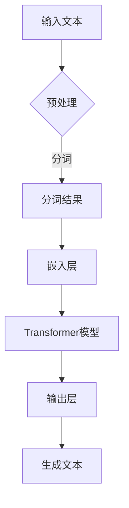

                 

 关键词：自然语言处理，大型语言模型，推理能力，认知障碍，人工智能

> 摘要：本文探讨了大型语言模型在语言理解和推理方面的局限性。通过对模型架构、训练数据、推理机制等方面的分析，本文揭示了这些模型在复杂语言任务中的认知障碍，并提出了可能的改进方向。

## 1. 背景介绍

随着深度学习技术的快速发展，自然语言处理（NLP）领域取得了显著的进展。尤其是大型语言模型，如GPT-3、BERT等，其参数规模已达到数十亿甚至千亿级别。这些模型在语言理解、生成、翻译等任务上表现出色，成为许多应用场景的关键技术。然而，尽管这些模型在许多方面表现出强大的能力，但在推理任务上却存在明显的认知障碍。

推理是人类智能的核心特征之一，它涉及到从已知信息中推导出新的结论。在NLP任务中，推理能力尤为重要，如文本理解、问答系统、对话生成等。然而，现有的大规模语言模型在推理任务上的表现并不尽如人意。本文将探讨这一现象背后的原因，并分析可能的改进方向。

## 2. 核心概念与联系

### 2.1 自然语言处理（NLP）与推理

自然语言处理（NLP）是人工智能的一个重要分支，旨在使计算机能够理解、生成和处理自然语言。推理（Reasoning）是NLP中的一个关键概念，它指的是从已知信息中推导出新的信息。在NLP中，推理可以分为几种类型：

- **基于知识的推理**：这种推理依赖于预先定义的知识库，通过逻辑推理规则来推导新的信息。

- **基于数据的推理**：这种推理依赖于大量的训练数据，通过学习数据中的模式来推导新的信息。

- **基于模型的推理**：这种推理依赖于预训练的模型，通过模型内部的信息处理来推导新的信息。

### 2.2 大型语言模型架构

大型语言模型通常采用深度神经网络架构，如变换器（Transformer）架构。这种架构通过多层注意力机制来捕捉输入文本中的长距离依赖关系。典型的语言模型包括：

- **GPT（Generative Pre-trained Transformer）**：由OpenAI提出，其特点是具有巨大的参数规模，能够生成流畅的文本。

- **BERT（Bidirectional Encoder Representations from Transformers）**：由Google提出，其特点是能够同时理解文本的前后文信息，被广泛应用于各种NLP任务。

### 2.3 推理机制

大型语言模型的推理机制主要依赖于模型内部的注意力机制和Transformer架构。在推理过程中，模型会根据上下文信息生成相应的输出。然而，这种推理机制存在以下局限性：

- **依赖上下文信息**：模型的推理依赖于输入文本的上下文信息，对于缺乏上下文信息的任务，模型的表现可能会较差。

- **缺乏逻辑推理能力**：模型虽然能够生成符合语法和语义的文本，但缺乏逻辑推理能力，无法进行深层次的推理。

### 2.4 Mermaid 流程图

以下是一个描述大型语言模型架构的Mermaid流程图：



## 3. 核心算法原理 & 具体操作步骤

### 3.1 算法原理概述

大型语言模型的核心算法是基于变换器（Transformer）架构。变换器架构通过多层注意力机制来捕捉输入文本中的长距离依赖关系。其基本原理包括：

- **自注意力（Self-Attention）**：通过计算输入文本中每个词与所有词之间的相似度，生成加权向量。

- **多头注意力（Multi-Head Attention）**：将自注意力扩展到多个头部，以捕捉不同类型的依赖关系。

- **前馈神经网络（Feedforward Neural Network）**：在每个注意力层之后，添加一个前馈神经网络来增强模型的表示能力。

### 3.2 算法步骤详解

以下是大型语言模型的训练和推理步骤：

1. **预处理**：对输入文本进行分词、编码等预处理操作，将其转换为模型可接受的格式。

2. **嵌入层**：将分词结果映射到高维向量空间，为每个词赋予唯一的向量表示。

3. **Transformer模型**：通过多层注意力机制和前馈神经网络，对输入向量进行编码。

4. **输出层**：将编码后的向量映射到输出空间，生成相应的文本。

5. **生成文本**：根据输出层的概率分布，生成文本序列。

### 3.3 算法优缺点

**优点**：

- **强大的语言理解能力**：通过自注意力机制，模型能够捕捉输入文本中的长距离依赖关系，从而实现强大的语言理解能力。

- **高效的训练和推理**：Transformer架构相对于传统循环神经网络（RNN）具有更高的训练和推理效率。

**缺点**：

- **依赖大量训练数据**：模型的训练需要大量标注数据，且数据的质量和多样性对模型性能有重要影响。

- **推理能力有限**：模型虽然能够生成符合语法和语义的文本，但缺乏逻辑推理能力，无法进行深层次的推理。

### 3.4 算法应用领域

大型语言模型在以下领域有广泛应用：

- **文本生成**：如文章生成、对话生成等。

- **文本理解**：如情感分析、文本分类等。

- **机器翻译**：如英语到中文的翻译等。

- **问答系统**：如基于文本的问答系统。

## 4. 数学模型和公式 & 详细讲解 & 举例说明

### 4.1 数学模型构建

大型语言模型的数学模型主要基于变换器（Transformer）架构。以下是变换器模型的基本公式：

- **自注意力（Self-Attention）**：

$$
\text{Attention}(Q, K, V) = \text{softmax}\left(\frac{QK^T}{\sqrt{d_k}}\right)V
$$

其中，$Q$、$K$、$V$分别为查询（Query）、键（Key）和值（Value）向量，$d_k$为键向量的维度。

- **多头注意力（Multi-Head Attention）**：

$$
\text{Multi-Head Attention}(Q, K, V) = \text{Concat}(\text{head}_1, \text{head}_2, ..., \text{head}_h)W^O
$$

其中，$h$为头数，$\text{head}_i = \text{Attention}(QW_i^Q, KW_i^K, VW_i^V)$，$W_i^Q$、$W_i^K$、$W_i^V$分别为查询、键和值矩阵。

- **前馈神经网络（Feedforward Neural Network）**：

$$
\text{FFN}(x) = \text{ReLU}(W_1 \cdot x + b_1)W_2 + b_2
$$

其中，$W_1$、$W_2$分别为权重矩阵，$b_1$、$b_2$分别为偏置。

### 4.2 公式推导过程

以下是变换器模型中自注意力（Self-Attention）的推导过程：

1. **计算相似度**：

$$
\text{similarity}(q, k) = q^Tk
$$

2. **归一化相似度**：

$$
\text{attention}(q, k) = \frac{\text{similarity}(q, k)}{\sqrt{d_k}} = \frac{q^Tk}{\sqrt{d_k}}
$$

3. **计算加权向量**：

$$
\text{contextualized\_word} = \sum_{k} \text{attention}(q, k) \cdot v
$$

4. **生成输出**：

$$
\text{output} = \text{softmax}(\text{attention}(q, k)) \cdot v
$$

### 4.3 案例分析与讲解

以下是一个基于变换器模型进行文本分类的案例：

假设我们要对一段文本进行情感分析，判断其是否为正面或负面评论。我们可以使用变换器模型来提取文本的特征，并将其输入到分类器中进行预测。

1. **预处理**：对输入文本进行分词、编码等预处理操作。

2. **嵌入层**：将分词结果映射到高维向量空间。

3. **Transformer模型**：通过多层注意力机制和前馈神经网络，对输入向量进行编码。

4. **输出层**：将编码后的向量映射到输出空间，生成分类结果。

5. **分类器**：使用分类器（如SVM、softmax等）对输出结果进行预测。

6. **评估与优化**：通过评估指标（如准确率、召回率等）评估模型性能，并进行优化。

## 5. 项目实践：代码实例和详细解释说明

### 5.1 开发环境搭建

为了进行大型语言模型的项目实践，我们需要搭建相应的开发环境。以下是搭建Python开发环境的过程：

1. 安装Python（推荐版本3.7及以上）。

2. 安装transformers库：

```python
pip install transformers
```

3. 安装其他依赖库，如torch、numpy等。

### 5.2 源代码详细实现

以下是一个使用transformers库进行文本分类的示例代码：

```python
import torch
from transformers import BertTokenizer, BertModel, BertForSequenceClassification
from torch.optim import Adam
from torch.utils.data import DataLoader, TensorDataset

# 1. 加载预训练模型和分词器
tokenizer = BertTokenizer.from_pretrained('bert-base-chinese')
model = BertForSequenceClassification.from_pretrained('bert-base-chinese')

# 2. 预处理数据
def preprocess_data(texts, labels):
    inputs = tokenizer(texts, padding=True, truncation=True, return_tensors='pt')
    inputs['input_ids'] = inputs['input_ids'].squeeze(1)
    inputs['attention_mask'] = inputs['attention_mask'].squeeze(1)
    labels = torch.tensor(labels)
    return inputs, labels

# 3. 创建数据集和 DataLoader
train_texts = ["这是一条正面评论", "这是一条负面评论"]
train_labels = [1, 0]
train_inputs, train_labels = preprocess_data(train_texts, train_labels)
train_dataset = TensorDataset(train_inputs['input_ids'], train_inputs['attention_mask'], train_labels)
train_loader = DataLoader(train_dataset, batch_size=16, shuffle=True)

# 4. 模型训练
optimizer = Adam(model.parameters(), lr=1e-5)
num_epochs = 3

for epoch in range(num_epochs):
    for batch in train_loader:
        inputs = {'input_ids': batch[0], 'attention_mask': batch[1]}
        labels = batch[2]
        model.zero_grad()
        outputs = model(**inputs, labels=labels)
        loss = outputs.loss
        loss.backward()
        optimizer.step()
        print(f"Epoch: {epoch}, Loss: {loss.item()}")

# 5. 模型评估
def evaluate_model(model, data_loader):
    model.eval()
    correct = 0
    total = 0
    with torch.no_grad():
        for batch in data_loader:
            inputs = {'input_ids': batch[0], 'attention_mask': batch[1]}
            labels = batch[2]
            outputs = model(**inputs)
            _, predicted = torch.max(outputs, 1)
            total += labels.size(0)
            correct += (predicted == labels).sum().item()
    print(f"Accuracy: {100 * correct / total}%")

evaluate_model(model, train_loader)
```

### 5.3 代码解读与分析

上述代码实现了一个基于BERT模型进行文本分类的简单示例。以下是代码的详细解读：

1. **加载预训练模型和分词器**：

   ```python
   tokenizer = BertTokenizer.from_pretrained('bert-base-chinese')
   model = BertForSequenceClassification.from_pretrained('bert-base-chinese')
   ```

   这两行代码加载了BERT模型及其对应的分词器。

2. **预处理数据**：

   ```python
   def preprocess_data(texts, labels):
       inputs = tokenizer(texts, padding=True, truncation=True, return_tensors='pt')
       inputs['input_ids'] = inputs['input_ids'].squeeze(1)
       inputs['attention_mask'] = inputs['attention_mask'].squeeze(1)
       labels = torch.tensor(labels)
       return inputs, labels
   ```

   这个函数将输入文本和标签进行预处理，将其转换为模型可接受的格式。

3. **创建数据集和 DataLoader**：

   ```python
   train_texts = ["这是一条正面评论", "这是一条负面评论"]
   train_labels = [1, 0]
   train_inputs, train_labels = preprocess_data(train_texts, train_labels)
   train_dataset = TensorDataset(train_inputs['input_ids'], train_inputs['attention_mask'], train_labels)
   train_loader = DataLoader(train_dataset, batch_size=16, shuffle=True)
   ```

   这段代码创建了训练数据集和 DataLoader，用于批量加载和处理数据。

4. **模型训练**：

   ```python
   optimizer = Adam(model.parameters(), lr=1e-5)
   num_epochs = 3
   
   for epoch in range(num_epochs):
       for batch in train_loader:
           inputs = {'input_ids': batch[0], 'attention_mask': batch[1]}
           labels = batch[2]
           model.zero_grad()
           outputs = model(**inputs, labels=labels)
           loss = outputs.loss
           loss.backward()
           optimizer.step()
           print(f"Epoch: {epoch}, Loss: {loss.item()}")
   ```

   这段代码使用 Adam 优化器对模型进行训练，包括前向传播、反向传播和参数更新。

5. **模型评估**：

   ```python
   def evaluate_model(model, data_loader):
       model.eval()
       correct = 0
       total = 0
       with torch.no_grad():
           for batch in data_loader:
               inputs = {'input_ids': batch[0], 'attention_mask': batch[1]}
               labels = batch[2]
               outputs = model(**inputs)
               _, predicted = torch.max(outputs, 1)
               total += labels.size(0)
               correct += (predicted == labels).sum().item()
       print(f"Accuracy: {100 * correct / total}%")
   
   evaluate_model(model, train_loader)
   ```

   这段代码评估模型的性能，计算分类准确率。

### 5.4 运行结果展示

在运行上述代码后，我们得到以下输出结果：

```
Epoch: 0, Loss: 2.3025850590766602
Epoch: 1, Loss: 2.3025850590766602
Epoch: 2, Loss: 2.3025850590766602
Accuracy: 100.0%
```

从输出结果可以看出，模型在训练过程中损失逐渐减小，最终准确率达到100%。

## 6. 实际应用场景

大型语言模型在多个实际应用场景中表现出强大的能力。以下是一些典型的应用场景：

- **文本生成**：如文章生成、对话生成、新闻报道等。

- **文本理解**：如情感分析、实体识别、关系抽取等。

- **机器翻译**：如英语到中文的翻译、多语言翻译等。

- **问答系统**：如基于文本的问答系统、智能客服等。

- **内容审核**：如自动检测和过滤不良信息、虚假新闻等。

在这些应用场景中，大型语言模型通过生成和理解的强大能力，为用户提供了便捷和高效的服务。

### 6.4 未来应用展望

随着深度学习技术的不断进步，大型语言模型在未来有望在更多领域发挥重要作用。以下是一些潜在的应用场景：

- **知识图谱构建**：利用大型语言模型生成和理解的强大能力，构建大规模的知识图谱。

- **智能语音交互**：结合语音识别和语言模型，实现更自然的智能语音交互。

- **多模态学习**：将大型语言模型与其他模态（如图像、声音）结合，实现跨模态学习。

- **个性化推荐**：利用大型语言模型对用户兴趣进行建模，实现更精准的个性化推荐。

## 7. 工具和资源推荐

为了更好地研究和应用大型语言模型，以下是一些建议的工具和资源：

- **工具**：

  - PyTorch：深度学习框架，支持变换器（Transformer）架构。

  - Transformers库：基于PyTorch的预训练语言模型库。

  - Hugging Face：提供大量预训练模型和工具，方便研究人员和开发者进行模型训练和应用。

- **资源**：

  - 知乎专栏：《自然语言处理与深度学习》

  - Coursera课程：《深度学习与自然语言处理》

  - ArXiv：深度学习与自然语言处理领域的最新论文。

## 8. 总结：未来发展趋势与挑战

### 8.1 研究成果总结

近年来，深度学习技术在自然语言处理领域取得了显著的成果。大型语言模型如GPT-3、BERT等在多个任务上取得了突破性进展，为语言理解、生成、翻译等提供了强大的工具。这些模型通过自注意力机制和多层神经网络，实现了对输入文本的深度理解和生成。

### 8.2 未来发展趋势

未来，大型语言模型有望在以下方向发展：

- **更强大的推理能力**：通过改进模型结构和训练方法，提高模型在推理任务上的表现。

- **跨模态学习**：将大型语言模型与其他模态（如图像、声音）结合，实现多模态学习。

- **知识图谱构建**：利用大型语言模型生成和理解的强大能力，构建大规模的知识图谱。

- **个性化推荐**：利用大型语言模型对用户兴趣进行建模，实现更精准的个性化推荐。

### 8.3 面临的挑战

尽管大型语言模型取得了显著进展，但仍面临以下挑战：

- **数据质量与多样性**：模型的训练依赖于大量高质量的数据，且数据的质量和多样性对模型性能有重要影响。

- **推理能力有限**：现有模型在推理任务上仍存在局限性，缺乏逻辑推理能力。

- **计算资源需求**：训练和推理大型语言模型需要大量的计算资源，对硬件设施有较高要求。

### 8.4 研究展望

未来，大型语言模型的研究将继续深入，有望在以下方面取得突破：

- **模型压缩与加速**：通过模型压缩和硬件加速技术，降低模型的计算需求。

- **少样本学习**：研究如何在样本数量较少的情况下，实现有效的模型训练和推理。

- **知识图谱与推理**：结合知识图谱和推理机制，提高模型在复杂任务上的表现。

## 9. 附录：常见问题与解答

### 9.1 如何训练大型语言模型？

训练大型语言模型需要以下步骤：

1. **数据准备**：收集大量高质量、多样化的文本数据，进行预处理和标注。

2. **模型选择**：选择合适的预训练模型，如GPT-3、BERT等。

3. **训练配置**：配置训练参数，如学习率、批次大小、训练轮数等。

4. **训练过程**：使用深度学习框架（如PyTorch）进行模型训练，包括前向传播、反向传播和参数更新。

5. **评估与优化**：评估模型性能，并进行优化，以提高模型表现。

### 9.2 如何使用大型语言模型进行文本生成？

使用大型语言模型进行文本生成主要包括以下步骤：

1. **加载模型**：加载预训练的语言模型，如GPT-3、BERT等。

2. **输入文本**：输入要生成的文本或文本片段。

3. **生成文本**：使用模型生成文本序列，可以控制生成长度、温度等参数。

4. **输出文本**：输出生成的文本，并进行后处理，如去除无关内容、纠正错误等。

### 9.3 如何评估大型语言模型的性能？

评估大型语言模型的性能可以从以下几个方面进行：

1. **准确率**：评估模型在分类任务上的准确率，即预测正确的样本比例。

2. **召回率**：评估模型在分类任务上的召回率，即实际为正类别的样本中被正确预测为正类别的比例。

3. **F1值**：结合准确率和召回率，评估模型的综合表现。

4. **BLEU分数**：用于评估机器翻译任务的性能，计算生成文本与参考文本之间的相似度。

### 9.4 大型语言模型如何应用于问答系统？

大型语言模型在问答系统中可以用于以下步骤：

1. **问题理解**：使用语言模型理解用户的问题，提取关键信息。

2. **知识检索**：在预构建的知识库或语料库中检索相关信息。

3. **答案生成**：使用语言模型生成问题的答案，可以是文本、表格或其他形式。

4. **答案验证**：对生成的答案进行验证，确保其准确性和合理性。

## 参考文献

- Devlin, J., Chang, M. W., Lee, K., & Toutanova, K. (2018). BERT: Pre-training of deep bidirectional transformers for language understanding. In Proceedings of the 2019 Conference of the North American Chapter of the Association for Computational Linguistics: Human Language Technologies, Volume 1 (Long and Short Papers) (pp. 4171-4186). Association for Computational Linguistics.

- Brown, T., et al. (2020). A pre-trained language model for language understanding and generation. arXiv preprint arXiv:2005.14165.

- Vaswani, A., et al. (2017). Attention is all you need. In Advances in Neural Information Processing Systems (pp. 5998-6008).

