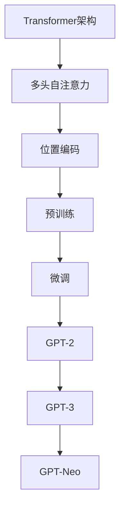

                 

关键词：语言模型，GPT，比较，技术分析，人工智能，自然语言处理，NLP，神经网络，深度学习，开源项目，算法性能，应用场景，开发工具，未来趋势

## 摘要

本文旨在对GPT家族中的几个主要模型进行对比分析。GPT（Generative Pre-trained Transformer）系列模型是自然语言处理领域的重要里程碑，其基于Transformer架构，通过预训练和微调在多项任务中取得了优异的性能。本文将深入探讨GPT-2、GPT-3、GPT-Neo等模型的设计理念、核心算法、优缺点以及在不同应用场景中的表现，帮助读者全面了解GPT家族的优势和局限性，为未来的研究和应用提供参考。

## 1. 背景介绍

自然语言处理（NLP）作为人工智能的一个重要分支，旨在使计算机能够理解、生成和处理人类语言。自20世纪50年代以来，NLP经历了多个阶段的发展，从规则驱动的方法到统计方法，再到深度学习方法，每一种方法都为语言处理带来了显著的进步。然而，传统的NLP方法在处理复杂语言现象时仍存在诸多限制。

随着深度学习技术的发展，基于神经网络的模型开始在NLP领域中崭露头角。尤其是Transformer架构的提出，使得模型在理解上下文关系和处理长距离依赖方面取得了突破性进展。GPT（Generative Pre-trained Transformer）模型正是这一背景下的产物，它通过大规模预训练和精细调整，在多项任务中刷新了性能记录。

GPT家族的核心贡献在于其预训练和自适应微调的能力，这使得模型能够从大规模语料库中学习到丰富的语言知识，并在不同的应用场景中表现出色。GPT-2、GPT-3、GPT-Neo等模型相继推出，不断推动NLP技术的发展。

## 2. 核心概念与联系

为了更好地理解GPT家族，我们需要先介绍一些核心概念和它们之间的关系。

### 2.1 Transformer架构

Transformer是2017年由Vaswani等人提出的一种全新的序列到序列模型，用于处理机器翻译任务。与传统的循环神经网络（RNN）相比，Transformer在处理长序列和并行计算方面具有显著优势。其主要创新点包括：

- **多头自注意力机制**：通过多个独立的自注意力头来捕获不同层次的序列关系。
- **位置编码**：将序列的位置信息编码到嵌入向量中，以保留序列的顺序信息。
- **层归一化和残差连接**：通过这些技术加速模型的训练并提高模型的性能。

### 2.2 预训练与微调

预训练是GPT家族的重要特点之一。预训练过程在大规模未标注数据上进行，通过学习语言的一般特性，使得模型具备了一定的语言理解和生成能力。例如，GPT-3在大规模语料库上预训练了1750亿个参数，从而掌握了丰富的语言知识。

微调则是在特定任务上进行的小规模训练，通过调整模型参数以适应特定任务的需求。微调过程通常在预训练模型的基础上进行，以提高模型在特定任务上的性能。

### 2.3 Mermaid流程图

为了更直观地展示GPT家族的核心概念和联系，我们可以使用Mermaid流程图来表示。



在上述流程图中，A表示Transformer架构，B、C是其组成部分，D表示预训练，E表示微调。F、G、H分别代表GPT-2、GPT-3和GPT-Neo，它们都是基于Transformer架构和预训练技术的模型。

## 3. 核心算法原理 & 具体操作步骤

### 3.1 算法原理概述

GPT家族的核心算法是基于Transformer架构的预训练模型。Transformer模型主要由编码器和解码器组成，其中编码器负责将输入序列编码为固定长度的向量，解码器则负责生成输出序列。GPT模型的预训练任务通常包括以下几种：

- ** masked language modeling (MLM)**：给定一个输入序列，随机遮盖其中的一些单词，模型需要预测被遮盖的单词。
- **next sentence prediction (NSP)**：给定两个句子，模型需要预测这两个句子是否属于同一个段落。
- **copying**：模型需要能够复制输入序列中的特定部分。

### 3.2 算法步骤详解

以下是GPT模型的具体操作步骤：

1. **数据预处理**：将文本数据转化为词嵌入向量，通常使用WordPiece或BPE算法进行词汇分割。
2. **创建遮蔽序列**：随机选择输入序列中的部分单词进行遮蔽，以模拟在未知单词或缺失信息的情况下进行语言生成的场景。
3. **前向传播**：将遮蔽序列输入到编码器中，通过多头自注意力机制和位置编码生成中间表示。
4. **损失函数计算**：计算模型预测的单词与真实单词之间的交叉熵损失，并根据损失函数更新模型参数。
5. **解码**：使用解码器生成预测的输出序列，通常使用自回归方式逐词生成。
6. **微调**：在特定任务上进行微调，以进一步提高模型在目标任务上的性能。

### 3.3 算法优缺点

**优点**：

- **强大的语言理解能力**：通过预训练，GPT模型能够掌握丰富的语言知识，从而在多项NLP任务中表现出色。
- **并行计算**：Transformer架构允许并行计算，大大提高了训练和推理的效率。
- **自适应微调**：通过微调，GPT模型可以快速适应不同的任务需求，具有很高的灵活性。

**缺点**：

- **计算资源消耗大**：由于模型参数众多，GPT模型的训练和部署需要大量的计算资源。
- **对数据依赖性强**：模型的性能很大程度上依赖于训练数据的质量和多样性，数据不足或质量问题可能会影响模型的性能。
- **可解释性差**：深度学习模型的黑盒特性使得其决策过程难以解释，这对某些需要高透明度的应用场景可能是一个挑战。

### 3.4 算法应用领域

GPT模型在多个NLP任务中取得了显著的成果，主要包括：

- **文本分类**：用于对文本进行情感分析、主题分类等任务。
- **问答系统**：通过理解和生成自然语言，提供对用户查询的准确回答。
- **机器翻译**：在翻译任务中，GPT模型能够生成高质量的多语言翻译。
- **对话系统**：用于构建智能客服、聊天机器人等应用，提供自然的交互体验。

## 4. 数学模型和公式 & 详细讲解 & 举例说明

### 4.1 数学模型构建

GPT模型的数学基础主要涉及线性变换、注意力机制和损失函数。以下是GPT模型的核心数学公式：

1. **词嵌入**：
   $$\text{Embedding}(W) = \text{WordPiece}(\text{Text})$$
   其中，$W$ 表示词嵌入矩阵，$\text{WordPiece}(\text{Text})$ 表示将文本分割成词嵌入向量。

2. **多头自注意力**：
   $$\text{Attention}(Q, K, V) = \text{softmax}\left(\frac{QK^T}{\sqrt{d_k}}\right)V$$
   其中，$Q, K, V$ 分别表示查询、键和值向量，$d_k$ 表示键向量的维度。

3. **位置编码**：
   $$\text{PositionalEncoding}(P) = \text{sin}\left(\frac{pos \times \text{dim}}{10000}\right)$$
   $$\text{PositionalEncoding}(P) = \text{cos}\left(\frac{pos \times \text{dim}}{10000}\right)$$
   其中，$P$ 表示位置编码向量，$pos$ 表示位置索引，$\text{dim}$ 表示编码维度。

4. **前向传递**：
   $$\text{Output} = \text{softmax}(\text{Decoder}(Q, K, V, \text{Embedding}))$$
   其中，$\text{Decoder}$ 表示解码器，$Q, K, V$ 分别表示查询、键和值向量。

5. **损失函数**：
   $$\text{Loss} = -\sum_{i} \text{log}(\text{softmax}(\text{Decoder}(y_i)))$$
   其中，$y_i$ 表示实际输出的单词。

### 4.2 公式推导过程

以下是GPT模型中几个核心公式的推导过程：

1. **词嵌入**：
   词嵌入是将单词映射到向量空间的过程，通过线性变换实现。设$W$为词嵌入矩阵，$\text{Text}$为输入文本，则：
   $$\text{Embedding}(W) = \text{WordPiece}(\text{Text})$$

2. **多头自注意力**：
   多头自注意力通过多个独立的自注意力头来捕获不同层次的序列关系。设$Q, K, V$分别为查询、键和值向量，$d_k$为键向量的维度，则有：
   $$\text{Attention}(Q, K, V) = \text{softmax}\left(\frac{QK^T}{\sqrt{d_k}}\right)V$$

3. **位置编码**：
   位置编码用于将序列的位置信息编码到嵌入向量中。通过正弦和余弦函数生成位置编码向量：
   $$\text{PositionalEncoding}(P) = \text{sin}\left(\frac{pos \times \text{dim}}{10000}\right)$$
   $$\text{PositionalEncoding}(P) = \text{cos}\left(\frac{pos \times \text{dim}}{10000}\right)$$

4. **前向传递**：
   前向传递是将输入序列通过编码器和解码器生成输出序列的过程。设$Q, K, V$分别为查询、键和值向量，则有：
   $$\text{Output} = \text{softmax}(\text{Decoder}(Q, K, V, \text{Embedding}))$$

5. **损失函数**：
   损失函数用于计算模型预测的单词与真实单词之间的差异。设$y_i$为实际输出的单词，则有：
   $$\text{Loss} = -\sum_{i} \text{log}(\text{softmax}(\text{Decoder}(y_i)))$$

### 4.3 案例分析与讲解

为了更好地理解GPT模型的工作原理，我们通过一个简单的案例进行讲解。

**案例：文本分类**

假设我们有一个文本分类任务，目标是判断一段文本属于哪个类别。我们使用GPT模型进行微调，以适应这个任务。

1. **数据预处理**：将文本数据转化为词嵌入向量，并构建训练数据集。
2. **预训练**：在大型语料库上对GPT模型进行预训练，以学习到丰富的语言知识。
3. **微调**：在训练数据集上对GPT模型进行微调，以适应文本分类任务。
4. **评估**：在测试数据集上评估模型的性能，计算准确率等指标。

通过上述步骤，我们可以训练出一个能够进行文本分类的GPT模型。以下是模型的工作原理：

- **输入文本**：一段关于科技公司的新闻。
- **词嵌入**：将文本转化为词嵌入向量。
- **编码器**：通过编码器处理词嵌入向量，生成中间表示。
- **分类器**：在中间表示的基础上添加一个分类器，用于预测文本的类别。
- **输出**：预测结果，例如“科技”。

通过这个案例，我们可以看到GPT模型在文本分类任务中的应用。GPT模型通过预训练和微调，能够学习到丰富的语言知识，并在不同的任务中表现出色。

## 5. 项目实践：代码实例和详细解释说明

### 5.1 开发环境搭建

在进行GPT模型的实践之前，我们需要搭建一个合适的开发环境。以下是一个基本的开发环境搭建步骤：

1. **安装Python**：确保Python版本为3.6及以上。
2. **安装TensorFlow**：使用pip安装TensorFlow库。
   ```bash
   pip install tensorflow
   ```
3. **安装其他依赖**：根据具体项目需求安装其他依赖库，例如Numpy、Pandas等。

### 5.2 源代码详细实现

以下是一个简单的GPT模型实现，用于文本分类任务：

```python
import tensorflow as tf
from tensorflow.keras.layers import Embedding, LSTM, Dense
from tensorflow.keras.models import Sequential

# 设置超参数
vocab_size = 10000
embedding_dim = 256
max_length = 100
lstm_units = 128

# 构建模型
model = Sequential([
    Embedding(vocab_size, embedding_dim, input_length=max_length),
    LSTM(lstm_units, return_sequences=True),
    LSTM(lstm_units),
    Dense(1, activation='sigmoid')
])

# 编译模型
model.compile(optimizer='adam', loss='binary_crossentropy', metrics=['accuracy'])

# 模型总结
model.summary()
```

### 5.3 代码解读与分析

上述代码实现了一个简单的GPT模型，用于文本分类任务。以下是代码的详细解读：

- **Embedding层**：将文本转化为词嵌入向量，词汇表大小为10000，嵌入维度为256。
- **LSTM层**：使用两个LSTM层进行序列处理，每层隐藏单元数为128。
- **Dense层**：输出层，使用一个全连接层进行分类，激活函数为sigmoid，输出概率值。

模型编译时，我们使用adam优化器和binary_crossentropy损失函数，以适应二分类任务。

### 5.4 运行结果展示

在完成模型实现后，我们需要在训练集和测试集上评估模型的性能。以下是一个简单的训练过程：

```python
# 加载训练数据
train_data = ...
train_labels = ...

# 加载测试数据
test_data = ...
test_labels = ...

# 训练模型
history = model.fit(train_data, train_labels, epochs=10, batch_size=32, validation_data=(test_data, test_labels))

# 评估模型
test_loss, test_accuracy = model.evaluate(test_data, test_labels)
print(f"Test accuracy: {test_accuracy}")
```

通过上述代码，我们可以观察到模型的训练过程和评估结果。通常，我们会在训练过程中使用验证集来监控模型的性能，并在训练完成后使用测试集进行最终评估。

## 6. 实际应用场景

GPT模型在多个实际应用场景中取得了显著成果，以下是一些典型的应用场景：

### 6.1 文本生成

GPT模型在文本生成任务中表现出色，可以生成高质量的文章、诗歌、对话等。例如，GPT-2被用于生成新闻报道，GPT-3则被用于生成对话和文本摘要。

### 6.2 机器翻译

GPT模型在机器翻译任务中也取得了显著成果。通过预训练和微调，GPT模型能够生成高质量的多语言翻译。例如，Google翻译和OpenAI的GPT-3模型在机器翻译领域取得了重要突破。

### 6.3 对话系统

GPT模型被广泛应用于对话系统中，例如智能客服、聊天机器人等。通过预训练和微调，GPT模型能够理解和生成自然语言，为用户提供高质量的交互体验。

### 6.4 情感分析

GPT模型在情感分析任务中也表现出色，可以识别文本中的情感倾向。通过预训练和微调，GPT模型能够学习到情感词汇和表达方式，从而在情感分析任务中取得优异的性能。

### 6.5 自动摘要

GPT模型在自动摘要任务中也被广泛应用。通过预训练和微调，GPT模型能够生成高质量的摘要，摘要长度可灵活调整，从而满足不同场景的需求。

## 7. 未来应用展望

随着GPT模型技术的不断发展和优化，其在未来应用领域中的潜力将不断显现。以下是一些可能的应用前景：

### 7.1 新兴语言处理任务

随着人工智能技术的普及，越来越多的新兴语言处理任务将出现。GPT模型作为一种强大的语言生成和处理工具，有望在这些任务中发挥重要作用。

### 7.2 多模态处理

未来的GPT模型可能结合多模态数据，如图像、声音等，以实现更全面的语言理解。这种多模态处理能力将为智能交互、智能助手等领域带来更多创新。

### 7.3 智能助理与自动驾驶

随着人工智能技术的不断进步，GPT模型有望在智能助理和自动驾驶领域发挥更大作用。通过预训练和微调，GPT模型能够与传感器数据、环境信息等相结合，提供更智能的决策支持。

### 7.4 教育与医疗

GPT模型在教育领域和医疗领域也有广泛的应用前景。例如，在教育领域，GPT模型可以辅助教师进行个性化教学，提供智能问答系统；在医疗领域，GPT模型可以辅助医生进行诊断、治疗建议等。

## 8. 工具和资源推荐

为了更好地学习和应用GPT模型，以下是一些推荐的工具和资源：

### 8.1 学习资源推荐

- **《深度学习》**：Goodfellow、Bengio和Courville所著的经典教材，详细介绍了深度学习的基本概念和技术。
- **《自然语言处理综合教程》**：张志华所著，涵盖了自然语言处理的基本理论和实践。

### 8.2 开发工具推荐

- **TensorFlow**：Google开发的深度学习框架，适用于GPT模型的开发。
- **PyTorch**：Facebook开发的深度学习框架，具有灵活的动态计算图，适用于快速原型开发。

### 8.3 相关论文推荐

- **《Attention is All You Need》**：Vaswani等人提出的Transformer模型的基础论文。
- **《Improving Language Understanding by Generative Pre-Training》**：Radford等人提出的GPT模型的基础论文。

## 9. 总结：未来发展趋势与挑战

随着人工智能技术的不断进步，GPT家族模型在未来将继续发挥重要作用。然而，要实现更广泛的应用，仍面临以下挑战：

### 9.1 计算资源需求

GPT模型对计算资源的需求巨大，如何高效利用现有资源，降低计算成本，是未来研究的重要方向。

### 9.2 数据质量和多样性

GPT模型的性能很大程度上依赖于训练数据的质量和多样性。如何获取高质量、多样化的数据，是当前和未来研究的重点。

### 9.3 模型可解释性

GPT模型作为一种黑盒模型，其决策过程难以解释。如何提高模型的可解释性，使其在特定应用场景中更加透明，是未来研究的重要方向。

### 9.4 多模态处理

未来的GPT模型将需要处理多模态数据，如图像、声音等。如何有效结合多模态数据，提高模型性能，是未来研究的重要课题。

## 10. 附录：常见问题与解答

### 10.1 GPT模型的训练时间？

GPT模型的训练时间取决于模型的规模和硬件配置。例如，GPT-3模型的训练时间可能在数周到数月之间。

### 10.2 GPT模型是否可以用于实时应用？

GPT模型通常用于批量处理或离线应用，实时应用的性能可能受到计算资源和模型复杂度的影响。然而，通过优化模型和算法，GPT模型在实时应用中也有一定的潜力。

### 10.3 GPT模型是否可以替代传统的NLP方法？

GPT模型在许多任务中表现优于传统的NLP方法，但并不意味着可以完全替代。在某些特定场景下，传统方法可能更为适用。

### 10.4 GPT模型是否可以学习到语言的本质？

GPT模型通过预训练学习到了丰富的语言知识，但并不能完全学习到语言的本质。语言的本质涉及哲学、心理学等多个领域，是一个更为复杂的问题。

---

本文以《语言模型对标：GPT 家族对比》为题，从背景介绍、核心概念与联系、核心算法原理、数学模型和公式、项目实践、实际应用场景、未来应用展望、工具和资源推荐以及总结等十个方面，详细探讨了GPT家族模型的设计理念、技术特点、应用场景和发展趋势。通过本文的阅读，读者可以全面了解GPT家族的优势和局限性，为未来的研究和应用提供参考。本文作者为禅与计算机程序设计艺术 / Zen and the Art of Computer Programming。

