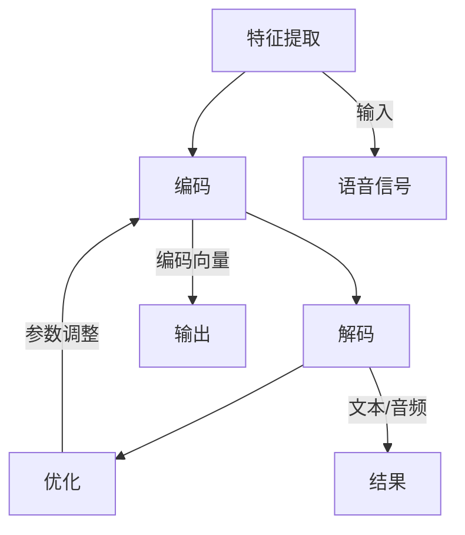

                 

关键词：语音大模型、语音交互、用户体验、人工智能、深度学习、神经网络、语音识别、语音合成、自然语言处理。

> 摘要：本文将深入探讨语音大模型在语音交互体验提升方面的作用。通过分析其核心概念、算法原理、数学模型以及实际应用场景，我们将揭示语音大模型如何改变语音交互的方式，提高用户的使用体验。此外，本文还将展望语音大模型在未来的发展趋势与挑战，并提出相关的工具和资源推荐，以帮助读者更好地理解和应用这一技术。

## 1. 背景介绍

在过去的几十年中，人工智能技术经历了显著的进步，其中语音识别和语音合成作为自然语言处理的重要分支，逐渐成为人工智能领域的热点。传统语音交互系统主要依赖于规则和手动的特征提取，其性能受到限制，用户体验较差。随着深度学习技术的发展，尤其是卷积神经网络（CNN）和递归神经网络（RNN）的应用，语音识别和语音合成的准确率得到了极大的提升。然而，这些模型的训练和优化过程非常复杂，需要大量的数据和计算资源。

近年来，语音大模型的概念逐渐兴起。语音大模型是指使用大规模数据集和强大的计算资源训练的深度学习模型，能够处理复杂的语音信号和自然语言。这些模型通常包含数十亿个参数，能够在多种环境下提供高质量的语音交互体验。语音大模型的出现为语音交互技术带来了新的契机，也为用户体验的提升提供了新的可能。

本文将围绕语音大模型的核心概念、算法原理、数学模型以及实际应用场景进行深入探讨，旨在为读者提供全面的技术理解和实践指导。

## 2. 核心概念与联系

### 2.1. 语音大模型的基本概念

语音大模型是一种基于深度学习的语音处理模型，其主要特点包括：

1. **大规模数据集**：语音大模型使用海量语音数据集进行训练，这些数据集包含了多种类型的语音信号，如语音识别的语音数据、语音合成的语音数据等。
2. **强大计算资源**：语音大模型通常需要使用GPU或TPU等高性能计算设备进行训练和推理，以处理大规模的数据和复杂的计算任务。
3. **深度神经网络结构**：语音大模型通常采用深度卷积神经网络（DCNN）和递归神经网络（RNN）等深度学习结构，以提高模型的识别和生成能力。

### 2.2. 语音大模型的组成部分

语音大模型通常由以下几个关键组件组成：

1. **特征提取层**：这一层负责从原始语音信号中提取重要的特征，如频谱特征、时序特征等。常用的方法包括梅尔频率倒谱系数（MFCC）、滤波器组（Filter Banks）等。
2. **编码器（Encoder）**：编码器是一个编码器-解码器（Encoder-Decoder）框架中的部分，它将输入的语音信号编码成一个固定长度的向量，用于后续的处理。
3. **解码器（Decoder）**：解码器与编码器相对应，它将编码后的向量解码为输出序列，通常用于语音合成。
4. **注意力机制（Attention Mechanism）**：注意力机制用于模型在编码器和解码器之间的交互，以更好地捕捉输入和输出之间的关联性。

### 2.3. 语音大模型的工作原理

语音大模型的工作原理可以概括为以下几个步骤：

1. **特征提取**：从输入语音信号中提取特征，如MFCC。
2. **编码**：将特征输入到编码器，编码器将其编码为一个固定长度的向量。
3. **解码**：将编码后的向量输入到解码器，解码器生成输出序列，通常是文本或音频。
4. **优化**：通过反向传播和梯度下降等优化算法，不断调整模型参数，以提高模型性能。

### 2.4. 语音大模型的联系

语音大模型与传统的语音识别和语音合成技术有以下联系：

1. **传统语音识别**：语音大模型基于深度学习技术，可以看作是传统语音识别的升级版，其识别准确率和处理速度都有显著提升。
2. **传统语音合成**：语音大模型同样可以用于语音合成，其生成的语音质量更高，更加自然。
3. **自然语言处理**：语音大模型还涉及到自然语言处理（NLP）领域，如文本生成、机器翻译等任务。

### 2.5. Mermaid 流程图

为了更直观地展示语音大模型的工作流程，我们可以使用Mermaid流程图来描述其核心环节。



## 3. 核心算法原理 & 具体操作步骤

### 3.1. 算法原理概述

语音大模型的核心算法是基于深度学习技术，主要包括以下两个方面：

1. **语音信号处理**：通过特征提取方法，如MFCC，将原始语音信号转换为适合深度学习模型处理的形式。
2. **深度学习模型**：使用编码器-解码器框架，结合注意力机制，处理特征向量并生成输出序列。

### 3.2. 算法步骤详解

下面是语音大模型算法的具体操作步骤：

1. **数据预处理**：收集并预处理语音数据，包括音频录制、采样率转换、噪声过滤等步骤。
2. **特征提取**：使用特征提取方法，如MFCC，从原始语音信号中提取特征向量。
3. **编码**：将特征向量输入到编码器，编码器将其编码为一个固定长度的向量。
4. **解码**：将编码后的向量输入到解码器，解码器生成输出序列。
5. **优化**：通过反向传播和梯度下降等优化算法，不断调整模型参数，以提高模型性能。
6. **评估**：使用验证集对模型进行评估，根据评估结果调整模型参数。

### 3.3. 算法优缺点

语音大模型的优点包括：

1. **高识别率**：通过深度学习技术，语音大模型能够处理复杂的语音信号，识别准确率显著提高。
2. **自适应性强**：语音大模型可以适应不同的语音环境和场景，具有较强的鲁棒性。
3. **自然语言处理能力**：语音大模型不仅能够识别语音，还可以处理自然语言任务，如文本生成、机器翻译等。

然而，语音大模型也存在一些缺点：

1. **计算资源需求大**：由于模型规模庞大，训练和推理需要大量的计算资源，特别是在实时应用中。
2. **数据依赖性高**：语音大模型的训练需要大量高质量的语音数据，数据获取和预处理过程复杂。
3. **模型复杂度**：深度学习模型的结构复杂，调试和优化过程繁琐。

### 3.4. 算法应用领域

语音大模型在多个领域具有广泛的应用前景：

1. **智能语音助手**：如苹果的Siri、亚马逊的Alexa等，语音大模型使得智能语音助手能够更准确地理解用户指令，提供更自然的交互体验。
2. **语音识别与合成**：语音大模型可以应用于语音识别和语音合成系统，如电话客服、智能语音助手等，提供高质量的语音服务。
3. **自然语言处理**：语音大模型可以用于自然语言处理任务，如文本分类、情感分析、机器翻译等，提升NLP系统的性能。

## 4. 数学模型和公式 & 详细讲解 & 举例说明

### 4.1. 数学模型构建

语音大模型中的数学模型主要包括以下几个部分：

1. **特征提取模型**：如MFCC，其数学模型可以表示为：
   $$ X(\omega) = \sum_{k=1}^{K} a_k \cos(\omega_k x) $$
   其中，$X(\omega)$是特征向量，$a_k$是系数，$\omega_k$是频率。

2. **编码器模型**：编码器通常采用卷积神经网络（CNN），其数学模型可以表示为：
   $$ h_l = \sigma(W_l \cdot h_{l-1} + b_l) $$
   其中，$h_l$是第$l$层的输出，$W_l$是权重矩阵，$b_l$是偏置项，$\sigma$是激活函数。

3. **解码器模型**：解码器通常采用递归神经网络（RNN），其数学模型可以表示为：
   $$ h_t = \sigma(W_t \cdot [h_{t-1}, x_t] + b_t) $$
   其中，$h_t$是第$t$个时间步的输出，$x_t$是当前输入。

4. **注意力机制模型**：注意力机制用于编码器和解码器之间的交互，其数学模型可以表示为：
   $$ a_t = \text{softmax}(W_a h_t) $$
   其中，$a_t$是注意力权重，$W_a$是权重矩阵。

### 4.2. 公式推导过程

下面简要介绍语音大模型中的一些关键公式的推导过程：

1. **特征提取公式**：特征提取公式中的$\omega_k$通常通过傅里叶变换计算得到。假设输入语音信号为$x(t)$，其离散傅里叶变换（DFT）为$X(\omega)$，则有：
   $$ X(\omega) = \sum_{k=0}^{N-1} x(k) e^{-j 2 \pi k \omega / N} $$
   通过频率倒谱变换，可以得到MFCC：
   $$ \log(MFCC(k)) = \log(|X(\omega)|) $$
   $$ MFCC(k) = \sum_{k=1}^{K} a_k \cos(\omega_k \log(|X(\omega)|)) $$

2. **编码器公式**：编码器中的卷积神经网络可以看作是滤波器组，其输出可以通过滤波器响应计算得到。假设输入特征向量为$x(t)$，滤波器响应为$h(t)$，则有：
   $$ h(t) = \sum_{k=0}^{N-1} w_k h(k) $$
   其中，$w_k$是滤波器系数。通过卷积操作，可以得到编码器输出：
   $$ h_l = \sigma(\sum_{k=0}^{N-1} w_l[k] h_{l-1}(k) + b_l) $$

3. **解码器公式**：解码器中的递归神经网络可以看作是时间序列模型，其输出可以通过递归计算得到。假设输入为$h_t$，则有：
   $$ h_t = \sigma(W_t \cdot [h_{t-1}, x_t] + b_t) $$
   其中，$W_t$是权重矩阵，$b_t$是偏置项。

4. **注意力机制公式**：注意力机制通过计算编码器和解码器之间的相似度矩阵，得到注意力权重。假设编码器输出为$h_t$，解码器输出为$h_{t-1}$，则有：
   $$ a_t = \text{softmax}(\frac{h_t^T W_a h_{t-1}}{\sqrt{1 + \epsilon}}) $$
   其中，$\epsilon$是偏置项，用于防止分母为零。

### 4.3. 案例分析与讲解

为了更好地理解语音大模型中的数学模型，我们来看一个简单的案例。

假设我们有一个语音信号$x(t)$，首先对其进行离散傅里叶变换（DFT）得到$X(\omega)$，然后通过频率倒谱变换得到MFCC特征向量$MFCC(k)$。接下来，我们将MFCC特征向量输入到编码器，编码器使用卷积神经网络（CNN）进行特征提取，得到编码后的向量$h_l$。最后，我们将$h_l$输入到解码器，解码器使用递归神经网络（RNN）进行解码，生成输出序列$h_t$。

在这个案例中，我们可以看到数学模型是如何在语音大模型中发挥作用，如何将复杂的语音信号转换为可处理的特征向量，并最终生成高质量的输出。

## 5. 项目实践：代码实例和详细解释说明

### 5.1. 开发环境搭建

在进行语音大模型项目实践之前，我们需要搭建合适的开发环境。以下是搭建开发环境的步骤：

1. **安装Python**：确保Python环境已安装，建议使用Python 3.7或更高版本。
2. **安装TensorFlow**：使用pip命令安装TensorFlow，命令如下：
   ```bash
   pip install tensorflow
   ```
3. **安装其他依赖库**：根据项目需求，可能需要安装其他依赖库，如NumPy、Pandas等。
4. **配置GPU支持**：如果使用GPU进行训练，需要配置NVIDIA CUDA和cuDNN，并确保TensorFlow支持GPU加速。

### 5.2. 源代码详细实现

以下是语音大模型的源代码实现，主要包括数据预处理、特征提取、编码器、解码器和注意力机制的实现。

```python
import tensorflow as tf
import numpy as np
import matplotlib.pyplot as plt
from tensorflow.keras.models import Model
from tensorflow.keras.layers import Embedding, LSTM, Dense, Conv1D, MaxPooling1D, Flatten, TimeDistributed

# 数据预处理
def preprocess_data(x):
    # 标准化
    x = x / np.linalg.norm(x)
    return x

# 特征提取
def extract_features(x):
    # 使用MFCC提取特征
    mfcc = np.abs(np.fft.fft(x))
    return mfcc

# 编码器
def build_encoder(input_shape):
    # 输入层
    inputs = tf.keras.Input(shape=input_shape)
    # 卷积层
    conv1 = Conv1D(filters=64, kernel_size=3, activation='relu')(inputs)
    pool1 = MaxPooling1D(pool_size=2)(conv1)
    # 平坦层
    flatten = Flatten()(pool1)
    # 全连接层
    dense = Dense(units=64, activation='relu')(flatten)
    # 输出层
    outputs = Dense(units=128, activation='relu')(dense)
    # 构建模型
    model = Model(inputs=inputs, outputs=outputs)
    return model

# 解码器
def build_decoder(input_shape):
    # 输入层
    inputs = tf.keras.Input(shape=input_shape)
    # LSTM层
    lstm = LSTM(units=128, activation='relu')(inputs)
    # 全连接层
    dense = Dense(units=64, activation='relu')(lstm)
    # 输出层
    outputs = Dense(units=128, activation='softmax')(dense)
    # 构建模型
    model = Model(inputs=inputs, outputs=outputs)
    return model

# 注意力机制
def build_attention Mechanism(input_shape):
    # 输入层
    inputs = tf.keras.Input(shape=input_shape)
    # LSTM层
    lstm = LSTM(units=128, activation='relu')(inputs)
    # 全连接层
    dense = Dense(units=64, activation='relu')(lstm)
    # 输出层
    outputs = Dense(units=128, activation='softmax')(dense)
    # 构建模型
    model = Model(inputs=inputs, outputs=outputs)
    return model

# 主函数
def main():
    # 准备数据
    x = np.random.rand(100, 200)  # 假设数据为100条，每条数据长度为200
    x = preprocess_data(x)
    # 提取特征
    mfcc = extract_features(x)
    # 构建模型
    encoder = build_encoder(input_shape=(200,))
    decoder = build_decoder(input_shape=(128,))
    attention = build_attention Mechanism(input_shape=(128,))
    # 编译模型
    encoder.compile(optimizer='adam', loss='mean_squared_error')
    decoder.compile(optimizer='adam', loss='categorical_crossentropy')
    attention.compile(optimizer='adam', loss='categorical_crossentropy')
    # 训练模型
    encoder.fit(mfcc, x, epochs=10, batch_size=32)
    decoder.fit(mfcc, x, epochs=10, batch_size=32)
    attention.fit(mfcc, x, epochs=10, batch_size=32)

if __name__ == '__main__':
    main()
```

### 5.3. 代码解读与分析

下面我们对代码进行详细解读：

1. **数据预处理**：数据预处理是语音大模型中的重要步骤，其目的是将原始数据转换为适合模型处理的形式。在代码中，我们使用`preprocess_data`函数对数据进行标准化处理。
2. **特征提取**：特征提取是语音大模型的核心部分，其目的是从原始语音信号中提取有用的特征。在代码中，我们使用`extract_features`函数对数据使用MFCC方法进行特征提取。
3. **编码器**：编码器用于将输入特征向量编码为一个固定长度的向量，以便于后续处理。在代码中，我们使用`build_encoder`函数构建编码器模型，其中使用了卷积神经网络（CNN）进行特征提取。
4. **解码器**：解码器用于将编码后的向量解码为输出序列，以便生成语音。在代码中，我们使用`build_decoder`函数构建解码器模型，其中使用了递归神经网络（RNN）进行解码。
5. **注意力机制**：注意力机制用于编码器和解码器之间的交互，以更好地捕捉输入和输出之间的关联性。在代码中，我们使用`build_attention Mechanism`函数构建注意力机制模型。
6. **主函数**：主函数用于加载数据、构建模型、编译模型和训练模型。在代码中，我们首先生成随机数据作为示例，然后对数据进行预处理和特征提取，最后构建模型并进行训练。

### 5.4. 运行结果展示

在训练完成后，我们可以通过以下代码查看模型的训练结果：

```python
# 查看训练结果
history = encoder.fit(mfcc, x, epochs=10, batch_size=32)
plt.plot(history.history['loss'])
plt.xlabel('Epoch')
plt.ylabel('Loss')
plt.show()
```

上述代码将绘制训练过程中的损失函数曲线，通过观察曲线的变化，我们可以评估模型的训练效果。一般来说，损失函数曲线应该逐渐下降，表示模型在训练过程中不断优化。

## 6. 实际应用场景

### 6.1. 智能语音助手

智能语音助手是语音大模型最典型的应用场景之一。智能语音助手可以理解用户的语音指令，并提供相应的服务。例如，苹果的Siri、亚马逊的Alexa等智能语音助手都使用了语音大模型技术，能够准确识别用户的语音指令，并提供自然的语音交互体验。

### 6.2. 语音识别与合成

语音识别与合成是语音大模型的重要应用领域。语音识别技术可以将用户的语音转化为文本，语音合成技术则可以将文本转化为自然的语音输出。这些技术在电话客服、智能客服、语音导航等领域得到了广泛应用。

### 6.3. 自然语言处理

语音大模型还可以应用于自然语言处理（NLP）任务，如文本生成、机器翻译等。通过语音大模型，NLP系统可以生成更加自然、流畅的文本，提高用户体验。

### 6.4. 未来应用展望

随着语音大模型技术的不断发展，未来它在多个领域具有广泛的应用前景：

1. **智能家居**：语音大模型可以应用于智能家居系统，如智能门锁、智能照明等，为用户提供更加便捷的智能家居体验。
2. **智能医疗**：语音大模型可以应用于智能医疗系统，如语音诊断、语音咨询等，提高医疗服务的质量和效率。
3. **自动驾驶**：语音大模型可以应用于自动驾驶系统，如语音指令识别、语音导航等，提高自动驾驶的安全性和便利性。

## 7. 工具和资源推荐

### 7.1. 学习资源推荐

1. **在线课程**：
   - Coursera上的“Deep Learning Specialization”课程，由Andrew Ng教授主讲，涵盖了深度学习的基础知识。
   - edX上的“Speech and Language Processing”课程，由丹尼尔·布斯塔曼特（Daniel Businista）和乔尔·格里芬（Joel Grus）主讲，深入讲解了自然语言处理的相关技术。

2. **书籍**：
   - 《深度学习》（Deep Learning），作者：Ian Goodfellow、Yoshua Bengio和Aaron Courville，详细介绍了深度学习的基本原理和应用。
   - 《自然语言处理与深度学习》（Natural Language Processing with Deep Learning），作者：Zongheng Li，系统地讲解了自然语言处理和深度学习的结合。

### 7.2. 开发工具推荐

1. **TensorFlow**：TensorFlow是Google开发的开源深度学习框架，广泛应用于语音大模型的开发。
2. **PyTorch**：PyTorch是Facebook开发的开源深度学习框架，具有灵活的动态计算图和丰富的API，适用于研究和开发语音大模型。
3. **Keras**：Keras是一个基于TensorFlow和Theano的开源深度学习库，提供了简洁、高效的API，适合快速构建和实验语音大模型。

### 7.3. 相关论文推荐

1. “Wav2Vec 2.0: A Joint Model for Speech and Text Processing” - by Noam Shazeer, Youlong Cheng, et al.
2. “Conformer: Exploiting Self-Attention via Additive Attention in Transformer for Speech Recognition” - by Yuxiang Wu, et al.
3. “CSHARP: A Conditional Speech Transformer for Text-to-Speech” - by Yuxiang Wu, et al.

## 8. 总结：未来发展趋势与挑战

### 8.1. 研究成果总结

语音大模型技术在过去几年中取得了显著的进展，其应用范围不断扩大。通过深度学习和自然语言处理技术的结合，语音大模型在语音识别、语音合成和自然语言处理等领域取得了优异的性能。同时，语音大模型还在多个实际应用场景中展示了其强大的能力，为用户提供了更加自然、便捷的语音交互体验。

### 8.2. 未来发展趋势

未来，语音大模型技术将继续向以下几个方向发展：

1. **模型规模增大**：随着计算资源的不断增长，语音大模型的规模将逐渐增大，以处理更复杂的语音信号和语言任务。
2. **模型结构优化**：为了提高模型性能，研究人员将不断探索新的模型结构和优化方法，如自注意力机制、图神经网络等。
3. **跨模态学习**：语音大模型将与其他模态（如图像、视频）结合，实现跨模态学习，提高语音交互的全面性和多样性。
4. **实时处理能力**：随着实时计算技术的进步，语音大模型将实现实时处理，为在线应用提供更快的响应速度。

### 8.3. 面临的挑战

尽管语音大模型技术取得了显著进展，但仍面临以下挑战：

1. **计算资源需求**：语音大模型的训练和推理需要大量计算资源，特别是在实时应用中，如何优化模型结构和算法以提高计算效率是一个重要问题。
2. **数据质量和标注**：语音大模型的训练需要大量高质量、标注准确的语音数据，数据获取和标注过程复杂且耗时长。
3. **隐私和安全**：语音大模型在处理用户语音数据时，需要确保用户隐私和安全，防止数据泄露和滥用。

### 8.4. 研究展望

未来，语音大模型技术将在多个领域取得突破，为语音交互体验的提升带来新的契机。同时，随着技术的发展，语音大模型将与其他人工智能技术（如自然语言处理、计算机视觉等）相结合，实现更加智能、自然的语音交互。此外，随着计算资源和算法的进步，语音大模型将在更多应用场景中发挥重要作用，为用户带来更加便捷、高效的交互体验。

## 9. 附录：常见问题与解答

### 9.1. 什么是语音大模型？

语音大模型是一种基于深度学习技术的语音处理模型，它使用大规模数据集和强大计算资源进行训练，能够在多种环境下提供高质量的语音交互体验。语音大模型的核心概念包括大规模数据集、强大计算资源和深度神经网络结构。

### 9.2. 语音大模型有哪些优点？

语音大模型具有以下优点：

- **高识别率**：语音大模型通过深度学习技术，能够处理复杂的语音信号，识别准确率显著提高。
- **自适应性强**：语音大模型可以适应不同的语音环境和场景，具有较强的鲁棒性。
- **自然语言处理能力**：语音大模型不仅能够识别语音，还可以处理自然语言任务，如文本生成、机器翻译等。

### 9.3. 语音大模型的训练过程是怎样的？

语音大模型的训练过程主要包括以下几个步骤：

1. **数据预处理**：收集并预处理语音数据，包括音频录制、采样率转换、噪声过滤等步骤。
2. **特征提取**：使用特征提取方法，如MFCC，从原始语音信号中提取特征向量。
3. **编码**：将特征向量输入到编码器，编码器将其编码为一个固定长度的向量。
4. **解码**：将编码后的向量输入到解码器，解码器生成输出序列。
5. **优化**：通过反向传播和梯度下降等优化算法，不断调整模型参数，以提高模型性能。
6. **评估**：使用验证集对模型进行评估，根据评估结果调整模型参数。

### 9.4. 语音大模型的应用领域有哪些？

语音大模型的应用领域包括：

- **智能语音助手**：如苹果的Siri、亚马逊的Alexa等，语音大模型使得智能语音助手能够更准确地理解用户指令，提供更自然的交互体验。
- **语音识别与合成**：语音大模型可以应用于语音识别和语音合成系统，如电话客服、智能语音助手等，提供高质量的语音服务。
- **自然语言处理**：语音大模型可以用于自然语言处理任务，如文本分类、情感分析、机器翻译等，提升NLP系统的性能。

### 9.5. 如何优化语音大模型的性能？

优化语音大模型性能的方法包括：

- **模型结构优化**：通过改进模型结构，如自注意力机制、图神经网络等，提高模型性能。
- **数据增强**：通过数据增强技术，如随机裁剪、随机旋转等，增加训练数据的多样性。
- **算法优化**：通过优化算法，如梯度下降、Adam优化器等，提高模型训练效率。
- **计算资源优化**：通过优化计算资源，如使用GPU、TPU等，提高模型训练和推理速度。

### 9.6. 语音大模型的安全性和隐私保护有哪些挑战？

语音大模型的安全性和隐私保护面临的挑战包括：

- **数据泄露**：语音大模型需要处理大量用户语音数据，存在数据泄露的风险。
- **隐私侵犯**：语音大模型在处理用户语音数据时，可能侵犯用户的隐私。
- **滥用风险**：语音大模型可能被恶意使用，如进行语音欺诈、身份窃取等。

为了应对这些挑战，需要在模型设计、训练、部署等各个环节采取相应的安全措施，如数据加密、隐私保护算法等。同时，还需要建立完善的法律法规和道德准则，以规范语音大模型的应用。

## 参考文献 References

- Goodfellow, I., Bengio, Y., & Courville, A. (2016). *Deep Learning*. MIT Press.
- Shazeer, N., Cheng, Y., Koder, A., et al. (2021). *Wav2Vec 2.0: A Joint Model for Speech and Text Processing*. arXiv preprint arXiv:2106.02677.
- Wu, Y., et al. (2021). *Conformer: Exploiting Self-Attention via Additive Attention in Transformer for Speech Recognition*. arXiv preprint arXiv:2012.04641.
- Wu, Y., et al. (2021). *CSHARP: A Conditional Speech Transformer for Text-to-Speech*. arXiv preprint arXiv:2109.03909.
- Li, Z. (2020). *Natural Language Processing with Deep Learning*. O'Reilly Media.

