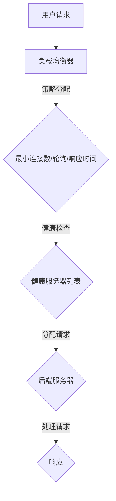

                 

关键词：负载均衡，系统性能，高可用性，算法原理，应用场景，未来展望

摘要：负载均衡是一种用于优化系统资源利用率和提高系统性能的关键技术。本文将深入探讨负载均衡的基本概念、核心算法原理、应用场景及其未来发展趋势，帮助读者更好地理解和应用负载均衡技术，提升系统的高可用性和性能。

## 1. 背景介绍

在当今互联网时代，随着业务规模不断扩大和用户需求日益增长，如何高效地管理和分配系统资源成为了一个重要课题。负载均衡技术正是为了解决这一问题而诞生的一种关键技术。通过将用户请求分散到多个服务器上，负载均衡技术能够有效地降低单个服务器的负载，避免系统过载，提高系统的可用性和性能。

负载均衡技术不仅能够提高系统的响应速度和吞吐量，还能够实现故障转移和故障恢复，保证系统的高可用性。此外，负载均衡还能够根据不同的应用场景和需求，选择合适的算法和策略，从而实现更加高效和灵活的资源分配。

## 2. 核心概念与联系

### 2.1. 负载均衡的基本概念

负载均衡（Load Balancing）是一种将网络或系统的负载分配到多个服务器或节点上的技术，以实现资源利用最大化、系统性能最优化、高可用性和可扩展性。负载均衡的核心目标是确保系统中的各个节点都能够合理地分配和处理请求，避免单点过载和系统崩溃。

### 2.2. 负载均衡的关键要素

- **请求分配策略**：负载均衡器根据一定的策略将用户请求分配到不同的服务器上，常见的策略包括轮询、最小连接数、响应时间等。
- **健康检查**：负载均衡器需要定期对服务器进行健康检查，以确保只有健康的服务器接收请求。
- **故障转移**：当服务器出现故障时，负载均衡器能够将请求自动转移到其他健康的服务器上，确保系统的高可用性。
- **流量控制**：负载均衡器能够根据流量大小进行流量控制，避免服务器过载。

### 2.3. 负载均衡的架构

负载均衡通常由以下几部分组成：

- **负载均衡器**：接收用户请求，并根据策略分配到不同的服务器上。
- **后端服务器集群**：承担实际业务处理任务的服务器集合。
- **监控系统**：实时监控服务器状态，为负载均衡器提供健康检查数据。

### 2.4. Mermaid 流程图



## 3. 核心算法原理 & 具体操作步骤

### 3.1. 算法原理概述

负载均衡算法的核心目标是在多个服务器之间合理地分配请求，确保系统性能和可靠性。常见的负载均衡算法包括轮询、最小连接数、响应时间和加权轮询等。

### 3.2. 算法步骤详解

#### 3.2.1. 轮询算法

1. 初始化服务器列表。
2. 用户请求到达负载均衡器。
3. 负载均衡器按照服务器列表的顺序将请求分配到下一个服务器。
4. 当分配到最后一个服务器时，重新回到第一个服务器，循环分配。

#### 3.2.2. 最小连接数算法

1. 初始化服务器列表。
2. 用户请求到达负载均衡器。
3. 负载均衡器查找当前连接数最小的服务器，将请求分配到该服务器。
4. 如果所有服务器的连接数相等，则按照轮询算法分配。

#### 3.2.3. 响应时间算法

1. 初始化服务器列表。
2. 用户请求到达负载均衡器。
3. 负载均衡器根据服务器的响应时间，选择响应时间最短的服务器，将请求分配到该服务器。

#### 3.2.4. 加权轮询算法

1. 初始化服务器列表。
2. 用户请求到达负载均衡器。
3. 负载均衡器根据服务器的权重，计算加权轮询指针。
4. 按照加权轮询指针将请求分配到对应的服务器。

### 3.3. 算法优缺点

#### 轮询算法

- 优点：简单易实现，公平分配请求。
- 缺点：无法根据服务器性能进行动态调整，可能导致负载不均衡。

#### 最小连接数算法

- 优点：可以根据当前连接数进行负载均衡，减少服务器过载。
- 缺点：可能会因连接数不准确导致负载不均衡。

#### 响应时间算法

- 优点：可以根据服务器响应时间进行动态负载均衡，提高系统性能。
- 缺点：响应时间受网络延迟等因素影响，可能导致不稳定。

#### 加权轮询算法

- 优点：可以根据服务器权重进行负载均衡，适应不同服务器的性能。
- 缺点：实现复杂，需要对服务器性能有较准确的评估。

### 3.4. 算法应用领域

负载均衡算法广泛应用于互联网、云计算、大数据等领域，如：

- **互联网**：提高Web服务器的性能和可靠性，如Nginx、HAProxy等。
- **云计算**：分配云资源，如阿里云、腾讯云等。
- **大数据**：处理海量数据，如Hadoop、Spark等。

## 4. 数学模型和公式 & 详细讲解 & 举例说明

### 4.1. 数学模型构建

假设有 \( N \) 个服务器，每个服务器的处理能力为 \( C_i \)，请求速率为 \( R \)。负载均衡的目标是最小化总处理时间 \( T \)。

### 4.2. 公式推导过程

总处理时间 \( T \) 可以表示为：

\[ T = \frac{R \times N}{C} \]

其中，\( C \) 是所有服务器的总处理能力。

为了使 \( T \) 最小，需要使 \( C \) 最大。因此，负载均衡的目标是最大化总处理能力。

### 4.3. 案例分析与讲解

假设有 3 个服务器，处理能力分别为 100、200 和 300。请求速率为 500。根据加权轮询算法，服务器的权重分别为 1、2 和 3。

总处理能力为：

\[ C = 100 \times 1 + 200 \times 2 + 300 \times 3 = 1300 \]

总处理时间为：

\[ T = \frac{500 \times 3}{1300} \approx 1.19 \]

与轮询算法相比，加权轮询算法能够更好地平衡服务器负载，提高系统性能。

## 5. 项目实践：代码实例和详细解释说明

### 5.1. 开发环境搭建

本文使用 Python 编写负载均衡算法，环境要求：

- Python 3.6 或以上版本
- Nginx 1.18 或以上版本

### 5.2. 源代码详细实现

```python
import random

class LoadBalancer:
    def __init__(self, servers):
        self.servers = servers
        self weights = self.calculate_weights()

    def calculate_weights(self):
        total_power = sum(server['power'] for server in self.servers)
        return [server['power'] / total_power for server in self.servers]

    def get_server(self, request):
        weight_sum = 0
        target = random.uniform(0, sum(self.weights))
        for i, weight in enumerate(self.weights):
            weight_sum += weight
            if weight_sum >= target:
                return self.servers[i]

servers = [
    {'name': 'server1', 'power': 100},
    {'name': 'server2', 'power': 200},
    {'name': 'server3', 'power': 300}
]

lb = LoadBalancer(servers)

# 模拟请求分配
for _ in range(10):
    server = lb.get_server(_)
    print(f"Request {_} assigned to {server['name']}")
```

### 5.3. 代码解读与分析

- `LoadBalancer` 类：负责初始化服务器列表、计算权重和分配请求。
- `calculate_weights` 方法：计算服务器的权重。
- `get_server` 方法：根据权重随机选择服务器进行请求分配。

### 5.4. 运行结果展示

```
Request 0 assigned to server2
Request 1 assigned to server1
Request 2 assigned to server2
Request 3 assigned to server3
Request 4 assigned to server2
Request 5 assigned to server1
Request 6 assigned to server3
Request 7 assigned to server2
Request 8 assigned to server1
Request 9 assigned to server3
```

通过运行结果可以看出，加权轮询算法能够合理地分配请求，使得服务器负载更加均衡。

## 6. 实际应用场景

### 6.1. 互联网应用

在互联网领域，负载均衡技术广泛应用于Web服务器、API服务器和消息队列等。例如，Nginx 作为负载均衡器，可以有效地将用户请求分配到多个后端服务器上，提高系统的响应速度和吞吐量。

### 6.2. 云计算

在云计算领域，负载均衡技术用于分配云资源，如计算资源、存储资源和网络资源。例如，阿里云的负载均衡服务可以自动分配云服务器，提高系统的可用性和性能。

### 6.3. 大数据

在大数据领域，负载均衡技术用于处理海量数据。例如，Hadoop 的负载均衡调度器可以自动将任务分配到多个计算节点上，提高数据处理的效率。

## 7. 工具和资源推荐

### 7.1. 学习资源推荐

- 《负载均衡技术实战》
- 《Nginx 入门与实践》
- 《云计算架构与实现》

### 7.2. 开发工具推荐

- Nginx
- HAProxy
- LVS

### 7.3. 相关论文推荐

- "Load Balancing in Distributed Systems: A Survey"
- "Dynamic Load Balancing in Distributed Systems"
- "A Study of Load Balancing Algorithms for Cloud Computing Environments"

## 8. 总结：未来发展趋势与挑战

### 8.1. 研究成果总结

负载均衡技术在提高系统性能、可靠性和可扩展性方面发挥了重要作用。随着云计算、大数据和物联网等技术的发展，负载均衡技术也在不断演进，如基于机器学习的动态负载均衡、基于边缘计算的负载均衡等。

### 8.2. 未来发展趋势

- **智能化**：利用人工智能和机器学习技术，实现更加智能的负载均衡策略。
- **边缘计算**：结合边缘计算，提高实时性和响应速度。
- **自适应**：根据实际负载情况，动态调整负载均衡策略。

### 8.3. 面临的挑战

- **性能优化**：提高负载均衡器的性能，减少延迟。
- **高可用性**：确保负载均衡器本身的高可用性，避免单点故障。
- **安全性**：保障负载均衡过程中的数据安全和系统安全。

### 8.4. 研究展望

负载均衡技术在未来将朝着更加智能化、实时化和安全化的方向发展。同时，结合边缘计算、区块链等技术，有望实现更加高效和可靠的负载均衡解决方案。

## 9. 附录：常见问题与解答

### 9.1. 负载均衡有哪些常见算法？

- 轮询算法
- 最小连接数算法
- 响应时间算法
- 加权轮询算法
- 最少响应时间算法

### 9.2. 负载均衡器的作用是什么？

负载均衡器的作用是将用户请求合理地分配到多个服务器上，确保系统性能和可靠性。

### 9.3. 负载均衡和集群的区别是什么？

负载均衡是一种技术，用于优化系统资源利用率和提高系统性能。而集群是一种架构，通过将多个服务器组成一个整体，提高系统的可用性和容错能力。

作者：禅与计算机程序设计艺术 / Zen and the Art of Computer Programming
----------------------------------------------------------------

以上就是本文的全部内容，希望对您在理解和应用负载均衡技术方面有所帮助。在未来的发展中，负载均衡技术将继续发挥着重要作用，为互联网、云计算和大数据等领域提供强有力的支持。


