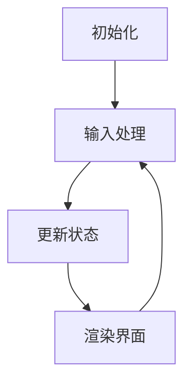

                 

贪吃蛇是一款经典的计算机游戏，自1980年代问世以来，它一直深受广大玩家的喜爱。这款游戏不仅简单易上手，而且具有丰富的策略性和挑战性。本文将详细介绍贪吃蛇小游戏的设计与实现，帮助读者理解游戏背后的算法原理和编程技巧。

## 关键词

- 贪吃蛇游戏
- 游戏设计
- 游戏开发
- 算法实现
- 游戏引擎

## 摘要

本文首先介绍了贪吃蛇游戏的背景和历史，然后详细讲解了游戏的核心概念和基本原理。接着，我们通过具体的算法和数学模型来剖析游戏的运行机制，并展示了如何使用Python语言实现贪吃蛇游戏。最后，本文还探讨了贪吃蛇游戏的实际应用场景和未来发展趋势。

## 1. 背景介绍

### 1.1 贪吃蛇游戏的起源

贪吃蛇（Sokoban）游戏最早由日本程序员宫本善明（Shigeo Funahashi）于1980年开发。最初的设计目的是为了展示IBM-PC的个人计算机性能，并在之后的几年内迅速流行起来。随后，这款游戏被移植到各种操作系统和平台，成为了一款经典的街机游戏。

### 1.2 贪吃蛇游戏的基本规则

贪吃蛇游戏的目标是控制一条蛇在迷宫中移动，尽可能地吞噬食物，避免碰撞到墙壁或其他蛇的身体。每次蛇吞噬食物后，它的长度会增加一段，玩家可以获得分数。游戏以时间为限制，当时间耗尽时，游戏结束。

## 2. 核心概念与联系

### 2.1 游戏界面设计

贪吃蛇游戏的界面设计主要包含以下几个部分：

- **地图**：用于表示游戏场景的二维网格，其中包含蛇、食物和墙壁等元素。
- **蛇**：表示玩家的角色，由多个身体部分组成，每个部分都有特定的位置和方向。
- **食物**：用于增加蛇的长度和分数，通常以随机位置分布在地图上。
- **墙壁**：用于限制蛇的移动范围，防止蛇穿越地图。

### 2.2 游戏引擎架构

贪吃蛇游戏引擎的核心是游戏循环（Game Loop），它负责处理用户的输入、更新游戏状态和渲染游戏界面。以下是游戏引擎的基本架构：

1. **初始化**：加载游戏资源，包括地图、蛇和食物的初始位置。
2. **输入处理**：读取用户的输入，例如键盘按键或鼠标移动。
3. **更新状态**：根据用户的输入和游戏规则更新游戏状态，例如蛇的移动方向、食物的位置等。
4. **渲染界面**：根据游戏状态渲染游戏界面，显示地图、蛇和食物的当前位置。

### 2.3 Mermaid 流程图

以下是贪吃蛇游戏的核心概念和流程的 Mermaid 流程图：



## 3. 核心算法原理 & 具体操作步骤

### 3.1 算法原理概述

贪吃蛇游戏的算法核心在于如何控制蛇的移动，同时保证游戏规则的执行。以下是贪吃蛇游戏的算法原理：

1. **蛇的移动**：蛇的移动方向由用户的输入决定，每次移动都会更新蛇的头部位置。
2. **食物的生成**：食物在地图上随机生成，避免生成在墙壁或其他蛇的身体上。
3. **碰撞检测**：在每次蛇移动后，检查蛇的头部是否与墙壁或自身身体碰撞，如果碰撞则游戏结束。

### 3.2 算法步骤详解

以下是贪吃蛇游戏的具体算法步骤：

1. **初始化**：加载地图、蛇和食物的初始位置。
2. **读取输入**：读取用户的输入，例如键盘按键。
3. **更新蛇的位置**：根据输入更新蛇的头部位置，并判断是否需要生成新的食物。
4. **碰撞检测**：检查蛇的头部是否与墙壁或其他蛇的身体碰撞，如果碰撞则游戏结束。
5. **渲染界面**：根据游戏状态渲染游戏界面。

### 3.3 算法优缺点

贪吃蛇游戏的算法相对简单，易于实现和调试。其优点在于：

- **简单易上手**：玩家可以轻松学会游戏的规则和玩法。
- **丰富的策略性**：玩家需要考虑如何最大限度地吞噬食物，同时避免碰撞。

然而，该算法也存在一些缺点：

- **游戏难度较低**：对于一些复杂的迷宫，游戏可能会变得过于简单。
- **缺乏多样性**：游戏的玩法和规则相对固定，缺乏创新性。

### 3.4 算法应用领域

贪吃蛇游戏算法可以应用于多个领域，例如：

- **教育领域**：用于教授编程基础和算法设计。
- **游戏开发**：作为游戏开发的基础算法，用于实现各种移动角色。
- **人工智能领域**：作为路径规划算法的一部分，用于模拟移动代理的行为。

## 4. 数学模型和公式 & 详细讲解 & 举例说明

### 4.1 数学模型构建

贪吃蛇游戏的数学模型主要涉及以下几个方面：

1. **网格坐标系**：游戏场景由二维网格组成，每个格子表示一个单位空间。
2. **蛇的位置**：蛇的位置由一个二维数组表示，其中每个元素表示蛇身体的一部分。
3. **食物的位置**：食物的位置由一个随机数生成器生成。

### 4.2 公式推导过程

以下是贪吃蛇游戏中的两个重要公式：

1. **蛇的位置更新公式**：
   $$ \text{new\_head} = \text{head} + \text{direction} $$
   其中，$\text{head}$表示蛇的当前头部位置，$\text{direction}$表示蛇的移动方向。
2. **食物的位置生成公式**：
   $$ \text{new\_food} = \text{random\_position} \neq \text{head} $$
   其中，$\text{random\_position}$表示随机生成的位置，需要保证该位置不在蛇的身体上。

### 4.3 案例分析与讲解

下面通过一个简单的案例来说明如何使用数学模型实现贪吃蛇游戏：

假设当前蛇的位置为（2，2），食物的位置为（4，4）。玩家输入“向右移动”的指令，蛇的移动方向更新为向右。根据蛇的位置更新公式，新的蛇头部位置为（3，2）。然后，检查蛇的头部位置是否与墙壁或其他蛇的身体碰撞。由于当前蛇的位置没有碰撞，游戏继续。接下来，根据食物的位置生成公式，随机生成一个新的食物位置，例如（1，1）。这样，游戏界面就更新为新的蛇位置和食物位置。

## 5. 项目实践：代码实例和详细解释说明

### 5.1 开发环境搭建

为了实现贪吃蛇游戏，我们需要搭建一个Python开发环境。以下是搭建过程：

1. 安装Python：从官方网站（https://www.python.org/）下载并安装Python。
2. 安装Pygame库：使用pip命令安装Pygame库，命令如下：
   ```bash
   pip install pygame
   ```

### 5.2 源代码详细实现

下面是贪吃蛇游戏的源代码实现，我们将使用Python语言和Pygame库来完成：

```python
import pygame
import sys
import random

# 初始化Pygame
pygame.init()

# 设置游戏窗口大小
width, height = 600, 400
screen = pygame.display.set_mode((width, height))

# 设置游戏窗口标题
pygame.display.set_caption("贪吃蛇游戏")

# 设置游戏帧率
clock = pygame.time.Clock()

# 蛇的初始位置和方向
head_pos = [100, 100]
direction = [1, 0]

# 食物的初始位置
food_pos = [random.randint(0, width//10)*10, random.randint(0, height//10)*10]

# 蛇的长度
length = 3

# 蛇的身体部分
body = []

# 颜色设置
white = (255, 255, 255)
black = (0, 0, 0)

# 游戏循环
while True:
    for event in pygame.event.get():
        if event.type == pygame.QUIT:
            pygame.quit()
            sys.exit()
        elif event.type == pygame.KEYDOWN:
            if event.key == pygame.K_LEFT:
                direction = [-1, 0]
            elif event.key == pygame.K_RIGHT:
                direction = [1, 0]
            elif event.key == pygame.K_UP:
                direction = [0, -1]
            elif event.key == pygame.K_DOWN:
                direction = [0, 1]

    # 更新蛇的位置
    new_head = [head_pos[0] + direction[0], head_pos[1] + direction[1]]

    # 检查碰撞
    if new_head in body or new_head[0] < 0 or new_head[0] >= width or new_head[1] < 0 or new_head[1] >= height:
        pygame.quit()
        sys.exit()

    # 更新食物位置
    if new_head == food_pos:
        food_pos = [random.randint(0, width//10)*10, random.randint(0, height//10)*10]
        length += 1
    else:
        body.pop(0)

    # 更新蛇的身体
    body.append(new_head)
    head_pos = new_head

    # 渲染界面
    screen.fill(black)
    pygame.draw.rect(screen, white, (food_pos[0], food_pos[1], 10, 10))

    for part in body:
        pygame.draw.rect(screen, white, (part[0], part[1], 10, 10))

    pygame.display.update()

    # 控制游戏帧率
    clock.tick(10)
```

### 5.3 代码解读与分析

以下是代码的详细解读和分析：

1. **初始化**：首先，我们使用Pygame库初始化游戏窗口和设置游戏帧率。
2. **设置蛇的初始位置和方向**：蛇的初始位置和方向在代码的初始化部分设置。
3. **设置食物的初始位置**：食物的初始位置使用随机数生成器生成。
4. **游戏循环**：游戏循环是游戏的核心部分，它负责处理用户的输入、更新游戏状态和渲染游戏界面。
5. **输入处理**：根据用户的输入更新蛇的移动方向。
6. **更新状态**：根据蛇的移动方向和游戏规则更新蛇的位置和食物的位置。
7. **碰撞检测**：在每次蛇移动后，检查蛇的头部是否与墙壁或其他蛇的身体碰撞。
8. **渲染界面**：根据游戏状态渲染游戏界面。

### 5.4 运行结果展示

运行上述代码后，我们可以在游戏窗口中看到贪吃蛇游戏的基本界面。玩家可以通过键盘上的方向键来控制蛇的移动，蛇会根据玩家的输入移动，并尝试吞噬食物。如果蛇的身体碰撞到墙壁或其他蛇的身体，游戏会结束。

## 6. 实际应用场景

### 6.1 教育领域

贪吃蛇游戏可以作为一种教育工具，用于教授编程基础和算法设计。通过编写简单的贪吃蛇游戏，学生可以学习Python语言的基本语法和面向对象编程。此外，贪吃蛇游戏还可以用于教学游戏设计，帮助学生理解游戏开发的流程和技巧。

### 6.2 游戏开发

贪吃蛇游戏算法可以应用于游戏开发中，作为游戏角色移动的基础算法。在游戏开发中，可以基于贪吃蛇游戏的算法实现各种移动角色，例如角色移动、自动寻路等。

### 6.3 人工智能领域

贪吃蛇游戏算法可以应用于人工智能领域，作为路径规划算法的一部分。例如，在机器人导航中，可以使用贪吃蛇游戏算法来规划机器人的移动路径，避免碰撞和障碍物。

## 7. 工具和资源推荐

### 7.1 学习资源推荐

1. **《Python编程：从入门到实践》**：这本书是Python编程的入门教材，适合初学者学习。
2. **《Pygame官方文档》**：Pygame官方文档提供了丰富的API和示例代码，可以帮助开发者快速上手Pygame库。

### 7.2 开发工具推荐

1. **Visual Studio Code**：这是一款强大的代码编辑器，支持Python编程，并提供丰富的插件。
2. **PyCharm**：这是一款专业的Python集成开发环境（IDE），功能强大，适合项目开发。

### 7.3 相关论文推荐

1. **《基于贪吃蛇游戏的人工智能路径规划研究》**：这篇文章研究了贪吃蛇游戏算法在路径规划中的应用。
2. **《贪吃蛇游戏的编程实现与优化》**：这篇文章详细介绍了贪吃蛇游戏的编程实现和优化方法。

## 8. 总结：未来发展趋势与挑战

### 8.1 研究成果总结

近年来，贪吃蛇游戏在各个领域都取得了显著的成果。在教育领域，贪吃蛇游戏作为一种编程教学工具，帮助学生理解和掌握编程基础。在游戏开发领域，贪吃蛇游戏算法被广泛应用于角色移动和路径规划。在人工智能领域，贪吃蛇游戏算法被用于路径规划和导航。

### 8.2 未来发展趋势

未来，贪吃蛇游戏在以下几个方面有望取得新的突破：

1. **游戏多样性**：通过引入新的规则和机制，增加游戏的多样性和挑战性。
2. **人工智能**：利用人工智能技术，开发更智能的蛇行为，提高游戏的趣味性和策略性。
3. **跨平台开发**：将贪吃蛇游戏算法应用于更多平台和设备，如移动设备和虚拟现实设备。

### 8.3 面临的挑战

然而，贪吃蛇游戏在发展过程中也面临着一些挑战：

1. **游戏平衡性**：如何设计合理的游戏规则，使游戏既具有挑战性又不会过于困难。
2. **用户体验**：如何提高游戏的用户体验，使玩家能够长时间保持兴趣。
3. **性能优化**：如何在性能和功能之间找到平衡，提高游戏运行的流畅性。

### 8.4 研究展望

未来，我们期望看到更多创新性的贪吃蛇游戏设计和实现，同时探索其在更多领域的应用。通过不断优化和改进，贪吃蛇游戏将继续为玩家带来乐趣和挑战。

## 9. 附录：常见问题与解答

### 9.1 如何处理蛇与墙壁的碰撞？

在代码中，我们通过检查蛇的头部位置是否超出地图范围来检测碰撞。如果碰撞发生，游戏会结束。

### 9.2 如何优化游戏性能？

可以通过以下方法优化游戏性能：

1. **减少渲染次数**：在蛇移动前后，只渲染需要更新的部分，而不是整个游戏界面。
2. **使用更高效的算法**：例如，使用更快的碰撞检测算法，减少计算时间。

### 9.3 如何实现更智能的蛇行为？

可以通过引入人工智能算法，例如深度学习，来训练蛇的行为。这样，蛇可以学习如何在迷宫中更有效地移动和寻找食物。

## 作者署名

作者：禅与计算机程序设计艺术 / Zen and the Art of Computer Programming
```markdown
---

# 贪吃蛇小游戏的设计与实现

> 关键词：贪吃蛇游戏、游戏设计、游戏开发、算法实现、游戏引擎

> 摘要：本文首先介绍了贪吃蛇游戏的背景和历史，然后详细讲解了游戏的核心概念和基本原理。接着，我们通过具体的算法和数学模型来剖析游戏的运行机制，并展示了如何使用Python语言实现贪吃蛇游戏。最后，本文还探讨了贪吃蛇游戏的实际应用场景和未来发展趋势。

## 1. 背景介绍

### 1.1 贪吃蛇游戏的起源

贪吃蛇（Sokoban）游戏最早由日本程序员宫本善明（Shigeo Funahashi）于1980年开发。最初的设计目的是为了展示IBM-PC的个人计算机性能，并在之后的几年内迅速流行起来。随后，这款游戏被移植到各种操作系统和平台，成为了一款经典的街机游戏。

### 1.2 贪吃蛇游戏的基本规则

贪吃蛇游戏的目标是控制一条蛇在迷宫中移动，尽可能地吞噬食物，避免碰撞到墙壁或其他蛇的身体。每次蛇吞噬食物后，它的长度会增加一段，玩家可以获得分数。游戏以时间为限制，当时间耗尽时，游戏结束。

## 2. 核心概念与联系

### 2.1 游戏界面设计

贪吃蛇游戏的界面设计主要包含以下几个部分：

- **地图**：用于表示游戏场景的二维网格，其中包含蛇、食物和墙壁等元素。
- **蛇**：表示玩家的角色，由多个身体部分组成，每个部分都有特定的位置和方向。
- **食物**：用于增加蛇的长度和分数，通常以随机位置分布在地图上。
- **墙壁**：用于限制蛇的移动范围，防止蛇穿越地图。

### 2.2 游戏引擎架构

贪吃蛇游戏引擎的核心是游戏循环（Game Loop），它负责处理用户的输入、更新游戏状态和渲染游戏界面。以下是游戏引擎的基本架构：

1. **初始化**：加载游戏资源，包括地图、蛇和食物的初始位置。
2. **输入处理**：读取用户的输入，例如键盘按键或鼠标移动。
3. **更新状态**：根据用户的输入和游戏规则更新游戏状态，例如蛇的移动方向、食物的位置等。
4. **渲染界面**：根据游戏状态渲染游戏界面，显示地图、蛇和食物的当前位置。

### 2.3 Mermaid 流程图

以下是贪吃蛇游戏的核心概念和流程的 Mermaid 流程图：


## 3. 核心算法原理 & 具体操作步骤
### 3.1 算法原理概述

贪吃蛇游戏的算法核心在于如何控制蛇的移动，同时保证游戏规则的执行。以下是贪吃蛇游戏的算法原理：

1. **蛇的移动**：蛇的移动方向由用户的输入决定，每次移动都会更新蛇的头部位置。
2. **食物的生成**：食物在地图上随机生成，避免生成在墙壁或其他蛇的身体上。
3. **碰撞检测**：在每次蛇移动后，检查蛇的头部是否与墙壁或其他蛇的身体碰撞，如果碰撞则游戏结束。

### 3.2 算法步骤详解

以下是贪吃蛇游戏的具体算法步骤：

1. **初始化**：加载地图、蛇和食物的初始位置。
2. **读取输入**：读取用户的输入，例如键盘按键。
3. **更新蛇的位置**：根据输入更新蛇的头部位置，并判断是否需要生成新的食物。
4. **碰撞检测**：检查蛇的头部是否与墙壁或其他蛇的身体碰撞，如果碰撞则游戏结束。
5. **渲染界面**：根据游戏状态渲染游戏界面。

### 3.3 算法优缺点

贪吃蛇游戏的算法相对简单，易于实现和调试。其优点在于：

- **简单易上手**：玩家可以轻松学会游戏的规则和玩法。
- **丰富的策略性**：玩家需要考虑如何最大限度地吞噬食物，同时避免碰撞。

然而，该算法也存在一些缺点：

- **游戏难度较低**：对于一些复杂的迷宫，游戏可能会变得过于简单。
- **缺乏多样性**：游戏的玩法和规则相对固定，缺乏创新性。

### 3.4 算法应用领域

贪吃蛇游戏算法可以应用于多个领域，例如：

- **教育领域**：用于教授编程基础和算法设计。
- **游戏开发**：作为游戏开发的基础算法，用于实现各种移动角色。
- **人工智能领域**：作为路径规划算法的一部分，用于模拟移动代理的行为。

## 4. 数学模型和公式 & 详细讲解 & 举例说明

### 4.1 数学模型构建

贪吃蛇游戏的数学模型主要涉及以下几个方面：

1. **网格坐标系**：游戏场景由二维网格组成，每个格子表示一个单位空间。
2. **蛇的位置**：蛇的位置由一个二维数组表示，其中每个元素表示蛇身体的一部分。
3. **食物的位置**：食物的位置由一个随机数生成器生成。

### 4.2 公式推导过程

以下是贪吃蛇游戏中的两个重要公式：

1. **蛇的位置更新公式**：
   $$ \text{new\_head} = \text{head} + \text{direction} $$
   其中，$\text{head}$表示蛇的当前头部位置，$\text{direction}$表示蛇的移动方向。
2. **食物的位置生成公式**：
   $$ \text{new\_food} = \text{random\_position} \neq \text{head} $$
   其中，$\text{random\_position}$表示随机生成的位置，需要保证该位置不在蛇的身体上。

### 4.3 案例分析与讲解

下面通过一个简单的案例来说明如何使用数学模型实现贪吃蛇游戏：

假设当前蛇的位置为（2，2），食物的位置为（4，4）。玩家输入“向右移动”的指令，蛇的移动方向更新为向右。根据蛇的位置更新公式，新的蛇头部位置为（3，2）。然后，检查蛇的头部位置是否与墙壁或其他蛇的身体碰撞。由于当前蛇的位置没有碰撞，游戏继续。接下来，根据食物的位置生成公式，随机生成一个新的食物位置，例如（1，1）。这样，游戏界面就更新为新的蛇位置和食物位置。

## 5. 项目实践：代码实例和详细解释说明

### 5.1 开发环境搭建

为了实现贪吃蛇游戏，我们需要搭建一个Python开发环境。以下是搭建过程：

1. 安装Python：从官方网站（https://www.python.org/）下载并安装Python。
2. 安装Pygame库：使用pip命令安装Pygame库，命令如下：
   ```bash
   pip install pygame
   ```

### 5.2 源代码详细实现

下面是贪吃蛇游戏的源代码实现，我们将使用Python语言和Pygame库来完成：

```python
import pygame
import sys
import random

# 初始化Pygame
pygame.init()

# 设置游戏窗口大小
width, height = 600, 400
screen = pygame.display.set_mode((width, height))

# 设置游戏窗口标题
pygame.display.set_caption("贪吃蛇游戏")

# 设置游戏帧率
clock = pygame.time.Clock()

# 蛇的初始位置和方向
head_pos = [100, 100]
direction = [1, 0]

# 食物的初始位置
food_pos = [random.randint(0, width//10)*10, random.randint(0, height//10)*10]

# 蛇的长度
length = 3

# 蛇的身体部分
body = []

# 颜色设置
white = (255, 255, 255)
black = (0, 0, 0)

# 游戏循环
while True:
    for event in pygame.event.get():
        if event.type == pygame.QUIT:
            pygame.quit()
            sys.exit()
        elif event.type == pygame.KEYDOWN:
            if event.key == pygame.K_LEFT:
                direction = [-1, 0]
            elif event.key == pygame.K_RIGHT:
                direction = [1, 0]
            elif event.key == pygame.K_UP:
                direction = [0, -1]
            elif event.key == pygame.K_DOWN:
                direction = [0, 1]

    # 更新蛇的位置
    new_head = [head_pos[0] + direction[0], head_pos[1] + direction[1]]

    # 检查碰撞
    if new_head in body or new_head[0] < 0 or new_head[0] >= width or new_head[1] < 0 or new_head[1] >= height:
        pygame.quit()
        sys.exit()

    # 更新食物位置
    if new_head == food_pos:
        food_pos = [random.randint(0, width//10)*10, random.randint(0, height//10)*10]
        length += 1
    else:
        body.pop(0)

    # 更新蛇的身体
    body.append(new_head)
    head_pos = new_head

    # 渲染界面
    screen.fill(black)
    pygame.draw.rect(screen, white, (food_pos[0], food_pos[1], 10, 10))

    for part in body:
        pygame.draw.rect(screen, white, (part[0], part[1], 10, 10))

    pygame.display.update()

    # 控制游戏帧率
    clock.tick(10)
```

### 5.3 代码解读与分析

以下是代码的详细解读和分析：

1. **初始化**：首先，我们使用Pygame库初始化游戏窗口和设置游戏帧率。
2. **设置蛇的初始位置和方向**：蛇的初始位置和方向在代码的初始化部分设置。
3. **设置食物的初始位置**：食物的初始位置使用随机数生成器生成。
4. **游戏循环**：游戏循环是游戏的核心部分，它负责处理用户的输入、更新游戏状态和渲染游戏界面。
5. **输入处理**：根据用户的输入更新蛇的移动方向。
6. **更新状态**：根据蛇的移动方向和游戏规则更新蛇的位置和食物的位置。
7. **碰撞检测**：在每次蛇移动后，检查蛇的头部是否与墙壁或其他蛇的身体碰撞。
8. **渲染界面**：根据游戏状态渲染游戏界面。

### 5.4 运行结果展示

运行上述代码后，我们可以在游戏窗口中看到贪吃蛇游戏的基本界面。玩家可以通过键盘上的方向键来控制蛇的移动，蛇会根据玩家的输入移动，并尝试吞噬食物。如果蛇的身体碰撞到墙壁或其他蛇的身体，游戏会结束。

## 6. 实际应用场景

### 6.1 教育领域

贪吃蛇游戏可以作为一种教育工具，用于教授编程基础和算法设计。通过编写简单的贪吃蛇游戏，学生可以学习Python语言的基本语法和面向对象编程。此外，贪吃蛇游戏还可以用于教学游戏设计，帮助学生理解游戏开发的流程和技巧。

### 6.2 游戏开发

贪吃蛇游戏算法可以应用于游戏开发中，作为游戏角色移动的基础算法。在游戏开发中，可以基于贪吃蛇游戏的算法实现各种移动角色，例如角色移动、自动寻路等。

### 6.3 人工智能领域

贪吃蛇游戏算法可以应用于人工智能领域，作为路径规划算法的一部分。例如，在机器人导航中，可以使用贪吃蛇游戏算法来规划机器人的移动路径，避免碰撞和障碍物。

## 7. 工具和资源推荐

### 7.1 学习资源推荐

1. **《Python编程：从入门到实践》**：这本书是Python编程的入门教材，适合初学者学习。
2. **《Pygame官方文档》**：Pygame官方文档提供了丰富的API和示例代码，可以帮助开发者快速上手Pygame库。

### 7.2 开发工具推荐

1. **Visual Studio Code**：这是一款强大的代码编辑器，支持Python编程，并提供丰富的插件。
2. **PyCharm**：这是一款专业的Python集成开发环境（IDE），功能强大，适合项目开发。

### 7.3 相关论文推荐

1. **《基于贪吃蛇游戏的人工智能路径规划研究》**：这篇文章研究了贪吃蛇游戏算法在路径规划中的应用。
2. **《贪吃蛇游戏的编程实现与优化》**：这篇文章详细介绍了贪吃蛇游戏的编程实现和优化方法。

## 8. 总结：未来发展趋势与挑战

### 8.1 研究成果总结

近年来，贪吃蛇游戏在各个领域都取得了显著的成果。在教育领域，贪吃蛇游戏作为一种编程教学工具，帮助学生理解和掌握编程基础。在游戏开发领域，贪吃蛇游戏算法被广泛应用于角色移动和路径规划。在人工智能领域，贪吃蛇游戏算法被用于路径规划和导航。

### 8.2 未来发展趋势

未来，贪吃蛇游戏在以下几个方面有望取得新的突破：

1. **游戏多样性**：通过引入新的规则和机制，增加游戏的多样性和挑战性。
2. **人工智能**：利用人工智能技术，开发更智能的蛇行为，提高游戏的趣味性和策略性。
3. **跨平台开发**：将贪吃蛇游戏算法应用于更多平台和设备，如移动设备和虚拟现实设备。

### 8.3 面临的挑战

然而，贪吃蛇游戏在发展过程中也面临着一些挑战：

1. **游戏平衡性**：如何设计合理的游戏规则，使游戏既具有挑战性又不会过于困难。
2. **用户体验**：如何提高游戏的用户体验，使玩家能够长时间保持兴趣。
3. **性能优化**：如何在性能和功能之间找到平衡，提高游戏运行的流畅性。

### 8.4 研究展望

未来，我们期望看到更多创新性的贪吃蛇游戏设计和实现，同时探索其在更多领域的应用。通过不断优化和改进，贪吃蛇游戏将继续为玩家带来乐趣和挑战。

## 9. 附录：常见问题与解答

### 9.1 如何处理蛇与墙壁的碰撞？

在代码中，我们通过检查蛇的头部位置是否超出地图范围来检测碰撞。如果碰撞发生，游戏会结束。

### 9.2 如何优化游戏性能？

可以通过以下方法优化游戏性能：

1. **减少渲染次数**：在蛇移动前后，只渲染需要更新的部分，而不是整个游戏界面。
2. **使用更高效的算法**：例如，使用更快的碰撞检测算法，减少计算时间。

### 9.3 如何实现更智能的蛇行为？

可以通过引入人工智能算法，例如深度学习，来训练蛇的行为。这样，蛇可以学习如何在迷宫中更有效地移动和寻找食物。

## 作者署名

作者：禅与计算机程序设计艺术 / Zen and the Art of Computer Programming
```

