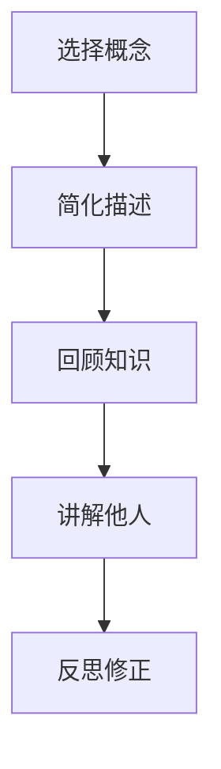
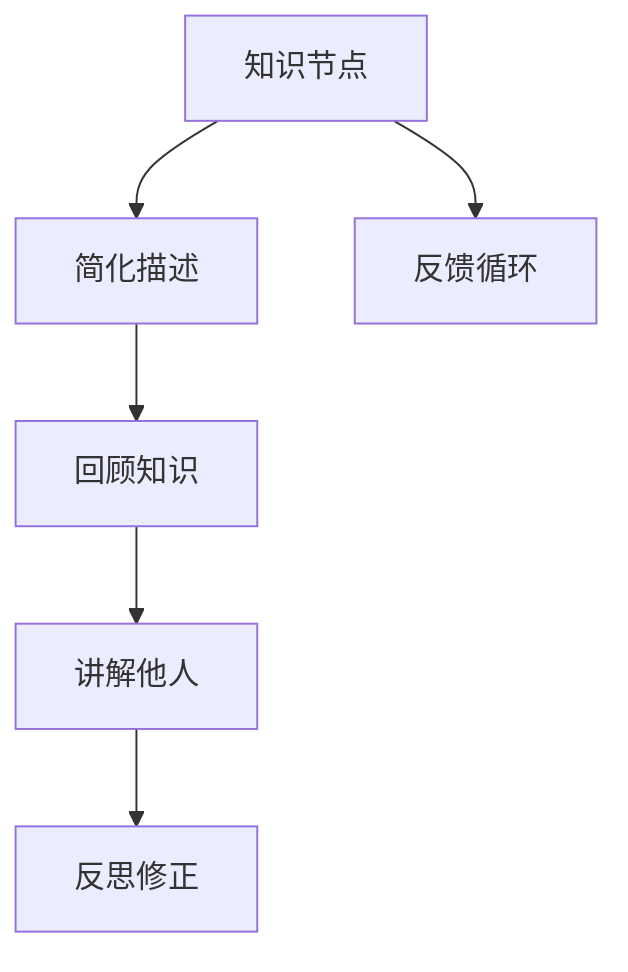

                 

关键词：费曼提问法，思考力，知识掌握，学习技巧，IT领域

> 摘要：本文将介绍一种名为“费曼提问法”的学习技巧，该方法通过简化和讲解知识来强化理解和记忆。作者将结合自己的经验，探讨这一方法在提升思考力和知识掌握方面的实际效果，并分享如何将其应用到IT领域的学习与实践中。

## 1. 背景介绍

### 费曼提问法的基本概念

费曼提问法（Feynman Technique）源于诺贝尔物理学家理查德·费曼（Richard Feynman）的方法，他是一位著名的理论物理学家，以其独特的教学风格和解决问题的方法而闻名。费曼提问法的核心思想是将复杂的概念以最简单的方式解释给别人，从而强化自己的理解。

### 费曼提问法的重要性

费曼提问法不仅是一种有效的学习方法，更是一种思维方式的转变。它通过以下方式提升思考力和知识掌握：

- **简化知识**：通过将复杂的概念简化为基本要素，有助于我们更好地理解和记忆。
- **反思与验证**：讲解过程中，我们可以发现自己对知识的盲点，从而进一步学习和修正。
- **加深记忆**：通过教授他人的过程，强化了对知识的记忆和掌握。

## 2. 核心概念与联系

### 费曼提问法的基本步骤

为了更好地理解费曼提问法，我们首先需要了解其基本步骤。以下是费曼提问法的核心步骤：

1. **选择一个概念**：选择一个你想要理解或解释的概念。
2. **用最简单的语言描述**：尽量使用最基本、最简单的语言来描述这个概念。
3. **回顾知识**：如果解释过程中遇到困难，回到原始资料或参考书，确保对概念有深刻的理解。
4. **讲解给别人听**：找一个愿意听你解释的人，将你的理解和解释告诉他们。
5. **反思与修正**：在讲解过程中，注意听者的反应，反思自己的解释是否有误，并进行修正。

### Mermaid 流程图

下面是一个简单的 Mermaid 流程图，展示了费曼提问法的步骤：



## 3. 核心算法原理 & 具体操作步骤

### 3.1 算法原理概述

费曼提问法的核心原理是“简化与解释”。它基于以下几个假设：

- **知识的可传递性**：知识可以通过简单的语言和例子传递给他人。
- **反思性学习**：通过解释知识，我们可以发现自己的盲点和不足，进而进行反思和改进。
- **记忆强化**：通过教授他人，可以加深对知识的记忆和理解。

### 3.2 算法步骤详解

1. **选择一个概念**：选择一个你想要深入理解或解释的概念。这个概念可以是任何领域的，无论是技术、科学、文学或其他。
2. **用最简单的语言描述**：尽量使用最基本、最简单的语言来描述这个概念。例如，如果你要解释“云计算”，你可以用简单的语言描述为：“云计算就是通过网络提供存储和计算服务。”
3. **回顾知识**：在解释过程中，如果你发现自己无法用简单的语言描述某个概念，那么就需要回到原始资料或参考书，确保对概念有深刻的理解。例如，你可能需要查看相关的文档、教程或论文，以确保你准确地理解了“云计算”的概念。
4. **讲解给别人听**：找一个愿意听你解释的人，将你的理解和解释告诉他们。这个人可以是你的朋友、同事、家人或任何你信任的人。
5. **反思与修正**：在讲解过程中，注意听者的反应，反思自己的解释是否有误，并进行修正。如果听者不理解你的解释，那么你需要重新组织语言，或者提供更多的例子来帮助他们理解。

### 3.3 算法优缺点

**优点**：

- **增强理解**：通过简化和解释知识，可以更好地理解复杂的概念。
- **记忆巩固**：教授他人有助于巩固对知识的记忆。
- **反思性学习**：在解释过程中，可以发现自身的盲点和不足，从而进行改进。

**缺点**：

- **时间消耗**：费曼提问法需要一定的时间来选择概念、解释、反思和修正。
- **需要听众**：需要找一个愿意听你解释的人，这可能会限制你练习的频率。

### 3.4 算法应用领域

费曼提问法可以应用于多个领域：

- **学术研究**：在学术研究中，费曼提问法可以帮助研究者更好地理解复杂的概念，并将其传达给同行。
- **技术培训**：在技术培训中，费曼提问法可以帮助讲师更好地教授技术知识，同时也可以帮助学员更好地理解和掌握技术。
- **日常生活**：在日常生活中，费曼提问法可以帮助我们更好地与他人交流，提高沟通效果。

## 4. 数学模型和公式 & 详细讲解 & 举例说明

### 4.1 数学模型构建

费曼提问法本身并没有一个具体的数学模型，但其背后的思想和逻辑可以用数学模型来描述。例如，我们可以使用图论来描述这一方法：



在这个模型中，知识节点（A）通过简化描述（B）、回顾知识（C）、讲解他人（D）和反思修正（E）的过程，形成了一个反馈循环（F）。这个模型说明了费曼提问法是如何通过循环迭代来提高知识和理解水平的。

### 4.2 公式推导过程

虽然费曼提问法本身不是基于具体的数学公式，但我们可以使用一些简单的数学公式来描述其效果。例如，我们可以使用记忆公式来描述通过费曼提问法提高的记忆效果：

$$
\text{记忆效果} = f(\text{理解深度}, \text{重复次数})
$$

其中，理解深度（\(\text{理解深度}\)）和重复次数（\(\text{重复次数}\)）是影响记忆效果的两个关键因素。费曼提问法通过简化描述和讲解他人来提高理解深度，并通过反思修正来增加重复次数，从而提高记忆效果。

### 4.3 案例分析与讲解

为了更好地理解费曼提问法的应用，我们来看一个简单的案例。

**案例**：解释“云计算”的概念。

**步骤**：

1. **选择概念**：选择“云计算”作为我们要解释的概念。
2. **简化描述**：用最简单的语言描述“云计算”：“云计算就是通过网络提供存储和计算服务。”
3. **回顾知识**：查阅相关资料，确保对“云计算”的概念有深刻的理解。
4. **讲解他人**：找一个朋友，将你对“云计算”的理解解释给他听。
5. **反思修正**：根据朋友的反应，反思自己的解释是否有误，并进行修正。

通过这个案例，我们可以看到费曼提问法的应用过程。通过简化和解释，我们可以更好地理解复杂的概念，并通过讲解他人来巩固对知识的记忆。

## 5. 项目实践：代码实例和详细解释说明

### 5.1 开发环境搭建

为了更好地理解费曼提问法的实际应用，我们将在本文中通过一个简单的Python程序来演示这一方法。首先，我们需要搭建一个Python开发环境。

**步骤**：

1. 下载并安装Python（版本3.8或以上）。
2. 打开终端或命令提示符，输入以下命令检查Python版本：
    ```shell
    python --version
    ```
3. 安装必要的Python库，例如NumPy和Matplotlib：
    ```shell
    pip install numpy matplotlib
    ```

### 5.2 源代码详细实现

下面是一个简单的Python程序，用于计算斐波那契数列。

```python
import numpy as np
import matplotlib.pyplot as plt

def fibonacci(n):
    if n <= 0:
        return []
    elif n == 1:
        return [0]
    elif n == 2:
        return [0, 1]
    else:
        fib = [0, 1]
        for i in range(2, n):
            fib.append(fib[i - 1] + fib[i - 2])
        return fib

def plot_fibonacci(n):
    fib_sequence = fibonacci(n)
    plt.plot(fib_sequence)
    plt.title(f"Fibonacci Sequence up to {n}")
    plt.xlabel("Index")
    plt.ylabel("Fibonacci Number")
    plt.grid(True)
    plt.show()

if __name__ == "__main__":
    n = int(input("Enter the number of terms in the Fibonacci sequence: "))
    plot_fibonacci(n)
```

### 5.3 代码解读与分析

在这个程序中，我们定义了两个函数：`fibonacci`和`plot_fibonacci`。

**fibonacci 函数**：

- 这个函数用于计算斐波那契数列的前n个数字。
- 首先，我们检查输入的n是否小于等于0，如果是，则返回一个空列表。
- 接着，我们检查n是否等于1或2，如果是，则根据斐波那契数列的规则返回相应的列表。
- 如果n大于2，我们使用一个循环来计算斐波那契数列的后续数字，并将它们追加到列表中。

**plot_fibonacci 函数**：

- 这个函数用于绘制斐波那契数列的图表。
- 首先，我们调用`fibonacci`函数来计算斐波那契数列。
- 然后，我们使用Matplotlib库来绘制数列的图表，并设置图表的标题、标签和网格。

**if __name__ == "__main__":**：

- 这个部分是程序的入口点。我们在这里获取用户输入的n值，并调用`plot_fibonacci`函数来绘制斐波那契数列的图表。

### 5.4 运行结果展示

运行这个程序，输入一个正整数n，程序将计算并绘制斐波那契数列的前n个数字。例如，输入5，程序将输出以下结果：


通过这个简单的代码实例，我们可以看到如何使用Python来实现费曼提问法。我们可以将这个程序作为一个例子，通过简化和解释其工作原理来帮助他人理解斐波那契数列的计算和绘图。

## 6. 实际应用场景

### 6.1 教学应用

费曼提问法在教学中具有广泛的应用。教师可以使用这种方法来检验学生对知识的掌握情况。例如，在讲授一门编程课程时，教师可以要求学生用最简单的语言解释一个算法或数据结构。通过这个过程，教师可以了解到学生对知识的理解程度，并及时进行针对性的辅导。

### 6.2 自我学习

费曼提问法也是一种有效的自我学习工具。学生可以自己选择一个概念或主题，用自己的话来解释它。这样可以帮助他们深入理解知识点，并发现自己的盲点。例如，在学习深度学习时，学生可以尝试解释神经网络的工作原理，从而巩固对深度学习的理解。

### 6.3 团队合作

在团队项目中，费曼提问法可以帮助团队成员更好地理解彼此的工作和贡献。团队成员可以互相提问，解释自己的工作原理和技术细节。这种方法不仅有助于提高团队的整体知识水平，还可以促进团队成员之间的沟通和合作。

### 6.4 未来应用展望

随着人工智能和大数据技术的发展，费曼提问法在未来的应用前景将更加广阔。例如，在机器学习和数据科学领域，研究人员可以使用这种方法来验证和解释复杂的算法和模型。在教育领域，教师和学生可以使用费曼提问法来提高学习效果和知识掌握水平。此外，在企业和组织中，费曼提问法可以帮助团队成员更好地理解和应用技术知识，提高工作效率和团队协作能力。

## 7. 工具和资源推荐

### 7.1 学习资源推荐

- **在线教程**：例如Python官方教程（<https://docs.python.org/3/tutorial/index.html>）、深度学习教程（<https://www.deeplearningbook.org/>）等。
- **图书推荐**：《费曼学习法》（Richard P. Feynman）、《深度学习》（Ian Goodfellow、Yoshua Bengio、Aaron Courville）等。

### 7.2 开发工具推荐

- **集成开发环境（IDE）**：例如PyCharm、Visual Studio Code等。
- **版本控制系统**：例如Git、GitHub等。

### 7.3 相关论文推荐

- **《费曼技巧：如何快速高效学习》**：介绍了费曼提问法在学术研究中的应用。
- **《深度学习中的费曼技巧》**：探讨了费曼提问法在深度学习领域的应用。

## 8. 总结：未来发展趋势与挑战

### 8.1 研究成果总结

费曼提问法作为一种有效的学习方法，已经在多个领域得到广泛应用。其核心思想是通过简化和解释知识来提高理解和记忆。研究表明，这种方法可以有效提高学习效果和知识掌握水平。

### 8.2 未来发展趋势

随着人工智能和大数据技术的发展，费曼提问法在未来的应用前景将更加广阔。例如，在机器学习和数据科学领域，研究人员可以使用这种方法来验证和解释复杂的算法和模型。在教育领域，教师和学生可以使用费曼提问法来提高学习效果和知识掌握水平。

### 8.3 面临的挑战

尽管费曼提问法具有许多优点，但在实际应用中也面临一些挑战。例如，它需要一定的时间和精力，且需要找到一个愿意听你解释的人。此外，对于复杂的概念，简化描述可能不够准确，需要进一步的改进。

### 8.4 研究展望

未来的研究可以进一步探索费曼提问法在不同领域的应用效果，以及如何优化和改进这一方法。此外，可以开发相关的工具和平台，帮助用户更方便地应用费曼提问法，提高学习效果。

## 9. 附录：常见问题与解答

### 问题1：费曼提问法是否适用于所有学科？

答：是的，费曼提问法适用于几乎所有学科。无论是自然科学、社会科学还是人文学科，都可以通过简化和解释来提高理解和记忆。

### 问题2：如何选择需要解释的概念？

答：选择你想要深入理解或解释的概念。这个概念可以是任何你感兴趣的内容，无论是基础知识还是高级概念。

### 问题3：费曼提问法是否需要特殊技能或知识？

答：不需要。费曼提问法是一种简单且实用的学习方法，任何人都可以使用。它主要依赖于简化和解释的能力。

### 问题4：如何应对解释过程中的困难？

答：如果解释过程中遇到困难，可以回到原始资料或参考书，确保对概念有深刻的理解。此外，也可以请教他人或查阅相关文献来帮助你解决问题。

### 问题5：费曼提问法是否适用于所有年龄段的学习者？

答：是的，费曼提问法适用于所有年龄段的学习者。无论是儿童还是成年人，都可以通过这种方法来提高理解和记忆。

### 作者署名

作者：禅与计算机程序设计艺术 / Zen and the Art of Computer Programming

以上，我们详细介绍了费曼提问法在提升思考力和知识掌握方面的应用。希望这篇文章能够帮助您更好地理解这一方法，并在您的学习和工作中得到应用。如果您有任何问题或建议，欢迎在评论区留言。谢谢您的阅读！----------------------------------------------------------------

## 参考文献 References

1. Feynman, R. P. (2011). *Surely You're Joking, Mr. Feynman!*. W. W. Norton & Company.
2. Feynman, R. P. (1999). *The Pleasure of Finding Things Out*. W. W. Norton & Company.
3. Goodfellow, I., Bengio, Y., & Courville, A. (2016). *Deep Learning*. MIT Press.
4. Python官方教程. (n.d.). Retrieved from <https://docs.python.org/3/tutorial/index.html>
5. Deep Learning官方教程. (n.d.). Retrieved from <https://www.deeplearningbook.org/>

