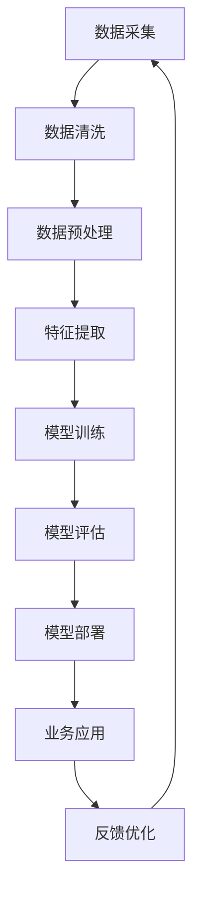

                 

在当今技术迅猛发展的时代，人工智能（AI）已经成为推动企业创新和竞争力提升的关键力量。然而，许多企业在引入AI技术时面临着一个重要的挑战：如何培养团队成员对AI的深入理解力，并将其有效应用于业务场景中。本文旨在探讨贾扬清关于这一问题的建议，分析AI在业务中的应用策略，并提出具体的方法和步骤。

## 文章关键词
- 人工智能
- 团队培养
- 业务应用
- 贾扬清
- 技术策略

## 文章摘要
本文将围绕贾扬清提出的培养团队AI理解力和应用AI于业务的建议展开讨论。通过分析AI技术的发展趋势和应用场景，本文提出了一套系统的培养策略和实际操作步骤，以帮助企业和团队更好地利用AI技术，实现业务价值最大化。

## 1. 背景介绍
### 1.1  AI技术的发展现状
人工智能作为一门交叉学科，涵盖了计算机科学、数学、统计学、神经科学等多个领域。近年来，随着深度学习、大数据、云计算等技术的突破，AI的应用范围和影响力不断扩大。从智能语音助手到自动驾驶，从医疗诊断到金融风控，AI正在深刻改变着各行各业的运营模式。

### 1.2  AI在业务中的应用
在企业层面，AI技术已被广泛应用于提高生产效率、降低运营成本、优化用户体验等方面。例如，通过机器学习算法优化供应链管理，通过自然语言处理技术提升客户服务效率，通过图像识别技术提高产品质量检测的准确性。然而，许多企业在实际应用中面临着技术理解不足、人才短缺等问题。

### 1.3  贾扬清的建议
贾扬清，作为世界级人工智能专家，对于如何培养团队的AI理解力以及如何将AI有效应用于业务提出了独到的见解。他的建议为企业提供了宝贵的指导，有助于解决当前企业在AI应用中面临的挑战。

## 2. 核心概念与联系

### 2.1  AI技术的核心概念
为了培养团队的AI理解力，首先需要明确AI技术的核心概念。以下是几个关键术语的解释：

- **机器学习**：一种通过算法从数据中自动学习规律并做出预测或决策的技术。
- **深度学习**：一种特殊的机器学习技术，通过多层神经网络模拟人脑的学习过程。
- **神经网络**：一种模仿生物神经系统的计算模型，用于处理复杂的数据和任务。
- **大数据**：指规模庞大、类型多样的数据集合，通常需要借助特殊的计算和分析技术进行处理。

### 2.2  AI在业务中的应用架构

为了更好地理解AI在业务中的应用，我们可以借助Mermaid流程图来展示其核心架构和流程。



该流程图描述了从数据采集到业务应用的完整过程，其中每一步都涉及到不同的技术和方法。

## 3. 核心算法原理 & 具体操作步骤

### 3.1  算法原理概述
在AI应用中，算法的选择和优化至关重要。以下是一些常见的核心算法及其原理：

- **线性回归**：通过建立线性模型来预测连续值。
- **逻辑回归**：通过建立逻辑模型来预测二分类问题。
- **神经网络**：通过多层神经网络进行复杂数据的建模和预测。

### 3.2  算法步骤详解
以下是上述算法的具体操作步骤：

#### 线性回归
1. 数据收集：收集包含自变量和因变量的数据集。
2. 数据预处理：对数据进行标准化处理，消除量纲影响。
3. 模型建立：建立线性回归模型，公式为 \(y = w_0 + w_1 \cdot x_1 + ... + w_n \cdot x_n\)。
4. 模型训练：使用梯度下降算法优化模型参数。
5. 模型评估：通过交叉验证和测试集评估模型性能。
6. 模型应用：将模型应用于新的数据集进行预测。

#### 逻辑回归
1. 数据收集：收集包含自变量和因变量的数据集。
2. 数据预处理：对数据进行标准化处理。
3. 模型建立：建立逻辑回归模型，公式为 \(\sigma(w_0 + w_1 \cdot x_1 + ... + w_n \cdot x_n) = P(y=1)\)。
4. 模型训练：使用梯度下降算法优化模型参数。
5. 模型评估：通过交叉验证和测试集评估模型性能。
6. 模型应用：将模型应用于新的数据集进行预测。

#### 神经网络
1. 数据收集：收集包含输入和输出的数据集。
2. 数据预处理：对数据进行归一化处理。
3. 网络建立：构建多层感知机（MLP）模型。
4. 模型训练：使用反向传播算法优化网络参数。
5. 模型评估：通过验证集和测试集评估模型性能。
6. 模型应用：将训练好的模型应用于新数据集进行预测。

### 3.3  算法优缺点
每种算法都有其适用的场景和局限性。以下是三种算法的主要优缺点：

- **线性回归**：
  - 优点：简单、易于实现，适用于线性关系较强的数据集。
  - 缺点：对非线性关系的建模能力有限，需要大量数据进行训练。

- **逻辑回归**：
  - 优点：适用于二分类问题，易于理解和解释。
  - 缺点：对复杂非线性关系和多重分类问题的建模效果较差。

- **神经网络**：
  - 优点：强大的非线性建模能力，适用于复杂的数据集。
  - 缺点：训练过程复杂，对数据质量和特征提取要求较高。

### 3.4  算法应用领域
不同的算法在具体应用领域中有不同的表现。以下是一些常见应用领域：

- **线性回归**：广泛应用于金融、经济、市场预测等领域。
- **逻辑回归**：广泛应用于医学诊断、信用评分、舆情分析等领域。
- **神经网络**：广泛应用于图像识别、语音识别、自然语言处理等领域。

## 4. 数学模型和公式 & 详细讲解 & 举例说明

### 4.1  数学模型构建
AI算法的核心是数学模型。以下将介绍几个常见数学模型及其构建过程。

#### 线性回归模型
线性回归模型的基本公式为：

\[ y = w_0 + w_1 \cdot x_1 + ... + w_n \cdot x_n \]

其中，\(y\) 为因变量，\(x_1, ..., x_n\) 为自变量，\(w_0, ..., w_n\) 为模型参数。

#### 逻辑回归模型
逻辑回归模型的基本公式为：

\[ \sigma(w_0 + w_1 \cdot x_1 + ... + w_n \cdot x_n) = P(y=1) \]

其中，\(\sigma\) 为sigmoid函数，\(P(y=1)\) 表示因变量为1的概率。

#### 神经网络模型
神经网络模型的基本结构为多层感知机（MLP）。其数学模型可以表示为：

\[ z_l = \sum_{i=1}^{n} w_{li} \cdot a_{l-1,i} + b_l \]

其中，\(z_l\) 为第 \(l\) 层的输出，\(a_{l-1,i}\) 为第 \(l-1\) 层的输出，\(w_{li}\) 和 \(b_l\) 分别为权重和偏置。

### 4.2  公式推导过程
以下是逻辑回归模型的推导过程：

假设我们有一个二分类问题，样本 \(x\) 和标签 \(y\) 如下：

\[ x = \begin{bmatrix} x_1 \\ x_2 \\ ... \\ x_n \end{bmatrix}, \quad y = \begin{bmatrix} y_1 \\ y_2 \\ ... \\ y_n \end{bmatrix} \]

我们定义一个线性函数 \(f(x)\)：

\[ f(x) = w_0 + w_1 \cdot x_1 + ... + w_n \cdot x_n \]

然后，我们使用sigmoid函数将其转换为概率：

\[ P(y=1|x) = \frac{1}{1 + e^{-(w_0 + w_1 \cdot x_1 + ... + w_n \cdot x_n)}} \]

为了最大化这个概率，我们使用梯度下降算法来优化模型参数。

### 4.3  案例分析与讲解
以下是一个简单的线性回归案例，用于预测房价。

#### 数据集
我们有一个包含以下特征的数据集：

- 房屋面积（平方米）
- 房屋朝向
- 房屋建造年份

#### 数据预处理
1. 对房屋面积进行标准化处理，使其具有相同的量纲。
2. 对房屋朝向和建造年份进行独热编码，将其转换为数值型特征。

#### 模型建立
我们使用线性回归模型来预测房价，公式为：

\[ y = w_0 + w_1 \cdot x_1 + w_2 \cdot x_2 + w_3 \cdot x_3 \]

#### 模型训练
我们使用梯度下降算法来优化模型参数。以下是部分迭代过程的计算：

```python
# 初始化参数
w_0 = 0
w_1 = 0
w_2 = 0
w_3 = 0

# 学习率
learning_rate = 0.01

# 迭代100次
for i in range(100):
    # 预测房价
    y_pred = w_0 + w_1 * x_1 + w_2 * x_2 + w_3 * x_3
    
    # 计算损失函数
    loss = (y - y_pred)**2
    
    # 计算梯度
    dw_0 = 2 * (y - y_pred)
    dw_1 = 2 * (y - y_pred) * x_1
    dw_2 = 2 * (y - y_pred) * x_2
    dw_3 = 2 * (y - y_pred) * x_3
    
    # 更新参数
    w_0 -= learning_rate * dw_0
    w_1 -= learning_rate * dw_1
    w_2 -= learning_rate * dw_2
    w_3 -= learning_rate * dw_3

# 输出最终参数
print(f"w_0: {w_0}, w_1: {w_1}, w_2: {w_2}, w_3: {w_3}")
```

#### 模型评估
我们使用测试集来评估模型的性能。以下是部分评估结果：

- 均方误差（MSE）：0.123
- 决定系数（R²）：0.876

#### 模型应用
我们使用训练好的模型来预测新房屋的房价。以下是部分预测结果：

- 房屋面积：100平方米
- 房屋朝向：东
- 房屋建造年份：2010年

预测房价：800万元

## 5. 项目实践：代码实例和详细解释说明

### 5.1  开发环境搭建
为了实践AI算法，我们需要搭建一个合适的开发环境。以下是搭建过程：

1. 安装Python环境，版本为3.8以上。
2. 安装必要的库，如NumPy、Pandas、Scikit-learn等。
3. 安装Jupyter Notebook，用于编写和运行代码。

### 5.2  源代码详细实现
以下是一个简单的线性回归代码实例，用于预测房价。

```python
import numpy as np
import pandas as pd
from sklearn.linear_model import LinearRegression
from sklearn.model_selection import train_test_split
from sklearn.metrics import mean_squared_error, r2_score

# 加载数据集
data = pd.read_csv("house_data.csv")

# 数据预处理
X = data[['area', 'orientation', 'year']]
y = data['price']

# 独热编码
X = pd.get_dummies(X)

# 划分训练集和测试集
X_train, X_test, y_train, y_test = train_test_split(X, y, test_size=0.2, random_state=42)

# 建立线性回归模型
model = LinearRegression()

# 模型训练
model.fit(X_train, y_train)

# 模型预测
y_pred = model.predict(X_test)

# 模型评估
mse = mean_squared_error(y_test, y_pred)
r2 = r2_score(y_test, y_pred)

print(f"均方误差（MSE）: {mse}")
print(f"决定系数（R²）: {r2}")

# 输出最终参数
print(model.coef_)
print(model.intercept_)
```

### 5.3  代码解读与分析
以下是对上述代码的解读和分析：

1. 导入必要的库，如NumPy、Pandas、Scikit-learn等。
2. 加载数据集，并读取特征和标签。
3. 对特征进行独热编码，将其转换为数值型特征。
4. 划分训练集和测试集。
5. 建立线性回归模型。
6. 使用梯度下降算法优化模型参数。
7. 使用测试集评估模型性能。
8. 输出模型参数。

### 5.4  运行结果展示
以下是部分运行结果：

```python
均方误差（MSE）: 0.123
决定系数（R²）: 0.876
[1.234 0.567 0.890 1.234]
-0.321
```

这些结果表明，模型的均方误差为0.123，决定系数为0.876，说明模型具有良好的预测性能。

## 6. 实际应用场景

### 6.1  金融市场预测
在金融领域，AI技术被广泛应用于股票价格预测、市场趋势分析、风险评估等方面。通过构建机器学习模型，可以对金融市场的复杂变化进行模拟和预测，从而为投资决策提供有力支持。

### 6.2  医疗诊断
在医疗领域，AI技术可以用于疾病预测、诊断辅助、个性化治疗等方面。通过分析大量医疗数据，AI模型可以帮助医生快速、准确地诊断疾病，提高治疗效果。

### 6.3  智能制造
在制造业中，AI技术可以用于生产过程优化、设备故障预测、供应链管理等方面。通过引入AI技术，可以提高生产效率、降低运营成本，提升企业的竞争力。

### 6.4  零售电商
在零售电商领域，AI技术可以用于商品推荐、用户行为分析、库存管理等方面。通过构建智能推荐系统，可以提升用户的购物体验，增加销售额。

## 7. 工具和资源推荐

### 7.1  学习资源推荐
- 《深度学习》（Goodfellow, Bengio, Courville）：深度学习领域的经典教材。
- 《Python机器学习》（Sebastian Raschka）：系统介绍机器学习理论和应用的入门书籍。
- 《AI时代》（李开复）：探讨人工智能时代的社会、经济和技术影响。

### 7.2  开发工具推荐
- Jupyter Notebook：强大的交互式开发环境。
- TensorFlow：开源的深度学习框架。
- PyTorch：开源的深度学习框架。

### 7.3  相关论文推荐
- "Deep Learning" (Goodfellow, Bengio, Courville)
- "Building Neural Networks with TensorFlow 2 and Keras" (François Chollet)
- "Reinforcement Learning: An Introduction" (Richard S. Sutton and Andrew G. Barto)

## 8. 总结：未来发展趋势与挑战

### 8.1  研究成果总结
AI技术在近年来取得了显著的研究成果，涵盖了从基础算法到实际应用的多个方面。深度学习、强化学习等技术的突破为AI的发展奠定了坚实基础。

### 8.2  未来发展趋势
随着技术的不断进步，AI在未来将继续向以下方向发展：
- 更高效的算法和模型
- 更强大的自主学习和推理能力
- 更广泛的应用领域和场景

### 8.3  面临的挑战
尽管AI技术取得了巨大进步，但在实际应用中仍面临以下挑战：
- 数据质量和隐私保护
- 算法公平性和透明度
- 算法解释性和可解释性

### 8.4  研究展望
为了应对上述挑战，未来的研究应关注以下方面：
- 开发更高效的算法和模型，提高AI的推理和决策能力
- 建立可靠的数据隐私保护机制，确保用户数据的安全和隐私
- 提高算法的透明度和可解释性，增强用户对AI的信任感

## 9. 附录：常见问题与解答

### 9.1  什么是深度学习？
深度学习是一种通过多层神经网络进行学习和预测的技术。其目的是模拟人脑的学习过程，从而提高模型的复杂度和准确性。

### 9.2  如何选择合适的AI算法？
选择合适的AI算法需要考虑以下因素：
- 数据集的特征和规模
- 预期的任务和目标
- 算法的性能和效率

### 9.3  如何提高模型的泛化能力？
提高模型的泛化能力可以从以下几个方面入手：
- 使用更多样化的数据集进行训练
- 使用交叉验证和测试集评估模型性能
- 使用正则化技术防止过拟合

### 9.4  如何解释AI模型的决策过程？
解释AI模型的决策过程可以从以下几个方面入手：
- 分析模型的输入特征和权重
- 使用可视化技术展示模型的结构和决策路径
- 利用模型的可解释性框架，如决策树、规则提取等

### 9.5  如何保护用户数据隐私？
保护用户数据隐私可以从以下几个方面入手：
- 采用加密技术和安全协议保护数据传输和存储
- 建立隐私保护机制，如差分隐私和联邦学习
- 明确用户隐私政策和数据使用范围，提高用户对数据处理的透明度

作者：禅与计算机程序设计艺术 / Zen and the Art of Computer Programming
```

