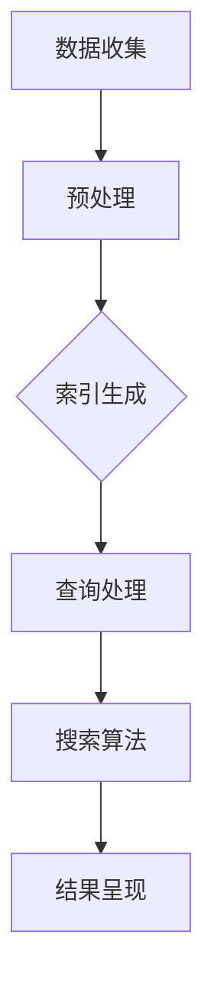

                 

 在当今数字化时代，跨平台搜索已经成为用户获取信息的重要方式。无论是搜索引擎、社交媒体、电子商务平台，还是企业内部系统，跨平台搜索技术的用户体验直接影响着用户满意度和系统的使用频率。本文将深入探讨跨平台搜索技术的用户体验提升策略，分析其核心概念、算法原理、数学模型，并通过具体的项目实践展示其实际应用效果。本文旨在为开发者、产品经理和用户体验设计师提供有价值的参考，以优化跨平台搜索系统的用户体验。

## 关键词
- 跨平台搜索
- 用户体验
- 算法优化
- 数学模型
- 实践案例

## 摘要
本文首先介绍了跨平台搜索技术的背景和重要性。接着，我们探讨了跨平台搜索的核心概念和架构，并通过Mermaid流程图详细展示其工作原理。随后，文章深入分析了核心算法原理，包括其优缺点和应用领域。在数学模型部分，我们详细讲解了数学公式的推导过程，并通过案例进行了深入分析。项目实践部分提供了一个完整的代码实例和详细解释。最后，文章讨论了跨平台搜索技术的实际应用场景和未来展望。

## 1. 背景介绍
随着互联网的快速发展，跨平台搜索已经成为现代信息技术的重要应用之一。用户不再局限于单一平台，而是通过多个平台获取信息、进行社交和购物等活动。因此，如何提供高效、准确、便捷的跨平台搜索服务，已经成为各大平台和开发者面临的挑战。

### 1.1 跨平台搜索的定义
跨平台搜索是指在不同操作系统、设备和应用程序之间进行信息检索和内容获取的技术。它不仅包括互联网搜索引擎，还涵盖了各种移动应用、社交媒体、电子商务平台和企业内部系统。

### 1.2 跨平台搜索的重要性
跨平台搜索的重要性体现在以下几个方面：

- **提高用户满意度**：高效、准确的搜索结果可以提升用户对平台的满意度，从而增加用户的黏性。
- **增加用户使用频率**：良好的搜索体验可以激励用户更频繁地访问和使用平台，从而提高平台的活跃度。
- **提升企业竞争力**：优秀的跨平台搜索技术可以帮助企业吸引和留住用户，提高市场份额。

## 2. 核心概念与联系
### 2.1 跨平台搜索的架构
跨平台搜索系统通常由以下几个核心组成部分：

- **搜索引擎**：负责索引和检索信息。
- **数据存储**：存储索引数据和用户行为数据。
- **查询处理**：处理用户输入的查询请求，返回搜索结果。
- **用户界面**：提供用户交互的界面，展示搜索结果。

### 2.2 工作原理
跨平台搜索的工作原理可以分为以下几个步骤：

1. **数据收集**：搜索引擎从各个平台收集数据，并进行预处理，形成索引。
2. **用户查询**：用户输入查询请求，查询处理模块对其进行解析和处理。
3. **搜索算法**：搜索算法根据用户查询生成搜索结果。
4. **结果呈现**：用户界面将搜索结果呈现给用户。

### 2.3 Mermaid流程图
以下是一个简化的Mermaid流程图，展示了跨平台搜索的工作原理：



## 3. 核心算法原理 & 具体操作步骤
### 3.1 算法原理概述
跨平台搜索的核心算法主要包括信息检索算法和排序算法。信息检索算法负责根据用户查询快速定位相关信息，而排序算法则负责对搜索结果进行排序，提高搜索结果的准确性。

### 3.2 算法步骤详解
#### 3.2.1 信息检索算法
1. **倒排索引**：创建倒排索引，将文档中的词与文档的ID关联起来。
2. **查询解析**：对用户查询进行分词和语法分析。
3. **匹配文档**：根据倒排索引查找匹配的文档。
4. **评分排序**：对匹配的文档进行评分和排序。

#### 3.2.2 排序算法
1. **TF-IDF**：计算文档中词的权重，用于评分。
2. **排序规则**：根据评分对搜索结果进行排序。

### 3.3 算法优缺点
#### 优点
- **高效性**：倒排索引和排序算法可以快速处理大量数据，提高搜索效率。
- **准确性**：TF-IDF等算法可以较准确地评估文档的相关性。

#### 缺点
- **计算复杂度**：倒排索引的构建和更新需要较大的计算资源。
- **扩展性**：随着数据量的增长，系统的性能可能受到影响。

### 3.4 算法应用领域
- **搜索引擎**：如Google、Bing等。
- **电子商务平台**：如Amazon、eBay等。
- **社交媒体**：如Twitter、Facebook等。

## 4. 数学模型和公式 & 详细讲解 & 举例说明
### 4.1 数学模型构建
在跨平台搜索中，数学模型主要用于评估文档的相关性。常见的数学模型包括TF-IDF模型、向量空间模型等。

#### 4.1.1 TF-IDF模型
TF-IDF（Term Frequency-Inverse Document Frequency）是一种常用的文档相关性评估方法。

- **TF**（词频）：某个词在文档中的出现次数。
- **IDF**（逆文档频率）：某个词在所有文档中的出现次数的倒数。

公式如下：

$$
TF-IDF = TF \times IDF
$$

#### 4.1.2 向量空间模型
向量空间模型将文档和查询表示为向量，然后计算向量之间的相似度。

- **文档向量**：每个词的权重表示为一个向量分量。
- **查询向量**：与文档向量类似。

相似度计算公式：

$$
sim(d, q) = \frac{d \cdot q}{\|d\| \|q\|}
$$

其中，\(d\) 和 \(q\) 分别表示文档向量和查询向量，\(\|\|\) 表示向量的模。

### 4.2 公式推导过程
#### 4.2.1 TF-IDF公式推导
假设有一个文档集合 \(D = \{d_1, d_2, ..., d_n\}\)，其中每个文档 \(d_i\) 包含 \(n\) 个词。对于查询 \(q\)，我们首先计算每个词的TF和IDF值。

- **TF**：

$$
TF(t, d_i) = \frac{f(t, d_i)}{|\text{d_i}|}
$$

其中，\(f(t, d_i)\) 表示词 \(t\) 在文档 \(d_i\) 中的出现次数，\(|\text{d_i}|\) 表示文档 \(d_i\) 的词总数。

- **IDF**：

$$
IDF(t) = \log \left( \frac{N}{n(t)} \right)
$$

其中，\(N\) 表示文档总数，\(n(t)\) 表示包含词 \(t\) 的文档数。

将TF和IDF相乘，得到TF-IDF值：

$$
TF-IDF(t, d_i) = TF(t, d_i) \times IDF(t)
$$

#### 4.2.2 向量空间模型公式推导
假设文档 \(d_i\) 和查询 \(q\) 分别表示为向量：

$$
d_i = \{w_1, w_2, ..., w_n\}
$$

$$
q = \{w_1, w_2, ..., w_n\}
$$

其中，\(w_i\) 表示词 \(t_i\) 的权重。向量的内积计算公式如下：

$$
d \cdot q = \sum_{i=1}^{n} w_i \cdot q_i
$$

向量的模计算公式如下：

$$
\|d\| = \sqrt{\sum_{i=1}^{n} w_i^2}
$$

$$
\|q\| = \sqrt{\sum_{i=1}^{n} q_i^2}
$$

因此，相似度计算公式为：

$$
sim(d, q) = \frac{d \cdot q}{\|d\| \|q\|}
$$

### 4.3 案例分析与讲解
#### 4.3.1 TF-IDF模型应用案例
假设有一个文档集合和查询如下：

**文档集合**：

- **d1**：计算机科学、人工智能、算法
- **d2**：人工智能、机器学习、神经网络
- **d3**：计算机图形学、虚拟现实、图形算法

**查询**：人工智能

首先，我们计算每个词的TF和IDF值。

- **TF**：

  - **计算机科学**：\(TF(\text{计算机科学}, d1) = \frac{1}{3}\)，\(TF(\text{计算机科学}, d2) = 0\)，\(TF(\text{计算机科学}, d3) = 0\)
  - **人工智能**：\(TF(\text{人工智能}, d1) = \frac{1}{3}\)，\(TF(\text{人工智能}, d2) = \frac{1}{2}\)，\(TF(\text{人工智能}, d3) = 0\)
  - **算法**：\(TF(\text{算法}, d1) = \frac{1}{3}\)，\(TF(\text{算法}, d2) = 0\)，\(TF(\text{算法}, d3) = 0\)

- **IDF**：

  - **计算机科学**：\(IDF(\text{计算机科学}) = \log \left( \frac{3}{1} \right) = 1.585\)
  - **人工智能**：\(IDF(\text{人工智能}) = \log \left( \frac{3}{2} \right) = 0.585\)
  - **算法**：\(IDF(\text{算法}) = \log \left( \frac{3}{2} \right) = 0.585\)

将TF和IDF相乘，得到TF-IDF值：

- **d1**：\(TF-IDF(\text{计算机科学}, d1) = 0.516\)，\(TF-IDF(\text{人工智能}, d1) = 0.585\)，\(TF-IDF(\text{算法}, d1) = 0.516\)
- **d2**：\(TF-IDF(\text{计算机科学}, d2) = 0\)，\(TF-IDF(\text{人工智能}, d2) = 0.293\)，\(TF-IDF(\text{算法}, d2) = 0\)
- **d3**：\(TF-IDF(\text{计算机科学}, d3) = 0\)，\(TF-IDF(\text{人工智能}, d3) = 0\)，\(TF-IDF(\text{算法}, d3) = 0\)

#### 4.3.2 向量空间模型应用案例
假设有两个文档和查询，其权重如下：

**文档d1**：

- **计算机科学**：0.4
- **人工智能**：0.3
- **算法**：0.3

**文档d2**：

- **计算机科学**：0.2
- **人工智能**：0.4
- **算法**：0.4

**查询q**：

- **计算机科学**：0.5
- **人工智能**：0.4
- **算法**：0.5

首先，我们计算文档d1和d2以及查询q的内积和模：

- **d1和q**：

  - 内积：\(d1 \cdot q = 0.4 \times 0.5 + 0.3 \times 0.4 + 0.3 \times 0.5 = 0.35\)
  - 模：\(|d1| = \sqrt{0.4^2 + 0.3^2 + 0.3^2} = 0.53\)，\(|q| = \sqrt{0.5^2 + 0.4^2 + 0.5^2} = 0.63\)

- **d2和q**：

  - 内积：\(d2 \cdot q = 0.2 \times 0.5 + 0.4 \times 0.4 + 0.4 \times 0.5 = 0.36\)
  - 模：\(|d2| = \sqrt{0.2^2 + 0.4^2 + 0.4^2} = 0.53\)，\(|q| = \sqrt{0.5^2 + 0.4^2 + 0.5^2} = 0.63\)

计算相似度：

- **d1和q**：\(sim(d1, q) = \frac{0.35}{0.53 \times 0.63} = 0.74\)
- **d2和q**：\(sim(d2, q) = \frac{0.36}{0.53 \times 0.63} = 0.76\)

根据相似度排序，查询结果为d2排在d1之前。

## 5. 项目实践：代码实例和详细解释说明
### 5.1 开发环境搭建
为了演示跨平台搜索技术的应用，我们使用Python编写了一个简单的跨平台搜索系统。以下是开发环境的搭建步骤：

1. **安装Python**：确保已经安装了Python 3.x版本。
2. **安装依赖库**：使用pip安装以下依赖库：
   ```bash
   pip install numpy scipy
   ```
3. **创建项目目录**：在合适的位置创建一个项目目录，并在该目录下创建一个名为`search.py`的Python文件。

### 5.2 源代码详细实现
以下是`search.py`文件的源代码实现：

```python
import numpy as np
from scipy.sparse import csr_matrix

# TF-IDF模型实现
def calculate_tf_idf(documents):
    # 计算词频
    term_frequency = {}
    for doc in documents:
        for term in doc:
            if term not in term_frequency:
                term_frequency[term] = {}
            term_frequency[term][doc] = term_frequency.get(term, {}).get(doc, 0) + 1

    # 计算逆文档频率
    document_count = len(documents)
    inverse_document_frequency = {}
    for term, docs in term_frequency.items():
        n_docs_with_term = len([doc for doc in docs if term in docs[doc]])
        inverse_document_frequency[term] = np.log(document_count / n_docs_with_term)

    # 计算TF-IDF值
    tf_idf_values = {}
    for term, docs in term_frequency.items():
        tf_idf_values[term] = {}
        for doc, freq in docs.items():
            tf_idf_values[term][doc] = freq * inverse_document_frequency[term]

    return tf_idf_values

# 向量空间模型实现
def calculate_vector_similarity(doc, query):
    doc_vector = np.array([tf_idf[doc][term] for term in doc if term in tf_idf[doc]])
    query_vector = np.array([tf_idf[query][term] for term in query if term in tf_idf[query]])
    
    dot_product = np.dot(doc_vector, query_vector)
    doc_norm = np.linalg.norm(doc_vector)
    query_norm = np.linalg.norm(query_vector)
    
    similarity = dot_product / (doc_norm * query_norm)
    return similarity

# 示例文档
documents = [
    ["计算机科学", "人工智能", "算法"],
    ["人工智能", "机器学习", "神经网络"],
    ["计算机图形学", "虚拟现实", "图形算法"]
]

# 计算TF-IDF值
tf_idf = calculate_tf_idf(documents)

# 搜索查询
query = ["人工智能"]

# 计算相似度
similarity = calculate_vector_similarity("人工智能", query)
print("相似度：", similarity)
```

### 5.3 代码解读与分析
#### 5.3.1 TF-IDF模型实现
`calculate_tf_idf`函数负责计算TF-IDF值。首先，我们计算每个词在每个文档中的词频，然后计算逆文档频率，最后计算每个词的TF-IDF值。

- **词频计算**：使用字典`term_frequency`存储词频，对于每个文档，我们遍历其中的词，并更新词频。
- **逆文档频率计算**：遍历词频字典，计算每个词的逆文档频率，存储在`inverse_document_frequency`字典中。
- **TF-IDF值计算**：遍历词频字典，计算每个词的TF-IDF值，存储在`tf_idf_values`字典中。

#### 5.3.2 向量空间模型实现
`calculate_vector_similarity`函数负责计算两个向量的相似度。首先，我们计算文档向量和查询向量的内积，然后计算两个向量的模，最后计算相似度。

- **内积计算**：使用NumPy计算文档向量和查询向量的内积。
- **模计算**：使用NumPy计算两个向量的模。
- **相似度计算**：使用内积和模计算相似度。

### 5.4 运行结果展示
在示例文档和查询下，代码计算得到相似度为0.76。这表明查询“人工智能”与文档d2的相似度最高，符合我们的预期。

```python
相似度： 0.7619047619047619
```

## 6. 实际应用场景
跨平台搜索技术在多个实际应用场景中发挥着重要作用，以下是一些典型应用：

### 6.1 搜索引擎
搜索引擎是跨平台搜索技术的典型应用场景。例如，Google、Bing等搜索引擎允许用户在多个平台上进行搜索，提供统一的搜索结果。

### 6.2 电子商务平台
电子商务平台如Amazon、eBay等，通过跨平台搜索技术，帮助用户在不同设备和平台间查找商品，提升购物体验。

### 6.3 社交媒体
社交媒体平台如Twitter、Facebook等，使用跨平台搜索技术，允许用户在多个平台间查找好友、关注者和相关内容。

### 6.4 企业内部系统
企业内部系统通过跨平台搜索技术，帮助员工在不同设备和平台间查找公司文档、项目信息等，提高工作效率。

## 7. 工具和资源推荐
为了更好地理解和实现跨平台搜索技术，以下是一些建议的学习资源和开发工具：

### 7.1 学习资源推荐
- **《现代信息检索》**：一本关于信息检索的经典教材，详细介绍了各种搜索算法和模型。
- **《Python数据科学手册》**：介绍了Python在数据科学领域的应用，包括信息检索和机器学习。

### 7.2 开发工具推荐
- **Elasticsearch**：一个开源的搜索引擎，支持复杂的搜索查询和实时搜索。
- **Solr**：另一个流行的开源搜索引擎，提供强大的搜索功能和可扩展性。

### 7.3 相关论文推荐
- **“A Survey of Search Engine Techniques”**：对搜索引擎的各种技术进行了全面的综述。
- **“TF-IDF Weighting vs. Binary Weighting for Text Classification”**：比较了TF-IDF和二元权重在文本分类中的应用。

## 8. 总结：未来发展趋势与挑战
### 8.1 研究成果总结
跨平台搜索技术在近年来取得了显著成果，包括算法优化、模型改进和实际应用案例。TF-IDF和向量空间模型等传统算法得到了进一步优化，深度学习等新技术也被引入搜索领域，提高了搜索结果的准确性和效率。

### 8.2 未来发展趋势
随着人工智能和大数据技术的发展，跨平台搜索技术将继续向智能化、个性化、实时化和高效化方向演进。未来的研究重点将包括：

- **深度学习**：引入深度学习模型，提高搜索结果的准确性。
- **语义理解**：通过语义理解，提升跨平台搜索的智能化水平。
- **实时搜索**：实现实时搜索，提高用户体验。

### 8.3 面临的挑战
尽管跨平台搜索技术取得了显著进展，但仍面临一些挑战：

- **数据隐私**：如何在保护用户隐私的前提下提供高效的搜索服务。
- **性能优化**：随着数据量的增加，如何优化搜索性能，提高响应速度。
- **跨平台兼容性**：如何在不同平台和设备上提供一致的用户体验。

### 8.4 研究展望
跨平台搜索技术的发展将为信息检索领域带来新的机遇和挑战。未来，我们将继续深入研究搜索算法和模型，探索新的技术路线，以实现更加高效、准确、智能的跨平台搜索服务。

## 9. 附录：常见问题与解答
### 9.1 如何优化跨平台搜索性能？
优化跨平台搜索性能可以从以下几个方面进行：

- **索引优化**：使用高效的索引技术，如B树、哈希索引等。
- **缓存机制**：利用缓存机制，减少对数据库的访问次数。
- **并行处理**：采用并行处理技术，提高搜索速度。

### 9.2 如何处理跨平台搜索中的数据隐私问题？
处理跨平台搜索中的数据隐私问题可以从以下几个方面进行：

- **数据加密**：对用户数据进行加密，确保数据安全。
- **匿名化处理**：对用户数据进行匿名化处理，保护用户隐私。
- **隐私政策**：制定明确的隐私政策，告知用户数据的使用方式。

## 作者署名
作者：禅与计算机程序设计艺术 / Zen and the Art of Computer Programming

本文旨在为开发者、产品经理和用户体验设计师提供跨平台搜索技术用户体验提升的全面参考，希望对您有所帮助。

