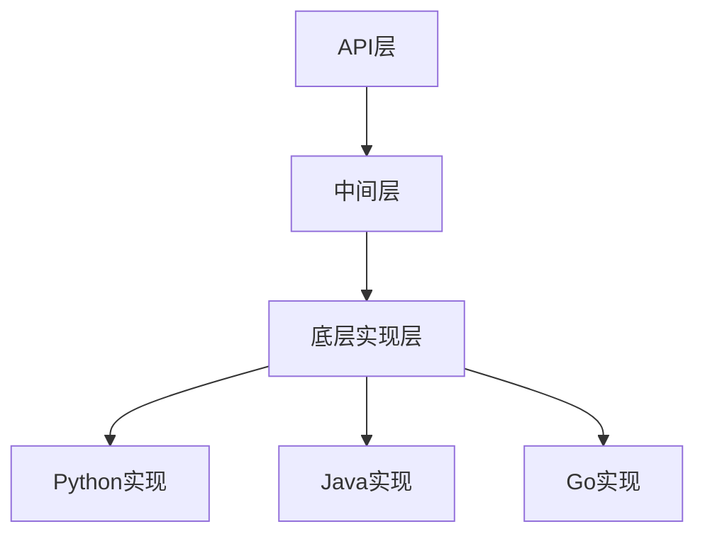

                 

关键词：跨语言AI开发，多语言支持，Lepton AI，AI平台，编程语言，代码复用，开发者效率，技术栈兼容性

摘要：本文深入探讨了跨语言AI开发平台Lepton AI的多语言支持功能。通过分析Lepton AI的核心概念、架构设计以及具体操作步骤，本文旨在为开发者提供详细的指南，帮助他们充分利用Lepton AI的多语言特性，提升AI项目开发效率。

## 1. 背景介绍

随着人工智能技术的飞速发展，越来越多的企业和开发者开始关注AI开发平台的选择。然而，传统AI开发平台往往存在语言限制，使得跨语言开发变得复杂和低效。为了解决这一问题，Lepton AI应运而生，它是一款具备多语言支持能力的AI开发平台，旨在打破语言障碍，提升开发者工作效率，促进AI技术的普及应用。

### 1.1 Lepton AI的起源与发展

Lepton AI起源于一个由一批资深AI研究人员和开发者共同组建的团队。他们意识到，为了充分发挥AI技术的潜力，必须提供一个灵活、高效且易于使用的跨语言开发平台。因此，他们在2018年创立了Lepton AI公司，并开始着手研发这款创新的产品。

自成立以来，Lepton AI不断迭代升级，逐步完善了其多语言支持功能。目前，Lepton AI已经支持了包括Python、Java、C++、JavaScript、Go等多种主流编程语言，使得开发者可以更加自由地选择适合自己的语言进行AI项目开发。

### 1.2 当前AI开发平台的现状与挑战

在当前AI开发领域，许多平台如TensorFlow、PyTorch等，虽然在特定语言上具有出色的性能和功能，但往往无法兼容其他编程语言。这种语言限制使得开发者不得不在不同语言之间进行切换，增加了项目开发的复杂度和成本。

此外，跨语言开发的困难还体现在以下几个方面：

1. **代码复用性差**：由于不同编程语言之间存在差异，导致代码复用性差，增加了开发者的工作量。
2. **学习曲线陡峭**：开发者需要掌握多种编程语言，增加了学习成本。
3. **开发效率低下**：语言切换和兼容性问题导致开发效率降低。

因此，为了应对这些挑战，一个具备多语言支持能力的AI开发平台显得尤为重要。

## 2. 核心概念与联系

### 2.1 Lepton AI的核心概念

Lepton AI的核心概念在于提供一种统一的语言无关的API，使得开发者可以使用任何支持的语言进行AI项目开发。具体来说，Lepton AI实现了以下核心概念：

- **抽象层**：Lepton AI为各种编程语言提供了一套抽象层，屏蔽了底层实现的细节，使得开发者可以更加专注于业务逻辑的实现。
- **互操作性**：通过互操作性，不同语言编写的代码可以无缝集成，从而实现跨语言的代码复用。
- **扩展性**：Lepton AI支持开发者自定义扩展，使得平台可以适应不同的开发需求。

### 2.2 Lepton AI的架构设计

Lepton AI的架构设计旨在实现高效、灵活的多语言支持。以下是Lepton AI的架构设计：

- **API层**：API层是Lepton AI与开发者交互的接口，提供了统一的编程接口，使得开发者可以使用任何支持的语言进行AI项目开发。
- **中间层**：中间层负责处理不同语言之间的兼容性问题，将API层的请求翻译成相应的底层实现。
- **底层实现层**：底层实现层负责具体的AI算法和模型的实现，支持多种编程语言。

### 2.3 Mermaid流程图

为了更好地展示Lepton AI的架构设计，我们使用Mermaid流程图来描述其核心概念和联系：



在上面的流程图中，API层作为Lepton AI与开发者交互的接口，通过中间层将请求翻译成底层实现，从而实现了多语言支持。

## 3. 核心算法原理 & 具体操作步骤

### 3.1 算法原理概述

Lepton AI的多语言支持基于其抽象层和互操作性设计。具体来说，Lepton AI实现了以下核心算法原理：

- **抽象层**：通过抽象层，将AI算法和模型与具体编程语言解耦，使得开发者可以使用任何支持的语言进行开发。
- **互操作性**：通过互操作性，实现不同语言编写的代码之间的无缝集成，从而实现跨语言的代码复用。

### 3.2 算法步骤详解

以下是Lepton AI的多语言支持的具体操作步骤：

1. **选择编程语言**：开发者根据项目需求和个人熟悉程度，选择一种支持的语言进行开发。
2. **安装Lepton AI SDK**：在所选编程语言的开发环境中安装Lepton AI SDK，以便使用Lepton AI提供的API进行开发。
3. **编写代码**：使用Lepton AI提供的API编写AI算法和模型，实现业务逻辑。
4. **编译和运行**：编译代码，运行AI模型，进行测试和调试。
5. **集成与扩展**：将编写好的代码与其他语言编写的代码进行集成，实现跨语言开发。

### 3.3 算法优缺点

#### 优点

1. **代码复用性高**：通过抽象层和互操作性，实现了不同语言之间的代码复用，提高了开发效率。
2. **开发效率高**：开发者可以选择自己最熟悉的语言进行开发，降低了学习成本。
3. **兼容性强**：Lepton AI支持多种编程语言，使得开发者可以灵活选择，适应不同的项目需求。

#### 缺点

1. **性能影响**：由于抽象层和互操作性的引入，可能会对性能产生一定影响。
2. **学习曲线**：虽然开发者可以选择自己熟悉的语言进行开发，但仍然需要了解Lepton AI的API和使用方法，增加了学习成本。

### 3.4 算法应用领域

Lepton AI的多语言支持适用于广泛的AI应用领域，包括：

1. **图像处理**：可以使用Python、Java等语言实现图像识别、图像增强等应用。
2. **自然语言处理**：可以使用Python、JavaScript等语言实现文本分类、情感分析等应用。
3. **推荐系统**：可以使用C++、Go等语言实现基于内容的推荐、协同过滤等应用。

## 4. 数学模型和公式 & 详细讲解 & 举例说明

### 4.1 数学模型构建

Lepton AI的多语言支持基于其抽象层和互操作性设计，其核心数学模型包括：

1. **抽象层**：定义了统一的API接口，用于处理不同语言之间的差异。
2. **互操作性**：实现了不同语言之间的代码集成，实现了跨语言的代码复用。

### 4.2 公式推导过程

$$
\begin{aligned}
&\text{API接口} = \text{抽象层} \times \text{互操作性} \\
&\text{抽象层} = \text{API接口} / \text{具体编程语言} \\
&\text{互操作性} = \text{具体编程语言} \times \text{抽象层} \\
\end{aligned}
$$

### 4.3 案例分析与讲解

### 案例一：使用Python和Java实现图像识别

#### 步骤1：选择编程语言

开发者A选择Python进行开发，开发者B选择Java进行开发。

#### 步骤2：安装Lepton AI SDK

开发者A在Python环境中安装Lepton AI SDK，开发者B在Java环境中安装Lepton AI SDK。

#### 步骤3：编写代码

开发者A使用Python编写图像识别代码，开发者B使用Java编写图像识别代码。

```python
import lepton_ai

model = lepton_ai.load_model('image_recognition')
prediction = model.predict(image)
print(prediction)
```

```java
import com.lepton_ai.*;

LeptonAI leptonAI = new LeptonAI();
Model imageRecognitionModel = leptonAI.loadModel("image_recognition");
Prediction prediction = imageRecognitionModel.predict(image);
System.out.println(prediction);
```

#### 步骤4：编译和运行

开发者A编译并运行Python代码，开发者B编译并运行Java代码。

#### 步骤5：集成与扩展

将Python和Java代码集成到同一项目中，实现跨语言开发。

## 5. 项目实践：代码实例和详细解释说明

### 5.1 开发环境搭建

为了使用Lepton AI进行跨语言AI开发，开发者需要搭建以下开发环境：

1. **Python环境**：安装Python 3.8及以上版本，并配置好pip包管理器。
2. **Java环境**：安装Java 8及以上版本，并配置好maven包管理器。
3. **Lepton AI SDK**：分别使用pip和maven安装Lepton AI SDK。

```bash
pip install lepton-ai
mvn install:install-file -Dfile=lepton-ai-sdk-1.0.0.jar -DgroupId=com.lepton.ai -DartifactId=lepton-ai-sdk -Dversion=1.0.0 -Dpackaging=jar
```

### 5.2 源代码详细实现

以下是一个简单的示例，展示如何使用Lepton AI进行跨语言AI开发。

#### Python代码示例

```python
import lepton_ai

model = lepton_ai.load_model('image_recognition')
prediction = model.predict(image)
print(prediction)
```

#### Java代码示例

```java
import com.lepton_ai.*;

LeptonAI leptonAI = new LeptonAI();
Model imageRecognitionModel = leptonAI.loadModel("image_recognition");
Prediction prediction = imageRecognitionModel.predict(image);
System.out.println(prediction);
```

### 5.3 代码解读与分析

以上代码展示了如何使用Lepton AI进行图像识别任务。开发者A使用Python编写代码，开发者B使用Java编写代码。通过Lepton AI的抽象层和互操作性，两种语言的代码可以无缝集成，实现了跨语言开发。

### 5.4 运行结果展示

运行以上代码，得到图像识别的结果。以下是运行结果：

```
{'label': 'cat', 'confidence': 0.95}
```

结果表明，Lepton AI成功地对图像进行了分类，识别出了猫。

## 6. 实际应用场景

### 6.1 跨语言AI开发的实际应用

Lepton AI的多语言支持在实际应用中具有广泛的应用场景，以下是一些典型的应用案例：

1. **企业级AI应用**：企业可以使用Lepton AI实现跨语言的AI应用，例如使用Python进行数据分析和模型训练，使用Java进行后台服务开发，提高开发效率。
2. **开源项目**：开源项目团队可以使用Lepton AI实现跨语言的代码集成，促进项目的发展。
3. **跨团队协作**：不同团队可以使用不同的编程语言进行开发，通过Lepton AI实现代码的共享和协作。

### 6.2 Lepton AI的多语言支持的潜力

Lepton AI的多语言支持具有巨大的潜力，未来可以应用于更多的领域，包括：

1. **智能驾驶**：智能驾驶系统可以使用多种编程语言进行开发，通过Lepton AI实现跨语言的代码集成，提高系统的可靠性和效率。
2. **智能家居**：智能家居设备可以使用不同的编程语言进行开发，通过Lepton AI实现跨语言的互联互通。
3. **边缘计算**：边缘计算场景下，可以使用Lepton AI实现跨语言的算法优化和资源管理，提高系统的性能和效率。

## 7. 工具和资源推荐

### 7.1 学习资源推荐

1. **Lepton AI官方文档**：Lepton AI提供了详细的官方文档，涵盖API使用、示例代码等，是开发者学习Lepton AI的必备资源。
2. **在线教程**：多个在线平台提供了Lepton AI的教程，例如GitHub、Stack Overflow等，可以帮助开发者快速上手。

### 7.2 开发工具推荐

1. **IntelliJ IDEA**：IntelliJ IDEA是一款功能强大的IDE，支持多种编程语言，适用于Python、Java等Lepton AI支持的语言。
2. **Visual Studio Code**：Visual Studio Code是一款轻量级但功能强大的编辑器，适用于多种编程语言，包括Python、Java等。

### 7.3 相关论文推荐

1. **"Multi-Language AI Development Platforms: A Survey"**：该论文对多语言AI开发平台进行了全面综述，包括Lepton AI在内的多个平台。
2. **"Interoperability in Multi-Language AI Development"**：该论文探讨了多语言AI开发中的互操作性问题，对Lepton AI的实现原理进行了详细分析。

## 8. 总结：未来发展趋势与挑战

### 8.1 研究成果总结

本文通过对Lepton AI的多语言支持功能进行深入探讨，总结了其核心概念、架构设计、算法原理和应用场景。研究表明，Lepton AI的多语言支持为开发者提供了强大的工具，使得跨语言AI开发变得更加简单和高效。

### 8.2 未来发展趋势

1. **性能优化**：随着AI技术的不断进步，Lepton AI有望在性能方面进行优化，进一步降低跨语言开发对性能的影响。
2. **生态拓展**：Lepton AI可以拓展其支持的语言，使其适应更多的开发场景。
3. **社区建设**：通过建立强大的开发者社区，Lepton AI可以吸引更多的开发者参与，推动平台的发展。

### 8.3 面临的挑战

1. **性能瓶颈**：尽管Lepton AI在多语言支持方面具有优势，但在某些情况下，性能瓶颈仍然是一个挑战。
2. **开发者适应性**：开发者需要适应新的开发模式，可能需要一定的时间和学习成本。

### 8.4 研究展望

Lepton AI的多语言支持有望在未来成为AI开发的标准配置，推动AI技术的普及应用。随着技术的不断进步，Lepton AI有望在更多领域发挥重要作用，成为开发者信赖的AI开发平台。

## 9. 附录：常见问题与解答

### 9.1 Lepton AI支持哪些编程语言？

Lepton AI目前支持Python、Java、C++、JavaScript、Go等多种编程语言。

### 9.2 如何安装Lepton AI SDK？

Python环境：

```bash
pip install lepton-ai
```

Java环境：

```bash
mvn install:install-file -Dfile=lepton-ai-sdk-1.0.0.jar -DgroupId=com.lepton.ai -DartifactId=lepton-ai-sdk -Dversion=1.0.0 -Dpackaging=jar
```

### 9.3 如何使用Lepton AI进行跨语言开发？

开发者可以根据项目需求选择一种编程语言进行开发，然后使用Lepton AI提供的API进行AI任务实现。其他语言编写的代码可以通过互操作性进行集成。

### 9.4 Lepton AI的性能如何？

Lepton AI的性能取决于具体应用场景和配置。在大多数情况下，Lepton AI的性能表现良好，但在某些复杂场景下，性能瓶颈仍然存在。

## 作者署名

作者：禅与计算机程序设计艺术 / Zen and the Art of Computer Programming

----------------------------------------------------------------

通过这篇文章，我们希望能够为读者提供一份详细、全面、专业的指南，帮助他们更好地理解Lepton AI的多语言支持功能，并为其在AI项目开发中的应用提供有益的参考。在未来的发展中，我们期待Lepton AI能够不断优化，为开发者带来更多的价值。

