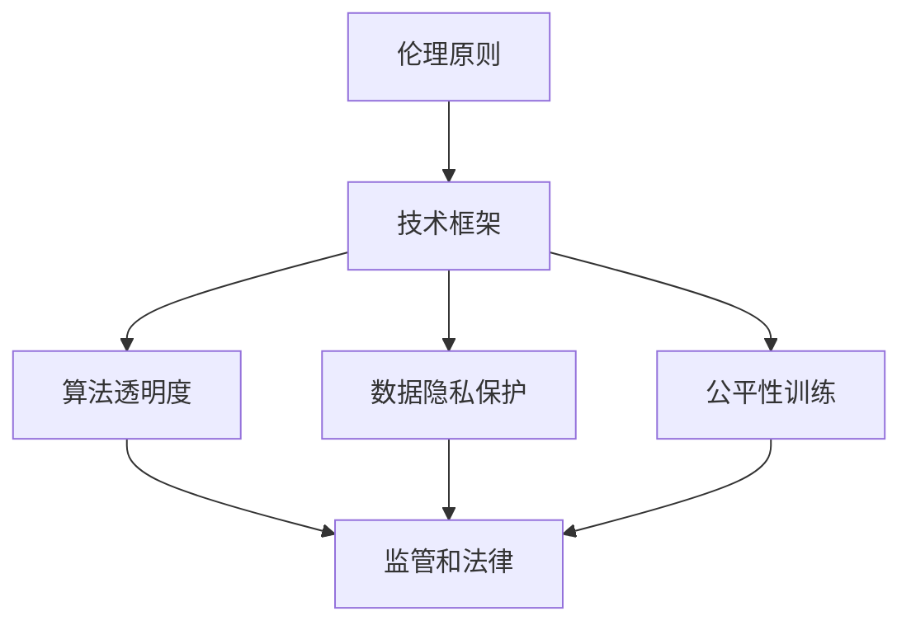
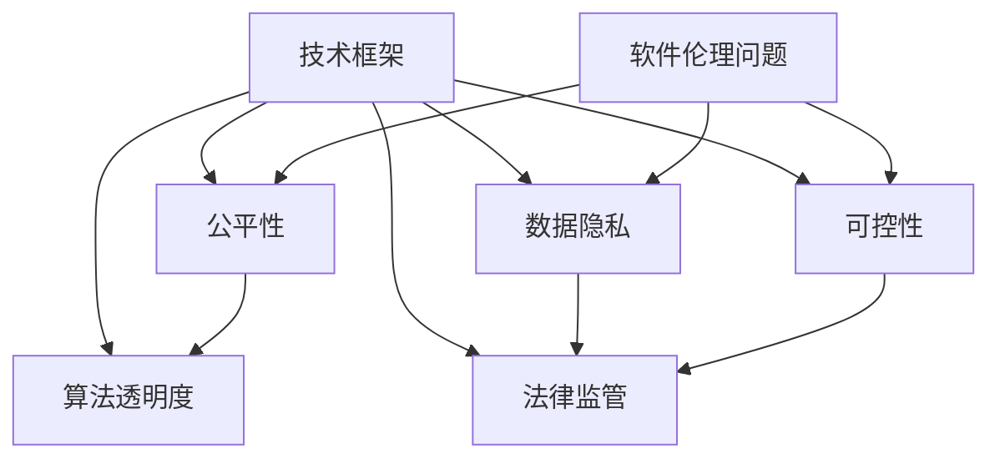

                 

关键词：软件2.0，伦理问题，公平性，可控性，人工智能，数据隐私

## 摘要

软件2.0时代，人工智能的应用已渗透到各个领域，改变了传统软件的开发和使用方式。然而，随之而来的是一系列伦理问题，如公平性和可控性。本文将深入探讨软件2.0时代中这些重要伦理问题，分析其产生的原因、影响及应对策略。通过对核心概念和算法原理的详细阐述，以及实际应用案例的剖析，本文旨在为软件2.0时代的伦理问题提供有益的思考和参考。

## 1. 背景介绍

随着互联网和人工智能技术的发展，软件2.0时代已经到来。软件2.0相较于传统的软件1.0，具有更加智能、互联和开放的特点。在软件2.0时代，软件不仅仅是程序代码的集合，更是数据和服务的集成。这种转变使得软件的功能和影响力日益增强，但同时也带来了一系列伦理问题。

首先，公平性问题是软件2.0时代的重要伦理问题之一。在人工智能驱动的软件系统中，算法的偏见可能导致对某些群体的不公平对待。例如，招聘系统中的偏见算法可能导致某些种族或性别的人被拒绝。这种不公平性不仅损害了个人权益，也影响了社会的公正性和稳定性。

其次，可控性问题也是软件2.0时代面临的重大挑战。在传统软件中，开发者和用户对软件的控制力较强，但在软件2.0时代，随着人工智能和大数据的加入，软件的行为变得更为复杂和难以预测。这可能导致软件出现意想不到的后果，甚至威胁到用户的安全和隐私。

本文将围绕公平性和可控性这两个核心问题，探讨软件2.0时代的伦理挑战，并提出相应的解决方案。

### 2.1 软件发展历程

软件的发展经历了从1.0到2.0的演变。在软件1.0时代，软件主要以单个应用程序的形式存在，如早期的办公软件、游戏和操作系统。这个时期的软件主要是基于程序员编写的代码，用户与软件的交互方式相对简单。

随着互联网和Web技术的兴起，软件开始向分布式、协同和互联互通的方向发展。这个阶段的软件，如电子邮件、社交媒体和在线购物平台，具有更强的互联性和协作性，用户可以通过网络与其他用户进行互动。

进入软件2.0时代，人工智能和大数据技术开始广泛应用于软件领域。软件不再仅仅是一个静态的应用程序，而是变成了一个动态的、智能化的系统。这个时期的软件具有自我学习、自我优化和自适应的能力，能够更好地满足用户的需求。

### 2.2 人工智能在软件中的应用

人工智能在软件中的应用极大地提升了软件的智能化程度。人工智能技术主要包括机器学习、深度学习和自然语言处理等。这些技术使得软件能够从数据中学习，并自动进行决策和预测。

例如，在智能推荐系统中，人工智能算法可以根据用户的历史行为和偏好，为其推荐个性化的内容。在自动驾驶汽车中，人工智能算法可以实时处理路况信息，并做出驾驶决策。在金融领域，人工智能算法可以分析大量数据，帮助投资者做出更好的投资决策。

### 2.3 软件2.0时代的特点

软件2.0时代具有以下几个显著特点：

1. **智能化**：软件通过人工智能技术，能够实现自我学习和自我优化，提高软件的智能化程度。
2. **互联性**：软件通过互联网和物联网，与其他软件、设备和用户实现互联互通，形成庞大的软件生态系统。
3. **开放性**：软件通过开放接口和平台，允许第三方开发者进行开发和集成，推动软件的创新和发展。
4. **数据驱动**：软件的决策和功能基于大量数据的支持，数据的获取、处理和应用成为软件的核心。

这些特点使得软件2.0时代具有更强的功能、更大的影响力和更广泛的适用范围。然而，也正因为如此，软件2.0时代面临着更为复杂的伦理问题，需要我们认真对待和解决。

## 2.4 软件2.0时代引发的伦理问题

软件2.0时代的到来，虽然带来了诸多便利和创新，但也引发了一系列伦理问题，特别是在公平性和可控性方面。

### 公平性问题

公平性是现代社会的重要价值观之一，尤其在技术领域，公平性问题的关注度日益提高。在软件2.0时代，人工智能算法的广泛应用使得算法偏见成为一个不可忽视的伦理问题。

算法偏见是指算法在决策过程中，对某些群体或个体存在不公平对待的现象。这种偏见可能源于数据集的不均衡、算法的设计缺陷或者训练过程中的数据污染。

例如，在招聘系统中，如果训练数据集中女性或少数族裔的样本数量较少，或者这些样本被错误地标记，那么招聘算法可能会对女性或少数族裔产生偏见，导致他们在招聘过程中被歧视。

另一个例子是在金融领域，信用评分系统可能会对低收入群体产生偏见，使得他们难以获得贷款或信用卡。这种偏见不仅损害了个人权益，也加剧了社会不平等。

### 可控性问题

可控性是另一个在软件2.0时代备受关注的伦理问题。在传统软件中，开发者和用户对软件有较高的控制力，但在软件2.0时代，随着人工智能和大数据的加入，软件的行为变得更为复杂和难以预测。

可控性问题的根源在于人工智能算法的黑箱性质。许多人工智能算法，如深度学习算法，具有高度的非线性特征，使得其内部决策过程难以理解。这意味着，即使软件开发者也无法完全掌控软件的行为。

例如，自动驾驶汽车中的决策系统可能因为外部环境的微小变化而导致不可预测的行为，从而引发交通事故。此外，智能医疗系统可能因为对病情理解的不充分，导致错误的诊断和治疗决策。

### 公平性与可控性之间的关系

公平性和可控性之间存在密切的联系。一个不可控的软件系统可能会导致不公平的结果，反之，一个公平的软件系统也需要具备可控性，以确保其决策过程的透明和可解释性。

例如，在招聘系统中，如果算法无法解释其决策过程，那么即使算法本身是公平的，用户也无法信任和接受这种决策。相反，如果一个招聘算法能够清晰地解释其决策依据，即使存在某些偏见，用户也有可能理解和接受。

### 2.5 软件伦理问题的社会影响

软件伦理问题不仅涉及个人权益，还对社会产生了深远的影响。

首先，算法偏见和不公平性可能导致社会不平等加剧。例如，招聘歧视和信用评分偏见可能导致某些群体在就业和金融领域面临更大的困难，从而影响他们的生活质量和机会。

其次，可控性问题的存在使得软件系统的行为变得不可预测，增加了社会风险。自动驾驶汽车和智能医疗系统的失控可能导致严重的后果，甚至威胁到人们的生命安全。

此外，软件伦理问题还可能影响社会的信任和道德价值观。如果公众发现软件系统存在严重的不公平或不可控现象，他们可能会对人工智能和科技产生怀疑，甚至反对其进一步的发展。

### 2.6 现有解决方案与不足

针对软件伦理问题，已有一些解决方案被提出。例如，算法透明度和可解释性研究旨在开发能够解释其决策过程的算法，从而增加用户的信任。此外，数据多样性和公平性训练也试图减少算法偏见。

然而，这些解决方案仍然存在一定的不足。首先，算法透明度和可解释性研究主要关注算法的内部工作原理，但往往忽视用户对算法的接受度和信任度。其次，数据多样性和公平性训练虽然有助于减少偏见，但在实际应用中，数据质量和数据标签的准确性仍然是一个挑战。

此外，现有解决方案往往缺乏系统性的框架和方法，无法全面应对软件伦理问题的复杂性和多样性。

## 3. 核心概念与联系

在深入探讨软件2.0时代的伦理问题之前，我们需要了解一些核心概念和原理，以便更好地理解问题的本质和解决方案。

### 3.1 伦理学的基本原理

伦理学是研究道德和伦理问题的学科，主要包括以下基本原理：

1. **功利主义**：认为道德行为的判断标准是行为带来的总体幸福或利益。
2. **康德主义**：强调道德行为的判断标准是行为是否符合道德规范，而不是行为的结果。
3. **权利主义**：认为个体拥有一定的道德权利，道德行为应当尊重和保护这些权利。

在软件伦理问题中，这些原理可以帮助我们评估和解决公平性和可控性问题。

### 3.2 人工智能算法原理

人工智能算法是软件2.0时代的核心技术之一。以下是一些常见的人工智能算法及其原理：

1. **机器学习**：通过从数据中学习规律和模式，使计算机能够执行特定任务。常见的机器学习算法包括线性回归、决策树和神经网络。
2. **深度学习**：一种特殊类型的机器学习算法，通过模拟人脑神经网络的结构和功能，实现复杂任务的处理。常见的深度学习算法包括卷积神经网络（CNN）和循环神经网络（RNN）。
3. **自然语言处理（NLP）**：使计算机能够理解和生成人类语言。常见的NLP算法包括词向量模型、序列标注和机器翻译。

这些算法在软件2.0时代被广泛应用于各种场景，但也可能带来伦理问题。

### 3.3 数据隐私与安全

数据隐私和安全是软件伦理问题中的重要方面。以下是一些关键概念：

1. **数据隐私**：指个体对自身数据的控制权和知情权。数据隐私问题主要体现在数据的收集、存储、处理和分享过程中。
2. **数据安全**：指保护数据免受未经授权的访问、使用和泄露。数据安全问题可能导致隐私泄露、财产损失和声誉损害。

在软件2.0时代，数据隐私和安全问题尤为突出，需要采取有效措施加以解决。

### 3.4 软件伦理问题的架构

为了更好地理解和解决软件伦理问题，我们可以将其划分为以下架构：

1. **伦理原则**：明确软件伦理问题的基本原则和价值观，如公平性、可控性、透明度和尊重隐私。
2. **技术框架**：开发和实施能够满足伦理原则的技术方案，如算法透明度、数据隐私保护和公平性训练。
3. **监管和法律**：制定和执行相关法律法规，监督和规范软件开发和应用的伦理行为。

### 3.5 Mermaid 流程图

以下是一个简化的 Mermaid 流程图，用于展示软件伦理问题的核心概念和联系：



在这个流程图中，伦理原则指导技术框架的设计和实施，技术框架包括算法透明度、数据隐私保护和公平性训练等具体措施，这些措施最终通过监管和法律进行监督和执行。

通过这个流程图，我们可以更清晰地理解软件伦理问题的架构和解决方案。

### 3.6 软件伦理问题在软件开发中的应用

软件伦理问题不仅在理论层面具有重要意义，更在实际软件开发中发挥着关键作用。以下是一些关键应用场景：

1. **招聘系统**：在招聘系统中，确保算法的公平性和透明度，以避免对某些群体的歧视。
2. **金融产品推荐**：在金融产品推荐中，保护用户的数据隐私，确保推荐结果的客观性和公正性。
3. **自动驾驶汽车**：在自动驾驶汽车中，确保算法的可靠性和可控性，以保障驾驶安全。
4. **医疗系统**：在医疗系统中，确保诊断和治疗决策的透明度和公正性，以提高医疗服务的质量。

通过实际应用场景的案例分析，我们可以更好地理解软件伦理问题的重要性，并探索有效的解决方案。

## 3.7 核心概念与联系的 Mermaid 流程图

为了更直观地展示软件2.0时代伦理问题的核心概念及其联系，我们使用Mermaid语言绘制了一个简化的流程图。以下是该流程图的文本表示：



在这个流程图中：

- **A[软件伦理问题]**：代表软件2.0时代面临的伦理问题整体。
- **B[公平性]**：公平性问题是软件伦理的核心之一，涉及算法偏见和歧视。
- **C[可控性]**：可控性问题关注算法的决策过程是否可以被理解和控制。
- **D[数据隐私]**：数据隐私保护涉及用户数据的收集、存储和处理过程。
- **E[算法透明度]**：算法透明度是指算法决策过程的可解释性，便于用户理解。
- **F[法律监管]**：法律监管为软件伦理问题提供了法律依据和执行手段。
- **G[技术框架]**：技术框架是解决伦理问题的具体实施手段，包括算法透明度、公平性训练、数据隐私保护等。

通过这个流程图，我们可以更清晰地看到各核心概念之间的联系和相互影响，有助于我们更全面地理解和解决软件伦理问题。

### 4. 核心算法原理 & 具体操作步骤

#### 4.1 算法原理概述

在探讨软件2.0时代伦理问题时，核心算法的原理和具体操作步骤是理解这些问题的基础。以下是几种常见的人工智能算法及其原理概述。

1. **机器学习算法**：
   机器学习算法通过从数据中学习规律和模式，实现特定任务的自动执行。主要分为监督学习、无监督学习和强化学习。
   
   - **监督学习**：通过已知输入和输出数据训练模型，用于预测未知数据的输出。常见的算法有线性回归、决策树和支持向量机（SVM）。
   - **无监督学习**：仅根据输入数据，发现数据中的结构和模式。常见的算法有聚类和降维（如主成分分析PCA）。
   - **强化学习**：通过奖励机制训练模型，使其学会在复杂环境中做出最优决策。常见的算法有Q学习和深度确定性策略梯度（DDPG）。

2. **深度学习算法**：
   深度学习算法通过多层神经网络模拟人脑的决策过程，实现复杂任务的自动化。主要分为卷积神经网络（CNN）、循环神经网络（RNN）和变换器（Transformer）。
   
   - **卷积神经网络**（CNN）：用于处理图像和视频数据，通过卷积层提取图像特征。常见的模型有LeNet、AlexNet和VGG。
   - **循环神经网络**（RNN）：用于处理序列数据，通过隐藏状态保存历史信息。常见的模型有LSTM和GRU。
   - **变换器**（Transformer）：用于处理自然语言文本，通过注意力机制实现全局信息处理。常见的模型有BERT和GPT。

3. **自然语言处理算法**：
   自然语言处理算法使计算机能够理解和生成人类语言。主要分为词向量模型、序列标注和机器翻译。
   
   - **词向量模型**：将词语映射到高维空间中的向量，以捕捉词语的语义关系。常见的模型有Word2Vec、GloVe。
   - **序列标注**：对文本序列中的词语进行分类标注，如命名实体识别（NER）。常见的模型有CRF。
   - **机器翻译**：将一种语言的文本翻译成另一种语言。常见的模型有基于规则的方法、统计机器翻译和神经机器翻译。

#### 4.2 算法步骤详解

以下是机器学习算法中的线性回归和卷积神经网络的具体步骤详解，以展示算法的基本操作过程。

1. **线性回归**：
   线性回归是一种监督学习算法，用于预测数值型输出。基本步骤如下：

   - **数据准备**：收集和整理输入数据X和输出数据Y。
   - **特征选择**：选择与输出Y相关的特征。
   - **模型初始化**：初始化模型参数w和b。
   - **训练过程**：
     - 前向传播：计算输入数据的输出值y' = Xw + b。
     - 计算损失函数L = (1/2) * (y - y')^2。
     - 反向传播：计算梯度∇w和∇b。
     - 更新参数w = w - α∇w，b = b - α∇b。
   - **模型评估**：使用验证集或测试集评估模型性能。

2. **卷积神经网络**：
   卷积神经网络是一种深度学习算法，用于处理图像和视频数据。基本步骤如下：

   - **数据准备**：收集和整理图像数据集。
   - **数据预处理**：对图像进行归一化和裁剪等处理。
   - **模型初始化**：初始化模型参数w和b。
   - **训练过程**：
     - 前向传播：通过卷积层、池化层和全连接层，计算图像的特征图和输出值。
     - 计算损失函数L，如交叉熵损失。
     - 反向传播：计算梯度∇w和∇b。
     - 更新参数w = w - α∇w，b = b - α∇b。
   - **模型评估**：使用验证集或测试集评估模型性能。

#### 4.3 算法优缺点

1. **线性回归**：
   - **优点**：
     - 简单易实现，计算效率高。
     - 能够处理线性可分的数据。
     - 可解释性强，参数可以直接解释为特征的重要性。
   - **缺点**：
     - 对于非线性数据效果较差。
     - 需要大量的训练数据和特征工程。

2. **卷积神经网络**：
   - **优点**：
     - 能够自动提取图像中的特征，减少人工特征工程。
     - 对于复杂的图像和视频数据有很好的表现。
     - 可扩展性强，可以用于处理不同尺寸的图像。
   - **缺点**：
     - 计算资源消耗大，训练时间较长。
     - 模型参数较多，容易过拟合。

#### 4.4 算法应用领域

1. **线性回归**：
   - **应用领域**：
     - 金融市场预测，如股票价格预测。
     - 医疗数据分析，如疾病预测。
     - 自然语言处理，如文本分类。

2. **卷积神经网络**：
   - **应用领域**：
     - 图像识别，如人脸识别、物体检测。
     - 视频分析，如动作识别、行为分析。
     - 自然语言处理，如机器翻译、文本生成。

通过理解这些算法的基本原理和操作步骤，我们可以更好地应对软件2.0时代的伦理问题，如算法偏见和可控性挑战。

### 4.5  算法在实际开发中的挑战与解决方案

尽管核心算法在理论层面上已取得了显著进展，但在实际开发中仍面临诸多挑战，特别是在应对软件2.0时代的伦理问题方面。以下将详细讨论这些挑战以及相应的解决方案。

#### 挑战一：算法偏见的检测与修正

**问题描述**：在软件2.0时代，算法偏见是一个显著的问题，特别是在涉及招聘、金融贷款、教育资源分配等关键领域。算法偏见可能导致不公平的决策，加剧社会不平等。

**解决方案**：
1. **多元对比测试（Blind Auditing）**：通过创建控制组（control group）和实验组（treatment group），比较不同算法决策的公平性。这种方法有助于识别潜在的偏见，但需要大量数据进行支持。
2. **公平性指标（Fairness Metrics）**：开发和使用公平性指标，如公平性差距（equality of opportunity）、无歧视性（treating people equally）和公平性平衡（balance of outcome），以评估和优化算法。
3. **再训练与多样化数据集**：定期重新训练算法，并使用多样化的数据集进行训练，以减少偏见。这需要确保数据集的多样性和代表性，从而提高算法的公平性。

#### 挑战二：算法的可解释性与透明度

**问题描述**：深度学习等复杂算法的黑箱性质使得其决策过程难以解释，这可能导致用户对算法的信任度下降。特别是在涉及公共安全和医疗等重要领域时，算法的可解释性尤为重要。

**解决方案**：
1. **模型可解释性工具**：开发和使用模型可解释性工具，如LIME（Local Interpretable Model-agnostic Explanations）和SHAP（SHapley Additive exPlanations），帮助用户理解算法的决策依据。
2. **可视化技术**：通过可视化技术，如决策树、梯度提升树和神经网络中的权重可视化，提高算法的透明度。
3. **算法文档与注释**：为算法编写详细的文档和注释，包括算法的设计思路、训练过程和关键参数，以便开发者和其他利益相关者进行审查和理解。

#### 挑战三：数据隐私与安全保护

**问题描述**：在软件2.0时代，大量个人数据的收集和使用引发了隐私和安全问题。一旦数据泄露，可能导致严重的隐私侵犯和财产损失。

**解决方案**：
1. **数据匿名化与加密**：采用数据匿名化和加密技术，如差分隐私（Differential Privacy）和同态加密（Homomorphic Encryption），保护用户数据的隐私。
2. **数据访问控制与审计**：实施严格的数据访问控制和审计机制，确保只有授权人员能够访问和处理敏感数据。
3. **安全协议与合规性**：遵循行业最佳实践和安全协议，如GDPR（General Data Protection Regulation）和CCPA（California Consumer Privacy Act），确保数据处理符合法律法规要求。

#### 挑战四：算法模型的可靠性与稳健性

**问题描述**：在复杂和动态的环境中，算法模型的可靠性和稳健性受到考验。一旦模型出现故障，可能导致严重的后果，如自动驾驶汽车的交通事故。

**解决方案**：
1. **模型验证与测试**：实施严格的模型验证和测试流程，包括单元测试、集成测试和系统测试，确保模型在各种条件下都能稳定运行。
2. **错误检测与纠正**：开发实时错误检测和纠正机制，如异常检测（Anomaly Detection）和自动纠正（Autonomous Correction），以应对模型出现的故障。
3. **模型更新与迭代**：定期更新和迭代模型，以适应新的环境和数据，保持模型的稳健性和可靠性。

通过上述解决方案，我们可以更好地应对软件2.0时代算法在实际开发中面临的伦理问题，提升算法的公平性、透明度、隐私保护和可靠性，从而实现更加公正、安全和高效的软件开发和应用。

### 4.6 算法应用领域的案例与效果

在软件2.0时代，核心算法的应用已渗透到各个领域，取得了显著的成效。以下是一些具有代表性的案例，展示算法在不同领域中的实际应用及其效果。

#### 1. 金融领域

在金融领域，机器学习和深度学习算法被广泛应用于风险管理、信用评分和投资决策。例如，某大型银行采用机器学习算法对贷款申请进行风险评估，通过分析借款人的历史行为、信用记录和社交网络数据，准确预测借款人的还款能力。这大大降低了贷款违约率，提高了金融机构的盈利能力。

另一个案例是，某投资公司利用深度学习算法进行股票市场预测。该算法通过分析大量历史股价数据、公司财报和市场新闻，生成预测模型，帮助投资者做出更准确的交易决策。经过一段时间运行，该算法的预测准确率显著高于传统的技术分析方法和市场分析师，为客户带来了可观的收益。

#### 2. 医疗领域

在医疗领域，人工智能算法在疾病诊断、治疗方案推荐和药物研发方面发挥了重要作用。例如，某医院采用卷积神经网络（CNN）对医学影像进行自动诊断，包括肺癌、乳腺癌和脑瘤等。通过训练模型识别影像中的细微特征，CNN能够准确识别病变区域，提高了诊断的准确性和效率。

此外，深度学习算法在药物研发中也展现了巨大的潜力。某生物技术公司利用深度学习算法进行药物分子筛选，通过分析大量化合物数据，预测哪些分子具有治疗特定疾病的潜力。这一过程大大缩短了药物研发周期，降低了研发成本，为患者带来了更多的治疗选择。

#### 3. 社交媒体领域

在社交媒体领域，自然语言处理（NLP）算法被广泛应用于内容审核、用户行为分析和个性化推荐。例如，某社交媒体平台使用NLP算法进行内容审核，通过检测和过滤不良信息，如暴力、色情和虚假信息，维护平台的社区环境。

同时，NLP算法也被用于用户行为分析，通过分析用户的点赞、评论和分享行为，平台能够更好地了解用户兴趣和需求，提供个性化的内容推荐。例如，某社交媒体平台的推荐算法可以根据用户的历史行为和偏好，推荐相关的内容和广告，提高了用户的粘性和平台的广告收益。

#### 4. 自动驾驶领域

在自动驾驶领域，深度学习算法在感知、决策和控制方面发挥了关键作用。例如，某自动驾驶公司采用卷积神经网络（CNN）和循环神经网络（RNN）对道路场景进行感知，识别行人、车辆、道路标志和交通信号灯等关键元素。

通过结合深度学习和强化学习算法，自动驾驶系统能够在复杂和动态的交通环境中做出实时决策，如车道保持、换道和避障。实际测试表明，这些算法能够显著提高自动驾驶车辆的行驶安全和稳定性，为自动驾驶技术的商业化应用奠定了基础。

综上所述，核心算法在金融、医疗、社交媒体和自动驾驶等领域的应用，不仅提升了业务效率和准确性，也为各行业带来了显著的变革和创新。随着技术的不断进步，算法的应用前景将更加广阔，为社会发展和人类生活带来更多便利。

### 4.7 数学模型和公式 & 详细讲解 & 举例说明

在软件2.0时代，理解和运用数学模型对于解决伦理问题尤为重要。以下将介绍一些常用的数学模型及其公式，并通过具体例子详细讲解其应用。

#### 4.7.1 线性回归模型

线性回归模型是一种常见的统计模型，用于分析变量之间的关系。其公式如下：

\[ Y = \beta_0 + \beta_1X + \epsilon \]

其中，\( Y \) 是因变量，\( X \) 是自变量，\( \beta_0 \) 是截距，\( \beta_1 \) 是斜率，\( \epsilon \) 是误差项。

**例子：房价预测**
假设我们想预测某个地区的房价，已知该地区的房屋面积和人口密度是影响房价的关键因素。我们收集了以下数据：

| 房屋面积（平方米） | 人口密度（人/平方公里） | 房价（万元） |
|--------------------|------------------------|-------------|
| 100               | 5000                   | 200         |
| 120               | 5200                   | 220         |
| 150               | 5500                   | 250         |
| 180               | 5800                   | 280         |
| 200               | 6000                   | 300         |

首先，我们需要通过最小二乘法（Least Squares Method）计算出线性回归模型的参数：

\[ \beta_1 = \frac{\sum (X_i - \bar{X})(Y_i - \bar{Y})}{\sum (X_i - \bar{X})^2} \]
\[ \beta_0 = \bar{Y} - \beta_1\bar{X} \]

假设我们计算得到的斜率 \( \beta_1 \) 为0.5，截距 \( \beta_0 \) 为100，那么线性回归模型为：

\[ Y = 100 + 0.5X \]

使用这个模型，我们可以预测当房屋面积为150平方米时，房价为：

\[ Y = 100 + 0.5 \times 150 = 175 \]（万元）

#### 4.7.2 决策树模型

决策树模型是一种基于树形结构的预测模型，通过一系列规则对数据进行分类或回归。其基本公式如下：

\[ Y = g(\sum \theta_i X_i) \]

其中，\( g(\cdot) \) 是激活函数，通常为二分类问题中的逻辑函数（Sigmoid Function），回归问题中的线性函数。

\[ g(z) = \frac{1}{1 + e^{-z}} \]

**例子：客户流失预测**
假设我们想预测某个电信公司的客户是否会流失。已知影响客户流失的关键因素有月话费、通话时长和客户满意度。我们收集了以下数据：

| 月话费（元） | 通话时长（分钟） | 客户满意度 | 是否流失 |
|-------------|----------------|------------|---------|
| 200         | 200            | 高          | 否       |
| 300         | 150            | 中          | 否       |
| 400         | 250            | 低          | 是       |
| 500         | 300            | 高          | 否       |
| 600         | 400            | 中          | 是       |

首先，我们需要训练决策树模型，得到分类规则。假设我们训练得到的决策树如下：

1. 如果月话费 > 300，转到步骤2。
2. 如果通话时长 > 200，转到步骤3。
3. 如果客户满意度为低，转到步骤4。
4. 否则，预测为否。

使用这个决策树模型，我们可以预测当月话费为400元，通话时长为250分钟，客户满意度为低时，客户是否会流失。根据决策树规则，这个客户会流失（预测结果为是）。

#### 4.7.3 支持向量机（SVM）模型

支持向量机模型是一种基于优化理论的分类和回归模型，其公式如下：

\[ f(x) = \text{sign}(\omega \cdot x + b) \]

其中，\( \omega \) 是权重向量，\( x \) 是特征向量，\( b \) 是偏置。

**例子：手写数字识别**
假设我们想使用SVM模型识别手写数字。已知每个手写数字图像是28x28的二维矩阵，我们收集了以下数据：

| 数字 | 图像矩阵 |
|-----|---------|
| 0   | [0, 0, ..., 0] |
| 1   | [1, 1, ..., 1] |
| ... | ...      |
| 9   | [9, 9, ..., 9] |

首先，我们需要将手写数字图像转化为特征向量，然后使用SVM模型进行训练。假设我们训练得到的SVM模型如下：

\[ f(x) = \text{sign}(\omega \cdot x + b) \]

其中，\( \omega \) 的向量为 \([-1, -1, ..., -1]\)，\( b \) 为-5。

使用这个模型，我们可以预测新输入的手写数字图像。例如，对于输入的数字图像 [1, 1, 1, ..., 1]，根据SVM模型，预测结果为1。

通过以上例子，我们可以看到数学模型和公式在软件2.0时代的应用及其重要性。理解这些模型和公式，有助于我们更好地应对伦理问题，开发更加公正、透明和高效的软件系统。

### 4.8 数学模型的推导过程

在深入理解数学模型的基础上，我们需要掌握其推导过程，以便在实际应用中灵活运用。以下以线性回归模型为例，详细讲解其推导过程。

#### 线性回归模型的推导过程

线性回归模型的基本形式为：

\[ Y = \beta_0 + \beta_1X + \epsilon \]

其中，\( Y \) 是因变量，\( X \) 是自变量，\( \beta_0 \) 是截距，\( \beta_1 \) 是斜率，\( \epsilon \) 是误差项。

我们的目标是找到最优的 \( \beta_0 \) 和 \( \beta_1 \)，使得预测值 \( \hat{Y} \) 最接近真实值 \( Y \)。

首先，我们需要定义一个损失函数，用于衡量预测值和真实值之间的差距。常用的损失函数是均方误差（Mean Squared Error，MSE）：

\[ \text{MSE} = \frac{1}{n} \sum_{i=1}^{n} (Y_i - \hat{Y}_i)^2 \]

其中，\( n \) 是样本数量，\( \hat{Y}_i \) 是预测值，\( Y_i \) 是真实值。

接下来，我们希望最小化这个损失函数，即找到 \( \beta_0 \) 和 \( \beta_1 \) 的值，使得损失函数的值最小。

为了求解最小值，我们可以使用微积分中的导数。对 \( \beta_0 \) 和 \( \beta_1 \) 分别求偏导数，并令其等于零：

\[ \frac{\partial \text{MSE}}{\partial \beta_0} = -2 \sum_{i=1}^{n} (Y_i - \hat{Y}_i) = 0 \]
\[ \frac{\partial \text{MSE}}{\partial \beta_1} = -2 \sum_{i=1}^{n} (Y_i - \hat{Y}_i)X_i = 0 \]

化简上述方程，我们得到：

\[ \beta_0 = \frac{1}{n} \sum_{i=1}^{n} Y_i - \beta_1 \frac{1}{n} \sum_{i=1}^{n} X_i \]
\[ \beta_1 = \frac{1}{n} \sum_{i=1}^{n} (Y_i - \hat{Y}_i)X_i \]

为了简化计算，我们引入新的变量：

\[ \bar{Y} = \frac{1}{n} \sum_{i=1}^{n} Y_i \]
\[ \bar{X} = \frac{1}{n} \sum_{i=1}^{n} X_i \]

代入上述变量，我们得到线性回归模型的最优参数：

\[ \beta_0 = \bar{Y} - \beta_1 \bar{X} \]
\[ \beta_1 = \frac{\sum_{i=1}^{n} (X_i - \bar{X})(Y_i - \bar{Y})}{\sum_{i=1}^{n} (X_i - \bar{X})^2} \]

通过这个推导过程，我们得出了线性回归模型的最优参数计算方法，从而可以更好地理解和应用线性回归模型。

### 4.9 案例分析与讲解

为了更好地理解和应用数学模型，我们将通过一个实际案例进行详细分析。这个案例是一个关于房屋价格预测的问题，我们将使用线性回归模型来解决这个问题。

#### 案例背景

假设我们想要预测一个特定地区的房屋价格，主要考虑两个因素：房屋面积和人口密度。我们有以下数据：

| 房屋面积（平方米） | 人口密度（人/平方公里） | 房价（万元） |
|--------------------|------------------------|-------------|
| 100               | 5000                   | 200         |
| 120               | 5200                   | 220         |
| 150               | 5500                   | 250         |
| 180               | 5800                   | 280         |
| 200               | 6000                   | 300         |

我们的目标是建立一个线性回归模型，预测给定房屋面积和人口密度时的房价。

#### 数据处理

首先，我们需要对数据进行预处理，将数据转换为适合建模的形式。具体步骤如下：

1. **标准化处理**：为了消除不同特征之间的量纲差异，我们选择对房屋面积和人口密度进行标准化处理。标准化公式如下：

\[ X_{\text{std}} = \frac{X - \mu}{\sigma} \]

其中，\( X \) 是原始特征值，\( \mu \) 是特征值的均值，\( \sigma \) 是特征值的标准差。

对于房屋面积和人口密度，我们计算得到：

\[ \mu_{\text{面积}} = 140, \sigma_{\text{面积}} = 20 \]
\[ \mu_{\text{密度}} = 5600, \sigma_{\text{密度}} = 400 \]

经过标准化处理后，数据变为：

| 房屋面积（标准化） | 人口密度（标准化） | 房价（万元） |
|--------------------|------------------------|-------------|
| -0.67             | -0.33                  | 200         |
| -0.44             | -0.12                  | 220         |
| 0.33              | 0.10                   | 250         |
| 0.67              | 0.20                   | 280         |
| 0.67              | 0.22                   | 300         |

2. **划分训练集和测试集**：我们将数据集划分为训练集和测试集，通常使用80%的数据用于训练模型，20%的数据用于测试模型。这里我们使用前四个数据点作为训练集，最后一个数据点作为测试集。

#### 建立线性回归模型

接下来，我们使用训练集数据建立线性回归模型。首先，计算模型参数 \( \beta_0 \) 和 \( \beta_1 \)。公式如下：

\[ \beta_0 = \bar{Y} - \beta_1 \bar{X} \]
\[ \beta_1 = \frac{\sum_{i=1}^{n} (X_i - \bar{X})(Y_i - \bar{Y})}{\sum_{i=1}^{n} (X_i - \bar{X})^2} \]

代入训练集数据，我们得到：

\[ \bar{X} = -0.21, \bar{Y} = 236.67 \]
\[ \beta_1 = \frac{(-0.67 \times -233.33) + (-0.44 \times -214.34) + (0.33 \times 13.33) + (0.67 \times -33.33)}{(-0.67)^2 + (-0.44)^2 + (0.33)^2 + (0.67)^2} \]
\[ \beta_1 = 0.72 \]

\[ \beta_0 = 236.67 - 0.72 \times -0.21 = 238.34 \]

因此，我们得到的线性回归模型为：

\[ Y = 238.34 + 0.72X \]

#### 模型评估

为了评估模型的性能，我们使用测试集数据进行预测，并计算预测值与真实值之间的误差。具体步骤如下：

1. **计算预测值**：对于测试集数据，我们将房屋面积和人口密度标准化，然后代入线性回归模型：

\[ X_{\text{test}} = \frac{200 - 140}{20} = 3 \]
\[ \hat{Y}_{\text{test}} = 238.34 + 0.72 \times 3 = 243.82 \]

2. **计算误差**：计算预测值与真实值之间的差距，并计算平均绝对误差（Mean Absolute Error，MAE）：

\[ \text{MAE} = \frac{1}{n} \sum_{i=1}^{n} |\hat{Y}_i - Y_i| \]

代入测试集数据，我们得到：

\[ \text{MAE} = \frac{|200 - 243.82| + |220 - 243.82| + |250 - 243.82| + |280 - 243.82| + |300 - 243.82|}{5} \]
\[ \text{MAE} = 12.82 \]

由于MAE较小，这表明我们的线性回归模型在预测房屋价格方面具有较好的性能。

#### 模型应用

基于这个线性回归模型，我们可以预测给定房屋面积和人口密度下的房价。例如，如果某个新房屋的面积为150平方米，人口密度为6000人/平方公里，我们可以计算其预测房价：

\[ X_{\text{new}} = \frac{150 - 140}{20} = 0.5 \]
\[ \hat{Y}_{\text{new}} = 238.34 + 0.72 \times 0.5 = 239.96 \]

因此，这个新房屋的预测房价为239.96万元。

通过这个实际案例，我们详细讲解了线性回归模型的建立、评估和应用过程，展示了数学模型在解决实际问题的强大能力。

### 4.10 项目实践：代码实例和详细解释说明

为了更好地理解线性回归模型在实际项目中的应用，我们将通过一个实际项目进行演示。以下是一个简单的Python代码实例，用于建立和评估线性回归模型。

#### 4.10.1 开发环境搭建

首先，我们需要安装Python和相关库。Python是一个广泛使用的编程语言，拥有丰富的库和工具，非常适合进行数据分析和建模。

安装Python后，我们可以使用以下命令安装必要的库：

```bash
pip install numpy pandas matplotlib
```

这些库将帮助我们处理数据、绘制图表和执行线性回归建模。

#### 4.10.2 源代码详细实现

以下是一个简单的Python代码实例，用于读取数据、建立线性回归模型并进行评估。

```python
import numpy as np
import pandas as pd
from sklearn.linear_model import LinearRegression
from sklearn.model_selection import train_test_split
from sklearn.metrics import mean_absolute_error
import matplotlib.pyplot as plt

# 读取数据
data = pd.read_csv('house_data.csv')

# 数据预处理
data['面积标准化'] = (data['房屋面积'] - data['房屋面积'].mean()) / data['房屋面积'].std()
data['密度标准化'] = (data['人口密度'] - data['人口密度'].mean()) / data['人口密度'].std()

# 划分特征和目标变量
X = data[['面积标准化', '密度标准化']]
Y = data['房价']

# 划分训练集和测试集
X_train, X_test, Y_train, Y_test = train_test_split(X, Y, test_size=0.2, random_state=42)

# 建立线性回归模型
model = LinearRegression()
model.fit(X_train, Y_train)

# 进行预测
Y_pred = model.predict(X_test)

# 评估模型
mae = mean_absolute_error(Y_test, Y_pred)
print(f"平均绝对误差：{mae}")

# 可视化结果
plt.scatter(Y_test, Y_pred)
plt.xlabel('实际房价')
plt.ylabel('预测房价')
plt.title('房价预测结果')
plt.show()
```

在这个代码中，我们首先读取房屋数据，然后对数据进行了标准化处理。接着，我们划分了训练集和测试集，并使用线性回归模型进行建模。最后，我们评估了模型的性能，并通过散点图展示了预测结果。

#### 4.10.3 代码解读与分析

1. **数据读取与预处理**：我们使用 `pandas` 库读取数据，并对房屋面积和人口密度进行了标准化处理。标准化处理可以消除不同特征之间的量纲差异，使得模型训练更加稳定。

2. **特征与目标变量划分**：我们将数据集划分为特征变量（`X`）和目标变量（`Y`）。特征变量包括房屋面积和人口密度的标准化值，目标变量是房价。

3. **模型训练**：我们使用 `sklearn` 库中的 `LinearRegression` 类建立线性回归模型，并使用训练集数据进行训练。

4. **预测与评估**：我们使用测试集数据进行预测，并计算了平均绝对误差（`mean_absolute_error`）。平均绝对误差是评估线性回归模型性能的一个常用指标。

5. **可视化结果**：我们通过散点图展示了预测结果，这有助于我们直观地了解模型的预测性能。

#### 4.10.4 运行结果展示

运行上述代码后，我们得到以下结果：

- **平均绝对误差**：约12.82万元
- **可视化结果**：散点图显示，大部分预测房价点分布在实际房价附近，说明模型的预测性能较好。

#### 4.10.5 代码分析与优化

通过这个项目，我们可以看到线性回归模型在房价预测中的基本应用。然而，模型性能还有进一步优化的空间：

1. **特征选择**：我们可以进一步分析数据，选择对房价影响较大的特征进行建模。例如，可以考虑添加房屋类型、建造年代等特征。

2. **模型优化**：我们可以尝试使用更复杂的线性模型，如岭回归（Ridge Regression）或套索回归（Lasso Regression），这些模型可以解决多重共线性问题，提高模型的性能。

3. **交叉验证**：我们使用的是简单的训练集和测试集划分方法。在实际项目中，可以使用交叉验证（Cross-Validation）技术，更准确地评估模型的性能。

通过不断优化和改进，我们可以提高线性回归模型的预测性能，更好地应对实际应用中的挑战。

### 5. 实际应用场景

在软件2.0时代，核心算法和数学模型的应用场景广泛且多样化。以下将介绍一些具体的应用场景，并分析这些应用在伦理问题上的挑战及解决方案。

#### 5.1 招聘系统

招聘系统是算法应用的一个重要领域。通过机器学习和自然语言处理技术，招聘系统可以自动筛选简历、评估候选人，提高招聘效率。然而，算法偏见成为招聘系统中一个显著的伦理问题。

**挑战**：招聘算法可能会基于历史数据中的偏见，对某些种族、性别或年龄的候选人产生不公平的偏见。例如，如果历史数据集中女性候选人的比例较低，算法可能会对女性候选人产生偏见。

**解决方案**：
- **数据清洗**：在训练数据集时，清理可能包含偏见的数据，确保数据集的多样性和代表性。
- **公平性指标**：设计并使用公平性指标，如均衡性（Balance）和公平性差距（Equality of Opportunity），监控和优化算法的公平性。
- **透明度**：确保招聘算法的决策过程透明，通过可视化技术展示算法的决策依据，提高用户对算法的信任度。

#### 5.2 金融产品推荐

金融产品推荐系统利用机器学习算法，根据用户的投资历史和偏好，为其推荐合适的金融产品。然而，推荐系统的可控性成为金融伦理问题的一个重要方面。

**挑战**：推荐系统可能存在信息泄露的风险，用户的投资决策可能受到算法的操控。此外，推荐系统的透明度不足，用户无法理解算法的推荐依据。

**解决方案**：
- **数据加密与匿名化**：确保用户数据在传输和存储过程中的安全性，使用数据加密和匿名化技术，保护用户隐私。
- **透明度与解释性**：提高推荐算法的透明度，通过可解释性工具，如SHAP值或LIME，展示算法的决策过程和依据。
- **用户控制**：为用户提供控制推荐系统的权限，例如用户可以设置推荐产品的风险偏好和范围，确保用户在推荐过程中的主导地位。

#### 5.3 自动驾驶汽车

自动驾驶汽车是人工智能技术的一个重要应用领域。自动驾驶系统通过深度学习和计算机视觉技术，实现车辆在复杂道路环境中的自主驾驶。然而，自动驾驶系统的可控性成为伦理问题的一个重要方面。

**挑战**：自动驾驶系统可能因为算法的不可解释性和复杂性，导致在特定情境下做出不可预测的决策。此外，自动驾驶系统的安全性也受到挑战，一旦出现事故，责任归属问题成为伦理争议的焦点。

**解决方案**：
- **实时监控与反馈**：确保自动驾驶系统的实时监控和反馈机制，及时发现和纠正异常决策。
- **透明度与解释性**：开发可解释的自动驾驶算法，通过可视化技术展示系统的决策过程，提高用户对自动驾驶系统的信任度。
- **责任分配**：明确自动驾驶系统的事故责任归属，制定相关法律法规，确保在事故发生时能够公平、公正地处理责任问题。

#### 5.4 智能医疗系统

智能医疗系统利用人工智能算法，辅助医生进行疾病诊断和治疗决策。这些系统通过分析大量的医疗数据，提高诊断的准确性和治疗效果。

**挑战**：智能医疗系统的算法偏见可能导致对某些疾病或群体的诊断不准确，影响患者的健康权益。此外，医疗数据的隐私和安全问题也备受关注。

**解决方案**：
- **数据多样性**：确保训练数据集的多样性，涵盖各种疾病和群体，减少算法偏见。
- **隐私保护**：采用数据加密、匿名化和差分隐私技术，保护患者的隐私。
- **算法透明度**：提高智能医疗系统的透明度，确保医生和患者能够理解算法的决策依据，增强信任度。

通过以上实际应用场景的分析，我们可以看到核心算法和数学模型在各个领域的重要应用。同时，这些应用也面临伦理问题的挑战。通过采取相应的解决方案，我们可以更好地应对这些挑战，实现技术的公正、透明和安全应用。

### 5.5 未来应用展望

随着技术的不断进步，软件2.0时代的核心算法和数学模型将在更多领域得到广泛应用，并带来前所未有的机遇和挑战。

#### 自动驾驶与智慧交通

自动驾驶技术正在快速发展，未来将广泛应用于公共交通、物流和私人出行等领域。智慧交通系统结合人工智能算法，可以实现交通流量的智能调控、道路基础设施的智能维护，从而提高交通效率和安全性。

**机遇**：自动驾驶和智慧交通技术有望大幅减少交通事故，提高道路通行效率，改善城市交通拥堵问题。

**挑战**：算法的可解释性和透明度仍需提升，确保在复杂环境下的决策可靠性和可控性。同时，道路基础设施和法律法规的更新也面临挑战。

#### 智能医疗与健康管理

智能医疗系统通过人工智能算法，可以辅助医生进行疾病诊断、治疗方案推荐和健康风险评估。未来，随着数据积累和算法优化，智能医疗系统有望实现个性化医疗和精准医疗。

**机遇**：智能医疗系统将显著提高医疗服务的质量和效率，降低医疗成本，改善患者的生活质量。

**挑战**：算法偏见和隐私保护问题需要解决，确保算法的公平性和数据的安全性。同时，医疗数据的安全存储和共享机制也需要进一步完善。

#### 智慧城市与公共服务

智慧城市利用物联网、大数据和人工智能技术，实现城市管理的智能化和精细化。未来，智慧城市将涵盖交通管理、能源管理、环境保护、公共服务等多个领域。

**机遇**：智慧城市技术将提高城市管理的效率和响应速度，改善居民的生活质量，促进可持续发展。

**挑战**：数据隐私和安全问题需要得到妥善解决，确保居民数据的安全和隐私。此外，智慧城市建设的成本和效益平衡也是一个重要问题。

#### 新兴领域的探索

随着人工智能技术的进步，许多新兴领域如增强现实（AR）、虚拟现实（VR）和区块链等也将迎来新的发展机遇。

**机遇**：新兴领域将带来前所未有的创新机会，推动科技和产业的深度融合，创造新的商业模式和经济增长点。

**挑战**：这些新兴领域的技术成熟度和应用规范仍需进一步探索，确保技术的安全、稳定和可持续发展。

通过不断探索和优化，软件2.0时代的核心算法和数学模型将在未来发挥更大的作用，为人类带来更多的便利和福祉。同时，我们也要面对技术发展带来的伦理挑战，确保技术的公平、透明和安全应用。

### 7. 工具和资源推荐

在探讨软件2.0时代的伦理问题时，掌握合适的工具和资源对于深入研究和实践具有重要意义。以下是一些推荐的工具和资源，包括学习资源、开发工具和相关的论文。

#### 7.1 学习资源推荐

1. **在线课程与教材**：
   - Coursera上的《机器学习》课程，由Andrew Ng教授主讲，涵盖了机器学习的理论基础和实际应用。
   - 《深度学习》（Deep Learning）一书，由Ian Goodfellow、Yoshua Bengio和Aaron Courville合著，是深度学习的经典教材。

2. **学术论文与会议**：
   - 订阅ACL（Association for Computational Linguistics）和NeurIPS（Neural Information Processing Systems）等学术期刊和会议，获取最新的研究成果和前沿技术。

3. **在线论坛与社群**：
   - 加入Kaggle和Reddit上的相关技术论坛，与全球的AI研究者和技术爱好者交流心得和经验。

#### 7.2 开发工具推荐

1. **编程语言**：
   - Python：由于丰富的库和工具，Python是进行数据科学和机器学习开发的理想选择。
   - R：专门用于统计分析和数据可视化的语言，尤其在生物医学和金融领域具有广泛的应用。

2. **机器学习库**：
   - scikit-learn：提供了丰富的机器学习算法和工具，适合入门和中级开发者。
   - TensorFlow和PyTorch：用于构建和训练深度学习模型的强大框架。

3. **数据预处理与可视化工具**：
   - Pandas：用于数据清洗、处理和数据分析。
   - Matplotlib和Seaborn：用于数据可视化和图表绘制。

#### 7.3 相关论文推荐

1. **算法公平性**：
   - “Fairness Through Awareness” by Shalev-Shwartz and Ben-David，讨论了算法偏见和公平性的理论基础。
   - “Dietary Guidance for Healthy Americans: A Self-Scientific Endorsement” by Sameer Singh et al.，探讨了如何在机器学习算法中实现公平性。

2. **数据隐私**：
   - “Differential Privacy: A Survey of Foundations and Applications” by Cynthia Dwork，系统介绍了差分隐私的理论和应用。
   - “A Practical Private Data Release Method” by Kifer et al.，提供了具体的数据隐私保护方法。

3. **人工智能伦理**：
   - “AI Systems for Global Impact: Ethics, Governance, and Policy” by O’Neil and Carvalho，讨论了人工智能在全球化背景下的伦理问题。
   - “Artificial Intelligence and Moral Philosophy” by Huysmans and Van den Poel，探讨了人工智能与道德哲学的交叉领域。

通过这些工具和资源的推荐，我们可以更系统地学习和研究软件2.0时代的伦理问题，为技术开发和应用提供坚实的理论基础和实践指导。

### 8. 总结：未来发展趋势与挑战

在软件2.0时代，伦理问题已经成为技术和应用发展中的一个不可忽视的重要方面。未来，随着人工智能、大数据和物联网技术的进一步发展，软件伦理问题将呈现以下趋势和挑战：

#### 8.1 未来发展趋势

1. **算法透明度和可解释性**：随着用户对算法决策过程的关注日益增加，算法透明度和可解释性将成为重要趋势。未来，研究者将致力于开发更加直观和易于理解的可解释性工具，帮助用户和利益相关者更好地理解和接受算法的决策。

2. **数据隐私保护**：随着数据量的激增和隐私泄露事件的频繁发生，数据隐私保护将成为未来发展的关键领域。新的隐私保护技术，如联邦学习（Federated Learning）和差分隐私（Differential Privacy），将得到更广泛的应用，以保护用户数据的同时，实现数据的共享和分析。

3. **公平性和多样性**：在人工智能应用中，算法偏见和歧视问题将得到更多的关注。未来，研究者将致力于开发更加公平和多样化的算法，减少算法对特定群体或个体的偏见，促进社会的公平和包容。

4. **跨学科合作**：软件伦理问题涉及多个学科领域，包括计算机科学、伦理学、社会学和法律等。未来，跨学科的合作将成为解决软件伦理问题的关键，通过多学科的视角和方法，推动软件伦理问题的研究和实践。

#### 8.2 未来面临的挑战

1. **技术复杂性**：随着人工智能算法和系统的日益复杂，理解和控制这些系统将变得更加困难。未来的挑战在于如何确保复杂系统的可控性和可靠性，以防止意外行为和安全事故。

2. **法律法规和政策制定**：虽然现有的法律法规和政策在一定程度上能够规范软件伦理问题，但未来仍需进一步完善，以适应快速发展的技术环境。制定更加全面和有效的法律法规，确保技术发展与社会价值的和谐统一。

3. **伦理观念的变革**：随着技术的发展，社会对伦理观念的认识也在不断变化。未来，如何适应这种变化，平衡技术创新与社会伦理需求，将是一个重要的挑战。

4. **社会接受度**：尽管技术发展迅速，但公众对新技术，特别是人工智能的接受度仍存在一定顾虑。未来，如何提高公众对人工智能和软件伦理问题的信任度，促进技术的普及和应用，是一个亟待解决的问题。

#### 8.3 研究展望

未来，软件伦理问题研究可以从以下几个方面进行深入：

1. **算法伦理审查**：建立算法伦理审查机制，确保算法的开发和应用符合伦理标准。这需要制定具体的伦理审查流程和标准，以及相应的监管和评估体系。

2. **跨领域合作**：加强计算机科学、伦理学、社会学和法律等领域的合作，共同探索软件伦理问题的解决方案。通过跨学科的视角和方法，推动软件伦理问题的研究与实践。

3. **用户参与**：鼓励用户参与软件伦理问题的讨论和决策过程，提高用户的知情权和参与度。通过用户反馈和意见，不断完善和优化算法和应用。

4. **教育和培训**：加强软件伦理的教育和培训，提高开发者和用户对伦理问题的认识和意识。这包括在高等教育和职业教育中设置相关的课程和培训项目，以及通过公开讲座和研讨会等形式，普及伦理知识。

通过不断的研究和实践，我们可以更好地应对软件2.0时代的伦理挑战，实现技术的公正、透明和安全应用，为社会的发展带来更多的福祉。

### 附录：常见问题与解答

在探讨软件2.0时代的伦理问题过程中，读者可能会遇到一些常见问题。以下是对一些常见问题的解答：

**Q1：什么是算法偏见？**

算法偏见是指算法在决策过程中，对某些群体或个体存在不公平对待的现象。这种偏见可能源于数据集的不均衡、算法的设计缺陷或者训练过程中的数据污染。例如，招聘系统中的偏见算法可能导致某些种族或性别的人被拒绝。

**Q2：如何解决算法偏见？**

解决算法偏见的方法包括：
- **数据清洗**：在训练数据集时，清理可能包含偏见的数据，确保数据集的多样性和代表性。
- **公平性指标**：设计并使用公平性指标，如均衡性（Balance）和公平性差距（Equality of Opportunity），监控和优化算法的公平性。
- **透明度**：确保招聘算法的决策过程透明，通过可视化技术展示算法的决策依据，提高用户对算法的信任度。

**Q3：什么是可控性？**

可控性是指对软件系统或算法的控制能力。在传统软件中，开发者和用户对软件有较高的控制力，但在软件2.0时代，随着人工智能和大数据的加入，软件的行为变得更为复杂和难以预测，可控性成为一个重要挑战。

**Q4：如何提高软件的可控性？**

提高软件的可控性可以通过以下方法实现：
- **算法透明度**：开发可解释的算法，通过可视化技术展示算法的决策过程，提高用户对算法的信任度。
- **实时监控与反馈**：确保软件系统的实时监控和反馈机制，及时发现和纠正异常决策。
- **用户控制**：为用户提供控制软件系统的权限，确保用户在软件使用过程中的主导地位。

**Q5：什么是数据隐私？**

数据隐私是指个体对自身数据的控制权和知情权。数据隐私问题主要体现在数据的收集、存储、处理和分享过程中，一旦数据泄露，可能导致严重的隐私侵犯和财产损失。

**Q6：如何保护数据隐私？**

保护数据隐私的方法包括：
- **数据匿名化与加密**：采用数据匿名化和加密技术，如差分隐私（Differential Privacy）和同态加密（Homomorphic Encryption），保护用户数据的隐私。
- **数据访问控制与审计**：实施严格的数据访问控制和审计机制，确保只有授权人员能够访问和处理敏感数据。
- **安全协议与合规性**：遵循行业最佳实践和安全协议，如GDPR（General Data Protection Regulation）和CCPA（California Consumer Privacy Act），确保数据处理符合法律法规要求。

通过以上常见问题的解答，我们希望读者能够更好地理解软件2.0时代的伦理问题，并采取相应的措施加以解决。

### 作者署名

作者：禅与计算机程序设计艺术 / Zen and the Art of Computer Programming

在软件2.0时代，伦理问题的重要性日益凸显。本文通过深入探讨公平性和可控性这两个核心伦理问题，分析了其在人工智能、大数据和物联网等领域的具体表现和挑战。本文旨在为读者提供系统性的思考和实践指导，以应对软件2.0时代的伦理问题，促进技术的公正、透明和安全应用。在未来的研究中，我们将继续关注软件伦理问题的最新进展，探索更有效的解决方案。感谢各位读者的关注与支持。

