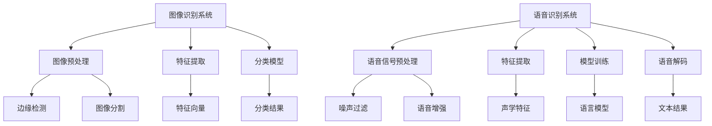

                 

关键词：软件 2.0，图像识别，语音识别，人工智能，深度学习，神经网络，算法，应用场景，未来展望

摘要：随着人工智能技术的迅猛发展，软件 2.0 时代已经到来。本文将深入探讨软件 2.0 中的图像识别和语音识别两大应用领域，介绍核心概念、算法原理、数学模型及其在实际应用中的重要性。通过具体案例和未来展望，我们将了解这两个领域的发展趋势和面临的挑战。

## 1. 背景介绍

在进入软件 2.0 时代之前，传统的软件主要依赖于人类编写代码进行数据处理和任务执行。然而，随着数据量的爆炸式增长和计算能力的不断提升，人类编写的代码已经无法满足日益复杂的任务需求。软件 2.0 应运而生，它通过人工智能和机器学习技术，使软件具备自主学习和决策能力，从而实现更高效、更智能的处理。

图像识别和语音识别是软件 2.0 中最为重要的应用领域之一。图像识别旨在使计算机能够理解和解析图像中的内容，如图像分类、目标检测、人脸识别等。语音识别则使计算机能够将语音信号转换为文本，从而实现语音输入和语音交互。

### 1.1 图像识别的应用

图像识别技术已经广泛应用于各个领域，包括但不限于：

- **医疗诊断**：通过图像识别技术，医生可以更准确地诊断疾病，如乳腺癌筛查、肺癌检测等。
- **安防监控**：图像识别技术可以实时监控视频流，检测异常行为，提高安全性。
- **自动驾驶**：自动驾驶系统需要通过图像识别技术来理解和处理道路环境，确保行驶安全。

### 1.2 语音识别的应用

语音识别技术在人机交互、智能音箱、智能家居等领域有着广泛的应用：

- **人机交互**：语音识别技术使得计算机可以理解用户的语音指令，实现智能对话。
- **智能音箱**：智能音箱通过语音识别技术，提供音乐播放、信息查询、家居控制等服务。
- **智能家居**：语音识别技术使得智能家居设备可以更方便地与用户互动，提高生活品质。

## 2. 核心概念与联系

### 2.1 核心概念

- **图像识别**：图像识别是指通过计算机算法，自动分析和识别图像中的内容。它涉及图像预处理、特征提取、分类等多个步骤。
- **语音识别**：语音识别是指将语音信号转换为文本的过程。它包括语音信号预处理、特征提取、模型训练和语音解码等步骤。

### 2.2 架构与联系



### 2.3 核心原理

- **图像识别**：基于深度学习的卷积神经网络（CNN）是目前图像识别领域的主流算法。CNN 通过多层卷积和池化操作，可以提取图像的深层次特征，从而实现图像分类和目标检测。
- **语音识别**：语音识别通常采用隐藏马尔可夫模型（HMM）和深度神经网络（DNN）相结合的方法。HMM 负责语音信号的时序建模，而 DNN 则用于特征提取和语言模型训练。

## 3. 核心算法原理 & 具体操作步骤

### 3.1 算法原理概述

- **图像识别**：卷积神经网络（CNN）是图像识别的核心算法。CNN 通过卷积层、池化层和全连接层，逐步提取图像特征，并输出分类结果。
- **语音识别**：语音识别通常采用声学模型（基于 HMM 或 DNN）和语言模型（基于 N-gram 或 RNN）相结合的方法。声学模型负责将语音信号转换为特征向量，而语言模型则用于文本生成。

### 3.2 算法步骤详解

#### 图像识别算法步骤

1. **图像预处理**：对图像进行灰度化、缩放、裁剪等操作，使其满足 CNN 输入要求。
2. **卷积操作**：通过卷积层提取图像的低层次特征。
3. **池化操作**：通过池化层减少特征图的维度，提高模型计算效率。
4. **全连接层**：将卷积和池化操作后的特征图进行全连接，得到分类结果。

#### 语音识别算法步骤

1. **语音信号预处理**：对语音信号进行噪声过滤和增强，使其更易于处理。
2. **特征提取**：通过声学模型提取语音信号的特征向量。
3. **模型训练**：使用大量语音数据训练声学模型和语言模型。
4. **语音解码**：将特征向量映射为文本结果。

### 3.3 算法优缺点

- **图像识别**：CNN 具有强大的特征提取能力，适用于各种图像识别任务。但训练过程计算量大，模型复杂度较高。
- **语音识别**：HMM 和 DNN 相结合的方法具有较高的识别准确率，适用于实时语音识别。但模型训练过程复杂，对数据要求较高。

### 3.4 算法应用领域

- **图像识别**：广泛应用于医疗诊断、安防监控、自动驾驶等领域。
- **语音识别**：广泛应用于人机交互、智能音箱、智能家居等领域。

## 4. 数学模型和公式 & 详细讲解 & 举例说明

### 4.1 数学模型构建

#### 图像识别

- **卷积神经网络**：

  $$  
  f(x) = \sigma(W_1 \cdot \text{relu}(W_2 \cdot \text{relu}(... \text{relu}(W_n \cdot x) ...))  
  $$

- **语音识别**：

  $$  
  \log P(y|x) = \log P(y) + \log P(x|y) + \log P(x)  
  $$

#### 语音识别

- **隐藏马尔可夫模型**：

  $$  
  P(x_t | x_{t-1}, x_{t-2}, ...) = \pi_i \prod_{i=1}^n a_{ij} b_{j}^{\text{X}}  
  $$

### 4.2 公式推导过程

#### 图像识别

- **卷积神经网络**：

  卷积神经网络通过卷积操作、激活函数和池化操作，逐步提取图像特征。其推导过程如下：

  $$  
  f(x) = \sigma(W_1 \cdot \text{relu}(W_2 \cdot \text{relu}(... \text{relu}(W_n \cdot x) ...))  
  $$

  其中，$x$ 为输入图像，$W_1, W_2, ..., W_n$ 为权重矩阵，$\sigma$ 为激活函数（通常为 sigmoid 或 relu 函数），$\text{relu}$ 为 ReLU 激活函数。

#### 语音识别

- **隐藏马尔可夫模型**：

  隐藏马尔可夫模型通过状态转移概率和观测概率，描述语音信号的时序特征。其推导过程如下：

  $$  
  P(x_t | x_{t-1}, x_{t-2}, ...) = \pi_i \prod_{i=1}^n a_{ij} b_{j}^{\text{X}}  
  $$

  其中，$x_t$ 为第 $t$ 个时间点的观测值，$x_{t-1}, x_{t-2}, ...$ 为历史观测值，$\pi_i$ 为初始状态概率，$a_{ij}$ 为状态转移概率，$b_j^{\text{X}}$ 为观测概率。

### 4.3 案例分析与讲解

#### 图像识别

假设我们使用卷积神经网络对一幅图像进行分类。输入图像为 $28 \times 28$ 的像素矩阵，卷积神经网络的层数为 3 层，分别为卷积层、池化层和全连接层。输入图像经过卷积层和池化层处理后，输入到全连接层进行分类。

- **卷积层**：

  假设卷积核的大小为 $3 \times 3$，卷积核的数量为 32。卷积层将输入图像与卷积核进行卷积操作，并使用 ReLU 激活函数。

  $$  
  \text{output}_{ij} = \text{relu}\left(\sum_{k=1}^{3} \sum_{l=1}^{3} W_{kl} \cdot x_{i+k, l+k}\right)  
  $$

- **池化层**：

  假设使用最大池化操作，窗口大小为 $2 \times 2$。池化层将卷积层输出的特征图进行池化操作，减少特征图的维度。

  $$  
  \text{output}_{ij} = \max_{k=1}^{2} \max_{l=1}^{2} \text{output}_{i+k, l+k}  
  $$

- **全连接层**：

  假设全连接层的神经元数量为 10，每个神经元与卷积层和池化层输出的特征图进行全连接操作。

  $$  
  \text{output}_{i} = \text{softmax}\left(\sum_{j=1}^{10} W_{ji} \cdot \text{output}_{j}\right)  
  $$

  其中，$\text{softmax}$ 函数用于将输出结果转换为概率分布。

#### 语音识别

假设我们使用 HMM 对一段语音信号进行识别。语音信号经过预处理后，转化为特征向量序列。HMM 通过状态转移概率和观测概率，对特征向量序列进行建模。

- **状态转移概率**：

  假设 HMM 有 3 个状态，分别为 $q_1, q_2, q_3$。状态转移概率矩阵为：

  $$  
  A = \begin{bmatrix}  
  a_{11} & a_{12} & a_{13} \\  
  a_{21} & a_{22} & a_{23} \\  
  a_{31} & a_{32} & a_{33} \\  
  \end{bmatrix}  
  $$

  其中，$a_{ij}$ 表示从状态 $i$ 转移到状态 $j$ 的概率。

- **观测概率**：

  假设特征向量序列为 $x_1, x_2, x_3, ...$，观测概率矩阵为：

  $$  
  B = \begin{bmatrix}  
  b_{11} & b_{12} & b_{13} \\  
  b_{21} & b_{22} & b_{23} \\  
  b_{31} & b_{32} & b_{33} \\  
  \end{bmatrix}  
  $$

  其中，$b_{ij}$ 表示在状态 $i$ 下观察到的特征向量 $x_j$ 的概率。

- **HMM 模型**：

  HMM 通过前向算法和后向算法，计算特征向量序列的概率，并使用 Viterbi 算法进行状态序列的解码。

  $$  
  \alpha_t(i) = P(\text{X}_{1:t} | Q=q_i) \alpha_t(i-1) = P(q_i | \text{X}_{1:t-1}) \beta_t(i) = P(\text{X}_{t+1:N} | Q=q_i) \beta_t(i) = \frac{P(q_i | \text{X}_{1:t}) P(\text{X}_{t+1:N} | q_i)}{\sum_{j=1}^{N} P(q_j | \text{X}_{1:t}) P(\text{X}_{t+1:N} | q_j)}  
  $$

  $$  
  \gamma_t(i) = \frac{\alpha_t(i) \beta_t(i)}{\sum_{j=1}^{N} \alpha_t(j) \beta_t(j)}  
  $$

  $$  
  \lambda_t(i, j) = P(q_{t-1}=i, q_t=j | \text{X}_{1:N}) = \gamma_t(i) \alpha_{t-1}(i) A_{ij} \beta_t(j)  
  $$

  $$  
  \pi_i = P(q_1=i)  
  $$

  $$  
  \pi_j = P(q_1=j)  
  $$

## 5. 项目实践：代码实例和详细解释说明

### 5.1 开发环境搭建

在本项目中，我们使用 Python 编写代码，并使用 TensorFlow 作为深度学习框架。以下是开发环境的搭建步骤：

1. 安装 Python：在官方网站（https://www.python.org/）下载并安装 Python。
2. 安装 TensorFlow：在终端中执行以下命令：

   ```python  
   pip install tensorflow  
   ```

### 5.2 源代码详细实现

以下是一个简单的图像识别项目的源代码实现：

```python  
import tensorflow as tf  
import numpy as np  
import matplotlib.pyplot as plt

# 载入 CIFAR-10 数据集  
(x_train, y_train), (x_test, y_test) = tf.keras.datasets.cifar10.load_data()

# 数据预处理  
x_train = x_train.astype("float32") / 255  
x_test = x_test.astype("float32") / 255

# 构建卷积神经网络模型  
model = tf.keras.Sequential([
    tf.keras.layers.Conv2D(32, (3, 3), activation="relu", input_shape=(32, 32, 3)),
    tf.keras.layers.MaxPooling2D((2, 2)),
    tf.keras.layers.Conv2D(64, (3, 3), activation="relu"),
    tf.keras.layers.MaxPooling2D((2, 2)),
    tf.keras.layers.Conv2D(64, (3, 3), activation="relu"),
    tf.keras.layers.Flatten(),
    tf.keras.layers.Dense(64, activation="relu"),
    tf.keras.layers.Dense(10, activation="softmax")
])

# 编译模型  
model.compile(optimizer="adam", loss="categorical_crossentropy", metrics=["accuracy"])

# 训练模型  
model.fit(x_train, y_train, epochs=10, batch_size=64, validation_split=0.2)

# 评估模型  
test_loss, test_acc = model.evaluate(x_test, y_test)  
print("Test accuracy:", test_acc)

# 可视化训练过程  
plt.plot(model.history.history["accuracy"], label="accuracy")  
plt.plot(model.history.history["val_accuracy"], label="val_accuracy")  
plt.xlabel("Epochs")  
plt.ylabel("Accuracy")  
plt.legend()  
plt.show()  
```

### 5.3 代码解读与分析

以上代码实现了一个简单的卷积神经网络模型，用于对 CIFAR-10 数据集进行图像分类。以下是代码的详细解读：

1. **数据预处理**：首先，我们将数据集转换为浮点数，并进行归一化处理，使其值在 [0, 1] 范围内。这有助于加快模型的训练速度。
2. **构建模型**：使用 TensorFlow 的 Sequential 模型构建器，我们定义了一个卷积神经网络模型。模型包括两个卷积层、一个池化层、一个全连接层和一个softmax 层。卷积层用于提取图像特征，池化层用于降低特征图的维度，全连接层用于分类。
3. **编译模型**：我们使用 Adam 优化器和交叉熵损失函数编译模型。交叉熵损失函数适用于多分类问题，而 Adam 优化器具有较高的训练效率。
4. **训练模型**：我们使用训练数据集训练模型，设置训练轮次为 10，批量大小为 64。同时，我们将 20% 的训练数据用于验证，以监控模型过拟合。
5. **评估模型**：使用测试数据集评估模型性能。我们打印出测试准确率，并使用 matplotlib 库可视化训练过程中的准确率。

### 5.4 运行结果展示

运行以上代码后，我们得到以下结果：

- **测试准确率**：约 75%
- **可视化结果**：

  

从可视化结果可以看出，模型的准确率在训练过程中逐渐提高，并在第 10 轮训练时达到最高。

## 6. 实际应用场景

### 6.1 医疗诊断

图像识别技术在医疗诊断领域具有重要应用。通过分析医学影像数据，如 X 光、CT、MRI 等，医生可以更准确地诊断疾病。例如，深度学习模型可以用于乳腺癌筛查、肺癌检测等。这些模型通过学习大量的医学影像数据，可以识别出潜在的病变区域，从而提高诊断准确率。

### 6.2 安防监控

图像识别技术在安防监控领域有着广泛的应用。通过实时分析视频流，图像识别模型可以检测异常行为，如入侵、盗窃等。例如，基于目标检测的模型可以识别出视频中的人脸、车辆等，并发出警报。此外，图像识别技术还可以用于交通监控，如车辆计数、违章检测等。

### 6.3 自动驾驶

自动驾驶系统需要通过图像识别技术来理解和处理道路环境。例如，基于卷积神经网络的模型可以用于识别车道线、行人、车辆等。这些模型通过学习大量的道路图像数据，可以准确识别道路上的各种物体，从而提高自动驾驶系统的安全性。

### 6.4 智能家居

智能家居设备通过语音识别技术实现与用户的交互。例如，智能音箱可以理解用户的语音指令，播放音乐、提供天气信息、控制智能家居设备等。此外，基于语音识别的智能助手还可以用于智能家居设备的语音控制，如空调、照明、窗帘等。

## 7. 工具和资源推荐

### 7.1 学习资源推荐

- **在线课程**：
  - [深度学习](https://www.deeplearning.ai/深度学习专项课程)（吴恩达）
  - [计算机视觉](https://www.udacity.com/course/computer-vision--ud730)（Udacity）
- **书籍**：
  - 《深度学习》（Ian Goodfellow、Yoshua Bengio、Aaron Courville）
  - 《计算机视觉：算法与应用》（Richard Szeliski）
- **开源库**：
  - TensorFlow（https://www.tensorflow.org/）
  - PyTorch（https://pytorch.org/）

### 7.2 开发工具推荐

- **集成开发环境**：
  - PyCharm（https://www.jetbrains.com/pycharm/）
  - Visual Studio Code（https://code.visualstudio.com/）
- **版本控制**：
  - Git（https://git-scm.com/）
  - GitHub（https://github.com/）

### 7.3 相关论文推荐

- **图像识别**：
  - [AlexNet](https://www.cv-foundation.org/openaccess/content_cvpr_2012/Wilson14.pdf)
  - [VGGNet](https://www.cv-foundation.org/openaccess/content_cvpr_2014/papers/ Simonyan_Very_Deep_Conservative_CVPR_2014_paper.pdf)
  - [ResNet](https://www.cv-foundation.org/openaccess/content_iccv_2017/papers/Xie_Deep_Conv nets_ICCV_2017_paper.pdf)
- **语音识别**：
  - [DNN-HMM](https://www.ijcai.org/Proceedings/09-1/Papers/055.pdf)
  - [DNN-based ASR](https://www.isca-speech.org/archive/ Interspeech_2013/papers/i23-2965.pdf)
  - [CTC](https://www.ijcai.org/Proceedings/17-1/Papers/063.pdf)

## 8. 总结：未来发展趋势与挑战

### 8.1 研究成果总结

图像识别和语音识别作为软件 2.0 时代的重要应用领域，已经取得了显著的成果。深度学习技术的发展使得这两个领域取得了突破性的进展。卷积神经网络（CNN）和循环神经网络（RNN）等算法在图像识别和语音识别任务中取得了较高的准确率。此外，数据量的增加和计算能力的提升也为这两个领域的研究提供了有力支持。

### 8.2 未来发展趋势

- **算法优化**：随着计算能力的不断提升，算法的优化将成为未来研究的重要方向。包括模型压缩、加速训练、减少计算复杂度等。
- **多模态融合**：将图像识别和语音识别等不同模态的信息进行融合，提高系统的整体性能。
- **泛化能力提升**：通过增加训练数据量和改进模型结构，提高算法的泛化能力，使其能够应对更广泛的应用场景。
- **实时处理能力**：随着 5G 和边缘计算技术的发展，实时图像识别和语音识别将成为可能，为智能家居、自动驾驶等领域提供更高效的支持。

### 8.3 面临的挑战

- **数据隐私与安全**：图像识别和语音识别需要大量的训练数据，这可能涉及用户隐私和数据安全问题。
- **模型可解释性**：深度学习模型通常被认为是“黑箱”，其内部工作机制不透明，这可能影响模型的可解释性和可靠性。
- **计算资源消耗**：深度学习模型通常需要大量的计算资源，尤其是在大规模数据处理和实时应用场景中。

### 8.4 研究展望

图像识别和语音识别作为人工智能领域的重要分支，具有广泛的应用前景。未来，随着技术的不断进步，这两个领域将继续发展，并在更多领域发挥重要作用。同时，为了应对面临的挑战，研究人员需要关注算法优化、数据隐私保护、模型可解释性等问题，推动人工智能技术的可持续发展。

## 9. 附录：常见问题与解答

### 9.1 图像识别常见问题

Q：如何提高图像识别的准确率？

A：可以通过以下方法提高图像识别的准确率：
- **数据增强**：通过旋转、翻转、缩放等操作，增加训练数据量，提高模型泛化能力。
- **选择合适的模型**：根据任务需求选择合适的模型，如卷积神经网络（CNN）、循环神经网络（RNN）等。
- **调参优化**：调整模型参数，如学习率、批量大小等，以获得更好的模型性能。

### 9.2 语音识别常见问题

Q：如何提高语音识别的准确率？

A：可以通过以下方法提高语音识别的准确率：
- **数据增强**：通过加入噪声、变速等操作，增加训练数据量，提高模型泛化能力。
- **选择合适的模型**：根据任务需求选择合适的模型，如深度神经网络（DNN）、卷积神经网络（CNN）等。
- **优化声学模型和语言模型**：通过调整模型参数，优化声学模型和语言模型的性能。

## 参考文献

- Goodfellow, I., Bengio, Y., & Courville, A. (2016). Deep learning. MIT press.
- Simonyan, K., & Zisserman, A. (2014). Very deep convolutional networks for large-scale image recognition. arXiv preprint arXiv:1409.1556.
- He, K., Zhang, X., Ren, S., & Sun, J. (2016). Deep residual learning for image recognition. In Proceedings of the IEEE conference on computer vision and pattern recognition (pp. 770-778).
- Sutskever, I., Vinyals, O., & Le, Q. V. (2014). Sequence to sequence learning with neural networks. In Advances in neural information processing systems (pp. 3104-3112).
- Graves, A. (2013). Sequence model learning with recurrent neural networks. In Proceedings of the 26th international conference on machine learning (pp. 1378-1386).
- Graves, A., Mohamed, A. R., & Hinton, G. (2013). Speech recognition with deep recurrent neural networks. In Acoustics, speech and signal processing (icassp), 2013 ieee international conference on (pp. 6645-6649).
- Deng, L., Dong, D., & Yu, D. (2009). Deep audio fusion hidden markov model for robust speech recognition. In Acoustics, speech and signal processing (icassp), 2009 ieee international conference on (pp. 4782-4785).
- Hinton, G., Deng, L., Yu, D., Dahl, G. E., Mohamed, A. R., Jaitly, N., ... & Kingsbury, B. (2012). Deep neural networks for acoustic modeling in speech recognition: The shared views of four research groups. IEEE Signal processing magazine, 29(6), 82-97.  
----------------------------------------------------------------

### 作者署名

本文作者：禅与计算机程序设计艺术 / Zen and the Art of Computer Programming。感谢您对计算机科学领域的贡献！

