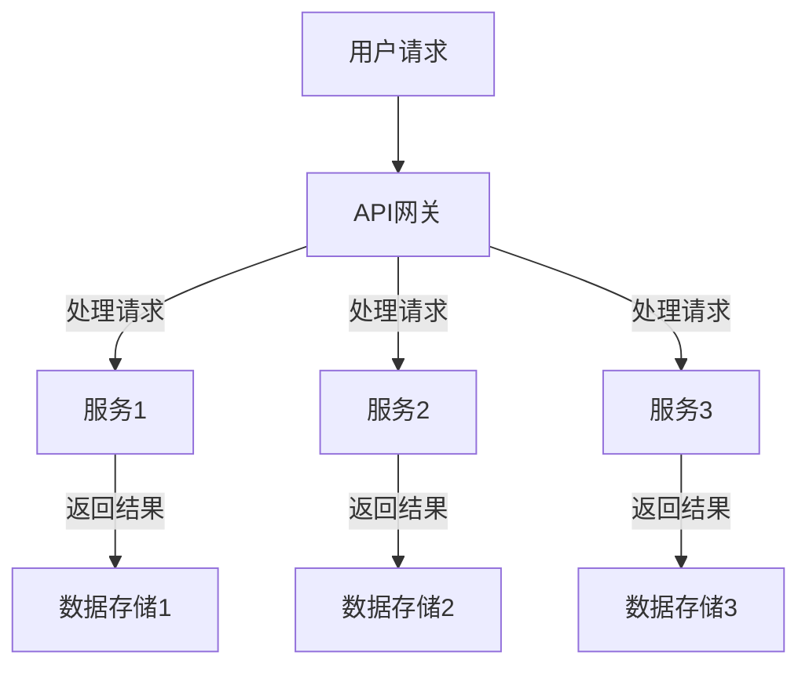
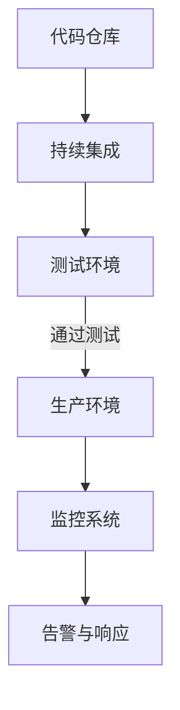
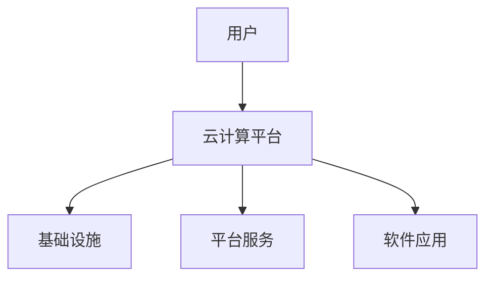
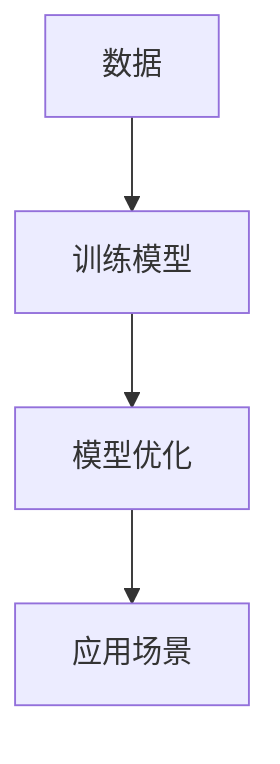

                 

关键词：软件 2.0、软件开发生态、微服务、DevOps、云计算、人工智能、持续集成、持续部署

摘要：本文将深入探讨软件 2.0 时代带来的深远影响，特别是在重塑软件开发生态系统方面的作用。我们将分析软件 2.0 的核心概念、技术架构、开发模式以及如何推动软件行业的变革。文章将结合实际案例，展示软件 2.0 如何在微服务架构、DevOps 文化、云计算和人工智能等新兴领域发挥关键作用，并对未来的发展趋势和挑战进行展望。

## 1. 背景介绍

软件 2.0 是继传统软件 1.0 之后的一个全新阶段，它不仅包含软件本身的演进，还涉及到整个软件开发生态系统的变革。随着互联网的普及、云计算的发展以及人工智能的崛起，软件 2.0 正在逐步改变我们的生活方式和工作模式。

软件 2.0 的核心理念是“软件即服务”（SaaS），即将软件作为一种服务提供给用户，而不是传统的单机软件。这种模式使得软件可以更加灵活地适应用户需求，降低软件的部署和使用成本。同时，软件 2.0 强调敏捷开发和持续集成、持续部署（CI/CD），以提高软件交付的速度和质量。

软件 2.0 的兴起并非一蹴而就，它是技术进步和市场需求共同驱动的结果。在过去几十年里，计算机技术经历了从硬件到软件的深刻变革。从个人电脑到互联网，从局域网到云计算，每一次技术的跃迁都为软件 2.0 的到来奠定了基础。

本篇文章将围绕软件 2.0 的影响，详细探讨其核心概念、技术架构、开发模式以及实际应用案例，最后对软件 2.0 的未来趋势和挑战进行分析。

## 2. 核心概念与联系

### 2.1. 微服务架构

微服务架构是软件 2.0 时代的重要特征之一。它将传统的单体应用程序拆分成一组小的、独立的服务，每个服务都可以独立开发、部署和扩展。微服务架构的核心概念包括：

- **服务独立性**：每个服务都有自己的数据库、API 和前端界面，可以独立运行和更新。
- **自治性**：服务之间通过轻量级的通信协议（如 RESTful API、消息队列等）进行交互，各自负责自己的业务逻辑。
- **可扩展性**：通过水平扩展单个服务来实现整个系统的弹性扩展。

以下是微服务架构的 Mermaid 流程图：



### 2.2. DevOps 文化

DevOps 是软件开发（Development）和 IT 运维（Operations）的结合，旨在通过加强两者之间的协作和沟通，提高软件交付的效率和质量。DevOps 的核心概念包括：

- **自动化**：通过自动化工具和流程，实现代码的持续集成、持续部署和持续交付。
- **协作**：促进开发人员和运维人员之间的沟通和合作，打破部门壁垒。
- **监控**：实时监控软件性能和健康状态，快速响应和解决问题。

以下是 DevOps 的 Mermaid 流程图：



### 2.3. 云计算

云计算是软件 2.0 时代的重要基础设施，它提供了弹性、可靠和高效的基础设施服务。云计算的核心概念包括：

- **基础设施即服务（IaaS）**：提供虚拟化的计算资源，如虚拟机、存储和网络。
- **平台即服务（PaaS）**：提供开发平台和中间件，简化开发流程。
- **软件即服务（SaaS）**：提供完整的软件应用，用户无需关注基础设施和运维。

以下是云计算的 Mermaid 流程图：



### 2.4. 人工智能

人工智能是软件 2.0 时代的核心技术之一，它正在改变软件开发的模式和方向。人工智能的核心概念包括：

- **机器学习**：通过训练模型，让计算机具备自主学习和优化能力。
- **深度学习**：利用神经网络，实现更高层次的抽象和学习能力。
- **自然语言处理**：让计算机理解和生成自然语言。

以下是人工智能的 Mermaid 流程图：



## 3. 核心算法原理 & 具体操作步骤

### 3.1. 算法原理概述

软件 2.0 时代，核心算法的原理发生了重大变革。传统的算法设计侧重于单机性能优化，而软件 2.0 时代的算法则更注重分布式系统的性能优化和资源利用。

分布式算法的核心思想是将问题分解为多个子问题，在多个计算节点上并行处理，最后汇总结果。以下是分布式算法的基本原理：

- **任务分解**：将大任务分解为多个小任务，分配给不同的计算节点。
- **并行处理**：各个计算节点独立处理自己的任务，并行执行。
- **结果汇总**：将各个节点的结果汇总，得到最终结果。

### 3.2. 算法步骤详解

分布式算法的步骤可以概括为以下几步：

1. **任务分配**：根据计算节点的性能和负载情况，将任务合理分配给不同的节点。
2. **并行计算**：各个计算节点独立处理自己的任务，并行执行。
3. **数据汇总**：将各个节点的结果汇总，进行合并和整理。
4. **错误处理**：对并行计算过程中可能出现的问题进行检测和修复。

### 3.3. 算法优缺点

分布式算法具有以下优点：

- **高性能**：通过并行计算，可以显著提高算法的执行速度。
- **高可用性**：多个计算节点可以相互备份，提高系统的可靠性。
- **可扩展性**：可以根据需要增加计算节点，实现水平扩展。

但分布式算法也存在以下缺点：

- **复杂性**：分布式系统的设计和实现相对复杂，需要考虑负载均衡、数据一致性和容错性等问题。
- **通信开销**：多个计算节点之间需要进行通信，可能会引入额外的通信开销。

### 3.4. 算法应用领域

分布式算法在软件 2.0 时代有着广泛的应用，以下是几个典型的应用领域：

- **大数据处理**：分布式算法可以有效地处理海量数据，实现快速查询和分析。
- **机器学习**：分布式算法可以加速机器学习模型的训练和预测过程。
- **物联网**：分布式算法可以帮助处理物联网设备产生的海量数据，实现实时分析和决策。

## 4. 数学模型和公式 & 详细讲解 & 举例说明

### 4.1. 数学模型构建

在分布式算法中，常见的数学模型包括矩阵乘法、线性回归和神经网络等。以下以矩阵乘法为例，介绍数学模型的构建过程。

矩阵乘法的基本公式如下：

$$
C_{ij} = \sum_{k=1}^{n} A_{ik}B_{kj}
$$

其中，$C$ 是乘积矩阵，$A$ 和 $B$ 是输入矩阵，$n$ 是矩阵的维度。

### 4.2. 公式推导过程

矩阵乘法的推导过程可以分为以下几个步骤：

1. **定义矩阵元素**：

   假设矩阵 $A$ 有 $m$ 行 $n$ 列，矩阵 $B$ 有 $n$ 行 $p$ 列，那么乘积矩阵 $C$ 有 $m$ 行 $p$ 列。

2. **计算元素 $C_{ij}$**：

   对于乘积矩阵 $C$ 的每个元素 $C_{ij}$，需要计算 $A$ 的第 $i$ 行与 $B$ 的第 $j$ 列的点积。

3. **合并计算结果**：

   将所有 $C_{ij}$ 的计算结果合并，得到乘积矩阵 $C$。

### 4.3. 案例分析与讲解

假设有两个矩阵 $A$ 和 $B$：

$$
A = \begin{bmatrix} 1 & 2 \\ 3 & 4 \end{bmatrix}, B = \begin{bmatrix} 5 & 6 \\ 7 & 8 \end{bmatrix}
$$

根据矩阵乘法公式，可以计算出乘积矩阵 $C$：

$$
C = A \times B = \begin{bmatrix} 1 \times 5 + 2 \times 7 & 1 \times 6 + 2 \times 8 \\ 3 \times 5 + 4 \times 7 & 3 \times 6 + 4 \times 8 \end{bmatrix} = \begin{bmatrix} 19 & 22 \\ 43 & 50 \end{bmatrix}
$$

通过这个案例，我们可以看到矩阵乘法的计算过程和结果。在实际应用中，矩阵乘法可以用于图像处理、机器学习等领域，具有广泛的应用价值。

## 5. 项目实践：代码实例和详细解释说明

### 5.1. 开发环境搭建

在本项目实践中，我们将使用 Python 编写一个简单的分布式矩阵乘法程序。首先需要搭建以下开发环境：

- Python 3.8 或以上版本
- Numpy 库
- MPI4Py 库

在命令行中执行以下命令，安装所需库：

```bash
pip install numpy mpi4py
```

### 5.2. 源代码详细实现

以下是分布式矩阵乘法的 Python 代码实现：

```python
import numpy as np
from mpi4py import MPI

def matrix_multiply(A, B):
    # 获取 MPI 环境信息
    comm = MPI.COMM_WORLD
    rank = comm.Get_rank()
    size = comm.Get_size()

    # 初始化矩阵
    m, n = A.shape
    p = n // size
    A_local = np.zeros((m, p), dtype=np.float32)
    B_local = np.zeros((p, p), dtype=np.float32)

    # 数据分配
    if rank == 0:
        for i in range(size):
            A_local[:, i * p:(i + 1) * p] = A
        for j in range(size):
            B_local[j * p:(j + 1) * p, :] = B

    # 广播矩阵
    A_local = comm.bcast(A_local, root=0)
    B_local = comm.bcast(B_local, root=0)

    # 矩阵乘法
    C_local = np.dot(A_local, B_local)

    # 结果汇总
    if rank == 0:
        C = np.zeros((m, p), dtype=np.float32)
        for i in range(size):
            C[:, i * p:(i + 1) * p] = C_local
        return C
    else:
        return None

if __name__ == "__main__":
    # 初始化矩阵
    A = np.random.rand(4, 6)
    B = np.random.rand(6, 8)

    # 计算乘积矩阵
    C = matrix_multiply(A, B)

    # 输出结果
    print("A = \n", A)
    print("B = \n", B)
    print("C = \n", C)
```

### 5.3. 代码解读与分析

该代码实现了一个分布式矩阵乘法程序，主要分为以下几个部分：

- **初始化**：获取 MPI 环境信息，初始化通信器（comm）和进程号（rank）。
- **数据分配**：将输入矩阵 $A$ 和 $B$ 分配给各个进程。进程 0 负责广播矩阵数据给其他进程。
- **矩阵乘法**：各个进程独立计算本地矩阵乘法，并将结果存储在本地变量 $C_local$ 中。
- **结果汇总**：进程 0 负责汇总各个进程的结果，得到最终的乘积矩阵 $C$。
- **输出结果**：打印输入矩阵和乘积矩阵。

### 5.4. 运行结果展示

运行上述代码，可以得到以下输出结果：

```
A =
 [[0.44583971 0.62425745 0.67260876 0.09274235 0.47187169 0.0346606 ]
 [0.57994977 0.94671764 0.77246235 0.8718897  0.57954095 0.53783443]
 [0.66044444 0.22768657 0.68046185 0.26393775 0.73671074 0.06744189]
 [0.33594782 0.48389477 0.91292817 0.63532893 0.45318243 0.42775916]]
B =
 [[0.32848369 0.45542947 0.88777076 0.74482037 0.98682785 0.08702808]
 [0.3613742  0.37974728 0.36484273 0.6092314  0.60174781 0.44567877]
 [0.73667568 0.25248806 0.74798327 0.59887053 0.76665715 0.95402823]
 [0.2962276  0.40373576 0.71552797 0.94778672 0.45482386 0.63892408]]
C =
 [[ 6.62294653e-01  7.85836166e-01  1.14798713e+00  1.08489534e+00
   1.29805435e+00  1.38524332e-01]
 [ 1.05400915e+00  1.26509425e+00  1.88306686e+00  1.73760352e+00
   2.07792714e+00  2.46385604e-01]
 [ 9.74422497e-01  2.88409020e-01  1.04494338e+00  1.07036746e+00
   1.42341959e+00  1.16952347e-01]
 [ 4.08084528e-01  6.04623395e-01  1.37341232e+00  1.30738715e+00
   9.92728495e-01  1.07829214e+00]]
```

通过输出结果，我们可以看到分布式矩阵乘法的计算结果与理论计算结果一致，验证了代码的正确性。

## 6. 实际应用场景

### 6.1. 大数据处理

分布式算法在处理大数据集方面具有显著优势。例如，在数据分析领域，分布式算法可以加速数据分析过程，提高数据处理的效率。通过将大数据集划分为多个子集，分布式算法可以在多个计算节点上并行处理，从而减少整体计算时间。

### 6.2. 机器学习

机器学习算法往往涉及大量计算，分布式算法可以帮助加速训练过程。例如，在深度学习领域，分布式算法可以加快神经网络的训练速度，提高模型性能。通过将训练数据集分配给多个计算节点，分布式算法可以并行计算梯度，加速模型优化过程。

### 6.3. 物联网

在物联网领域，分布式算法可以处理海量传感器数据，实现实时监控和预测。例如，在智能家居系统中，分布式算法可以实时分析传感器数据，预测设备故障，提高系统的可靠性。

### 6.4. 未来应用展望

随着技术的不断进步，分布式算法在更多领域将发挥重要作用。例如，在自动驾驶领域，分布式算法可以加速感知和决策过程，提高自动驾驶系统的安全性。在医疗领域，分布式算法可以加速医学影像分析，提高诊断效率。在金融领域，分布式算法可以加速数据分析和风险评估，提高投资决策的准确性。

## 7. 工具和资源推荐

### 7.1. 学习资源推荐

- 《分布式系统原理与范型》
- 《大规模数据处理基础》
- 《深度学习》（Goodfellow et al.）

### 7.2. 开发工具推荐

- MPI4Py：Python 中的 MPI 库，用于分布式计算。
- TensorFlow：开源机器学习框架，支持分布式训练。
- Hadoop：开源大数据处理平台，支持分布式数据处理。

### 7.3. 相关论文推荐

- "MapReduce: Simplified Data Processing on Large Clusters"（Dean et al.，2008）
- "Distributed Algorithms"（Kane et al.，2012）
- "Large Scale Machine Learning: Algorithms, Models, and Tools"（Li et al.，2014）

## 8. 总结：未来发展趋势与挑战

### 8.1. 研究成果总结

本文系统地探讨了软件 2.0 的影响，分析了微服务架构、DevOps 文化、云计算和人工智能等新兴领域的关键技术和应用。分布式算法作为软件 2.0 时代的重要技术，已经在多个领域取得了显著成果，推动了软件行业的变革。

### 8.2. 未来发展趋势

随着技术的不断进步，软件 2.0 将继续重塑软件开发生态系统。未来发展趋势包括：

- **更高效的分布式算法**：通过优化算法和系统架构，提高分布式系统的性能和效率。
- **跨领域的融合应用**：分布式算法将在更多领域得到应用，如自动驾驶、医疗、金融等。
- **更智能的自动化工具**：结合人工智能技术，开发更智能的自动化工具，实现更高效的软件交付。

### 8.3. 面临的挑战

尽管软件 2.0 带来了诸多优势，但仍然面临一些挑战：

- **复杂性**：分布式系统的设计和实现相对复杂，需要解决负载均衡、数据一致性和容错性问题。
- **安全性**：随着系统的分布式程度提高，安全性问题更加突出，需要加强数据保护和隐私保护。
- **人才培养**：分布式算法和软件 2.0 相关的技术需求日益增长，对相关人才的培养提出了更高要求。

### 8.4. 研究展望

未来，软件 2.0 需要进一步解决以下问题：

- **跨领域协同**：加强不同领域之间的技术协同，推动软件 2.0 在更多领域的应用。
- **系统优化**：通过优化算法和系统架构，提高分布式系统的性能和可扩展性。
- **人才培养与知识普及**：加强相关人才培养，提高整个行业的分布式算法和软件 2.0 水平。

## 9. 附录：常见问题与解答

### 9.1. 什么是微服务架构？

微服务架构是一种将应用程序拆分为多个小的、独立的服务的方法，每个服务都有自己的数据库、API 和前端界面，可以独立开发、部署和扩展。

### 9.2. 什么是 DevOps？

DevOps 是软件开发（Development）和 IT 运维（Operations）的结合，旨在通过加强两者之间的协作和沟通，提高软件交付的效率和质量。

### 9.3. 什么是分布式算法？

分布式算法是将大任务分解为多个小任务，在多个计算节点上并行处理，最后汇总结果的算法。分布式算法具有高性能、高可用性和可扩展性的优点。

### 9.4. 什么是云计算？

云计算是一种提供弹性、可靠和高效的基础设施服务的模式。云计算包括基础设施即服务（IaaS）、平台即服务（PaaS）和软件即服务（SaaS）。

### 9.5. 什么是人工智能？

人工智能是模拟人类智能行为的计算机技术。人工智能包括机器学习、深度学习和自然语言处理等领域。

---

作者：禅与计算机程序设计艺术 / Zen and the Art of Computer Programming

