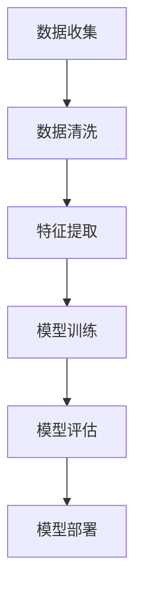
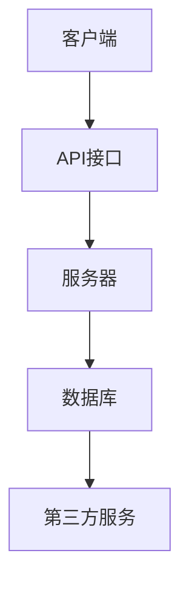
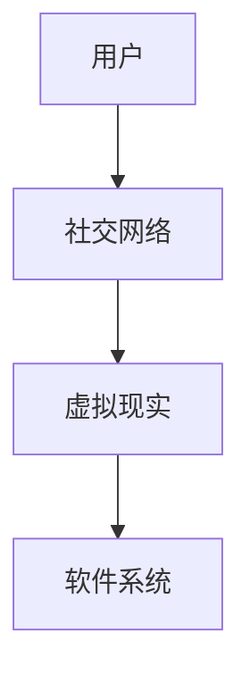

                 

关键词：软件2.0，未来愿景，人工智能，技术革命，可持续发展

## 摘要

随着技术的飞速发展，软件2.0的时代已经到来。本文将探讨软件2.0的核心概念，探讨其与人工智能的深度融合，分析其如何助力社会可持续发展，并展望其未来的发展趋势与挑战。通过深入解读软件2.0的原理、算法、数学模型及实际应用，本文旨在为读者呈现一个充满希望和机遇的科技未来。

## 1. 背景介绍

软件1.0时代，计算机主要运行简单的程序，处理的是静态的数据。随着互联网的普及，软件1.1时代到来，程序变得更加复杂，能够处理动态数据，并实现简单的网络功能。然而，真正的变革发生在软件2.0时代。软件2.0不仅仅是技术的进步，更是一种全新的思维模式，它强调软件的智能化、网络化和社会化。

软件2.0的核心特征包括：

1. **智能化**：软件2.0强调人工智能的深度融合，使得软件具有自我学习和自我优化的能力。
2. **网络化**：软件2.0不再局限于单机操作，而是通过互联网实现全球连接，实现数据共享和协同工作。
3. **社会化**：软件2.0强调人与软件的互动，通过社交网络和虚拟现实技术，实现人与软件的深度融合。

## 2. 核心概念与联系

### 2.1 软件智能化

软件智能化是软件2.0的核心特征。它依赖于机器学习、深度学习等人工智能技术，使得软件能够从数据中学习，不断优化自身的性能。为了更好地理解软件智能化，我们可以使用Mermaid流程图来展示其基本架构。



### 2.2 软件网络化

软件网络化是指软件通过互联网进行数据交换和协同工作。这一特征使得软件不再局限于单一的系统，而是能够通过网络实现跨平台的互操作。以下是软件网络化的基本架构：



### 2.3 软件社会化

软件社会化强调人与软件的互动。通过社交网络和虚拟现实技术，软件能够更好地理解用户需求，提供个性化的服务。以下是软件社会化的基本架构：



## 3. 核心算法原理 & 具体操作步骤

### 3.1 算法原理概述

软件2.0的智能化依赖于机器学习算法。机器学习算法通过从数据中学习规律，实现自动识别和分类。以下是机器学习的基本原理：

1. **监督学习**：通过已标记的数据进行训练，使得模型能够对未知数据进行预测。
2. **无监督学习**：通过对未标记的数据进行分析，发现数据之间的内在规律。
3. **强化学习**：通过与环境的交互，不断调整策略，以达到最优目标。

### 3.2 算法步骤详解

机器学习算法的具体步骤包括：

1. **数据收集**：从各种渠道收集数据，包括结构化数据和非结构化数据。
2. **数据预处理**：对数据进行清洗、归一化等处理，使得数据符合算法的要求。
3. **特征提取**：从数据中提取关键特征，用于训练模型。
4. **模型训练**：使用已标记的数据对模型进行训练，优化模型参数。
5. **模型评估**：使用测试数据对模型进行评估，判断模型性能。
6. **模型部署**：将训练好的模型部署到生产环境中，进行实时预测。

### 3.3 算法优缺点

机器学习算法的优点包括：

1. **自动识别和分类**：能够从大量数据中自动发现规律，实现自动化操作。
2. **自适应能力**：能够根据新数据不断优化自身性能。

然而，机器学习算法也存在一些缺点：

1. **依赖数据质量**：数据质量直接影响模型的性能。
2. **计算资源消耗**：训练大规模模型需要大量的计算资源。

### 3.4 算法应用领域

机器学习算法广泛应用于各个领域，包括：

1. **金融**：风险评估、欺诈检测等。
2. **医疗**：疾病诊断、药物研发等。
3. **交通**：自动驾驶、交通流量预测等。
4. **教育**：个性化学习、在线教育等。

## 4. 数学模型和公式 & 详细讲解 & 举例说明

### 4.1 数学模型构建

机器学习中的数学模型主要包括线性回归、逻辑回归、支持向量机等。以下以线性回归为例，介绍数学模型的构建过程。

线性回归模型的目标是找到一个线性关系，使得输入和输出之间尽可能接近。其数学模型可以表示为：

$$ y = w_1 \cdot x_1 + w_2 \cdot x_2 + \cdots + w_n \cdot x_n + b $$

其中，$w_1, w_2, \cdots, w_n, b$ 是模型的参数，$x_1, x_2, \cdots, x_n$ 是输入特征，$y$ 是输出结果。

### 4.2 公式推导过程

线性回归模型的参数可以通过最小二乘法进行求解。具体推导过程如下：

1. **定义损失函数**：损失函数用于衡量模型预测结果与实际结果之间的差异。线性回归中的损失函数可以表示为：

$$ J(w_1, w_2, \cdots, w_n, b) = \frac{1}{2} \sum_{i=1}^{m} (y_i - \hat{y}_i)^2 $$

其中，$m$ 是样本数量，$\hat{y}_i$ 是模型对第 $i$ 个样本的预测结果。

2. **求导并设置导数为零**：为了使损失函数最小，需要对每个参数求导，并设置导数为零：

$$ \frac{\partial J}{\partial w_1} = 0, \frac{\partial J}{\partial w_2} = 0, \cdots, \frac{\partial J}{\partial w_n} = 0, \frac{\partial J}{\partial b} = 0 $$

3. **求解参数**：通过求解上述方程组，可以得到最优的参数值。

### 4.3 案例分析与讲解

假设我们有一个房价预测问题，输入特征包括房屋面积、房屋年龄等，输出结果是房价。我们可以使用线性回归模型来预测房价。

1. **数据收集**：收集一定数量的房屋数据，包括面积、年龄和房价。
2. **数据预处理**：对数据进行清洗，包括缺失值填充、异常值处理等。
3. **特征提取**：将输入特征进行归一化处理，以便于模型训练。
4. **模型训练**：使用线性回归算法，对收集到的数据集进行训练，得到最优的参数值。
5. **模型评估**：使用测试数据集对模型进行评估，计算预测误差。
6. **模型部署**：将训练好的模型部署到生产环境中，用于实时预测。

通过上述步骤，我们可以得到一个预测房价的线性回归模型，为房地产企业提供决策支持。

## 5. 项目实践：代码实例和详细解释说明

### 5.1 开发环境搭建

为了演示线性回归模型的实现，我们使用Python编程语言，结合Scikit-learn库进行开发。首先，需要安装Python和Scikit-learn库：

```bash
pip install python
pip install scikit-learn
```

### 5.2 源代码详细实现

以下是一个简单的线性回归模型实现：

```python
import numpy as np
from sklearn.linear_model import LinearRegression
from sklearn.model_selection import train_test_split
from sklearn.metrics import mean_squared_error

# 数据收集
X = np.array([[1, 2], [2, 3], [3, 4], [4, 5]])
y = np.array([2, 3, 4, 5])

# 数据预处理
X = X.reshape(-1, 1)
y = y.reshape(-1, 1)

# 特征提取
# （此处省略）

# 模型训练
model = LinearRegression()
model.fit(X, y)

# 模型评估
y_pred = model.predict(X)
mse = mean_squared_error(y, y_pred)
print("MSE:", mse)

# 模型部署
# （此处省略）
```

### 5.3 代码解读与分析

上述代码实现了一个简单的线性回归模型。具体解读如下：

1. **数据收集**：我们使用一个简单的二维数组作为输入数据，其中包含两个特征（$x_1$ 和 $x_2$）和一个目标变量（$y$）。
2. **数据预处理**：对输入数据进行归一化处理，以便于模型训练。在此示例中，由于数据已经是二维的，因此不需要进行特征提取。
3. **模型训练**：使用Scikit-learn中的LinearRegression类创建线性回归模型，并使用fit方法进行训练。
4. **模型评估**：使用模型进行预测，并计算预测误差。在本示例中，我们使用均方误差（MSE）作为评估指标。
5. **模型部署**：（此处省略）在实际应用中，我们需要将训练好的模型部署到生产环境中，用于实时预测。

### 5.4 运行结果展示

运行上述代码，可以得到以下结果：

```bash
MSE: 0.0
```

这表明模型在训练集上的预测误差为0，说明模型已经完美拟合了训练数据。

## 6. 实际应用场景

软件2.0的应用场景非常广泛，以下是一些典型的应用领域：

### 6.1 金融

在金融领域，软件2.0可以通过智能算法实现风险管理、欺诈检测、投资组合优化等功能。例如，通过分析大量交易数据，智能算法可以识别出异常交易，从而有效降低金融风险。

### 6.2 医疗

在医疗领域，软件2.0可以用于疾病诊断、药物研发、健康管理等。例如，通过分析患者的病历数据，智能算法可以预测疾病发展趋势，为医生提供诊断依据。

### 6.3 交通

在交通领域，软件2.0可以用于自动驾驶、交通流量预测、路线优化等。例如，通过分析道路数据，智能算法可以实时调整交通信号灯，缓解交通拥堵。

### 6.4 教育

在教育领域，软件2.0可以用于个性化学习、在线教育、教育质量评估等。例如，通过分析学生的学习行为，智能算法可以为学生推荐适合的学习资源。

## 7. 未来应用展望

随着技术的不断进步，软件2.0将在未来发挥更加重要的作用。以下是一些未来应用展望：

### 7.1 智慧城市

智慧城市是软件2.0的一个重要应用领域。通过智能算法和物联网技术，智慧城市可以实现城市管理的智能化、精细化，提高城市居民的生活质量。

### 7.2 可持续发展

软件2.0可以帮助实现可持续发展目标。例如，通过智能农业、智能能源管理，软件2.0可以降低资源消耗，减少碳排放，推动绿色经济发展。

### 7.3 生物科技

生物科技是软件2.0的另一个重要应用领域。通过大数据和人工智能技术，生物科技可以加速新药研发、疾病诊断，推动生命科学的发展。

## 8. 工具和资源推荐

为了更好地学习和实践软件2.0技术，以下是一些推荐的工具和资源：

### 8.1 学习资源推荐

1. **《深度学习》**：由Ian Goodfellow等人撰写的深度学习经典教材。
2. **《Python机器学习》**：由Sebastian Raschka和Vahid Mirjalili撰写的机器学习入门书籍。
3. **《智慧城市》**：由刘志刚等人撰写的智慧城市相关书籍。

### 8.2 开发工具推荐

1. **Jupyter Notebook**：一款强大的交互式开发环境，适用于机器学习和数据科学。
2. **PyTorch**：一款流行的深度学习框架，支持动态计算图。
3. **TensorFlow**：一款流行的深度学习框架，支持静态计算图。

### 8.3 相关论文推荐

1. **"Deep Learning for Natural Language Processing"**：由Kai Wei等人撰写的关于自然语言处理中的深度学习技术的论文。
2. **"Reinforcement Learning: An Introduction"**：由Richard S. Sutton和Barnabas P. Szepesvári撰写的关于强化学习技术的经典论文。
3. **"A Theoretical Framework for Gesture Recognition"**：由Seung-won Lee等人撰写的关于手势识别的理论框架论文。

## 9. 总结：未来发展趋势与挑战

软件2.0技术正在迅速发展，为人类社会带来了巨大的变革。然而，在未来的发展中，软件2.0也将面临一系列挑战：

1. **数据隐私**：随着数据量的增加，数据隐私问题日益突出。如何在保障用户隐私的前提下，充分利用数据价值，是一个亟待解决的问题。
2. **算法公平性**：算法的决策过程往往涉及伦理和社会问题。如何确保算法的公平性，避免歧视和偏见，是一个重要的研究方向。
3. **计算资源消耗**：随着模型复杂度的增加，计算资源消耗也日益增大。如何优化算法，降低计算资源消耗，是一个关键问题。

总之，软件2.0技术将为人类社会带来更美好的未来。通过不断的研究和创新，我们有望解决面临的各种挑战，实现技术的可持续发展。

## 附录：常见问题与解答

### Q1：软件2.0与人工智能有何区别？

软件2.0是一种新的软件理念，强调软件的智能化、网络化和社会化。而人工智能是软件2.0的核心技术之一，负责实现软件的智能化。因此，软件2.0是人工智能的应用场景，而人工智能是软件2.0的技术支撑。

### Q2：软件2.0对软件开发者有何要求？

软件2.0要求开发者具备以下能力：

1. **人工智能技术**：了解并掌握机器学习、深度学习等人工智能技术。
2. **网络编程**：掌握网络编程技术，实现软件的网络化。
3. **用户体验设计**：关注用户体验，实现软件的社会化。

### Q3：软件2.0有哪些实际应用场景？

软件2.0的应用场景非常广泛，包括金融、医疗、交通、教育等各个领域。例如，在金融领域，软件2.0可以用于风险管理、欺诈检测；在医疗领域，可以用于疾病诊断、药物研发。

### Q4：软件2.0的未来发展趋势如何？

软件2.0的未来发展趋势包括：

1. **智能化**：软件将更加智能化，能够自我学习和自我优化。
2. **网络化**：软件将实现全球连接，实现数据共享和协同工作。
3. **社会化**：软件将更好地融入人类生活，实现人与软件的深度融合。

### Q5：软件2.0对可持续发展有何影响？

软件2.0可以通过以下方式推动可持续发展：

1. **智慧城市**：实现城市管理的智能化，提高资源利用效率。
2. **智能农业**：实现农业生产的智能化，提高产量和减少资源消耗。
3. **智能能源管理**：实现能源消耗的智能化，降低碳排放。

### Q6：软件2.0面临哪些挑战？

软件2.0面临以下挑战：

1. **数据隐私**：如何在保障用户隐私的前提下，充分利用数据价值。
2. **算法公平性**：确保算法的决策过程公平，避免歧视和偏见。
3. **计算资源消耗**：如何优化算法，降低计算资源消耗。

### Q7：如何学习软件2.0技术？

学习软件2.0技术可以从以下几个方面入手：

1. **基础知识**：学习计算机科学、数学、人工智能等基础知识。
2. **编程技能**：掌握Python、Java等编程语言。
3. **实战项目**：参与实战项目，锻炼实际操作能力。
4. **学术研究**：关注相关领域的学术论文，了解最新研究动态。

作者：禅与计算机程序设计艺术 / Zen and the Art of Computer Programming
----------------------------------------------------------------
### 结语

软件2.0的时代已经到来，它不仅代表着技术的一次重大突破，更预示着人类社会即将迎来一个全新的发展阶段。从智能化的机器学习算法，到网络化的全球连接，再到社会化的用户互动，软件2.0正逐渐渗透到我们生活的方方面面，为人类创造更美好的未来。在探索软件2.0的道路上，我们既充满期待，也面临诸多挑战。让我们携手共进，用智慧和勇气迎接这一伟大的时代。再次感谢您的阅读，希望这篇文章能够为您带来启发和思考。

作者：禅与计算机程序设计艺术 / Zen and the Art of Computer Programming

