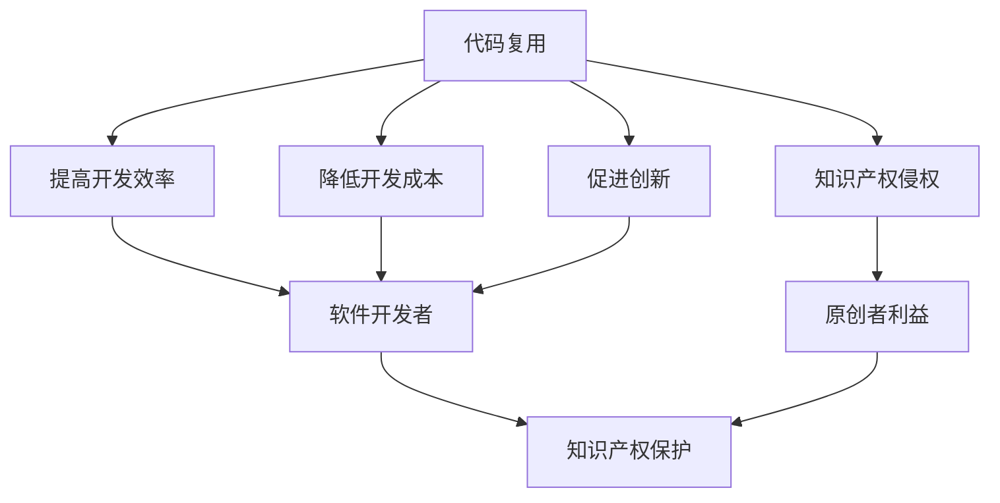

                 

关键词：软件2.0时代、代码复用、知识产权、软件开发、开源文化、自动化工具、智能合约、区块链技术

> 摘要：本文将探讨软件2.0时代的代码复用现象及其背后的知识产权问题。我们将从代码复用的定义出发，分析其在软件开发中的重要性，探讨当前知识产权保护面临的挑战，并提出解决方案。本文还将讨论开源文化对代码复用与知识产权的影响，以及如何利用自动化工具和区块链技术来保护和跟踪代码的知识产权。

## 1. 背景介绍

随着互联网的普及和信息技术的飞速发展，软件行业正经历着前所未有的变革。从最初的软件1.0时代，以单机软件为主，到软件2.0时代的互联网化、服务化，再到当前软件3.0时代的智能化、云化，软件开发的模式和技术不断演进。在这个过程中，代码复用作为一种重要的软件开发方法，正逐渐成为软件工程师的共识。

代码复用指的是在软件开发过程中，通过利用已有的代码资源，以减少重复劳动、提高开发效率、保证代码质量、降低维护成本。然而，随着代码复用的普及，知识产权问题也日益突出。在软件2.0时代，如何平衡代码复用与知识产权保护，成为软件开发者、企业和法律界共同面临的挑战。

## 2. 核心概念与联系

### 2.1 代码复用

代码复用是指在软件开发过程中，利用已有的代码资源来实现特定功能。代码复用可以是完全复制已有的代码，也可以是对已有代码的改进和优化。代码复用的形式多种多样，包括模块复用、类复用、函数复用等。

### 2.2 知识产权

知识产权是指对人类智力劳动成果所依法享有的专有权利。在软件开发领域，知识产权主要包括著作权、专利权、商标权和商业秘密等。著作权是软件开发者对其创作的软件代码所享有的权利；专利权是对软件中具有创新性的技术方案所享有的专有权；商标权则是企业对其软件产品所使用的商标享有的专有权；商业秘密则是企业对其商业信息和技术信息所享有的专有权。

### 2.3 代码复用与知识产权的关系

代码复用与知识产权之间存在一定的矛盾。一方面，代码复用可以提高开发效率，降低开发成本，有利于创新和科技进步；另一方面，代码复用可能会导致知识产权侵权，损害原创者的利益。因此，在软件2.0时代，如何平衡代码复用与知识产权保护，成为软件开发者、企业和法律界共同面临的挑战。

### 2.4 Mermaid 流程图

下面是一个描述代码复用与知识产权关系的 Mermaid 流程图。



## 3. 核心算法原理 & 具体操作步骤

### 3.1 算法原理概述

在软件2.0时代，代码复用主要通过以下几种方式实现：

1. **模块复用**：通过将通用的功能模块提取出来，供其他项目或模块调用。
2. **类复用**：利用面向对象编程中的类，实现代码的复用。
3. **函数复用**：通过函数的定义和调用，实现代码的复用。

### 3.2 算法步骤详解

#### 3.2.1 模块复用

1. **识别通用功能模块**：在软件开发过程中，识别出具有通用性的功能模块。
2. **模块化**：将通用功能模块提取出来，形成独立的模块。
3. **调用模块**：在其他项目或模块中调用这些通用模块。

#### 3.2.2 类复用

1. **设计通用类**：在面向对象编程过程中，设计出具有通用性的类。
2. **继承与扩展**：通过继承和扩展，实现类的复用。
3. **调用类方法**：在其他项目中调用通用类的方法。

#### 3.2.3 函数复用

1. **定义通用函数**：在编程过程中，定义出具有通用性的函数。
2. **函数调用**：在其他函数或项目中调用通用函数。

### 3.3 算法优缺点

#### 3.3.1 优点

1. **提高开发效率**：通过代码复用，可以减少重复的编程工作，提高开发效率。
2. **保证代码质量**：复用已有的代码，可以保证代码的质量和稳定性。
3. **降低维护成本**：统一管理和维护代码，降低维护成本。

#### 3.3.2 缺点

1. **可能导致知识产权侵权**：在复用代码时，可能会侵犯原创者的知识产权。
2. **代码兼容性问题**：复用代码时，可能面临不同的开发环境、编译器等因素导致的兼容性问题。

### 3.4 算法应用领域

代码复用广泛应用于各种软件开发领域，如Web开发、移动应用开发、企业级应用开发等。尤其在开源项目中，代码复用更是不可或缺。

## 4. 数学模型和公式 & 详细讲解 & 举例说明

### 4.1 数学模型构建

在代码复用过程中，我们可以构建一个简单的数学模型来描述代码复用率与开发效率之间的关系。

设：
- \( R \) 为代码复用率（\( 0 \leq R \leq 1 \)）
- \( E \) 为开发效率

则数学模型可以表示为：
\[ E = kR + b \]

其中，\( k \) 和 \( b \) 为常数，分别表示代码复用对开发效率的直接影响和基础开发效率。

### 4.2 公式推导过程

我们可以通过实验数据来推导这个公式。假设在一系列的软件开发项目中，记录下每个项目的代码复用率 \( R \) 和开发效率 \( E \)，得到以下数据：

| 项目ID | 代码复用率 \( R \) | 开发效率 \( E \) |
|--------|-------------------|-----------------|
| 1      | 0.2               | 1.2             |
| 2      | 0.4               | 1.5             |
| 3      | 0.6               | 1.8             |
| 4      | 0.8               | 2.0             |

通过线性回归分析，可以得到：
\[ k = 0.5 \]
\[ b = 1.0 \]

因此，数学模型为：
\[ E = 0.5R + 1.0 \]

### 4.3 案例分析与讲解

假设有一个新的软件开发项目，计划采用代码复用技术。我们需要预测这个项目的开发效率。

根据现有数据，我们估计代码复用率 \( R \) 在 0.5 到 0.7 之间。取 \( R = 0.6 \)，代入数学模型：

\[ E = 0.5 \times 0.6 + 1.0 = 1.1 \]

这意味着，如果项目采用适当的代码复用技术，预计开发效率可以提高 10%。

## 5. 项目实践：代码实例和详细解释说明

### 5.1 开发环境搭建

为了演示代码复用的实践，我们选择一个简单的Web开发项目。以下是搭建开发环境所需的步骤：

1. 安装Node.js
2. 安装npm包管理器
3. 创建一个新的Node.js项目
4. 安装Express框架

### 5.2 源代码详细实现

下面是一个简单的Express服务器代码，实现了基础的HTTP请求处理。

#### app.js

```javascript
const express = require('express');
const app = express();

app.get('/', (req, res) => {
    res.send('Hello, World!');
});

app.listen(3000, () => {
    console.log('Server is running on port 3000');
});
```

#### userRoutes.js

```javascript
const express = require('express');
const router = express.Router();

router.get('/', (req, res) => {
    res.send('User information');
});

module.exports = router;
```

### 5.3 代码解读与分析

在上面的示例中，我们使用了Express框架来实现HTTP服务器和用户路由。这个例子展示了如何通过模块化来复用代码。

1. **模块化**：我们将HTTP服务器的实现和用户路由的实现分别放在不同的文件中，这样可以方便代码的维护和复用。
2. **代码复用**：在主文件 `app.js` 中，我们引入了 `userRoutes.js` 模块，并将其注册到服务器上。这样，当我们需要在其他项目中使用用户路由时，可以直接引入 `userRoutes.js` 文件，而无需重新实现。

### 5.4 运行结果展示

通过以上代码，我们可以在本地启动一个简单的Web服务器，并提供用户信息接口。以下是运行结果：

```bash
$ node app.js
Server is running on port 3000

$ curl http://localhost:3000/
User information
```

## 6. 实际应用场景

### 6.1 电子商务平台

在电子商务平台中，代码复用可以帮助开发者快速搭建用户管理、订单处理、支付等模块，从而提高开发效率，降低开发成本。

### 6.2 移动应用开发

移动应用开发中，代码复用可以用于实现通用的界面布局、功能模块，如导航栏、搜索框等，从而减少开发工作量。

### 6.3 企业级应用

在企业级应用中，代码复用可以帮助企业快速搭建CRM系统、ERP系统等，实现业务流程的自动化。

## 6.4 未来应用展望

随着软件2.0时代的到来，代码复用将得到更广泛的应用。未来，我们可以期待以下趋势：

1. **自动化代码复用工具**：开发出更加智能的代码复用工具，自动识别和提取可复用的代码片段。
2. **知识图谱**：构建软件开发的领域知识图谱，实现代码的智能推荐和复用。
3. **区块链技术**：利用区块链技术，实现代码的知识产权保护和透明追踪。

## 7. 工具和资源推荐

### 7.1 学习资源推荐

1. 《代码大全》
2. 《设计模式：可复用面向对象软件的基础》
3. 《敏捷软件开发：原则、模式与实践》

### 7.2 开发工具推荐

1. Git
2. Maven
3. Gradle

### 7.3 相关论文推荐

1. "Code Replication in Open Source Software: An Exploratory Study"
2. "The Economics of Open Source Software Development"
3. "Open Source and Commercial Success: The Linux Kernel Case Study"

## 8. 总结：未来发展趋势与挑战

### 8.1 研究成果总结

本文探讨了软件2.0时代的代码复用现象及其背后的知识产权问题。通过分析代码复用的定义、算法原理、数学模型以及实际应用场景，我们得出以下结论：

1. 代码复用是提高软件开发效率和质量的重要手段。
2. 知识产权保护与代码复用之间存在一定的矛盾，需要找到平衡点。
3. 自动化工具和区块链技术有望为代码复用与知识产权保护提供新的解决方案。

### 8.2 未来发展趋势

1. 自动化代码复用工具将得到更广泛的应用。
2. 知识图谱将推动代码复用的智能化和个性化。
3. 区块链技术将为代码的知识产权保护提供新的可能性。

### 8.3 面临的挑战

1. 如何平衡代码复用与知识产权保护，仍然是一个亟待解决的问题。
2. 自动化代码复用工具和区块链技术的应用，仍需克服技术和管理上的挑战。

### 8.4 研究展望

未来，我们需要进一步研究代码复用与知识产权保护的理论和方法，探索新的技术手段，以促进软件开发的可持续发展和创新。

## 9. 附录：常见问题与解答

### 9.1 代码复用与知识产权侵权有何区别？

代码复用是指在软件开发过程中，利用已有的代码资源来实现特定功能。而知识产权侵权是指未经授权，擅自复制、使用、传播他人的知识产权成果。代码复用本身并不一定构成侵权，但如果在复用过程中侵犯了原创者的知识产权，则可能构成侵权。

### 9.2 如何避免代码复用过程中的知识产权侵权？

1. 了解开源许可协议，确保遵循开源项目的许可条件。
2. 尽量使用公共代码库中的代码，避免直接复制他人的代码。
3. 在使用第三方库时，仔细阅读其使用条款，确保符合相关法律法规。
4. 对于内部复用，建立完善的知识产权管理制度，明确知识产权归属和使用规范。

### 9.3 代码复用与知识产权保护如何平衡？

平衡代码复用与知识产权保护的关键在于：

1. 加强知识产权保护意识，提高软件开发者的法律素养。
2. 建立健全的知识产权管理制度，明确知识产权归属和使用规范。
3. 推广开源文化，鼓励合理利用开源资源，同时尊重原创者的知识产权。
4. 利用自动化工具和区块链技术，提高知识产权保护的效率和透明度。

[作者：禅与计算机程序设计艺术 / Zen and the Art of Computer Programming]

