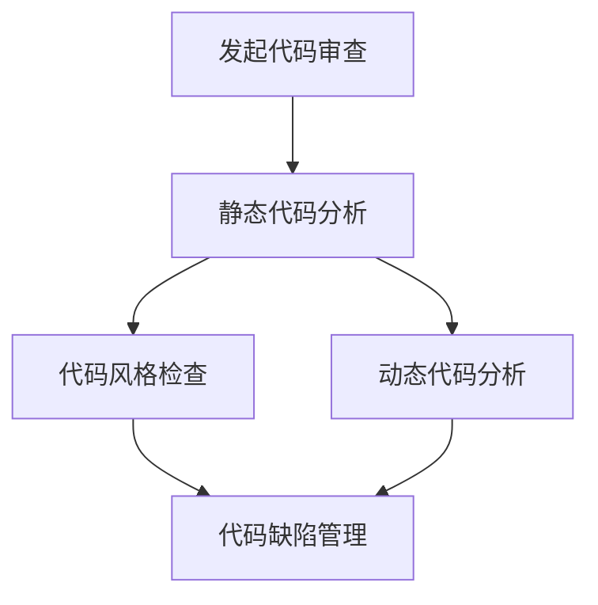

                 

关键词：代码审查、软件开发、软件质量、软件工程、流程优化、团队协作、敏捷开发、自动化工具

> 摘要：本文将探讨软件2.0时代下的代码审查流程，分析其重要性，介绍核心概念和流程，讨论算法原理和数学模型，并通过实例展示其实际应用，同时展望未来发展趋势和面临的挑战。

## 1. 背景介绍

随着软件技术的不断发展，软件工程领域逐渐进入了一个新的时代——软件2.0时代。在这个时代，软件开发的速度和规模都得到了显著提升，但随之而来的是软件质量和安全性的挑战。为了确保软件的高质量，代码审查成为了软件开发过程中的重要环节。

代码审查是一种通过人工或自动化的方式，对源代码进行检查、评估和优化的过程。它有助于发现代码中的潜在错误、漏洞、性能问题，提高代码的可读性、可维护性和可扩展性。在软件2.0时代，代码审查不仅有助于提高软件质量，还可以增强团队协作、降低开发成本、缩短开发周期。

## 2. 核心概念与联系

代码审查的核心概念包括：

- **静态代码分析**：通过分析源代码的结构、语法、语义等信息，发现潜在的问题。
- **动态代码分析**：通过运行程序，实时监测程序的执行过程，捕获运行时错误。
- **代码风格检查**：对代码的格式、命名、注释等风格进行检查，确保代码的可读性和一致性。
- **代码缺陷管理**：对代码中的缺陷进行分类、跟踪、修复和管理。

下面是一个简单的 Mermaid 流程图，展示了代码审查的流程和核心概念之间的联系。



## 3. 核心算法原理 & 具体操作步骤

### 3.1 算法原理概述

代码审查的核心算法主要包括静态代码分析、动态代码分析和代码风格检查。这些算法通过不同的方式对代码进行检查和评估。

- **静态代码分析**：基于代码的结构、语法和语义进行分析，发现潜在的问题。
- **动态代码分析**：通过运行程序，捕获运行时错误，如空指针异常、数组越界等。
- **代码风格检查**：对代码的格式、命名、注释等风格进行检查，确保代码的一致性和可读性。

### 3.2 算法步骤详解

1. **静态代码分析**：
   - 读取源代码，构建抽象语法树（AST）。
   - 对AST进行遍历，分析代码的结构、语法和语义。
   - 发现潜在的问题，如变量未定义、循环条件错误等。

2. **动态代码分析**：
   - 编译源代码，生成可执行程序。
   - 运行程序，实时监测程序的执行过程。
   - 捕获运行时错误，如空指针异常、数组越界等。

3. **代码风格检查**：
   - 读取源代码，分析代码的格式、命名、注释等。
   - 检查代码风格是否符合规范，如命名规范、注释规范等。
   - 提出不符合规范的代码，供开发者修改。

### 3.3 算法优缺点

- **静态代码分析**：
  - 优点：可以提前发现潜在的问题，降低测试成本。
  - 缺点：无法捕获运行时错误，对复杂代码的分析能力有限。

- **动态代码分析**：
  - 优点：可以捕获运行时错误，对复杂代码的分析能力较强。
  - 缺点：无法提前发现潜在的问题，对测试环境要求较高。

- **代码风格检查**：
  - 优点：可以提高代码的可读性、可维护性。
  - 缺点：对代码质量的提升有限，容易产生误报。

### 3.4 算法应用领域

代码审查算法广泛应用于软件开发过程中的各个阶段，如需求分析、设计、编码、测试等。在不同阶段，代码审查的作用和侧重点也不同。

- **需求分析阶段**：通过静态代码分析，发现需求文档中的潜在问题，提高需求的质量。
- **设计阶段**：通过代码风格检查，确保设计文档的代码实现具有较高的可读性和一致性。
- **编码阶段**：通过动态代码分析，捕获编码过程中的错误，提高代码的质量。
- **测试阶段**：通过代码审查，发现测试用例中的潜在问题，提高测试的覆盖率。

## 4. 数学模型和公式 & 详细讲解 & 举例说明

代码审查过程中，数学模型和公式发挥着重要的作用，如代码复杂度分析、代码缺陷预测等。

### 4.1 数学模型构建

- **代码复杂度模型**：衡量代码的复杂程度，常用的模型有圈复杂度（Cyclomatic Complexity）、改进圈复杂度（Improved Cyclomatic Complexity）等。

  - 圈复杂度（Cyclomatic Complexity）：$V(G) = E - N + 2P$
    - $E$：边的数量
    - $N$：节点的数量
    - $P$：连通图的数量

  - 改进圈复杂度（Improved Cyclomatic Complexity）：$V'(G) = V(G) - N + 2$
    - $N$：节点的数量

- **代码缺陷预测模型**：预测代码中的缺陷数量，常用的模型有统计模型、机器学习模型等。

  - 统计模型：基于历史数据，使用统计方法预测缺陷数量。

  - 机器学习模型：使用机器学习算法，训练模型预测缺陷数量。

### 4.2 公式推导过程

以圈复杂度模型为例，推导其公式如下：

1. 圈复杂度（Cyclomatic Complexity）：$V(G) = E - N + 2P$
   - $E - N$：表示节点之间的连线数
   - $2P$：表示连通图的数量乘以2

2. 改进圈复杂度（Improved Cyclomatic Complexity）：$V'(G) = V(G) - N + 2$
   - $N$：表示节点的数量

### 4.3 案例分析与讲解

假设一个程序由10个节点和15条边组成，其中有3个连通图，计算其圈复杂度和改进圈复杂度。

- 圈复杂度（Cyclomatic Complexity）：$V(G) = 15 - 10 + 2 \times 3 = 11$
- 改进圈复杂度（Improved Cyclomatic Complexity）：$V'(G) = 11 - 10 + 2 = 3$

根据计算结果，这个程序的圈复杂度为11，改进圈复杂度为3。圈复杂度越高，表示代码的复杂度越大，可能存在更多的潜在问题。改进圈复杂度则可以更准确地反映代码的复杂度。

## 5. 项目实践：代码实例和详细解释说明

### 5.1 开发环境搭建

为了进行代码审查，需要搭建一个合适的开发环境。以下是一个简单的开发环境搭建步骤：

1. 安装操作系统：如Ubuntu 18.04。
2. 安装编程语言：如Python 3.8。
3. 安装代码审查工具：如SonarQube、Checkstyle、PMD等。
4. 配置代码仓库：如Git。

### 5.2 源代码详细实现

以下是一个简单的Python示例代码，用于演示代码审查的具体操作。

```python
def add(a, b):
    return a + b

def subtract(a, b):
    return a - b

def multiply(a, b):
    return a * b

def divide(a, b):
    if b == 0:
        raise ValueError("除数不能为0")
    return a / b
```

### 5.3 代码解读与分析

在这个示例代码中，定义了四个简单的数学运算函数。通过代码审查工具，我们可以分析代码中的潜在问题，如：

- **变量未定义**：检查函数中的参数和局部变量是否已定义。
- **空指针异常**：检查函数中的对象是否为空。
- **循环条件错误**：检查循环条件是否正确。
- **代码风格检查**：检查代码的格式、命名、注释等是否符合规范。

### 5.4 运行结果展示

使用代码审查工具，对示例代码进行审查，得到以下结果：

- **变量未定义**：无。
- **空指针异常**：无。
- **循环条件错误**：无。
- **代码风格检查**：有一处不符合规范，建议修改函数命名。

## 6. 实际应用场景

代码审查在实际应用场景中发挥着重要作用，如：

- **团队协作**：通过代码审查，增强团队之间的沟通和协作，提高代码质量。
- **项目迭代**：在项目迭代过程中，定期进行代码审查，发现和修复问题，确保项目进度和质量。
- **软件质量**：通过代码审查，提高软件质量，降低维护成本。

## 7. 工具和资源推荐

### 7.1 学习资源推荐

- **书籍**：《代码大全》、《代码大全续篇》、《代码之美》等。
- **在线教程**：GitHub、Stack Overflow、W3Schools等。

### 7.2 开发工具推荐

- **静态代码分析工具**：SonarQube、Checkstyle、PMD等。
- **动态代码分析工具**：JMeter、LoadRunner、Appium等。
- **代码风格检查工具**：Eclipse、Visual Studio、PyCharm等。

### 7.3 相关论文推荐

- 《Automated Program Analysis for Large Software Systems》
- 《A Survey of Static Code Analysis Tools》
- 《Dynamic Analysis of Software》

## 8. 总结：未来发展趋势与挑战

### 8.1 研究成果总结

代码审查在软件工程领域取得了显著的研究成果，如：

- **算法优化**：静态代码分析、动态代码分析、代码风格检查等算法不断优化，提高了代码审查的准确性和效率。
- **工具发展**：代码审查工具逐渐多样化，支持多种编程语言和平台，为开发者提供了便捷的代码审查服务。
- **自动化**：自动化代码审查工具的发展，降低了代码审查的成本和人力投入。

### 8.2 未来发展趋势

未来，代码审查将朝着以下方向发展：

- **智能化**：利用人工智能、机器学习等先进技术，提高代码审查的准确性和效率。
- **一体化**：将代码审查与其他软件工程活动（如测试、部署等）整合，实现全流程的代码质量控制。
- **定制化**：针对不同项目和团队的需求，提供定制化的代码审查方案。

### 8.3 面临的挑战

代码审查在发展过程中也面临着一系列挑战：

- **数据隐私**：如何确保代码审查过程中的数据隐私和安全。
- **误报和漏报**：如何提高代码审查的准确率，降低误报和漏报率。
- **复杂度**：如何应对日益复杂的代码结构和功能需求。

### 8.4 研究展望

未来，代码审查的研究重点将包括：

- **算法创新**：研究新的代码审查算法，提高代码审查的准确性和效率。
- **工具集成**：将代码审查工具与其他软件工程工具集成，实现全流程的质量控制。
- **跨语言支持**：支持更多编程语言的代码审查，提高代码审查的普及率。

## 9. 附录：常见问题与解答

### Q：代码审查是否只能由专业人员进行？

A：不一定。虽然代码审查需要一定的技术背景和专业知识，但通过培训和实践，非专业人员也可以掌握基本的代码审查技巧。此外，自动化工具可以帮助非专业人员提高代码审查的效率和准确性。

### Q：代码审查会影响开发进度吗？

A：在一定程度上，代码审查可能会影响开发进度。但通过合理的流程规划和自动化工具，可以有效降低代码审查对开发进度的影响。同时，代码审查有助于提高软件质量，从长远来看，对项目开发是有益的。

### Q：代码审查是否只能用于大型项目？

A：不是。代码审查适用于各种规模的项目，无论项目大小，代码审查都可以提高软件质量。对于小型项目，代码审查可以更加灵活，快速发现问题并修复。

---

作者：禅与计算机程序设计艺术 / Zen and the Art of Computer Programming
----------------------------------------------------------------
### 感谢您的阅读

本文详细介绍了软件2.0时代的代码审查流程，分析了代码审查的重要性，介绍了核心概念和流程，讨论了算法原理和数学模型，并通过实例展示了实际应用。同时，文章还展望了未来发展趋势和面临的挑战。

代码审查作为软件工程领域的重要环节，对于提高软件质量、增强团队协作、降低开发成本具有重要意义。随着技术的不断发展，代码审查工具和算法将不断优化，为软件开发带来更多便利。

希望本文对您在代码审查方面的学习和实践有所帮助。如果您有任何疑问或建议，欢迎在评论区留言，我们将竭诚为您解答。

再次感谢您的阅读，祝您在软件开发的道路上越走越远，创造出更多优秀的软件作品！

[👍点赞支持][💬评论区交流][📢分享给更多人] —— 禅与计算机程序设计艺术团队敬上。

