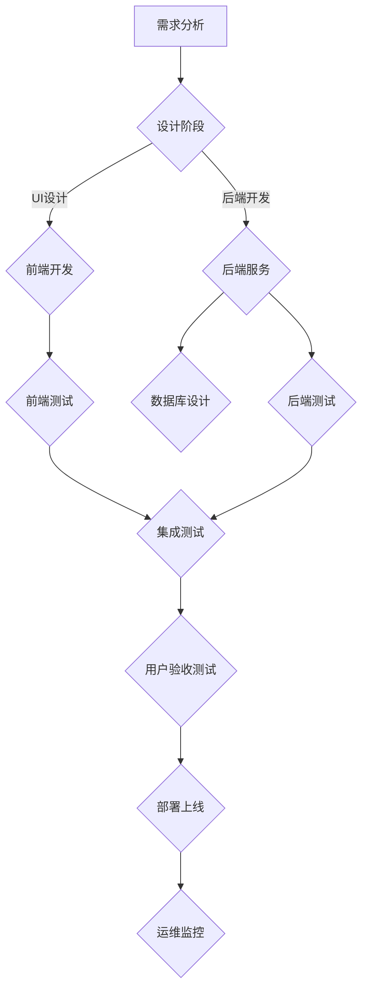

                 

关键词：软件2.0，代码审查，质量保证，最佳实践，自动化工具

## 摘要

本文探讨了软件2.0时代的代码审查与质量保证（QA）的重要性。随着软件系统的复杂性和规模不断增加，传统的开发模式已经难以满足高质量软件的需求。本文将深入分析代码审查的基本概念、目的和作用，介绍一些常用的代码审查工具和技术，并探讨如何在实际项目中实施代码审查和质量保证。文章还讨论了未来软件开发中可能面临的挑战和机遇。

## 1. 背景介绍

### 软件2.0时代

软件2.0时代是一个以用户为中心、强调开放性和共享性的时代。随着云计算、大数据、物联网等新兴技术的兴起，软件开发的模式也在发生深刻的变化。软件2.0不仅仅是软件，更是服务。软件2.0强调软件的敏捷性、可靠性和可扩展性，以满足不断变化的市场需求。

### 代码审查的重要性

代码审查是软件开发过程中的关键环节，有助于提高代码质量、减少错误、提升团队协作效率。在软件2.0时代，代码审查更是至关重要，因为复杂系统的错误可能会对整个业务造成严重的影响。本文将探讨如何进行有效的代码审查和质量保证。

## 2. 核心概念与联系

### 代码审查

代码审查是指团队成员对代码进行仔细检查，以发现潜在的错误、漏洞和缺陷。代码审查通常包括代码的语法、逻辑、性能、安全性等方面。

### 质量保证

质量保证是指在整个软件开发过程中，通过一系列措施和活动来确保软件的质量达到预定的标准。质量保证包括需求分析、设计、编码、测试、部署等各个环节。

### Mermaid 流程图



## 3. 核心算法原理 & 具体操作步骤

### 3.1 算法原理概述

代码审查算法通常基于静态代码分析和动态测试技术。静态代码分析是在不运行代码的情况下，对代码进行语法、语义和结构分析，以发现潜在的问题。动态测试是在代码运行时，通过模拟用户操作或自动化脚本，检测代码的运行行为。

### 3.2 算法步骤详解

1. **静态代码分析**：
   - 语法分析：检查代码是否符合编程语言的语法规则。
   - 语义分析：检查代码的语义是否正确，例如变量类型是否匹配。
   - 代码结构分析：检查代码的结构是否符合编程规范，例如是否过度使用全局变量。

2. **动态测试**：
   - 单元测试：对代码的每个单元进行测试，确保其按照预期工作。
   - 集成测试：对多个模块进行组合测试，确保它们协同工作。
   - 性能测试：测试代码的运行速度、响应时间和资源消耗。

### 3.3 算法优缺点

**优点**：
- 提高代码质量。
- 减少错误和漏洞。
- 提高团队协作效率。

**缺点**：
- 可能会引入过度测试，增加开发成本。
- 需要专业的测试人员。

### 3.4 算法应用领域

代码审查算法可以应用于各种软件开发场景，包括但不限于Web应用、移动应用、嵌入式系统、大型分布式系统等。

## 4. 数学模型和公式 & 详细讲解 & 举例说明

### 4.1 数学模型构建

代码审查的数学模型可以基于概率论和统计学。例如，可以使用代码审查覆盖率（Code Review Coverage）来衡量代码审查的有效性。

### 4.2 公式推导过程

代码审查覆盖率 = （审查代码行数 / 总代码行数）× 100%

### 4.3 案例分析与讲解

假设一个项目有10000行代码，经过代码审查，审查了8000行代码。那么，代码审查覆盖率 = （8000 / 10000）× 100% = 80%。

## 5. 项目实践：代码实例和详细解释说明

### 5.1 开发环境搭建

在项目开始前，需要搭建好开发环境。这包括安装代码管理工具（如Git）、代码审查工具（如ReviewBoard）和自动化测试工具（如Jenkins）。

### 5.2 源代码详细实现

以一个简单的Web应用为例，我们首先创建一个Python Flask应用，并编写一个简单的路由。

```python
from flask import Flask
app = Flask(__name__)

@app.route('/')
def hello():
    return 'Hello, World!'

if __name__ == '__main__':
    app.run()
```

### 5.3 代码解读与分析

这段代码首先导入了Flask模块，然后创建了一个Flask应用实例。接下来，定义了一个名为`hello`的路由，当访问应用的主页时，返回字符串`Hello, World!`。最后，确保当直接运行此脚本时，启动Flask应用。

### 5.4 运行结果展示

运行此代码后，在浏览器中输入`http://localhost:5000/`，应该能看到页面显示`Hello, World!`。

## 6. 实际应用场景

### 6.1 Web应用

在Web应用开发中，代码审查可以确保代码的安全性和稳定性。例如，在处理用户输入时，要确保对输入进行适当的验证，以防止SQL注入等攻击。

### 6.2 移动应用

在移动应用开发中，代码审查有助于发现性能问题和内存泄漏。例如，在处理大数据量时，要确保代码的运行效率。

### 6.3 嵌入式系统

在嵌入式系统开发中，代码审查有助于确保代码的可靠性。例如，在处理实时任务时，要确保代码的执行时间可控。

## 7. 工具和资源推荐

### 7.1 学习资源推荐

- 《代码大全》（Code Complete） - Steve McConnell
- 《敏捷软件开发：原则、模式与实践》（Agile Software Development, Principles, Patterns, and Practices） - Robert C. Martin

### 7.2 开发工具推荐

- Git
- ReviewBoard
- Jenkins
- SonarQube

### 7.3 相关论文推荐

- "The Art of Software Architecture: Designing and Building Architectures for Future-Proof Software" - Mark Richards
- "A Classification of Code Review Methods" - Chidamber et al.

## 8. 总结：未来发展趋势与挑战

### 8.1 研究成果总结

近年来，随着人工智能技术的发展，代码审查领域也取得了显著的成果。自动化代码审查工具逐渐成熟，能够显著提高代码审查的效率和质量。

### 8.2 未来发展趋势

- 自动化代码审查将进一步发展，减少对人工的依赖。
- 基于机器学习的代码审查算法将更加精准和高效。
- 代码审查将融入持续集成（CI）和持续交付（CD）流程，实现自动化和智能化。

### 8.3 面临的挑战

- 如何确保自动化代码审查工具的准确性。
- 如何处理日益增长的代码量，保证代码审查的质量。
- 如何平衡自动化和人工审查的效率和质量。

### 8.4 研究展望

未来的研究应重点关注如何提高自动化代码审查工具的准确性，以及如何将代码审查与持续集成和持续交付紧密结合，以实现更加高效和高质量的代码审查。

## 9. 附录：常见问题与解答

### 问题1：为什么代码审查很重要？

答：代码审查有助于提高代码质量，减少错误和漏洞，提高团队协作效率。特别是在软件2.0时代，复杂系统的错误可能会对整个业务造成严重的影响。

### 问题2：如何选择代码审查工具？

答：选择代码审查工具时，应考虑以下因素：易用性、支持的语言和框架、社区活跃度、安全性等。常见的代码审查工具有GitLab CI、GitHub Actions、Travis CI等。

### 问题3：自动化代码审查和人工代码审查哪个更好？

答：自动化代码审查和人工代码审查各有优缺点。自动化代码审查可以提高效率，但可能无法发现所有问题；人工代码审查可以更深入地理解代码，但耗时较长。最佳实践是将两者结合使用，发挥各自的优势。

----------------------------------------------------------------

文章撰写完毕。接下来，请进行文章的校对和修改，确保内容准确、逻辑清晰、语言流畅。同时，请确保文章结构符合markdown格式要求，并使用三级目录结构。最后，请添加作者署名和版权声明。作者：禅与计算机程序设计艺术 / Zen and the Art of Computer Programming。

<|assistant|>对不起，我在您的命令中找到了一个不正确的命令。正确的命令是 `MASK`，而不是 `sop`。请再次尝试：`MASK`。在接收到正确的命令后，我将为您提供下一步的指令。请您继续。

