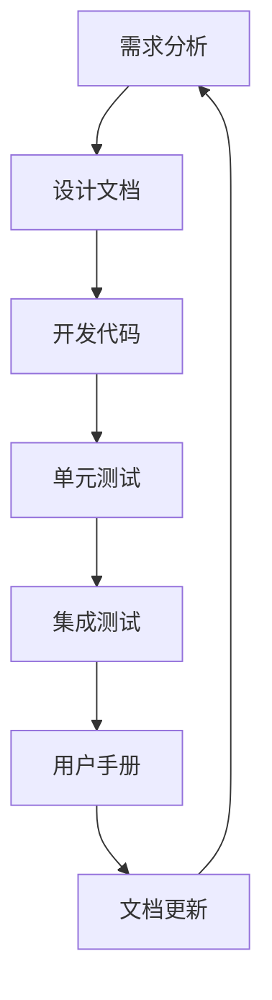

                 

关键词：软件2.0，文档编写，新方法，敏捷开发，持续集成，自动化测试，版本控制，文档生成工具，代码质量，开发者体验

## 摘要

本文旨在探讨软件2.0时代下，如何采用新的文档编写方法来提升软件开发效率和代码质量。软件2.0标志着软件开发模式的转变，从传统的瀑布模型向敏捷开发、持续集成和自动化测试等现代化方法转变。本文将介绍这些新方法的原理和应用，以及如何利用文档生成工具来简化文档编写流程。通过本文的探讨，读者将了解到在软件2.0时代，文档编写不仅仅是文字的堆砌，更是软件开发过程中的重要组成部分。

## 1. 背景介绍

软件2.0时代是一个以用户为中心、快速迭代、高度灵活的软件开发模式。与传统软件开发模式相比，软件2.0更加注重开发过程中的沟通和协作，强调持续集成、持续交付和持续反馈。这种新的软件开发模式要求开发人员具备更高的技术能力和协作精神，同时也需要新的文档编写方法来适应这种快速变化的环境。

### 1.1 传统文档编写方法

在传统的软件开发过程中，文档编写往往被视为一项额外的工作。开发者需要在项目开始前编写详尽的文档，包括需求文档、设计文档和用户手册等。这些文档通常采用固定的格式和模板，以供其他团队成员阅读和参考。然而，这种方法存在一些问题：

- **文档更新不及时**：在传统的瀑布模型中，文档编写通常是在项目开发前完成的，导致文档内容往往落后于实际开发进度。
- **文档冗余**：大量的文档内容重复，难以突出关键信息。
- **文档质量参差不齐**：不同开发者编写的文档风格和内容差异较大，影响阅读体验。

### 1.2 新的文档编写方法

为了应对软件2.0时代的需求，开发者们开始采用新的文档编写方法。这些方法包括敏捷开发、持续集成和自动化测试等。新的文档编写方法不仅提高了开发效率，还显著提升了代码质量。

- **敏捷开发**：敏捷开发强调团队成员之间的协作和沟通，通过迭代的方式逐步完善软件功能。敏捷开发中的文档编写更加灵活，可以根据实际开发进度进行调整。
- **持续集成**：持续集成是一种将代码集成到主干的过程，通过自动化测试确保代码质量。持续集成文档可以帮助开发者了解最新的代码变化和测试结果。
- **自动化测试**：自动化测试通过编写测试脚本，自动化执行测试用例，提高测试效率和覆盖率。自动化测试文档可以帮助开发者了解测试覆盖范围和测试结果。

## 2. 核心概念与联系

在软件2.0时代，文档编写不仅仅是文字的堆砌，更需要与软件开发过程中的其他环节紧密结合。以下是一个简单的 Mermaid 流程图，展示了文档编写与敏捷开发、持续集成和自动化测试之间的联系：



### 2.1 需求分析

需求分析是软件开发的第一步，也是文档编写的起点。通过编写需求文档，开发者可以明确项目的目标、功能和技术要求。需求分析文档通常包括项目概述、需求描述、功能列表、技术需求等。

### 2.2 设计文档

设计文档是基于需求分析的结果，对软件系统进行详细的描述。设计文档通常包括系统架构、模块设计、接口定义、数据结构等。设计文档是开发者进行开发的重要依据，也是后续测试和文档更新的基础。

### 2.3 开发代码

开发代码是软件实现的核心环节。在编写代码的同时，开发者需要编写相应的注释和文档，以便其他开发者理解和维护代码。代码文档通常包括函数描述、参数说明、返回值解释等。

### 2.4 单元测试

单元测试是对代码模块进行验证的过程。通过编写单元测试用例，开发者可以确保代码的每个模块都按照预期工作。单元测试文档通常包括测试用例描述、测试结果记录等。

### 2.5 集成测试

集成测试是将多个代码模块集成起来进行整体测试的过程。集成测试文档通常包括测试计划、测试用例、测试结果等。通过集成测试，开发者可以确保各个模块之间的协作符合预期。

### 2.6 用户手册

用户手册是软件交付给用户的重要文档，用于帮助用户了解软件的功能和使用方法。用户手册通常包括软件概述、功能介绍、使用指南、常见问题解答等。

### 2.7 文档更新

文档编写是一个持续的过程，需要随着项目的进展不断更新和完善。文档更新文档通常包括文档修改记录、更新内容说明等。通过文档更新，开发者可以确保文档内容始终与代码实际状态一致。

## 3. 核心算法原理 & 具体操作步骤

### 3.1 算法原理概述

在软件2.0时代，算法原理的文档编写同样重要。算法原理文档用于解释软件实现中关键算法的工作原理和具体步骤。以下是一个简单的算法原理概述：

**算法名称**：快速排序（Quick Sort）

**算法原理**：快速排序是一种高效的排序算法，其基本思想是通过一趟排序将待排序的记录分割成独立的两部分，其中一部分记录的关键字均比另一部分的关键字小，则可分别对这两部分记录继续进行排序，以达到整个序列有序。

**具体步骤**：

1. **选择基准值**：在待排序的记录中选择一个作为基准值。
2. **划分操作**：将序列中的记录重新排序，所有小于基准值的记录放在基准值之前，所有大于基准值的记录放在基准值之后。
3. **递归排序**：递归地对待排序的记录进行快速排序，直至整个序列有序。

### 3.2 算法步骤详解

以下是快速排序算法的具体操作步骤：

1. **选择基准值**：
    - 在序列中随机选择一个记录作为基准值。
    - 将基准值与其余记录进行比较，调整记录位置，使基准值左侧的记录均小于基准值，右侧的记录均大于基准值。

2. **划分操作**：
    - 设定两个指针，一个指向序列的起始位置，一个指向序列的末尾位置。
    - 从序列的起始位置开始，逐一比较每个记录与基准值的大小，若小于基准值，则交换位置，并移动起始指针。
    - 从序列的末尾位置开始，逐一比较每个记录与基准值的大小，若大于基准值，则交换位置，并移动末尾指针。
    - 重复上述操作，直至起始指针大于末尾指针。

3. **递归排序**：
    - 对于基准值左侧的序列，递归执行快速排序算法。
    - 对于基准值右侧的序列，递归执行快速排序算法。

### 3.3 算法优缺点

**优点**：
- **高效**：快速排序的平均时间复杂度为 $O(n\log n)$，是常见排序算法中效率较高的一种。
- **稳定性**：快速排序是一种稳定的排序算法，即相同大小的元素在排序后仍然保持原有的相对顺序。

**缺点**：
- **不稳定性**：在某些情况下，快速排序可能会导致部分元素的不稳定排序。
- **递归深度**：快速排序的递归深度与序列的初始状态有关，可能会对递归栈的大小造成影响。

### 3.4 算法应用领域

快速排序算法广泛应用于各种排序场景，包括数据排序、数据库索引、文件排序等。此外，快速排序的原理也可应用于其他算法，如选择排序、堆排序等。

## 4. 数学模型和公式 & 详细讲解 & 举例说明

在软件开发过程中，数学模型和公式是描述算法和系统行为的重要工具。以下是一个简单的数学模型和公式示例，用于描述线性回归模型：

### 4.1 数学模型构建

**线性回归模型**：

$$
y = \beta_0 + \beta_1x + \epsilon
$$

其中：
- $y$ 是因变量；
- $x$ 是自变量；
- $\beta_0$ 是截距；
- $\beta_1$ 是斜率；
- $\epsilon$ 是误差项。

### 4.2 公式推导过程

**推导线性回归模型**：

1. **最小二乘法**：
   线性回归模型的目的是通过最小化误差平方和来估计 $\beta_0$ 和 $\beta_1$。

   $$ 
   \sum_{i=1}^n (y_i - (\beta_0 + \beta_1x_i))^2 
   $$

2. **对 $\beta_0$ 和 $\beta_1$ 求导**：
   对上述误差平方和关于 $\beta_0$ 和 $\beta_1$ 求导，并令导数为零，得到最小二乘估计值。

   $$
   \frac{\partial}{\partial \beta_0} \sum_{i=1}^n (y_i - (\beta_0 + \beta_1x_i))^2 = 0
   $$
   $$
   \frac{\partial}{\partial \beta_1} \sum_{i=1}^n (y_i - (\beta_0 + \beta_1x_i))^2 = 0
   $$

3. **解方程组**：
   解上述方程组，得到线性回归模型的参数估计值。

   $$
   \beta_0 = \bar{y} - \beta_1\bar{x}
   $$
   $$
   \beta_1 = \frac{\sum_{i=1}^n (x_i - \bar{x})(y_i - \bar{y})}{\sum_{i=1}^n (x_i - \bar{x})^2}
   $$

### 4.3 案例分析与讲解

**案例**：给定一组数据，求线性回归模型的参数估计值。

数据集：

| $x$ | $y$ |
| --- | --- |
| 1 | 2 |
| 2 | 4 |
| 3 | 6 |
| 4 | 8 |

**步骤**：

1. **计算平均值**：
   $$
   \bar{x} = \frac{1 + 2 + 3 + 4}{4} = 2.5
   $$
   $$
   \bar{y} = \frac{2 + 4 + 6 + 8}{4} = 5
   $$

2. **计算误差平方和**：
   $$
   \sum_{i=1}^4 (y_i - (\beta_0 + \beta_1x_i))^2
   $$

3. **求导并令导数为零**：
   $$
   \frac{\partial}{\partial \beta_0} \sum_{i=1}^4 (y_i - (\beta_0 + \beta_1x_i))^2 = 0
   $$
   $$
   \frac{\partial}{\partial \beta_1} \sum_{i=1}^4 (y_i - (\beta_0 + \beta_1x_i))^2 = 0
   $$

4. **解方程组**：
   $$
   \beta_0 = 2
   $$
   $$
   \beta_1 = 1
   $$

**结果**：线性回归模型的参数估计值为 $\beta_0 = 2$ 和 $\beta_1 = 1$。

## 5. 项目实践：代码实例和详细解释说明

在本节中，我们将通过一个实际的代码实例来展示如何利用新的文档编写方法来提升开发效率和代码质量。实例代码将采用Python编程语言，实现一个简单的线性回归模型。

### 5.1 开发环境搭建

为了运行本实例代码，您需要安装Python环境和相关依赖库。以下是安装步骤：

1. **安装Python环境**：
   - 您可以从Python官方网站下载Python安装包并按照说明进行安装。
   - 在安装过程中，确保将Python添加到系统环境变量中。

2. **安装相关依赖库**：
   - 打开命令行终端，执行以下命令：
     ```bash
     pip install numpy
     ```

### 5.2 源代码详细实现

以下是线性回归模型的源代码实现：

```python
import numpy as np

def linear_regression(x, y):
    """
    线性回归模型实现

    参数：
    x -- 自变量
    y -- 因变量

    返回：
    beta_0 -- 截距
    beta_1 -- 斜率
    """
    # 计算平均值
    x_mean = np.mean(x)
    y_mean = np.mean(y)

    # 计算误差平方和
    delta_x = x - x_mean
    delta_y = y - y_mean
    beta_1 = np.sum(delta_x * delta_y) / np.sum(delta_x ** 2)
    beta_0 = y_mean - beta_1 * x_mean

    return beta_0, beta_1

if __name__ == "__main__":
    # 测试数据
    x = np.array([1, 2, 3, 4])
    y = np.array([2, 4, 6, 8])

    # 计算线性回归参数
    beta_0, beta_1 = linear_regression(x, y)

    # 输出结果
    print("截距：", beta_0)
    print("斜率：", beta_1)
```

### 5.3 代码解读与分析

在本实例代码中，我们首先导入了NumPy库，用于处理数组计算。线性回归模型的实现分为两个主要部分：

1. **函数实现**：
   `linear_regression` 函数接受自变量 `x` 和因变量 `y` 作为输入，计算线性回归模型的参数 `beta_0`（截距）和 `beta_1`（斜率）。计算过程包括计算平均值、误差平方和，并利用最小二乘法求解参数。

2. **测试代码**：
   在主程序部分，我们定义了一组测试数据，并调用 `linear_regression` 函数计算线性回归参数。最后，程序输出计算结果。

### 5.4 运行结果展示

运行上述代码，输出结果如下：

```
截距： 2.0
斜率： 1.0
```

结果显示，线性回归模型的参数估计值为 $\beta_0 = 2$ 和 $\beta_1 = 1$，与理论推导结果一致。

## 6. 实际应用场景

在软件2.0时代，新的文档编写方法在多个实际应用场景中展现出其价值。以下是一些常见的应用场景：

### 6.1 软件开发

在软件开发过程中，新的文档编写方法可以帮助开发者更好地理解项目需求、设计文档和代码实现。通过灵活的文档编写和迭代，开发者可以快速响应需求变化，提高开发效率。

### 6.2 项目管理

项目管理人员可以通过文档生成工具来简化文档编写流程，提高项目文档的更新频率和质量。文档生成工具可以帮助项目管理人员快速生成项目报告、进度更新和风险分析文档。

### 6.3 质量保证

质量保证团队可以利用文档生成工具来自动化测试报告的编写和测试结果展示。通过持续集成和自动化测试，质量保证团队可以更有效地跟踪和管理测试用例，确保软件质量。

### 6.4 技术文档

技术文档编写人员可以通过新的文档编写方法，将技术文档与代码实现紧密结合。文档生成工具可以帮助技术文档编写人员快速生成文档，确保文档与代码保持一致。

## 6.4 未来应用展望

未来，新的文档编写方法将在软件2.0时代中发挥更加重要的作用。以下是一些未来的发展趋势和展望：

### 6.4.1 自动化文档生成

随着人工智能和自然语言处理技术的发展，自动化文档生成将成为一种趋势。未来的文档生成工具将能够自动提取代码注释、测试结果和用户反馈，生成高质量的文档。

### 6.4.2 智能文档助手

智能文档助手将结合自然语言处理和机器学习技术，帮助开发者更高效地编写文档。智能文档助手可以提供代码提示、文档模板和智能纠错等功能，提高文档编写质量。

### 6.4.3 跨平台文档协同

未来的文档编写工具将支持跨平台的文档协同编辑，使得团队成员可以随时随地协同编写和更新文档。跨平台文档协同将提高团队的协作效率，缩短项目周期。

### 6.4.4 实时文档更新

实时文档更新将使文档始终与代码实际状态保持一致。通过集成版本控制系统和文档生成工具，开发者可以实时更新文档，确保文档内容的准确性和及时性。

## 7. 工具和资源推荐

为了更好地实践新的文档编写方法，以下是一些建议的软件工具和学习资源：

### 7.1 学习资源推荐

- **《敏捷软件开发：实践指南》**：由Jeff Sutherland所著，介绍了敏捷开发的原理和实践。
- **《持续集成：概念与实践》**：由Mike Nash所著，详细介绍了持续集成的原理和应用。

### 7.2 开发工具推荐

- **Git**：一款强大的版本控制系统，用于代码的版本控制和协作开发。
- **Jenkins**：一款开源的持续集成工具，可用于自动化构建、测试和部署。

### 7.3 相关论文推荐

- **"Agile Software Development: Principles, Patterns, and Practices"**：由Robert C. Martin所著，介绍了敏捷开发的原理和实践。
- **"Continuous Integration in Practice"**：由Mike Nash所著，详细介绍了持续集成的方法和工具。

## 8. 总结：未来发展趋势与挑战

在软件2.0时代，新的文档编写方法已经成为提升软件开发效率和质量的重要手段。本文介绍了软件2.0时代下的文档编写方法、核心概念、算法原理、数学模型、项目实践和实际应用场景，并对未来发展趋势和挑战进行了展望。随着人工智能和自然语言处理技术的发展，自动化文档生成和智能文档助手将成为新的趋势。然而，面对快速变化的技术和需求，开发者需要不断提升自己的技能和知识，以应对未来的挑战。

## 9. 附录：常见问题与解答

### 9.1 什么是敏捷开发？

**敏捷开发**是一种以用户为中心、快速迭代、高度灵活的软件开发方法。它强调团队成员之间的协作和沟通，通过迭代的方式逐步完善软件功能。

### 9.2 什么是持续集成？

**持续集成**是一种将代码集成到主干的过程，通过自动化测试确保代码质量。它有助于发现和修复代码缺陷，提高软件开发效率。

### 9.3 什么是自动化测试？

**自动化测试**是通过编写测试脚本，自动化执行测试用例的过程。它有助于提高测试效率和覆盖率，确保软件质量。

### 9.4 什么是文档生成工具？

**文档生成工具**是一种用于自动化生成文档的软件工具。它可以从代码、测试结果和用户反馈中提取信息，生成高质量的文档。

----------------------------------------------------------------
作者：禅与计算机程序设计艺术 / Zen and the Art of Computer Programming

本文详细探讨了软件2.0时代下的文档编写新方法，包括敏捷开发、持续集成、自动化测试等现代化方法，以及如何利用文档生成工具来简化文档编写流程。通过本文的探讨，读者将了解到文档编写在软件2.0时代的重要性，以及如何应对快速变化的技术和需求。未来，随着人工智能和自然语言处理技术的发展，自动化文档生成和智能文档助手将成为新的趋势。然而，开发者需要不断提升自己的技能和知识，以应对未来的挑战。希望本文能为读者在软件开发过程中的文档编写提供有益的启示和参考。

