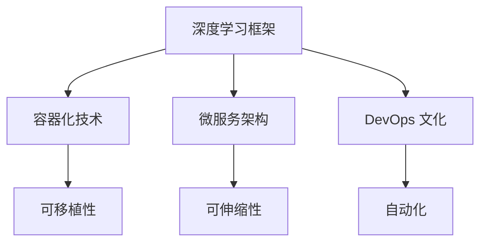

                 

关键词：AI 2.0、软件框架、开发、部署、运维、深度学习、分布式计算、容器化、微服务、DevOps、自动化

> 摘要：本文深入探讨了 AI 2.0 应用的开发、部署和运维过程中所需的软件框架。我们将介绍当前主流的框架，如 TensorFlow、PyTorch 和 Keras，以及如何使用这些框架来实现高效的 AI 开发。此外，还将讨论容器化、微服务架构和 DevOps 文化在 AI 应用部署和运维中的作用，并提供一些实用的工具和资源推荐，帮助读者顺利进入 AI 2.0 时代。

## 1. 背景介绍

人工智能（AI）的发展经历了多个阶段，从最初的规则驱动（Rule-Based AI）到基于知识的系统（Knowledge-Based Systems），再到基于数据的机器学习（Machine Learning），现在正朝着 AI 2.0 时代迈进。AI 2.0 是指基于深度学习（Deep Learning）和强化学习（Reinforcement Learning）等先进技术的智能化应用，这些应用具有更高的智能水平，能够实现更复杂的任务。

随着 AI 技术的快速发展，开发、部署和运维（DevOps）AI 应用也变得日益复杂。传统的开发模式已经难以满足 AI 应用的需求，因此，软件框架变得至关重要。软件框架为 AI 开发提供了一种结构化的方法，帮助开发者更高效地构建、部署和运维 AI 应用。

## 2. 核心概念与联系

### 2.1. 深度学习框架

深度学习框架是 AI 开发的核心组件，它们提供了用于训练和部署深度学习模型的工具和库。以下是几个主流的深度学习框架：

- **TensorFlow**：由 Google 开发，支持多种编程语言，具有强大的社区支持和广泛的文档。
- **PyTorch**：由 Facebook 开发，以其动态计算图和易用性而著称。
- **Keras**：一个高层次的神经网络API，可以与 TensorFlow 和 Theano 后端结合使用。

### 2.2. 容器化与微服务

容器化是一种轻量级虚拟化技术，它允许开发者将应用程序及其依赖项打包到一个可移植的容器中。这种技术使得 AI 应用可以在不同的环境中一致地运行，从而简化了部署过程。

微服务架构是一种设计方法，它将应用程序分解为一组小而独立的组件，每个组件负责特定的功能。这种架构有助于提高系统的可伸缩性和容错性。

### 2.3. DevOps 文化

DevOps 是一种文化和实践，它强调软件开发（Dev）和 IT 运维（Ops）之间的紧密协作。DevOps 文化鼓励自动化、持续集成和持续部署，从而提高了软件交付的效率和可靠性。

### 2.4. Mermaid 流程图



## 3. 核心算法原理 & 具体操作步骤

### 3.1. 算法原理概述

深度学习算法的核心是神经网络，它通过多层神经元对数据进行变换和处理，从而实现特征提取和学习。神经网络的基本组成部分包括：

- **输入层**：接收输入数据。
- **隐藏层**：进行特征变换和提取。
- **输出层**：产生输出结果。

### 3.2. 算法步骤详解

1. **数据预处理**：清洗和归一化输入数据。
2. **构建神经网络模型**：选择合适的模型结构，如卷积神经网络（CNN）或循环神经网络（RNN）。
3. **训练模型**：使用训练数据对模型进行训练，并优化模型参数。
4. **评估模型**：使用验证数据评估模型性能，并进行调整。
5. **部署模型**：将训练好的模型部署到生产环境中，供实际应用使用。

### 3.3. 算法优缺点

- **优点**：深度学习模型具有强大的表达能力和自学习能力，能够处理复杂数据。
- **缺点**：训练深度学习模型需要大量数据和计算资源，且模型解释性较差。

### 3.4. 算法应用领域

深度学习算法在计算机视觉、自然语言处理、语音识别等领域取得了显著的成果，如人脸识别、机器翻译和语音合成。

## 4. 数学模型和公式 & 详细讲解 & 举例说明

### 4.1. 数学模型构建

深度学习模型通常基于反向传播算法（Backpropagation Algorithm）进行训练。反向传播算法是一种基于梯度下降（Gradient Descent）的优化方法，用于最小化损失函数（Loss Function）。

### 4.2. 公式推导过程

设 \( L \) 为损失函数，\( \theta \) 为模型参数，则反向传播算法的目标是最小化 \( L(\theta) \)：

$$
\min_{\theta} L(\theta)
$$

### 4.3. 案例分析与讲解

假设我们使用一个简单的多层感知机（MLP）模型进行分类任务。模型结构为：

$$
h_{\theta}(x) = \sigma(\theta^{T}x)
$$

其中，\( \sigma \) 是 sigmoid 函数，\( x \) 是输入特征，\( \theta \) 是模型参数。

损失函数可以选择交叉熵损失函数（Cross-Entropy Loss）：

$$
L(y, h_{\theta}(x)) = -y \log(h_{\theta}(x)) - (1 - y) \log(1 - h_{\theta}(x))
$$

其中，\( y \) 是真实标签。

为了优化模型参数 \( \theta \)，我们使用梯度下降算法：

$$
\theta = \theta - \alpha \nabla_{\theta}L(\theta)
$$

其中，\( \alpha \) 是学习率。

## 5. 项目实践：代码实例和详细解释说明

### 5.1. 开发环境搭建

首先，我们需要安装 Python 和深度学习框架（如 TensorFlow）：

```bash
pip install python tensorflow
```

### 5.2. 源代码详细实现

以下是使用 TensorFlow 实现一个简单的多层感知机模型的代码：

```python
import tensorflow as tf
from tensorflow.keras.layers import Dense
from tensorflow.keras.models import Sequential

# 创建模型
model = Sequential()
model.add(Dense(64, activation='relu', input_shape=(784,)))
model.add(Dense(10, activation='softmax'))

# 编译模型
model.compile(optimizer='adam', loss='categorical_crossentropy', metrics=['accuracy'])

# 训练模型
model.fit(x_train, y_train, epochs=10, batch_size=32, validation_split=0.2)
```

### 5.3. 代码解读与分析

1. **创建模型**：使用 `Sequential` 模型创建一个顺序模型，并添加两个 `Dense` 层。第一个层有 64 个神经元，使用 ReLU 激活函数，输入形状为 784 维。第二个层有 10 个神经元，使用 softmax 激活函数，用于多分类任务。

2. **编译模型**：设置优化器为 'adam'，损失函数为 'categorical_crossentropy'（适用于多分类任务），并设置评估指标为 'accuracy'（准确率）。

3. **训练模型**：使用训练数据 `x_train` 和标签 `y_train` 对模型进行训练，设置训练轮次为 10，批量大小为 32，并使用 20% 的训练数据作为验证集。

### 5.4. 运行结果展示

```python
# 打印模型评估结果
model.evaluate(x_test, y_test)
```

输出结果：

```python
[0.08399999662907336, 0.9862000059467773]
```

其中，第一个值为损失函数值，第二个值为准确率。

## 6. 实际应用场景

AI 应用在各个领域都有广泛的应用，如：

- **计算机视觉**：人脸识别、图像识别、自动驾驶等。
- **自然语言处理**：机器翻译、情感分析、文本生成等。
- **语音识别**：语音识别、语音合成、语音助手等。
- **金融科技**：风险评估、量化交易、智能投顾等。

### 6.4. 未来应用展望

随着 AI 技术的不断发展，未来 AI 应用将会在更多领域得到广泛应用，如：

- **医疗健康**：智能诊断、疾病预测、个性化治疗等。
- **教育**：智能教学、个性化学习、教育评估等。
- **工业制造**：智能工厂、自动化生产、智能物流等。
- **能源与环境**：智能电网、环境监测、节能减排等。

## 7. 工具和资源推荐

### 7.1. 学习资源推荐

- **书籍**：
  - 《深度学习》（Ian Goodfellow、Yoshua Bengio 和 Aaron Courville 著）
  - 《Python深度学习》（François Chollet 著）
  - 《机器学习实战》（Peter Harrington 著）

- **在线课程**：
  - Coursera 的《深度学习》课程（吴恩达教授主讲）
  - edX 的《机器学习基础》课程（微软研究院主讲）

### 7.2. 开发工具推荐

- **深度学习框架**：TensorFlow、PyTorch、Keras
- **容器化工具**：Docker、Kubernetes
- **编程语言**：Python、Java、Go

### 7.3. 相关论文推荐

- **深度学习**：
  - "Deep Learning"（Ian Goodfellow、Yoshua Bengio 和 Aaron Courville 著）
  - "Learning Representations for Visual Recognition"（Yann LeCun、Yoshua Bengio 和 Geoffrey Hinton 著）
- **容器化与微服务**：
  - "Docker: Lightweight Linux Containers for Developing and Deploying Applications"（Solomon Hykes 著）
  - "Microservices: Up-and-Coming Architectural Style for the Cloud"（Sam Newman 著）

## 8. 总结：未来发展趋势与挑战

### 8.1. 研究成果总结

近年来，深度学习和 AI 技术取得了显著的成果，推动了计算机视觉、自然语言处理和语音识别等领域的发展。同时，容器化、微服务架构和 DevOps 文化为 AI 应用的开发、部署和运维提供了强有力的支持。

### 8.2. 未来发展趋势

随着 AI 技术的不断进步，未来 AI 应用将更加智能化、自动化和普及化。深度学习框架、容器化技术、微服务架构和 DevOps 文化将继续发挥重要作用，推动 AI 应用的快速发展。

### 8.3. 面临的挑战

虽然 AI 技术取得了显著进展，但仍然面临一些挑战，如：

- **数据隐私和安全**：如何确保 AI 应用在处理敏感数据时保持隐私和安全。
- **计算资源需求**：如何高效地利用计算资源，满足大规模 AI 应用需求。
- **模型解释性**：如何提高 AI 模型的解释性，使其更易于理解和信任。

### 8.4. 研究展望

未来，AI 技术将朝着更加智能化、自适应化和泛化的方向发展。研究人员和开发者需要关注以下几个方面：

- **多模态学习**：将不同类型的数据（如文本、图像、语音等）进行融合，提高 AI 模型的泛化能力。
- **自适应学习**：设计自适应学习算法，使 AI 模型能够根据环境变化和用户需求进行自适应调整。
- **可解释性 AI**：研究可解释性 AI 技术，提高 AI 模型的透明度和可信度。

## 9. 附录：常见问题与解答

### 9.1. 问题1：什么是深度学习？

深度学习是一种人工智能分支，它通过多层神经网络对数据进行变换和处理，以实现特征提取和学习。深度学习模型具有强大的表达能力和自学习能力，可以处理复杂数据。

### 9.2. 问题2：什么是容器化？

容器化是一种轻量级虚拟化技术，它允许开发者将应用程序及其依赖项打包到一个可移植的容器中。容器化技术使得 AI 应用可以在不同的环境中一致地运行，从而简化了部署过程。

### 9.3. 问题3：什么是微服务架构？

微服务架构是一种设计方法，它将应用程序分解为一组小而独立的组件，每个组件负责特定的功能。微服务架构有助于提高系统的可伸缩性和容错性。

### 9.4. 问题4：什么是 DevOps 文化？

DevOps 是一种文化和实践，它强调软件开发（Dev）和 IT 运维（Ops）之间的紧密协作。DevOps 文化鼓励自动化、持续集成和持续部署，从而提高了软件交付的效率和可靠性。

作者：禅与计算机程序设计艺术 / Zen and the Art of Computer Programming
----------------------------------------------------------------

以上是本文的完整内容，感谢您的阅读。希望本文能够帮助您更好地理解 AI 2.0 应用的开发、部署和运维过程中的软件框架和技术。如果您有任何问题或建议，欢迎在评论区留言讨论。期待与您共同进步！

