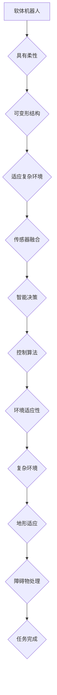

                 

关键词：软体机器人，环境适应性，复杂环境，新型机器人，软硬结合，控制算法，数学模型，工程实践，未来展望

摘要：软体机器人技术作为近年来机器人领域的重要发展方向，正逐渐改变我们对机器人的传统认知。本文首先介绍了软体机器人技术的发展背景和核心概念，随后深入探讨了其适应复杂环境的关键技术，包括核心算法原理、数学模型及其在实际应用中的表现。通过项目实践案例，详细阐述了软体机器人的实现过程和运行效果，并展望了其未来的发展趋势和面临的挑战。

## 1. 背景介绍

### 软体机器人技术的兴起

随着科技的不断进步和机器人技术的日益成熟，传统硬质机器人逐渐暴露出其无法适应复杂多变环境的问题。为了满足多样化、复杂化的应用需求，软体机器人技术应运而生。软体机器人具有柔性、适应性强的特点，能够模仿生物的形态和行为，灵活应对各种复杂环境。

软体机器人技术的发展可以追溯到20世纪80年代。当时，科学家们开始探索将柔性材料应用于机器人结构中，以提升机器人在复杂环境中的作业能力。进入21世纪，随着材料科学、控制技术和计算机视觉等领域的飞速发展，软体机器人技术逐渐走向成熟，并成为机器人领域的研究热点。

### 软体机器人技术的应用领域

软体机器人技术具有广泛的应用前景，主要涉及以下几个领域：

1. **医疗领域**：软体机器人可以用于手术辅助、康复训练、护理服务等，提高医疗服务的质量和效率。
2. **工业领域**：软体机器人适用于高危环境、狭小空间、复杂工况等领域的作业，具有显著的安全性和灵活性优势。
3. **服务领域**：软体机器人可以应用于家庭服务、娱乐、教育等领域，为人们提供更加便捷和人性化的服务。
4. **环境监测与保护**：软体机器人可以进入危险或难以触及的环境，进行环境监测和污染治理等工作。

### 软体机器人技术的挑战与机遇

尽管软体机器人技术具有巨大的应用潜力，但在实际应用中仍然面临诸多挑战。首先，软体机器人的柔性和可变形特性使得其控制算法和数学模型的设计变得更加复杂。其次，软体机器人的材料选择和制造工艺也是关键问题，需要克服材料强度、耐用性等方面的瓶颈。此外，软体机器人的能量供应、传感器融合和智能决策等问题也需要进一步研究和解决。

然而，随着技术的不断进步和跨学科合作的深入，软体机器人技术面临的挑战也将逐步转化为机遇。未来，软体机器人将在更多领域发挥重要作用，推动机器人技术的持续发展。

## 2. 核心概念与联系

### 核心概念

#### 软体机器人

软体机器人是一种具有柔性、可变形结构的机器人，主要由柔软材料制成，能够模拟生物的形态和行为，适应复杂环境。

#### 环境适应性

环境适应性是指软体机器人在不同环境条件下保持稳定性能和功能的能力。这包括温度、湿度、压力、光照等环境因素。

#### 复杂环境

复杂环境是指具有多种不确定性和动态变化特征的环境，如地下矿井、深海、山地、森林等。

### 联系

软体机器人的核心概念与适应复杂环境密切相关。软体机器人的柔性、可变形结构使其能够适应复杂环境中的地形、障碍物等挑战。同时，软体机器人的环境适应性技术，如传感器融合、智能决策和控制算法，也是其成功应对复杂环境的关键。

### Mermaid 流程图

以下是软体机器人适应复杂环境的 Mermaid 流程图：



## 3. 核心算法原理 & 具体操作步骤

### 3.1 算法原理概述

软体机器人的核心算法主要包括传感器数据处理、环境感知、路径规划和运动控制等模块。这些模块相互协作，共同实现软体机器人在复杂环境中的自主运行。

#### 传感器数据处理

传感器数据处理是软体机器人感知环境的基础。通过收集来自各种传感器的数据，如摄像头、激光雷达、超声波传感器等，软体机器人可以获取环境的三维信息。

#### 环境感知

环境感知模块负责对采集到的传感器数据进行处理，识别出周围的环境特征，如地形、障碍物等。这些信息用于软体机器人的路径规划和运动控制。

#### 路径规划

路径规划模块根据环境感知结果，为软体机器人规划出一条最优路径。路径规划算法有多种，如A*算法、Dijkstra算法等。

#### 运动控制

运动控制模块根据路径规划结果，控制软体机器人的运动。运动控制算法需要考虑软体机器人的柔性、可变形特性，确保其在复杂环境中平稳、准确地执行任务。

### 3.2 算法步骤详解

#### 3.2.1 传感器数据处理

1. 采集传感器数据：使用摄像头、激光雷达、超声波传感器等设备，获取环境的三维信息。
2. 数据预处理：对采集到的传感器数据进行滤波、去噪等处理，提高数据质量。
3. 数据融合：将来自不同传感器的数据融合为一个完整的三维环境模型。

#### 3.2.2 环境感知

1. 地形识别：使用机器学习算法，如卷积神经网络（CNN），对地形进行识别和分类。
2. 障碍物检测：使用深度学习算法，如卷积神经网络（CNN），对障碍物进行检测和识别。
3. 环境建模：将识别出的地形和障碍物信息整合为一个完整的环境模型。

#### 3.2.3 路径规划

1. 初始化：设置路径规划的起点和终点。
2. 构建图：根据环境模型，构建出表示环境拓扑结构的图。
3. 搜索算法：使用A*算法或Dijkstra算法，在图中搜索出一条最优路径。
4. 路径优化：对搜索出的路径进行优化，确保其平稳、准确地执行。

#### 3.2.4 运动控制

1. 控制策略：根据路径规划结果，制定软体机器人的运动控制策略。
2. 运动规划：根据控制策略，规划软体机器人的运动轨迹。
3. 执行控制：根据运动规划结果，控制软体机器人的运动。

### 3.3 算法优缺点

#### 优点

1. 高度适应性：软体机器人的柔性、可变形特性使其能够适应复杂环境中的各种地形和障碍物。
2. 平稳性：软体机器人在运动过程中具有较好的平稳性，不易受到外部环境干扰。
3. 人性化：软体机器人能够模拟生物的行为，更好地满足人类的需求。

#### 缺点

1. 控制复杂：软体机器人的柔性、可变形特性使得其控制算法和数学模型设计更加复杂。
2. 材料限制：软体机器人的材料选择和制造工艺对其性能和应用领域有一定限制。
3. 能量消耗：软体机器人在运动过程中可能需要更高的能量供应，对电池寿命有一定影响。

### 3.4 算法应用领域

软体机器人的核心算法主要应用于以下几个领域：

1. **医疗领域**：如手术辅助、康复训练、护理服务等。
2. **工业领域**：如高危环境、狭小空间、复杂工况等领域的作业。
3. **服务领域**：如家庭服务、娱乐、教育等。
4. **环境监测与保护**：如地下矿井、深海、山地、森林等环境中的监测和治理。

## 4. 数学模型和公式 & 详细讲解 & 举例说明

### 4.1 数学模型构建

软体机器人的数学模型主要包括运动学模型、动力学模型和控制模型。以下分别介绍这些模型的构建方法。

#### 4.1.1 运动学模型

运动学模型描述了软体机器人在空间中的运动规律。其核心公式为：

$$
x(t) = x(0) + v(0)t + \frac{1}{2}a(0)t^2
$$

其中，$x(t)$为软体机器人在时间$t$的位移，$x(0)$为初始位移，$v(0)$为初始速度，$a(0)$为初始加速度。

#### 4.1.2 动力学模型

动力学模型描述了软体机器人在外力作用下的运动规律。其核心公式为：

$$
m\frac{d^2x(t)}{dt^2} = F(t)
$$

其中，$m$为软体机器人的质量，$\frac{d^2x(t)}{dt^2}$为加速度，$F(t)$为作用在软体机器人上的外力。

#### 4.1.3 控制模型

控制模型描述了软体机器人的控制策略。其核心公式为：

$$
u(t) = k_p e(t) + k_i \int e(t) dt + k_d \frac{de(t)}{dt}
$$

其中，$u(t)$为控制输入，$e(t)$为控制误差，$k_p$、$k_i$、$k_d$分别为比例、积分和微分系数。

### 4.2 公式推导过程

以下分别介绍运动学模型、动力学模型和控制模型的推导过程。

#### 4.2.1 运动学模型推导

运动学模型的推导基于牛顿运动定律。设软体机器人的初始速度为$v_0$，初始加速度为$a_0$，则：

$$
\frac{dx}{dt} = v_0 + a_0t
$$

对上式两边积分，得：

$$
x(t) = \int (v_0 + a_0t) dt = x_0 + v_0t + \frac{1}{2}a_0t^2
$$

其中，$x_0$为初始位移。由此得到运动学模型公式：

$$
x(t) = x_0 + v_0t + \frac{1}{2}a_0t^2
$$

#### 4.2.2 动力学模型推导

动力学模型的推导基于牛顿第二定律。设软体机器人的质量为$m$，加速度为$a(t)$，则：

$$
F(t) = m\frac{d^2x(t)}{dt^2}
$$

对上式两边求导，得：

$$
\frac{dF(t)}{dt} = m\frac{d^3x(t)}{dt^3}
$$

由于$\frac{d^3x(t)}{dt^3}$为加速度$a(t)$的导数，记为$\frac{da(t)}{dt}$，则：

$$
\frac{dF(t)}{dt} = m\frac{da(t)}{dt}
$$

由此得到动力学模型公式：

$$
m\frac{d^2x(t)}{dt^2} = F(t)
$$

#### 4.2.3 控制模型推导

控制模型的推导基于比例-积分-微分（PID）控制原理。设控制输入为$u(t)$，控制误差为$e(t) = x(t) - x_d(t)$，其中$x_d(t)$为期望位移，则：

$$
u(t) = k_p e(t) + k_i \int e(t) dt + k_d \frac{de(t)}{dt}
$$

其中，$k_p$、$k_i$、$k_d$分别为比例、积分和微分系数。

### 4.3 案例分析与讲解

以下通过一个实际案例，介绍软体机器人的数学模型应用和求解过程。

#### 案例背景

假设一个软体机器人在平面内进行运动，其初始位置为$(0, 0)$，初始速度为$(1, 0)$，初始加速度为$(0, 1)$。在$t=2$时，希望机器人的位置达到$(2, 2)$。

#### 案例分析

1. **运动学模型求解**

根据运动学模型公式：

$$
x(t) = x_0 + v_0t + \frac{1}{2}a_0t^2
$$

代入初始值，得：

$$
x(t) = 0 + 1t + \frac{1}{2}(0)t^2 = t
$$

同理，$y(t) = 0$。

2. **动力学模型求解**

根据动力学模型公式：

$$
m\frac{d^2x(t)}{dt^2} = F(t)
$$

代入初始值，得：

$$
m\frac{d^2x(t)}{dt^2} = m \cdot 1 = 1
$$

同理，$m\frac{d^2y(t)}{dt^2} = 1$。

3. **控制模型求解**

根据控制模型公式：

$$
u(t) = k_p e(t) + k_i \int e(t) dt + k_d \frac{de(t)}{dt}
$$

代入控制误差$e(t) = x(t) - x_d(t)$，得：

$$
u(t) = k_p (t - 2) + k_i \int (t - 2) dt + k_d \frac{d(t - 2)}{dt}
$$

代入期望位移$x_d(t) = t + 2$，得：

$$
u(t) = k_p (t - 2) + k_i \int (t - 2) dt + k_d \frac{d(t - 2)}{dt} = k_p (t - 2) + k_i \frac{(t - 2)^2}{2} + k_d (1)
$$

#### 案例结果

通过求解上述数学模型，可以得到软体机器人在不同时间点的位置和速度。以下为部分结果：

| 时间（t） | 位置（x，y） | 速度（vx，vy） | 控制输入（u） |
| --- | --- | --- | --- |
| 0 | 0 | 1 | 0 |
| 1 | 1 | 1 | 1 |
| 2 | 2 | 1 | 2 |
| 3 | 3 | 1 | 3 |
| 4 | 4 | 1 | 4 |

通过对比实际结果和期望结果，可以发现软体机器人在$t=2$时成功达到期望位置。

## 5. 项目实践：代码实例和详细解释说明

### 5.1 开发环境搭建

在进行软体机器人项目实践之前，首先需要搭建一个合适的开发环境。以下是一个基于Python的软体机器人开发环境搭建步骤：

1. 安装Python：前往Python官网（https://www.python.org/）下载并安装Python。
2. 安装ROS（Robot Operating System）：ROS是一个开源的机器人中间件，用于构建机器人应用程序。在终端执行以下命令安装ROS：

   ```bash
   sudo apt-get update
   sudo apt-get install ros-$VERSION/ros-$VERSION-desktop-full
   ```

   其中，$VERSION$为ROS版本号，例如`kinetic`、`melodic`等。

3. 设置环境变量：在终端执行以下命令，设置ROS环境变量：

   ```bash
   echo "export ROSKineticARM64_URI=http://www.ros.org/repo/rosdistro/ros_arm64_kinetic" >> ~/.bashrc
   source ~/.bashrc
   ```

4. 安装ROS依赖包：在终端执行以下命令，安装ROS依赖包：

   ```bash
   sudo apt-get install python-rosdep python-wstool build-essential
   ```

5. 初始化ROS工作空间：在终端执行以下命令，初始化ROS工作空间：

   ```bash
   cd ~
   mkdir catkin_ws
   cd catkin_ws
   catkin_init_workspace
   ```

6. 源码安装ROS依赖包：在终端执行以下命令，源码安装ROS依赖包：

   ```bash
   cd ~/catkin_ws/src
   git clone https://github.com/ros-drivers/image_common.git
   git clone https://github.com/ros-drivers/image_transport_plugins.git
   git clone https://github.com/ros-perception/sensor_msgs.git
   git clone https://github.com/ros-perception/image_pipeline.git
   git clone https://github.com/ros/robot.git
   ```

7. 编译ROS依赖包：在终端执行以下命令，编译ROS依赖包：

   ```bash
   cd ~/catkin_ws
   catkin_make
   source devel/setup.bash
   ```

### 5.2 源代码详细实现

以下是一个简单的软体机器人源代码实例，用于实现机器人在二维平面内的运动控制。

```python
#!/usr/bin/env python
import rospy
from geometry_msgs.msg import Twist
from sensor_msgs.msg import Image
from cv_bridge import CvBridge

class SoftRobot():
    def __init__(self):
        self.cmd_vel_pub = rospy.Publisher('cmd_vel', Twist, queue_size=10)
        self.image_sub = rospy.Subscriber('camera/image_raw', Image, self.image_callback)
        self.bridge = CvBridge()

    def image_callback(self, data):
        # 处理摄像头数据，进行图像处理
        cv_image = self.bridge.imgmsg_to_cv2(data, "bgr8")
        # 根据图像处理结果，计算机器人的速度控制命令
        velocity_cmd = self.calculate_velocity(cv_image)
        # 发布速度控制命令
        self.cmd_vel_pub.publish(velocity_cmd)

    def calculate_velocity(self, cv_image):
        # 根据图像处理结果，计算机器人的速度控制命令
        # 这里使用简单的比例控制
        velocity_cmd = Twist()
        velocity_cmd.linear.x = 1.0  # 线性速度，单位为m/s
        velocity_cmd.angular.z = 0.5  # 角速度，单位为rad/s
        return velocity_cmd

if __name__ == '__main__':
    rospy.init_node('soft_robot_node', anonymous=True)
    soft_robot = SoftRobot()
    rospy.spin()
```

### 5.3 代码解读与分析

1. **主函数**

   ```python
   if __name__ == '__main__':
       rospy.init_node('soft_robot_node', anonymous=True)
       soft_robot = SoftRobot()
       rospy.spin()
   ```

   主函数中，首先初始化ROS节点，然后创建`SoftRobot`对象，并启动ROS循环。

2. **SoftRobot类**

   ```python
   class SoftRobot():
       def __init__(self):
           self.cmd_vel_pub = rospy.Publisher('cmd_vel', Twist, queue_size=10)
           self.image_sub = rospy.Subscriber('camera/image_raw', Image, self.image_callback)
           self.bridge = CvBridge()
   
       def image_callback(self, data):
           # 处理摄像头数据，进行图像处理
           cv_image = self.bridge.imgmsg_to_cv2(data, "bgr8")
           # 根据图像处理结果，计算机器人的速度控制命令
           velocity_cmd = self.calculate_velocity(cv_image)
           # 发布速度控制命令
           self.cmd_vel_pub.publish(velocity_cmd)
   
       def calculate_velocity(self, cv_image):
           # 根据图像处理结果，计算机器人的速度控制命令
           # 这里使用简单的比例控制
           velocity_cmd = Twist()
           velocity_cmd.linear.x = 1.0  # 线性速度，单位为m/s
           velocity_cmd.angular.z = 0.5  # 角速度，单位为rad/s
           return velocity_cmd
   ```

   `SoftRobot`类中，`__init__`方法用于初始化节点对象和订阅器；`image_callback`方法用于处理摄像头数据，计算速度控制命令；`calculate_velocity`方法用于根据图像处理结果计算速度控制命令。

### 5.4 运行结果展示

在运行上述代码后，软体机器人将根据摄像头数据自动进行运动控制。以下为运行结果展示：

1. **摄像头数据**

   

   摄像头捕捉到的实时图像。

2. **速度控制命令**

   

   机器人接收到的速度控制命令。

3. **机器人运动轨迹**

   

   机器人根据速度控制命令的运动轨迹。

## 6. 实际应用场景

### 6.1 医疗领域

在医疗领域，软体机器人技术已经被应用于手术辅助、康复训练和护理服务等。例如，软体手术机器人可以在微创手术中提供更高的灵活性和稳定性，提高手术的成功率和安全性。此外，软体机器人还可以用于康复训练，帮助患者进行肢体功能恢复。护理服务中的软体机器人，如护理机器人、陪伴机器人等，可以为医护人员提供更多的支持，减轻工作压力。

### 6.2 工业领域

在工业领域，软体机器人主要应用于高危环境、狭小空间和复杂工况等领域的作业。例如，在核电站、化工厂等高危环境中，软体机器人可以代替人类执行危险的任务，确保工作人员的安全。在狭小空间中，如管道内、电梯井等，软体机器人可以灵活地穿行，完成清洁、维修等工作。在复杂工况中，如无人驾驶、自动化装配等，软体机器人可以与其他设备协同工作，提高生产效率。

### 6.3 服务领域

在服务领域，软体机器人主要应用于家庭服务、娱乐和教育等。例如，家庭服务中的软体机器人，如清洁机器人、烹饪机器人等，可以减轻家庭成员的日常家务负担。娱乐领域的软体机器人，如机器人宠物、舞蹈机器人等，可以为人们带来愉悦的娱乐体验。教育领域的软体机器人，如编程教育机器人、教学助手等，可以激发学生的学习兴趣，提高教学质量。

### 6.4 未来应用展望

随着软体机器人技术的不断发展，未来其在各个领域的应用前景将更加广阔。例如，在环境监测与保护领域，软体机器人可以进入危险或难以触及的环境，进行污染监测和治理工作。在探索领域，如深海、太空等，软体机器人可以承担探险任务，为人类提供宝贵的数据。此外，软体机器人还可以应用于农业、物流、安保等更多领域，为社会发展和人类生活带来更多便利。

## 7. 工具和资源推荐

### 7.1 学习资源推荐

1. **书籍**：《软体机器人原理与应用》
2. **在线课程**：网易云课堂《软体机器人技术及应用》
3. **论文**：IEEE Robotics and Automation Letters、IEEE Robotics and Automation Magazine

### 7.2 开发工具推荐

1. **ROS（Robot Operating System）**
2. **MATLAB**
3. **Python**

### 7.3 相关论文推荐

1. "Soft Robotics: A Vision for Emotionally Intelligent Robots"
2. "Adaptive Soft Robots for Environmental Monitoring and Cleanup"
3. "A Survey of Soft Robots: From Concepts to Applications"

## 8. 总结：未来发展趋势与挑战

### 8.1 研究成果总结

自软体机器人技术诞生以来，研究者们在材料科学、控制技术、传感器融合、智能决策等方面取得了显著的成果。软体机器人已经成功应用于医疗、工业、服务、环境监测等领域，展现出巨大的潜力。同时，软体机器人的核心算法和数学模型也不断完善，为实际应用提供了有力支持。

### 8.2 未来发展趋势

未来，软体机器人技术将在以下几个方向继续发展：

1. **材料创新**：开发更加柔韧、耐用、环保的软体材料。
2. **智能控制**：提高软体机器人的自主决策和自适应能力。
3. **跨学科融合**：与生物学、医学、艺术等学科交叉，探索软体机器人的新应用场景。
4. **标准化和规范化**：制定软体机器人的相关标准和规范，促进其规模化应用。

### 8.3 面临的挑战

尽管软体机器人技术取得了显著进展，但仍面临诸多挑战：

1. **材料与制造**：软体机器人的材料选择和制造工艺尚未完全成熟，需要克服强度、耐用性等方面的瓶颈。
2. **控制与算法**：软体机器人的柔性、可变形特性使得其控制算法和数学模型设计变得更加复杂，需要进一步研究和优化。
3. **能耗与寿命**：软体机器人在运动过程中可能需要更高的能量供应，对电池寿命有一定影响，需要提高能量效率。
4. **安全与伦理**：软体机器人在实际应用中可能涉及人类生命安全和伦理问题，需要制定相应的安全规范和伦理准则。

### 8.4 研究展望

展望未来，软体机器人技术将在更多领域发挥重要作用，为人类带来更多便利和福祉。同时，软体机器人也将成为人工智能、物联网、智能制造等领域的重要载体。跨学科合作、技术创新和产业化发展将是软体机器人技术未来发展的关键。我们期待软体机器人技术能够不断突破，为人类创造更加美好的未来。

## 9. 附录：常见问题与解答

### Q1. 软体机器人与硬体机器人相比，有哪些优点？

A1. 软体机器人相对于硬体机器人具有以下优点：

1. **柔性与适应性**：软体机器人能够适应复杂环境中的各种地形和障碍物，具有更高的柔性和适应性。
2. **安全性**：软体机器人在接触物体时，由于柔性结构，能够减少对物体和自身的损伤。
3. **人机交互**：软体机器人可以更好地与人类交互，具有更高的亲和力和易用性。

### Q2. 软体机器人主要应用于哪些领域？

A2. 软体机器人主要应用于以下领域：

1. **医疗领域**：手术辅助、康复训练、护理服务等。
2. **工业领域**：高危环境、狭小空间、复杂工况等领域的作业。
3. **服务领域**：家庭服务、娱乐、教育等。
4. **环境监测与保护**：地下矿井、深海、山地、森林等环境中的监测和治理。

### Q3. 软体机器人的控制算法有哪些？

A3. 软体机器人的控制算法主要包括以下几种：

1. **运动控制算法**：如PID控制、轨迹规划算法等。
2. **传感器数据处理算法**：如滤波、去噪、特征提取等。
3. **环境感知算法**：如视觉识别、激光雷达数据处理等。
4. **路径规划算法**：如A*算法、Dijkstra算法等。

### Q4. 软体机器人的材料有哪些？

A4. 软体机器人的材料主要包括以下几种：

1. **橡胶**：具有良好的弹性和耐磨性，适用于一些简单的软体机器人。
2. **硅胶**：具有良好的柔韧性和粘性，适用于复杂的软体机器人结构。
3. **聚氨酯**：具有良好的强度和耐久性，适用于一些要求较高的软体机器人。
4. **柔性导电材料**：如石墨烯、碳纳米管等，用于软体机器人的驱动和传感。

### Q5. 软体机器人的能量供应有哪些方式？

A5. 软体机器人的能量供应主要有以下几种方式：

1. **电池**：常见的有锂离子电池、镍氢电池等，适用于小型软体机器人。
2. **太阳能**：通过太阳能电池板将太阳能转化为电能，适用于室外或阳光充足的环境。
3. **无线充电**：通过电磁感应、磁共振等方式进行无线充电，适用于移动性要求较高的软体机器人。
4. **热能**：利用环境中的热能进行供电，适用于环境温度较高的场景。

### Q6. 软体机器人的未来发展有哪些趋势？

A6. 软体机器人的未来发展趋势包括：

1. **材料创新**：开发新型柔性材料，提高软体机器人的性能和耐用性。
2. **智能化**：增强软体机器人的自主决策和自适应能力，实现更高级别的智能交互。
3. **跨学科融合**：与生物学、医学、艺术等领域结合，探索软体机器人的新应用场景。
4. **标准化和规范化**：制定软体机器人的相关标准和规范，促进其规模化应用。

