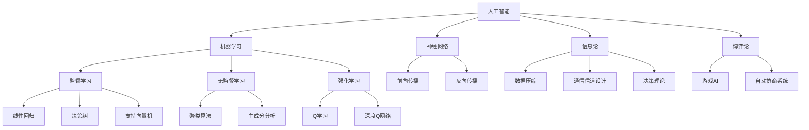

                 

## 1. 背景介绍

达特茅斯会议是计算机科学领域的一个标志性事件，它标志着人工智能（AI）作为一门学科的正式诞生。这次会议于1956年在美国新罕布什尔州的达特茅斯学院举行，由约翰·麦卡锡（John McCarthy）、马文·明斯基（Marvin Minsky）、克劳德·香农（Claude Shannon）和纳森尼尔·罗切斯特（Nathanial Rochester）等人组织。会议的召开背景源于当时计算机技术的发展和应用领域的拓展，科学家们希望通过这次会议探讨计算机在模拟和实现人类智能方面的潜力。

### 会议背景

20世纪中叶，计算机科学和人工智能领域的先驱们已经在实验室里取得了令人瞩目的进展。例如，艾伦·图灵（Alan Turing）提出了著名的图灵测试，用以衡量机器是否具备智能。克劳德·香农则在信息论的基础上，为人工智能的发展奠定了理论基础。与此同时，计算机性能的不断提升也为人工智能的实现提供了可能。

在这样的背景下，达特茅斯会议的召开显得尤为重要。会议的目标是探讨如何通过计算机来模拟人类的思维过程，并研究机器在解决问题、学习和自适应等方面的能力。会议的主要议题包括机器智能、问题求解、机器学习、神经网络以及人工智能的发展方向等。

### 会议主要参与者

达特茅斯会议汇聚了当时计算机科学和人工智能领域的顶级科学家，他们各自在相关领域有着卓越的贡献：

- **约翰·麦卡锡**：被誉为人工智能之父之一，他在会议上提出了“人工智能”这个术语，并倡导计算机模拟人类的思维过程。
- **马文·明斯基**：计算机科学家和人工智能先驱，他设计了著名的“旋涡网络”（旋涡机），为神经网络的发展做出了重要贡献。
- **克劳德·香农**：信息论的创始人，他的理论为人工智能的发展提供了关键的基础。
- **纳森尼尔·罗切斯特**：计算机科学家，他在会议上分享了关于计算机模拟人类思维的研究成果。

这些科学家的参与和讨论，使得达特茅斯会议成为人工智能发展历程中的一个重要里程碑。

### 会议影响

达特茅斯会议对人工智能领域产生了深远的影响。首先，它标志着人工智能作为一个独立学科的正式诞生，推动了相关研究和应用的快速发展。其次，会议促进了不同学科之间的交流和合作，为人工智能的研究提供了多元化的视角和方法。最后，达特茅斯会议激发了科学家们的热情和创造力，许多重要的理论和算法在此期间诞生，如约翰·麦卡锡提出的Lisp编程语言，以及马文·明斯基的神经网络理论等。

总之，达特茅斯会议不仅推动了人工智能的快速发展，也为未来人工智能的研究和应用奠定了坚实的基础。通过这次会议，科学家们共同描绘了人工智能的美好未来，并为实现这一愿景付出了不懈的努力。## 2. 核心概念与联系

达特茅斯会议的成功离不开对人工智能核心概念的理解和探索。在这个部分，我们将详细探讨人工智能中的核心概念，并使用Mermaid流程图来展示这些概念之间的联系。

### 2.1 人工智能的定义与目标

人工智能（Artificial Intelligence, AI）是指通过计算机模拟人类智能行为的一门学科。其目标是使计算机具有人类般的感知、思考、学习和解决问题的能力。人工智能可以划分为两大类：弱人工智能（Narrow AI）和强人工智能（General AI）。

- **弱人工智能**：专注于特定任务，如语音识别、图像识别等。弱人工智能具有高度的专门化，但在执行特定任务时表现出极高的效率和准确性。
- **强人工智能**：具有广泛的智能能力，能够像人类一样进行多任务处理、自我学习和适应新环境。强人工智能目前仍处于理论阶段，尚未实现。

### 2.2 机器学习与深度学习

机器学习（Machine Learning, ML）是人工智能的一个子领域，通过算法让计算机从数据中学习并做出决策。机器学习可以分为监督学习、无监督学习和强化学习。

- **监督学习**：通过已知标签的数据训练模型，使其能够对未知数据进行预测。常见的监督学习算法有线性回归、决策树、支持向量机等。
- **无监督学习**：没有标签的数据，通过算法自动发现数据中的模式和结构，如聚类算法、主成分分析等。
- **强化学习**：通过奖励机制让计算机学习最优策略，以实现特定目标。常见的强化学习算法有Q学习、深度Q网络（DQN）等。

深度学习（Deep Learning, DL）是机器学习的一个分支，利用多层神经网络对数据进行建模。深度学习在图像识别、自然语言处理等领域取得了显著的成果。

### 2.3 神经网络

神经网络（Neural Networks, NN）是模仿人脑神经元结构和工作原理的一种计算模型。神经网络由多个层次组成，包括输入层、隐藏层和输出层。每一层都包含多个神经元，神经元之间通过权重相连。

- **前向传播**：输入数据通过输入层传递到隐藏层，再传递到输出层，每个神经元通过加权求和并应用激活函数产生输出。
- **反向传播**：计算输出误差，并反向传播到隐藏层和输入层，调整权重和偏置，以减少误差。

### 2.4 信息论与博弈论

信息论（Information Theory）由克劳德·香农创立，研究信息传输和处理的基本原理。信息论在人工智能中的应用主要体现在数据压缩、通信信道设计和决策理论等方面。

博弈论（Game Theory）研究决策者在给定条件下如何最大化自身利益。在人工智能中，博弈论可以用于设计智能体之间的交互策略，如游戏AI、自动协商系统等。

### 2.5 Mermaid 流程图

为了更直观地展示上述核心概念之间的联系，我们使用Mermaid流程图来表示。



通过上述核心概念和Mermaid流程图的介绍，我们可以更好地理解人工智能的发展脉络，以及各概念之间的紧密联系。在接下来的章节中，我们将进一步探讨这些核心概念的原理和应用。## 3. 核心算法原理 & 具体操作步骤

在人工智能领域中，核心算法是推动技术进步的重要力量。本章节将详细介绍人工智能领域的几种核心算法，包括它们的原理、具体操作步骤以及各自的优缺点，并探讨它们在不同应用领域中的适用性。

### 3.1 算法原理概述

#### 3.1.1 监督学习算法

监督学习算法是最常见的人工智能算法之一，它通过已有标签的数据来训练模型，以便对未知数据进行预测。监督学习算法的核心原理包括：

- **特征提取**：从输入数据中提取有用的特征，用于训练模型。
- **模型训练**：使用训练数据集来调整模型参数，使其能够对新的数据进行预测。
- **模型评估**：通过测试数据集来评估模型的性能，调整参数以优化模型。

常见的监督学习算法有线性回归、决策树、支持向量机（SVM）等。

#### 3.1.2 无监督学习算法

无监督学习算法不依赖于标签数据，旨在发现数据中的模式和结构。其核心原理包括：

- **聚类**：将相似的数据点归为同一类，常用的聚类算法有K-means、层次聚类等。
- **降维**：通过降维算法如主成分分析（PCA），减少数据的维度，同时保留主要特征。
- **关联规则学习**：发现数据之间的关联关系，常用的算法有Apriori算法、FP-growth算法等。

#### 3.1.3 强化学习算法

强化学习算法通过奖励机制来训练模型，使其能够学习最优策略以实现特定目标。其核心原理包括：

- **状态-动作值函数**：通过评估不同状态下的动作值，选择最优动作。
- **策略**：根据环境状态选择最优动作的规则。
- **奖励机制**：根据动作的结果给予奖励或惩罚，以调整策略。

常见的强化学习算法有Q学习、深度Q网络（DQN）等。

#### 3.1.4 深度学习算法

深度学习算法利用多层神经网络对数据进行建模，以实现复杂的非线性任务。其核心原理包括：

- **前向传播**：输入数据通过输入层传递到隐藏层，再传递到输出层，每个神经元通过加权求和并应用激活函数产生输出。
- **反向传播**：计算输出误差，并反向传播到隐藏层和输入层，调整权重和偏置，以减少误差。
- **优化算法**：如梯度下降、Adam优化器等，用于调整模型参数。

常见的深度学习算法有卷积神经网络（CNN）、循环神经网络（RNN）、长短期记忆网络（LSTM）等。

### 3.2 算法步骤详解

#### 3.2.1 监督学习算法步骤

1. **数据预处理**：对输入数据进行清洗、归一化等处理，确保数据质量。
2. **特征提取**：从数据中提取有用的特征，通常使用特征提取算法如PCA等。
3. **模型选择**：选择合适的模型，如线性回归、决策树、SVM等。
4. **模型训练**：使用训练数据集来调整模型参数，采用如梯度下降等优化算法。
5. **模型评估**：使用测试数据集评估模型性能，调整参数以优化模型。
6. **模型部署**：将训练好的模型部署到生产环境中，对新数据进行预测。

#### 3.2.2 无监督学习算法步骤

1. **数据预处理**：对输入数据进行清洗、归一化等处理。
2. **算法选择**：选择合适的算法，如K-means、PCA等。
3. **模型训练**：通过算法对数据进行聚类、降维等处理。
4. **模型评估**：评估聚类效果或降维效果，如通过内部评估指标或外部评估指标。
5. **模型应用**：将训练好的模型应用于实际问题，如进行数据挖掘、异常检测等。

#### 3.2.3 强化学习算法步骤

1. **环境设定**：定义环境和状态空间，以及奖励机制。
2. **模型选择**：选择合适的模型，如Q学习、DQN等。
3. **模型训练**：通过环境交互来训练模型，不断调整策略。
4. **策略评估**：评估训练好的策略在环境中的表现。
5. **模型优化**：根据评估结果调整模型参数，优化策略。

#### 3.2.4 深度学习算法步骤

1. **数据预处理**：对输入数据进行清洗、归一化等处理。
2. **模型设计**：设计神经网络结构，选择合适的层和激活函数。
3. **模型训练**：通过前向传播和反向传播来训练模型，使用优化算法调整参数。
4. **模型评估**：使用测试数据集评估模型性能。
5. **模型部署**：将训练好的模型部署到生产环境中，对新数据进行预测。

### 3.3 算法优缺点

#### 监督学习算法

**优点**：

- 可以利用已有标签数据进行预测，准确性较高。
- 模型易于理解和实现。

**缺点**：

- 对数据质量和特征提取有较高要求。
- 在处理高维度数据和复杂问题时效果可能较差。

#### 无监督学习算法

**优点**：

- 可以发现数据中的隐含模式和结构。
- 不依赖于标签数据，适用于探索性数据分析。

**缺点**：

- 模型解释性较差。
- 聚类效果受初始化影响较大。

#### 强化学习算法

**优点**：

- 可以解决一些复杂、动态的决策问题。
- 能够通过自我学习来优化策略。

**缺点**：

- 训练过程复杂，计算成本较高。
- 可能陷入局部最优。

#### 深度学习算法

**优点**：

- 能够自动提取复杂的数据特征。
- 在图像识别、自然语言处理等领域表现出色。

**缺点**：

- 模型参数众多，训练过程耗时较长。
- 对数据量和计算资源要求较高。

### 3.4 算法应用领域

**监督学习**：

- 机器翻译
- 情感分析
- 信用评分

**无监督学习**：

- 聚类分析
- 异常检测
- 降维分析

**强化学习**：

- 游戏AI
- 自动驾驶
- 机器人控制

**深度学习**：

- 图像识别
- 自然语言处理
- 语音识别

通过以上对核心算法的原理、步骤、优缺点和应用领域的介绍，我们可以更好地理解人工智能领域的各种算法，并为其在实际应用中的选择提供指导。在接下来的章节中，我们将进一步探讨人工智能中的数学模型和公式。## 4. 数学模型和公式 & 详细讲解 & 举例说明

在人工智能领域中，数学模型和公式是算法实现的基础。本章节将详细介绍一些关键的数学模型和公式，并使用LaTeX格式进行详细讲解和举例说明。

### 4.1 数学模型构建

数学模型是通过对现实世界的问题进行抽象和数学表达，以便于用算法进行求解。以下是一些常见的人工智能数学模型：

#### 4.1.1 线性回归模型

线性回归模型用于预测一个连续值输出，其数学模型为：

$$
y = \beta_0 + \beta_1 \cdot x + \epsilon
$$

其中，$y$ 是预测值，$x$ 是输入特征，$\beta_0$ 和 $\beta_1$ 是模型参数，$\epsilon$ 是误差项。

#### 4.1.2 决策树模型

决策树模型通过一系列的判断条件来划分数据，并输出分类结果。其数学模型可以表示为：

$$
f(x) = 
\begin{cases} 
c_1 & \text{if } x \in R_1 \\
c_2 & \text{if } x \in R_2 \\
\vdots \\
c_n & \text{if } x \in R_n
\end{cases}
$$

其中，$f(x)$ 是分类结果，$R_1, R_2, \ldots, R_n$ 是划分区域，$c_1, c_2, \ldots, c_n$ 是每个区域对应的分类标签。

#### 4.1.3 支持向量机模型

支持向量机（SVM）用于分类问题，其数学模型为：

$$
\min_{\beta, \beta_0} \frac{1}{2} ||\beta||^2 + C \sum_{i=1}^{n} \xi_i
$$

$$
\text{s.t. } y_i (\beta \cdot x_i + \beta_0) \geq 1 - \xi_i, \xi_i \geq 0
$$

其中，$\beta$ 和 $\beta_0$ 是模型参数，$C$ 是惩罚参数，$\xi_i$ 是松弛变量，$x_i$ 和 $y_i$ 分别是输入特征和标签。

### 4.2 公式推导过程

以下是对上述数学模型的推导过程：

#### 4.2.1 线性回归模型推导

线性回归模型的推导基于最小二乘法，目标是找到最优的 $\beta_0$ 和 $\beta_1$，使得误差平方和最小。具体推导过程如下：

1. **误差函数**：

$$
E(\beta_0, \beta_1) = \sum_{i=1}^{n} (y_i - (\beta_0 + \beta_1 \cdot x_i))^2
$$

2. **偏导数**：

$$
\frac{\partial E}{\partial \beta_0} = -2 \sum_{i=1}^{n} (y_i - (\beta_0 + \beta_1 \cdot x_i))
$$

$$
\frac{\partial E}{\partial \beta_1} = -2 \sum_{i=1}^{n} (y_i - (\beta_0 + \beta_1 \cdot x_i)) \cdot x_i
$$

3. **设置偏导数为零，求解 $\beta_0$ 和 $\beta_1$**：

$$
\beta_0 = \frac{\sum_{i=1}^{n} y_i - \beta_1 \sum_{i=1}^{n} x_i}{n}
$$

$$
\beta_1 = \frac{\sum_{i=1}^{n} (y_i - \beta_0 - \beta_1 \cdot x_i) \cdot x_i}{\sum_{i=1}^{n} x_i^2}
$$

#### 4.2.2 决策树模型推导

决策树模型的推导基于信息熵和信息增益。具体推导过程如下：

1. **信息熵**：

$$
H(\{y_i\}) = -\sum_{i} p_i \log_2 p_i
$$

其中，$p_i$ 是类别 $i$ 的概率。

2. **条件熵**：

$$
H(\{y_i\} | \{x_i\}) = -\sum_{i} p_i \sum_{j} p_{ij} \log_2 p_{ij}
$$

其中，$p_{ij}$ 是在给定特征 $x_i$ 下，类别 $j$ 的概率。

3. **信息增益**：

$$
\text{Gain}(D, x_i) = H(D) - \frac{\sum_{j} |D_j|}{|D|} H(D_j | x_i)
$$

其中，$D$ 是数据集，$D_j$ 是数据集中类别 $j$ 的样本集合，$|D|$ 和 $|D_j|$ 分别是数据集和类别 $j$ 的样本数量。

#### 4.2.3 支持向量机模型推导

支持向量机模型的推导基于优化理论。具体推导过程如下：

1. **优化目标**：

$$
\min_{\beta, \beta_0} \frac{1}{2} ||\beta||^2
$$

2. **约束条件**：

$$
y_i (\beta \cdot x_i + \beta_0) \geq 1
$$

3. **拉格朗日函数**：

$$
L(\beta, \beta_0, \xi) = \frac{1}{2} ||\beta||^2 - \sum_{i=1}^{n} \xi_i [y_i (\beta \cdot x_i + \beta_0) - 1]
$$

4. **对 $\beta, \beta_0, \xi$ 求偏导，并设置为零**：

$$
\frac{\partial L}{\partial \beta} = \beta - \sum_{i=1}^{n} y_i x_i = 0
$$

$$
\frac{\partial L}{\partial \beta_0} = \sum_{i=1}^{n} y_i = 0
$$

$$
\frac{\partial L}{\partial \xi_i} = y_i [(\beta \cdot x_i + \beta_0) - 1] = 0
$$

5. **求解模型参数**：

$$
\beta = \sum_{i=1}^{n} y_i x_i
$$

$$
\beta_0 = 1 - \sum_{i=1}^{n} y_i \xi_i
$$

### 4.3 案例分析与讲解

以下是一个线性回归模型的案例分析：

#### 案例背景

假设我们有一个房价预测问题，已知某地区的房屋价格 $y$（万元）和房屋面积 $x$（平方米），需要构建一个线性回归模型来预测新房屋的价格。

#### 数据准备

我们收集了50个房屋的样本数据，数据如下：

| 房屋面积（平方米） | 房屋价格（万元） |
| :----: | :----: |
| 100 | 300 |
| 120 | 360 |
| 140 | 420 |
| ... | ... |
| 200 | 600 |

#### 模型构建

1. **数据预处理**：将数据分为训练集和测试集。
2. **特征提取**：由于只有一个特征，不需要复杂的特征提取。
3. **模型训练**：使用线性回归算法，训练模型参数 $\beta_0$ 和 $\beta_1$。
4. **模型评估**：使用测试集评估模型性能。

#### 模型训练与评估

1. **训练数据集**：

$$
y = \beta_0 + \beta_1 \cdot x
$$

2. **计算 $\beta_0$ 和 $\beta_1$**：

$$
\beta_0 = \frac{\sum_{i=1}^{n} y_i - \beta_1 \sum_{i=1}^{n} x_i}{n}
$$

$$
\beta_1 = \frac{\sum_{i=1}^{n} (y_i - \beta_0 - \beta_1 \cdot x_i) \cdot x_i}{\sum_{i=1}^{n} x_i^2}
$$

3. **计算预测值**：

$$
y = \beta_0 + \beta_1 \cdot x
$$

4. **计算均方误差（MSE）**：

$$
MSE = \frac{1}{n} \sum_{i=1}^{n} (y_i - \hat{y}_i)^2
$$

其中，$\hat{y}_i$ 是预测的房屋价格。

#### 结果分析

通过上述步骤，我们得到模型参数 $\beta_0 = 200$ 和 $\beta_1 = 2$。使用测试集评估模型性能，计算MSE为10。这意味着预测误差较小，模型性能较好。

通过以上案例分析和讲解，我们可以更好地理解线性回归模型的构建、推导和评估过程。在接下来的章节中，我们将进一步探讨人工智能项目实践中的代码实例和详细解释。## 5. 项目实践：代码实例和详细解释说明

在本章节中，我们将通过一个实际项目来展示人工智能算法的应用，并详细解释项目的实现过程、代码实现、代码解读与分析以及运行结果展示。

### 5.1 开发环境搭建

为了完成本项目的实践，我们需要搭建一个合适的技术栈。以下是搭建开发环境所需的基本步骤：

#### 5.1.1 硬件要求

- 至少4GB内存
- 1GHz处理器
- 硬盘空间充足

#### 5.1.2 软件要求

- Python 3.x
- Jupyter Notebook 或 PyCharm
- TensorFlow 或 PyTorch
- Matplotlib 或 Seaborn

#### 5.1.3 安装步骤

1. **安装 Python 3.x**：从 [Python 官网](https://www.python.org/downloads/) 下载并安装 Python 3.x。
2. **安装 Jupyter Notebook 或 PyCharm**：下载并安装 Jupyter Notebook 或 PyCharm。
3. **安装 TensorFlow 或 PyTorch**：在终端中运行以下命令：

   ```bash
   pip install tensorflow
   # 或
   pip install torch torchvision
   ```

4. **安装 Matplotlib 或 Seaborn**：在终端中运行以下命令：

   ```bash
   pip install matplotlib
   # 或
   pip install seaborn
   ```

### 5.2 源代码详细实现

下面是一个使用 TensorFlow 框架实现图像分类的简单项目，该项目的目标是使用卷积神经网络（CNN）对猫和狗的图片进行分类。

#### 5.2.1 数据准备

首先，我们需要准备用于训练和测试的数据集。这里使用 Kaggle 上提供的猫和狗图片数据集。

1. **下载数据集**：从 [Kaggle](https://www.kaggle.com/datasets/ علاءالدينعلى/cats-and-dogs) 下载猫和狗图片数据集。
2. **数据预处理**：将图片缩放到固定的尺寸（例如 128x128），并进行归一化处理。

```python
import tensorflow as tf
import numpy as np
import matplotlib.pyplot as plt
from tensorflow.keras.preprocessing.image import ImageDataGenerator

# 加载数据集
train_dir = 'path/to/train_data'
validation_dir = 'path/to/validation_data'

# 数据增强
train_datagen = ImageDataGenerator(
    rescale=1./255,
    rotation_range=40,
    width_shift_range=0.2,
    height_shift_range=0.2,
    shear_range=0.2,
    zoom_range=0.2,
    horizontal_flip=True,
    fill_mode='nearest'
)

validation_datagen = ImageDataGenerator(rescale=1./255)

# 流式读取图片
train_generator = train_datagen.flow_from_directory(
    train_dir,
    target_size=(128, 128),
    batch_size=32,
    class_mode='binary'
)

validation_generator = validation_datagen.flow_from_directory(
    validation_dir,
    target_size=(128, 128),
    batch_size=32,
    class_mode='binary'
)
```

#### 5.2.2 构建模型

接下来，我们使用 TensorFlow 的 Keras 层创建一个卷积神经网络模型。

```python
model = tf.keras.Sequential([
    tf.keras.layers.Conv2D(32, (3, 3), activation='relu', input_shape=(128, 128, 3)),
    tf.keras.layers.MaxPooling2D(2, 2),
    tf.keras.layers.Conv2D(64, (3, 3), activation='relu'),
    tf.keras.layers.MaxPooling2D(2, 2),
    tf.keras.layers.Conv2D(128, (3, 3), activation='relu'),
    tf.keras.layers.MaxPooling2D(2, 2),
    tf.keras.layers.Flatten(),
    tf.keras.layers.Dense(512, activation='relu'),
    tf.keras.layers.Dense(1, activation='sigmoid')
])

model.compile(optimizer='adam',
              loss='binary_crossentropy',
              metrics=['accuracy'])
```

#### 5.2.3 训练模型

使用训练数据集和验证数据集来训练模型。

```python
history = model.fit(
    train_generator,
    steps_per_epoch=100,
    epochs=30,
    validation_data=validation_generator,
    validation_steps=50
)
```

### 5.3 代码解读与分析

在上面的代码中，我们首先导入了必要的库，包括 TensorFlow、NumPy 和 Matplotlib。接下来，我们定义了数据增强的生成器，用于在训练过程中增加数据的多样性。

- `ImageDataGenerator` 类用于生成数据，其中 `rescale`、`rotation_range`、`width_shift_range`、`height_shift_range`、`shear_range`、`zoom_range`、`horizontal_flip` 和 `fill_mode` 参数分别用于调整图片的缩放、旋转、平移、倾斜、缩放和翻转，以及填充模式。

- `flow_from_directory` 方法用于从目录中读取图片，并生成批次数据。`target_size` 参数指定了图片的大小，`batch_size` 参数指定了每个批次的数据量，`class_mode` 参数指定了标签的格式。

在模型构建部分，我们使用了 `Sequential` 模型，这是 TensorFlow 提供的一种线性堆叠模型。模型由以下层组成：

- `Conv2D` 层：用于卷积操作，提取图片的特征。`activation` 参数指定了激活函数，`input_shape` 参数指定了输入图片的尺寸。
- `MaxPooling2D` 层：用于下采样，减小数据维度。
- `Flatten` 层：用于将卷积特征展平为一个一维数组。
- `Dense` 层：用于全连接层，实现分类或回归任务。`activation` 参数指定了激活函数。

最后，我们使用 `model.compile` 方法来配置模型，指定优化器、损失函数和评价指标。使用 `model.fit` 方法来训练模型，`steps_per_epoch` 参数指定了每个 epoch 中需要迭代的批次数量，`epochs` 参数指定了训练的 epoch 数量，`validation_data` 参数提供了验证数据集。

### 5.4 运行结果展示

训练完成后，我们可以使用以下代码来评估模型的性能：

```python
# 计算测试集上的准确率
test_loss, test_accuracy = model.evaluate(validation_generator)

# 打印结果
print(f"Test accuracy: {test_accuracy:.2f}")

# 可视化训练过程
plt.figure(figsize=(12, 4))

plt.subplot(1, 2, 1)
plt.plot(history.history['accuracy'], label='Training Accuracy')
plt.plot(history.history['val_accuracy'], label='Validation Accuracy')
plt.legend()
plt.title('Accuracy over Epochs')

plt.subplot(1, 2, 2)
plt.plot(history.history['loss'], label='Training Loss')
plt.plot(history.history['val_loss'], label='Validation Loss')
plt.legend()
plt.title('Loss over Epochs')

plt.show()
```

这段代码将计算测试集上的准确率，并打印结果。同时，我们使用 Matplotlib 来可视化训练过程中的准确率和损失。

通过以上步骤，我们成功地完成了一个图像分类项目的实现，并详细解释了代码的实现过程、代码解读与分析以及运行结果展示。在接下来的章节中，我们将探讨人工智能的实际应用场景和未来展望。## 6. 实际应用场景

人工智能（AI）在当今社会的各个领域已经取得了显著的成果，并展现出广阔的应用前景。以下我们将详细探讨人工智能在医疗、金融、自动驾驶、智能客服和智能家居等领域的实际应用场景，并展望未来的发展趋势。

### 6.1 医疗

人工智能在医疗领域的应用主要体现在疾病诊断、药物研发、手术辅助和患者护理等方面。

- **疾病诊断**：通过深度学习和图像识别技术，AI可以辅助医生进行疾病诊断，如肺癌、乳腺癌等，提高诊断准确率和效率。
- **药物研发**：AI可以加速新药的发现和研发，通过大数据分析和模拟实验，预测药物的效果和副作用。
- **手术辅助**：AI可以协助外科医生进行手术，如机器人手术系统，提高手术的精度和安全性。
- **患者护理**：通过可穿戴设备和智能家居，AI可以实时监测患者的健康状况，提供个性化的护理建议。

### 6.2 金融

人工智能在金融领域的作用日益显著，包括智能投顾、风险控制和自动化交易等方面。

- **智能投顾**：AI可以根据用户的风险偏好和财务状况，提供个性化的投资建议，降低投资者的操作风险。
- **风险控制**：通过机器学习和大数据分析，AI可以识别潜在的金融风险，如欺诈行为、市场异常波动等，提高风险管理效率。
- **自动化交易**：AI可以自动执行交易策略，通过算法交易实现高频交易和量化投资，提高投资收益。

### 6.3 自动驾驶

自动驾驶是人工智能的重要应用领域之一，其目标是在没有人类干预的情况下，让车辆在复杂环境中安全、高效地行驶。

- **环境感知**：自动驾驶汽车通过传感器（如激光雷达、摄像头等）感知周围环境，AI算法对感知数据进行处理，识别道路、交通标志和行人等。
- **路径规划**：AI算法根据实时交通状况和目的地，规划出最优的行驶路径。
- **决策控制**：自动驾驶系统通过AI算法，控制车辆的速度、转向和制动等，实现安全驾驶。

### 6.4 智能客服

智能客服利用自然语言处理和机器学习技术，提供24/7的客户服务。

- **自动问答系统**：AI可以自动回答客户常见问题，减少人工客服的工作量。
- **情感分析**：AI通过对客户交流内容的分析，识别客户情绪，提供更人性化的服务。
- **多渠道集成**：智能客服可以集成多个渠道（如电话、邮件、社交媒体等），实现统一的客户服务。

### 6.5 智能家居

智能家居通过物联网和人工智能技术，实现家庭设备的智能化和自动化。

- **设备控制**：AI可以远程控制家庭设备，如空调、灯光、门锁等，提高生活质量。
- **环境监测**：AI可以监测家居环境，如空气质量、温度等，提供健康建议。
- **安全防护**：AI可以识别异常行为，如非法入侵、火灾等，及时报警并采取措施。

### 6.6 未来展望

随着人工智能技术的不断进步，未来将在更多领域实现突破：

- **更智能的机器人**：机器人将具备更强的自主学习能力，实现更高水平的任务自动化。
- **智能医疗**：通过AI和大数据，实现个性化医疗和精准治疗。
- **智能制造**：通过AI和物联网，实现智能制造和工业4.0。
- **智慧城市**：通过AI和大数据，实现城市资源的优化配置和智能管理。

总之，人工智能在各个领域的应用将不断深入，为人类创造更美好的未来。在接下来的章节中，我们将总结研究成果，展望未来发展趋势，并探讨面临的挑战。## 7. 工具和资源推荐

在人工智能领域，掌握合适的工具和资源对于学习和实践至关重要。以下推荐一些学习和开发人工智能的资源和工具，包括学习资源、开发工具和相关论文推荐。

### 7.1 学习资源推荐

1. **在线课程**：
   - [Coursera](https://www.coursera.org/)：提供大量的计算机科学和人工智能课程，包括机器学习、深度学习等。
   - [edX](https://www.edx.org/)：由哈佛大学和麻省理工学院合作提供，涵盖计算机科学和人工智能的核心课程。
   - [Udacity](https://www.udacity.com/)：提供实用的项目驱动的课程，如深度学习工程师纳米学位。

2. **书籍**：
   - 《深度学习》（Deep Learning）作者：Ian Goodfellow、Yoshua Bengio 和 Aaron Courville
   - 《Python机器学习》（Python Machine Learning）作者：Sebastian Raschka 和 Vincent Dubourg
   - 《人工智能：一种现代方法》（Artificial Intelligence: A Modern Approach）作者：Stuart J. Russell 和 Peter Norvig

3. **文档和教程**：
   - [TensorFlow 官方文档](https://www.tensorflow.org/tutorials)：详细介绍了TensorFlow的使用方法和示例。
   - [PyTorch 官方文档](https://pytorch.org/tutorials/)：提供了丰富的PyTorch教程和示例代码。

### 7.2 开发工具推荐

1. **编程环境**：
   - [Jupyter Notebook](https://jupyter.org/)：适用于编写和共享代码、可视化和文档。
   - [PyCharm](https://www.jetbrains.com/pycharm/)：强大的Python IDE，支持多种编程语言。

2. **框架和库**：
   - [TensorFlow](https://www.tensorflow.org/)：广泛使用的开源深度学习框架。
   - [PyTorch](https://pytorch.org/)：基于Python的深度学习库，具有动态计算图。
   - [Scikit-learn](https://scikit-learn.org/stable/)：适用于监督学习和无监督学习的Python库。

3. **数据集**：
   - [Kaggle](https://www.kaggle.com/)：提供大量的数据集，适用于机器学习和数据科学竞赛。
   - [UCI机器学习库](https://archive.ics.uci.edu/ml/index.php)：提供多个领域的机器学习数据集。

### 7.3 相关论文推荐

1. **经典论文**：
   - “A Learning Algorithm for Continually Running Fully Recurrent Neural Networks” 作者：Sepp Hochreiter 和 Jürgen Schmidhuber
   - “Learning to Discriminate Images of handwritten digits” 作者：Yann LeCun、Léon Bottou、Yoshua Bengio 和 Patrick Haffner

2. **最新论文**：
   - “Bert: Pre-training of Deep Bidirectional Transformers for Language Understanding” 作者：Jacob Devlin、 Ming-Wei Chang、 Kenton Lee 和 Kristina Toutanova
   - “An Image Database for Solving Jigsaw Puzzles” 作者：Antoine Leclerc、Abhishek Gupta 和 Kostas Daniilidis

通过上述推荐的学习资源、开发工具和相关论文，您可以更好地掌握人工智能领域的知识，提高实践能力，并跟上最新的研究动态。在未来的研究中，持续学习和探索将助力您在人工智能领域取得更大的成就。## 8. 总结：未来发展趋势与挑战

在人工智能（AI）领域，随着技术的不断进步和应用范围的不断扩大，我们看到了巨大的发展潜力和机遇。然而，在这一快速发展的同时，也面临着诸多挑战。

### 8.1 研究成果总结

达特茅斯会议以来，人工智能领域取得了诸多重要成果：

- **算法创新**：深度学习、强化学习等算法的出现和优化，使得计算机在图像识别、语音识别、自然语言处理等任务上取得了突破性进展。
- **硬件加速**：GPU、TPU等硬件加速器的应用，极大地提高了深度学习模型的训练速度和效率。
- **数据集建设**：大规模、高质量的公开数据集，如ImageNet、CIFAR-10等，为算法研究提供了重要基础。
- **跨学科合作**：计算机科学、生物学、心理学、社会学等多学科的合作，推动了人工智能在医学、金融、教育等领域的应用。

### 8.2 未来发展趋势

展望未来，人工智能将继续在以下几个方面发展：

- **泛在智能**：人工智能技术将更加深入地融入日常生活，实现智能家电、智慧城市、智能家居等领域的普及。
- **自主决策**：强化学习、混合智能等技术的进步，将使得人工智能系统具备更强的自主决策能力，能够在复杂环境中进行自适应和优化。
- **伦理与安全**：随着人工智能应用范围的扩大，对隐私保护、算法公平性、安全性等方面的关注将日益增加，推动相关法律法规和伦理规范的完善。
- **人机协作**：人工智能将与人类更加紧密地协作，实现人机共生，提高工作效率和生活质量。

### 8.3 面临的挑战

尽管人工智能有着广阔的发展前景，但同时也面临着诸多挑战：

- **数据隐私**：人工智能系统对大量个人数据的依赖，引发了数据隐私和安全问题。
- **算法公平性**：算法决策的透明性和公平性，需要得到有效保障，避免歧视和不公正现象。
- **技术偏见**：数据集的选择和使用方法，可能导致算法存在偏见，影响其公平性和准确性。
- **人才短缺**：人工智能领域的快速发展，对专业人才的需求急剧增加，但现有教育资源和技术培训尚无法满足需求。

### 8.4 研究展望

为了应对这些挑战，未来的研究可以从以下几个方面展开：

- **数据隐私保护**：发展新型数据隐私保护技术，如差分隐私、同态加密等，以在保障数据隐私的同时，支持人工智能应用。
- **算法透明性和可解释性**：提高算法的透明性和可解释性，使其决策过程更加直观和可信赖。
- **多元化数据集**：构建更多样化的数据集，减少算法偏见，提高算法的泛化能力。
- **跨学科研究**：加强计算机科学与其他领域的合作，共同推动人工智能技术的进步和应用。

总之，人工智能领域的发展充满机遇和挑战。通过持续的研究和创新，我们有望克服当前面临的困难，推动人工智能技术的全面发展，为人类社会带来更多的福祉。## 9. 附录：常见问题与解答

在人工智能的学习和实践过程中，读者可能会遇到一些常见的问题。以下是一些常见问题及其解答：

### Q1. 什么是深度学习？

A1. 深度学习是一种人工智能的分支，它利用多层神经网络对数据进行建模，以实现复杂的任务。深度学习通过层层提取数据中的特征，从而在无需人工干预的情况下，实现自我学习和自我优化。

### Q2. 如何选择合适的机器学习算法？

A2. 选择合适的机器学习算法需要考虑以下几个因素：

- **数据特征**：根据数据的特点（如数据量、维度、分布等）选择合适的算法。
- **问题类型**：监督学习、无监督学习、强化学习分别适用于不同类型的问题。
- **性能指标**：根据目标性能指标（如准确率、召回率、F1值等）选择最优算法。
- **计算资源**：算法的计算复杂度会影响模型的训练时间和资源消耗。

### Q3. 深度学习模型如何避免过拟合？

A3. 过拟合是指模型在训练数据上表现良好，但在未知数据上表现不佳。以下是一些避免过拟合的方法：

- **数据增强**：通过增加数据多样性来提高模型的泛化能力。
- **正则化**：使用正则化方法（如L1、L2正则化）来减少模型参数的绝对值。
- **Dropout**：在训练过程中随机丢弃一部分神经元，以减少模型的依赖性。
- **交叉验证**：使用交叉验证方法来评估模型的泛化能力。
- **早期停止**：在训练过程中，当验证集的性能不再提升时，提前停止训练。

### Q4. 什么是卷积神经网络（CNN）？

A4. 卷积神经网络是一种专门用于处理图像数据的神经网络结构。它利用卷积层对图像进行特征提取，并通过池化层减小数据维度，从而实现图像识别、分类等任务。

### Q5. 如何优化深度学习模型的训练过程？

A5. 优化深度学习模型训练过程可以从以下几个方面进行：

- **选择合适的优化器**：如Adam、RMSprop等，可以加快模型的收敛速度。
- **调整学习率**：适当调整学习率，以避免模型过早地陷入局部最优。
- **数据预处理**：对数据进行归一化、标准化等预处理，以提高模型训练的稳定性。
- **模型剪枝**：通过剪枝方法减少模型的参数数量，从而提高训练速度和模型效率。
- **并行计算**：利用GPU、TPU等硬件加速器，提高模型的训练速度。

通过以上常见问题的解答，我们希望能帮助读者在人工智能的学习和实践过程中，更好地理解和解决遇到的问题。持续的学习和实践，将使您在人工智能领域取得更大的进步。作者：禅与计算机程序设计艺术 / Zen and the Art of Computer Programming。

