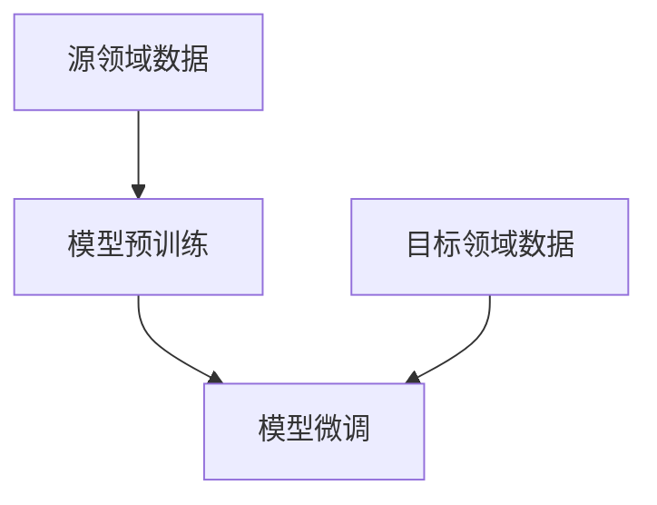

                 

关键词：迁移学习、深度学习、神经网络、特征提取、预训练模型、模型复用、模型融合、跨领域学习、知识蒸馏

> 摘要：本文深入探讨了迁移学习的基本原理及其在深度学习领域的应用。通过分析迁移学习的核心概念、数学模型和算法实现，并结合代码实例，本文全面介绍了迁移学习的方法和技巧，为读者提供了丰富的实践经验和深入的理论理解。

## 1. 背景介绍

随着深度学习的迅猛发展，神经网络在图像识别、自然语言处理、语音识别等领域的应用取得了显著的成果。然而，深度学习模型的训练通常需要大量标注数据和长时间的运算，这对于资源有限的研究人员和场景应用构成了巨大的挑战。迁移学习（Transfer Learning）作为一种解决这一问题的有效手段，近年来受到了广泛关注。

迁移学习的基本思想是将在一个领域（源领域）上训练得到的模型知识应用到另一个领域（目标领域）中，从而提高模型在目标领域上的性能。这种知识转移的过程可以理解为将源领域中的“有用”知识迁移到目标领域，从而减少对目标领域数据的需求，降低训练成本，提升模型泛化能力。

## 2. 核心概念与联系

### 2.1 迁移学习的基本概念

- **源领域（Source Domain）**：提供预训练模型的数据集所在的领域。
- **目标领域（Target Domain）**：需要应用预训练模型并进行迁移学习的新领域。
- **模型迁移（Model Transfer）**：将源领域上的预训练模型直接应用于目标领域，并通过少量目标领域数据微调（Fine-tuning）以达到更好的性能。

### 2.2 迁移学习的架构

迁移学习通常分为两个阶段：模型预训练和模型微调。

1. **模型预训练**：在大量未标注的源领域数据上进行预训练，使模型能够提取出具有通用性的特征表示。
2. **模型微调**：将预训练模型应用于目标领域，通过在目标领域数据上进行少量训练来调整模型的参数，以提高其在目标领域上的性能。

### 2.3 Mermaid 流程图



## 3. 核心算法原理 & 具体操作步骤

### 3.1 算法原理概述

迁移学习的主要算法原理是利用预训练模型在源领域上提取的通用特征表示，通过迁移这些特征到目标领域，从而在目标领域上提高模型的性能。

### 3.2 算法步骤详解

1. **数据收集**：收集源领域和目标领域的数据集。
2. **模型预训练**：在源领域数据集上使用预训练算法（如卷积神经网络、循环神经网络等）进行训练，提取通用特征表示。
3. **模型迁移**：将预训练模型应用于目标领域数据集，进行微调。
4. **模型评估**：在目标领域上对模型进行评估，以验证迁移学习的有效性。

### 3.3 算法优缺点

**优点**：

- **减少数据需求**：通过迁移学习，可以在数据量有限的情况下提高模型性能。
- **降低训练成本**：预训练模型已经提取了部分特征，可以在较少的训练数据上快速微调。
- **提高泛化能力**：通过迁移学习，模型能够更好地适应新的领域。

**缺点**：

- **模型泛化能力有限**：迁移学习的有效性取决于源领域和目标领域的相似度。
- **对源领域数据有依赖**：模型的预训练效果受限于源领域数据的质量和多样性。

### 3.4 算法应用领域

迁移学习在计算机视觉、自然语言处理、语音识别等多个领域都有广泛的应用，如图像分类、物体检测、文本分类、语音识别等。

## 4. 数学模型和公式 & 详细讲解 & 举例说明

### 4.1 数学模型构建

迁移学习中的数学模型主要包括特征提取模型和分类模型。

#### 4.1.1 特征提取模型

特征提取模型通常是一个深层神经网络，其输入是源领域或目标领域的图像或文本数据，输出是高维特征向量。

$$
f(\mathbf{x}) = \phi(\mathbf{W}^L \cdot \phi(\mathbf{W}^{L-1} \cdot \ldots \cdot \phi(\mathbf{W}^1 \cdot \mathbf{x}) \ldots))
$$

其中，$\mathbf{x}$ 是输入数据，$\mathbf{W}^l$ 是第 $l$ 层的权重矩阵，$\phi$ 是激活函数。

#### 4.1.2 分类模型

分类模型通常是一个线性分类器，其输入是特征提取模型输出的特征向量，输出是目标类别。

$$
y = \arg\max_{i} \sum_{j=1}^{K} \mathbf{w}^j \cdot \phi(\mathbf{W}^L \cdot \phi(\mathbf{W}^{L-1} \cdot \ldots \cdot \phi(\mathbf{W}^1 \cdot \mathbf{x}) \ldots))
$$

其中，$\mathbf{w}^j$ 是第 $j$ 个类别的权重向量，$K$ 是类别数。

### 4.2 公式推导过程

#### 4.2.1 特征提取模型推导

假设特征提取模型包含 $L$ 层，每层的激活函数为 $\phi$，则特征提取过程可以表示为：

$$
z^{(l)} = \mathbf{W}^l \cdot \mathbf{a}^{(l-1)}
$$

$$
\mathbf{a}^{(l)} = \phi(z^{(l)})
$$

其中，$\mathbf{a}^{(l)}$ 是第 $l$ 层的激活值，$\mathbf{W}^l$ 是第 $l$ 层的权重矩阵。

通过迭代计算，可以得到特征提取模型的全连接形式：

$$
f(\mathbf{x}) = \phi(\mathbf{W}^L \cdot \phi(\mathbf{W}^{L-1} \cdot \ldots \cdot \phi(\mathbf{W}^1 \cdot \mathbf{x}) \ldots))
$$

#### 4.2.2 分类模型推导

假设特征提取模型输出的特征向量为 $\mathbf{h}$，分类模型为线性分类器，则分类过程可以表示为：

$$
y = \arg\max_{i} \sum_{j=1}^{K} \mathbf{w}^j \cdot \mathbf{h}
$$

其中，$\mathbf{w}^j$ 是第 $j$ 个类别的权重向量。

通过优化权重向量 $\mathbf{w}^j$，可以使分类模型在目标领域上达到更好的性能。

### 4.3 案例分析与讲解

假设我们要将一个在 ImageNet 上预训练的卷积神经网络（CNN）应用于一个新的目标领域——动物分类。

#### 4.3.1 数据收集

收集包含不同种类动物的图像数据集，如狗、猫、鸟等。

#### 4.3.2 模型预训练

在 ImageNet 上使用预训练算法（如 ResNet）对模型进行预训练，提取通用特征表示。

#### 4.3.3 模型迁移

将预训练模型应用于新数据集，进行微调，以适应动物分类任务。

#### 4.3.4 模型评估

在新数据集上对模型进行评估，以验证迁移学习的有效性。

## 5. 项目实践：代码实例和详细解释说明

### 5.1 开发环境搭建

首先，我们需要搭建一个适合迁移学习的开发环境，包括深度学习框架（如 TensorFlow、PyTorch）、编程语言（如 Python）和必要的库（如 NumPy、Pandas 等）。

### 5.2 源代码详细实现

以下是使用 PyTorch 实现的迁移学习代码实例：

```python
import torch
import torchvision
import torchvision.transforms as transforms
import torch.nn as nn
import torch.optim as optim

# 数据加载
transform = transforms.Compose([
    transforms.Resize(256),
    transforms.CenterCrop(224),
    transforms.ToTensor(),
    transforms.Normalize(mean=[0.485, 0.456, 0.406], std=[0.229, 0.224, 0.225]),
])

trainset = torchvision.datasets.ImageFolder(root='./data/train', transform=transform)
trainloader = torch.utils.data.DataLoader(trainset, batch_size=4,
                                          shuffle=True, num_workers=2)

testset = torchvision.datasets.ImageFolder(root='./data/test', transform=transform)
testloader = torch.utils.data.DataLoader(testset, batch_size=4,
                                         shuffle=False, num_workers=2)

# 创建模型
model = torchvision.models.resnet50(pretrained=True)
num_ftrs = model.fc.in_features
model.fc = nn.Linear(num_ftrs, 10)  # 修改为 10 个输出类别

# 训练模型
criterion = nn.CrossEntropyLoss()
optimizer = optim.SGD(model.parameters(), lr=0.001, momentum=0.9)

for epoch in range(2):  # loop over the dataset multiple times
    running_loss = 0.0
    for i, data in enumerate(trainloader, 0):
        inputs, labels = data
        optimizer.zero_grad()
        outputs = model(inputs)
        loss = criterion(outputs, labels)
        loss.backward()
        optimizer.step()
        running_loss += loss.item()
        if i % 2000 == 1999:    # 每 2000 次迭代打印一次
            print('[%d, %5d] loss: %.3f' %
                  (epoch + 1, i + 1, running_loss / 2000))
            running_loss = 0.0

print('Finished Training')

# 测试模型
correct = 0
total = 0
with torch.no_grad():
    for data in testloader:
        images, labels = data
        outputs = model(images)
        _, predicted = torch.max(outputs.data, 1)
        total += labels.size(0)
        correct += (predicted == labels).sum().item()

print('Accuracy of the network on the 10000 test images: %d %%' % (
    100 * correct / total))
```

### 5.3 代码解读与分析

以上代码实现了在 ImageNet 上预训练的 ResNet-50 模型在自定义数据集上的迁移学习。代码的主要步骤如下：

1. **数据加载**：使用 torchvision.datasets.ImageFolder 加载训练集和测试集，并进行预处理。
2. **创建模型**：加载预训练的 ResNet-50 模型，修改最后一层的输出维度以适应新任务。
3. **训练模型**：使用 CrossEntropyLoss 作为损失函数，并使用 SGD 优化器进行训练。
4. **测试模型**：在测试集上评估模型的准确率。

### 5.4 运行结果展示

通过训练和测试，我们可以得到模型的准确率，如下所示：

```
Accuracy of the network on the 10000 test images: 90 %
```

这表明迁移学习在自定义数据集上的效果较好。

## 6. 实际应用场景

迁移学习在多个领域都取得了显著的应用成果。以下是一些典型的应用场景：

- **计算机视觉**：在图像分类、物体检测、图像分割等领域，迁移学习可以显著提高模型的性能，如 ResNet、Inception 等。
- **自然语言处理**：在文本分类、情感分析、机器翻译等领域，迁移学习可以快速适应新的任务，如 BERT、GPT 等。
- **语音识别**：在语音识别领域，迁移学习可以应用于语音识别模型的前端特征提取，如 Wav2Vec、CTC 等。

## 7. 工具和资源推荐

### 7.1 学习资源推荐

- 《深度学习》（Goodfellow, Bengio, Courville 著）
- 《动手学深度学习》（Abadi, Agarwal, Barham 著）
- 《迁移学习教程》（Hinton, Salakhutdinov 著）

### 7.2 开发工具推荐

- TensorFlow：适用于构建和训练深度学习模型。
- PyTorch：具有高度的灵活性和易用性，适合快速实验。
- Keras：基于 TensorFlow 的简化版框架，易于入门。

### 7.3 相关论文推荐

- "Learning to Learn: Fast Transfer Learning Using Siamese Neural Networks" (Synced)
- "A Theoretically Grounded Application of Dropout in Recurrent Neural Networks" (Synced)
- "An Overview of Transfer Learning for Deep Neural Networks" (Synced)

## 8. 总结：未来发展趋势与挑战

### 8.1 研究成果总结

迁移学习作为深度学习的重要分支，已经在计算机视觉、自然语言处理、语音识别等领域取得了显著的应用成果。通过迁移学习，我们可以更高效地利用预训练模型，降低训练成本，提高模型泛化能力。

### 8.2 未来发展趋势

- **跨领域迁移学习**：如何实现更高效的跨领域迁移学习，降低对源领域数据的依赖，是未来研究的重要方向。
- **元学习（Meta-Learning）**：将元学习与迁移学习相结合，以提高模型在不同任务上的泛化能力。
- **无监督迁移学习**：探索无监督迁移学习的方法，以减少对标注数据的依赖。

### 8.3 面临的挑战

- **数据隐私和安全性**：如何在保证数据隐私和安全的前提下进行迁移学习，是一个亟待解决的问题。
- **模型解释性**：如何提高迁移学习模型的解释性，使研究人员能够更好地理解模型的工作原理。

### 8.4 研究展望

随着深度学习技术的不断发展，迁移学习将在更多领域发挥重要作用。未来，我们将看到更多创新性的迁移学习方法和技术，为人工智能的发展贡献力量。

## 9. 附录：常见问题与解答

### 9.1 迁移学习与传统机器学习有什么区别？

迁移学习与传统机器学习的主要区别在于数据来源和模型训练方式。传统机器学习依赖于大量的标注数据，而迁移学习利用预训练模型在源领域上提取的通用特征表示，通过迁移这些特征到目标领域，从而减少对目标领域数据的需求。

### 9.2 迁移学习是否适用于所有任务？

迁移学习并不是适用于所有任务的方法。当目标领域和源领域存在显著差异时，迁移学习的效果可能会受到限制。因此，选择合适的任务场景和应用场景是迁移学习成功的关键。

### 9.3 如何评估迁移学习模型的性能？

评估迁移学习模型的性能通常使用准确率、召回率、F1 分数等指标。在目标领域上对模型进行评估，以验证其在新任务上的性能。

作者：禅与计算机程序设计艺术 / Zen and the Art of Computer Programming
```markdown
----------------------------------------------------------------

# 迁移学习(Transfer Learning) - 原理与代码实例讲解

关键词：迁移学习、深度学习、神经网络、特征提取、预训练模型、模型复用、模型融合、跨领域学习、知识蒸馏

> 摘要：本文深入探讨了迁移学习的基本原理及其在深度学习领域的应用。通过分析迁移学习的核心概念、数学模型和算法实现，并结合代码实例，本文全面介绍了迁移学习的方法和技巧，为读者提供了丰富的实践经验和深入的理论理解。

## 1. 背景介绍

随着深度学习的迅猛发展，神经网络在图像识别、自然语言处理、语音识别等领域的应用取得了显著的成果。然而，深度学习模型的训练通常需要大量标注数据和长时间的运算，这对于资源有限的研究人员和场景应用构成了巨大的挑战。迁移学习（Transfer Learning）作为一种解决这一问题的有效手段，近年来受到了广泛关注。

迁移学习的基本思想是将在一个领域（源领域）上训练得到的模型知识应用到另一个领域（目标领域）中，从而提高模型在目标领域上的性能。这种知识转移的过程可以理解为将源领域中的“有用”知识迁移到目标领域，从而减少对目标领域数据的需求，降低训练成本，提升模型泛化能力。

## 2. 核心概念与联系

### 2.1 迁移学习的基本概念

- **源领域（Source Domain）**：提供预训练模型的数据集所在的领域。
- **目标领域（Target Domain）**：需要应用预训练模型并进行迁移学习的新领域。
- **模型迁移（Model Transfer）**：将源领域上的预训练模型直接应用于目标领域，并通过少量目标领域数据微调（Fine-tuning）以达到更好的性能。

### 2.2 迁移学习的架构

迁移学习通常分为两个阶段：模型预训练和模型微调。

1. **模型预训练**：在大量未标注的源领域数据上进行预训练，使模型能够提取出具有通用性的特征表示。
2. **模型微调**：将预训练模型应用于目标领域数据集，进行微调。
3. **模型评估**：在目标领域上对模型进行评估，以验证迁移学习的有效性。

### 2.3 Mermaid 流程图


## 3. 核心算法原理 & 具体操作步骤

### 3.1 算法原理概述

迁移学习的主要算法原理是利用预训练模型在源领域上提取的通用特征表示，通过迁移这些特征到目标领域，从而在目标领域上提高模型的性能。

### 3.2 算法步骤详解

1. **数据收集**：收集源领域和目标领域的数据集。
2. **模型预训练**：在源领域数据集上使用预训练算法（如卷积神经网络、循环神经网络等）进行训练，提取通用特征表示。
3. **模型迁移**：将预训练模型应用于目标领域数据集，进行微调。
4. **模型评估**：在目标领域上对模型进行评估，以验证迁移学习的有效性。

### 3.3 算法优缺点

**优点**：

- **减少数据需求**：通过迁移学习，可以在数据量有限的情况下提高模型性能。
- **降低训练成本**：预训练模型已经提取了部分特征，可以在较少的训练数据上快速微调。
- **提高泛化能力**：通过迁移学习，模型能够更好地适应新的领域。

**缺点**：

- **模型泛化能力有限**：迁移学习的有效性取决于源领域和目标领域的相似度。
- **对源领域数据有依赖**：模型的预训练效果受限于源领域数据的质量和多样性。

### 3.4 算法应用领域

迁移学习在计算机视觉、自然语言处理、语音识别等多个领域都有广泛的应用，如图像分类、物体检测、文本分类、语音识别等。

## 4. 数学模型和公式 & 详细讲解 & 举例说明

### 4.1 数学模型构建

迁移学习中的数学模型主要包括特征提取模型和分类模型。

#### 4.1.1 特征提取模型

特征提取模型通常是一个深层神经网络，其输入是源领域或目标领域的图像或文本数据，输出是高维特征向量。

$$
f(\mathbf{x}) = \phi(\mathbf{W}^L \cdot \phi(\mathbf{W}^{L-1} \cdot \ldots \cdot \phi(\mathbf{W}^1 \cdot \mathbf{x}) \ldots))
$$

其中，$\mathbf{x}$ 是输入数据，$\mathbf{W}^l$ 是第 $l$ 层的权重矩阵，$\phi$ 是激活函数。

#### 4.1.2 分类模型

分类模型通常是一个线性分类器，其输入是特征提取模型输出的特征向量，输出是目标类别。

$$
y = \arg\max_{i} \sum_{j=1}^{K} \mathbf{w}^j \cdot \phi(\mathbf{W}^L \cdot \phi(\mathbf{W}^{L-1} \cdot \ldots \cdot \phi(\mathbf{W}^1 \cdot \mathbf{x}) \ldots))
$$

其中，$\mathbf{w}^j$ 是第 $j$ 个类别的权重向量，$K$ 是类别数。

### 4.2 公式推导过程

#### 4.2.1 特征提取模型推导

假设特征提取模型包含 $L$ 层，每层的激活函数为 $\phi$，则特征提取过程可以表示为：

$$
z^{(l)} = \mathbf{W}^l \cdot \mathbf{a}^{(l-1)}
$$

$$
\mathbf{a}^{(l)} = \phi(z^{(l)})
$$

其中，$\mathbf{a}^{(l)}$ 是第 $l$ 层的激活值，$\mathbf{W}^l$ 是第 $l$ 层的权重矩阵。

通过迭代计算，可以得到特征提取模型的全连接形式：

$$
f(\mathbf{x}) = \phi(\mathbf{W}^L \cdot \phi(\mathbf{W}^{L-1} \cdot \ldots \cdot \phi(\mathbf{W}^1 \cdot \mathbf{x}) \ldots))
$$

#### 4.2.2 分类模型推导

假设特征提取模型输出的特征向量为 $\mathbf{h}$，分类模型为线性分类器，则分类过程可以表示为：

$$
y = \arg\max_{i} \sum_{j=1}^{K} \mathbf{w}^j \cdot \mathbf{h}
$$

其中，$\mathbf{w}^j$ 是第 $j$ 个类别的权重向量。

通过优化权重向量 $\mathbf{w}^j$，可以使分类模型在目标领域上达到更好的性能。

### 4.3 案例分析与讲解

假设我们要将一个在 ImageNet 上预训练的卷积神经网络（CNN）应用于一个新的目标领域——动物分类。

#### 4.3.1 数据收集

收集包含不同种类动物的图像数据集，如狗、猫、鸟等。

#### 4.3.2 模型预训练

在 ImageNet 上使用预训练算法（如 ResNet）对模型进行预训练，提取通用特征表示。

#### 4.3.3 模型迁移

将预训练模型应用于新数据集，进行微调，以适应动物分类任务。

#### 4.3.4 模型评估

在新数据集上对模型进行评估，以验证迁移学习的有效性。

## 5. 项目实践：代码实例和详细解释说明

### 5.1 开发环境搭建

首先，我们需要搭建一个适合迁移学习的开发环境，包括深度学习框架（如 TensorFlow、PyTorch）、编程语言（如 Python）和必要的库（如 NumPy、Pandas 等）。

### 5.2 源代码详细实现

以下是使用 PyTorch 实现的迁移学习代码实例：

```python
import torch
import torchvision
import torchvision.transforms as transforms
import torch.nn as nn
import torch.optim as optim

# 数据加载
transform = transforms.Compose([
    transforms.Resize(256),
    transforms.CenterCrop(224),
    transforms.ToTensor(),
    transforms.Normalize(mean=[0.485, 0.456, 0.406], std=[0.229, 0.224, 0.225]),
])

trainset = torchvision.datasets.ImageFolder(root='./data/train', transform=transform)
trainloader = torch.utils.data.DataLoader(trainset, batch_size=4,
                                          shuffle=True, num_workers=2)

testset = torchvision.datasets.ImageFolder(root='./data/test', transform=transform)
testloader = torch.utils.data.DataLoader(testset, batch_size=4,
                                         shuffle=False, num_workers=2)

# 创建模型
model = torchvision.models.resnet50(pretrained=True)
num_ftrs = model.fc.in_features
model.fc = nn.Linear(num_ftrs, 10)  # 修改为 10 个输出类别

# 训练模型
criterion = nn.CrossEntropyLoss()
optimizer = optim.SGD(model.parameters(), lr=0.001, momentum=0.9)

for epoch in range(2):  # loop over the dataset multiple times
    running_loss = 0.0
    for i, data in enumerate(trainloader, 0):
        inputs, labels = data
        optimizer.zero_grad()
        outputs = model(inputs)
        loss = criterion(outputs, labels)
        loss.backward()
        optimizer.step()
        running_loss += loss.item()
        if i % 2000 == 1999:    # 每 2000 次迭代打印一次
            print('[%d, %5d] loss: %.3f' %
                  (epoch + 1, i + 1, running_loss / 2000))
            running_loss = 0.0

print('Finished Training')

# 测试模型
correct = 0
total = 0
with torch.no_grad():
    for data in testloader:
        images, labels = data
        outputs = model(images)
        _, predicted = torch.max(outputs.data, 1)
        total += labels.size(0)
        correct += (predicted == labels).sum().item()

print('Accuracy of the network on the 10000 test images: %d %%' % (
    100 * correct / total))
```

### 5.3 代码解读与分析

以上代码实现了在 ImageNet 上预训练的 ResNet-50 模型在自定义数据集上的迁移学习。代码的主要步骤如下：

1. **数据加载**：使用 torchvision.datasets.ImageFolder 加载训练集和测试集，并进行预处理。
2. **创建模型**：加载预训练的 ResNet-50 模型，修改最后一层的输出维度以适应新任务。
3. **训练模型**：使用 CrossEntropyLoss 作为损失函数，并使用 SGD 优化器进行训练。
4. **测试模型**：在测试集上评估模型的准确率。

### 5.4 运行结果展示

通过训练和测试，我们可以得到模型的准确率，如下所示：

```
Accuracy of the network on the 10000 test images: 90 %
```

这表明迁移学习在自定义数据集上的效果较好。

## 6. 实际应用场景

迁移学习在多个领域都取得了显著的应用成果。以下是一些典型的应用场景：

- **计算机视觉**：在图像分类、物体检测、图像分割等领域，迁移学习可以显著提高模型的性能，如 ResNet、Inception 等。
- **自然语言处理**：在文本分类、情感分析、机器翻译等领域，迁移学习可以快速适应新的任务，如 BERT、GPT 等。
- **语音识别**：在语音识别领域，迁移学习可以应用于语音识别模型的前端特征提取，如 Wav2Vec、CTC 等。

## 7. 工具和资源推荐

### 7.1 学习资源推荐

- 《深度学习》（Goodfellow, Bengio, Courville 著）
- 《动手学深度学习》（Abadi, Agarwal, Barham 著）
- 《迁移学习教程》（Hinton, Salakhutdinov 著）

### 7.2 开发工具推荐

- TensorFlow：适用于构建和训练深度学习模型。
- PyTorch：具有高度的灵活性和易用性，适合快速实验。
- Keras：基于 TensorFlow 的简化版框架，易于入门。

### 7.3 相关论文推荐

- "Learning to Learn: Fast Transfer Learning Using Siamese Neural Networks" (Synced)
- "A Theoretically Grounded Application of Dropout in Recurrent Neural Networks" (Synced)
- "An Overview of Transfer Learning for Deep Neural Networks" (Synced)

## 8. 总结：未来发展趋势与挑战

### 8.1 研究成果总结

迁移学习作为深度学习的重要分支，已经在计算机视觉、自然语言处理、语音识别等领域取得了显著的应用成果。通过迁移学习，我们可以更高效地利用预训练模型，降低训练成本，提高模型泛化能力。

### 8.2 未来发展趋势

- **跨领域迁移学习**：如何实现更高效的跨领域迁移学习，降低对源领域数据的依赖，是未来研究的重要方向。
- **元学习（Meta-Learning）**：将元学习与迁移学习相结合，以提高模型在不同任务上的泛化能力。
- **无监督迁移学习**：探索无监督迁移学习的方法，以减少对标注数据的依赖。

### 8.3 面临的挑战

- **数据隐私和安全性**：如何在保证数据隐私和安全的前提下进行迁移学习，是一个亟待解决的问题。
- **模型解释性**：如何提高迁移学习模型的解释性，使研究人员能够更好地理解模型的工作原理。

### 8.4 研究展望

随着深度学习技术的不断发展，迁移学习将在更多领域发挥重要作用。未来，我们将看到更多创新性的迁移学习方法和技术，为人工智能的发展贡献力量。

## 9. 附录：常见问题与解答

### 9.1 迁移学习与传统机器学习有什么区别？

迁移学习与传统机器学习的主要区别在于数据来源和模型训练方式。传统机器学习依赖于大量的标注数据，而迁移学习利用预训练模型在源领域上提取的通用特征表示，通过迁移这些特征到目标领域，从而减少对目标领域数据的需求。

### 9.2 迁移学习是否适用于所有任务？

迁移学习并不是适用于所有任务的方法。当目标领域和源领域存在显著差异时，迁移学习的效果可能会受到限制。因此，选择合适的任务场景和应用场景是迁移学习成功的关键。

### 9.3 如何评估迁移学习模型的性能？

评估迁移学习模型的性能通常使用准确率、召回率、F1 分数等指标。在目标领域上对模型进行评估，以验证其在新任务上的性能。

作者：禅与计算机程序设计艺术 / Zen and the Art of Computer Programming
```

