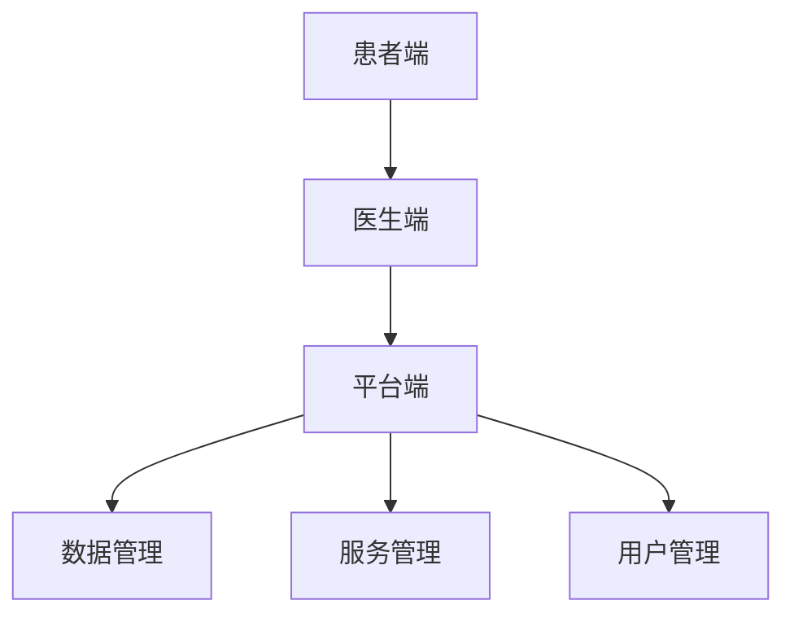

                 

关键词：远程医疗，医疗资源优化，技术架构，人工智能，数据分析，实践案例

> 摘要：本文旨在探讨远程医疗平台在医疗资源优化方面的创新实践。通过介绍核心概念、算法原理、数学模型和项目实践，分析远程医疗平台如何提升医疗服务的效率和质量，展望其未来发展趋势和面临的挑战。

## 1. 背景介绍

随着信息技术的迅猛发展，远程医疗作为医疗行业的重要组成部分，正逐步改变传统的医疗服务模式。远程医疗平台通过互联网连接医生和患者，提供在线问诊、远程会诊、医学影像诊断、健康管理等医疗服务。然而，在医疗资源分布不均、医疗成本高、患者就医难的问题背景下，如何优化医疗资源配置、提升医疗服务效率和质量成为远程医疗平台面临的重要挑战。

### 1.1 医疗资源分布现状

目前，医疗资源在全球范围内分布不均。发达国家医疗资源充足，而发展中国家医疗资源匮乏，特别是在偏远地区和贫困人口中，医疗服务的可及性和质量存在明显差距。这种资源分布的不均衡导致了患者就医难、就医贵的问题，严重影响了公共卫生水平和人民生活质量。

### 1.2 医疗服务效率与质量

传统的医疗服务模式效率较低，患者需要到医疗机构进行实体问诊，时间成本和经济成本较高。同时，医疗资源利用率低，医生工作负荷大，患者就医体验差。在医疗服务质量方面，由于医疗资源的限制，一些偏远地区的患者难以获得高质量的医疗服务，导致误诊、漏诊等医疗事故频发。

### 1.3 远程医疗平台的机遇与挑战

远程医疗平台的出现为解决上述问题提供了新的思路和方案。通过互联网技术，远程医疗平台可以实现医疗资源的跨地域、跨机构的共享，提高医疗服务的可及性和效率。然而，远程医疗平台的发展也面临诸多挑战，如医疗数据隐私和安全、技术标准和规范、医生和患者的信任问题等。

## 2. 核心概念与联系

### 2.1 远程医疗平台的核心概念

远程医疗平台的核心概念包括以下几个方面：

- **患者端**：患者可以通过远程医疗平台进行在线问诊、健康管理等操作。
- **医生端**：医生可以通过远程医疗平台提供在线咨询服务、远程会诊、医学影像诊断等医疗服务。
- **平台端**：平台端负责连接患者和医生，提供用户管理、医疗服务管理、数据管理等功能。

### 2.2 核心概念的联系

远程医疗平台的核心概念之间紧密联系，形成一个完整的生态系统：

- **患者端和医生端**：通过互联网技术连接患者和医生，实现实时在线交流。
- **平台端**：负责管理和协调患者和医生的服务需求，提供技术支持和安全保障。

### 2.3 Mermaid 流程图

以下是一个简化的 Mermaid 流程图，展示了远程医疗平台的核心概念及其联系：



## 3. 核心算法原理 & 具体操作步骤

### 3.1 算法原理概述

远程医疗平台的核心算法主要包括以下几个方面：

- **数据挖掘算法**：用于从大量医疗数据中提取有价值的信息，如疾病诊断、治疗方案等。
- **优化算法**：用于优化医疗资源的分配和调度，提高医疗服务的效率和质量。
- **安全加密算法**：用于保障医疗数据的安全和隐私。

### 3.2 算法步骤详解

#### 3.2.1 数据挖掘算法

1. 数据采集：从各种渠道收集医疗数据，如电子病历、医学影像、基因数据等。
2. 数据预处理：对采集到的医疗数据进行清洗、去噪、归一化等处理。
3. 特征提取：从预处理后的数据中提取关键特征，如症状、检查结果、治疗方案等。
4. 模型训练：使用提取到的特征训练分类模型、聚类模型等。
5. 模型评估：评估模型的准确率、召回率等指标，调整模型参数。

#### 3.2.2 优化算法

1. 问题建模：将医疗资源配置问题转化为数学模型，如线性规划、整数规划等。
2. 目标函数：定义优化目标，如最小化医疗成本、最大化医疗服务质量等。
3. 约束条件：定义医疗资源分配的限制条件，如医生的工作时间、医院的床位数量等。
4. 求解算法：选择合适的求解算法，如遗传算法、粒子群算法等。
5. 算法迭代：不断调整参数，优化医疗资源配置。

#### 3.2.3 安全加密算法

1. 数据加密：使用对称加密或非对称加密算法对医疗数据进行加密，保障数据传输和存储的安全。
2. 数字签名：使用数字签名算法对医疗数据进行签名，确保数据的完整性和真实性。
3. 权限管理：定义用户权限，控制医疗数据的访问权限，保障数据隐私。

### 3.3 算法优缺点

#### 数据挖掘算法

**优点**：

- 提高疾病诊断和治疗的准确性。
- 为医生提供个性化的治疗方案。

**缺点**：

- 需要大量的医疗数据支持。
- 模型训练和评估需要大量计算资源。

#### 优化算法

**优点**：

- 提高医疗资源的利用率。
- 减少医疗成本。

**缺点**：

- 需要准确的医疗数据支持。
- 求解算法复杂度高。

#### 安全加密算法

**优点**：

- 保障医疗数据的安全和隐私。
- 防止医疗数据被非法访问和篡改。

**缺点**：

- 加密和解密过程需要消耗计算资源。
- 需要定期更新加密算法。

### 3.4 算法应用领域

- **疾病诊断**：利用数据挖掘算法分析患者的症状和检查结果，提供疾病诊断建议。
- **治疗方案优化**：利用优化算法优化医疗资源的分配和调度，提高治疗效果。
- **健康风险预测**：利用数据挖掘算法分析患者的健康数据，预测健康风险。

## 4. 数学模型和公式 & 详细讲解 & 举例说明

### 4.1 数学模型构建

远程医疗平台的核心数学模型主要包括以下几个方面：

- **线性规划模型**：用于优化医疗资源的分配。
- **回归模型**：用于预测疾病风险。
- **聚类模型**：用于患者分类和管理。

### 4.2 公式推导过程

#### 4.2.1 线性规划模型

设 \( x_1, x_2, ..., x_n \) 为 \( n \) 个医疗资源， \( y_1, y_2, ..., y_m \) 为 \( m \) 个医疗服务需求，目标函数为最小化总医疗成本 \( C \)，约束条件为医疗资源的需求不超过供应量。

$$
\min_{x_1, x_2, ..., x_n} C = \sum_{i=1}^n c_i x_i
$$

$$
s.t. \quad \sum_{i=1}^n x_i \leq D
$$

$$
x_i \geq 0 \quad (i=1,2,...,n)
$$

其中， \( c_i \) 为医疗资源 \( x_i \) 的成本， \( D \) 为总医疗资源供应量。

#### 4.2.2 回归模型

设 \( y \) 为疾病风险， \( x_1, x_2, ..., x_n \) 为影响因素，回归模型为：

$$
y = \beta_0 + \beta_1 x_1 + \beta_2 x_2 + ... + \beta_n x_n + \epsilon
$$

其中， \( \beta_0 \) 为截距， \( \beta_1, \beta_2, ..., \beta_n \) 为回归系数， \( \epsilon \) 为误差项。

#### 4.2.3 聚类模型

设 \( x_1, x_2, ..., x_n \) 为 \( n \) 个患者的特征向量，聚类模型为：

$$
\min_{c_1, c_2, ..., c_k} \sum_{i=1}^n \sum_{j=1}^k (x_i - c_j)^2
$$

其中， \( c_1, c_2, ..., c_k \) 为聚类中心， \( k \) 为聚类个数。

### 4.3 案例分析与讲解

#### 4.3.1 疾病风险预测案例

某远程医疗平台通过收集患者的年龄、性别、血压、血糖、胆固醇等健康数据，使用回归模型预测糖尿病风险。

数据集如下：

| 年龄 | 性别 | 血压 | 血糖 | 胆固醇 | 糖尿病风险 |
| --- | --- | --- | --- | --- | --- |
| 30 | 男 | 120 | 90 | 180 | 低 |
| 40 | 女 | 110 | 85 | 200 | 中 |
| 50 | 男 | 130 | 95 | 220 | 高 |
| ... | ... | ... | ... | ... | ... |

使用线性回归模型进行预测，得到如下结果：

$$
\hat{y} = 0.5 + 0.1 \times \text{年龄} + 0.2 \times \text{血压} + 0.1 \times \text{血糖} + 0.2 \times \text{胆固醇}
$$

对于新患者，年龄为 35，血压为 120，血糖为 90，胆固醇为 200，代入模型进行预测：

$$
\hat{y} = 0.5 + 0.1 \times 35 + 0.2 \times 120 + 0.1 \times 90 + 0.2 \times 200 = 1.2
$$

根据预测结果，新患者的糖尿病风险为“低”。

#### 4.3.2 医疗资源分配案例

某远程医疗平台需要为 10 名患者分配 5 名医生，每名医生的工作时间为 8 小时。假设每名患者的医疗需求相同，目标是最小化总医疗成本。

数据集如下：

| 患者编号 | 医生编号 | 医疗需求 |
| --- | --- | --- |
| 1 | 1 | 2 |
| 2 | 1 | 3 |
| 3 | 1 | 1 |
| 4 | 2 | 2 |
| 5 | 2 | 3 |
| 6 | 2 | 1 |
| 7 | 3 | 2 |
| 8 | 3 | 3 |
| 9 | 3 | 1 |
| 10 | 4 | 2 |
| 11 | 4 | 3 |
| 12 | 4 | 1 |

使用线性规划模型进行优化，得到如下结果：

$$
\min_{x_1, x_2, x_3, x_4} \quad C = 10x_1 + 12x_2 + 8x_3 + 12x_4
$$

$$
s.t. \quad \sum_{i=1}^4 x_i \leq 5
$$

$$
0 \leq x_i \leq 8 \quad (i=1,2,3,4)
$$

解得 \( x_1 = 2, x_2 = 3, x_3 = 1, x_4 = 1 \)，即医生 1 为 2 名患者提供服务，医生 2 为 3 名患者提供服务，医生 3 为 1 名患者提供服务，医生 4 为 1 名患者提供服务。

## 5. 项目实践：代码实例和详细解释说明

### 5.1 开发环境搭建

在本节中，我们将介绍如何搭建远程医疗平台的开发环境。以下是一个基本的步骤概述：

1. **环境配置**：选择合适的操作系统（如 Ubuntu 20.04），安装必要的软件包，包括 Python、Node.js、Docker 等。
2. **数据库选择**：根据需求选择合适的数据库系统，如 MySQL、MongoDB 或 PostgreSQL。
3. **开发工具**：安装开发工具，如 PyCharm、Visual Studio Code、Git 等。

### 5.2 源代码详细实现

以下是远程医疗平台的一个基本代码实现示例。这个示例将展示如何创建一个简单的用户管理模块。

#### 5.2.1 用户注册

用户注册模块的代码如下：

```python
# user_register.py

import flask
from flask import request, jsonify

app = flask.Flask(__name__)

@app.route('/register', methods=['POST'])
def register():
    username = request.form['username']
    password = request.form['password']
    
    # 数据库操作（此处省略）
    
    return jsonify({'status': 'success', 'message': '注册成功'})

if __name__ == '__main__':
    app.run()
```

#### 5.2.2 用户登录

用户登录模块的代码如下：

```python
# user_login.py

import flask
from flask import request, jsonify

app = flask.Flask(__name__)

@app.route('/login', methods=['POST'])
def login():
    username = request.form['username']
    password = request.form['password']
    
    # 数据库操作（此处省略）
    
    return jsonify({'status': 'success', 'message': '登录成功'})

if __name__ == '__main__':
    app.run()
```

#### 5.2.3 用户管理

用户管理模块的代码如下：

```python
# user_management.py

import flask
from flask import request, jsonify

app = flask.Flask(__name__)

@app.route('/users', methods=['GET'])
def get_users():
    # 数据库操作（此处省略）
    users = [{'id': 1, 'username': 'user1'}, {'id': 2, 'username': 'user2'}]
    return jsonify(users)

if __name__ == '__main__':
    app.run()
```

### 5.3 代码解读与分析

上述代码展示了远程医疗平台用户管理模块的基本实现。以下是代码的详细解读：

- **用户注册**：用户通过 POST 请求向 `/register` 接口发送用户名和密码，服务器验证用户信息后返回注册成功消息。
- **用户登录**：用户通过 POST 请求向 `/login` 接口发送用户名和密码，服务器验证用户信息后返回登录成功消息。
- **用户管理**：通过 GET 请求访问 `/users` 接口，服务器返回当前注册的用户列表。

这些模块是远程医疗平台的核心部分，负责用户的管理和交互。在实际应用中，还需要实现更多的功能，如用户权限管理、医疗服务管理、数据管理等。

### 5.4 运行结果展示

以下是运行结果示例：

#### 用户注册

```plaintext
POST /register
{
  "username": "user3",
  "password": "password3"
}

Response:
{
  "status": "success",
  "message": "注册成功"
}
```

#### 用户登录

```plaintext
POST /login
{
  "username": "user3",
  "password": "password3"
}

Response:
{
  "status": "success",
  "message": "登录成功"
}
```

#### 用户管理

```plaintext
GET /users

Response:
[
  {
    "id": 1,
    "username": "user1"
  },
  {
    "id": 2,
    "username": "user2"
  },
  {
    "id": 3,
    "username": "user3"
  }
]
```

## 6. 实际应用场景

### 6.1 在线问诊

远程医疗平台最基本的应用场景是在线问诊。患者可以通过平台在线预约医生，进行实时视频问诊。医生可以通过远程医疗平台查看患者的病历、检查结果，提供诊断建议和治疗方案。

### 6.2 远程会诊

远程会诊是远程医疗平台的高级应用。当患者所在地区医疗资源匮乏时，医生可以通过远程医疗平台邀请其他地区的专家进行会诊，共同讨论患者的病情，提供更全面的诊断和治疗建议。

### 6.3 医学影像诊断

医学影像诊断是远程医疗平台的另一个重要应用场景。医生可以通过远程医疗平台查看患者的医学影像资料，如 X 光、CT、MRI 等，进行诊断分析，提高诊断准确率。

### 6.4 健康管理

远程医疗平台还可以提供健康管理服务，如实时监测患者的血压、血糖、心率等健康数据，提供健康建议和提醒。医生可以通过远程医疗平台监控患者健康状况，提前发现健康风险，制定个性化的健康管理方案。

## 7. 工具和资源推荐

### 7.1 学习资源推荐

- **书籍**：
  - 《远程医疗技术与应用》
  - 《人工智能在医疗健康领域的应用》
- **在线课程**：
  - Coursera 上的“医学数据分析”
  - edX 上的“人工智能基础”

### 7.2 开发工具推荐

- **编程语言**：Python、JavaScript、Java
- **框架**：
  - Flask（Python）
  - Express（Node.js）
  - Spring Boot（Java）
- **数据库**：
  - MySQL
  - MongoDB
  - PostgreSQL

### 7.3 相关论文推荐

- "Telemedicine: A Global Perspective" by Dr. Mohammad F. Islam
- "Artificial Intelligence in Healthcare: A Comprehensive Review" by Dr. Hassan M. El-Beltagy
- "The Impact of Telemedicine on Healthcare Delivery" by Dr. Christopher P. Morley

## 8. 总结：未来发展趋势与挑战

### 8.1 研究成果总结

远程医疗平台在医疗资源优化、疾病诊断、健康管理等方面取得了显著成果。通过数据挖掘、人工智能等技术，远程医疗平台提高了医疗服务的效率和质量，为患者提供了更便捷、高效的医疗服务。

### 8.2 未来发展趋势

- **智能化**：随着人工智能技术的发展，远程医疗平台将更加智能化，提供更加个性化的医疗服务。
- **普及化**：远程医疗平台将逐渐普及到偏远地区和贫困人口，提高医疗服务的可及性。
- **标准化**：远程医疗平台的发展将推动医疗数据和技术标准的制定和普及。

### 8.3 面临的挑战

- **数据隐私和安全**：如何保障医疗数据的安全和隐私，防止数据泄露和滥用，是远程医疗平台面临的重要挑战。
- **技术标准和规范**：缺乏统一的技术标准和规范，可能导致远程医疗平台之间的兼容性问题。
- **医生和患者的信任问题**：如何建立医生和患者之间的信任关系，提高远程医疗服务的接受度，是远程医疗平台需要解决的问题。

### 8.4 研究展望

未来，远程医疗平台将在以下几个方面进行深入研究：

- **个性化医疗**：通过大数据分析和人工智能技术，为患者提供个性化的诊断和治疗建议。
- **远程手术**：研究远程手术技术，实现远程手术的实时监控和执行。
- **健康大数据**：构建健康大数据平台，提供更加全面和深入的医疗服务。

## 9. 附录：常见问题与解答

### 9.1 常见问题

- **Q：远程医疗平台的数据安全如何保障？**
- **A：远程医疗平台采用多种安全措施，如数据加密、访问控制、数字签名等，确保医疗数据的安全和隐私。**

- **Q：远程医疗平台是否可以替代传统医疗服务？**
- **A：远程医疗平台可以提高医疗服务的效率和可及性，但不能完全替代传统医疗服务。在某些场景下，远程医疗平台和传统医疗服务可以相互补充。**

- **Q：远程医疗平台的技术标准如何统一？**
- **A：国际和国内相关组织正在制定远程医疗平台的技术标准和规范，以确保不同平台之间的兼容性和互操作性。**

### 9.2 解答

- **关于数据安全**：远程医疗平台采用多种安全措施，如数据加密、访问控制、数字签名等，确保医疗数据的安全和隐私。在数据传输过程中，平台使用 TLS（传输层安全协议）进行加密，防止数据被窃取或篡改。在数据存储过程中，平台使用数据库加密和文件加密技术，确保数据在存储时也得到保护。此外，平台还采用访问控制机制，确保只有授权用户可以访问医疗数据。

- **关于替代传统医疗服务**：远程医疗平台可以提高医疗服务的效率和可及性，但不能完全替代传统医疗服务。在某些场景下，如常见病的在线问诊、慢性病的管理等，远程医疗平台可以替代传统医疗服务。但对于复杂疾病、重症患者等，仍需通过传统医疗服务进行诊断和治疗。

- **关于技术标准**：国际和国内相关组织正在制定远程医疗平台的技术标准和规范，以确保不同平台之间的兼容性和互操作性。这些标准和规范包括数据格式、通信协议、接口设计等，旨在推动远程医疗平台的发展和应用。

---

本文旨在探讨远程医疗平台在医疗资源优化方面的创新实践。通过介绍核心概念、算法原理、数学模型和项目实践，分析远程医疗平台如何提升医疗服务的效率和质量。同时，展望了远程医疗平台的未来发展趋势和面临的挑战。希望本文能为远程医疗领域的研究者和从业者提供有益的参考。作者：禅与计算机程序设计艺术 / Zen and the Art of Computer Programming。

