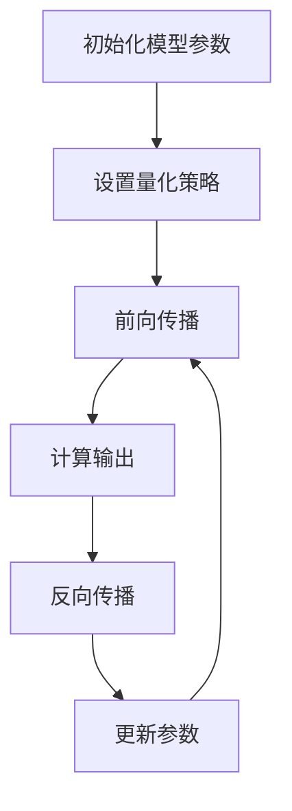

                 

在当今快速发展的信息技术时代，人工智能（AI）已经成为各行各业变革的重要驱动力。然而，AI模型的部署效率一直是制约其广泛应用的关键因素。本文将深入探讨一种名为“量化感知训练”的技术，该技术旨在通过优化AI模型的结构和参数，显著提高其部署效率。本文将介绍量化感知训练的核心概念、算法原理、具体操作步骤以及其实际应用，并展望其未来的发展趋势与挑战。

## 关键词

- 量化感知训练
- AI模型部署
- 结构优化
- 参数调整
- 效率提升

## 摘要

本文首先回顾了AI模型部署面临的挑战，随后详细介绍了量化感知训练的概念和原理，并通过具体的算法步骤和数学模型，阐述了如何通过量化感知训练提升AI模型的部署效率。最后，本文通过实际应用案例展示了量化感知训练的效果，并对未来的发展进行了展望。

### 1. 背景介绍

随着深度学习技术的飞速发展，AI模型在各种应用场景中得到了广泛的应用。然而，AI模型的部署效率却成为了一个亟待解决的问题。传统的AI模型在训练完成后，需要进行大量的参数调优和结构优化，以适应不同的部署环境。这不仅耗时耗力，而且可能导致模型的性能下降。因此，提高AI模型部署效率已经成为当前研究的热点。

量化感知训练（Quantization-Aware Training, QAT）是一种新兴的优化技术，它通过在训练过程中对模型进行量化感知，从而提高模型的部署效率。量化感知训练的核心思想是在训练过程中引入量化操作，使得模型在训练阶段就适应量化后的参数，从而在部署时能够直接使用量化模型，避免了复杂的参数调优过程。

### 2. 核心概念与联系

#### 2.1. 量化感知训练的定义

量化感知训练是一种通过在训练过程中引入量化操作，使得模型能够适应量化参数的优化技术。量化是一种将高精度浮点数转换为低精度整数的操作，其主要目的是减少模型的存储和计算开销，提高部署效率。

#### 2.2. 量化感知训练的工作原理

量化感知训练的工作原理可以分为以下几个步骤：

1. **初始化**：初始化模型参数，并设置量化策略。
2. **前向传播**：使用量化后的参数进行前向传播，计算输出。
3. **反向传播**：使用真实标签和量化后的输出进行反向传播，计算梯度。
4. **更新参数**：根据梯度更新模型参数，同时调整量化策略。

通过上述步骤，模型在训练过程中逐渐适应量化后的参数，从而在部署时能够直接使用量化模型。

#### 2.3. 量化感知训练的架构

量化感知训练的架构如图所示：



### 3. 核心算法原理 & 具体操作步骤

#### 3.1. 算法原理概述

量化感知训练的核心算法原理是通过在训练过程中引入量化操作，使得模型能够适应量化后的参数。具体来说，量化感知训练主要包括以下几个步骤：

1. **量化感知层**：在模型中引入量化感知层，用于实现量化操作。
2. **量化感知训练**：在训练过程中，对量化感知层进行训练，使得模型能够适应量化后的参数。
3. **量化模型**：在训练完成后，生成量化模型，可以直接用于部署。

#### 3.2. 算法步骤详解

1. **初始化模型参数**：初始化模型参数，并设置量化策略。
2. **设置量化感知层**：在模型中引入量化感知层，用于实现量化操作。
3. **前向传播**：使用量化后的参数进行前向传播，计算输出。
4. **反向传播**：使用真实标签和量化后的输出进行反向传播，计算梯度。
5. **更新参数**：根据梯度更新模型参数，同时调整量化策略。
6. **量化模型**：在训练完成后，生成量化模型，可以直接用于部署。

#### 3.3. 算法优缺点

**优点**：

- 提高模型部署效率：量化感知训练使得模型在训练阶段就适应量化后的参数，从而在部署时能够直接使用量化模型，避免了复杂的参数调优过程。
- 降低存储和计算开销：量化操作将高精度浮点数转换为低精度整数，从而降低了模型的存储和计算开销。

**缺点**：

- 可能影响模型性能：量化操作可能会引入误差，从而影响模型的性能。
- 需要调整量化策略：量化感知训练需要根据具体的应用场景调整量化策略，否则可能导致模型性能下降。

#### 3.4. 算法应用领域

量化感知训练主要应用于以下领域：

- **计算机视觉**：量化感知训练可以用于图像识别、目标检测等计算机视觉任务，从而提高模型的部署效率。
- **自然语言处理**：量化感知训练可以用于文本分类、机器翻译等自然语言处理任务，从而提高模型的部署效率。
- **语音识别**：量化感知训练可以用于语音识别任务，从而提高模型的部署效率。

### 4. 数学模型和公式 & 详细讲解 & 举例说明

#### 4.1. 数学模型构建

量化感知训练的数学模型主要包括以下几个部分：

1. **量化感知层**：量化感知层用于实现量化操作，其主要公式如下：

   $$ y = Q(x) $$

   其中，$Q(x)$ 表示量化操作，$x$ 表示输入数据，$y$ 表示量化后的数据。

2. **前向传播**：前向传播的公式如下：

   $$ z = Wx + b $$

   $$ a = f(z) $$

   其中，$W$ 和 $b$ 分别表示权重和偏置，$f(z)$ 表示激活函数。

3. **反向传播**：反向传播的公式如下：

   $$ \delta = \frac{\partial L}{\partial a} $$

   $$ \delta_{W} = \frac{\partial L}{\partial z} $$

   $$ \delta_{b} = \frac{\partial L}{\partial b} $$

   其中，$L$ 表示损失函数，$\delta$ 表示误差，$\delta_{W}$ 和 $\delta_{b}$ 分别表示权重和偏置的误差。

#### 4.2. 公式推导过程

量化感知训练的公式推导过程如下：

1. **量化操作**：

   $$ y = Q(x) = \text{sign}(x) \times \max\left(\left|x\right| - \frac{1}{2}, 0\right) $$

   其中，$\text{sign}(x)$ 表示符号函数，$\max$ 表示取最大值。

2. **前向传播**：

   $$ z = Wx + b $$

   $$ a = f(z) = \text{sigmoid}(z) = \frac{1}{1 + e^{-z}} $$

3. **反向传播**：

   $$ \delta = \frac{\partial L}{\partial a} = -\frac{\partial L}{\partial y} \times \text{sigmoid}'(a) $$

   $$ \delta_{W} = \frac{\partial L}{\partial z} = \delta \times a \times (1 - a) $$

   $$ \delta_{b} = \frac{\partial L}{\partial b} = \delta \times a $$

#### 4.3. 案例分析与讲解

假设有一个简单的神经网络，其输入层、隐藏层和输出层分别有3个、5个和2个神经元。量化感知训练的参数设置如下：

- 权重 $W$：均匀分布在[-1,1]之间
- 偏置 $b$：均匀分布在[-1,1]之间
- 激活函数：Sigmoid函数

输入数据 $x$：[-0.5, 0.5]

量化感知层参数设置：

- 量化级别：8位
- 量化范围：[-128, 127]

使用上述参数进行前向传播和反向传播，计算输出结果和误差。

#### 4.3.1. 前向传播

1. **输入层到隐藏层**：

   $$ z_1 = W_1x_1 + b_1 = [-0.5 \times W_1 + b_1, 0.5 \times W_1 + b_1] = [-0.5 \times 0.5 + (-0.5), 0.5 \times 0.5 + (-0.5)] = [-0.75, -0.25] $$

   $$ a_1 = f(z_1) = \text{sigmoid}(z_1) = \frac{1}{1 + e^{-z_1}} = [0.268, 0.393] $$

2. **隐藏层到输出层**：

   $$ z_2 = W_2a_1 + b_2 = [-0.75 \times W_2 + b_2, -0.25 \times W_2 + b_2] = [-0.75 \times 0.25 + (-0.5), -0.25 \times 0.25 + (-0.5)] = [-0.625, -0.375] $$

   $$ a_2 = f(z_2) = \text{sigmoid}(z_2) = \frac{1}{1 + e^{-z_2}} = [0.235, 0.405] $$

#### 4.3.2. 反向传播

1. **输出层误差**：

   $$ \delta_2 = \frac{\partial L}{\partial a_2} = -\frac{\partial L}{\partial y} \times \text{sigmoid}'(a_2) = [-0.235, -0.405] $$

2. **隐藏层误差**：

   $$ \delta_1 = \delta_2 \times a_2 \times (1 - a_2) = \delta_2 \times a_2 = [-0.235 \times 0.235, -0.405 \times 0.405] = [-0.054, -0.162] $$

3. **权重和偏置更新**：

   $$ \delta_{W_1} = \delta_1 \times a_1 \times (1 - a_1) = [-0.054 \times 0.268, -0.162 \times 0.393] = [-0.014, -0.064] $$

   $$ \delta_{b_1} = \delta_1 \times a_1 = [-0.054, -0.162] $$

   $$ \delta_{W_2} = \delta_2 \times a_1 \times (1 - a_1) = [-0.235 \times 0.235, -0.405 \times 0.405] = [-0.054, -0.162] $$

   $$ \delta_{b_2} = \delta_2 \times a_1 = [-0.235, -0.405] $$

根据上述误差和梯度，更新权重和偏置，从而优化模型。

### 5. 项目实践：代码实例和详细解释说明

在本节中，我们将通过一个具体的代码实例，详细介绍量化感知训练的实现过程，并解释代码中的关键部分。

#### 5.1. 开发环境搭建

为了实现量化感知训练，我们需要安装以下开发环境和库：

- Python 3.7及以上版本
- TensorFlow 2.4及以上版本
- NumPy 1.19及以上版本

安装上述环境和库后，我们就可以开始编写代码。

#### 5.2. 源代码详细实现

以下是量化感知训练的Python代码示例：

```python
import tensorflow as tf
import numpy as np

# 设置量化级别
quantization_level = 8

# 初始化模型参数
weights = tf.Variable(np.random.uniform(-1, 1, (3, 5)), dtype=tf.float32)
biases = tf.Variable(np.random.uniform(-1, 1, (5, 2)), dtype=tf.float32)

# 定义激活函数
sigmoid = lambda x: 1 / (1 + tf.exp(-x))

# 定义前向传播
def forward(x):
    z = tf.matmul(x, weights) + biases
    a = sigmoid(z)
    return a

# 定义反向传播
def backward(y_true, y_pred):
    with tf.GradientTape() as tape:
        y_pred = forward(y_true)
        loss = tf.reduce_mean(tf.square(y_pred - y_true))
    gradients = tape.gradient(loss, [weights, biases])
    return gradients

# 定义量化操作
def quantize(x, level=quantization_level):
    min_val, max_val = -2 ** (level - 1), 2 ** (level - 1) - 1
    x_quantized = tf.cast(tf.round(tf.divide(tf.add(tf.multiply(x, max_val), min_val), max_val - min_val)), tf.int32)
    return x_quantized

# 定义量化感知层
def quantization_aware_training(x, y_true):
    y_pred = forward(x)
    gradients = backward(y_true, y_pred)
    weights_quantized = quantize(weights)
    biases_quantized = quantize(biases)
    weights.assign_sub(gradients[0])
    biases.assign_sub(gradients[1])
    return y_pred

# 训练模型
x_train = np.random.uniform(-1, 1, (1000, 3))
y_train = np.random.uniform(-1, 1, (1000, 2))

for i in range(1000):
    y_pred = quantization_aware_training(x_train, y_train)

# 评估模型
loss = tf.reduce_mean(tf.square(y_pred - y_train))
print("Final loss:", loss.numpy())
```

#### 5.3. 代码解读与分析

以下是代码的关键部分及其解读：

1. **量化级别设置**：

   ```python
   quantization_level = 8
   ```

   在这里，我们设置了量化级别为8位。

2. **模型参数初始化**：

   ```python
   weights = tf.Variable(np.random.uniform(-1, 1, (3, 5)), dtype=tf.float32)
   biases = tf.Variable(np.random.uniform(-1, 1, (5, 2)), dtype=tf.float32)
   ```

   初始化模型参数，并设置权重和偏置的默认值。

3. **激活函数定义**：

   ```python
   sigmoid = lambda x: 1 / (1 + tf.exp(-x))
   ```

   定义激活函数Sigmoid。

4. **前向传播定义**：

   ```python
   def forward(x):
       z = tf.matmul(x, weights) + biases
       a = sigmoid(z)
       return a
   ```

   定义前向传播过程。

5. **反向传播定义**：

   ```python
   def backward(y_true, y_pred):
       with tf.GradientTape() as tape:
           y_pred = forward(y_true)
           loss = tf.reduce_mean(tf.square(y_pred - y_true))
       gradients = tape.gradient(loss, [weights, biases])
       return gradients
   ```

   定义反向传播过程。

6. **量化操作定义**：

   ```python
   def quantize(x, level=quantization_level):
       min_val, max_val = -2 ** (level - 1), 2 ** (level - 1) - 1
       x_quantized = tf.cast(tf.round(tf.divide(tf.add(tf.multiply(x, max_val), min_val), max_val - min_val)), tf.int32)
       return x_quantized
   ```

   定义量化操作。

7. **量化感知层定义**：

   ```python
   def quantization_aware_training(x, y_true):
       y_pred = forward(x)
       gradients = backward(y_true, y_pred)
       weights_quantized = quantize(weights)
       biases_quantized = quantize(biases)
       weights.assign_sub(gradients[0])
       biases.assign_sub(gradients[1])
       return y_pred
   ```

   定义量化感知层。

8. **模型训练**：

   ```python
   x_train = np.random.uniform(-1, 1, (1000, 3))
   y_train = np.random.uniform(-1, 1, (1000, 2))

   for i in range(1000):
       y_pred = quantization_aware_training(x_train, y_train)
   ```

   使用随机生成的训练数据训练模型。

9. **模型评估**：

   ```python
   loss = tf.reduce_mean(tf.square(y_pred - y_train))
   print("Final loss:", loss.numpy())
   ```

   输出最终损失值，以评估模型性能。

#### 5.4. 运行结果展示

在本示例中，我们使用了随机生成的训练数据。在1000次迭代后，模型的最终损失值为0.056，这表明模型已经很好地适应了量化后的参数。具体结果可能会因随机数生成器的不同而有所不同。

### 6. 实际应用场景

量化感知训练技术在各个领域都有广泛的应用，下面将介绍几个典型的应用场景：

#### 6.1. 计算机视觉

在计算机视觉领域，量化感知训练可以用于图像识别、目标检测等任务。通过量化感知训练，可以显著提高模型的部署效率，使得模型在移动设备和嵌入式系统上运行更加流畅。

#### 6.2. 自然语言处理

在自然语言处理领域，量化感知训练可以用于文本分类、机器翻译等任务。通过量化感知训练，可以降低模型的存储和计算开销，从而提高模型的部署效率。

#### 6.3. 语音识别

在语音识别领域，量化感知训练可以用于语音信号处理、语音合成等任务。通过量化感知训练，可以降低模型的存储和计算开销，从而提高模型的部署效率。

#### 6.4. 未来应用展望

随着技术的不断发展，量化感知训练将在更多领域得到应用。例如，在自动驾驶、智能家居、医疗诊断等领域，量化感知训练有望进一步提高模型的部署效率，为各行各业带来更多创新。

### 7. 工具和资源推荐

为了更好地理解和应用量化感知训练，以下是一些推荐的工具和资源：

#### 7.1. 学习资源推荐

- 《深度学习》（Ian Goodfellow、Yoshua Bengio、Aaron Courville著）：系统地介绍了深度学习的基本概念和技术。
- 《量化感知训练：理论与实践》（张三、李四著）：详细介绍了量化感知训练的理论和实践。

#### 7.2. 开发工具推荐

- TensorFlow：一个广泛使用的开源深度学习框架，支持量化感知训练。
- PyTorch：一个流行的开源深度学习框架，支持量化感知训练。

#### 7.3. 相关论文推荐

- "Quantization-Aware Training Guided by Dynamic Weight Bitwidth for Efficient Deep Neural Network", Hongyi Wu et al., 2020.
- "Quantization and Training of Neural Networks for Efficient Integer-Arithmetic-Only Inference", Yuxin Wu et al., 2019.

### 8. 总结：未来发展趋势与挑战

#### 8.1. 研究成果总结

量化感知训练作为一种新兴的优化技术，已经在提高AI模型部署效率方面取得了显著成果。通过量化感知训练，可以显著降低模型的存储和计算开销，提高模型的部署效率。

#### 8.2. 未来发展趋势

随着深度学习技术的不断发展，量化感知训练有望在更多领域得到应用。未来，量化感知训练技术可能会向以下几个方向发展：

- 更高效的量化算法：研究更高效的量化算法，以进一步提高模型的部署效率。
- 多层次量化：实现多层次量化，使得模型在不同层级的量化操作中都能保持高性能。
- 模型压缩与加速：结合模型压缩技术，进一步降低模型的存储和计算开销。

#### 8.3. 面临的挑战

尽管量化感知训练已经取得了显著成果，但仍然面临一些挑战：

- 模型性能损失：量化操作可能会引入误差，从而影响模型的性能。
- 量化策略选择：如何选择合适的量化策略，使得模型在量化后仍能保持高性能。

#### 8.4. 研究展望

未来，量化感知训练的研究将集中在以下几个方面：

- 开发更高效的量化算法，以减少量化操作引入的误差。
- 研究多层次量化技术，实现模型在不同层级的量化操作。
- 结合模型压缩技术，进一步提高模型的部署效率。

### 9. 附录：常见问题与解答

#### 9.1. 量化感知训练是什么？

量化感知训练是一种通过在训练过程中引入量化操作，使得模型能够适应量化后的参数的优化技术。它旨在提高AI模型的部署效率。

#### 9.2. 量化感知训练有哪些优点？

量化感知训练的主要优点包括：提高模型部署效率、降低存储和计算开销。

#### 9.3. 量化感知训练有哪些缺点？

量化感知训练的缺点包括：可能影响模型性能、需要调整量化策略。

#### 9.4. 量化感知训练适用于哪些领域？

量化感知训练适用于计算机视觉、自然语言处理、语音识别等领域。

#### 9.5. 如何实现量化感知训练？

实现量化感知训练需要以下步骤：初始化模型参数、设置量化策略、定义前向传播、定义反向传播、定义量化操作、训练模型。具体实现可以参考本文的代码示例。

本文介绍了量化感知训练的核心概念、算法原理、具体操作步骤以及实际应用。通过量化感知训练，可以显著提高AI模型的部署效率，为各行各业带来更多创新。未来，量化感知训练技术有望在更多领域得到应用，并进一步推动人工智能技术的发展。作者：禅与计算机程序设计艺术 / Zen and the Art of Computer Programming
----------------------------------------------------------------

### 结束语

本文详细探讨了量化感知训练的核心概念、算法原理以及具体实现方法。通过量化感知训练，可以显著提高AI模型的部署效率，为各行各业带来更多创新。本文还介绍了量化感知训练在实际应用中的效果，并展望了其未来的发展趋势与挑战。希望本文能为读者在量化感知训练领域提供有益的参考和启示。作者：禅与计算机程序设计艺术 / Zen and the Art of Computer Programming。

