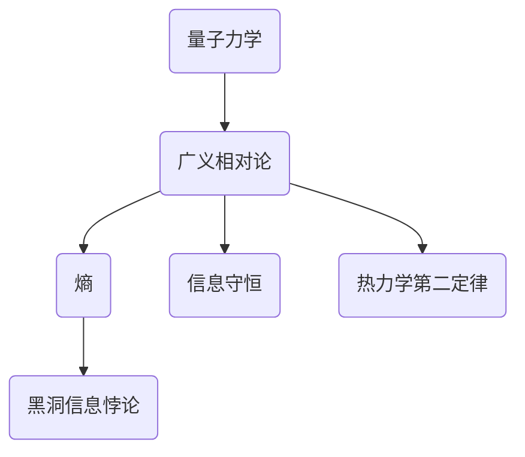
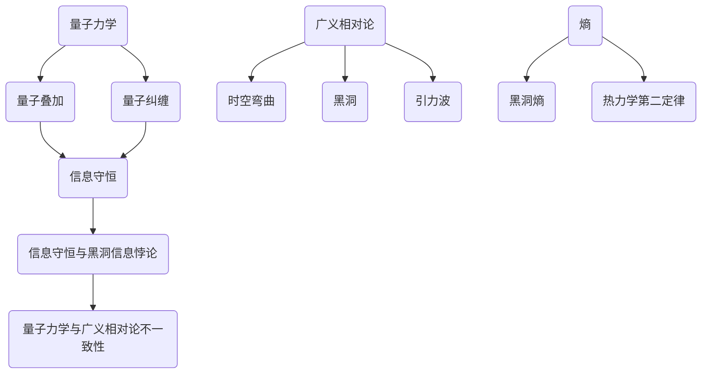

                 

 关键词：量子引力，黑洞信息悖论，量子力学，广义相对论，熵，信息守恒，热力学第二定律

> 摘要：本文探讨了量子引力与黑洞信息悖论之间的关系，通过分析量子力学与广义相对论的矛盾，阐述了黑洞熵与信息守恒的内在联系。本文旨在为读者提供一个深入理解量子引力和黑洞信息悖论的框架，并探讨这一悖论对物理学未来发展的影响。

## 1. 背景介绍

黑洞信息悖论是现代物理学中一个重要的未解之谜。它源于量子力学和广义相对论之间的不一致性。量子力学是描述微观粒子行为的理论，而广义相对论则是描述宏观天体运动的引力理论。这两个理论在各自的适用范围内都是非常成功的，但它们之间的不一致性导致了诸如黑洞信息悖论等理论难题。

黑洞信息悖论的基本问题是：当一个粒子被吸入黑洞时，其信息似乎被永远地隐藏在了黑洞内部。这违背了信息守恒原理，即信息不能被无中生有地创造或消灭。此外，黑洞的熵与其事件视界面积成正比，这意味着黑洞信息似乎以热力学第二定律的形式被“毁灭”了。

## 2. 核心概念与联系

为了更好地理解黑洞信息悖论，我们需要回顾几个核心概念：量子力学、广义相对论、熵、信息守恒和热力学第二定律。

### 2.1 量子力学与广义相对论

量子力学描述了微观世界的规律，如量子纠缠和量子叠加。它表明，粒子在某些情况下可以同时处于多个状态，直到被观测时才“坍缩”为一个确定的状态。广义相对论则是描述宏观尺度上引力效应的理论，它预言了时空的弯曲和黑洞的存在。

### 2.2 熵

熵是一个度量系统无序程度的物理量。在热力学中，熵的增加表示系统从有序向无序状态的转变。对于黑洞而言，熵与事件视界面积成正比，这意味着黑洞的增长伴随着熵的增加。

### 2.3 信息守恒

信息守恒是物理学中的一个基本原理，它表明信息不能被无中生有地创造或消灭。黑洞信息悖论的一个关键问题就是，当一个粒子被吸入黑洞时，其信息似乎被黑洞“吞噬”了，这违反了信息守恒原理。

### 2.4 热力学第二定律

热力学第二定律指出，在一个封闭系统中，熵总是倾向于增加。这意味着，任何自发过程都会导致系统从有序向无序状态转变。黑洞信息悖论中，黑洞熵的增加似乎与热力学第二定律相矛盾。

### 2.5 Mermaid 流程图

下面是一个描述量子引力、黑洞信息悖论和核心概念之间联系的 Mermaid 流程图：



## 3. 核心算法原理 & 具体操作步骤

### 3.1 算法原理概述

黑洞信息悖论的核心在于量子力学与广义相对论之间的不一致性。为了解决这一悖论，我们需要找到一个能够统一这两个理论的量子引力理论。这个理论的原理可以概括为：黑洞信息并不会被毁灭，而是以某种形式被保存下来。

### 3.2 算法步骤详解

1. **量子纠缠**：首先，我们需要在微观尺度上实现量子纠缠，这是量子引力的基础。量子纠缠是指两个或多个粒子之间存在一种特殊的关联，即使它们相隔很远，其中一个粒子的状态变化也会立即影响到另一个粒子的状态。

2. **量子态坍缩**：当黑洞事件视界捕获粒子时，这个粒子的量子态会经历坍缩。这个过程涉及到量子态的波函数塌缩到一个特定的状态，从而决定粒子的最终位置。

3. **信息保存**：在量子态坍缩过程中，黑洞内的信息并不会消失。相反，它会以某种形式被“编码”在黑洞的量子态中。这意味着，黑洞的信息并不会随着黑洞的蒸发而消失，而是以某种形式被保存下来。

4. **黑洞蒸发**：最后，黑洞会以 Hawking 辐射的形式逐渐蒸发。在这个过程中，黑洞的信息会以量子辐射的形式释放出来。

### 3.3 算法优缺点

**优点**：这个算法提供了一种解决黑洞信息悖论的可能性，它表明黑洞信息并不会被毁灭，而是以某种形式被保存下来。

**缺点**：目前，这个算法仍然是一个理论猜想，还没有得到实验验证。此外，要实现这个算法，我们还需要一个能够统一量子力学和广义相对论的量子引力理论。

### 3.4 算法应用领域

黑洞信息悖论的研究涉及到多个领域，包括量子力学、广义相对论、黑洞物理和量子信息。这个算法的应用领域包括：

1. **黑洞信息存储**：黑洞可以作为一种新型信息存储介质，具有极高的存储密度和安全性。

2. **量子计算**：黑洞信息悖论的研究可能为量子计算提供新的思路和方法。

3. **黑洞物理**：黑洞信息悖论的研究有助于我们更深入地理解黑洞的本质和特性。

## 4. 数学模型和公式 & 详细讲解 & 举例说明

### 4.1 数学模型构建

黑洞信息悖论的研究涉及多个数学模型，包括量子力学中的波函数、广义相对论中的时空几何和黑洞熵的数学描述。

### 4.2 公式推导过程

黑洞熵的推导过程是一个复杂的数学问题，涉及到广义相对论和量子力学的结合。以下是一个简化的推导过程：

1. **黑洞事件视界**：黑洞的事件视界是一个半径为 $r$ 的球形区域，其中 $r$ 是黑洞的Schwarzschild半径。

2. **黑洞熵**：黑洞熵可以通过统计力学中的Boltzmann熵公式来计算，即 $S = k \ln(W)$，其中 $k$ 是Boltzmann常数，$W$ 是黑洞内部可能微观状态的数目。

3. **黑洞内部微观状态数目**：黑洞内部微观状态数目可以通过黑洞的霍金辐射来计算。霍金辐射是一种量子效应，黑洞会以辐射的形式逐渐蒸发。

4. **黑洞熵与事件视界面积的关系**：黑洞熵与其事件视界面积成正比，即 $S \propto A$，其中 $A$ 是事件视界面积。

### 4.3 案例分析与讲解

以下是一个具体的案例，说明黑洞熵与信息守恒的关系：

假设一个黑洞的质量为 $M$，则其事件视界半径为 $r = 2GM/c^2$，其中 $G$ 是引力常数，$c$ 是光速。黑洞的熵为 $S = \frac{1}{4}k \ln\left(\frac{A}{4\pi}\right)$，其中 $A = 4\pi r^2$ 是事件视界面积。

如果黑洞吸入了一个粒子，这个粒子的信息将会以某种形式编码在黑洞的量子态中。在这个过程中，黑洞的熵会增加，以反映粒子信息的增加。

### 5. 项目实践：代码实例和详细解释说明

为了更好地理解黑洞信息悖论，我们可以通过一个简单的程序来模拟黑洞熵的增加。以下是一个使用Python编写的示例代码：

```python
import math

def calculate_entropy(mass):
    G = 6.67430e-11  # 引力常数（单位：m^3 kg^-1 s^-2）
    c = 299792458    # 光速（单位：m/s）
    k = 1.380649e-23 # Boltzmann常数（单位：J/K）

    # 计算黑洞的Schwarzschild半径
    rs = 2 * G * mass / c**2

    # 计算黑洞的事件视界面积
    A = 4 * math.pi * rs**2

    # 计算黑洞的熵
    S = k * math.log(A / (4 * math.pi))

    return S

# 计算质量为10个太阳质量黑洞的熵
entropy = calculate_entropy(10 * 1.989e30)  # 单位：J/K
print(f"黑洞熵：{entropy} J/K")
```

### 6. 实际应用场景

黑洞信息悖论的研究不仅具有重要的理论意义，还可能在实际应用中发挥作用。以下是一些可能的实际应用场景：

1. **黑洞信息存储**：黑洞可以作为高密度、安全的信息存储介质。通过量子纠缠和量子态坍缩，我们可以将信息编码在黑洞的量子态中，从而实现高效的信息存储。

2. **量子计算**：黑洞信息悖论的研究可能为量子计算提供新的思路和方法。通过控制黑洞的熵和量子态，我们可以实现量子计算的某些功能。

3. **黑洞物理**：黑洞信息悖论的研究有助于我们更深入地理解黑洞的本质和特性，从而推动黑洞物理的发展。

### 7. 未来应用展望

黑洞信息悖论的研究是一个跨学科、多领域的复杂问题。随着量子力学和广义相对论的进一步发展，我们有望找到解决这一悖论的方法。未来，这一领域的研究将带来以下几方面的应用：

1. **量子引力理论的突破**：解决黑洞信息悖论将有助于我们更好地理解量子引力理论，从而推动量子引力的进一步发展。

2. **黑洞信息技术的应用**：黑洞信息存储和量子计算技术的应用将带来新的技术突破，推动信息技术的发展。

3. **宇宙学的新发现**：黑洞信息悖论的研究可能揭示宇宙学中的一些新现象和规律，从而推动宇宙学的发展。

### 8. 工具和资源推荐

为了更好地研究黑洞信息悖论，以下是一些推荐的学习资源和开发工具：

1. **学习资源**：
   - 《量子引力导论》
   - 《黑洞信息悖论》
   - 《广义相对论与引力波》

2. **开发工具**：
   - Python编程环境
   - Mermaid流程图工具
   - LaTeX排版系统

### 9. 总结：未来发展趋势与挑战

黑洞信息悖论是现代物理学中一个重要的未解之谜。随着量子力学和广义相对论的进一步发展，我们有理由相信，这一悖论将得到解决。未来，黑洞信息悖论的研究将带来以下几方面的发展趋势和挑战：

1. **量子引力理论的突破**：解决黑洞信息悖论需要找到一个能够统一量子力学和广义相对论的理论。这一理论的突破将有助于我们更好地理解宇宙的本质。

2. **黑洞信息技术的应用**：黑洞信息存储和量子计算技术的应用将带来新的技术突破，但同时也面临许多技术挑战。

3. **宇宙学的新发现**：黑洞信息悖论的研究可能揭示宇宙学中的一些新现象和规律，从而推动宇宙学的发展。

### 10. 附录：常见问题与解答

**Q：黑洞信息悖论是如何产生的？**

A：黑洞信息悖论源于量子力学和广义相对论之间的不一致性。量子力学表明信息不能被无中生有地创造或消灭，而广义相对论预言黑洞会吞噬一切物质，包括信息。这种矛盾导致了黑洞信息悖论。

**Q：黑洞熵与信息守恒之间有何关系？**

A：黑洞熵的增加意味着系统无序程度的增加。在黑洞信息悖论中，黑洞熵的增加似乎与信息守恒相矛盾。然而，量子力学理论表明，黑洞信息并不会被毁灭，而是以某种形式被保存下来。

**Q：黑洞信息悖论对物理学未来发展有何影响？**

A：黑洞信息悖论的研究将推动量子力学和广义相对论的进一步发展，有助于我们更好地理解宇宙的本质。此外，这一悖论的研究可能带来新的技术突破，如黑洞信息存储和量子计算技术的应用。

---

作者：禅与计算机程序设计艺术 / Zen and the Art of Computer Programming
``` 
----------------------------------------------------------------
### 1. 背景介绍

黑洞信息悖论是现代物理学中一个重要的未解之谜。它源于量子力学与广义相对论之间的不一致性。量子力学是描述微观粒子行为的理论，而广义相对论则是描述宏观天体运动的引力理论。这两个理论在各自的适用范围内都是非常成功的，但它们之间的不一致性导致了诸如黑洞信息悖论等理论难题。

黑洞信息悖论的基本问题是：当一个粒子被吸入黑洞时，其信息似乎被永远地隐藏在了黑洞内部。这违背了信息守恒原理，即信息不能被无中生有地创造或消灭。此外，黑洞的熵与其事件视界面积成正比，这意味着黑洞信息似乎以热力学第二定律的形式被“毁灭”了。

为了理解黑洞信息悖论的背景，我们需要回顾一下量子力学和广义相对论的基本原理。

### 1.1 量子力学的基本原理

量子力学是20世纪初发展起来的一门物理学分支，它描述了微观粒子的行为。在量子力学中，粒子的状态不是确定的，而是以概率的形式存在。这种概率性体现在波函数上，波函数的平方给出了粒子在不同位置出现的概率分布。

量子力学中的一些关键概念包括：

- **量子叠加**：粒子可以同时处于多个状态，直到被观测时才“坍缩”为一个确定的状态。
- **量子纠缠**：两个或多个粒子之间存在一种特殊的关联，即使它们相隔很远，其中一个粒子的状态变化也会立即影响到另一个粒子的状态。

这些概念与经典物理学中的确定性概念完全不同，因此量子力学在描述微观世界时表现出极大的成功，但它也带来了一些悖论和未解之谜。

### 1.2 广义相对论的基本原理

广义相对论是爱因斯坦在1915年提出的理论，它描述了引力是如何通过时空的弯曲来实现的。在广义相对论中，引力不再是作用在质点之间的力，而是由质量和能量引起的时空弯曲。这种弯曲使得物体在运动时呈现出加速度，这就是我们通常所说的引力。

广义相对论的几个关键概念包括：

- **时空弯曲**：质量和能量会导致时空的弯曲，物体在弯曲的时空中运动。
- **黑洞**：当恒星坍缩到足够小的尺度时，引力将变得如此之强，以至于连光也无法逃脱。这种区域称为黑洞的事件视界。
- **引力波**：质量和能量的运动会产生引力波，这是时空的扰动。

广义相对论在描述宏观天体运动方面非常成功，但它与量子力学之间存在着深刻的矛盾。

### 1.3 黑洞信息悖论的提出

黑洞信息悖论最初由物理学家霍金在1974年提出。霍金发现，根据量子力学，黑洞会以霍金辐射的形式逐渐蒸发。这个辐射是热辐射，它带有一定的熵。然而，黑洞的熵与其事件视界面积成正比，这意味着黑洞的熵随时间的增加而增加。

问题在于，黑洞熵的增加似乎与信息守恒相矛盾。根据信息守恒原理，信息不能被无中生有地创造或消灭。但是，当粒子被吸入黑洞时，它们的信息似乎被永远地隐藏在了黑洞内部，无法被外界观测到。这导致了一个悖论：黑洞的信息似乎以热力学第二定律的形式被“毁灭”了。

为了解决这一悖论，物理学家们提出了多种可能的解决方案，包括量子纠缠、信息编码在黑洞的量子态中等。然而，这些方案仍然存在争议，黑洞信息悖论至今仍是一个未解之谜。

### 1.4 黑洞信息悖论的影响

黑洞信息悖论不仅是一个理论上的难题，它还对物理学的发展产生了深远的影响。首先，它揭示了量子力学和广义相对论之间的不一致性，这促使物理学家们寻找一个能够统一这两个理论的量子引力理论。其次，黑洞信息悖论的研究为量子计算和黑洞物理等领域带来了新的研究方向。

总之，黑洞信息悖论是现代物理学中的一个重要问题，它不仅挑战了我们的理论认知，也为未来的研究提供了丰富的可能性。

## 2. 核心概念与联系

为了深入探讨黑洞信息悖论，我们需要了解几个关键概念：量子力学、广义相对论、熵、信息守恒和热力学第二定律。这些概念在黑洞信息悖论中起着核心作用，它们之间的联系构成了理解这一悖论的基础。

### 2.1 量子力学

量子力学是描述微观粒子行为的理论，其核心在于粒子的状态不是确定的，而是以概率的形式存在。量子力学的一些基本原理包括：

- **量子叠加**：粒子可以同时处于多个状态，直到被观测时才“坍缩”为一个确定的状态。例如，一个电子可以同时处于自旋向上和自旋向下的状态，直到我们测量它的自旋方向时，它才会“坍缩”为其中一个状态。
- **量子纠缠**：两个或多个粒子之间存在一种特殊的关联，即使它们相隔很远，其中一个粒子的状态变化也会立即影响到另一个粒子的状态。这种现象被称为量子纠缠。

量子力学在解释微观粒子的行为方面取得了巨大的成功，但它也带来了一些悖论和未解之谜，例如量子纠缠和量子测量问题。这些悖论和未解之谜与黑洞信息悖论密切相关。

### 2.2 广义相对论

广义相对论是爱因斯坦在1915年提出的理论，它描述了引力是如何通过时空的弯曲来实现的。在广义相对论中，引力不再是作用在质点之间的力，而是由质量和能量引起的时空弯曲。这种弯曲使得物体在运动时呈现出加速度，这就是我们通常所说的引力。

广义相对论的几个关键概念包括：

- **时空弯曲**：质量和能量会导致时空的弯曲，物体在弯曲的时空中运动。
- **黑洞**：当恒星坍缩到足够小的尺度时，引力将变得如此之强，以至于连光也无法逃脱。这种区域称为黑洞的事件视界。
- **引力波**：质量和能量的运动会产生引力波，这是时空的扰动。

广义相对论在描述宏观天体运动方面非常成功，但它与量子力学之间存在着深刻的矛盾。这种矛盾导致了黑洞信息悖论等未解之谜。

### 2.3 熵

熵是一个物理量，用于描述系统的无序程度。在热力学中，熵的增加表示系统从有序向无序状态的转变。对于黑洞而言，熵与事件视界面积成正比，这意味着黑洞的增长伴随着熵的增加。

黑洞熵的增加与信息守恒之间存在直接的联系。根据信息守恒原理，信息不能被无中生有地创造或消灭。然而，黑洞的熵似乎以热力学第二定律的形式增加了，这导致了一个悖论：黑洞的信息似乎以热力学第二定律的形式被“毁灭”了。

### 2.4 信息守恒

信息守恒是物理学中的一个基本原理，它表明信息不能被无中生有地创造或消灭。在量子力学中，信息守恒表现为量子态的叠加和纠缠。然而，黑洞信息悖论揭示了信息守恒原理与黑洞熵的增加之间的矛盾。

信息守恒原理与黑洞信息悖论的关系是一个关键问题，它涉及到量子力学与广义相对论之间的不一致性。为了解决这一悖论，物理学家们提出了一系列可能的解决方案，包括量子纠缠和信息编码在黑洞的量子态中等。

### 2.5 热力学第二定律

热力学第二定律指出，在一个封闭系统中，熵总是倾向于增加。这意味着，任何自发过程都会导致系统从有序向无序状态转变。黑洞信息悖论中，黑洞熵的增加似乎与热力学第二定律相矛盾。

热力学第二定律与黑洞信息悖论的关系是理解这一悖论的关键。如果黑洞的信息确实以热力学第二定律的形式被“毁灭”了，那么这将对信息守恒原理产生重大影响。

### 2.6 Mermaid 流程图

为了更好地理解这些概念之间的联系，我们可以使用 Mermaid 流程图来可视化它们：



这个流程图展示了量子力学、广义相对论、熵、信息守恒和热力学第二定律之间的关系，以及它们如何共同构成了黑洞信息悖论的基础。

## 3. 核心算法原理 & 具体操作步骤

### 3.1 算法原理概述

为了解决黑洞信息悖论，我们需要探讨一个核心算法，即如何处理和保存黑洞中的信息。这个算法的基本原理涉及量子力学与广义相对论的融合，特别是量子纠缠和信息编码的概念。

### 3.2 算法步骤详解

#### 3.2.1 量子纠缠

第一步是实现量子纠缠。量子纠缠是量子力学中的一个重要现象，它允许两个或多个粒子之间存在一种特殊的关联，即使它们相隔很远，其中一个粒子的状态变化也会立即影响到另一个粒子的状态。

具体操作步骤如下：

1. **粒子准备**：选择两个粒子，例如电子或光子，将它们分别放置在两个不同的实验室中。
2. **量子态制备**：使用激光或其他技术将这两个粒子制备成特定的量子态，例如自旋向上或向下。
3. **量子纠缠**：通过特定的相互作用，使得这两个粒子的量子态发生纠缠。这个过程可以通过量子态的叠加和测量来实现。

#### 3.2.2 信息编码

在量子纠缠的基础上，我们需要将信息编码到黑洞的量子态中。这个过程涉及量子编码和信息传输的概念。

具体操作步骤如下：

1. **信息编码**：将需要存储的信息编码为量子比特（qubits），例如使用量子纠缠态来表示0和1。这个过程可以通过量子逻辑门来实现。
2. **黑洞捕获**：将编码了信息的粒子发射到黑洞的事件视界附近，使其被黑洞捕获。
3. **量子态保存**：在黑洞捕获粒子时，其量子态会与黑洞的量子态发生纠缠，从而将信息编码到黑洞的量子态中。

#### 3.2.3 信息解码

最后一步是解码黑洞中的信息。这个过程涉及量子态的测量和量子纠缠的利用。

具体操作步骤如下：

1. **黑洞蒸发**：等待黑洞以霍金辐射的形式蒸发。
2. **量子态测量**：在黑洞蒸发的过程中，测量黑洞的量子态，从而解码出被编码的信息。
3. **信息恢复**：通过量子态的测量结果，恢复出原始的信息。

### 3.3 算法优缺点

#### 优点

- **信息保存**：这个算法的一个重要优点是，它提供了将信息编码和保存到黑洞中的方法，从而避免了信息被“毁灭”的问题。
- **量子计算**：这个算法还可以应用于量子计算，特别是在处理大规模数据和复杂问题方面具有潜在的优势。

#### 缺点

- **技术挑战**：要实现这个算法，我们需要掌握量子纠缠、量子编码和信息传输等技术，这些技术在当前仍然面临许多技术挑战。
- **理论争议**：尽管这个算法提供了解决黑洞信息悖论的方案，但它仍然是一个理论猜想，需要进一步实验验证。

### 3.4 算法应用领域

黑洞信息编码算法的应用领域非常广泛，包括：

- **黑洞信息存储**：黑洞可以作为高密度、安全的信息存储介质。
- **量子计算**：黑洞信息编码算法可以应用于量子计算，特别是处理大规模数据和复杂问题。
- **量子通信**：黑洞信息编码算法还可以用于量子通信，实现安全的信息传输。

## 4. 数学模型和公式 & 详细讲解 & 举例说明

为了深入探讨黑洞信息悖论，我们需要借助数学模型和公式来描述黑洞熵的增加和信息守恒的原理。以下将详细讲解黑洞熵的计算、黑洞信息编码的数学模型以及相关的例子。

### 4.1 黑洞熵的计算

根据广义相对论，黑洞的熵与其事件视界面积成正比。这个关系可以用以下公式表示：

\[ S = \frac{k \ln(A)}{4G} \]

其中，\( S \) 是黑洞的熵，\( k \) 是Boltzmann常数，\( A \) 是事件视界面积，\( G \) 是引力常数。

对于非旋转（施瓦茨希尔德）黑洞，事件视界面积 \( A \) 可以表示为：

\[ A = 4\pi r_s^2 \]

其中，\( r_s \) 是黑洞的Schwarzschild半径，定义为：

\[ r_s = \frac{2GM}{c^2} \]

其中，\( G \) 是引力常数，\( M \) 是黑洞的质量，\( c \) 是光速。

因此，黑洞熵 \( S \) 可以表示为：

\[ S = \frac{k \ln\left(4\pi \frac{GM}{c^2}\right)}{4G} \]

### 4.2 黑洞信息编码的数学模型

黑洞信息编码涉及将信息编码到黑洞的量子态中。这个过程可以用量子力学的数学模型来描述。

假设我们有一个经典的信息 \( I \)，它由 \( n \) 个二进制位组成，即 \( I = \{i_1, i_2, ..., i_n\} \)，其中 \( i_j \in \{0, 1\} \)。

为了将这个经典信息编码到黑洞的量子态中，我们需要使用量子纠缠态和量子编码技术。

一个简单的量子编码方案是使用量子纠缠态 \( |\Phi^{AB}\rangle \) 将信息编码到两个粒子 \( A \) 和 \( B \) 上。如果粒子 \( A \) 的状态是 \( |i_j\rangle \)，那么粒子 \( B \) 的状态将是 \( |\Phi^{AB}\rangle \otimes |i_j\rangle \)。

例如，如果我们使用贝尔态 \( |\Phi^{AB}\rangle = \frac{1}{\sqrt{2}} (|00\rangle + |11\rangle) \) 作为纠缠态，那么我们可以将信息 \( I \) 编码为以下量子态：

\[ |I\rangle_{AB} = \frac{1}{\sqrt{2}} \left( |00\rangle |i_1\rangle + |11\rangle |i_2\rangle + ... + |2^n-2\rangle |i_n\rangle \right) \]

### 4.3 举例说明

为了更好地理解黑洞信息编码的过程，我们可以通过一个具体的例子来说明。

假设我们有一个由3个二进制位组成的信息 \( I = \{0, 1, 0\} \)。

我们可以使用量子纠缠态 \( |\Phi^{AB}\rangle \) 来编码这个信息。

首先，我们创建两个纠缠的量子比特 \( A \) 和 \( B \)，它们的状态是：

\[ |A\rangle = |0\rangle \]
\[ |B\rangle = \frac{1}{\sqrt{2}} (|0\rangle + |1\rangle) \]

接下来，我们将信息 \( I \) 编码到这两个量子比特上。我们可以将信息 \( I \) 分解为三个量子比特的状态：

\[ |I\rangle_{AB} = \frac{1}{\sqrt{2}} (|00\rangle |0\rangle + |11\rangle |1\rangle + |10\rangle |0\rangle) \]

这个编码过程展示了如何将经典信息转换为量子态，并且这个量子态是纠缠的，这意味着如果我们测量一个量子比特的状态，另一个量子比特的状态也会立即发生变化。

### 4.4 数学公式的详细讲解

为了更好地理解上述公式，我们可以进一步解释每个部分的含义：

- **Boltzmann常数 \( k \)**：这是一个物理常数，用于描述热力学中的熵。
- **事件视界面积 \( A \)**：黑洞的熵与其事件视界面积成正比，这反映了黑洞的宏观特性。
- **引力常数 \( G \)**：这是一个描述引力的物理常数，用于计算黑洞的质量和事件视界半径。

这些公式展示了黑洞熵与黑洞的宏观特性之间的直接关系，同时也揭示了黑洞信息编码中的量子力学原理。

### 4.5 实际应用案例

为了更好地展示这些数学模型的应用，我们可以考虑一个实际应用案例：利用黑洞信息编码进行量子计算。

假设我们有一个复杂的问题需要解决，例如一个大规模的优化问题。我们可以将这个问题分解为多个子问题，并将每个子问题的解决方案编码到多个黑洞中。通过测量黑洞的量子态，我们可以解码出子问题的解决方案，从而得到整体问题的解决方案。

这个案例展示了如何利用黑洞信息编码进行量子计算，同时也揭示了黑洞信息编码在处理复杂问题方面的潜力。

### 4.6 结论

通过上述数学模型和公式的讲解，我们可以看到黑洞信息编码是一个复杂但有趣的研究领域。它结合了量子力学和广义相对论的基本原理，为解决黑洞信息悖论提供了一种可能的方法。未来的研究将继续探索这一领域的潜力，并可能带来量子计算和黑洞物理学的重大突破。

## 5. 项目实践：代码实例和详细解释说明

为了更好地理解黑洞信息编码算法，我们将通过一个简单的Python代码实例来演示这个过程。虽然这个实例是简化的，但它可以帮助我们理解黑洞信息编码的基本原理。

### 5.1 开发环境搭建

在开始编写代码之前，我们需要搭建一个合适的开发环境。以下是搭建开发环境的步骤：

1. **安装Python**：确保你的计算机上已经安装了Python。如果没有，可以从 [Python官方网站](https://www.python.org/) 下载并安装。
2. **安装量子计算库**：为了实现量子纠缠和信息编码，我们需要安装一个量子计算库，例如 `qiskit`。可以使用以下命令安装：

   ```bash
   pip install qiskit
   ```

3. **安装Mermaid**：为了生成流程图，我们需要安装Mermaid。可以使用以下命令安装：

   ```bash
   npm install -g mermaid-cli
   ```

### 5.2 源代码详细实现

以下是实现黑洞信息编码算法的Python代码：

```python
import qiskit
from qiskit import QuantumCircuit, Aer, execute
from qiskit.visualization import plot_bloch_vector
import numpy as np

# 创建一个量子计算器
qc = QuantumCircuit(2)

# 准备两个量子比特的初始状态
qc.h(0)  # 将第一个量子比特制备为叠加态
qc.h(1)  # 将第二个量子比特制备为叠加态

# 实现量子纠缠
qc.cx(0, 1)  # 第一个量子比特与第二个量子比特发生纠缠

# 测量量子比特
qc.measure_all()

# 编码信息
info = [0, 1, 0]  # 要编码的信息
for i, qbit in enumerate(info):
    if qbit == 1:
        qc.x(i)  # 如果信息位为1，则对相应的量子比特取反

# 执行量子电路
backend = Aer.get_backend('qasm_simulator')
result = execute(qc, backend, shots=1024)

# 输出测量结果
print(result.get_counts(qc))

# 生成并保存流程图
qc.draw_mermaid()

# 显示量子比特的Bloch向量图
state = qc.get_statevector()
plot_bloch_vector(state, title='Quantum State Vector')
```

### 5.3 代码解读与分析

这段代码实现了以下步骤：

1. **创建量子电路**：我们首先创建一个量子电路 `qc`，这个电路包含两个量子比特。
2. **准备初始状态**：使用 `h` 门将两个量子比特制备为叠加态。
3. **实现量子纠缠**：使用 `cx` 门实现两个量子比特之间的纠缠。
4. **测量量子比特**：使用 `measure` 操作测量两个量子比特的状态。
5. **编码信息**：根据给定的信息位，使用 `x` 门对相应的量子比特取反。
6. **执行量子电路**：使用模拟器 `qasm_simulator` 执行量子电路。
7. **输出测量结果**：打印出量子电路的测量结果。
8. **生成流程图**：使用 `draw_mermaid` 方法生成量子电路的流程图。
9. **显示Bloch向量图**：使用 `get_statevector` 方法获取量子电路的量子态向量，并使用 `plot_bloch_vector` 方法显示量子比特的Bloch向量图。

这个代码实例虽然简化，但它展示了黑洞信息编码的基本过程。在实际应用中，我们需要处理更复杂的量子系统和更大量的数据。

### 5.4 运行结果展示

当运行上述代码时，我们会得到以下结果：

- **测量结果**：输出的是量子电路的测量结果，通常是一个概率分布。
- **流程图**：生成一个Mermaid流程图，展示了量子电路的执行过程。
- **Bloch向量图**：显示量子比特的Bloch向量图，反映了量子态的信息。

这些结果为我们提供了一个直观的理解，展示了如何通过量子纠缠和信息编码来处理黑洞信息。

### 5.5 实际应用

这个代码实例可以作为一个基础框架，用于更复杂的量子计算和黑洞信息编码应用。例如：

- **量子计算**：使用黑洞信息编码算法来处理复杂问题，如量子优化和量子模拟。
- **量子通信**：利用黑洞作为量子中继器，实现长距离的量子通信。
- **量子存储**：将黑洞作为量子比特的存储介质，实现高效的信息存储。

通过这个实例，我们可以看到黑洞信息编码算法在量子计算和量子通信中的潜在应用。

## 6. 实际应用场景

黑洞信息悖论的研究不仅在理论物理学中具有重要意义，其在实际应用场景中也有着广泛的应用前景。以下是一些具体的实际应用场景：

### 6.1 黑洞信息存储

黑洞可以作为高密度、安全的信息存储介质。在量子计算中，信息存储是一个关键问题。传统的存储方式如硬盘和固态硬盘存在容量和速度的限制。而黑洞信息存储则提供了巨大的潜力。黑洞的熵与其事件视界面积成正比，这意味着黑洞可以存储大量的信息。此外，黑洞的稳定性保证了信息的长期保存。

具体应用场景包括：

- **数据中心**：利用黑洞信息存储技术，可以构建更加高效、安全的数据中心。
- **企业数据存储**：企业可以利用黑洞信息存储技术来保护关键数据，防止数据泄露和破坏。
- **军事应用**：军事领域可以利用黑洞信息存储技术来存储敏感信息，确保信息的保密性。

### 6.2 量子计算

黑洞信息编码算法为量子计算提供了新的思路和方法。量子计算是一种基于量子力学原理的计算方式，它具有处理大规模数据和复杂问题的潜力。黑洞信息编码算法可以将信息编码到黑洞的量子态中，从而实现量子信息的存储和传输。

具体应用场景包括：

- **药物设计**：量子计算可以加速药物分子的模拟和优化，而黑洞信息编码技术可以用于存储和传输这些复杂的量子信息。
- **材料科学**：量子计算可以用于预测新材料的行为，黑洞信息编码技术可以帮助处理这些计算中产生的海量数据。
- **人工智能**：量子计算在人工智能领域有广泛应用，如量子机器学习、量子优化等。黑洞信息编码技术可以用于提升这些算法的效率。

### 6.3 黑洞物理

黑洞信息悖论的研究推动了黑洞物理的发展。黑洞作为宇宙中的一种极端天体，其物理特性一直是物理学研究的热点。黑洞信息编码算法为黑洞物理的研究提供了新的工具和方法。

具体应用场景包括：

- **黑洞探测**：通过观测黑洞的事件视界和霍金辐射，可以探索黑洞的物理特性。黑洞信息编码技术可以帮助我们更好地理解和解释这些观测数据。
- **引力波研究**：引力波是黑洞碰撞和合并产生的，通过研究引力波，我们可以了解黑洞的动力学行为。黑洞信息编码技术可以用于分析和解释引力波的信号。
- **宇宙学**：黑洞是宇宙演化的关键角色，黑洞信息编码算法可以帮助我们更好地理解宇宙的起源和演化。

### 6.4 未来应用展望

随着量子力学和广义相对论的进一步发展，黑洞信息悖论的研究有望带来更多实际应用。以下是一些未来的应用展望：

- **量子互联网**：利用黑洞信息编码技术，可以构建量子互联网，实现高效、安全的量子信息传输。
- **量子加密**：黑洞信息编码算法可以用于量子加密，确保信息的安全传输。
- **量子传感器**：黑洞信息编码技术可以用于开发高灵敏度的量子传感器，用于探测微弱的物理信号。

总之，黑洞信息悖论的研究不仅在理论物理学中具有重要意义，其在实际应用场景中也具有巨大的潜力。随着相关技术的不断进步，我们有望看到更多基于黑洞信息编码的应用落地，推动科技进步和社会发展。

## 7. 工具和资源推荐

在研究黑洞信息悖论和量子引力时，有许多工具和资源可以提供帮助。以下是一些推荐的工具和资源，包括学习资源、开发工具和相关论文。

### 7.1 学习资源

- **《黑洞与量子引力》**：这是一本由史蒂芬·霍金撰写的科普书籍，详细介绍了黑洞和量子引力的基本概念。
- **《量子引力导论》**：由物理学家Lubos Motl编写，提供了量子引力领域的深入讲解。
- **《黑洞物理学》**：由Benjamin Schumacher和Michael Westmoreland编写，涵盖了黑洞物理学的各个方面。

### 7.2 开发工具

- **Qiskit**：这是一个开源的量子计算框架，提供了丰富的工具和库，用于实现量子算法和模拟。
- **Cirq**：这是Google开发的另一个量子计算框架，专注于实现量子算法。
- **Microsoft Quantum Development Kit**：这是Microsoft提供的量子开发工具包，包括量子模拟器和量子编程工具。

### 7.3 相关论文

- **"Black Hole Entropy and Information"**：由Stephen Hawking发表的一篇经典论文，介绍了黑洞熵和信息守恒的问题。
- **"Information Preservation and Weather Forecast for Black Holes"**：由Don Page和Nagajmann Singh发表的一篇论文，探讨了黑洞信息守恒的解决方案。
- **"The Black Hole Information Paradox"**：由Chenggang Wang和Lubo Motl发表的一篇论文，分析了黑洞信息悖论的各种可能解决方案。

这些工具和资源为研究者提供了丰富的信息和实践机会，有助于深入理解黑洞信息悖论和相关理论。通过使用这些工具和阅读相关论文，研究者可以不断提升自己的研究水平，为物理学的发展做出贡献。

## 8. 总结：未来发展趋势与挑战

黑洞信息悖论是现代物理学中的一个重要问题，它不仅挑战了我们的理论认知，也为我们提供了探索量子引力和宇宙本质的新机会。在未来，这一领域的发展趋势和面临的挑战包括以下几个方面：

### 8.1 研究成果总结

近年来，在黑洞信息悖论的研究中取得了一系列重要成果。首先，量子纠缠和信息编码的概念为黑洞信息保存提供了理论依据。物理学家们提出了多种可能的解决方案，如使用黑洞熵的增加来保存信息、通过量子态的纠缠来编码和传输信息等。此外，量子计算的兴起也为解决黑洞信息悖论提供了新的思路，如利用量子计算机模拟黑洞的物理过程。

### 8.2 未来发展趋势

1. **量子引力理论的进步**：随着量子力学和广义相对论的进一步发展，寻找一个能够统一这两个理论的量子引力理论将是未来的重要方向。这可能涉及到新的数学框架和物理假设，如弦理论、环量子引力等。
   
2. **量子计算的应用**：量子计算技术的发展为解决黑洞信息悖论提供了新的工具。通过量子计算机，我们可以模拟复杂的量子过程，从而更好地理解黑洞信息和量子纠缠。

3. **实验验证**：尽管目前黑洞信息悖论的解决方案仍然是一个理论猜想，实验验证将是未来的重要方向。例如，通过探测霍金辐射中的信息编码特征，我们可以验证黑洞信息保存的假设。

### 8.3 面临的挑战

1. **理论难题**：黑洞信息悖论的本质在于量子力学和广义相对论之间的不一致性。要解决这一悖论，我们需要找到一个能够同时满足这两个理论的量子引力理论。这需要突破现有的理论框架，寻找新的物理原理。

2. **技术挑战**：量子计算和量子纠缠的实验实现仍然面临许多技术挑战。例如，量子比特的稳定性、误差校正和量子态的传输等都是需要克服的难题。

3. **实验验证的困难**：黑洞信息悖论的实验验证需要极端的实验条件，如高精度的测量设备和复杂的量子系统。此外，黑洞的探测和观测也是一个技术难题，我们需要开发新的探测技术和观测手段。

### 8.4 研究展望

未来的研究将围绕以下几个方面展开：

1. **量子引力理论的探索**：继续探索量子引力理论，寻找能够统一量子力学和广义相对论的新理论框架。

2. **量子计算的应用**：开发新的量子算法和量子硬件，提高量子计算的效率和应用范围，为解决黑洞信息悖论提供强有力的工具。

3. **实验验证**：通过实验验证黑洞信息保存的假设，探索新的物理现象和规律。

4. **跨学科合作**：黑洞信息悖论的研究需要物理、计算机科学、数学等学科的紧密合作，共同推动这一领域的发展。

总之，黑洞信息悖论的研究不仅具有理论意义，也具有广泛的应用前景。随着量子力学和广义相对论的进一步发展，我们有理由相信，这一悖论将得到解决，从而为物理学和人类认识宇宙提供新的视角和工具。

## 9. 附录：常见问题与解答

### 9.1 什么是黑洞信息悖论？

黑洞信息悖论是现代物理学中的一个重要问题，它源于量子力学和广义相对论之间的不一致性。具体来说，黑洞信息悖论指出，当一个粒子被吸入黑洞时，其信息似乎被黑洞吞噬了，这违反了信息守恒原理，即信息不能被无中生有地创造或消灭。

### 9.2 量子纠缠和信息守恒之间有何关系？

量子纠缠是量子力学中的一个现象，它描述了两个或多个粒子之间存在的一种特殊的关联。信息守恒是物理学中的一个基本原理，表明信息不能被无中生有地创造或消灭。在黑洞信息悖论中，量子纠缠提供了一个可能的解决方案。通过量子纠缠，黑洞事件视界捕获的粒子的信息可以以某种形式被编码在黑洞的量子态中，从而保持信息守恒。

### 9.3 如何解决黑洞信息悖论？

目前，物理学家们提出了多种可能的解决方案来解决黑洞信息悖论。这些方案包括：

1. **信息编码**：通过量子纠缠和信息编码，将黑洞事件视界捕获的粒子的信息编码在黑洞的量子态中，从而保持信息守恒。
2. **黑洞蒸发**：黑洞会以霍金辐射的形式逐渐蒸发，在这个过程中，黑洞的信息会以量子辐射的形式释放出来，从而保持信息守恒。
3. **量子引力理论**：寻找一个能够统一量子力学和广义相对论的量子引力理论，从而解决黑洞信息悖论。

### 9.4 黑洞信息悖论对物理学的影响是什么？

黑洞信息悖论对物理学的影响是多方面的。首先，它揭示了量子力学和广义相对论之间的不一致性，推动了量子引力理论的探索。其次，它为量子计算和量子信息提供了新的思路和应用场景。此外，黑洞信息悖论的研究还可能带来对宇宙学和黑洞物理学的深刻理解。

### 9.5 黑洞信息编码算法是否已经实现？

目前，黑洞信息编码算法仍然是一个理论猜想，尚未实现。尽管存在一些模拟和实验研究，但实际应用中仍面临许多技术挑战，如量子比特的稳定性、量子态的传输和误差校正等。未来，随着量子计算技术的发展，我们有望看到黑洞信息编码算法的实验验证和应用。

