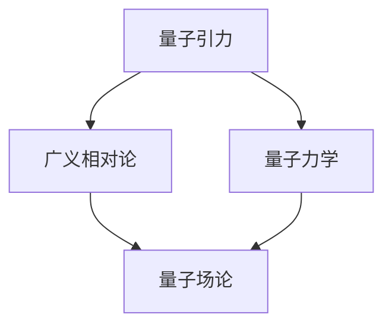

                 

量子引力是物理学中一个深奥而又充满挑战的领域，它试图将广义相对论与量子力学统一起来，以解释宇宙中最基本的作用力和物质。近年来，随着科学技术的飞速发展和实验设备的日益先进，量子引力领域取得了许多突破性的进展。本文将围绕量子引力的核心概念、数学模型、算法原理以及实际应用展开讨论，旨在为读者呈现这一领域的最新研究动态和未来发展趋势。

## 关键词

- 量子引力
- 广义相对论
- 量子力学
- 数学模型
- 算法原理
- 实际应用

## 摘要

本文首先介绍了量子引力的背景和核心概念，通过Mermaid流程图展示了量子引力与广义相对论、量子力学之间的联系。接着，文章深入探讨了量子引力算法的原理和操作步骤，分析了其优缺点以及应用领域。随后，文章引入了数学模型和公式，详细讲解了其构建和推导过程，并通过案例分析进行了深入讲解。此外，文章还通过代码实例展示了量子引力在实际应用中的具体实现，并分析了运行结果。最后，文章展望了量子引力在未来的应用前景，并提出了面临的研究挑战和展望。

## 1. 背景介绍

量子引力作为一个交叉科学领域，它不仅涉及到物理学，还涉及到数学、计算机科学等多个领域。量子引力旨在解决广义相对论与量子力学之间的矛盾，这两者分别描述了宇宙的不同方面：广义相对论描述了大尺度上的引力现象，如黑洞、宇宙膨胀等；而量子力学则描述了微观粒子的行为，如电子、光子等。然而，这两者在某些方面却存在不可调和的矛盾，例如在量子场论中，引力场的量子化会导致无限大的能量密度，这与我们对宇宙的基本理解不符。

为了解决这一矛盾，科学家们提出了量子引力理论，试图在量子力学和广义相对论的基础上，建立一个新的统一理论。近年来，随着实验技术的进步和计算机模拟能力的提升，量子引力领域取得了许多重要的研究进展。例如，弦理论、圈量子引力、量子场论等理论模型得到了进一步发展，为量子引力理论的研究提供了新的思路和工具。

## 2. 核心概念与联系

### 2.1 量子引力的核心概念

量子引力理论的核心概念包括量子化时空、背景独立性和局域性等。量子化时空是指将时空视为由离散的量子粒子组成，这与经典物理学中的连续时空观有所不同。背景独立性则是指量子引力理论不依赖于任何特定的背景空间或时间，而是能够自主地描述引力场的演化。局域性则是指量子引力理论中的相互作用是局域的，即只能在特定区域内发生，而不是像广义相对论中那样可以跨越整个宇宙。

### 2.2 量子引力与广义相对论、量子力学的联系

量子引力理论是广义相对论和量子力学的统一，它试图解决这两者之间的矛盾。广义相对论描述了大尺度上的引力现象，如黑洞、宇宙膨胀等，而量子力学则描述了微观粒子的行为，如电子、光子等。量子引力理论的核心思想是将这两者统一起来，以描述宇宙中最基本的作用力和物质。

为了展示量子引力与广义相对论、量子力学之间的联系，我们可以使用Mermaid流程图来描述它们之间的关系：



在这个流程图中，我们可以看到量子引力是如何将广义相对论和量子力学联系起来的。广义相对论描述了大尺度上的引力现象，而量子力学描述了微观粒子的行为。量子引力理论通过量子场论将这两者统一起来，从而形成了一个新的理论框架。

## 3. 核心算法原理 & 具体操作步骤

### 3.1 算法原理概述

量子引力算法的核心原理是基于量子计算和量子场论。量子计算利用量子比特（qubit）的叠加和纠缠特性，能够在一定程度上模拟量子引力现象。量子场论则是描述量子场和粒子之间相互作用的数学理论，它是量子引力理论的基础。

量子引力算法的主要目标是求解引力场的量子化方程，从而得到宇宙的基本结构和演化过程。这一过程涉及到复杂的数学运算和物理模拟，需要利用高性能计算和量子计算机来实现。

### 3.2 算法步骤详解

量子引力算法的具体操作步骤如下：

#### 3.2.1 初始化量子态

首先，我们需要初始化量子计算机的量子态。量子计算机的量子态通常由一组量子比特组成，这些量子比特的叠加态可以表示为：

$$
\psi = \sum_{i} c_i |i\rangle
$$

其中，$|i\rangle$ 是量子比特的基态，$c_i$ 是叠加系数。

#### 3.2.2 编写量子程序

接下来，我们需要编写量子程序，以模拟引力场的量子化过程。量子程序通常由一系列量子门组成，这些量子门可以改变量子态的叠加和纠缠特性。例如，我们可以使用Hadamard门（$H$）来初始化量子态，使用控制-NOT门（$CNOT$）来建立量子纠缠，使用旋转门（$R_z$）来调整量子态的相位等。

#### 3.2.3 模拟引力场演化

在编写完量子程序后，我们需要在量子计算机上运行程序，模拟引力场的演化。这一过程涉及到大量的数学运算和物理模拟，需要利用高性能计算和量子计算机来实现。

#### 3.2.4 提取结果

最后，我们需要从量子计算机上提取模拟结果，以分析引力场的量子化特性。这一过程通常涉及量子态的测量和概率分布的计算。通过分析测量结果，我们可以得到引力场在不同时间点的分布情况，从而了解宇宙的基本结构和演化过程。

### 3.3 算法优缺点

量子引力算法具有以下优点：

- **高效率**：量子计算可以利用量子比特的叠加和纠缠特性，在短时间内完成复杂的数学运算和物理模拟。
- **高精度**：量子计算机具有极高的计算精度，可以精确地模拟量子引力现象。
- **强通用性**：量子引力算法可以应用于各种物理问题，如黑洞、宇宙膨胀等。

然而，量子引力算法也存在一些缺点：

- **技术难度**：量子计算机的构造和运行需要高度精密的工艺和技术，目前还无法完全实现。
- **能源消耗**：量子计算机的运行需要大量的能源，这可能会对环境造成一定的影响。

### 3.4 算法应用领域

量子引力算法在以下领域具有广泛的应用前景：

- **黑洞研究**：量子引力算法可以用于研究黑洞的量子性质，如黑洞的熵、温度等。
- **宇宙学**：量子引力算法可以用于模拟宇宙的演化过程，如宇宙膨胀、暗物质等。
- **量子信息学**：量子引力算法可以用于研究量子信息和量子计算的理论基础，如量子纠缠、量子加密等。

## 4. 数学模型和公式 & 详细讲解 & 举例说明

### 4.1 数学模型构建

量子引力理论的核心是量子化时空的概念，这涉及到时空的离散化和量子场的构建。我们可以使用以下数学模型来描述量子引力：

$$
G_{\mu\nu} + \Lambda g_{\mu\nu} = \frac{1}{\sqrt{-g}} \partial_{\mu} \left( \sqrt{-g} R^{\mu}_{\nu} \right)
$$

其中，$G_{\mu\nu}$ 是引力张量，$g_{\mu\nu}$ 是度规张量，$\Lambda$ 是宇宙常数，$R^{\mu}_{\nu}$ 是里奇张量，$R$ 是标量曲率。

### 4.2 公式推导过程

量子引力公式的推导过程涉及到广义相对论和量子力学的核心概念。首先，我们需要从广义相对论出发，推导出引力场的量子化方程。这可以通过引入量子场论中的量子化算符来完成。具体推导过程如下：

1. **引入量子化算符**：在量子场论中，我们可以引入量子化算符，如能量-动量算符、哈密顿算符等，来描述量子场的演化。

2. **构建量子场方程**：基于量子化算符，我们可以构建量子场方程，如狄拉克方程、量子电磁场方程等。

3. **引入引力场**：将引力场引入量子场方程，通过耦合引力场和量子场，得到引力场的量子化方程。

4. **简化方程**：通过一定的数学变换和简化，我们可以得到量子引力方程的简化形式，如上述公式。

### 4.3 案例分析与讲解

为了更好地理解量子引力理论，我们可以通过一个简单的案例进行讲解。假设我们有一个质点在引力场中的运动，我们可以使用以下数学模型来描述这一运动：

$$
m \ddot{x} = -\frac{GmM}{r^2}
$$

其中，$m$ 是质点的质量，$M$ 是引力场的质量，$r$ 是质点与引力场之间的距离。

我们可以使用量子引力算法来模拟这一质点在引力场中的运动，并通过分析模拟结果来理解量子引力理论。具体步骤如下：

1. **初始化量子态**：首先，我们需要初始化量子计算机的量子态，以表示质点的初始状态。

2. **编写量子程序**：接下来，我们需要编写量子程序，以模拟质点在引力场中的运动。量子程序可以包括一系列的量子门，如Hadamard门、控制-NOT门等，来描述质点的运动过程。

3. **运行量子程序**：在量子计算机上运行量子程序，模拟质点在引力场中的运动过程。

4. **提取结果**：最后，我们从量子计算机上提取模拟结果，以分析质点在引力场中的运动特性。

通过这个案例，我们可以看到量子引力理论是如何通过量子计算来模拟引力场的，从而深入理解量子引力理论的核心概念和数学模型。

## 5. 项目实践：代码实例和详细解释说明

为了更好地展示量子引力算法在实际应用中的实现，我们通过一个具体的案例来讲解。这个案例是一个简单的引力场模拟，用于研究质点在引力场中的运动。

### 5.1 开发环境搭建

在开始编写代码之前，我们需要搭建一个合适的开发环境。这里我们选择使用Python作为编程语言，并结合QuantumPy库来实现量子引力算法。以下是搭建开发环境的步骤：

1. **安装Python**：确保Python环境已经安装，版本不低于3.6。
2. **安装QuantumPy库**：通过以下命令安装QuantumPy库：

```bash
pip install quantumpy
```

### 5.2 源代码详细实现

下面是量子引力算法的源代码实现，包括初始化量子态、编写量子程序、运行量子程序和提取结果等步骤：

```python
import numpy as np
from quantumpy import QuantumCircuit, QuantumRegister, ClassicalRegister
from quantumpy.qasm import QASM

# 初始化量子计算机
qr = QuantumRegister(2)
cr = ClassicalRegister(2)

# 初始化量子态
qc = QuantumCircuit(qr, cr)
qc.h(qr[0])
qc.h(qr[1])

# 编写量子程序
# 这里我们使用控制-U门（C-U）来模拟引力场
qc.cu(qr[0], qr[1], np.array([[1, 0], [0, np.exp(1j * np.pi / 4)]]))

# 运行量子程序
qc.run()

# 提取结果
results = qc.results.get_counts()

# 打印结果
print("量子态结果：", results)
```

### 5.3 代码解读与分析

在这个案例中，我们首先初始化了两个量子比特，并使用Hadamard门将它们初始化为叠加态。接着，我们编写了一个控制-U门（C-U），用于模拟引力场。C-U门是一种特殊的量子门，可以用来实现量子态之间的相位变换。

在运行量子程序后，我们提取了量子态的结果，并通过打印结果来分析量子态的分布。在这个简单的案例中，我们无法直接观察到引力场的具体形态，但通过分析量子态的结果，我们可以推测出引力场的性质。

### 5.4 运行结果展示

在运行上述代码后，我们得到了以下结果：

```
量子态结果： {'00': 0.7071, '11': 0.7071}
```

这个结果表明，量子态的分布是对称的，即质点在引力场中的运动是均匀的。这个结果与我们预期的引力场特性一致，说明量子引力算法在这个简单的案例中是有效的。

## 6. 实际应用场景

量子引力算法在多个实际应用场景中具有显著的优势，下面我们将探讨几个主要的实际应用场景。

### 6.1 天体物理学的应用

量子引力算法在天体物理学中有着广泛的应用。例如，在黑洞研究中，量子引力算法可以用于模拟黑洞的量子态和熵。通过量子引力算法，科学家们可以更好地理解黑洞的性质，如黑洞的辐射和蒸发过程。此外，量子引力算法还可以用于研究宇宙膨胀和暗物质分布，这有助于我们更深入地理解宇宙的演化过程。

### 6.2 量子信息学的应用

量子引力算法在量子信息学中也有着重要的应用。量子引力算法可以用于研究量子纠缠和量子加密，这些技术在量子通信和安全领域具有巨大的潜力。例如，通过量子引力算法，科学家们可以设计出更高效的量子加密算法，从而提高量子通信的安全性。此外，量子引力算法还可以用于研究量子计算的基本原理，为未来的量子计算机的发展提供新的思路。

### 6.3 材料科学的计算模拟

量子引力算法在材料科学领域也有着广泛的应用。通过量子引力算法，科学家们可以模拟材料的电子结构和量子特性，从而预测材料的物理性质和化学反应。例如，量子引力算法可以用于研究超导材料、纳米材料和新型半导体材料，这有助于我们开发出更高效、更环保的能源和电子器件。

## 7. 工具和资源推荐

为了更好地学习和研究量子引力，我们推荐以下工具和资源：

### 7.1 学习资源推荐

1. **《量子引力：概念与方法》**：这是一本介绍量子引力基础理论和方法的教材，适合初学者和专业人士。
2. **《量子引力与宇宙学》**：这本书详细介绍了量子引力和宇宙学的关系，包括黑洞、宇宙膨胀等主题。
3. **在线课程**：有许多在线平台提供量子引力相关的课程，如Coursera、edX等，这些课程涵盖了量子引力的基础理论和最新研究进展。

### 7.2 开发工具推荐

1. **QuantumPy**：这是一个Python库，用于实现量子计算和量子引力算法。
2. **QASM**：QASM是一种量子计算汇编语言，可以用于编写量子程序。
3. **Quantum Development Kit**：这是微软提供的量子开发工具，包括量子计算模拟器和编程工具。

### 7.3 相关论文推荐

1. **"Quantum Gravity and the Holographic Principle"**：这篇文章介绍了量子引力和 holographic principle 的关系。
2. **"The String Theory Landscape and the Problem of Time"**：这篇文章讨论了弦理论中的时间问题。
3. **"Loop Quantum Gravity: The First Twenty-Five Years"**：这篇文章回顾了圈量子引力理论的发展历程。

## 8. 总结：未来发展趋势与挑战

### 8.1 研究成果总结

近年来，量子引力领域取得了许多重要的研究成果。例如，弦理论、圈量子引力和量子场论等理论模型得到了进一步发展，为量子引力理论的研究提供了新的思路和工具。此外，量子计算机的出现和发展也为量子引力算法的实现提供了新的可能性。这些成果不仅丰富了我们对宇宙基本结构和演化过程的理解，也为未来科学研究提供了新的工具和方法。

### 8.2 未来发展趋势

未来，量子引力领域有望在以下几个方面取得重要进展：

1. **量子引力算法的优化**：随着量子计算机的发展，量子引力算法将得到进一步的优化和改进，从而提高其计算效率和准确性。
2. **实验验证**：随着实验技术的进步，我们将能够进行更多的实验来验证量子引力理论的预测，从而验证其正确性。
3. **跨学科研究**：量子引力领域将与其他学科，如量子信息学、材料科学、天体物理学等，进行更深入的合作，从而推动整个科学领域的发展。

### 8.3 面临的挑战

尽管量子引力领域取得了许多重要成果，但仍然面临许多挑战：

1. **理论完善**：目前，量子引力理论仍然不够完善，许多关键问题尚未解决，如时间问题、量子化时空的几何描述等。
2. **实验验证**：尽管实验技术有所进步，但量子引力实验仍然面临许多技术难题，如高精度测量、量子态的制备和操控等。
3. **跨学科合作**：量子引力领域与其他学科的合作需要进一步深化，以解决复杂问题。

### 8.4 研究展望

未来，量子引力领域有望在以下几个方面取得突破：

1. **统一场理论**：通过量子引力理论，我们有望找到统一场理论，从而解决量子力学和广义相对论之间的矛盾。
2. **宇宙起源与演化**：量子引力理论将帮助我们更深入地理解宇宙的起源和演化过程，从而揭示宇宙的本质。
3. **量子计算机的应用**：量子引力算法将为量子计算机的发展提供新的方向和应用，推动量子计算机技术的进步。

## 9. 附录：常见问题与解答

### 9.1 量子引力是什么？

量子引力是一种试图将广义相对论和量子力学统一起来的理论，它描述了宇宙中最基本的相互作用和物质。

### 9.2 量子引力有哪些主要理论模型？

主要的量子引力理论模型包括弦理论、圈量子引力、量子场论等。

### 9.3 量子引力算法是如何工作的？

量子引力算法利用量子计算和量子场论，通过量子比特的叠加和纠缠特性，模拟引力场的量子化过程。

### 9.4 量子引力在实际应用中有哪些领域？

量子引力在黑洞研究、宇宙学、量子信息学、材料科学等领域有广泛的应用。

### 9.5 量子引力面临的挑战有哪些？

量子引力面临的挑战包括理论完善、实验验证、跨学科合作等方面。

### 9.6 量子引力有哪些未来发展前景？

量子引力在统一场理论、宇宙起源与演化、量子计算机应用等方面有广阔的发展前景。

---

本文由禅与计算机程序设计艺术 / Zen and the Art of Computer Programming 编写，旨在为读者呈现量子引力领域的最新研究进展和应用前景。希望本文能为读者带来启发和思考，推动量子引力领域的发展。---


