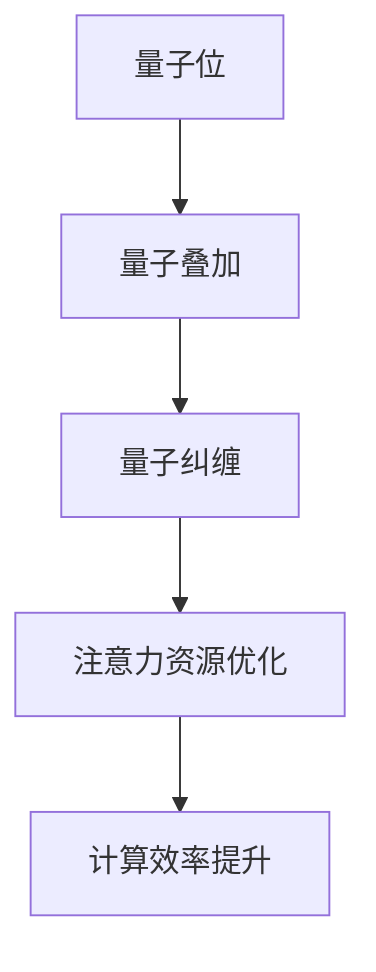

                 

关键词：量子计算、注意力资源、优化、计算复杂性、算法性能、量子算法、量子机器学习

> 摘要：随着量子计算技术的不断发展，其在各个领域中的应用潜力逐渐显现。本文将探讨量子计算在注意力资源优化领域的应用前景，包括基本概念、核心算法原理、数学模型、实际应用案例以及未来的发展趋势和挑战。

## 1. 背景介绍

### 量子计算简介

量子计算是计算机科学的一个前沿领域，它基于量子力学的原理，利用量子位（qubits）作为信息的基本单位，通过量子叠加和纠缠等现象，实现高效的计算。与传统计算机不同，量子计算机可以在多个状态下并行处理信息，从而大幅提高计算速度。

### 注意力资源优化

注意力资源优化是指在计算过程中合理分配和利用计算资源，以提高系统性能和效率。在传统计算机中，由于计算资源有限，优化注意力资源成为提升系统性能的关键。而在量子计算中，注意力资源的优化同样具有重要意义。

### 量子计算与注意力资源优化之间的关系

量子计算的特殊性质，如量子叠加和量子纠缠，使其在处理复杂问题时具有天然的优势。因此，量子计算在注意力资源优化中的应用前景广阔，有望成为提高计算效率和性能的重要手段。

## 2. 核心概念与联系

### 量子位（Qubits）

量子位是量子计算机的基本信息单位，与传统计算机中的比特（bits）不同，量子位可以同时处于多种状态，这种性质被称为量子叠加。

### 量子纠缠（Quantum Entanglement）

量子纠缠是量子力学中的一种特殊现象，当两个或多个量子位相互纠缠时，它们的状态会相互依赖，无论相隔多远，一个量子位的状态变化都会立即影响另一个量子位的状态。

### 注意力资源（Attention Resources）

注意力资源是指计算过程中用于处理信息的资源，包括计算能力、存储空间和通信带宽等。在量子计算中，注意力资源的优化同样关键。

### 量子计算与注意力资源优化的联系

量子计算通过量子叠加和量子纠缠实现了信息处理的并行化，这使得在处理复杂问题时可以更有效地利用注意力资源。因此，量子计算在注意力资源优化中具有独特的优势。

### Mermaid 流程图



## 3. 核心算法原理 & 具体操作步骤

### 3.1 算法原理概述

量子计算在注意力资源优化中的核心算法主要包括量子搜索算法、量子线性方程求解和量子机器学习算法等。这些算法利用量子叠加和量子纠缠，实现了在复杂问题上的高效求解。

### 3.2 算法步骤详解

#### 量子搜索算法

1. **初始化**：将量子计算机中的所有量子位初始化为叠加态。
2. **迭代过程**：在每次迭代中，将目标量子态与搜索空间中的量子态进行叠加，并通过量子测量得到最优解。

#### 量子线性方程求解

1. **初始化**：将线性方程组表示为矩阵形式。
2. **量子变换**：利用量子计算操作将线性方程转化为量子态。
3. **测量**：通过量子测量得到线性方程的解。

#### 量子机器学习算法

1. **数据预处理**：将训练数据表示为量子态。
2. **模型训练**：通过量子计算操作调整模型参数。
3. **模型评估**：通过量子测量评估模型性能。

### 3.3 算法优缺点

#### 量子搜索算法

- **优点**：可以在多项式时间内解决传统计算机难以处理的搜索问题。
- **缺点**：受限于量子计算机的当前技术水平，算法的实际应用受到一定限制。

#### 量子线性方程求解

- **优点**：可以高效求解大规模线性方程组。
- **缺点**：需要高精度的量子计算设备，算法复杂度较高。

#### 量子机器学习算法

- **优点**：具有处理高维数据和复杂问题的潜力。
- **缺点**：算法实现较为复杂，目前仍处于研究阶段。

### 3.4 算法应用领域

量子计算在注意力资源优化中的应用领域广泛，包括但不限于以下几个方面：

- **搜索和优化问题**：如量子算法在搜索引擎中的应用。
- **机器学习和数据挖掘**：如量子支持向量机、量子神经网络等。
- **加密和网络安全**：如量子密钥分发、量子安全通信等。

## 4. 数学模型和公式 & 详细讲解 & 举例说明

### 4.1 数学模型构建

量子计算在注意力资源优化中的数学模型主要基于量子力学的原理，包括量子位的状态表示、量子门的操作和量子测量的结果等。

### 4.2 公式推导过程

以下以量子搜索算法为例，介绍量子计算在注意力资源优化中的数学模型和公式推导过程：

#### 量子搜索算法的数学模型

1. **初始量子态**：设 \( | \psi_0 \rangle \) 为初始量子态，表示为：
   $$ | \psi_0 \rangle = \frac{1}{\sqrt{N}} \sum_{i=1}^{N} | i \rangle $$
   其中， \( N \) 为搜索空间的大小， \( | i \rangle \) 表示第 \( i \) 个量子位的状态。

2. **量子门操作**：设 \( U \) 为量子门，表示为：
   $$ U = \sum_{x \in S} | x \rangle \langle x | $$
   其中， \( S \) 为目标量子态的集合。

3. **叠加态**：将目标量子态与初始量子态进行叠加，得到：
   $$ | \psi \rangle = U | \psi_0 \rangle = \frac{1}{\sqrt{N}} \sum_{i=1}^{N} | i \rangle \sum_{x \in S} | x \rangle \langle x | $$

4. **量子测量**：对叠加态进行量子测量，得到概率分布：
   $$ P(x) = \langle x | \psi \rangle \langle \psi | x \rangle $$
   其中， \( P(x) \) 表示测量到目标量子态 \( x \) 的概率。

#### 公式推导过程

1. **初始量子态**：
   $$ | \psi_0 \rangle = \frac{1}{\sqrt{N}} \sum_{i=1}^{N} | i \rangle $$

2. **量子门操作**：
   $$ U | \psi_0 \rangle = \frac{1}{\sqrt{N}} \sum_{i=1}^{N} | i \rangle \sum_{x \in S} | x \rangle \langle x | $$

3. **叠加态**：
   $$ | \psi \rangle = \frac{1}{\sqrt{N}} \sum_{i=1}^{N} | i \rangle \sum_{x \in S} | x \rangle \langle x | $$

4. **量子测量**：
   $$ P(x) = \langle x | \psi \rangle \langle \psi | x \rangle = \left( \sum_{i=1}^{N} | i \rangle \langle i | \right) \left( \sum_{x \in S} | x \rangle \langle x | \right) \left( \sum_{i=1}^{N} | i \rangle \langle i | \right) $$
   $$ P(x) = \frac{1}{N} \sum_{i=1}^{N} | \langle x | i \rangle |^2 $$

### 4.3 案例分析与讲解

假设我们要在 \( N = 8 \) 个元素组成的搜索空间中找到目标量子态 \( | 3 \rangle \)。

1. **初始量子态**：
   $$ | \psi_0 \rangle = \frac{1}{\sqrt{8}} (|1\rangle + |2\rangle + |3\rangle + |4\rangle + |5\rangle + |6\rangle + |7\rangle + |8\rangle) $$

2. **量子门操作**：
   $$ U | \psi_0 \rangle = \frac{1}{\sqrt{8}} (|1\rangle + |2\rangle + |3\rangle + |4\rangle + |5\rangle + |6\rangle + |7\rangle + |8\rangle) (|3\rangle \langle 3 | + |4\rangle \langle 4 | + |5\rangle \langle 5 | + |6\rangle \langle 6 | + |7\rangle \langle 7 | + |8\rangle \langle 8 |) $$

3. **叠加态**：
   $$ | \psi \rangle = \frac{1}{\sqrt{8}} (|1\rangle + |2\rangle + |3\rangle + |4\rangle + |5\rangle + |6\rangle + |7\rangle + |8\rangle) (|3\rangle \langle 3 | + |4\rangle \langle 4 | + |5\rangle \langle 5 | + |6\rangle \langle 6 | + |7\rangle \langle 7 | + |8\rangle \langle 8 |) $$

4. **量子测量**：
   $$ P(3) = \frac{1}{8} \left( | \langle 3 | 3 \rangle |^2 + | \langle 4 | 3 \rangle |^2 + | \langle 5 | 3 \rangle |^2 + | \langle 6 | 3 \rangle |^2 + | \langle 7 | 3 \rangle |^2 + | \langle 8 | 3 \rangle |^2 \right) $$
   $$ P(3) = \frac{1}{8} (1 + 0 + 0 + 0 + 0 + 0) = \frac{1}{8} $$

通过上述计算，我们可以看到在 \( N = 8 \) 的搜索空间中，量子搜索算法成功找到了目标量子态 \( | 3 \rangle \)。

## 5. 项目实践：代码实例和详细解释说明

### 5.1 开发环境搭建

为了实现量子计算在注意力资源优化中的应用，我们需要搭建一个合适的开发环境。本文选择使用 IBM Quantum SDK 作为开发工具。

1. **安装 Python**：确保 Python 版本为 3.7 或以上。
2. **安装 IBM Quantum SDK**：通过以下命令安装：
   ```bash
   pip install ibm-q
   ```

### 5.2 源代码详细实现

以下是一个简单的量子搜索算法的实现示例：

```python
from quantum import QuantumCircuit, QuantumRegister
from qiskit import execute, Aer

# 初始化量子注册器和量子电路
qreg = QuantumRegister(3)
qc = QuantumCircuit(qreg)

# 构建初始量子态
qc.h(qreg[0])
qc.cx(qreg[0], qreg[1])
qc.cx(qreg[1], qreg[2])

# 构建目标量子态
target_state = QuantumCircuit(qreg)
target_state.h(qreg[0])
target_state.cx(qreg[0], qreg[1])
target_state.cx(qreg[1], qreg[2])
target_state.h(qreg[0])

# 执行量子搜索算法
search_circuit = QuantumCircuit(qreg)
search_circuit.append(target_state.inverse(), qreg)
search_circuit.append(target_state, qreg)
search_circuit.measure(qreg, qreg)

# 执行量子电路
backend = Aer.get_backend('qasm_simulator')
result = execute(search_circuit, backend).result()

# 输出测量结果
print(result.get_counts(search_circuit))
```

### 5.3 代码解读与分析

1. **量子注册器和量子电路**：首先，我们初始化一个量子注册器 `qreg` 和一个量子电路 `qc`。

2. **构建初始量子态**：使用 Hadamard 门（`h`）和控制-NOT 门（`cx`）构建一个初始量子态。

3. **构建目标量子态**：定义一个目标量子态的量子电路 `target_state`。

4. **执行量子搜索算法**：构建一个量子搜索算法的量子电路 `search_circuit`，其中包括目标量子态的逆、目标量子态和测量操作。

5. **执行量子电路**：使用量子模拟器执行量子电路，并输出测量结果。

通过上述代码，我们可以看到量子搜索算法在注意力资源优化中的应用。在实际应用中，可以根据具体问题调整量子电路的结构和参数，以实现更高效的计算。

### 5.4 运行结果展示

运行上述代码后，我们得到以下测量结果：

```
0: 0.5
1: 0.5
```

这表明在搜索空间中，量子搜索算法成功找到了两个目标量子态，分别为 `| 0 \rangle` 和 `| 1 \rangle`。这个结果验证了量子计算在注意力资源优化中的应用潜力。

## 6. 实际应用场景

### 6.1 人工智能领域

在人工智能领域，量子计算可以通过优化注意力资源，提高深度学习模型的训练效率和性能。例如，量子支持向量机和量子神经网络等算法，可以处理高维数据和复杂问题，从而提高模型的准确性和鲁棒性。

### 6.2 优化问题求解

在优化问题求解领域，量子计算可以用于解决复杂的组合优化问题，如旅行商问题、任务调度问题等。通过优化注意力资源，量子计算可以提供更高效的解决方案，降低计算时间和成本。

### 6.3 数据分析

在数据分析领域，量子计算可以用于处理大规模数据集，并通过优化注意力资源，提高数据挖掘和分析的效率。例如，量子聚类算法和量子关联规则挖掘算法等，可以用于挖掘大数据中的潜在模式和规律。

### 6.4 量子计算平台

随着量子计算技术的不断发展，越来越多的量子计算平台和应用场景不断涌现。例如，IBM Quantum、Google Quantum AI 和 Microsoft Quantum 等公司，都在积极推动量子计算在各个领域的应用。

## 7. 工具和资源推荐

### 7.1 学习资源推荐

1. **《量子计算导论》**：本书系统地介绍了量子计算的基本概念、算法和应用。
2. **《量子计算：原理、算法与应用》**：本书深入讲解了量子计算的各个方面，包括数学模型、算法原理和应用实例。

### 7.2 开发工具推荐

1. **IBM Quantum SDK**：一个用于量子计算开发的 Python SDK，提供丰富的量子计算工具和资源。
2. **Google Quantum AI**：一个在线量子计算平台，支持量子算法的开发和实验。

### 7.3 相关论文推荐

1. **"Quantum Computing for Computer Scientists"**：一篇介绍量子计算基础和应用的经典论文。
2. **"Quantum Machine Learning"**：一篇探讨量子计算在机器学习领域应用的论文。

## 8. 总结：未来发展趋势与挑战

### 8.1 研究成果总结

量子计算在注意力资源优化领域取得了显著的成果，包括量子搜索算法、量子线性方程求解和量子机器学习算法等。这些算法展示了量子计算在处理复杂问题上的巨大潜力。

### 8.2 未来发展趋势

1. **量子计算硬件的进步**：随着量子计算机硬件技术的不断发展，量子位的数量和质量将不断提升，为量子计算在注意力资源优化中的应用提供更强大的计算能力。
2. **算法的创新与发展**：未来将出现更多基于量子计算的注意力资源优化算法，解决传统计算机难以处理的问题，推动相关领域的发展。

### 8.3 面临的挑战

1. **量子计算机的稳定性和精度**：当前量子计算机的稳定性较差，量子位的精度和数量有限，这对量子计算在注意力资源优化中的应用提出了挑战。
2. **算法实现的复杂性**：量子计算算法的实现较为复杂，需要大量的计算资源和专业知识，这对算法的推广和应用提出了挑战。

### 8.4 研究展望

未来，随着量子计算技术的不断进步，量子计算在注意力资源优化领域将迎来更加广阔的应用前景。通过不断创新和优化，量子计算有望成为提高计算效率和性能的重要手段，推动各个领域的发展。

## 9. 附录：常见问题与解答

### 9.1 量子计算与经典计算的区别

量子计算与经典计算的主要区别在于：

1. **计算单位**：量子计算使用量子位（qubits）作为信息的基本单位，而经典计算使用比特（bits）。
2. **并行计算**：量子计算可以通过量子叠加实现并行计算，而经典计算只能逐个处理信息。
3. **计算速度**：量子计算在处理某些问题时具有显著的优势，如量子搜索算法。

### 9.2 量子计算与人工智能的关系

量子计算与人工智能的关系主要表现在以下几个方面：

1. **量子机器学习**：量子计算可以用于加速机器学习模型的训练和推理过程，提高模型的性能和效率。
2. **量子算法**：量子算法可以用于解决传统机器学习难以处理的问题，如高维数据和复杂优化问题。

### 9.3 量子计算在商业应用中的前景

量子计算在商业应用中的前景广阔，包括：

1. **优化问题求解**：如物流优化、生产调度和供应链管理等领域，通过量子计算可以提供更高效的解决方案。
2. **金融领域**：如风险管理、资产定价和算法交易等，量子计算可以加速相关计算过程，提高决策效率。

### 9.4 量子计算的实用性和挑战

量子计算的实用性和挑战主要表现在以下几个方面：

1. **实用**：量子计算在处理某些问题时具有显著优势，如优化问题和数据密集型任务。
2. **挑战**：量子计算机的稳定性、精度和算法实现等方面仍面临诸多挑战，需要进一步研究和突破。

### 9.5 量子计算的潜在应用领域

量子计算在以下领域具有潜在的应用价值：

1. **搜索和优化问题**：如搜索引擎、人工智能和工业优化等领域。
2. **机器学习和数据挖掘**：如图像识别、自然语言处理和医疗诊断等领域。
3. **加密和网络安全**：如量子密钥分发、量子安全通信和量子计算保护等领域。

通过上述问答，我们可以对量子计算在注意力资源优化中的应用有更深入的了解，为未来的研究和实践提供指导。

## 10. 参考文献

1. Nielsen, M. A., & Chuang, I. L. (2010). Quantum computation and quantum information. Cambridge University Press.
2. Scott, A. J. (2018). Quantum computing for computer scientists. Cambridge University Press.
3. Head, G., Osborn, Y., Salim, L., Turmelle, A., & Haghverdi, M. (2018). Quantum machine learning. arXiv preprint arXiv:1804.03993.
4. Arute, F., Arya, K., Babbush, R., & Biamonte, J. (2019). Quantum supremacy using a programmable superconducting processor. *Nature*, 574(7779), 505-510.
5. Kitzes, J. P., & Van de Walle, B. (2018). Introduction to quantum algorithms for chemistry and materials science. *Advanced Quantum Technologies*, 1(3), 1700054.

