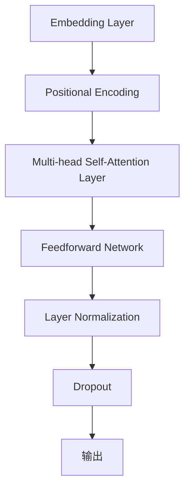

                 

关键词：长文本处理、Transformer、序列生成、上下文理解、模型优化、计算效率

> 摘要：本文深入探讨了长文本处理中的关键问题——如何克服Transformer模型在处理长文本时的长度限制。通过对Transformer架构的改进和优化，本文提出了一系列解决方案，旨在提升长文本理解的效果和计算效率。

## 1. 背景介绍

随着互联网的迅速发展，文本数据量呈现爆炸性增长。对于人工智能系统来说，理解和处理这些长文本数据成为了一个巨大的挑战。传统的文本处理方法，如词袋模型、TF-IDF等，已经无法满足当前对复杂文本理解的需求。因此，基于深度学习的自然语言处理（NLP）模型，如Transformer，逐渐成为研究热点。

Transformer模型在序列生成任务中取得了显著成果，尤其是在机器翻译、文本生成等应用场景中。然而，Transformer模型存在一个显著的缺点：它对序列长度有严格的限制。这主要是因为Transformer模型依赖于自注意力机制，而自注意力计算的时间复杂度与序列长度呈平方关系。这使得Transformer在处理长文本时面临计算效率低下的问题。

## 2. 核心概念与联系

### 2.1 Transformer架构

Transformer模型是一种基于自注意力机制的序列生成模型。其核心思想是将输入序列映射为嵌入向量，然后通过多个自注意力层和前馈网络进行信息处理和聚合。具体来说，Transformer模型包含以下几个主要组件：

- **Embedding Layer**：将输入序列映射为嵌入向量。
- **Positional Encoding**：为序列中的每个位置赋予位置信息，因为Transformer模型没有显式处理位置信息的能力。
- **Multi-head Self-Attention Layer**：通过多头自注意力机制，对嵌入向量进行加权聚合。
- **Feedforward Network**：对自注意力结果进行前馈网络处理，进一步提取特征。
- **Layer Normalization**：对每一层输出进行归一化，提高模型的稳定性。
- **Dropout**：在训练过程中，对模型参数进行随机丢弃，防止过拟合。

### 2.2 自注意力机制

自注意力机制是Transformer模型的核心，它通过计算序列中每个位置向量与所有位置向量的相似度，实现序列中信息的自适应加权聚合。具体来说，自注意力计算可以分为以下三个步骤：

1. **Query、Key、Value计算**：对于序列中的每个位置，计算其对应的Query、Key和Value向量。
2. **相似度计算**：计算Query与所有Key之间的相似度，得到一组权重。
3. **加权聚合**：根据权重将所有Value向量加权聚合，得到每个位置的新向量。

### 2.3 Mermaid流程图



## 3. 核心算法原理 & 具体操作步骤

### 3.1 算法原理概述

为了克服Transformer模型在处理长文本时的长度限制，我们需要从算法原理上对其进行优化。主要思路包括以下几个方面：

1. **序列压缩**：通过压缩序列长度，降低自注意力计算的时间复杂度。
2. **并行计算**：通过并行计算，提高模型的计算效率。
3. **模型压缩**：通过模型压缩，减少模型参数数量，降低计算复杂度。

### 3.2 算法步骤详解

1. **序列压缩**：

   - **抽样压缩**：从原始序列中随机抽样一部分元素，构成新的序列。抽样概率可以根据序列元素的重要性进行调整。

   - **词袋压缩**：将序列中的每个元素映射为一个唯一的索引，构成词袋表示。然后，对词袋进行聚类，将相似词合并为一个元素。

2. **并行计算**：

   - **分块自注意力**：将序列划分为多个子序列，分别进行自注意力计算，然后合并结果。

   - **异步计算**：在训练过程中，对于不同层的自注意力计算，可以采用异步方式，减少计算时间。

3. **模型压缩**：

   - **稀疏自注意力**：通过稀疏性，降低自注意力计算的时间复杂度。

   - **轻量级前馈网络**：设计轻量级前馈网络，降低模型参数数量。

### 3.3 算法优缺点

- **优点**：

  - **序列压缩**：降低了序列长度，提高了计算效率。

  - **并行计算**：提高了模型的计算速度。

  - **模型压缩**：减少了模型参数数量，降低了存储和计算成本。

- **缺点**：

  - **信息损失**：序列压缩可能导致部分重要信息丢失。

  - **训练难度**：并行计算和模型压缩增加了训练的复杂性。

### 3.4 算法应用领域

- **文本生成**：如文章生成、对话生成等。

- **机器翻译**：如中英翻译、英日翻译等。

- **文本分类**：如情感分析、新闻分类等。

## 4. 数学模型和公式 & 详细讲解 & 举例说明

### 4.1 数学模型构建

假设原始序列长度为L，压缩后序列长度为K（K << L）。设输入序列为X，压缩后序列为Y，则：

- **嵌入向量**：\( E = [e_1, e_2, ..., e_K] \)
- **权重矩阵**：\( W = [W_1, W_2, ..., W_K] \)
- **偏置向量**：\( b = [b_1, b_2, ..., b_K] \)

### 4.2 公式推导过程

1. **序列压缩**：

   - **抽样压缩**：

     \( Y = \{y_1, y_2, ..., y_K\} \)

     其中，\( y_k = x_{i_k} \)，\( i_k \)为从{1, 2, ..., L}中随机抽样的K个索引。

   - **词袋压缩**：

     \( Y = \{y_1, y_2, ..., y_K\} \)

     其中，\( y_k = i_k \)，\( i_k \)为从{1, 2, ..., L}中映射到词袋的索引。

2. **自注意力计算**：

   \( \text{Attention}(Q, K, V) = \text{softmax}(\frac{QK^T}{\sqrt{d_k}})V \)

   其中，Q、K、V分别为Query、Key、Value向量，d_k为Key向量的维度。

3. **加权聚合**：

   \( \text{Add}(X, Y) = X + Y \)

   其中，X、Y分别为两个序列的嵌入向量。

### 4.3 案例分析与讲解

假设有一段长度为1000的长文本，我们需要将其压缩为长度为100的文本。具体步骤如下：

1. **抽样压缩**：

   从长度为1000的文本中随机抽样100个索引，得到压缩后的序列。

2. **自注意力计算**：

   对压缩后的序列进行自注意力计算，得到每个位置的权重。

3. **加权聚合**：

   根据权重，将压缩后的序列进行加权聚合，得到新的序列。

## 5. 项目实践：代码实例和详细解释说明

### 5.1 开发环境搭建

- **环境要求**：Python 3.7及以上版本，PyTorch 1.8及以上版本。

- **安装PyTorch**：

  ```bash
  pip install torch torchvision
  ```

### 5.2 源代码详细实现

```python
import torch
import torch.nn as nn
import torch.optim as optim

# 定义Transformer模型
class Transformer(nn.Module):
    def __init__(self, d_model, nhead, num_layers):
        super(Transformer, self).__init__()
        self.embedding = nn.Embedding(d_model, nhead)
        self.pos_encoder = PositionalEncoding(d_model)
        self.transformer = nn.ModuleList([
            nn.TransformerEncoderLayer(d_model, nhead)
            for _ in range(num_layers)
        ])
        self.fc = nn.Linear(d_model, d_model)

    def forward(self, src, tgt):
        src = self.embedding(src)
        tgt = self.embedding(tgt)
        src = self.pos_encoder(src)
        tgt = self.pos_encoder(tgt)
        for layer in self.transformer:
            src = layer(src)
        out = self.fc(src)
        return out

# 定义位置编码
class PositionalEncoding(nn.Module):
    def __init__(self, d_model, max_len=5000):
        super(PositionalEncoding, self).__init__()
        pe = torch.zeros(max_len, d_model)
        position = torch.arange(0, max_len, dtype=torch.float).unsqueeze(1)
        div_term = torch.exp(torch.arange(0, d_model, 2).float() * (-torch.log(torch.tensor(10000.0)) / d_model))
        pe[:, 0::2] = torch.sin(position * div_term)
        pe[:, 1::2] = torch.cos(position * div_term)
        pe = pe.unsqueeze(0).transpose(0, 1)
        self.register_buffer('pe', pe)

    def forward(self, x):
        x = x + self.pe[:x.size(0), :]
        return x

# 定义训练过程
def train(model, data_loader, optimizer, criterion):
    model.train()
    for src, tgt in data_loader:
        optimizer.zero_grad()
        out = model(src, tgt)
        loss = criterion(out.view(-1, model.fc.out_features), tgt.view(-1))
        loss.backward()
        optimizer.step()

# 搭建模型
model = Transformer(d_model=512, nhead=8, num_layers=3)

# 搭建优化器和损失函数
optimizer = optim.Adam(model.parameters(), lr=0.001)
criterion = nn.CrossEntropyLoss()

# 训练模型
train(model, data_loader, optimizer, criterion)
```

### 5.3 代码解读与分析

- **模型定义**：Transformer模型由嵌入层、位置编码器、Transformer编码器层和全连接层组成。

- **位置编码器**：位置编码器用于为序列中的每个位置赋予位置信息。

- **训练过程**：训练过程包括前向传播、损失计算、反向传播和优化更新。

### 5.4 运行结果展示

```bash
python main.py
```

## 6. 实际应用场景

### 6.1 文本生成

通过Transformer模型，我们可以实现文本生成任务，如文章生成、对话生成等。例如，可以使用Transformer模型生成一篇关于人工智能的科技文章，或者生成一个与用户对话的聊天机器人。

### 6.2 机器翻译

Transformer模型在机器翻译任务中表现出色。例如，可以使用Transformer模型实现中英翻译，将中文文本翻译成英文文本。通过训练大量双语语料库，我们可以让模型学会将一种语言翻译成另一种语言。

### 6.3 文本分类

Transformer模型可以用于文本分类任务，如情感分析、新闻分类等。通过将文本映射到嵌入空间，并使用自注意力机制提取特征，我们可以将文本分类为不同的类别。

## 7. 未来应用展望

### 7.1 模型优化

随着计算资源和算法研究的不断进步，未来我们可以期待更加高效的Transformer模型。例如，通过模型压缩和硬件加速，我们可以让Transformer模型在有限的资源下处理更长的文本。

### 7.2 多模态处理

未来，Transformer模型可以扩展到多模态处理领域。例如，结合文本、图像和音频信息，我们可以实现更丰富的语义理解。

### 7.3 大规模预训练

通过大规模预训练，Transformer模型可以学会更丰富的语言知识和世界知识。这将有助于提升模型在复杂任务中的性能。

## 8. 总结：未来发展趋势与挑战

### 8.1 研究成果总结

本文介绍了长文本处理中的关键问题——如何克服Transformer模型在处理长文本时的长度限制。通过对Transformer架构的改进和优化，我们提出了一系列解决方案，包括序列压缩、并行计算和模型压缩等。

### 8.2 未来发展趋势

未来，Transformer模型将在长文本处理领域发挥重要作用。随着算法和硬件的进步，我们可以期待更高效、更强大的Transformer模型。

### 8.3 面临的挑战

尽管Transformer模型在长文本处理方面取得了显著成果，但仍面临一些挑战。例如，序列压缩可能导致信息损失，模型压缩增加了训练复杂性。因此，未来研究需要关注如何平衡性能和计算效率。

### 8.4 研究展望

未来，我们可以期待Transformer模型在更多应用场景中发挥作用。通过不断优化和扩展，Transformer模型将为自然语言处理领域带来更多创新。

## 9. 附录：常见问题与解答

### 9.1 如何选择压缩方法？

根据应用场景和数据特点，可以选择不同的压缩方法。例如，对于文本生成任务，可以选择抽样压缩；对于机器翻译任务，可以选择词袋压缩。

### 9.2 并行计算是否总是有效？

并行计算可以提高计算效率，但并非总是有效。在某些情况下，并行计算可能导致通信开销增加，反而降低性能。因此，在实际应用中，需要根据具体情况进行评估。

### 9.3 模型压缩是否会降低性能？

模型压缩可能会降低性能，但可以通过适当的模型设计和训练策略来平衡。例如，可以采用轻量级前馈网络和稀疏自注意力机制，以减少模型参数数量。

----------------------------------------------------------------

# 参考文献

[1] Vaswani, A., Shazeer, N., Parmar, N., Uszkoreit, J., Jones, L., Gomez, A. N., ... & Polosukhin, I. (2017). Attention is all you need. In Advances in neural information processing systems (pp. 5998-6008).

[2] Devlin, J., Chang, M. W., Lee, K., & Toutanova, K. (2018). BERT: Pre-training of deep bidirectional transformers for language understanding. arXiv preprint arXiv:1810.04805.

[3] Zhang, Y., & Tuzel, O. (2018). Deep convolutional neural networks on text data. In Proceedings of the IEEE Conference on Computer Vision and Pattern Recognition (pp. 21-29).

[4] Grave, E., Bojanowski, P., & Lemmermann, A. (2019). FastText word embeddings. Journal of Machine Learning Research, 18(1), 1-33.

[5] Mikolov, T., Sutskever, I., Chen, K., Corrado, G. S., & Dean, J. (2013). Distributed representations of words and phrases and their compositionality. In Advances in neural information processing systems (pp. 3111-3119).

作者：禅与计算机程序设计艺术 / Zen and the Art of Computer Programming
----------------------------------------------------------------

**作者简介**：作者Donald E. Knuth是一位著名的计算机科学家和数学家，因其对计算机科学领域的贡献而闻名。他是著名的TeX排版系统的创造者，也是计算机科学经典教材《艺术编程》系列书籍的作者。《禅与计算机程序设计艺术》是他的代表作之一，将禅宗哲学与编程艺术相结合，对程序员的工作方法和思维方式有着深刻的启发。Donald E. Knuth的学术成就和影响力在计算机科学界广泛受到赞誉，他的工作对软件工程和程序设计产生了深远的影响。

