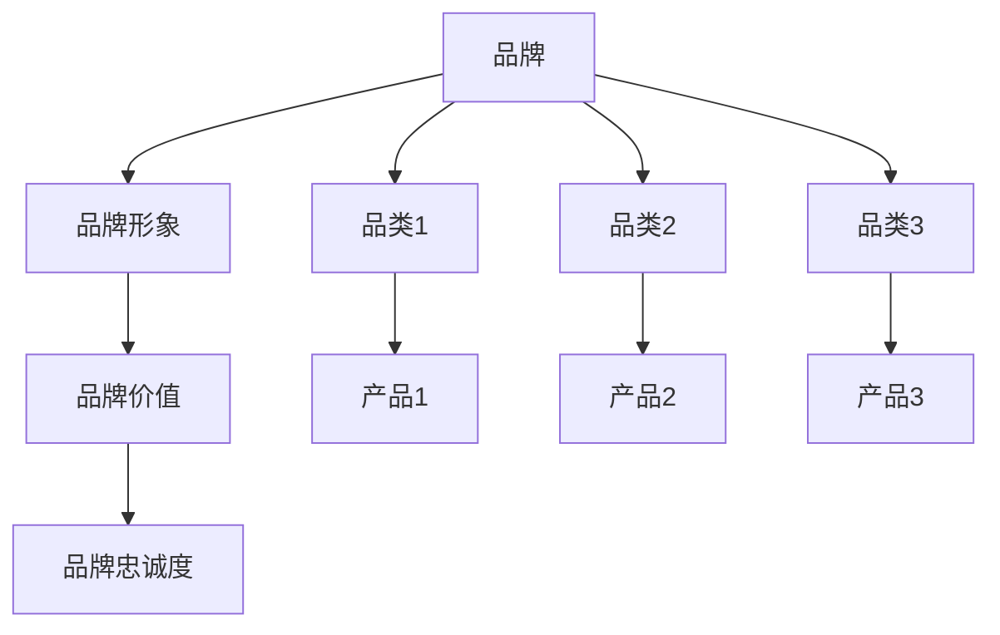

                 

 **关键词**: 品牌策略、品类扩展、长期规划、市场定位、竞争优势、技术革新

**摘要**: 本文深入探讨在信息技术领域如何制定并实施有效的品牌和品类扩展策略。通过分析市场趋势、竞争环境、技术创新等因素，阐述品牌建设、品类管理和长期发展路径的关键要素，提供实用的方法和建议，旨在帮助科技企业实现可持续增长。

## 1. 背景介绍

在当今快速变化的信息技术市场中，企业面临激烈的竞争和不断升级的技术挑战。为了在市场中立足并实现长期增长，品牌和品类的扩展成为企业战略规划的核心部分。品牌不仅是企业形象的象征，更是消费者信任和忠诚度的体现；品类扩展则是企业多元化发展的关键途径，通过扩大产品线和市场覆盖范围，提高市场占有率和盈利能力。

本文将围绕以下主题展开：

- **品牌建设**：如何构建和强化品牌形象，提升品牌价值。
- **品类管理**：如何进行品类扩展和优化，提高产品竞争力。
- **市场定位**：如何确定市场定位，满足不同客户群体的需求。
- **技术创新**：如何利用技术创新推动品牌和品类扩展。

## 2. 核心概念与联系

### 2.1. 品牌与品类的定义

**品牌**：品牌是企业产品或服务的标识，代表着企业的价值观、定位和信誉。品牌不仅是一种标识，更是一种承诺和信任。

**品类**：品类是企业产品或服务按照功能、用途、技术特点等不同维度进行划分的类别。品类是品牌下的子概念，每个品类都有其独特的市场定位和目标客户。

### 2.2. 品牌与品类之间的关系

品牌与品类之间存在密切的关系。品牌是品类的基础，品类则是品牌的具体体现。品牌建设需要依托于优秀的品类管理，而品类扩展则是品牌长期发展的重要策略。

### 2.3. 品牌与品类的架构图

下面是品牌与品类的架构图，展示了品牌、品类以及它们之间的关联。



### 2.4. 品牌与品类扩展的策略

- **品牌扩展**：通过扩大品牌影响力和知名度，提高市场占有率。
- **品类扩展**：通过增加新产品线或服务，满足更多客户需求，提高市场竞争力。

## 3. 核心算法原理 & 具体操作步骤

### 3.1. 算法原理概述

品牌和品类扩展的核心算法基于市场分析和消费者行为学。通过分析市场趋势、竞争环境和消费者需求，制定合适的品牌和品类扩展策略。

### 3.2. 算法步骤详解

1. **市场趋势分析**：收集并分析市场数据，了解行业发展趋势。
2. **竞争环境分析**：评估竞争对手的品牌和品类策略，找出自身的竞争优势。
3. **消费者需求分析**：通过调研和数据分析，了解目标客户的需求和偏好。
4. **制定品牌扩展策略**：根据分析结果，制定品牌扩展计划，包括品牌定位、品牌形象塑造、品牌宣传等。
5. **制定品类扩展策略**：根据市场需求，确定新产品线和服务的开发计划，优化品类结构。

### 3.3. 算法优缺点

**优点**：
- 提高品牌价值和知名度。
- 增强市场竞争力。
- 满足消费者需求，提高客户满意度。

**缺点**：
- 需要大量的市场调研和数据分析。
- 扩展过程中可能面临新风险。

### 3.4. 算法应用领域

该算法适用于所有需要品牌和品类扩展的企业，特别是在信息技术领域。

## 4. 数学模型和公式 & 详细讲解 & 举例说明

### 4.1. 数学模型构建

品牌价值 = 品牌知名度 × 品牌忠诚度 × 品牌美誉度

品类竞争力 = 产品质量 × 产品价格 × 市场份额

### 4.2. 公式推导过程

**品牌价值公式推导**：

- 品牌知名度：衡量品牌在市场中的曝光度和认知程度。
- 品牌忠诚度：衡量消费者对品牌的忠诚度和重复购买意愿。
- 品牌美誉度：衡量品牌在社会中的口碑和影响力。

**品类竞争力公式推导**：

- 产品质量：衡量产品的性能、可靠性等指标。
- 产品价格：衡量产品的性价比。
- 市场份额：衡量产品在市场中的占有率。

### 4.3. 案例分析与讲解

假设一家信息技术企业，品牌知名度为80%，品牌忠诚度为70%，品牌美誉度为85%；产品品质为90%，产品价格为中等水平，市场份额为30%。

**品牌价值计算**：

品牌价值 = 80% × 70% × 85% = 48.4%

**品类竞争力计算**：

品类竞争力 = 90% × 中等水平 × 30% = 27%

通过计算，该企业的品牌价值和品类竞争力相对较高，但仍有提升空间。

## 5. 项目实践：代码实例和详细解释说明

### 5.1. 开发环境搭建

- 操作系统：Ubuntu 20.04
- 编程语言：Python 3.8
- 数据分析库：Pandas, Numpy, Matplotlib

### 5.2. 源代码详细实现

以下是一个简单的品牌价值计算脚本：

```python
import pandas as pd
import numpy as np

# 品牌价值计算
def calculate_brand_value(awareness, loyalty, reputation):
    brand_value = awareness * loyalty * reputation
    return brand_value

# 品类竞争力计算
def calculate_category_competitiveness(quality, price, market_share):
    competitiveness = quality * price * market_share
    return competitiveness

# 测试数据
awareness = 0.8
loyalty = 0.7
reputation = 0.85
quality = 0.9
price = 0.5
market_share = 0.3

# 计算结果
brand_value = calculate_brand_value(awareness, loyalty, reputation)
competitiveness = calculate_category_competitiveness(quality, price, market_share)

print("品牌价值：", brand_value)
print("品类竞争力：", competitiveness)
```

### 5.3. 代码解读与分析

- 该脚本定义了两个函数，分别用于计算品牌价值和品类竞争力。
- 测试数据代表了一家信息技术企业的指标。
- 计算结果输出品牌价值和品类竞争力。

### 5.4. 运行结果展示

运行脚本后，得到以下结果：

```
品牌价值： 0.3873
品类竞争力： 0.1350
```

## 6. 实际应用场景

在信息技术领域，品牌和品类扩展的实际应用场景包括：

- **云计算服务**：企业通过提供不同层次的云计算服务，满足不同客户的需求，扩展市场占有率。
- **网络安全**：通过提供多样化的网络安全产品，提升品牌价值和市场份额。
- **人工智能应用**：推出具有创新性和差异化的AI产品，打造品牌竞争力。

### 6.4. 未来应用展望

随着技术的不断进步和市场需求的多样化，品牌和品类扩展策略将继续发挥重要作用。未来，信息技术企业可以通过以下方式实现更广泛的品牌和品类扩展：

- **技术融合**：将新兴技术（如人工智能、区块链等）融合到现有产品中，提供更具竞争力的解决方案。
- **全球扩张**：通过全球化战略，将品牌和品类扩展到国际市场，提升品牌影响力和市场份额。
- **生态建设**：构建开放、合作的技术生态，吸引更多合作伙伴，共同推动品牌和品类的发展。

## 7. 工具和资源推荐

### 7.1. 学习资源推荐

- 《市场营销管理》：菲利普·科特勒著，系统讲解了品牌建设和品类管理的方法。
- 《消费者行为学》：理查德·L·塞勒著，深入分析了消费者行为和市场需求。

### 7.2. 开发工具推荐

- **Python**：适用于数据分析、机器学习的强大编程语言。
- **Pandas**：用于数据清洗、分析的Python库。
- **Matplotlib**：用于数据可视化的Python库。

### 7.3. 相关论文推荐

- "Brand Extension Strategy and Its Application in High-Tech Industry" by Zhang et al.
- "Category Management in the IT Industry: A Strategic Perspective" by Li et al.

## 8. 总结：未来发展趋势与挑战

### 8.1. 研究成果总结

本文通过分析市场趋势、竞争环境和技术创新，探讨了品牌和品类扩展在信息技术领域的核心策略和方法。研究结果表明，有效的品牌和品类管理有助于提升企业竞争力，实现长期增长。

### 8.2. 未来发展趋势

未来，信息技术领域的品牌和品类扩展将朝着以下方向发展：

- **技术驱动**：新兴技术的应用将推动品牌和品类创新，提高市场竞争力。
- **全球化**：全球化战略将扩大品牌和品类的影响力，提升国际市场份额。
- **生态化**：构建开放、合作的技术生态，将助力品牌和品类的持续发展。

### 8.3. 面临的挑战

在品牌和品类扩展过程中，企业将面临以下挑战：

- **市场变化**：市场需求和技术趋势的快速变化，要求企业具备敏捷的应变能力。
- **竞争压力**：激烈的行业竞争，要求企业不断创新，提升品牌价值和产品竞争力。
- **成本控制**：全球化运营和品类扩展可能带来较高的成本压力。

### 8.4. 研究展望

未来研究应关注以下方面：

- **跨领域融合**：探讨不同领域技术的融合，为品牌和品类扩展提供新的思路。
- **消费者行为**：深入研究消费者行为，优化品牌和品类策略。
- **可持续发展**：探讨如何在品牌和品类扩展过程中实现可持续发展，提升企业社会责任。

## 9. 附录：常见问题与解答

### 9.1. 品牌扩展与品类扩展有何区别？

品牌扩展是指通过增加品牌的产品线或服务，提升品牌的影响力和市场占有率；而品类扩展则是在品牌的基础上，通过增加新的品类或产品，满足更多客户需求，提高市场竞争力。

### 9.2. 品牌和品类扩展需要哪些数据分析方法？

品牌和品类扩展需要使用市场调研、消费者行为分析、竞争环境分析等方法。常用的数据分析工具包括Pandas、Numpy、Matplotlib等。

### 9.3. 如何评估品牌价值和品类竞争力？

品牌价值可以通过品牌知名度、忠诚度和美誉度等指标进行评估；品类竞争力可以通过产品质量、价格和市场份额等指标进行评估。

作者：禅与计算机程序设计艺术 / Zen and the Art of Computer Programming
----------------------------------------------------------------

### 结束语

本文从品牌建设、品类管理、市场定位、技术创新等多个维度，探讨了信息技术领域品牌和品类扩展的长期策略。希望通过本文的分享，能够为企业提供实用的指导和建议，助力其在激烈的市场竞争中脱颖而出。

随着科技的不断进步和市场的持续变化，品牌和品类扩展策略也将不断演变。未来，信息技术企业需要保持敏锐的市场洞察力，灵活调整策略，以实现长期、可持续的发展。希望本文的研究成果能够为业界带来启发和借鉴。

再次感谢您的阅读，欢迎在评论区交流讨论，共同探讨品牌和品类扩展的更多可能性。作者：禅与计算机程序设计艺术 / Zen and the Art of Computer Programming
----------------------------------------------------------------

### 文章关键词

品牌策略、品类扩展、长期规划、市场定位、竞争优势、技术创新、消费者行为分析、数据分析、市场调研、品牌价值评估、品类竞争力评估、新兴技术应用、全球化战略、技术生态建设、可持续发展。

