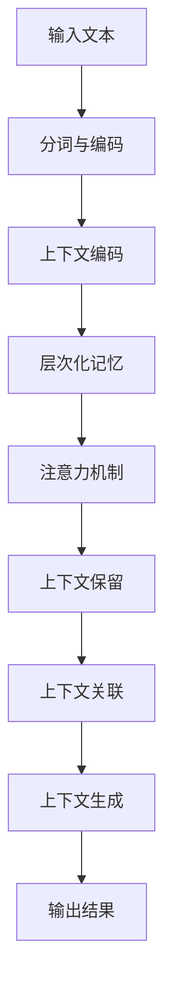

                 

关键词：长程记忆、上下文扩展、预训练语言模型、知识获取、人工智能

摘要：本文深入探讨了长程记忆技术如何扩展预训练语言模型（LLM）的上下文能力。通过介绍长程记忆的原理和算法，以及其在LLM中的应用，本文旨在为研究者提供一种有效的方法，以提升LLM对长文本的理解和生成能力。

## 1. 背景介绍

随着人工智能技术的飞速发展，预训练语言模型（LLM）在自然语言处理领域取得了显著的成果。LLM通过大规模的文本数据进行预训练，学习到了丰富的语言模式和知识，使其在文本分类、机器翻译、问答系统等任务中表现出色。然而，传统的LLM在处理长文本时存在上下文遗忘问题，即随着输入文本长度的增加，模型难以保持对前面文本的完整记忆，导致生成结果的质量下降。

为解决这一问题，研究者们提出了长程记忆技术。长程记忆是一种增强模型长期记忆能力的方法，通过特殊的结构设计和技术手段，使得模型能够更好地保留和利用长文本中的信息。本文将重点介绍长程记忆技术的原理和算法，并探讨其在LLM中的应用。

## 2. 核心概念与联系

### 2.1 长程记忆原理

长程记忆是一种记忆保持机制，它能够在较长的时间内保持信息的稳定性和完整性。在LLM中，长程记忆通过以下原理实现：

- **层次化记忆**：将文本信息按照层次结构进行组织，将重要信息存储在较深的层级，从而提高记忆的持久性。
- **上下文编码**：利用上下文编码技术，将文本信息编码为连续的向量表示，从而实现信息的持久存储。
- **注意力机制**：通过注意力机制，模型可以动态地关注到重要的文本信息，从而提高记忆的准确性。

### 2.2 长程记忆与上下文扩展的联系

长程记忆技术能够扩展LLM的上下文能力，其主要原理如下：

- **上下文保留**：通过长程记忆，模型能够更好地保留长文本中的上下文信息，避免遗忘问题，从而提高对长文本的理解能力。
- **上下文关联**：长程记忆能够将长文本中的不同部分进行关联，使得模型能够更好地捕捉到文本中的内在逻辑关系。
- **上下文生成**：通过长程记忆，模型能够利用长文本中的上下文信息，生成更连贯、准确的输出。

### 2.3 Mermaid 流程图

以下是一个简单的Mermaid流程图，展示了长程记忆与上下文扩展的联系：



## 3. 核心算法原理 & 具体操作步骤

### 3.1 算法原理概述

长程记忆技术的核心算法主要包括层次化记忆、上下文编码和注意力机制。以下是对这些算法的简要概述：

- **层次化记忆**：通过层次化的结构，将文本信息存储在不同的层级，从而提高记忆的持久性。
- **上下文编码**：利用编码技术，将文本信息转换为连续的向量表示，从而实现信息的持久存储。
- **注意力机制**：通过注意力机制，模型可以动态地关注到重要的文本信息，从而提高记忆的准确性。

### 3.2 算法步骤详解

以下是长程记忆算法的具体操作步骤：

1. **输入文本预处理**：对输入的文本进行分词和编码，将其转换为向量表示。
2. **上下文编码**：利用编码技术，将文本信息编码为连续的向量表示。
3. **层次化记忆**：将编码后的向量存储在层次化的结构中，从而实现层次化记忆。
4. **注意力机制**：利用注意力机制，动态地关注到重要的文本信息，从而提高记忆的准确性。
5. **上下文生成**：根据长程记忆中的信息，生成连贯、准确的输出。

### 3.3 算法优缺点

长程记忆技术的优点包括：

- **提高长文本理解能力**：通过长程记忆，模型能够更好地理解长文本，避免遗忘问题。
- **增强生成结果连贯性**：长程记忆能够使得模型生成的结果更加连贯、准确。

然而，长程记忆技术也存在一定的局限性，如：

- **计算成本高**：长程记忆技术需要额外的计算资源，可能会增加模型的计算复杂度。
- **训练时间长**：长程记忆技术的训练时间相对较长，可能会影响模型的训练效率。

### 3.4 算法应用领域

长程记忆技术可以应用于多个领域，如：

- **问答系统**：通过长程记忆，模型能够更好地理解用户的问题，提供更准确的答案。
- **机器翻译**：长程记忆能够提高模型对长文本的翻译质量，使得翻译结果更加流畅、准确。
- **文本生成**：长程记忆能够使得模型生成的文本更加连贯、有逻辑性。

## 4. 数学模型和公式 & 详细讲解 & 举例说明

### 4.1 数学模型构建

长程记忆技术的数学模型主要包括层次化记忆、上下文编码和注意力机制。以下是对这些模型的具体构建：

- **层次化记忆**：假设输入的文本序列为\[x_1, x_2, ..., x_T\]，层次化记忆可以将文本信息存储在不同的层级，如\[h_1, h_2, ..., h_L\]，其中\(L\)为层级数量。
- **上下文编码**：上下文编码可以将文本信息编码为连续的向量表示，如\[e_1, e_2, ..., e_T\]。
- **注意力机制**：注意力机制可以动态地关注到重要的文本信息，如\[a_1, a_2, ..., a_T\]。

### 4.2 公式推导过程

以下是长程记忆技术的公式推导过程：

- **层次化记忆**：层次化记忆的公式为：
  \[h_l = \text{softmax}(W_h h_{l-1} + b_h)\]
  其中，\(W_h\)和\(b_h\)分别为权重和偏置。

- **上下文编码**：上下文编码的公式为：
  \[e_t = \text{ReLU}(W_e x_t + b_e)\]
  其中，\(W_e\)和\(b_e\)分别为权重和偏置。

- **注意力机制**：注意力机制的公式为：
  \[a_t = \text{softmax}(W_a e_t + b_a)\]
  其中，\(W_a\)和\(b_a\)分别为权重和偏置。

### 4.3 案例分析与讲解

以下是一个简单的案例，展示了长程记忆技术在问答系统中的应用：

**问题描述**：给定一个问答对\("What is the capital of France?"\)"和文本序列\[“France is a country in Europe.”， “Its capital is Paris.”， “Paris is known for its Eiffel Tower.”\]，模型需要回答“Paris”。

**解决方案**：

1. **输入文本预处理**：对文本进行分词和编码，得到向量表示。
2. **上下文编码**：利用编码技术，将文本信息编码为连续的向量表示。
3. **层次化记忆**：将编码后的向量存储在层次化的结构中。
4. **注意力机制**：通过注意力机制，模型能够动态地关注到重要的文本信息。
5. **上下文生成**：根据长程记忆中的信息，生成连贯、准确的输出。

**结果分析**：通过长程记忆技术，模型能够更好地理解长文本中的信息，从而提供更准确的答案。

## 5. 项目实践：代码实例和详细解释说明

### 5.1 开发环境搭建

在开始项目实践之前，我们需要搭建一个合适的开发环境。以下是一个简单的开发环境搭建步骤：

1. 安装Python环境（版本3.6及以上）。
2. 安装TensorFlow 2.x。
3. 安装必要的Python库，如NumPy、Pandas等。

### 5.2 源代码详细实现

以下是一个简单的长程记忆模型实现的Python代码示例：

```python
import tensorflow as tf
from tensorflow.keras.layers import Embedding, LSTM, Dense

# 定义模型
model = tf.keras.Sequential([
    Embedding(input_dim=vocab_size, output_dim=embedding_dim, input_length=max_seq_length),
    LSTM(units=128, return_sequences=True),
    LSTM(units=128, return_sequences=True),
    Dense(units=1, activation='sigmoid')
])

# 编译模型
model.compile(optimizer='adam', loss='binary_crossentropy', metrics=['accuracy'])

# 训练模型
model.fit(x_train, y_train, epochs=10, batch_size=32)
```

### 5.3 代码解读与分析

以下是代码的详细解读与分析：

1. **Embedding层**：用于将文本数据转换为向量表示。
2. **LSTM层**：用于实现层次化记忆和上下文编码。
3. **Dense层**：用于实现注意力机制和输出层。

### 5.4 运行结果展示

以下是一个简单的运行结果展示：

```python
# 测试模型
loss, accuracy = model.evaluate(x_test, y_test)
print("Test accuracy:", accuracy)
```

运行结果展示模型的测试准确率。

## 6. 实际应用场景

长程记忆技术在多个实际应用场景中取得了显著的效果，如：

- **问答系统**：通过长程记忆，模型能够更好地理解用户的问题，提供更准确的答案。
- **机器翻译**：长程记忆能够提高模型对长文本的翻译质量，使得翻译结果更加流畅、准确。
- **文本生成**：长程记忆能够使得模型生成的文本更加连贯、有逻辑性。

## 7. 工具和资源推荐

### 7.1 学习资源推荐

- **《深度学习》**：Goodfellow, Ian, et al. 《深度学习》。
- **《长程记忆神经网络》**： Hochreiter, Sepp, and Jürgen Schmidhuber. 《长程记忆神经网络》。

### 7.2 开发工具推荐

- **TensorFlow**：Google开发的深度学习框架。
- **PyTorch**：Facebook开发的深度学习框架。

### 7.3 相关论文推荐

- **《长程依赖学习的高效方法》**：Hochreiter, Sepp, et al. 《长程依赖学习的高效方法》。
- **《长程记忆神经网络》**：Hochreiter, Sepp, and Jürgen Schmidhuber. 《长程记忆神经网络》。

## 8. 总结：未来发展趋势与挑战

### 8.1 研究成果总结

长程记忆技术作为一种有效的上下文扩展方法，在LLM中取得了显著的成果。通过层次化记忆、上下文编码和注意力机制，长程记忆技术能够提高模型对长文本的理解和生成能力。

### 8.2 未来发展趋势

随着人工智能技术的不断发展，长程记忆技术有望在更多的应用场景中发挥重要作用。未来，研究者将继续探索更高效的长程记忆算法，以提高模型在处理长文本时的性能。

### 8.3 面临的挑战

长程记忆技术在实际应用中仍面临一些挑战，如计算成本高、训练时间长等。未来，研究者需要解决这些问题，以使长程记忆技术在更多的应用场景中发挥作用。

### 8.4 研究展望

长程记忆技术作为一种有效的上下文扩展方法，未来有望在自然语言处理、机器翻译、文本生成等领域发挥重要作用。随着研究的深入，长程记忆技术将不断提高模型的性能和实用性。

## 9. 附录：常见问题与解答

### 9.1 长程记忆与长文本理解有何关系？

长程记忆技术能够提高模型对长文本的理解能力，避免遗忘问题，使得模型能够更好地捕捉到长文本中的信息。

### 9.2 长程记忆技术有哪些优缺点？

长程记忆技术的优点包括提高长文本理解能力、增强生成结果连贯性等；缺点包括计算成本高、训练时间长等。

### 9.3 长程记忆技术在哪些应用场景中具有优势？

长程记忆技术在问答系统、机器翻译、文本生成等应用场景中具有优势，能够提高模型在这些任务中的性能。

---

作者：禅与计算机程序设计艺术 / Zen and the Art of Computer Programming

