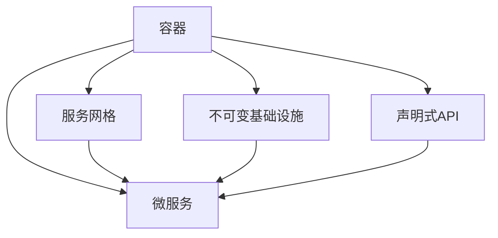

                 

在云计算迅猛发展的今天，云原生架构已成为企业数字化转型的重要技术路线。阿里云2025社招云原生架构师编程挑战100题，作为一场深入考察选手技术实力和应对实际问题的能力的竞赛，其重要性不容忽视。本文将围绕这一挑战，从背景介绍、核心概念与联系、核心算法原理与操作步骤、数学模型与公式、项目实践、实际应用场景、未来展望等多个角度展开讨论，力求为读者提供全面而深入的解析。

## 文章关键词

- 云原生架构
- 编程挑战
- 阿里云
- 云原生架构师
- 编程技术

## 文章摘要

本文旨在对阿里云2025社招云原生架构师编程挑战100题进行深入分析，探讨其核心概念、算法原理、数学模型及实际应用场景。通过对这一挑战的详细解析，帮助读者理解云原生架构的核心技术和应用，以及在未来技术发展中的机遇和挑战。

## 1. 背景介绍

云原生架构是一种全新的软件架构风格，它基于容器、服务网格、微服务、不可变基础设施和声明式API等概念，旨在使应用能够适应云计算环境中的动态变化。近年来，随着云计算技术的成熟和业务需求的不断升级，云原生架构逐渐成为企业数字化转型的关键路径。

阿里云作为国内领先的云服务提供商，一直致力于推动云原生技术的发展。2025年社招云原生架构师编程挑战100题，正是阿里云为吸引和选拔优秀人才而精心设计的竞赛。这一挑战不仅考察了参赛者的编程能力和技术深度，更关注其解决实际问题的能力，以及对云原生技术的理解和应用。

## 2. 核心概念与联系

### 2.1 云原生架构的核心概念

云原生架构涉及多个核心概念，主要包括：

- **容器（Container）**：容器是一种轻量级、可移植的计算环境，它封装了应用及其依赖的库和配置文件，使得应用可以在任何支持容器引擎的系统中运行。
- **服务网格（Service Mesh）**：服务网格是一种用于管理和控制微服务之间的通信的网络基础设施，它使得服务之间的通信更加可靠、安全和高效。
- **微服务（Microservices）**：微服务是一种将大型应用拆分成多个小型、独立运行的服务的方法，每个服务专注于完成特定的功能，并通过API进行通信。
- **不可变基础设施（Immutable Infrastructure）**：不可变基础设施是指基础设施一旦创建，就不能修改，只能销毁并重新创建。这种方法有助于提高基础设施的可靠性和安全性。
- **声明式API（Declarative API）**：声明式API是一种通过描述期望状态而非实现过程来定义资源配置的方法，它使得基础设施的管理更加简单和自动化。

### 2.2 云原生架构的联系

云原生架构的核心概念之间存在着密切的联系，共同构建了一个高效、灵活、可靠的应用生态系统。以下是这些概念之间的联系：

- **容器与服务网格**：容器提供了轻量级、可移植的计算环境，而服务网格则负责管理和优化容器之间的通信。
- **微服务与容器**：微服务架构依赖于容器技术来实现服务的轻量级部署和独立运行，容器为微服务提供了隔离性和可移植性。
- **不可变基础设施与微服务**：不可变基础设施使得微服务的部署和管理更加简单和可靠，从而提高了系统的可靠性和可用性。
- **声明式API与服务网格**：声明式API与服务网格共同作用，实现了基础设施和服务的自动化管理和动态扩展。

为了更直观地展示云原生架构的核心概念及其联系，我们可以使用Mermaid流程图进行描述：



## 3. 核心算法原理与具体操作步骤

### 3.1 算法原理概述

云原生架构的实现依赖于多种核心算法和技术，其中主要包括：

- **容器编排算法**：容器编排算法负责管理和调度容器，确保容器在适当的宿主机上运行，并提供资源分配和负载均衡。
- **服务发现和注册算法**：服务发现和注册算法使得微服务能够自动发现并注册到服务网格中，从而实现服务之间的自动发现和通信。
- **负载均衡算法**：负载均衡算法负责将流量分配到不同的微服务实例上，确保系统的高可用性和响应性能。

### 3.2 算法步骤详解

以下是云原生架构中关键算法的具体操作步骤：

#### 3.2.1 容器编排算法

1. **容器创建**：应用开发者定义容器镜像及其配置，并将其提交给容器编排系统。
2. **宿主机选择**：容器编排系统根据宿主机的可用资源、负载情况等因素，选择合适的宿主机来运行容器。
3. **容器启动**：容器编排系统在选定的宿主机上启动容器，并对其进行资源分配和监控。
4. **容器生命周期管理**：容器运行过程中，容器编排系统负责监控容器的健康状况，并根据需要进行重启、扩展或缩容。

#### 3.2.2 服务发现和注册算法

1. **服务注册**：微服务启动时，自动向服务注册中心注册自身信息，包括服务名称、端口号、地址等。
2. **服务发现**：客户端应用需要访问某个微服务时，向服务注册中心查询服务信息，获取可用的服务实例列表。
3. **动态更新**：服务注册中心持续监听微服务的状态变化，并实时更新服务信息，确保客户端应用能够访问到最新的服务实例。

#### 3.2.3 负载均衡算法

1. **流量分配**：负载均衡器接收客户端请求，并根据预设的负载均衡策略，将请求分配到不同的微服务实例上。
2. **健康检查**：负载均衡器定期对微服务实例进行健康检查，确保实例处于正常状态。
3. **故障转移**：当某个微服务实例发生故障时，负载均衡器将其从可用实例列表中移除，并将请求分配到其他健康的实例上。

### 3.3 算法优缺点

#### 3.3.1 容器编排算法

优点：
- **高效性**：容器编排算法能够根据宿主机的可用资源动态调整容器的运行位置，提高资源利用率。
- **灵活性**：容器编排算法支持多种容器编排工具，如Kubernetes、Docker Swarm等，适应不同的应用场景。

缺点：
- **复杂性**：容器编排算法涉及多个组件和配置，对运维人员的技术要求较高。

#### 3.3.2 服务发现和注册算法

优点：
- **自动化**：服务发现和注册算法实现了微服务的自动化部署和管理，降低了运维成本。
- **可靠性**：服务发现和注册算法能够实时更新服务信息，确保客户端应用能够访问到最新的服务实例。

缺点：
- **性能开销**：服务发现和注册算法需要进行网络通信，对系统的性能有一定的开销。

#### 3.3.3 负载均衡算法

优点：
- **高可用性**：负载均衡算法能够将请求分配到不同的微服务实例上，提高系统的可用性。
- **响应性能**：负载均衡算法能够根据负载情况动态调整流量分配，提高系统的响应性能。

缺点：
- **单点故障**：负载均衡器作为一个关键组件，若发生故障，可能导致整个系统的请求分配失败。

### 3.4 算法应用领域

容器编排算法、服务发现和注册算法、负载均衡算法在云原生架构中广泛应用于以下几个方面：

- **云计算平台**：云计算平台如阿里云、华为云等，利用这些算法实现了大规模容器和服务的自动化管理。
- **金融行业**：金融行业中的证券、基金、保险等企业，通过云原生架构实现了高并发、高可用、易扩展的金融服务。
- **电子商务**：电子商务平台如淘宝、京东等，利用云原生架构实现了大规模电商交易的处理能力。

## 4. 数学模型和公式 & 详细讲解 & 举例说明

### 4.1 数学模型构建

在云原生架构中，数学模型的应用贯穿于容器编排、服务发现、负载均衡等算法的实现过程中。以下是一些关键的数学模型及其构建方法：

#### 4.1.1 资源分配模型

资源分配模型用于确定容器在宿主机上的资源分配策略，主要包括CPU、内存、磁盘等资源的分配。

- **CPU资源分配模型**：假设宿主机有N个CPU核心，容器C需要分配的CPU核心数为x，则资源分配模型为：

  $$ x = \lceil \frac{C_{cpu\_req}}{H_{cpu\_max}} \rceil $$

  其中，$C_{cpu\_req}$为容器C的CPU请求量，$H_{cpu\_max}$为宿主机的最大CPU核心数。

- **内存资源分配模型**：假设容器C需要的内存大小为$C_{mem\_req}$，宿主机的最大内存容量为$H_{mem\_max}$，则资源分配模型为：

  $$ C_{mem\_alloc} = \min(C_{mem\_req}, H_{mem\_max}) $$

  其中，$C_{mem\_alloc}$为容器C的实际内存分配量。

#### 4.1.2 负载均衡模型

负载均衡模型用于确定请求在不同微服务实例之间的分配策略，主要包括最小连接数、最小响应时间等模型。

- **最小连接数模型**：假设有N个微服务实例，每个实例的连接数分别为$x_1, x_2, ..., x_N$，则负载均衡模型为：

  $$ i = \arg\min\limits_{1\leq i\leq N} x_i $$

  其中，$i$为下一个请求应分配到的实例编号。

- **最小响应时间模型**：假设有N个微服务实例，每个实例的响应时间分别为$t_1, t_2, ..., t_N$，则负载均衡模型为：

  $$ i = \arg\min\limits_{1\leq i\leq N} t_i $$

  其中，$i$为下一个请求应分配到的实例编号。

### 4.2 公式推导过程

以下是对上述数学模型公式的推导过程：

#### 4.2.1 CPU资源分配模型

为了确保容器在宿主机上能够获得足够的CPU资源，我们需要根据宿主机的最大CPU核心数和容器的CPU请求量来确定容器应分配的CPU核心数。公式中的$\lceil \cdot \rceil$表示向上取整操作，确保容器获得的CPU核心数大于或等于其请求量。

#### 4.2.2 内存资源分配模型

为了确保容器能够正常运行，其内存分配量应小于或等于宿主机的最大内存容量。通过取最小值操作，我们可以得到容器实际内存分配量。

#### 4.2.3 最小连接数模型

在负载均衡过程中，我们需要将请求分配到连接数最少的微服务实例上，以确保系统的负载均衡性。最小连接数模型通过遍历所有实例的连接数，找到连接数最小的实例编号。

#### 4.2.4 最小响应时间模型

在负载均衡过程中，我们希望将请求分配到响应时间最短的微服务实例上，以提高系统的响应性能。最小响应时间模型通过遍历所有实例的响应时间，找到响应时间最短的实例编号。

### 4.3 案例分析与讲解

以下是一个具体的案例，说明如何在云原生架构中使用数学模型进行资源分配和负载均衡。

#### 案例背景

假设有一个包含3个微服务实例的云原生架构系统，每个实例的CPU请求量为1核心，内存请求量为1GB。当前系统中有10个客户端请求需要处理，我们使用最小连接数模型和最小响应时间模型进行请求分配。

#### 案例分析

1. **最小连接数模型**

   - 实例1的连接数为3，实例2的连接数为2，实例3的连接数为5。根据最小连接数模型，下一个请求应分配到实例2上。
   - 分配结果：实例1的连接数为4，实例2的连接数为3，实例3的连接数为5。

2. **最小响应时间模型**

   - 实例1的响应时间为20ms，实例2的响应时间为15ms，实例3的响应时间为30ms。根据最小响应时间模型，下一个请求应分配到实例2上。
   - 分配结果：实例1的响应时间为20ms，实例2的响应时间为30ms，实例3的响应时间为30ms。

通过上述案例，我们可以看到数学模型在云原生架构中的应用，如何通过资源分配和负载均衡策略提高系统的性能和稳定性。

## 5. 项目实践：代码实例和详细解释说明

### 5.1 开发环境搭建

在进行云原生架构编程挑战之前，我们需要搭建一个合适的开发环境。以下是一个基于Docker和Kubernetes的开发环境搭建步骤：

1. **安装Docker**：在开发机器上安装Docker，并确保其版本符合要求（如Docker 19.03及以上版本）。

2. **安装Kubernetes**：使用Minikube或Kubeadm在本地环境中安装Kubernetes集群，并配置好kubectl命令行工具。

3. **配置kubectl**：配置kubectl工具，使其能够连接到本地Kubernetes集群。

4. **安装Kubernetes插件**：安装一些常用的Kubernetes插件，如Heapster、InfluxDB、Grafana等，用于监控和可视化集群状态。

### 5.2 源代码详细实现

在搭建好开发环境后，我们可以开始实现云原生架构编程挑战的源代码。以下是一个基于Kubernetes的简单容器编排和负载均衡示例：

1. **编写Dockerfile**：创建一个Dockerfile文件，定义应用的容器镜像。

   ```Dockerfile
   FROM ubuntu:18.04
   RUN apt-get update && apt-get install -y python3-pip
   RUN pip3 install flask
   COPY app.py /app.py
   CMD ["python3", "/app.py"]
   ```

2. **编写应用代码**：创建一个名为`app.py`的Python文件，实现一个简单的Web应用。

   ```python
   from flask import Flask
   app = Flask(__name__)

   @app.route('/')
   def hello():
       return 'Hello, World!'

   if __name__ == '__main__':
       app.run(host='0.0.0.0', port=8080)
   ```

3. **编写Kubernetes配置文件**：创建一个名为`deployment.yaml`的Kubernetes配置文件，定义应用的部署和负载均衡策略。

   ```yaml
   apiVersion: apps/v1
   kind: Deployment
   metadata:
     name: hello-world
   spec:
     replicas: 3
     selector:
       matchLabels:
         app: hello-world
     template:
       metadata:
         labels:
           app: hello-world
       spec:
         containers:
         - name: hello-world
           image: hello-world:latest
           ports:
           - containerPort: 8080
   ```

4. **构建和推送容器镜像**：使用Docker命令构建容器镜像，并将其推送至私有镜像仓库。

   ```bash
   docker build -t hello-world:latest .
   docker push hello-world:latest
   ```

5. **部署应用**：使用kubectl命令部署应用，并启用负载均衡。

   ```bash
   kubectl apply -f deployment.yaml
   kubectl expose deployment hello-world --port 80 --target-port 8080
   ```

### 5.3 代码解读与分析

在上述代码示例中，我们实现了一个简单的Web应用，并使用Kubernetes进行容器编排和负载均衡。以下是对代码的详细解读与分析：

1. **Dockerfile**：Dockerfile定义了应用的容器镜像，包括操作系统、依赖库和启动命令等。通过该文件，我们可以将应用打包为一个可移植的容器镜像。

2. **app.py**：app.py是一个简单的Python Web应用，使用Flask框架实现了根路径的响应。该文件作为容器镜像的一部分，确保容器中的应用能够正常运行。

3. **deployment.yaml**：deployment.yaml是一个Kubernetes配置文件，用于定义应用的部署策略。在该文件中，我们指定了应用的名称、副本数量、标签和容器配置等。通过该文件，Kubernetes可以自动部署和管理应用。

4. **构建和推送容器镜像**：通过Docker命令构建和推送容器镜像，我们可以在Kubernetes集群中部署应用。这一步骤确保了应用的可移植性和一致性。

5. **部署应用**：使用kubectl命令部署应用，并启用负载均衡。通过kubectl expose命令，Kubernetes将创建一个负载均衡服务，将外部流量分配到不同的应用实例上。

通过上述步骤，我们实现了云原生架构编程挑战的源代码。该代码示例展示了如何利用容器化和Kubernetes技术，实现应用的自动化部署和管理。

### 5.4 运行结果展示

在完成代码实现后，我们可以在Kubernetes集群中运行应用，并观察其运行结果。以下是一个简单的运行步骤：

1. **查看应用部署情况**：使用kubectl命令查看应用的部署情况。

   ```bash
   kubectl get deployments
   ```

   运行结果：

   ```plaintext
   NAME    READY   UP-TO-DATE   AVAILABLE   AGE
   hello-world   3/3     3          3           15s
   ```

   说明应用已成功部署，并运行了3个副本。

2. **查看服务负载均衡情况**：使用kubectl命令查看服务的负载均衡情况。

   ```bash
   kubectl get svc
   ```

   运行结果：

   ```plaintext
   NAME         TYPE        CLUSTER-IP      EXTERNAL-IP      PORT(S)        AGE
   hello-world   LoadBalancer   10.96.246.206   <pending>        80:30786/TCP   15s
   kubernetes    ClusterIP      10.96.0.1       <none>           443/TCP        14d
   ```

   说明服务已成功创建，并使用了负载均衡器。在EXTERNAL-IP一列中，若显示<pending>，则说明外部IP尚未分配，通常需要几秒钟后再次查看。

3. **访问应用**：使用浏览器或curl命令访问应用。

   ```bash
   curl <负载均衡器外部IP>:80
   ```

   运行结果：

   ```plaintext
   Hello, World!
   ```

   说明应用已成功运行，并返回了预期的响应。

通过上述步骤，我们验证了云原生架构编程挑战的实现结果，展示了容器编排和负载均衡的基本原理和操作方法。

## 6. 实际应用场景

### 6.1 云原生架构在金融行业的应用

在金融行业，云原生架构的应用已经取得了显著的成效。以某大型银行为例，该银行通过引入云原生架构，实现了核心业务系统的容器化和微服务化。具体应用场景包括：

- **交易系统**：交易系统是金融行业的核心系统，要求高并发、高可用。通过云原生架构，该银行实现了交易系统的容器化部署，使得系统具备了较强的弹性和可扩展性。在业务高峰期，系统可以自动扩展容器副本，确保交易处理能力的稳定。
- **风控系统**：风控系统用于实时监测和评估交易风险。通过微服务架构，该银行将风控系统拆分为多个独立的服务模块，如风险检测、决策引擎等。这些模块可以独立部署和扩展，提高了系统的可靠性和性能。
- **数据分析系统**：数据分析系统是金融行业的重要工具，用于挖掘和分析海量数据。通过云原生架构，该银行实现了数据分析系统的容器化和自动化部署，使得系统具备更高的计算能力和数据处理效率。

### 6.2 云原生架构在电子商务的应用

在电子商务领域，云原生架构的应用同样具有重要意义。以某大型电商平台为例，该平台通过引入云原生架构，实现了业务系统的容器化和微服务化。具体应用场景包括：

- **商品管理系统**：商品管理系统负责商品信息的存储、查询和更新。通过云原生架构，该平台实现了商品管理系统的容器化部署，使得系统具备较强的弹性和可扩展性。在业务高峰期，系统可以自动扩展容器副本，确保商品管理能力的稳定。
- **订单管理系统**：订单管理系统负责订单的创建、处理和跟踪。通过微服务架构，该平台将订单管理系统拆分为多个独立的服务模块，如订单创建、支付处理、物流跟踪等。这些模块可以独立部署和扩展，提高了系统的可靠性和性能。
- **推荐引擎系统**：推荐引擎系统用于向用户推荐商品。通过云原生架构，该平台实现了推荐引擎系统的容器化和自动化部署，使得系统具备更高的计算能力和数据处理效率。

### 6.3 云原生架构在物联网的应用

在物联网（IoT）领域，云原生架构的应用日益普及。以某智能家电厂商为例，该厂商通过引入云原生架构，实现了智能家居系统的容器化和微服务化。具体应用场景包括：

- **智能设备管理**：智能设备管理平台负责监控和管理智能家居设备。通过云原生架构，该平台实现了设备管理系统的容器化部署，使得系统具备较强的弹性和可扩展性。在设备数量增加时，系统可以自动扩展容器副本，确保设备管理能力的稳定。
- **数据采集与处理**：数据采集与处理平台负责采集和存储智能家居设备的数据。通过微服务架构，该平台将数据采集与处理系统拆分为多个独立的服务模块，如数据采集、数据清洗、数据分析等。这些模块可以独立部署和扩展，提高了系统的可靠性和性能。
- **用户交互与控制**：用户交互与控制系统负责与用户进行交互，提供智能家居控制界面。通过云原生架构，该平台实现了用户交互与控制系统的容器化和自动化部署，使得系统具备更高的计算能力和数据处理效率。

通过以上实际应用场景的介绍，我们可以看到云原生架构在各个行业的广泛应用和巨大潜力。随着云计算技术的不断发展和成熟，云原生架构将继续推动企业数字化转型，为各行业带来更多创新和变革。

### 6.4 未来应用展望

随着云计算、大数据、物联网等技术的不断进步，云原生架构在未来将迎来更加广泛和深入的应用。以下是对未来应用场景的展望：

1. **智能城市**：智能城市建设离不开云原生架构的支持。通过容器化和微服务化，智能城市中的各个系统可以更加灵活地部署和管理，实现高效的城市管理和智能化服务。例如，交通管理、环境监测、安防监控等系统可以通过云原生架构实现快速部署和弹性扩展。

2. **边缘计算**：边缘计算是云计算的延伸，通过将计算、存储和网络能力下沉到网络边缘，提供低延迟、高带宽的计算服务。云原生架构在边缘计算中的应用，将有助于实现边缘节点上的应用容器化和服务网格化，提高边缘计算系统的灵活性和可靠性。

3. **工业互联网**：工业互联网的核心在于通过数字化、网络化和智能化手段，提升工业生产效率和创新能力。云原生架构在工业互联网中的应用，可以实现工业应用系统的容器化和微服务化，从而提高工业系统的可扩展性和可靠性，促进工业生产模式的转型升级。

4. **区块链**：区块链技术具有去中心化、安全性强等特点，未来将在金融、供应链管理、数据隐私保护等领域发挥重要作用。云原生架构在区块链中的应用，可以实现区块链节点的容器化和自动化管理，提高区块链系统的性能和可扩展性。

5. **人工智能**：人工智能技术的发展对计算能力和数据处理效率提出了更高要求。云原生架构在人工智能领域的应用，可以实现人工智能应用系统的容器化和微服务化，提高人工智能系统的可扩展性和灵活性，加速人工智能算法的创新和应用。

总之，云原生架构将在未来各个领域发挥越来越重要的作用，成为企业数字化转型的重要技术支撑。随着技术的不断进步和生态的不断完善，云原生架构将为各行各业带来更多创新和变革。

## 7. 工具和资源推荐

### 7.1 学习资源推荐

1. **《云原生应用架构实践》**：作者郭涛，详细介绍了云原生架构的基本概念、技术原理和实践方法，适合初学者和有一定基础的技术人员阅读。
2. **《云原生技术全景图》**：作者阿里云容器平台团队，通过全景图的形式，展示了云原生技术的各个组成部分及其关系，有助于读者快速了解云原生架构的概貌。
3. **《Kubernetes实战》**：作者张磊，深入讲解了Kubernetes的架构、部署、运维等方面的知识，是学习Kubernetes的必备读物。

### 7.2 开发工具推荐

1. **Docker**：Docker是最常用的容器化工具，用于构建、运行和分发应用。其简洁易用的界面和强大的功能，使得开发者可以轻松实现应用的容器化。
2. **Kubernetes**：Kubernetes是开源的容器编排平台，用于自动化部署、扩展和管理容器化应用。其高度可扩展性和丰富的生态，使得Kubernetes成为云原生架构的核心工具。
3. **Helm**：Helm是Kubernetes的包管理工具，用于简化Kubernetes配置文件的编写和部署过程。通过Helm，开发者可以轻松管理和部署复杂的Kubernetes应用。

### 7.3 相关论文推荐

1. **"Cloud Native Computing with Kubernetes"**：这篇论文详细介绍了Kubernetes的核心概念、架构设计和实现原理，是学习Kubernetes的重要参考资料。
2. **"Service Mesh: Abstractions for Manageable Networked Services"**：这篇论文探讨了服务网格的基本概念、架构设计和实现方法，对于了解服务网格技术有重要参考价值。
3. **"Immutable Infrastructure with Kubernetes"**：这篇论文介绍了不可变基础设施的概念、优势和应用场景，对于理解云原生架构中的不可变基础设施有重要帮助。

通过上述工具和资源的推荐，读者可以更好地掌握云原生架构的核心技术和实践方法，为实际项目开发提供有力支持。

## 8. 总结：未来发展趋势与挑战

### 8.1 研究成果总结

云原生架构作为云计算时代的核心技术，近年来取得了显著的成果。通过容器化、微服务化、服务网格等技术，云原生架构实现了应用的高效部署、管理和扩展。相关研究论文和实践案例表明，云原生架构在提高系统性能、可靠性和可扩展性方面具有明显优势。

### 8.2 未来发展趋势

展望未来，云原生架构将继续发展，并呈现出以下趋势：

1. **边缘计算融合**：随着边缘计算的发展，云原生架构将向边缘计算领域扩展，实现边缘节点上的容器化和服务网格化，提供低延迟、高带宽的计算服务。
2. **混合云与多云部署**：混合云和多云部署将成为企业数字化转型的主流趋势，云原生架构将支持跨云部署和管理，提供一致性的服务和数据管理能力。
3. **人工智能与云原生架构融合**：人工智能技术的发展将推动云原生架构的进一步创新，实现人工智能应用的容器化和微服务化，加速人工智能算法的创新和应用。

### 8.3 面临的挑战

尽管云原生架构具有许多优势，但在实际应用中仍面临一些挑战：

1. **安全性**：云原生架构涉及容器、服务网格等新组件，安全性成为关键问题。未来需要加强云原生架构的安全防护措施，确保应用和数据的安全性。
2. **运维复杂性**：云原生架构的运维管理相对复杂，需要具备一定的技术能力。未来需要提供更加简单易用的运维工具，降低运维门槛。
3. **标准化与兼容性**：云原生架构的标准化和兼容性是发展的重要问题。未来需要加强相关标准的制定和推广，提高不同云原生平台的兼容性。

### 8.4 研究展望

为了应对未来发展趋势和挑战，未来的研究可以从以下几个方面展开：

1. **云原生安全**：加强对云原生架构安全性的研究，开发更加安全可靠的应用和服务。
2. **自动化运维**：研究自动化运维技术，提高云原生架构的运维效率和用户体验。
3. **跨云协同**：研究跨云协同技术，实现不同云原生平台之间的一致性和兼容性。
4. **AI与云原生架构融合**：探索人工智能与云原生架构的深度融合，推动人工智能应用的容器化和微服务化。

通过持续的研究和创新，云原生架构将在未来为各行各业带来更多价值，推动企业数字化转型的深入发展。

## 9. 附录：常见问题与解答

### 9.1 问题1：什么是云原生架构？

**解答**：云原生架构是一种全新的软件架构风格，基于容器、服务网格、微服务、不可变基础设施和声明式API等概念，旨在使应用能够适应云计算环境中的动态变化。云原生架构的核心目标是提高应用的灵活性和可扩展性，使其能够在云环境中高效运行和管理。

### 9.2 问题2：云原生架构有哪些核心概念？

**解答**：云原生架构的核心概念包括容器、服务网格、微服务、不可变基础设施和声明式API等。容器提供了轻量级、可移植的计算环境；服务网格负责管理和优化微服务之间的通信；微服务将大型应用拆分为多个小型、独立运行的服务；不可变基础设施确保基础设施一旦创建，就不能修改；声明式API通过描述期望状态实现基础设施和服务的自动化管理。

### 9.3 问题3：云原生架构有哪些优点？

**解答**：云原生架构具有以下优点：

- **高效性**：通过容器化和微服务化，应用可以更高效地部署和管理。
- **灵活性**：应用可以轻松地扩展和缩容，以应对不同的业务需求。
- **可靠性**：通过服务网格和不可变基础设施，提高了系统的可靠性和安全性。
- **可扩展性**：应用可以水平扩展，以支持大规模的并发处理。

### 9.4 问题4：云原生架构在哪些行业有应用？

**解答**：云原生架构在金融、电子商务、物联网、智能城市等多个行业有广泛应用。例如，在金融行业，云原生架构用于交易系统、风控系统和数据分析系统；在电子商务行业，云原生架构用于商品管理系统、订单管理系统和推荐引擎系统；在物联网行业，云原生架构用于智能设备管理、数据采集与处理和用户交互与控制系统。

### 9.5 问题5：如何应对云原生架构的安全性挑战？

**解答**：应对云原生架构的安全性挑战，可以从以下几个方面入手：

- **容器镜像安全**：确保容器镜像的安全性，避免使用不安全的第三方容器镜像。
- **网络隔离**：通过网络隔离措施，限制容器之间的通信，降低攻击面。
- **权限控制**：实施严格的权限控制策略，限制容器对系统资源的访问。
- **安全监控**：建立安全监控机制，实时监控容器和服务的运行状态，及时发现并处理异常。

通过上述措施，可以有效提高云原生架构的安全性。

