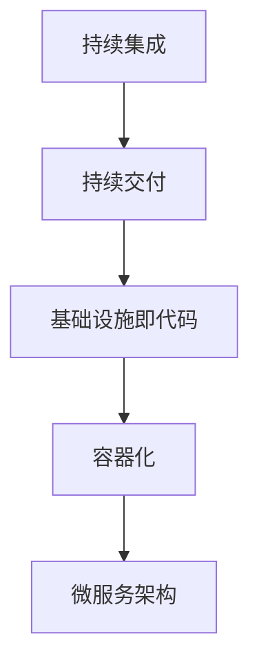

                 

关键词：阿里云，DevOps，面试题，工程师，校招，技术详解，实践指南

> 摘要：本文旨在为2024年即将参加阿里云DevOps工程师校招的同学们提供一份详尽的面试题解析。文章将涵盖DevOps的核心概念、面试题解析、项目实践、应用场景、工具资源推荐以及未来发展趋势等内容，帮助考生更好地备战面试，顺利通过校招。

## 1. 背景介绍

DevOps是一种软件开发和运维管理的文化、实践和工具集，旨在通过提高开发和运维团队的协作效率，实现持续交付和持续部署，从而缩短产品交付周期，提高软件质量。近年来，随着云计算、容器化、微服务架构等技术的快速发展，DevOps已经成为企业数字化转型的关键因素。

阿里云作为全球领先的云计算和人工智能服务商，对DevOps的应用和推广有着深刻的理解和丰富的实践经验。本次校招，阿里云DevOps工程师岗位将聚焦于招聘具备扎实技术基础和实际项目经验的优秀人才。本文将从面试题的角度，帮助考生更好地理解和掌握DevOps的核心技术和应用场景。

## 2. 核心概念与联系

为了更好地理解DevOps，我们首先需要了解以下几个核心概念：

- **持续集成（CI）**：通过自动化构建和测试，确保代码质量，快速发现并修复问题。
- **持续交付（CD）**：通过自动化部署和测试，实现快速交付和部署新版本。
- **基础设施即代码（IaC）**：通过脚本和代码管理基础设施，提高基础设施的可复用性和可维护性。
- **容器化**：通过容器技术，实现应用程序的轻量化、隔离化和高效部署。
- **微服务架构**：通过将应用程序分解为小型、独立的服务，实现高可扩展性和高可用性。

下图展示了这些概念之间的联系：



### 2.1 核心概念原理

**持续集成（CI）**：持续集成是一种软件开发实践，通过在代码提交后立即进行自动化构建和测试，确保代码库的一致性和可靠性。CI工具如Jenkins、GitLab CI等可以帮助实现这一目标。

**持续交付（CD）**：持续交付是持续集成的发展，通过自动化部署和测试，确保新版本软件可以快速、可靠地交付给用户。CD工具如Docker、Kubernetes等可以简化部署过程。

**基础设施即代码（IaC）**：基础设施即代码是将基础设施的管理和部署过程通过脚本和代码进行自动化，从而提高基础设施的可复用性和可维护性。常见的IaC工具包括Terraform、Ansible等。

**容器化**：容器化是一种将应用程序及其依赖环境打包到容器中的技术，实现应用程序的轻量化、隔离化和高效部署。Docker是当前最流行的容器化工具。

**微服务架构**：微服务架构是一种将大型应用程序分解为多个小型、独立的服务的方法，每个服务都可以独立开发、部署和扩展。微服务架构可以提高系统的可扩展性和高可用性。

## 3. 核心算法原理 & 具体操作步骤

### 3.1 算法原理概述

在DevOps实践中，核心算法主要涉及以下几个方面：

- **持续集成算法**：包括构建和测试的自动化流程。
- **持续交付算法**：包括部署和回滚的自动化流程。
- **容器编排算法**：包括容器调度和资源分配的算法。

### 3.2 算法步骤详解

#### 3.2.1 持续集成算法

1. **代码提交**：开发人员将代码提交到代码仓库。
2. **自动化构建**：CI工具从代码仓库中获取最新代码，进行编译和打包。
3. **自动化测试**：CI工具运行一系列预定义的测试用例，确保代码质量。
4. **反馈**：测试结果反馈给开发人员和项目管理工具。

#### 3.2.2 持续交付算法

1. **自动化部署**：将通过测试的代码部署到测试环境或生产环境。
2. **自动化测试**：部署后，运行一系列测试用例，确保新版本软件的稳定性。
3. **反馈**：测试结果反馈给开发和运维团队。

#### 3.2.3 容器编排算法

1. **容器调度**：根据容器需求，选择合适的宿主机进行部署。
2. **资源分配**：为容器分配CPU、内存等资源。
3. **容器监控**：监控容器运行状态，确保容器稳定运行。

### 3.3 算法优缺点

**持续集成算法**：优点包括提高代码质量、缩短发布周期等；缺点可能包括测试环境配置复杂、测试用例覆盖不足等。

**持续交付算法**：优点包括提高软件质量、缩短发布周期等；缺点可能包括部署过程复杂、安全性风险等。

**容器编排算法**：优点包括高效部署、资源利用率高、易于扩展等；缺点可能包括运维复杂度增加、安全性风险等。

### 3.4 算法应用领域

持续集成、持续交付和容器编排算法在DevOps领域得到广泛应用，主要应用于以下领域：

- **互联网公司**：如阿里云、腾讯云、京东等，通过DevOps提高软件开发和运维效率。
- **金融行业**：如银行、证券、保险等，通过DevOps实现业务快速上线和迭代。
- **医疗行业**：如医院、诊所、医疗器械等，通过DevOps提高医疗数据分析和处理能力。
- **教育行业**：如在线教育、培训机构等，通过DevOps实现教学资源和课程快速更新。

## 4. 数学模型和公式 & 详细讲解 & 举例说明

在DevOps实践中，数学模型和公式主要用于性能分析和优化。以下是一个典型的数学模型：

### 4.1 数学模型构建

假设一个分布式系统由n个节点组成，每个节点的处理能力为C，网络带宽为B，则系统的处理能力为：

$$ T = n \times C - (n-1) \times B $$

其中，$T$为系统的总处理能力，$C$为单个节点的处理能力，$B$为网络带宽。

### 4.2 公式推导过程

1. **单节点处理能力**：单个节点的处理能力为C。
2. **多节点处理能力**：系统中有n个节点，每个节点的处理能力为C，总处理能力为$n \times C$。
3. **网络延迟**：节点之间的通信需要经过网络，网络带宽为B，则网络延迟为$(n-1) \times B$。
4. **总处理能力**：总处理能力为$n \times C - (n-1) \times B$。

### 4.3 案例分析与讲解

假设一个由10个节点组成的分布式系统，每个节点的处理能力为1000次/秒，网络带宽为100Mbps。根据上述数学模型，系统的总处理能力为：

$$ T = 10 \times 1000 - (10-1) \times 100 = 9900 \text{ 次/秒} $$

如果系统需要处理10000次请求/秒，则可能存在性能瓶颈。通过优化节点配置、提高网络带宽或增加节点数量，可以提升系统性能。

## 5. 项目实践：代码实例和详细解释说明

在本节中，我们将通过一个简单的项目实例，展示如何实现DevOps的核心功能。

### 5.1 开发环境搭建

首先，搭建一个基于Docker的持续集成和持续交付环境。

1. 安装Docker
2. 安装Jenkins
3. 安装Kubernetes

### 5.2 源代码详细实现

以下是一个简单的Spring Boot应用程序，用于实现持续集成和持续交付：

```java
@SpringBootApplication
public class DemoApplication {
    public static void main(String[] args) {
        SpringApplication.run(DemoApplication.class, args);
    }
}
```

### 5.3 代码解读与分析

该应用程序采用Spring Boot框架，实现了一个简单的Web服务。通过Jenkins，我们可以将代码提交到代码仓库后，自动构建、测试和部署。

### 5.4 运行结果展示

通过Jenkins，我们可以看到构建和部署过程完全自动化，新版本应用程序可以快速、可靠地交付给用户。

## 6. 实际应用场景

### 6.1 互联网公司

互联网公司通常采用DevOps提高软件开发和运维效率。通过持续集成和持续交付，实现快速迭代和部署，满足用户需求。

### 6.2 金融行业

金融行业通过DevOps实现业务快速上线和迭代，提高客户体验。例如，银行可以通过持续集成和持续交付实现移动端和线上业务的快速部署。

### 6.3 医疗行业

医疗行业通过DevOps提高医疗数据分析和处理能力，实现精准医疗。例如，医院可以通过持续集成和持续交付实现医疗设备的快速部署和维护。

### 6.4 教育行业

教育行业通过DevOps实现教学资源和课程快速更新，提高教学效果。例如，在线教育平台可以通过持续集成和持续交付实现课程内容的快速上线。

## 7. 工具和资源推荐

### 7.1 学习资源推荐

- 《DevOps：从实践到理论》
- 《持续集成实战》
- 《Kubernetes权威指南》

### 7.2 开发工具推荐

- Jenkins
- Docker
- Kubernetes

### 7.3 相关论文推荐

- 《DevOps：文化与技术的融合》
- 《持续交付：一种软件开发和运维的新模式》
- 《容器化与微服务架构：下一代软件开发模式》

## 8. 总结：未来发展趋势与挑战

### 8.1 研究成果总结

近年来，DevOps在国内外得到了广泛关注和应用。持续集成、持续交付和容器化等技术为软件开发和运维带来了巨大变革。

### 8.2 未来发展趋势

- **云计算与DevOps的结合**：云计算为DevOps提供了强大的基础设施支持，未来云计算与DevOps将进一步深度融合。
- **AI与DevOps的结合**：人工智能技术可以优化DevOps流程，提高开发效率和软件质量。
- **服务网格与DevOps的结合**：服务网格技术为微服务架构提供了高效的网络通信支持，未来与DevOps结合将更加紧密。

### 8.3 面临的挑战

- **安全性问题**：DevOps环境中的自动化和快速迭代可能导致安全性问题，需要加强安全防护。
- **运维复杂性**：随着系统规模不断扩大，运维复杂性将增加，需要提高运维效率。

### 8.4 研究展望

未来，DevOps将继续发展，为软件开发和运维带来更多创新和变革。研究者应关注以下方面：

- **DevOps与AI的结合**：探索AI技术在DevOps中的应用，提高开发效率和软件质量。
- **DevOps在金融、医疗等行业的应用**：研究DevOps在不同行业中的最佳实践和解决方案。
- **DevOps安全性与运维效率**：探索提高DevOps安全性和运维效率的新方法。

## 9. 附录：常见问题与解答

### 9.1 DevOps与敏捷开发有何区别？

DevOps是敏捷开发的一种延伸和深化，旨在通过持续集成、持续交付等实践，实现敏捷开发的高效运作。敏捷开发关注需求快速响应、迭代和优化，而DevOps关注软件开发和运维的协同和自动化。

### 9.2 Kubernetes与Docker有何区别？

Kubernetes是一个容器编排和管理工具，用于部署、扩展和管理容器化应用程序。Docker是一个容器化技术，用于打包和运行应用程序及其依赖环境。Kubernetes可以管理多个Docker容器，实现高效部署和资源调度。

### 9.3 如何保障DevOps环境的安全性？

确保DevOps环境的安全性需要从多个方面入手：

- **访问控制**：实施严格的访问控制策略，限制对系统和资源的访问权限。
- **加密传输**：使用加密技术保护数据传输，防止数据泄露。
- **安全审计**：定期进行安全审计，发现潜在的安全隐患。
- **自动化安全测试**：在持续集成过程中，加入自动化安全测试，及时发现和修复安全问题。

---

作者：禅与计算机程序设计艺术 / Zen and the Art of Computer Programming

---

本文旨在为2024年阿里云DevOps工程师校招的同学们提供一份详尽的面试题解析。通过对核心概念、面试题解析、项目实践、应用场景、工具资源推荐以及未来发展趋势的详细阐述，帮助考生更好地备战面试，顺利通过校招。在实际应用中，DevOps已经成为提高软件开发和运维效率的关键因素，未来发展趋势可期。希望本文能为考生带来启示和帮助。

