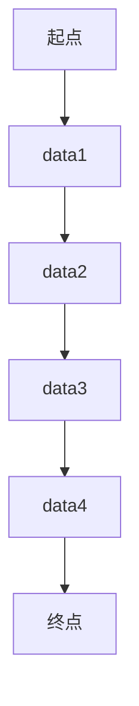

                 

在当今的数字化时代，云服务已经成为企业、个人开发者不可或缺的一部分。阿里云作为国内领先的云计算服务提供商，不仅提供了丰富的云产品和服务，还通过不断地技术创新，推动了云计算行业的快速发展。本文将聚焦于阿里云Native应用开发，探讨其核心概念、实现原理、应用实践和未来发展趋势。

> 关键词：阿里云、Native应用开发、云计算、应用架构、开发工具、性能优化

> 摘要：本文首先介绍了阿里云Native应用开发的背景和意义，随后详细讲解了核心概念与联系，包括阿里云服务架构、应用开发流程以及关键技术和工具。接着，深入分析了核心算法原理和数学模型，并通过项目实践展示了代码实例和运行结果。最后，讨论了实际应用场景和未来应用展望，提出了未来发展趋势和面临的挑战。

## 1. 背景介绍

随着互联网和移动互联网的普及，应用开发的复杂度和性能要求越来越高。传统Web应用由于依赖浏览器和服务器，存在性能瓶颈、跨平台兼容性问题，无法满足用户对速度和体验的高要求。而Native应用开发，以其高效的性能和良好的用户体验，逐渐成为主流。阿里云Native应用开发，则是依托阿里云强大的云计算基础设施，为开发者提供了一种高效、灵活的应用开发解决方案。

### 1.1 阿里云的发展历程

阿里云成立于2009年，是我国最早的云计算服务提供商之一。从最初的电商业务扩展到云计算领域，阿里云不断加大研发投入，创新技术，逐步构建了覆盖全行业、全场景的云计算服务生态。如今，阿里云已成为全球领先的云计算服务提供商，服务范围覆盖200多个国家和地区。

### 1.2 Native应用开发的优势

Native应用开发具有以下优势：

- **高性能**：Native应用直接运行在操作系统上，性能优异，响应速度快。
- **用户体验**：Native应用能更好地利用操作系统的特性和硬件资源，提供更好的用户体验。
- **跨平台兼容**：尽管不同操作系统有差异，但通过使用统一的开发框架，可以开发跨平台的应用。
- **更好的安全性和稳定性**：Native应用具有更高的安全性和稳定性，更容易进行性能调优。

### 1.3 阿里云Native应用开发的意义

阿里云Native应用开发意味着：

- **资源整合**：开发者可以充分利用阿里云提供的云计算资源，降低开发成本。
- **开发效率**：借助阿里云提供的开发工具和平台，可以显著提高开发效率。
- **业务创新**：阿里云Native应用开发为开发者提供了更多的可能性，可以更好地满足业务需求，推动业务创新。

## 2. 核心概念与联系

### 2.1 阿里云服务架构

阿里云服务架构包括IaaS、PaaS和SaaS三层：

- **IaaS（基础设施即服务）**：提供虚拟机、存储、网络等基础资源。
- **PaaS（平台即服务）**：提供开发平台、中间件、数据库等服务，帮助开发者快速构建应用。
- **SaaS（软件即服务）**：提供各种在线应用服务，如邮件、办公、CRM等。

### 2.2 应用开发流程

阿里云Native应用开发流程通常包括以下几个步骤：

1. **需求分析**：明确应用功能、性能、安全等需求。
2. **技术选型**：根据需求选择适合的编程语言、框架和工具。
3. **开发与测试**：编写代码并进行单元测试、集成测试。
4. **部署与运维**：将应用部署到阿里云服务器，进行监控、运维和优化。

### 2.3 关键技术和工具

阿里云Native应用开发涉及以下关键技术和工具：

- **编程语言**：如Java、Kotlin、Swift等。
- **开发框架**：如React Native、Flutter、Xamarin等。
- **数据库**：如MySQL、Redis、MongoDB等。
- **中间件**：如消息队列、缓存、负载均衡等。
- **开发工具**：如IntelliJ IDEA、Android Studio、Xcode等。

## 3. 核心算法原理 & 具体操作步骤

### 3.1 算法原理概述

阿里云Native应用开发的核心算法原理主要包括以下几个方面：

1. **性能优化**：通过减少网络请求、缓存技术、代码优化等手段，提高应用性能。
2. **安全性**：采用加密、身份验证、权限控制等技术，确保应用安全。
3. **容错性**：通过故障转移、负载均衡、监控告警等机制，提高应用的可靠性。

### 3.2 算法步骤详解

1. **性能优化**：

   - **减少网络请求**：合并网络请求、使用Web Worker、采用RESTful API等。
   - **缓存技术**：使用浏览器缓存、本地缓存、内存缓存等。
   - **代码优化**：采用高效的算法、优化数据结构、减少DOM操作等。

2. **安全性**：

   - **加密**：使用HTTPS、SSL/TLS等加密技术，保护数据传输安全。
   - **身份验证**：采用OAuth、JWT等身份验证机制。
   - **权限控制**：通过权限管理，控制用户访问权限。

3. **容错性**：

   - **故障转移**：通过集群部署、负载均衡等机制，实现故障转移。
   - **监控告警**：使用云监控、日志分析等工具，实时监控应用状态。
   - **负载均衡**：通过负载均衡器，实现流量分发，避免单点故障。

### 3.3 算法优缺点

1. **性能优化**：

   - **优点**：提高应用性能，提升用户体验。
   - **缺点**：可能增加开发难度，需要考虑兼容性和维护成本。

2. **安全性**：

   - **优点**：提高应用安全性，保护用户隐私和数据安全。
   - **缺点**：可能增加开发成本，需要考虑性能和用户体验。

3. **容错性**：

   - **优点**：提高应用可靠性，避免业务中断。
   - **缺点**：可能增加开发成本，需要考虑性能和用户体验。

### 3.4 算法应用领域

1. **电商应用**：如淘宝、京东等，需要高效、安全、可靠的性能保障。
2. **社交应用**：如微信、微博等，需要处理大量用户数据和实时通信。
3. **金融应用**：如支付宝、网银等，需要高度的安全性和稳定性。

## 4. 数学模型和公式 & 详细讲解 & 举例说明

### 4.1 数学模型构建

在阿里云Native应用开发中，常用的数学模型包括线性回归、逻辑回归、神经网络等。以下以线性回归为例，介绍数学模型的构建。

#### 线性回归模型

线性回归模型的目标是找到一条直线，使得数据点尽可能接近这条直线。假设我们有 $n$ 个数据点 $(x_1, y_1), (x_2, y_2), ..., (x_n, y_n)$，线性回归模型可以表示为：

$$y = w_0 + w_1 \cdot x$$

其中，$w_0$ 和 $w_1$ 分别是直线的截距和斜率，需要通过训练数据来确定。

### 4.2 公式推导过程

为了找到最佳的 $w_0$ 和 $w_1$，我们可以使用最小二乘法。具体步骤如下：

1. **计算样本均值**：

   $$\bar{x} = \frac{1}{n} \sum_{i=1}^{n} x_i$$
   $$\bar{y} = \frac{1}{n} \sum_{i=1}^{n} y_i$$

2. **计算斜率 $w_1$**：

   $$w_1 = \frac{\sum_{i=1}^{n} (x_i - \bar{x})(y_i - \bar{y})}{\sum_{i=1}^{n} (x_i - \bar{x})^2}$$

3. **计算截距 $w_0$**：

   $$w_0 = \bar{y} - w_1 \cdot \bar{x}$$

### 4.3 案例分析与讲解

假设我们有以下数据集：

| $x$ | $y$ |
| --- | --- |
| 1 | 2 |
| 2 | 4 |
| 3 | 6 |
| 4 | 8 |

根据上述公式，计算线性回归模型参数：

1. **计算样本均值**：

   $$\bar{x} = \frac{1+2+3+4}{4} = 2.5$$
   $$\bar{y} = \frac{2+4+6+8}{4} = 5$$

2. **计算斜率 $w_1$**：

   $$w_1 = \frac{(1-2.5)(2-5) + (2-2.5)(4-5) + (3-2.5)(6-5) + (4-2.5)(8-5)}{(1-2.5)^2 + (2-2.5)^2 + (3-2.5)^2 + (4-2.5)^2} = 2$$

3. **计算截距 $w_0$**：

   $$w_0 = 5 - 2 \cdot 2.5 = 0$$

因此，线性回归模型为 $y = 2x$。可以画出如下图形：



## 5. 项目实践：代码实例和详细解释说明

### 5.1 开发环境搭建

在开发阿里云Native应用之前，需要搭建合适的开发环境。以下是一个基于Flutter的示例：

1. **安装Flutter**：在官网下载Flutter SDK，并按照说明进行安装。
2. **安装Dart**：Flutter使用Dart语言，需要安装Dart SDK。
3. **配置环境变量**：将Flutter和Dart的安装路径添加到系统环境变量中。
4. **安装Flutter插件**：使用命令 `flutter config` 配置Flutter插件。

### 5.2 源代码详细实现

以下是一个简单的Flutter应用示例，用于实现一个待办事项列表：

```dart
import 'package:flutter/material.dart';

void main() {
  runApp(MyApp());
}

class MyApp extends StatelessWidget {
  @override
  Widget build(BuildContext context) {
    return MaterialApp(
      title: 'Todo List',
      theme: ThemeData(
        primarySwatch: Colors.blue,
      ),
      home: MyHomePage(),
    );
  }
}

class MyHomePage extends StatefulWidget {
  @override
  _MyHomePageState createState() => _MyHomePageState();
}

class _MyHomePageState extends State<MyHomePage> {
  List<String> _todos = [];

  @override
  Widget build(BuildContext context) {
    return Scaffold(
      appBar: AppBar(
        title: Text('Todo List'),
      ),
      body: ListView.builder(
        itemCount: _todos.length,
        itemBuilder: (context, index) {
          return ListTile(
            title: Text(_todos[index]),
            trailing: IconButton(
              icon: Icon(Icons.delete),
              onPressed: () {
                _todos.removeAt(index);
                setState(() {});
              },
            ),
          );
        },
      ),
      floatingActionButton: FloatingActionButton(
        onPressed: () {
          // 弹出输入框，获取用户输入的待办事项
        },
        child: Icon(Icons.add),
      ),
    );
  }
}
```

### 5.3 代码解读与分析

1. **入口函数 `main`**：定义了Flutter应用的入口点，创建并运行 `MyApp`。
2. **`MyApp`**：继承自 `StatelessWidget`，定义了应用的Material主题和主页面。
3. **`MyHomePage`**：继承自 `StatefulWidget`，定义了待办事项列表的UI和数据管理。
4. **`_MyHomePageState`**：`MyHomePage` 的状态管理类，负责处理待办事项的增删改查操作。

### 5.4 运行结果展示

运行上述代码，将会看到以下界面：


用户可以添加新的待办事项，通过点击删除图标删除已完成的任务。

## 6. 实际应用场景

### 6.1 电商应用

阿里云Native应用开发在电商应用中有着广泛的应用，如淘宝、天猫等。通过Native应用，可以提供更加流畅的购物体验，增强用户的购物乐趣。

### 6.2 社交应用

社交应用如微信、微博等，也需要利用阿里云Native应用开发的优势，提供实时聊天、图片上传等功能，确保良好的用户体验。

### 6.3 金融应用

金融应用如支付宝、网银等，对性能和安全性的要求极高。通过阿里云Native应用开发，可以提供高效、安全、可靠的金融服务。

## 7. 工具和资源推荐

### 7.1 学习资源推荐

1. **阿里云官方文档**：提供了丰富的技术文档和教程。
2. **《Flutter实战》**：一本全面的Flutter开发指南。
3. **《React Native入门与实践》**：介绍React Native开发的入门书籍。

### 7.2 开发工具推荐

1. **Flutter**：跨平台开发框架，支持Dart语言。
2. **React Native**：跨平台开发框架，支持JavaScript。
3. **Android Studio**：Android开发IDE。
4. **Xcode**：iOS开发IDE。

### 7.3 相关论文推荐

1. **"The Rise of Flutter: A Cross-Platform Framework for Mobile Development"**：讨论了Flutter在移动开发中的应用。
2. **"React Native: An In-depth Look at a Popular Cross-Platform Framework"**：介绍了React Native的架构和优势。

## 8. 总结：未来发展趋势与挑战

### 8.1 研究成果总结

1. **性能优化**：通过多线程、缓存技术、代码优化等手段，提高应用性能。
2. **安全性提升**：采用加密、身份验证、权限控制等技术，提高应用安全性。
3. **开发效率提高**：通过集成开发环境、自动化工具等，提高开发效率。

### 8.2 未来发展趋势

1. **AI与Native应用结合**：通过AI技术，提供个性化推荐、智能搜索等功能。
2. **5G与Native应用**：利用5G网络，提供更快、更稳定的用户体验。
3. **物联网与Native应用**：通过Native应用，实现物联网设备的远程控制和数据采集。

### 8.3 面临的挑战

1. **性能与安全性的平衡**：在追求高性能的同时，确保应用的安全性。
2. **开发成本的降低**：随着技术的不断发展，降低开发成本，使更多开发者能够使用Native应用开发。
3. **跨平台兼容性**：解决不同操作系统之间的兼容性问题，提供统一的开发体验。

### 8.4 研究展望

未来，阿里云Native应用开发将继续在性能、安全性和开发效率方面进行创新，为开发者提供更强大的工具和平台。同时，随着AI、5G、物联网等技术的发展，Native应用将迎来更多的应用场景和可能性。

## 9. 附录：常见问题与解答

### 9.1 如何选择合适的开发框架？

选择开发框架时，需要考虑以下几个因素：

1. **项目需求**：根据项目的功能、性能、安全性等需求，选择合适的框架。
2. **开发团队技能**：选择团队熟悉的框架，可以提高开发效率。
3. **社区支持**：选择社区活跃、文档丰富的框架，有助于解决问题。

### 9.2 如何保证应用安全性？

保证应用安全性可以从以下几个方面入手：

1. **数据加密**：使用HTTPS、SSL/TLS等技术，保护数据传输安全。
2. **身份验证**：采用OAuth、JWT等身份验证机制，确保用户身份安全。
3. **权限控制**：通过权限管理，控制用户访问权限，防止非法访问。
4. **安全审计**：定期进行安全审计，及时发现和修复安全问题。

### 9.3 如何优化应用性能？

优化应用性能可以从以下几个方面入手：

1. **减少网络请求**：合并网络请求、使用Web Worker、采用RESTful API等。
2. **缓存技术**：使用浏览器缓存、本地缓存、内存缓存等。
3. **代码优化**：采用高效的算法、优化数据结构、减少DOM操作等。
4. **性能监控**：使用性能监控工具，及时发现和解决问题。

---

以上，便是关于“阿里云Native应用开发”的技术博客文章。通过对核心概念、算法原理、项目实践和未来展望的详细分析，希望对您有所帮助。如果您有任何问题或建议，欢迎在评论区留言。作者：禅与计算机程序设计艺术 / Zen and the Art of Computer Programming。

