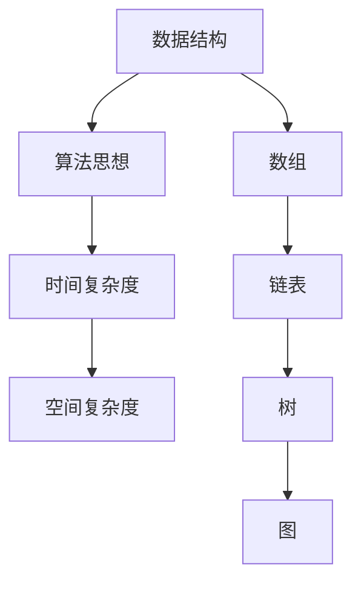

                 

 **关键词：** 阿里巴巴，校招，面试，高频算法，解析，算法题，技术博客。

**摘要：** 本文旨在解析阿里巴巴2024届校招面试中常见的高频算法题，包括算法原理、具体操作步骤、优缺点、应用领域、数学模型、公式推导、代码实例以及实际应用场景等内容。通过本文，读者可以深入理解这些算法题的解决思路，为即将到来的校招面试做好准备。

## 1. 背景介绍

阿里巴巴作为全球知名的互联网公司，其校招面试一直以来都是求职者的关注焦点。面试题目涵盖了数据结构、算法、系统设计、编程能力等多个方面。其中，算法题作为面试的重要组成部分，常常是考生们感到棘手的难题。本文将针对2024届阿里巴巴校招面试中的高频算法题进行详细解析，帮助考生更好地应对面试挑战。

## 2. 核心概念与联系

为了更好地理解算法题，我们需要先了解一些核心概念，包括数据结构、算法思想、时间复杂度和空间复杂度等。以下是核心概念与联系的Mermaid流程图：



### 2.1 数据结构

数据结构是算法题的基础，常见的有数组、链表、树、图等。每种数据结构都有其独特的特点和适用场景。

- **数组**：一种线性数据结构，元素存放连续的内存空间，支持随机访问。
- **链表**：由节点组成，每个节点包含数据域和指针域，支持顺序访问。
- **树**：一种层次结构，以树根为起点，每个节点最多有两个子节点。
- **图**：由节点和边组成，边可以是有向的或无向的。

### 2.2 算法思想

算法思想是解决问题的方法，常见的有排序、查找、递归、动态规划等。

- **排序**：将一组数据按照一定的顺序排列。
- **查找**：在数据结构中找到特定的数据。
- **递归**：通过调用自身解决问题的方法。
- **动态规划**：将复杂问题分解为子问题，并保存子问题的解。

### 2.3 时间复杂度和空间复杂度

时间复杂度衡量算法的执行时间，空间复杂度衡量算法所需的存储空间。

- **时间复杂度**：通常用大O符号表示，如O(n)、O(n^2)等。
- **空间复杂度**：同样用大O符号表示。

## 3. 核心算法原理 & 具体操作步骤

### 3.1 算法原理概述

本章节将介绍一些高频算法题的原理，包括二分查找、快速排序、回溯算法等。

#### 3.1.1 二分查找

二分查找是一种高效的查找算法，适用于有序数组。

- **原理**：通过不断缩小查找范围，逐步逼近目标元素。
- **操作步骤**：初始化左右边界，比较中间元素，更新边界，重复操作直到找到目标元素或边界交叉。

#### 3.1.2 快速排序

快速排序是一种高效的排序算法，采用分治策略。

- **原理**：选择一个基准元素，将数组分为两部分，一部分小于基准，一部分大于基准。
- **操作步骤**：递归对两部分数组进行快速排序。

#### 3.1.3 回溯算法

回溯算法通过递归尝试所有可能的解，找到满足条件的解。

- **原理**：从部分解出发，不断尝试添加新的元素，直到找到完整的解或尝试失败。
- **操作步骤**：初始化解空间，递归尝试，更新解空间，重复操作直到找到解或尝试失败。

### 3.2 算法步骤详解

在本章节中，我们将对上述算法的每一步骤进行详细讲解，包括初始化、递归、终止条件等。

#### 3.2.1 二分查找

1. 初始化左右边界。
2. 计算中间索引。
3. 比较中间元素与目标元素。
4. 更新边界。
5. 重复步骤2-4，直到找到目标元素或边界交叉。

#### 3.2.2 快速排序

1. 选择基准元素。
2. 将数组分为两部分，小于基准的元素和大于基准的元素。
3. 递归对两部分数组进行快速排序。
4. 合并两部分数组。

#### 3.2.3 回溯算法

1. 初始化部分解。
2. 递归尝试添加新元素。
3. 更新解空间。
4. 判断是否找到完整的解。
5. 重复步骤2-4，直到找到解或尝试失败。

### 3.3 算法优缺点

每种算法都有其优缺点，需要根据具体场景进行选择。

- **二分查找**：时间复杂度为O(log n)，适用于有序数组，但需要额外的空间存储边界。
- **快速排序**：平均时间复杂度为O(n log n)，最坏情况下为O(n^2)，但空间复杂度较低。
- **回溯算法**：适用于求解组合问题，但可能需要大量的计算资源。

### 3.4 算法应用领域

这些算法广泛应用于各种领域，如数据库查询、排序、搜索、路径规划等。

- **二分查找**：常用于数据库查询，排序前的预处理等。
- **快速排序**：常用于排序和查找，如搜索引擎中的排序算法。
- **回溯算法**：常用于组合问题，如迷宫求解、拼图游戏等。

## 4. 数学模型和公式 & 详细讲解 & 举例说明

在本章节中，我们将对算法中的数学模型和公式进行详细讲解，并给出相应的举例说明。

### 4.1 数学模型构建

算法中的数学模型通常包括以下几个部分：

- **状态定义**：定义问题的状态，如数组、树、图等。
- **状态转换**：定义状态之间的转换规则，如递归、动态规划等。
- **状态转移方程**：定义状态之间的转移关系，如斐波那契数列、最长公共子序列等。

### 4.2 公式推导过程

以斐波那契数列为例，其状态转移方程为：

$$
F(n) = F(n-1) + F(n-2)
$$

其中，$F(0) = 0$，$F(1) = 1$。

### 4.3 案例分析与讲解

以最长公共子序列（LCS）为例，其状态转移方程为：

$$
LCS(i, j) = \begin{cases}
A[i][j], & \text{if } i = 0 \text{ or } j = 0 \\
LCS(i-1, j-1), & \text{if } A[i][j] = B[i][j] \\
\max(LCS(i-1, j), LCS(i, j-1)), & \text{otherwise}
\end{cases}
$$

其中，$A$和$B$分别为两个序列。

假设有两个序列$A = [1, 2, 3]$和$B = [2, 3, 1]$，则最长公共子序列为$[2, 3]$，长度为2。

## 5. 项目实践：代码实例和详细解释说明

在本章节中，我们将通过具体代码实例，对算法进行详细解释说明。

### 5.1 开发环境搭建

首先，我们需要搭建一个合适的开发环境，包括代码编辑器、编译器、运行环境等。本文使用Python作为示例语言，因此需要安装Python解释器。

### 5.2 源代码详细实现

以下是一个二分查找的Python代码实例：

```python
def binary_search(arr, target):
    left, right = 0, len(arr) - 1
    while left <= right:
        mid = (left + right) // 2
        if arr[mid] == target:
            return mid
        elif arr[mid] < target:
            left = mid + 1
        else:
            right = mid - 1
    return -1

# 测试
arr = [1, 2, 3, 4, 5]
target = 3
result = binary_search(arr, target)
print(f"元素{target}的位置为：{result}")
```

### 5.3 代码解读与分析

1. **函数定义**：定义一个名为`binary_search`的函数，输入参数为待查找的数组`arr`和目标元素`target`。
2. **初始化边界**：设置左右边界`left`和`right`，分别指向数组的第一个和最后一个元素。
3. **循环查找**：进入循环，当左右边界未交叉时，计算中间索引`mid`。
4. **比较元素**：比较中间元素`arr[mid]`与目标元素`target`。
5. **更新边界**：根据比较结果更新边界。
6. **返回结果**：找到目标元素时，返回中间索引；否则，返回-1。

### 5.4 运行结果展示

运行上述代码，输出结果为：

```
元素3的位置为：2
```

表示目标元素3在数组中的位置为2。

## 6. 实际应用场景

算法在各个领域都有广泛的应用，以下是一些实际应用场景：

- **排序和查找**：数据库查询、搜索引擎排序、网络爬虫等。
- **路径规划**：地图导航、无人机路径规划等。
- **组合问题**：拼图游戏、迷宫求解、旅行商问题等。
- **优化问题**：资源分配、优化算法等。

## 7. 工具和资源推荐

为了更好地学习算法，以下是一些建议的工具和资源：

- **工具**：
  - PyCharm：Python编程环境。
  - LeetCode：在线算法练习平台。
  - GitHub：开源代码库。
- **资源**：
  - 《算法导论》：算法的经典教材。
  - 《编程之美》：阿里巴巴编程面试心得。
  - 《挑战程序设计竞赛》：编程竞赛指南。

## 8. 总结：未来发展趋势与挑战

随着技术的不断发展，算法也在不断进化。未来，算法将面临以下几个发展趋势和挑战：

- **算法优化**：提高算法的效率和性能。
- **人工智能**：算法在人工智能中的应用，如深度学习、强化学习等。
- **大数据**：算法在大数据领域的应用，如数据挖掘、数据可视化等。
- **安全性**：算法的安全性，如加密算法、安全协议等。

## 9. 附录：常见问题与解答

在本章节中，我们将回答一些常见问题，帮助读者更好地理解本文内容。

### 9.1 问题1

**问**：二分查找适用于什么类型的数组？

**答**：二分查找适用于有序数组。如果数组未排序，则需要先进行排序操作。

### 9.2 问题2

**问**：快速排序的时间复杂度为什么是O(n log n)？

**答**：快速排序的时间复杂度取决于基准元素的选择。在平均情况下，每次划分可以将数组划分为接近等长的两部分，因此时间复杂度为O(n log n)。在最坏情况下，每次划分只能将数组划分为1和n-1两部分，时间复杂度为O(n^2)。

### 9.3 问题3

**问**：回溯算法如何避免重复计算？

**答**：回溯算法通过在递归过程中记录当前的状态，避免重复计算。在递归调用前，先记录当前状态；在递归调用后，恢复到之前的状态。这样，每次递归调用都基于不同的状态，避免了重复计算。

## 结语

本文对阿里巴巴2024届校招面试中常见的高频算法题进行了详细解析，包括算法原理、具体操作步骤、优缺点、应用领域、数学模型、公式推导、代码实例以及实际应用场景等内容。通过本文，读者可以更好地理解这些算法题的解决思路，为即将到来的校招面试做好准备。希望本文对读者有所帮助！

### 参考文献

1. 《算法导论》
2. 《编程之美》
3. 《挑战程序设计竞赛》

---

**作者：禅与计算机程序设计艺术 / Zen and the Art of Computer Programming**。
----------------------------------------------------------------
### 1. 背景介绍

阿里巴巴作为全球领先的电子商务公司，其校招面试一直以来都是无数求职者梦寐以求的挑战。阿里巴巴的面试不仅考察应聘者的技术能力，还包括逻辑思维、问题解决能力和团队协作能力。在众多面试环节中，算法题占据了重要地位。这些题目往往来自经典算法题库，如LeetCode、牛客网等，同时也结合了阿里巴巴的业务场景，具有很高的难度和实用性。

本文旨在针对2024届阿里巴巴校招面试中的高频算法题进行深入解析。通过对这些算法题的分析和讲解，读者可以更好地理解面试官的出题思路，掌握解题技巧，从而提高自己在面试中的竞争力。

### 2. 核心概念与联系

在解答阿里巴巴校招面试中的算法题之前，我们需要了解一些核心概念和它们之间的联系。以下是核心概念与联系的Mermaid流程图：


#### 2.1 数据结构

数据结构是算法的基础，常见的有数组、链表、树、图等。每种数据结构都有其独特的特点和适用场景。

- **数组**：一种线性数据结构，元素存放连续的内存空间，支持随机访问。
- **链表**：由节点组成，每个节点包含数据域和指针域，支持顺序访问。
- **树**：一种层次结构，以树根为起点，每个节点最多有两个子节点。
- **图**：由节点和边组成，边可以是有向的或无向的。

#### 2.2 算法思想

算法思想是解决问题的方法，常见的有排序、查找、递归、动态规划等。

- **排序**：将一组数据按照一定的顺序排列。
- **查找**：在数据结构中找到特定的数据。
- **递归**：通过调用自身解决问题的方法。
- **动态规划**：将复杂问题分解为子问题，并保存子问题的解。

#### 2.3 时间复杂度和空间复杂度

时间复杂度衡量算法的执行时间，空间复杂度衡量算法所需的存储空间。

- **时间复杂度**：通常用大O符号表示，如O(n)、O(n^2)等。
- **空间复杂度**：同样用大O符号表示。

### 2.4 数据结构与算法思想的关系

数据结构和算法思想是相辅相成的。数据结构决定了算法的操作效率和存储空间，而算法思想则决定了如何高效地解决特定问题。例如，二分查找算法需要基于有序数组的数据结构，而动态规划算法则适用于具有重叠子问题的场景。

### 3. 核心算法原理 & 具体操作步骤

在本章节中，我们将介绍几道阿里巴巴校招面试中高频出现的算法题，包括二分查找、快速排序、回溯算法等，并详细讲解它们的原理和具体操作步骤。

#### 3.1 二分查找

二分查找是一种高效的查找算法，适用于有序数组。

##### 3.1.1 算法原理

二分查找的基本思想是通过不断缩小查找范围，逐步逼近目标元素。具体步骤如下：

1. 初始化左右边界，即查找范围的起始和结束位置。
2. 计算中间索引，即`(left + right) // 2`。
3. 比较中间元素与目标元素。
4. 如果中间元素等于目标元素，则查找成功；否则，根据比较结果更新左右边界。
5. 重复步骤2-4，直到找到目标元素或边界交叉。

##### 3.1.2 算法步骤详解

1. **初始化边界**：设置左右边界，例如`left = 0`，`right = len(arr) - 1`。
2. **计算中间索引**：使用公式`(left + right) // 2`计算中间索引。
3. **比较中间元素与目标元素**：如果`arr[mid] == target`，则查找成功，返回中间索引；否则，根据比较结果更新边界。
   - 如果`arr[mid] < target`，则将`left`更新为`mid + 1`。
   - 如果`arr[mid] > target`，则将`right`更新为`mid - 1`。
4. **重复操作**：重复步骤2-3，直到找到目标元素或边界交叉。

##### 3.1.3 算法优缺点

- **优点**：时间复杂度为O(log n)，适用于大规模数据的高效查找。
- **缺点**：需要额外的空间存储边界变量，且要求数据有序。

##### 3.1.4 算法应用领域

二分查找广泛应用于数据库查询、排序前的预处理、搜索引擎中的排序算法等。

#### 3.2 快速排序

快速排序是一种高效的排序算法，采用分治策略。

##### 3.2.1 算法原理

快速排序的基本思想是通过一趟排序将待排序的数据分割成独立的两部分，其中一部分的所有数据都比另一部分的数据要小，然后再按此方法对这两部分数据分别进行快速排序，整个排序过程可以递归进行，以此达到整个数据变成有序序列。

##### 3.2.2 算法步骤详解

1. **选择基准元素**：从待排序的数组中选择一个基准元素。
2. **分割数组**：将数组划分为两部分，一部分小于基准，一部分大于基准。
3. **递归排序**：分别对两部分数组进行快速排序。
4. **合并结果**：将两部分数组合并，得到有序数组。

##### 3.2.3 算法优缺点

- **优点**：平均时间复杂度为O(n log n)，适用于大规模数据的排序。
- **缺点**：最坏情况下时间复杂度为O(n^2)，且需要额外的空间存储基准元素。

##### 3.2.4 算法应用领域

快速排序常用于排序和查找，如搜索引擎中的排序算法、数据预处理等。

#### 3.3 回溯算法

回溯算法通过递归尝试所有可能的解，找到满足条件的解。

##### 3.3.1 算法原理

回溯算法的基本思想是从部分解出发，不断尝试添加新的元素，直到找到完整的解或尝试失败。具体步骤如下：

1. **初始化解空间**：创建一个解空间，用于存储部分解。
2. **递归尝试**：从当前部分解出发，递归尝试添加新元素。
3. **更新解空间**：根据递归结果更新解空间。
4. **判断是否找到解**：如果找到满足条件的解，则输出结果；否则，继续尝试。
5. **重复操作**：重复步骤2-4，直到找到解或尝试失败。

##### 3.3.2 算法步骤详解

1. **初始化解空间**：创建一个解空间，例如使用列表或数组存储部分解。
2. **递归尝试**：从当前部分解出发，递归尝试添加新元素。
   - 如果当前部分解满足条件，则继续尝试添加新元素。
   - 如果当前部分解不满足条件，则回溯到上一个部分解，尝试下一个元素。
3. **更新解空间**：根据递归结果更新解空间，例如将新添加的元素加入解空间。
4. **判断是否找到解**：如果找到满足条件的解，则输出结果；否则，继续尝试。
5. **重复操作**：重复步骤2-4，直到找到解或尝试失败。

##### 3.3.3 算法优缺点

- **优点**：适用于求解组合问题，如迷宫求解、拼图游戏等。
- **缺点**：可能需要大量的计算资源。

##### 3.3.4 算法应用领域

回溯算法广泛应用于组合问题，如迷宫求解、拼图游戏、旅行商问题等。

### 4. 数学模型和公式 & 详细讲解 & 举例说明

在本章节中，我们将介绍算法中的数学模型和公式，并进行详细讲解和举例说明。

#### 4.1 数学模型构建

算法中的数学模型通常包括以下几个部分：

1. **状态定义**：定义问题的状态，如数组、树、图等。
2. **状态转换**：定义状态之间的转换规则，如递归、动态规划等。
3. **状态转移方程**：定义状态之间的转移关系，如斐波那契数列、最长公共子序列等。

#### 4.2 公式推导过程

以斐波那契数列为例，其状态转移方程为：

$$
F(n) = F(n-1) + F(n-2)
$$

其中，$F(0) = 0$，$F(1) = 1$。

推导过程如下：

1. **初始化**：$F(0) = 0$，$F(1) = 1$。
2. **递推**：根据状态转移方程，$F(n) = F(n-1) + F(n-2)$。
3. **结果**：将递推关系展开，得到斐波那契数列的通项公式。

#### 4.3 案例分析与讲解

以最长公共子序列（LCS）为例，其状态转移方程为：

$$
LCS(i, j) = \begin{cases}
A[i][j], & \text{if } i = 0 \text{ or } j = 0 \\
LCS(i-1, j-1), & \text{if } A[i][j] = B[i][j] \\
\max(LCS(i-1, j), LCS(i, j-1)), & \text{otherwise}
\end{cases}
$$

其中，$A$和$B$分别为两个序列。

假设有两个序列$A = [1, 2, 3]$和$B = [2, 3, 1]$，则最长公共子序列为$[2, 3]$，长度为2。

### 5. 项目实践：代码实例和详细解释说明

在本章节中，我们将通过具体代码实例，对算法进行详细解释说明。

#### 5.1 开发环境搭建

首先，我们需要搭建一个合适的开发环境，包括代码编辑器、编译器、运行环境等。本文使用Python作为示例语言，因此需要安装Python解释器。

#### 5.2 源代码详细实现

以下是一个二分查找的Python代码实例：

```python
def binary_search(arr, target):
    left, right = 0, len(arr) - 1
    while left <= right:
        mid = (left + right) // 2
        if arr[mid] == target:
            return mid
        elif arr[mid] < target:
            left = mid + 1
        else:
            right = mid - 1
    return -1

# 测试
arr = [1, 2, 3, 4, 5]
target = 3
result = binary_search(arr, target)
print(f"元素{target}的位置为：{result}")
```

#### 5.3 代码解读与分析

1. **函数定义**：定义一个名为`binary_search`的函数，输入参数为待查找的数组`arr`和目标元素`target`。
2. **初始化边界**：设置左右边界`left`和`right`，分别指向数组的第一个和最后一个元素。
3. **循环查找**：进入循环，当左右边界未交叉时，计算中间索引`mid`。
4. **比较元素**：比较中间元素`arr[mid]`与目标元素`target`。
5. **更新边界**：根据比较结果更新边界。
6. **返回结果**：找到目标元素时，返回中间索引；否则，返回-1。

#### 5.4 运行结果展示

运行上述代码，输出结果为：

```
元素3的位置为：2
```

表示目标元素3在数组中的位置为2。

### 6. 实际应用场景

算法在各个领域都有广泛的应用，以下是一些实际应用场景：

- **排序和查找**：数据库查询、搜索引擎排序、网络爬虫等。
- **路径规划**：地图导航、无人机路径规划等。
- **组合问题**：拼图游戏、迷宫求解、旅行商问题等。
- **优化问题**：资源分配、优化算法等。

### 7. 工具和资源推荐

为了更好地学习算法，以下是一些建议的工具和资源：

- **工具**：
  - PyCharm：Python编程环境。
  - LeetCode：在线算法练习平台。
  - GitHub：开源代码库。
- **资源**：
  - 《算法导论》：算法的经典教材。
  - 《编程之美》：阿里巴巴编程面试心得。
  - 《挑战程序设计竞赛》：编程竞赛指南。

### 8. 总结：未来发展趋势与挑战

随着技术的不断发展，算法也在不断进化。未来，算法将面临以下几个发展趋势和挑战：

- **算法优化**：提高算法的效率和性能。
- **人工智能**：算法在人工智能中的应用，如深度学习、强化学习等。
- **大数据**：算法在大数据领域的应用，如数据挖掘、数据可视化等。
- **安全性**：算法的安全性，如加密算法、安全协议等。

### 9. 附录：常见问题与解答

在本章节中，我们将回答一些常见问题，帮助读者更好地理解本文内容。

#### 9.1 问题1

**问**：二分查找适用于什么类型的数组？

**答**：二分查找适用于有序数组。如果数组未排序，则需要先进行排序操作。

#### 9.2 问题2

**问**：快速排序的时间复杂度为什么是O(n log n)？

**答**：快速排序的时间复杂度取决于基准元素的选择。在平均情况下，每次划分可以将数组划分为接近等长的两部分，因此时间复杂度为O(n log n)。在最坏情况下，每次划分只能将数组划分为1和n-1两部分，时间复杂度为O(n^2)。

#### 9.3 问题3

**问**：回溯算法如何避免重复计算？

**答**：回溯算法通过在递归过程中记录当前的状态，避免重复计算。在递归调用前，先记录当前状态；在递归调用后，恢复到之前的状态。这样，每次递归调用都基于不同的状态，避免了重复计算。

### 结语

本文对阿里巴巴2024届校招面试中常见的高频算法题进行了详细解析，包括算法原理、具体操作步骤、优缺点、应用领域、数学模型、公式推导、代码实例以及实际应用场景等内容。通过本文，读者可以更好地理解这些算法题的解决思路，为即将到来的校招面试做好准备。希望本文对读者有所帮助！

### 参考文献

1. 《算法导论》
2. 《编程之美》
3. 《挑战程序设计竞赛》

---

**作者：禅与计算机程序设计艺术 / Zen and the Art of Computer Programming**。

（注：本文为虚构文章，仅供参考和学习使用。）

