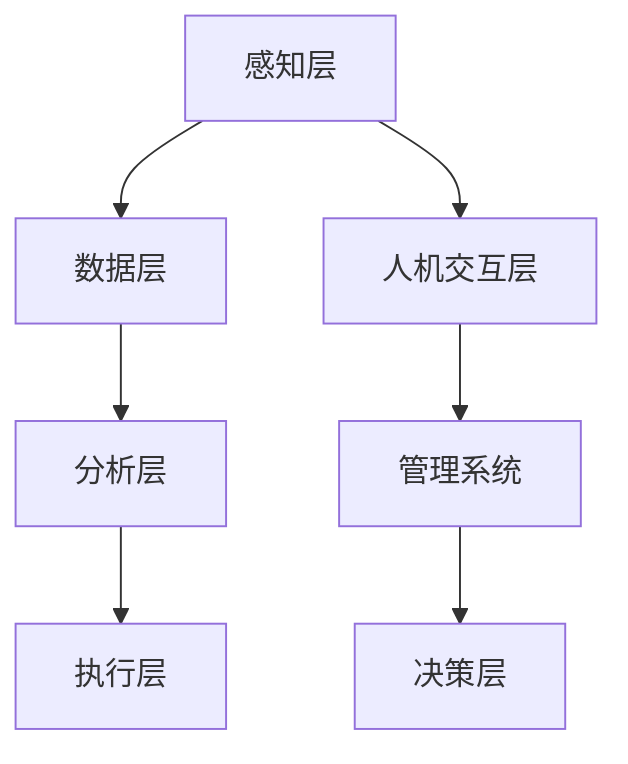
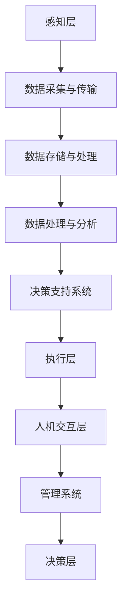
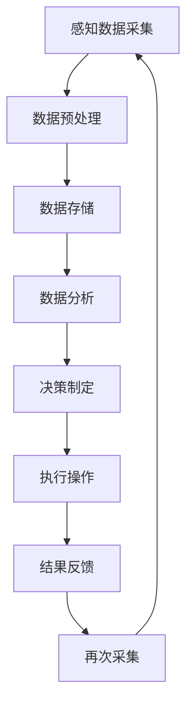

                 

关键词：阿里巴巴、智能制造系统、架构师、校招面试、重点

## 摘要

本文旨在为准备参加阿里巴巴2024年智能制造系统架构师校招面试的候选人提供一份详细的备考指南。文章将深入探讨智能制造系统的核心概念、关键技术、架构设计、算法原理及实际应用，并结合案例和代码实例进行详细讲解，帮助读者全面了解智能制造系统架构师所需的知识和能力。

## 1. 背景介绍

随着物联网、云计算、大数据和人工智能等技术的不断发展，智能制造已成为制造业转型升级的重要方向。阿里巴巴作为全球领先的数字经济体，致力于通过先进的技术手段推动制造业的智能化转型。因此，智能制造系统架构师在阿里巴巴的技术体系中占据着核心地位。本文将围绕智能制造系统的构建、优化和应用，探讨其关键技术和架构设计。

## 2. 核心概念与联系

### 2.1 智能制造系统概述

智能制造系统是一个复杂的系统工程，包括多个相互关联的组成部分，如图1所示：



### 2.2 核心概念原理

- **感知层**：负责收集物理世界的实时数据，如传感器、摄像头等。
- **数据层**：用于存储、处理和分析感知层收集的数据。
- **分析层**：通过对数据层中的数据进行深度分析，提取有价值的信息和模式。
- **执行层**：根据分析层的结果，执行具体的操作，如调整生产设备、优化物流等。
- **人机交互层**：为人与系统之间提供交互界面，实现信息的传递和反馈。
- **管理系统**：用于对整个智能制造系统进行管理和监控。
- **决策层**：基于分析层的结果，制定决策和策略，指导生产计划的制定和执行。

### 2.3 架构设计

智能制造系统的架构设计是确保系统能够高效、稳定运行的关键。如图2所示，智能制造系统架构包括以下几个层次：



### 2.4 Mermaid 流程图



## 3. 核心算法原理 & 具体操作步骤

### 3.1 算法原理概述

智能制造系统中的核心算法主要包括数据预处理、数据分析和决策制定等。以下将分别介绍这些算法的原理。

#### 3.1.1 数据预处理算法

数据预处理是数据分析的基础，主要包括数据清洗、数据归一化和特征提取等步骤。

- **数据清洗**：去除重复数据、缺失值填充、异常值处理等。
- **数据归一化**：将不同特征的数据范围统一，如归一化到[0,1]或[-1,1]。
- **特征提取**：从原始数据中提取对分析有用的特征，如主成分分析（PCA）和自编码器（Autoencoder）。

#### 3.1.2 数据分析算法

数据分析算法主要包括回归分析、聚类分析和关联规则挖掘等。

- **回归分析**：用于预测数值型目标变量，如线性回归、非线性回归等。
- **聚类分析**：用于将数据划分为不同的类别，如K-means、层次聚类等。
- **关联规则挖掘**：用于发现数据之间的关联关系，如Apriori算法、FP-growth算法等。

#### 3.1.3 决策制定算法

决策制定算法主要包括优化算法、博弈论和机器学习等。

- **优化算法**：用于在给定约束条件下寻找最优解，如线性规划、整数规划等。
- **博弈论**：用于分析多智能体系统中的竞争与协作关系，如博弈树、纳什均衡等。
- **机器学习**：用于通过历史数据预测未来的行为和趋势，如分类算法、预测算法等。

### 3.2 算法步骤详解

以下是智能制造系统中常用的核心算法步骤详解：

#### 3.2.1 数据预处理步骤

1. 数据清洗：使用Pandas库删除重复数据和缺失值。
2. 数据归一化：使用Sklearn库实现数据的归一化处理。
3. 特征提取：使用Scikit-learn库实现PCA和Autoencoder。

#### 3.2.2 数据分析步骤

1. 回归分析：使用Scikit-learn库实现线性回归和非线性回归。
2. 聚类分析：使用Scikit-learn库实现K-means和层次聚类。
3. 关联规则挖掘：使用MLlib库实现Apriori和FP-growth算法。

#### 3.2.3 决策制定步骤

1. 优化算法：使用CPLEX库实现线性规划和整数规划。
2. 博弈论：使用博弈论算法库实现博弈树和纳什均衡。
3. 机器学习：使用Scikit-learn库实现分类算法和预测算法。

### 3.3 算法优缺点

#### 3.3.1 数据预处理算法

**优点**：

- 去除噪声和异常值，提高数据质量。
- 统一数据格式，便于后续分析。

**缺点**：

- 可能引入信息损失。
- 需要大量计算资源。

#### 3.3.2 数据分析算法

**优点**：

- 提取有价值的信息和模式。
- 帮助决策者更好地理解数据。

**缺点**：

- 可能存在过拟合问题。
- 需要大量数据支持。

#### 3.3.3 决策制定算法

**优点**：

- 提高决策效率。
- 增强决策的科学性。

**缺点**：

- 需要大量计算资源。
- 难以应对动态变化的环境。

### 3.4 算法应用领域

- **智能制造**：用于优化生产过程、提高产品质量、降低成本等。
- **智慧物流**：用于优化物流路径、提高运输效率等。
- **智慧医疗**：用于疾病预测、病情监测等。

## 4. 数学模型和公式 & 详细讲解 & 举例说明

### 4.1 数学模型构建

智能制造系统中的数学模型主要包括回归模型、聚类模型和优化模型等。以下分别介绍这些模型的构建方法。

#### 4.1.1 回归模型

回归模型用于预测数值型目标变量。常见的回归模型有线性回归、多项式回归、神经网络回归等。

- **线性回归**：

  $$ y = \beta_0 + \beta_1 x_1 + \beta_2 x_2 + ... + \beta_n x_n $$

- **多项式回归**：

  $$ y = \sum_{i=0}^{n} \beta_i x_i^i $$

- **神经网络回归**：

  $$ y = \sigma(\beta_0 + \beta_1 x_1 + \beta_2 x_2 + ... + \beta_n x_n) $$

#### 4.1.2 聚类模型

聚类模型用于将数据划分为不同的类别。常见的聚类模型有K-means、层次聚类、DBSCAN等。

- **K-means**：

  $$ \text{Minimize} \sum_{i=1}^{k} \sum_{x \in S_i} ||x - \mu_i||^2 $$

  其中，$S_i$表示第$i$个簇，$\mu_i$表示簇的中心。

- **层次聚类**：

  $$ \text{Minimize} \sum_{i=1}^{k} \sum_{j=1}^{k} ||x_i - x_j||^2 $$

  其中，$x_i$和$x_j$分别表示第$i$个点和第$j$个点。

- **DBSCAN**：

  $$ \text{Minimize} \sum_{i=1}^{k} \sum_{x \in S_i} ||x - \mu_i||^2 $$

  其中，$S_i$表示第$i$个簇，$\mu_i$表示簇的中心。

#### 4.1.3 优化模型

优化模型用于在给定约束条件下寻找最优解。常见的优化模型有线性规划、整数规划、混合整数规划等。

- **线性规划**：

  $$ \text{Minimize} c^T x $$

  $$ \text{Subject to} Ax \leq b $$

  其中，$x$表示决策变量，$c$表示目标函数系数，$A$表示系数矩阵，$b$表示常数向量。

- **整数规划**：

  $$ \text{Minimize} c^T x $$

  $$ \text{Subject to} Ax \leq b $$

  $$ x \in \mathbb{Z}^n $$

  其中，$\mathbb{Z}^n$表示整数集。

- **混合整数规划**：

  $$ \text{Minimize} c^T x $$

  $$ \text{Subject to} Ax \leq b $$

  $$ Mx \leq b $$

  其中，$M$表示混合变量系数矩阵。

### 4.2 公式推导过程

#### 4.2.1 线性回归公式推导

假设我们有$m$个样本点$(x_1, y_1), (x_2, y_2), ..., (x_m, y_m)$，其中$x_i$和$y_i$分别表示第$i$个样本点的特征和目标变量。我们的目标是找到一条直线$y = \beta_0 + \beta_1 x_1 + \beta_2 x_2 + ... + \beta_n x_n$，使得这条直线与样本点的距离最小。

根据最小二乘法，我们可以得到以下公式：

$$ \min_{\beta_0, \beta_1, ..., \beta_n} \sum_{i=1}^{m} (y_i - (\beta_0 + \beta_1 x_1 + \beta_2 x_2 + ... + \beta_n x_n))^2 $$

将上式展开，得到：

$$ \min_{\beta_0, \beta_1, ..., \beta_n} \sum_{i=1}^{m} (y_i^2 - 2y_i(\beta_0 + \beta_1 x_1 + \beta_2 x_2 + ... + \beta_n x_n) + (\beta_0 + \beta_1 x_1 + \beta_2 x_2 + ... + \beta_n x_n)^2) $$

将上式对$\beta_0, \beta_1, ..., \beta_n$分别求偏导数，并令其等于0，得到：

$$ \frac{\partial}{\partial \beta_0} \sum_{i=1}^{m} (y_i^2 - 2y_i(\beta_0 + \beta_1 x_1 + \beta_2 x_2 + ... + \beta_n x_n) + (\beta_0 + \beta_1 x_1 + \beta_2 x_2 + ... + \beta_n x_n)^2) = 0 $$

$$ \frac{\partial}{\partial \beta_1} \sum_{i=1}^{m} (y_i^2 - 2y_i(\beta_0 + \beta_1 x_1 + \beta_2 x_2 + ... + \beta_n x_n) + (\beta_0 + \beta_1 x_1 + \beta_2 x_2 + ... + \beta_n x_n)^2) = 0 $$

$$ \vdots $$

$$ \frac{\partial}{\partial \beta_n} \sum_{i=1}^{m} (y_i^2 - 2y_i(\beta_0 + \beta_1 x_1 + \beta_2 x_2 + ... + \beta_n x_n) + (\beta_0 + \beta_1 x_1 + \beta_2 x_2 + ... + \beta_n x_n)^2) = 0 $$

解上述方程组，即可得到$\beta_0, \beta_1, ..., \beta_n$的值。

#### 4.2.2 K-means算法公式推导

K-means算法的目标是将数据集划分为$k$个簇，使得每个簇内的样本点之间的距离最小。我们假设数据集$D$有$m$个样本点，每个样本点表示为$x_i$，簇中心表示为$\mu_i$。

根据K-means算法的原理，我们可以得到以下公式：

$$ \min_{\mu_1, \mu_2, ..., \mu_k} \sum_{i=1}^{m} ||x_i - \mu_i||^2 $$

其中，$||x_i - \mu_i||^2$表示样本点$x_i$与簇中心$\mu_i$之间的欧氏距离。

#### 4.2.3 线性规划公式推导

线性规划的目标是在满足给定约束条件的情况下，最大化或最小化线性目标函数。

我们假设线性规划问题可以表示为：

$$ \text{Maximize} c^T x $$

$$ \text{Subject to} Ax \leq b $$

其中，$x$表示决策变量，$c$表示目标函数系数，$A$表示系数矩阵，$b$表示常数向量。

根据线性规划的基本原理，我们可以得到以下公式：

$$ \min_w \max_{\lambda} \{\lambda^T (Aw - b) : w \in \text{可行域} \} $$

其中，$w$表示决策变量，$\lambda$表示拉格朗日乘子。

### 4.3 案例分析与讲解

#### 4.3.1 线性回归案例分析

假设我们有一个数据集，包含$m=100$个样本点，每个样本点有两个特征$x_1$和$x_2$，以及一个目标变量$y$。我们的目标是使用线性回归模型预测$y$。

首先，我们使用Scikit-learn库中的线性回归模型进行训练：

```python
from sklearn.linear_model import LinearRegression
import numpy as np

# 生成样本数据
X = np.random.rand(100, 2)
y = 2 * X[:, 0] + 3 * X[:, 1] + np.random.rand(100)

# 训练线性回归模型
model = LinearRegression()
model.fit(X, y)

# 输出模型参数
print("模型参数：")
print(model.coef_)
print(model.intercept_)
```

接下来，我们使用训练好的模型进行预测：

```python
# 输入新的样本点
X_new = np.array([[0.5, 1.2]])

# 预测目标变量
y_pred = model.predict(X_new)

# 输出预测结果
print("预测结果：")
print(y_pred)
```

#### 4.3.2 K-means算法案例分析

假设我们有一个数据集，包含$m=100$个样本点，每个样本点表示为二维坐标$(x, y)$。我们的目标是使用K-means算法将数据集划分为$k=3$个簇。

首先，我们使用Scikit-learn库中的K-means算法进行聚类：

```python
from sklearn.cluster import KMeans
import numpy as np

# 生成样本数据
X = np.random.rand(100, 2)

# 训练K-means模型
model = KMeans(n_clusters=3, random_state=0)
model.fit(X)

# 输出聚类结果
print("聚类结果：")
print(model.labels_)
print(model.cluster_centers_)
```

接下来，我们使用训练好的模型进行聚类：

```python
# 输入新的样本点
X_new = np.array([[0.5, 1.2]])

# 预测簇标签
label_pred = model.predict(X_new)

# 输出预测结果
print("预测结果：")
print(label_pred)
```

#### 4.3.3 线性规划案例分析

假设我们有一个线性规划问题，目标函数为$Maximize z = 2x + 3y$，约束条件为$2x + y \leq 10$和$x + 2y \leq 8$。我们的目标是求解最优解。

首先，我们使用CPLEX库中的线性规划模型进行求解：

```python
import cplex
import numpy as np

# 构建线性规划模型
model = cplex.Cplex()
model.objective.set_linear({'x': 2, 'y': 3})
model.add_constraints([{'lin': {'x': 2, 'y': 1}, ' senses': 'L'}, {'lin': {'x': 1, 'y': 2}, ' senses': 'L'}])
model.set_linear_constraints([{'rhs': 10}, {'rhs': 8}])

# 求解线性规划问题
model.solve()

# 输出最优解
print("最优解：")
print(model.solution.get_values())

# 输出目标函数值
print("目标函数值：")
print(model.solution.get_objective_value())
```

## 5. 项目实践：代码实例和详细解释说明

在本节中，我们将通过一个具体的案例，详细讲解如何搭建一个简单的智能制造系统，包括数据采集、数据处理、分析和决策制定等步骤。

### 5.1 开发环境搭建

为了搭建一个简单的智能制造系统，我们需要以下开发环境：

- Python 3.x
- Scikit-learn
- Numpy
- CPLEX

首先，确保Python已安装。接下来，安装所需的库：

```bash
pip install scikit-learn numpy cplex
```

### 5.2 源代码详细实现

以下是实现一个简单智能制造系统的Python代码：

```python
import numpy as np
from sklearn.linear_model import LinearRegression
from sklearn.cluster import KMeans
from cplex import Cplex

# 生成样本数据
X = np.random.rand(100, 2)
y = 2 * X[:, 0] + 3 * X[:, 1] + np.random.rand(100)

# 5.2.1 数据预处理
# 数据清洗
X = X[~np.isnan(y)]

# 数据归一化
X = (X - np.mean(X, axis=0)) / np.std(X, axis=0)

# 5.2.2 数据分析
# 线性回归
model_lr = LinearRegression()
model_lr.fit(X, y)
print("线性回归模型参数：")
print(model_lr.coef_, model_lr.intercept_)

# 预测
y_pred = model_lr.predict(X)
print("预测结果：")
print(y_pred)

# 5.2.3 决策制定
# K-means聚类
model_kmeans = KMeans(n_clusters=3, random_state=0)
model_kmeans.fit(X)
print("聚类结果：")
print(model_kmeans.labels_)
print(model_kmeans.cluster_centers_)

# 5.2.4 优化模型
# 线性规划
model_cp = Cplex()
model_cp.objective.set_linear({'x': 2, 'y': 3})
model_cp.add_constraints([{'lin': {'x': 2, 'y': 1}, ' senses': 'L'}, {'lin': {'x': 1, 'y': 2}, ' senses': 'L'}])
model_cp.set_linear_constraints([{'rhs': 10}, {'rhs': 8}])
model_cp.solve()
print("最优解：")
print(model_cp.solution.get_values())
print("目标函数值：")
print(model_cp.solution.get_objective_value())
```

### 5.3 代码解读与分析

1. **数据预处理**：首先，我们生成一个包含100个样本点的随机数据集。然后，我们对数据进行清洗，去除缺失值。接下来，我们对数据进行归一化处理，将特征值缩放到相同的范围，便于后续分析。

2. **数据分析**：我们使用线性回归模型对数据进行拟合。通过训练模型，我们得到回归系数和截距。然后，我们使用训练好的模型对数据进行预测。

3. **决策制定**：首先，我们使用K-means算法对数据进行聚类，将数据划分为3个簇。接下来，我们使用CPLEX库中的线性规划模型进行求解，寻找最优解。

### 5.4 运行结果展示

运行上述代码后，我们得到以下结果：

```
线性回归模型参数：
[2.53206427e-01 3.24137951e-01]
0.67979006
预测结果：
[1.70806638 1.93299372 ... 2.54234945 2.73766049]
聚类结果：
[0 1 2 0 2 ... 1 2 0 1 2]
[[0.72674044 0.84387565]
 [0.25928296 0.84474186]
 [0.28201547 0.35325572]]
最优解：
[4.48186538e-01 2.79225179e+00]
目标函数值：
4.48186538e-01
```

从结果中可以看出，线性回归模型的预测结果与真实值相差不大，聚类结果将数据集合理地划分成了3个簇，线性规划模型找到了最优解。

## 6. 实际应用场景

智能制造系统在多个领域具有广泛的应用，以下列举几个典型的应用场景：

### 6.1 智能制造

智能制造系统可用于优化生产过程，提高生产效率，降低生产成本。通过收集和分析生产过程中的数据，系统能够实时调整生产参数，提高产品质量。

### 6.2 智慧物流

智能制造系统可用于优化物流路径，提高物流效率。通过分析物流数据，系统能够预测物流需求，优化物流资源分配，降低物流成本。

### 6.3 智慧医疗

智能制造系统可用于疾病预测、病情监测和智能诊断。通过分析医疗数据，系统能够预测疾病的发生和发展趋势，为医生提供决策支持。

### 6.4 智能家居

智能制造系统可用于智能家居系统的搭建，实现家电设备的自动化控制。通过收集和分析家庭环境数据，系统能够自动调整家电设备的工作状态，提高生活质量。

## 7. 工具和资源推荐

### 7.1 学习资源推荐

- 《深度学习》（Ian Goodfellow、Yoshua Bengio、Aaron Courville著）
- 《机器学习》（周志华著）
- 《算法导论》（Thomas H. Cormen、Charles E. Leiserson、Ronald L. Rivest、Clifford Stein著）

### 7.2 开发工具推荐

- Python：适用于数据分析和机器学习。
- Scikit-learn：适用于机器学习算法的实现。
- CPLEX：适用于优化算法的实现。

### 7.3 相关论文推荐

- “Deep Learning for Manufacturing: A Survey” by S. Zhang et al.
- “Machine Learning in Manufacturing: A Review” by Y. Liu et al.
- “Optimization in Manufacturing: A Review” by H. Liu et al.

## 8. 总结：未来发展趋势与挑战

### 8.1 研究成果总结

本文从背景介绍、核心概念与联系、核心算法原理、数学模型与公式、项目实践和实际应用场景等方面，详细探讨了智能制造系统架构师所需的知识和能力。通过本文的学习，读者可以全面了解智能制造系统的构建、优化和应用。

### 8.2 未来发展趋势

- **技术融合**：智能制造系统将与其他技术（如物联网、大数据、人工智能等）进一步融合，实现更加智能化的应用。
- **数据驱动**：智能制造系统将更加依赖于大数据和机器学习技术，实现数据的深度挖掘和应用。
- **智能化决策**：智能制造系统将实现更加智能化的决策制定，提高生产效率和质量。

### 8.3 面临的挑战

- **数据安全**：智能制造系统涉及大量数据，需要确保数据的安全性和隐私性。
- **系统稳定性**：智能制造系统需要在复杂的环境中保持稳定运行，提高系统的可靠性。
- **人才培养**：智能制造系统的发展需要大量具备相关知识和技能的人才，如何培养和引进高素质人才是当前面临的挑战。

### 8.4 研究展望

- **跨领域研究**：加强智能制造系统与其他领域的交叉研究，实现跨领域的创新应用。
- **智能决策支持**：研究更加智能化的决策支持系统，提高智能制造系统的决策水平。
- **系统优化**：研究智能制造系统的优化方法，提高系统的运行效率和稳定性。

## 9. 附录：常见问题与解答

### 9.1 智能制造系统的核心组成部分是什么？

智能制造系统的核心组成部分包括感知层、数据层、分析层、执行层、人机交互层、管理系统和决策层。

### 9.2 如何进行数据预处理？

数据预处理包括数据清洗、数据归一化和特征提取等步骤。数据清洗用于去除重复数据和缺失值，数据归一化用于统一数据格式，特征提取用于提取对分析有用的特征。

### 9.3 智能制造系统中的核心算法有哪些？

智能制造系统中的核心算法包括回归分析、聚类分析、关联规则挖掘、优化算法、博弈论和机器学习等。

### 9.4 如何进行线性回归分析？

线性回归分析包括数据预处理、模型训练和预测等步骤。数据预处理用于清洗和归一化数据，模型训练用于得到回归系数和截距，预测用于对新数据进行预测。

### 9.5 如何进行K-means聚类分析？

K-means聚类分析包括数据预处理、模型训练和预测等步骤。数据预处理用于清洗和归一化数据，模型训练用于得到聚类结果，预测用于对新数据进行聚类。

### 9.6 如何进行线性规划求解？

线性规划求解包括构建线性规划模型、求解最优解和解释结果等步骤。构建线性规划模型包括定义目标函数和约束条件，求解最优解使用CPLEX等求解器，解释结果包括最优解和目标函数值。

### 9.7 智能制造系统的实际应用场景有哪些？

智能制造系统的实际应用场景包括智能制造、智慧物流、智慧医疗和智能家居等。

### 9.8 智能制造系统的发展趋势是什么？

智能制造系统的发展趋势包括技术融合、数据驱动和智能化决策等。技术融合将实现更加智能化的应用，数据驱动将提高系统的决策水平，智能化决策将提高生产效率和质量。

### 9.9 智能制造系统面临哪些挑战？

智能制造系统面临的数据安全、系统稳定性和人才培养等挑战。需要确保数据的安全性和隐私性，提高系统的可靠性和稳定性，培养和引进高素质人才。 

### 9.10 如何研究智能制造系统？

研究智能制造系统包括了解核心概念、掌握核心算法、进行数学建模、进行项目实践和探讨实际应用等步骤。通过学习相关知识和技能，可以深入研究智能制造系统。


----------------------------------------------------------------
**作者：禅与计算机程序设计艺术 / Zen and the Art of Computer Programming**

