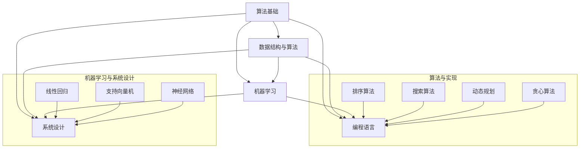

                 

## 1. 背景介绍

在当今社会，人工智能、机器学习、深度学习等技术的快速发展使得算法工程师成为了科技行业的热门职业。各大科技公司，尤其是像阿里巴巴这样的巨头，对算法工程师的需求日益增长。为了选拔出最优秀的算法工程师，这些公司每年都会举行一系列严格的校招面试，其中包含了大量有深度、有挑战性的算法题目。

本文旨在为即将参加阿里巴巴2025届校招的算法工程师们提供一份面试真题解密，帮助他们更好地准备面试，掌握解题技巧。本文将根据2024年阿里巴巴校招算法工程师面试真题，详细解析每一题的解题思路、方法和技巧，同时也会提供一些面试技巧和注意事项，帮助考生在面试中脱颖而出。

## 2. 核心概念与联系

在解答阿里巴巴校招算法工程师面试真题之前，我们首先需要了解一些核心概念和它们之间的关系。以下是一个用Mermaid绘制的流程图，展示了这些核心概念及其相互之间的联系：



### 2.1 算法基础

算法基础是所有算法工程师的必修课。它包括基本算法的原理、实现和应用。算法基础中的核心概念有：

- 排序算法：冒泡排序、选择排序、插入排序、快速排序、归并排序等。
- 搜索算法：顺序搜索、二分搜索、广度优先搜索、深度优先搜索等。
- 动态规划：最短路径问题、背包问题、最优子结构等。
- 贪心算法：硬币找零问题、背包问题、活动选择问题等。

### 2.2 数据结构与算法

数据结构是算法的基础，而算法是对数据结构的操作。常用的数据结构包括：

- 数组
- 链表
- 栈
- 队列
- 树
- 图

对应的算法有：

- 排序算法：快速排序、归并排序、堆排序等。
- 搜索算法：深度优先搜索、广度优先搜索等。
- 回溯算法：解决组合问题、优化问题等。

### 2.3 机器学习

机器学习是当前算法领域的热点。机器学习包括多种算法和模型，如：

- 监督学习：线性回归、支持向量机、决策树、随机森林、神经网络等。
- 无监督学习：聚类、降维、生成模型等。
- 强化学习：Q学习、SARSA、深度Q网络（DQN）等。

### 2.4 编程语言

编程语言是算法工程师的工具，不同的编程语言有其独特的优势和应用场景。常用的编程语言包括：

- C++：适合系统级编程，性能高效。
- Java：适合企业级应用，平台无关性。
- Python：适合数据科学和机器学习，易于开发和维护。
- Golang：适合高并发和网络编程，性能优异。

### 2.5 系统设计

系统设计是算法工程师在面试中经常会遇到的问题。系统设计包括：

- 架构设计：分层架构、微服务架构、分布式架构等。
- 系统优化：性能优化、可伸缩性优化、安全性优化等。
- 系统测试：单元测试、集成测试、压力测试等。

## 3. 核心算法原理 & 具体操作步骤

### 3.1 算法原理概述

在阿里巴巴2024届校招算法工程师面试中，出现了一些典型的算法题目，这些题目通常考察应聘者的算法基础、编程能力以及对算法原理的理解。以下是几道典型的面试题目及其解题原理：

#### 题目1：最长公共子序列（LCS）

**原理**：最长公共子序列问题是典型的动态规划问题，用于找到两个序列的最长公共子序列。动态规划的思想是将问题分解为子问题，并通过子问题的解推导出原问题的解。

**步骤**：

1. 初始化一个二维数组dp，dp[i][j]表示序列A的前i个字符和序列B的前j个字符的最长公共子序列长度。
2. 遍历两个序列的所有字符，根据当前字符是否相同更新dp数组。
3. 根据dp数组得到最长公共子序列。

#### 题目2：二分查找

**原理**：二分查找是一种在有序数组中查找特定元素的搜索算法。其基本思想是通过每次将搜索范围减半来快速找到目标元素。

**步骤**：

1. 初始化low和high指针，分别指向数组的起始和结束位置。
2. 当low <= high时，计算中间位置mid。
3. 如果找到目标元素，返回mid。
4. 如果目标元素小于中间元素，将high指针更新为mid - 1。
5. 如果目标元素大于中间元素，将low指针更新为mid + 1。
6. 最终如果未找到元素，返回-1。

#### 题目3：合并两个有序链表

**原理**：合并两个有序链表是一个常见的算法问题，用于将两个有序链表合并为一个有序链表。

**步骤**：

1. 初始化一个虚拟头节点，作为新链表的起点。
2. 比较两个链表当前节点的值，将较小的值链接到新链表上。
3. 移动被选中的链表的下一个节点。
4. 重复步骤2和3，直到某一个链表到达结尾。
5. 将未到达结尾的链表的剩余部分链接到新链表的尾部。

### 3.2 算法步骤详解

在了解了上述算法的基本原理后，我们进一步详细讲解每个算法的步骤，包括代码实现和运行逻辑。

#### 题目1：最长公共子序列（LCS）

```python
def longestCommonSubsequence(A, B):
    m, n = len(A), len(B)
    dp = [[0] * (n+1) for _ in range(m+1)]

    for i in range(1, m+1):
        for j in range(1, n+1):
            if A[i-1] == B[j-1]:
                dp[i][j] = dp[i-1][j-1] + 1
            else:
                dp[i][j] = max(dp[i-1][j], dp[i][j-1])

    return dp[m][n]
```

#### 题目2：二分查找

```python
def binarySearch(arr, target):
    low, high = 0, len(arr) - 1

    while low <= high:
        mid = (low + high) // 2
        if arr[mid] == target:
            return mid
        elif arr[mid] < target:
            low = mid + 1
        else:
            high = mid - 1

    return -1
```

#### 题目3：合并两个有序链表

```python
class ListNode:
    def __init__(self, val=0, next=None):
        self.val = val
        self.next = next

def mergeTwoLists(l1, l2):
    dummy = ListNode(0)
    curr = dummy

    while l1 and l2:
        if l1.val < l2.val:
            curr.next = l1
            l1 = l1.next
        else:
            curr.next = l2
            l2 = l2.next
        curr = curr.next

    curr.next = l1 or l2
    return dummy.next
```

### 3.3 算法优缺点

每种算法都有其优缺点。了解算法的优缺点有助于我们更好地选择适合的算法来解决实际问题。

- **最长公共子序列（LCS）**：

  **优点**：时间复杂度为O(mn)，空间复杂度为O(mn)，适合处理长序列问题。

  **缺点**：对于非常长的序列，会消耗大量时间和空间。

- **二分查找**：

  **优点**：时间复杂度为O(log n)，适合处理大规模有序数据。

  **缺点**：仅适用于有序数据，对于无序数据需要先进行排序。

- **合并两个有序链表**：

  **优点**：时间复杂度为O(n)，适合处理链表数据。

  **缺点**：对于链表，不能直接访问中间元素，需要遍历整个链表。

### 3.4 算法应用领域

算法在各个领域有着广泛的应用，以下是几个典型的应用领域：

- **计算机科学**：算法在计算机科学中扮演着核心角色，用于解决各种计算问题，如排序、搜索、图算法等。
- **数据科学**：算法在数据科学中用于数据预处理、特征提取、模型训练等。
- **人工智能**：算法是人工智能的基础，包括机器学习、深度学习、强化学习等。
- **系统设计**：算法在系统设计中用于优化性能、提高可伸缩性、保证安全性等。

## 4. 数学模型和公式 & 详细讲解 & 举例说明

在解决算法问题时，数学模型和公式起到了至关重要的作用。通过数学模型和公式，我们可以更好地理解和分析算法的性能和效率。以下是一些常见的数学模型和公式，我们将通过详细讲解和举例说明来帮助读者更好地掌握它们。

### 4.1 数学模型构建

数学模型是描述现实世界问题的数学表达式。构建数学模型通常包括以下步骤：

1. **问题定义**：明确问题的目标和约束条件。
2. **变量定义**：确定问题中的变量及其取值范围。
3. **目标函数**：定义需要最大化或最小化的目标。
4. **约束条件**：列出限制变量取值的约束条件。

以最长公共子序列（LCS）为例，我们可以构建如下的数学模型：

- **变量定义**：

  设A和B为两个序列，令i和j分别表示A和B的长度。

- **目标函数**：

  最长公共子序列长度为LCS(A, B)。

- **约束条件**：

  - 对于任意的i和j，有0 ≤ i ≤ m，0 ≤ j ≤ n。
  - A和

