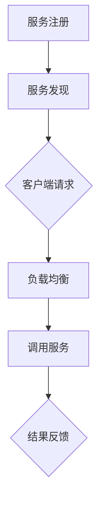

                 

阿里巴巴作为全球领先的互联网科技公司，其社招中间件开发工程师的面试题集不仅考察候选人的技术深度，更注重其对实际工程问题的解决能力。本文将结合2025年阿里巴巴社招中间件开发工程师的面试题，深入探讨中间件技术的核心概念、算法原理、项目实践及未来发展趋势。

## 关键词
- 阿里巴巴
- 社招
- 中间件开发
- 面试题集
- 技术深度
- 实际问题解决

## 摘要
本文旨在为准备阿里巴巴2025年社招中间件开发工程师面试的技术人员提供一份全面的技术指南。文章涵盖了中间件技术的核心概念，包括服务发现、负载均衡、分布式事务等；探讨了常见的面试算法题及其解决方案；并通过实际项目实践展示了中间件在复杂业务场景中的应用。最后，文章对中间件技术的发展趋势进行了展望。

## 1. 背景介绍
### 中间件的概念与作用

中间件（Middleware）是指处于操作系统软件和应用程序之间的通用服务，它能够简化分布式系统中的复杂性和维护难度。阿里巴巴的中间件产品如Nacos、Dubbo、Seata等，已经广泛应用于电商、金融、物流等业务场景，为系统的稳定性、高性能和可扩展性提供了坚实保障。

### 阿里巴巴中间件的发展历程

阿里巴巴在中间件领域有着深厚的积累，从最早的WebLogic、WebSphere等中间件系统，到自主研发的Tair、Druid等中间件组件，再到如今成熟的Nacos、Dubbo等中间件产品，阿里巴巴的中间件技术一直在不断创新和演进。

### 中间件开发工程师的职责

中间件开发工程师负责设计、开发、测试和维护中间件系统，他们需要深入了解各种中间件组件，能够解决分布式系统中的复杂问题，如高并发、数据一致性、网络延迟等。此外，他们还需具备良好的团队合作精神和项目经验。

## 2. 核心概念与联系
### 服务发现（Service Discovery）

服务发现是指中间件能够自动发现和注册服务，确保客户端能够找到并调用合适的服务实例。Nacos是阿里巴巴推出的服务发现与配置中心组件，它提供了强大的服务注册与发现能力。

### 负载均衡（Load Balancing）

负载均衡通过分散请求，提高系统的处理能力和可用性。Dubbo作为阿里巴巴的分布式服务框架，内置了多种负载均衡策略，如随机、轮询、权重等。

### 分布式事务（Distributed Transaction）

分布式事务涉及多个服务之间的操作，如何保证这些操作要么全部成功，要么全部失败是分布式系统中的难题。Seata是阿里巴巴推出的分布式事务管理解决方案，它通过两阶段提交协议（2PC）或三阶段提交协议（3PC）实现分布式事务的一致性。

### Mermaid 流程图



## 3. 核心算法原理 & 具体操作步骤
### 3.1 算法原理概述

中间件开发中的核心算法包括哈希算法（用于服务发现）、一致性哈希算法（用于负载均衡）、分布式锁算法（用于分布式事务）等。

### 3.2 算法步骤详解

- **哈希算法**：将服务名映射到服务实例地址，使用哈希函数计算服务名的哈希值，再通过模运算找到对应的服务实例。
- **一致性哈希算法**：将哈希空间划分成多个环，服务实例分布在不同的环上，客户端通过哈希值找到对应的服务实例。
- **分布式锁算法**：通过分布式协调服务（如ZooKeeper）实现锁的申请和释放，确保同一时刻只有一个服务实例持有锁。

### 3.3 算法优缺点

- **哈希算法**：快速定位服务实例，但需要处理哈希碰撞问题。
- **一致性哈希算法**：能够动态调整服务实例的分布，但可能导致数据倾斜。
- **分布式锁算法**：确保分布式事务的一致性，但需要处理锁的过期和续期问题。

### 3.4 算法应用领域

哈希算法和一致性哈希算法主要应用于服务发现和负载均衡，分布式锁算法则用于分布式事务管理。

## 4. 数学模型和公式 & 详细讲解 & 举例说明
### 4.1 数学模型构建

中间件系统的数学模型通常涉及概率论、图论、排队论等领域，如服务发现中的概率分布模型、负载均衡中的流量分配模型、分布式事务中的一致性模型等。

### 4.2 公式推导过程

例如，对于负载均衡中的权重轮询算法，其概率计算公式为：

$$ P_i = \frac{w_i}{\sum_{j=1}^{n} w_j} $$

其中，$P_i$ 为第 $i$ 个服务实例被调用的概率，$w_i$ 为第 $i$ 个服务实例的权重。

### 4.3 案例分析与讲解

假设有3个服务实例，权重分别为2、3、5，则它们的调用概率分别为：

$$ P_1 = \frac{2}{2+3+5} = \frac{2}{10} = 0.2 $$
$$ P_2 = \frac{3}{2+3+5} = \frac{3}{10} = 0.3 $$
$$ P_3 = \frac{5}{2+3+5} = \frac{5}{10} = 0.5 $$

这意味着，权重最大的服务实例将承担更多的请求，从而实现流量分配的公平性。

## 5. 项目实践：代码实例和详细解释说明
### 5.1 开发环境搭建

以Nacos服务注册与发现为例，首先需要在本地安装Nacos服务器，并启动Nacos控制台。然后，通过Maven插件或命令行工具将Nacos依赖引入到项目中。

### 5.2 源代码详细实现

在项目中创建一个简单的服务提供者和服务消费者，分别使用Nacos进行服务注册和发现。代码如下：

**服务提供者：**

```java
@EnableDiscoveryClient
@SpringBootApplication
public class ProviderApplication {
    public static void main(String[] args) {
        SpringApplication.run(ProviderApplication.class, args);
    }
}
```

**服务消费者：**

```java
@EnableDiscoveryClient
@RestController
public class ConsumerController {
    private final DiscoveryClient discoveryClient;

    @Autowired
    public ConsumerController(DiscoveryClient discoveryClient) {
        this.discoveryClient = discoveryClient;
    }

    @GetMapping("/service")
    public String getService() {
        List<ServiceInstance> instances = discoveryClient.getInstances("provider");
        if (!instances.isEmpty()) {
            return instances.get(0).getUri().toString();
        }
        return "Not Found";
    }
}
```

### 5.3 代码解读与分析

通过`@EnableDiscoveryClient`注解，服务提供者能够自动注册到Nacos服务注册中心。服务消费者通过`DiscoveryClient`获取服务实例列表，并根据列表中的第一个实例调用服务。

### 5.4 运行结果展示

启动服务提供者和服务消费者，在Nacos控制台中可以看到服务实例的注册信息。通过访问服务消费者的接口，可以看到返回的服务提供者地址。

## 6. 实际应用场景
### 6.1 分布式系统中的服务治理

在大型分布式系统中，服务治理是确保系统稳定运行的关键。通过服务注册与发现，中间件能够动态调整服务实例的负载，提高系统的可用性和性能。

### 6.2 高并发场景下的流量控制

在电商平台等高并发场景下，负载均衡能够有效分散请求，避免单个服务实例过载，确保系统的稳定运行。

### 6.3 分布式事务的一致性保证

通过分布式事务管理，中间件能够确保分布式系统中的操作要么全部成功，要么全部失败，从而保证数据的一致性。

### 6.4 未来应用展望

随着云计算和大数据技术的发展，中间件将在更加复杂的业务场景中发挥重要作用。未来的中间件将更加智能化、自动化，提供更丰富的功能和服务。

## 7. 工具和资源推荐
### 7.1 学习资源推荐

- 《深入理解Nacos：核心架构与API实战》
- 《Dubbo实战：分布式服务架构设计》
- 《Seata：分布式事务实战》

### 7.2 开发工具推荐

- Nacos控制台
- Docker
- Maven

### 7.3 相关论文推荐

- "Consistency in a Distributed System"
- "Load Balancing Algorithms for Computer Systems"
- "Principles of Distributed Database System"

## 8. 总结：未来发展趋势与挑战
### 8.1 研究成果总结

近年来，阿里巴巴在中间件领域取得了丰硕的研究成果，如Nacos、Dubbo、Seata等中间件组件已经成为了行业内的标杆。

### 8.2 未来发展趋势

随着云计算、大数据、物联网等技术的发展，中间件将向着更加智能化、自动化的方向发展，提供更加丰富的功能和服务。

### 8.3 面临的挑战

- 分布式系统的复杂性和稳定性
- 高并发场景下的性能优化
- 分布式事务的一致性保证

### 8.4 研究展望

未来的研究将更加注重中间件的智能化和自动化，通过引入机器学习和人工智能技术，提高中间件系统的自适应能力和可靠性。

## 9. 附录：常见问题与解答
### 9.1 什么是中间件？

中间件是一种软件，它位于操作系统和应用程序之间，提供了一系列服务，如服务注册、负载均衡、分布式事务等，以简化分布式系统的开发和维护。

### 9.2 中间件的作用是什么？

中间件的作用包括简化分布式系统的开发、提高系统的稳定性、性能和可扩展性，以及提供丰富的功能服务。

### 9.3 如何解决分布式系统中的高并发问题？

通过负载均衡技术，将请求分散到多个服务实例上，避免单个实例过载，从而提高系统的处理能力和响应速度。

### 9.4 分布式事务如何保证一致性？

通过分布式锁和两阶段提交协议或三阶段提交协议，确保分布式系统中多个操作要么全部成功，要么全部失败，从而保证数据的一致性。

---

通过本文的详细探讨，希望能够为准备阿里巴巴2025年社招中间件开发工程师面试的技术人员提供有益的指导，帮助大家更好地应对面试挑战。在未来的技术发展中，中间件技术将发挥更加重要的作用，为企业和开发者提供强大的支持。作者：禅与计算机程序设计艺术 / Zen and the Art of Computer Programming
```

