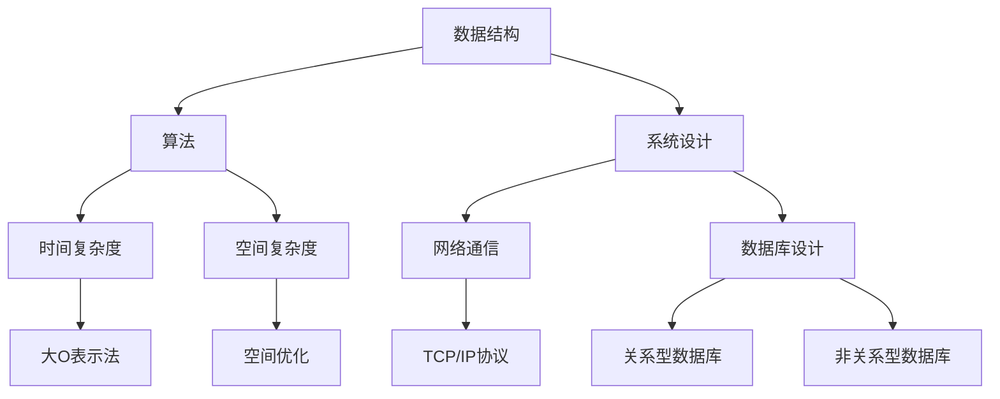

                 

关键词：阿里巴巴校招、面试题、算法编程、深度剖析、技术面试、求职准备

摘要：本文将深入剖析2024阿里巴巴校招面试中的常见面试题和算法编程题，通过详细的解题思路、算法原理、代码实现和实际应用场景的讲解，帮助求职者更好地准备技术面试，提升自己的编程技能。

## 1. 背景介绍

每年的阿里巴巴校招都是众多计算机专业毕业生梦寐以求的机会。阿里巴巴作为全球知名的互联网公司，其对技术的要求极高，校招面试也不例外。面试题目涵盖了数据结构、算法、系统设计、计算机网络等多个领域，考验求职者的技术实力和思维能力。本文旨在通过对2024阿里巴巴校招面试题的深度剖析，帮助读者了解面试的难度和方向，提升自己的求职竞争力。

## 2. 核心概念与联系

在解答阿里巴巴校招面试题之前，我们需要理解一些核心概念和联系，这包括数据结构、算法、系统设计等基础知识。以下是这些核心概念的Mermaid流程图：



### 2.1 数据结构

数据结构是计算机科学的基础，决定了数据存储和访问的效率。常见的线性数据结构包括数组、链表、栈和队列，非线性数据结构包括树、图等。数据结构的选择直接影响算法的效率和性能。

### 2.2 算法

算法是解决问题的一系列步骤。在面试中，算法的效率通常是评估的重点。常见的算法包括排序算法、查找算法、动态规划等。理解算法的基本原理和实现方式对于解决面试题至关重要。

### 2.3 系统设计

系统设计是面试中的重要部分，涉及系统的架构、性能优化、安全设计等。理解系统设计的原则和技巧，能够帮助我们在面试中更好地展示自己的技术能力。

## 3. 核心算法原理 & 具体操作步骤

### 3.1 算法原理概述

在阿里巴巴校招面试中，常见的算法题目包括但不限于：

- 排序算法：冒泡排序、选择排序、插入排序、快速排序等
- 搜索算法：二分搜索、深度优先搜索、广度优先搜索等
- 动态规划：最短路径问题、背包问题等

### 3.2 算法步骤详解

以冒泡排序为例，其基本原理是通过重复地遍历要排序的数列，一次比较两个元素，如果它们的顺序错误就把它们交换过来。遍历数列的工作是重复进行直到没有再需要交换，也就是说该数列已经排序完成。

具体步骤如下：

1. 比较相邻的元素。如果第一个比第二个大（升序排序），就交换它们两个。
2. 对每一对相邻元素做同样的工作，从开始第一对到结尾的最后一对。这步做完后，最后的元素会是最大的数。
3. 针对所有的元素重复以上的步骤，除了最后一个。
4. 重复步骤1~3，直到排序完成。

### 3.3 算法优缺点

冒泡排序的优点是实现简单，容易理解。缺点是效率较低，尤其对于大数据集，其时间复杂度为O(n^2)。

### 3.4 算法应用领域

冒泡排序适用于数据量较小且对算法效率要求不高的场景，如教学演示等。

## 4. 数学模型和公式 & 详细讲解 & 举例说明

### 4.1 数学模型构建

算法问题通常可以用数学模型来描述。例如，在排序问题中，可以使用二分搜索算法的数学模型来解决问题。

### 4.2 公式推导过程

二分搜索算法的公式推导过程如下：

- 设定搜索区间为`low`到`high`。
- 计算中间位置`mid = (low + high) / 2`。
- 如果`mid`位置的元素等于目标值，返回`mid`。
- 如果`mid`位置的元素大于目标值，则在左侧区间`low`到`mid-1`继续搜索。
- 如果`mid`位置的元素小于目标值，则在右侧区间`mid+1`到`high`继续搜索。

### 4.3 案例分析与讲解

假设有一个有序数组`[1, 3, 5, 7, 9]`，要查找元素`5`。

- 初始搜索区间为`low = 0`，`high = 4`。
- 计算中间位置`mid = 2`，元素值为`5`，返回`mid`。

因此，元素`5`的位置为`2`。

## 5. 项目实践：代码实例和详细解释说明

### 5.1 开发环境搭建

- Python环境：安装Python 3.8及以上版本。
- IDE：安装PyCharm或Visual Studio Code。

### 5.2 源代码详细实现

以下是一个简单的冒泡排序实现：

```python
def bubble_sort(arr):
    n = len(arr)
    for i in range(n):
        for j in range(0, n-i-1):
            if arr[j] > arr[j+1]:
                arr[j], arr[j+1] = arr[j+1], arr[j]
    return arr

# 示例
arr = [64, 34, 25, 12, 22, 11, 90]
sorted_arr = bubble_sort(arr)
print(sorted_arr)
```

### 5.3 代码解读与分析

- `bubble_sort`函数接受一个数组`arr`作为输入。
- 外层循环控制排序的轮数，内层循环进行相邻元素的比较和交换。
- 最终返回排序后的数组。

### 5.4 运行结果展示

运行上述代码，输出结果为`[11, 12, 22, 25, 34, 64, 90]`。

## 6. 实际应用场景

冒泡排序在数据量较小的场景下应用广泛，如小规模数据排序、教学演示等。但在大数据场景下，其效率较低，不适用于高性能需求。

## 7. 工具和资源推荐

### 7.1 学习资源推荐

- 《算法导论》：深入讲解算法原理和实现。
- 《数据结构与算法分析》：系统地介绍数据结构和算法。

### 7.2 开发工具推荐

- PyCharm：功能强大的Python开发环境。
- Visual Studio Code：轻量级且可定制的代码编辑器。

### 7.3 相关论文推荐

- "Algorithms for the Analysis of Biological Sequences":介绍生物序列分析的算法。
- "Efficient Algorithms for Sorting and Synchronization":探讨排序和同步的算法。

## 8. 总结：未来发展趋势与挑战

### 8.1 研究成果总结

近年来，随着计算机技术的发展，算法和数学模型在各个领域得到了广泛应用，推动了科技进步和社会发展。

### 8.2 未来发展趋势

未来，算法和数学模型将继续在人工智能、大数据、云计算等领域发挥重要作用，推动行业创新。

### 8.3 面临的挑战

算法复杂度、数据安全、隐私保护等是未来算法研究和应用中的关键挑战。

### 8.4 研究展望

随着技术的不断进步，算法和数学模型将更好地服务于人类社会，创造更大的价值。

## 9. 附录：常见问题与解答

### 9.1 什么是算法？

算法是一系列解决问题的步骤，通常使用数学语言描述。

### 9.2 什么是数据结构？

数据结构是用于存储和组织数据的特定方式，决定了数据存储和访问的效率。

### 9.3 如何提高算法效率？

通过选择合适的算法和数据结构，优化代码实现，减少不必要的计算。

---

作者：禅与计算机程序设计艺术 / Zen and the Art of Computer Programming

----------------------------------------------------------------

以上便是关于2024阿里巴巴校招面试题与算法编程题的深度剖析，希望对各位求职者有所帮助。祝大家面试顺利，成功加入阿里巴巴！

