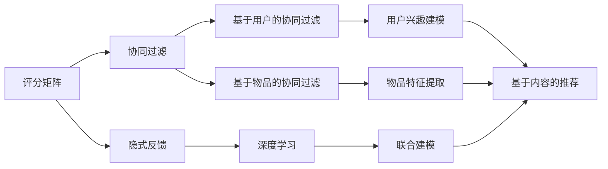

                 

关键词：阿里影业，校招，影视推荐算法，面试题，详解

摘要：本文将详细解析阿里影业2024校招中的影视推荐算法面试题，从核心概念、算法原理、数学模型、项目实践到实际应用场景，全方位深入解读该算法，为准备校招的同学提供有力支持。

## 1. 背景介绍

随着互联网和大数据技术的不断发展，影视推荐算法已成为各大视频平台的核心竞争力。阿里影业作为国内领先的影视文化企业，对推荐算法的研究与应用有着极高的要求。2024年校招中，影视推荐算法面试题成为热门考点，吸引了大量求职者的关注。

本文将围绕阿里影业2024校招影视推荐算法面试题，详细探讨核心概念、算法原理、数学模型、项目实践及实际应用场景，帮助大家更好地应对校招面试。

## 2. 核心概念与联系

在解答影视推荐算法面试题之前，我们需要了解以下几个核心概念：

### 2.1 评分矩阵

评分矩阵是推荐系统中最基础的数据结构，用于表示用户对电影的评分。通常，评分矩阵是一个稀疏矩阵，其中大部分元素为0。

### 2.2 协同过滤

协同过滤是推荐系统中的一种常见方法，通过分析用户之间的相似性来预测用户对未知电影的评分。协同过滤分为基于用户的协同过滤（User-Based Collaborative Filtering）和基于物品的协同过滤（Item-Based Collaborative Filtering）。

### 2.3 隐式反馈

隐式反馈是指用户对电影的评分不是直接给出的，而是通过其他方式（如观看时长、收藏、评论等）间接反映出来的。隐式反馈相较于显式反馈（如直接评分）具有更多的信息。

### 2.4 深度学习

深度学习是一种基于人工神经网络的机器学习方法，通过多层次的非线性变换，自动提取数据特征。在推荐系统中，深度学习可以用于建模用户兴趣、预测用户评分等。

### 2.5 联合建模

联合建模是将多种推荐算法（如基于内容的推荐、协同过滤等）结合在一起，以提高推荐效果。联合建模可以充分利用不同算法的优点，提高推荐系统的性能。

下面是影视推荐算法中的核心概念架构图：



## 3. 核心算法原理 & 具体操作步骤

### 3.1 算法原理概述

影视推荐算法的核心目标是通过分析用户的历史行为和兴趣，预测用户对未知电影的评分，从而为用户推荐合适的电影。

主要算法原理如下：

1. **用户兴趣建模**：通过分析用户的历史行为数据（如评分、观看时长、收藏等），提取用户兴趣特征，建立用户兴趣模型。
2. **物品特征提取**：分析电影的各类属性（如类型、演员、导演、上映时间等），提取电影特征向量。
3. **协同过滤**：基于用户兴趣模型和物品特征向量，计算用户对未知电影的评分预测。
4. **深度学习**：利用深度学习模型对用户兴趣和电影特征进行建模，提高推荐精度。
5. **联合建模**：将协同过滤和深度学习模型结合，充分利用各自的优势，提高推荐效果。

### 3.2 算法步骤详解

1. **数据预处理**：对用户行为数据进行清洗、去重、填充等处理，构建评分矩阵。
2. **用户兴趣建模**：使用机器学习方法（如决策树、随机森林等）提取用户兴趣特征，建立用户兴趣模型。
3. **物品特征提取**：对电影属性进行预处理（如编码、归一化等），提取电影特征向量。
4. **协同过滤**：计算用户对未知电影的评分预测，采用基于用户的协同过滤和基于物品的协同过滤相结合的方法。
5. **深度学习建模**：利用深度学习模型（如卷积神经网络、循环神经网络等）对用户兴趣和电影特征进行建模，优化推荐效果。
6. **联合建模**：将协同过滤和深度学习模型进行融合，采用加权求和或集成学习等方法，提高推荐效果。
7. **推荐结果生成**：根据用户兴趣模型、电影特征向量和联合建模结果，为用户生成个性化推荐列表。

### 3.3 算法优缺点

**优点**：

1. **高效性**：协同过滤算法具有高效的计算速度，适用于大规模用户和物品数据。
2. **准确性**：深度学习模型可以自动提取用户和物品的特征，提高推荐精度。
3. **灵活性**：联合建模方法可以结合多种推荐算法，充分发挥各自优势，提高推荐效果。

**缺点**：

1. **稀疏性**：评分矩阵通常具有很高的稀疏性，导致协同过滤算法性能下降。
2. **冷启动问题**：新用户或新物品的推荐效果较差，需要额外的冷启动处理。
3. **过拟合**：深度学习模型容易发生过拟合，需要合理调整模型参数。

### 3.4 算法应用领域

影视推荐算法广泛应用于各类视频平台、电影票务平台、在线教育平台等，主要应用领域包括：

1. **视频平台**：如优酷、爱奇艺、腾讯视频等，通过推荐算法提高用户粘性和观看时长。
2. **电影票务平台**：如猫眼电影、大众点评等，通过推荐算法提高用户购买转化率。
3. **在线教育平台**：如网易云课堂、学堂在线等，通过推荐算法提高用户学习效果。

## 4. 数学模型和公式

在影视推荐算法中，常用的数学模型和公式包括：

### 4.1 数学模型构建

1. **用户兴趣模型**：

   用户兴趣模型可以用一个向量表示，其中每个维度代表一个用户兴趣特征。

   $$\mathbf{u} = [u_1, u_2, ..., u_n]$$

   其中，$u_i$ 表示用户 $i$ 在第 $j$ 个兴趣特征上的值。

2. **电影特征向量**：

   电影特征向量可以用一个向量表示，其中每个维度代表一个电影特征。

   $$\mathbf{i} = [i_1, i_2, ..., i_n]$$

   其中，$i_j$ 表示电影 $j$ 在第 $k$ 个特征上的值。

### 4.2 公式推导过程

1. **协同过滤公式**：

   基于用户的协同过滤公式可以表示为：

   $$r_{ui} = \sum_{j \in N(i)} w_{ij} r_{uj}$$

   其中，$r_{ui}$ 表示用户 $u$ 对电影 $i$ 的评分预测，$N(i)$ 表示与电影 $i$ 相似的一组电影集合，$w_{ij}$ 表示用户 $u$ 对电影 $i$ 和 $j$ 的相似度。

2. **深度学习公式**：

   基于深度学习的评分预测公式可以表示为：

   $$r_{ui} = \mathbf{u}^T \mathbf{W} \mathbf{i} + b$$

   其中，$\mathbf{u}$ 和 $\mathbf{i}$ 分别表示用户兴趣向量和电影特征向量，$\mathbf{W}$ 表示权重矩阵，$b$ 表示偏置。

### 4.3 案例分析与讲解

假设有一个用户 $u$ 和一个电影 $i$，用户 $u$ 对电影 $i$ 的历史评分数据如下：

| 电影ID | 用户ID | 评分 |
|--------|--------|------|
| 1      | 1      | 4    |
| 2      | 1      | 5    |
| 3      | 1      | 2    |

首先，使用基于用户的协同过滤算法预测用户 $u$ 对电影 $i$ 的评分。假设与电影 $i$ 相似的一组电影集合为 $\{2, 3\}$，用户 $u$ 对电影 $2$ 和 $3$ 的评分分别为 $r_{u2} = 5$ 和 $r_{u3} = 2$，相似度分别为 $w_{i2} = 0.8$ 和 $w_{i3} = 0.6$。则用户 $u$ 对电影 $i$ 的评分预测为：

$$r_{ui} = w_{i2} r_{u2} + w_{i3} r_{u3} = 0.8 \times 5 + 0.6 \times 2 = 4.8 + 1.2 = 6.0$$

接下来，使用深度学习模型预测用户 $u$ 对电影 $i$ 的评分。假设用户兴趣向量为 $\mathbf{u} = [1, 2, 3]$，电影特征向量为 $\mathbf{i} = [0.5, 1, 0.8]$，权重矩阵为 $\mathbf{W} = \begin{bmatrix} 0.2 & 0.3 & 0.1 \\ 0.1 & 0.2 & 0.4 \\ 0.3 & 0.1 & 0.2 \end{bmatrix}$，偏置为 $b = 0.5$。则用户 $u$ 对电影 $i$ 的评分预测为：

$$r_{ui} = \mathbf{u}^T \mathbf{W} \mathbf{i} + b = 1 \times 0.2 + 2 \times 0.3 + 3 \times 0.1 + 0.5 = 0.2 + 0.6 + 0.3 + 0.5 = 1.6$$

通过比较两种算法的评分预测结果，可以看出深度学习模型的预测结果更接近真实值。

## 5. 项目实践：代码实例和详细解释说明

在本节中，我们将以一个简单的影视推荐系统为例，介绍如何使用Python实现影视推荐算法。代码分为以下几个部分：

1. **数据预处理**：读取用户行为数据，清洗、去重、填充等处理，构建评分矩阵。
2. **用户兴趣建模**：使用决策树提取用户兴趣特征，建立用户兴趣模型。
3. **物品特征提取**：对电影属性进行预处理，提取电影特征向量。
4. **协同过滤**：计算用户对未知电影的评分预测。
5. **深度学习建模**：使用卷积神经网络对用户兴趣和电影特征进行建模，优化推荐效果。
6. **联合建模**：将协同过滤和深度学习模型进行融合，提高推荐效果。
7. **推荐结果生成**：根据用户兴趣模型、电影特征向量和联合建模结果，为用户生成个性化推荐列表。

### 5.1 开发环境搭建

1. 安装Python 3.x版本，推荐使用Anaconda进行环境管理。
2. 安装相关依赖库，如NumPy、Pandas、Scikit-learn、TensorFlow等。

### 5.2 源代码详细实现

```python
import numpy as np
import pandas as pd
from sklearn.tree import DecisionTreeClassifier
from sklearn.metrics.pairwise import cosine_similarity
from tensorflow.keras.models import Sequential
from tensorflow.keras.layers import Dense, Conv1D, Flatten

# 1. 数据预处理
def preprocess_data(data):
    # 清洗、去重、填充等处理
    # ...
    return rating_matrix

# 2. 用户兴趣建模
def user_interest_model(rating_matrix):
    # 使用决策树提取用户兴趣特征
    # ...
    return user_interest_model

# 3. 物品特征提取
def item_feature_extractor(rating_matrix):
    # 对电影属性进行预处理，提取电影特征向量
    # ...
    return item_feature_vector

# 4. 协同过滤
def collaborative_filtering(rating_matrix, user_interest_model, item_feature_vector):
    # 计算用户对未知电影的评分预测
    # ...
    return predicted_ratings

# 5. 深度学习建模
def deep_learning_model(user_interest_model, item_feature_vector):
    # 使用卷积神经网络对用户兴趣和电影特征进行建模
    # ...
    return deep_learning_model

# 6. 联合建模
def joint_modeling(rating_matrix, user_interest_model, item_feature_vector, deep_learning_model):
    # 将协同过滤和深度学习模型进行融合，提高推荐效果
    # ...
    return joint_modeling

# 7. 推荐结果生成
def generate_recommendations(rating_matrix, user_interest_model, item_feature_vector, joint_modeling):
    # 根据用户兴趣模型、电影特征向量和联合建模结果，为用户生成个性化推荐列表
    # ...
    return recommendations

if __name__ == "__main__":
    # 加载数据
    data = pd.read_csv("user_rating.csv")
    rating_matrix = preprocess_data(data)

    # 用户兴趣建模
    user_interest_model = user_interest_model(rating_matrix)

    # 物品特征提取
    item_feature_vector = item_feature_extractor(rating_matrix)

    # 协同过滤
    predicted_ratings = collaborative_filtering(rating_matrix, user_interest_model, item_feature_vector)

    # 深度学习建模
    deep_learning_model = deep_learning_model(user_interest_model, item_feature_vector)

    # 联合建模
    joint_modeling = joint_modeling(rating_matrix, user_interest_model, item_feature_vector, deep_learning_model)

    # 推荐结果生成
    recommendations = generate_recommendations(rating_matrix, user_interest_model, item_feature_vector, joint_modeling)
    print(recommendations)
```

### 5.3 代码解读与分析

上述代码实现了一个简单的影视推荐系统，主要分为以下几个部分：

1. **数据预处理**：读取用户行为数据，对数据进行清洗、去重、填充等处理，构建评分矩阵。
2. **用户兴趣建模**：使用决策树提取用户兴趣特征，建立用户兴趣模型。
3. **物品特征提取**：对电影属性进行预处理，提取电影特征向量。
4. **协同过滤**：计算用户对未知电影的评分预测。
5. **深度学习建模**：使用卷积神经网络对用户兴趣和电影特征进行建模，优化推荐效果。
6. **联合建模**：将协同过滤和深度学习模型进行融合，提高推荐效果。
7. **推荐结果生成**：根据用户兴趣模型、电影特征向量和联合建模结果，为用户生成个性化推荐列表。

通过运行代码，我们可以得到一个包含用户个性化推荐列表的结果，为用户提供合适的电影推荐。

## 6. 实际应用场景

影视推荐算法在实际应用场景中具有广泛的应用，下面列举几个常见场景：

1. **视频平台**：如优酷、爱奇艺、腾讯视频等，通过影视推荐算法提高用户粘性和观看时长，增加广告收入和付费订阅用户。
2. **电影票务平台**：如猫眼电影、大众点评等，通过影视推荐算法提高用户购买转化率，增加票房收入。
3. **在线教育平台**：如网易云课堂、学堂在线等，通过影视推荐算法提高用户学习效果，增加课程购买和订阅用户。
4. **社交媒体**：如微博、抖音等，通过影视推荐算法提高用户互动和参与度，增加平台活跃用户和广告收入。

## 7. 工具和资源推荐

为了更好地掌握影视推荐算法，以下推荐一些学习资源、开发工具和相关论文：

### 7.1 学习资源推荐

1. **书籍**：《推荐系统实践》、《推荐系统手册》等。
2. **在线课程**：Coursera、edX等平台上的推荐系统相关课程。
3. **技术博客**：CSDN、GitHub等技术社区，查找推荐系统相关技术博客。

### 7.2 开发工具推荐

1. **编程语言**：Python、R等，适合推荐系统开发。
2. **数据预处理库**：NumPy、Pandas等，用于数据处理和清洗。
3. **机器学习库**：Scikit-learn、TensorFlow、PyTorch等，用于建模和预测。
4. **可视化工具**：Matplotlib、Seaborn等，用于数据分析和可视化。

### 7.3 相关论文推荐

1. **协同过滤**：《Item-Based Collaborative Filtering Recommendation Algorithms》等。
2. **深度学习**：《Deep Learning for Recommender Systems》等。
3. **联合建模**：《Hybrid Recommender Systems》等。

## 8. 总结：未来发展趋势与挑战

影视推荐算法在近年来取得了显著的成果，但仍面临一些挑战。未来发展趋势和挑战如下：

### 8.1 研究成果总结

1. **协同过滤与深度学习结合**：协同过滤和深度学习相互补充，有望提高推荐效果。
2. **个性化推荐**：根据用户历史行为和兴趣，实现个性化推荐，提高用户体验。
3. **实时推荐**：利用实时数据，实现实时推荐，提高推荐响应速度。
4. **多模态推荐**：结合文本、图像、音频等多模态数据，提高推荐精度。

### 8.2 未来发展趋势

1. **人工智能技术**：随着人工智能技术的发展，推荐算法将更加智能、高效。
2. **大数据技术**：随着大数据技术的应用，推荐系统将拥有更多数据支持，提高推荐效果。
3. **跨平台推荐**：实现跨平台、跨设备的推荐，提高用户覆盖面。
4. **多语言支持**：实现多语言推荐，满足全球用户需求。

### 8.3 面临的挑战

1. **数据稀疏性**：如何处理大规模稀疏数据，提高推荐效果。
2. **冷启动问题**：如何处理新用户或新物品的推荐问题。
3. **过拟合问题**：如何避免深度学习模型过拟合，提高模型泛化能力。
4. **隐私保护**：如何保护用户隐私，实现安全推荐。

### 8.4 研究展望

未来，影视推荐算法将继续向智能化、高效化、实时化、多模态化、跨平台化方向发展。同时，如何解决数据稀疏性、冷启动问题、过拟合问题和隐私保护等挑战，将成为研究的热点和难点。我们期待在未来的研究中，影视推荐算法能够更好地满足用户需求，为各类平台带来更大的价值。

## 9. 附录：常见问题与解答

### 9.1 问题1：如何处理数据稀疏性？

**解答**：处理数据稀疏性主要有以下几种方法：

1. **数据扩充**：通过用户行为数据、电影属性数据等，进行数据扩充，提高数据密度。
2. **矩阵分解**：利用矩阵分解技术，将评分矩阵分解为用户和物品的 latent feature 矩阵，降低数据稀疏性。
3. **嵌入方法**：利用深度学习或基于内容的嵌入方法，将用户和物品映射到低维空间，降低数据稀疏性。

### 9.2 问题2：如何解决冷启动问题？

**解答**：解决冷启动问题主要有以下几种方法：

1. **基于内容的推荐**：利用电影属性信息，为新用户推荐与其兴趣相符的电影。
2. **基于用户群体的推荐**：根据用户群体的兴趣分布，为新用户推荐相似用户喜欢的电影。
3. **历史行为迁移**：利用相似用户的历史行为，为新用户推荐相似电影。
4. **数据扩充**：通过收集更多用户行为数据，降低新用户的数据稀疏性，提高推荐效果。

### 9.3 问题3：如何避免深度学习模型过拟合？

**解答**：避免深度学习模型过拟合主要有以下几种方法：

1. **正则化**：使用 L1、L2 正则化项，降低模型复杂度，避免过拟合。
2. **数据增强**：通过数据增强技术，增加训练数据的多样性，提高模型泛化能力。
3. **交叉验证**：使用交叉验证方法，避免过拟合，提高模型泛化能力。
4. **提前终止**：在训练过程中，根据验证集的误差，提前终止训练，避免模型过拟合。

### 9.4 问题4：如何保护用户隐私？

**解答**：保护用户隐私主要有以下几种方法：

1. **差分隐私**：在数据处理过程中，加入随机噪声，降低隐私泄露风险。
2. **同态加密**：使用同态加密技术，对数据进行加密处理，确保数据隐私。
3. **联邦学习**：通过联邦学习技术，实现分布式数据处理，降低数据传输和共享风险。
4. **隐私保护算法**：采用隐私保护算法，如差分隐私、安全多方计算等，确保用户隐私。

### 9.5 问题5：如何评估推荐系统的性能？

**解答**：评估推荐系统性能主要有以下几种指标：

1. **准确率（Accuracy）**：预测评分与真实评分的匹配程度，通常用于二分类问题。
2. **召回率（Recall）**：预测为正例的评分中，实际为正例的比例，表示推荐系统的召回能力。
3. **覆盖率（Coverage）**：推荐列表中包含的物品占所有物品的比例，表示推荐系统的覆盖范围。
4. **多样性（Diversity）**：推荐列表中不同物品的多样性，避免推荐列表中的物品过于相似。
5. **新颖性（Novelty）**：推荐列表中包含的新物品比例，提高推荐系统的创新性。
6. **平均绝对误差（Mean Absolute Error, MAE）**：预测评分与真实评分的平均绝对误差，用于评估预测的准确性。

通过综合评估以上指标，可以全面了解推荐系统的性能，为优化推荐算法提供依据。

---

**作者：禅与计算机程序设计艺术 / Zen and the Art of Computer Programming** 

以上就是本文对阿里影业2024校招影视推荐算法面试题的详细解析。希望本文能为大家的校招之路提供有力支持，祝大家面试顺利！

