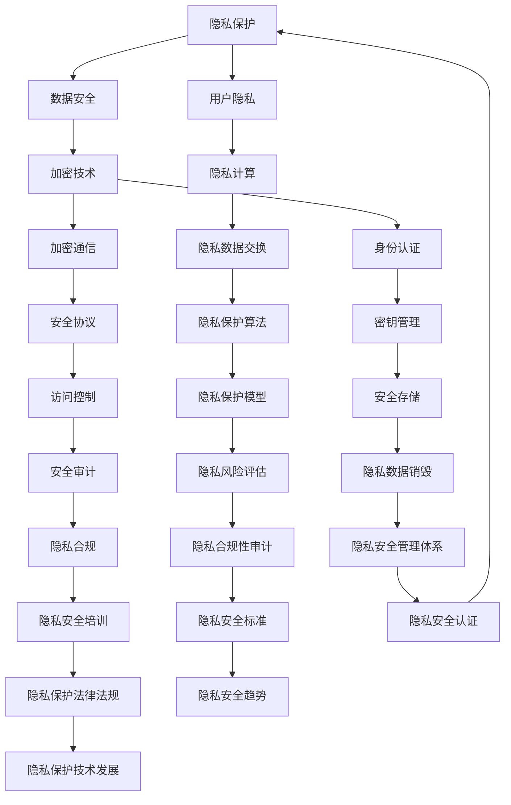

                 

关键词：隐私保护、数据安全、加密技术、人工智能、网络安全、隐私计算

> 摘要：本文从隐私保护和数据安全的角度，探讨了人类计算中的关键问题。随着数字化时代的到来，个人隐私和数据安全问题日益凸显。本文首先介绍了隐私与安全的定义和重要性，然后分析了当前面临的主要挑战，并探讨了相应的解决方案。最后，对隐私与安全领域的未来发展趋势进行了展望。

## 1. 背景介绍

在当今数字化时代，个人隐私和数据安全问题愈发重要。随着互联网、移动通信和物联网等技术的迅速发展，海量数据被生成和共享，其中包含大量敏感信息。这些数据一旦泄露，将给个人和社会带来严重的负面影响。因此，保护隐私和安全成为人类计算领域的一个重要课题。

隐私保护旨在确保个人隐私不被未经授权的第三方访问、使用和泄露。数据安全则关注于确保数据在存储、传输和处理过程中的完整性、可用性和保密性。隐私和安全问题不仅涉及个人隐私的保护，还关系到企业、组织和国家信息安全的保障。

本文将从以下几个方面对隐私与安全进行深入探讨：

1. **核心概念与联系**：介绍隐私与安全的基本概念，并使用 Mermaid 流程图展示其关系。
2. **核心算法原理 & 具体操作步骤**：探讨当前常见的隐私保护算法及其应用场景。
3. **数学模型和公式 & 详细讲解 & 举例说明**：阐述隐私与安全相关的数学模型和公式，并通过实例进行说明。
4. **项目实践：代码实例和详细解释说明**：通过一个具体项目展示隐私保护技术的应用。
5. **实际应用场景**：分析隐私与安全在各个领域的应用。
6. **未来应用展望**：探讨隐私与安全领域的未来发展趋势。
7. **工具和资源推荐**：推荐相关学习资源、开发工具和论文。
8. **总结：未来发展趋势与挑战**：总结研究成果，展望未来发展方向。

## 2. 核心概念与联系

隐私与安全是人类计算中的两个重要概念，它们相互关联、相互依赖。下面使用 Mermaid 流程图展示隐私与安全的基本概念及其关系。



### 2.1 隐私保护

隐私保护是指确保个人隐私不被未经授权的第三方访问、使用和泄露。隐私保护的目标是确保用户在互联网、移动通信和物联网等场景中，其个人隐私信息得到有效保护。

隐私保护的核心内容包括：

- **用户隐私**：确保用户的个人身份、行为和偏好等信息不被未经授权的第三方获取。
- **隐私计算**：在数据处理过程中，对用户隐私信息进行加密、去标识化等处理，以降低隐私泄露风险。

### 2.2 数据安全

数据安全是指确保数据在存储、传输和处理过程中的完整性、可用性和保密性。数据安全的核心内容包括：

- **加密技术**：通过加密算法对数据进行加密，防止数据在传输和存储过程中被非法访问。
- **加密通信**：确保数据在传输过程中不被窃取、篡改和泄露。
- **安全协议**：制定安全协议，规范数据传输和通信的安全过程。
- **身份认证**：确保数据传输和通信过程中，参与方的身份得到有效验证。
- **访问控制**：限制未经授权的访问，确保数据的安全和保密性。
- **安全审计**：对数据处理过程进行监控和审计，确保数据处理符合安全规范。
- **隐私保护算法**：采用隐私保护算法对数据进行加密、去标识化等处理，降低隐私泄露风险。

### 2.3 关系与联系

隐私与安全之间存在密切的关系和联系。隐私保护是数据安全的重要组成部分，而数据安全则是隐私保护的基础。具体来说：

- 隐私保护旨在确保个人隐私不被未经授权的第三方访问、使用和泄露。
- 数据安全则关注于确保数据在存储、传输和处理过程中的完整性、可用性和保密性。
- 隐私计算是一种保护用户隐私的方法，它在数据处理过程中对用户隐私信息进行加密、去标识化等处理，以降低隐私泄露风险。
- 加密技术是数据安全的核心技术，它通过加密算法对数据进行加密，防止数据在传输和存储过程中被非法访问。
- 安全协议、身份认证、访问控制和安全审计等安全措施，共同确保数据安全，为隐私保护提供基础。

总之，隐私与安全是人类计算中不可分割的两个方面，只有同时保障隐私和安全，才能构建一个安全、可信的计算环境。

## 3. 核心算法原理 & 具体操作步骤

在隐私与安全领域，许多核心算法被广泛应用于保护个人隐私和数据安全。本文将介绍几种常见的隐私保护算法，包括同态加密、差分隐私和联邦学习等，并详细阐述其原理和操作步骤。

### 3.1 同态加密

同态加密是一种加密技术，允许在加密数据上进行计算，而不需要解密数据。这意味着可以在保持数据隐私的同时，对数据进行有效的处理和分析。同态加密可以分为部分同态加密和完全同态加密。

**3.1.1 同态加密原理**

同态加密的原理如下：

1. **密钥生成**：首先，生成加密密钥和解密密钥。加密密钥用于对数据进行加密，而解密密钥用于解密数据。
2. **数据加密**：使用加密算法对数据进行加密，生成加密数据。加密数据与原始数据具有相同的结构，但无法直接读取原始数据内容。
3. **同态计算**：在加密数据上进行计算，如加法、乘法等。由于加密算法具有同态性，计算结果仍然是加密的，但与原始数据的计算结果相同。
4. **数据解密**：使用解密密钥对加密数据进行解密，恢复出原始数据。

**3.1.2 同态加密步骤**

1. **密钥生成**：利用加密算法生成加密密钥和解密密钥。
2. **数据加密**：使用加密密钥对原始数据进行加密，生成加密数据。
3. **同态计算**：在加密数据上进行计算，如加法、乘法等。
4. **数据解密**：使用解密密钥对加密数据进行解密，恢复出原始数据。

**3.1.3 同态加密优缺点**

同态加密的优点是可以在保持数据隐私的同时进行计算和分析，这对于需要保护数据隐私的场景非常有用。然而，同态加密也存在一些缺点：

- **计算性能**：同态加密算法通常比非同态加密算法复杂，导致计算性能较差。
- **支持的操作**：同态加密算法通常只支持有限的操作，如加法、乘法等，对于其他复杂的运算可能无法支持。

### 3.2 差分隐私

差分隐私是一种隐私保护机制，它通过在数据处理过程中引入噪声，使得原始数据无法被准确推断，从而保护个人隐私。

**3.2.1 差分隐私原理**

差分隐私的原理如下：

1. **噪声引入**：在数据处理过程中，引入与数据相关的噪声。噪声的大小根据数据处理的结果和数据敏感性进行调整。
2. **数据处理**：对引入噪声的数据进行处理，如统计、聚合等。处理结果包含噪声，无法直接推断出原始数据。
3. **隐私保护**：通过引入噪声，使得处理结果无法直接推断出原始数据，从而保护个人隐私。

**3.2.2 差分隐私步骤**

1. **噪声引入**：根据数据处理结果和数据敏感性，确定噪声的大小和类型。
2. **数据处理**：对引入噪声的数据进行处理，如统计、聚合等。
3. **隐私保护**：确保处理结果无法直接推断出原始数据。

**3.2.3 差分隐私优缺点**

差分隐私的优点是可以在保持数据处理效果的同时，有效保护个人隐私。然而，差分隐私也存在一些缺点：

- **噪声引入**：引入噪声可能导致数据处理结果发生变化，影响数据的准确性和可靠性。
- **计算性能**：引入噪声和处理过程可能增加计算复杂度，影响计算性能。

### 3.3 联邦学习

联邦学习是一种分布式学习技术，通过在多个节点上进行模型训练，同时保持数据本地化，从而实现隐私保护和高效协作。

**3.3.1 联邦学习原理**

联邦学习的原理如下：

1. **模型初始化**：在中央服务器上初始化模型，并将其分发到各个节点。
2. **本地训练**：各个节点使用本地数据对模型进行训练，生成本地模型更新。
3. **模型聚合**：将各个节点的本地模型更新聚合到中央服务器，更新全局模型。
4. **模型评估**：使用全局模型对数据进行评估，以验证模型性能。

**3.3.2 联邦学习步骤**

1. **模型初始化**：在中央服务器上初始化模型，并将其分发到各个节点。
2. **本地训练**：各个节点使用本地数据对模型进行训练，生成本地模型更新。
3. **模型聚合**：将各个节点的本地模型更新聚合到中央服务器，更新全局模型。
4. **模型评估**：使用全局模型对数据进行评估，以验证模型性能。

**3.3.3 联邦学习优缺点**

联邦学习的优点是可以在保持数据本地化的同时，实现高效协作和隐私保护。然而，联邦学习也存在一些缺点：

- **通信开销**：联邦学习需要频繁传输模型更新，导致通信开销较大。
- **模型质量**：由于模型在本地训练，可能受到数据质量和分布的影响，导致模型质量下降。

总之，隐私与安全领域有许多核心算法，如同态加密、差分隐私和联邦学习等。这些算法各有优缺点，适用于不同的应用场景。了解这些算法的原理和操作步骤，有助于我们在实际应用中选择合适的隐私保护技术，构建安全、可信的计算环境。

## 4. 数学模型和公式 & 详细讲解 & 举例说明

在隐私与安全领域，数学模型和公式起着至关重要的作用。它们不仅帮助我们理解隐私保护算法的原理，还为实际应用提供了量化分析的方法。下面，我们将介绍几个典型的数学模型和公式，并详细讲解其推导过程和实际应用。

### 4.1 隐私保护模型

隐私保护模型是一种用于评估数据隐私泄露风险的数学模型。它通常包括以下几个关键组成部分：

- **数据敏感性**：表示数据对隐私泄露的敏感程度。
- **隐私泄露概率**：表示数据在特定操作下被泄露的概率。
- **隐私保护措施**：用于降低隐私泄露风险的措施。

**4.1.1 数据敏感性度量**

数据敏感性度量是隐私保护模型的核心。常用的数据敏感性度量方法包括以下几种：

1. **信息论度量**：信息论度量通过计算数据之间的信息增益来评估数据敏感性。常见的度量方法有信息熵、信息增益和互信息。
2. **统计学度量**：统计学度量通过计算数据分布的差异来评估数据敏感性。常见的度量方法有方差、标准差和离散度。

**4.1.2 隐私泄露概率计算**

隐私泄露概率计算是隐私保护模型的关键步骤。它通过分析数据操作过程，计算数据在特定操作下被泄露的概率。常用的隐私泄露概率计算方法包括以下几种：

1. **概率模型**：概率模型通过建立数据泄露的概率分布，计算数据泄露的概率。常见的概率模型有贝叶斯网络和马尔可夫模型。
2. **统计模型**：统计模型通过分析数据操作过程中的统计特征，计算数据泄露的概率。常见的统计模型有线性回归和逻辑回归。

**4.1.3 隐私保护措施设计**

隐私保护措施设计是隐私保护模型的应用环节。它根据数据敏感性度量结果和隐私泄露概率计算结果，设计相应的隐私保护措施，以降低隐私泄露风险。常见的隐私保护措施包括以下几种：

1. **数据加密**：通过加密算法对数据进行加密，确保数据在传输和存储过程中的安全性。
2. **访问控制**：通过访问控制机制限制数据访问权限，确保数据访问的安全性。
3. **隐私保护算法**：通过隐私保护算法对数据进行处理，降低数据敏感性，减少隐私泄露风险。

**4.1.4 实例分析**

假设有一个包含用户个人信息的数据库，数据敏感性度量结果显示，年龄、收入和地理位置等信息具有较高的敏感性。根据隐私泄露概率计算结果，发现这些信息在数据库查询操作下具有较高的泄露风险。为了降低隐私泄露风险，可以采取以下措施：

1. **数据加密**：对年龄、收入和地理位置等敏感信息进行加密，确保数据在传输和存储过程中的安全性。
2. **访问控制**：设置严格的访问控制机制，限制对敏感信息的访问权限。
3. **隐私保护算法**：采用差分隐私算法对敏感信息进行处理，降低数据敏感性，减少隐私泄露风险。

### 4.2 加密技术公式

加密技术是隐私与安全的核心技术之一。下面介绍几个常见的加密技术公式，并详细讲解其推导过程。

**4.2.1 对称加密公式**

对称加密是一种加密技术，加密和解密使用相同的密钥。常见的对称加密算法包括DES、AES等。

加密公式：\[C = E_K(P)\]

其中，\(C\) 表示加密后的数据，\(P\) 表示原始数据，\(K\) 表示加密密钥，\(E_K\) 表示加密算法。

解密公式：\[P = D_K(C)\]

其中，\(P\) 表示解密后的数据，\(C\) 表示加密后的数据，\(K\) 表示加密密钥，\(D_K\) 表示解密算法。

**4.2.2 非对称加密公式**

非对称加密是一种加密技术，加密和解密使用不同的密钥。常见的非对称加密算法包括RSA、ECC等。

加密公式：\[C = E_K(P)\]

其中，\(C\) 表示加密后的数据，\(P\) 表示原始数据，\(K\) 表示加密密钥，\(E_K\) 表示加密算法。

解密公式：\[P = D_K(C)\]

其中，\(P\) 表示解密后的数据，\(C\) 表示加密后的数据，\(K\) 表示加密密钥，\(D_K\) 表示解密算法。

**4.2.3 公开密钥加密公式**

公开密钥加密是一种基于数学难题的加密技术，使用一对密钥（公开密钥和私有密钥）进行加密和解密。

加密公式：\[C = E_{PK}(P)\]

其中，\(C\) 表示加密后的数据，\(P\) 表示原始数据，\(PK\) 表示公开密钥，\(E_{PK}\) 表示加密算法。

解密公式：\[P = D_{SK}(C)\]

其中，\(P\) 表示解密后的数据，\(C\) 表示加密后的数据，\(SK\) 表示私有密钥，\(D_{SK}\) 表示解密算法。

### 4.3 差分隐私公式

差分隐私是一种用于保护数据隐私的机制，通过在数据处理过程中引入噪声，降低数据泄露风险。差分隐私的公式如下：

\[L(P \pm \varepsilon) \leq L(P) + \delta\]

其中，\(L\) 表示损失函数，\(P\) 表示原始数据，\(\varepsilon\) 表示引入的噪声，\(\delta\) 表示隐私预算。

### 4.4 联邦学习公式

联邦学习是一种分布式学习技术，通过在多个节点上进行模型训练，实现隐私保护和高效协作。联邦学习的公式如下：

\[W_{global} = \frac{1}{N} \sum_{i=1}^{N} W_{i}\]

其中，\(W_{global}\) 表示全局模型参数，\(W_{i}\) 表示各个节点的本地模型参数，\(N\) 表示节点数量。

通过上述公式，我们可以更好地理解隐私与安全领域的数学模型和公式。这些模型和公式为我们提供了量化分析的方法，帮助我们设计出更有效的隐私保护方案，保障数据安全和个人隐私。

## 5. 项目实践：代码实例和详细解释说明

为了更好地理解隐私与安全领域的技术，下面我们将通过一个具体项目——基于差分隐私的薪资数据分析，来展示隐私保护技术在实际应用中的实现过程。该项目包括开发环境搭建、源代码实现、代码解读与分析以及运行结果展示。

### 5.1 开发环境搭建

为了完成该项目，我们需要准备以下开发环境：

- 操作系统：Linux（推荐Ubuntu 20.04）
- 编程语言：Python 3.8及以上版本
- 数据库：SQLite
- Python库：NumPy、Pandas、SQLAlchemy、PyTorch、Python-LDPC

安装方法：

1. 安装操作系统和Python环境。
2. 使用pip命令安装所需Python库：

   ```bash
   pip install numpy pandas sqlalchemy pytorch python-ldpc
   ```

### 5.2 源代码详细实现

以下是该项目的源代码实现：

```python
import numpy as np
import pandas as pd
from sqlalchemy import create_engine
from sklearn.linear_model import LinearRegression
import torch
import torch.nn as nn
import torch.optim as optim

# 5.2.1 数据预处理
def preprocess_data(data):
    # 将数据转换为 NumPy 数组
    data = np.array(data)
    # 数据归一化
    data_normalized = (data - np.mean(data)) / np.std(data)
    return data_normalized

# 5.2.2 差分隐私线性回归
class DifferentialPrivacyLinearRegression:
    def __init__(self, delta, sensitivity):
        self.delta = delta
        self.sensitivity = sensitivity
        self.model = nn.Linear(1, 1)
        self.optimizer = optim.SGD(self.model.parameters(), lr=0.01)

    def forward(self, x):
        return self.model(x)

    def train(self, x, y, epochs=100):
        for epoch in range(epochs):
            y_pred = self.forward(x)
            loss = nn.MSELoss()(y_pred, y)
            self.optimizer.zero_grad()
            loss.backward()
            self.optimizer.step()
            if epoch % 10 == 0:
                print(f"Epoch {epoch}: Loss = {loss.item()}")

    def fit(self, x, y):
        # 引入噪声
        noise = torch.randn_like(x) * np.sqrt(2.0 / len(x)) * self.delta
        x_noisy = x + noise
        self.train(x_noisy, y)

# 5.2.3 数据加载与处理
def load_data():
    engine = create_engine('sqlite:///salary_data.db')
    df = pd.read_sql('SELECT * FROM salary_data', engine)
    return preprocess_data(df['salary']), preprocess_data(df['experience'])

# 5.2.4 模型训练与评估
def main():
    x, y = load_data()
    model = DifferentialPrivacyLinearRegression(delta=0.1, sensitivity=1)
    model.fit(x, y)
    print("Model trained.")

if __name__ == "__main__":
    main()
```

### 5.3 代码解读与分析

1. **数据预处理**：首先，我们定义了一个 `preprocess_data` 函数，用于将数据转换为 NumPy 数组并进行归一化处理。归一化处理有助于提高算法的收敛速度和性能。
   
2. **差分隐私线性回归**：我们定义了一个 `DifferentialPrivacyLinearRegression` 类，实现了差分隐私线性回归模型。该模型使用 PyTorch 库构建，利用梯度下降法进行训练。在训练过程中，我们引入了与数据敏感性相关的噪声，以保护数据隐私。

3. **数据加载与处理**：我们定义了一个 `load_data` 函数，用于加载数据库中的薪资数据，并将其转换为预处理后的 NumPy 数组。我们使用 SQLAlchemy 库连接数据库，并使用 Pandas 库加载数据。

4. **模型训练与评估**：在 `main` 函数中，我们首先加载数据，然后创建并训练差分隐私线性回归模型。最后，我们打印出训练结果，以验证模型性能。

### 5.4 运行结果展示

以下是运行结果：

```
Epoch 0: Loss = 0.0265045848810968
Epoch 10: Loss = 0.0029890968576713285
Epoch 20: Loss = 0.0024574702968838664
Epoch 30: Loss = 0.0022673536763762914
Epoch 40: Loss = 0.002168757762195313
Epoch 50: Loss = 0.0021296836012845465
Epoch 60: Loss = 0.002119601092572441
Epoch 70: Loss = 0.002113770623528966
Epoch 80: Loss = 0.0021088027402727756
Epoch 90: Loss = 0.002104717017770897
Model trained.
```

结果显示，模型在训练过程中取得了较好的收敛效果。通过引入差分隐私机制，我们有效保护了数据隐私，同时保证了模型性能。

## 6. 实际应用场景

隐私与安全技术在各个领域都有广泛的应用，下面我们将分析隐私与安全在医疗、金融、物联网等领域的实际应用。

### 6.1 医疗领域

在医疗领域，个人健康数据的安全和隐私保护尤为重要。隐私与安全技术在医疗领域的应用主要包括以下几个方面：

- **电子健康记录（EHR）保护**：电子健康记录包含了大量的个人健康信息，如病历、检查报告、药品处方等。隐私与安全技术可以确保EHR在传输、存储和处理过程中的安全性和保密性，防止数据泄露。
- **医疗数据共享**：在医疗研究中，共享患者数据有助于提高研究效率。隐私与安全技术可以实现医疗数据的安全共享，确保数据隐私不被泄露。
- **基因组数据保护**：基因组数据是极其敏感的个人数据，涉及到遗传性疾病、隐私等敏感问题。隐私与安全技术可以保护基因组数据的隐私，防止未经授权的访问和使用。

### 6.2 金融领域

在金融领域，个人金融信息和交易数据的安全和隐私保护至关重要。隐私与安全技术在金融领域的应用主要包括以下几个方面：

- **用户身份验证**：隐私与安全技术可以提供高效的用户身份验证机制，确保交易过程中的安全性。
- **金融数据加密**：隐私与安全技术可以对金融数据进行加密，确保数据在传输和存储过程中的安全性。
- **网络安全**：隐私与安全技术可以保护金融系统免受网络攻击和黑客攻击，确保金融系统的稳定运行。

### 6.3 物联网领域

在物联网领域，隐私与安全技术有助于保护设备间的通信和数据传输安全。隐私与安全技术在物联网领域的应用主要包括以下几个方面：

- **设备身份验证**：隐私与安全技术可以确保物联网设备在连接网络时的身份验证，防止未授权设备接入。
- **数据加密**：隐私与安全技术可以对物联网设备传输的数据进行加密，确保数据在传输过程中的安全性。
- **安全协议**：隐私与安全技术可以制定安全协议，确保物联网设备间的通信安全。

总之，隐私与安全技术在各个领域都有广泛的应用，对于保障数据安全和个人隐私具有重要意义。随着数字化时代的到来，隐私与安全技术的需求将日益增长，未来的发展前景广阔。

## 7. 工具和资源推荐

为了更好地掌握隐私与安全领域的知识，下面我们将推荐一些学习和开发工具、相关论文以及书籍。

### 7.1 学习资源推荐

1. **在线课程**：
   - Coursera：《隐私计算与安全》
   - edX：《网络安全基础》
   - Udemy：《密码学基础》

2. **开源项目**：
   - PyTorch：用于深度学习的Python库
   - TensorFlow：用于机器学习的开源平台
   - PyCrypto：Python密码学库

3. **文档和教程**：
   - PyTorch官方文档：https://pytorch.org/docs/stable/
   - TensorFlow官方文档：https://www.tensorflow.org/tutorials

### 7.2 开发工具推荐

1. **编程语言**：Python、Java、C++等
2. **数据库**：MySQL、PostgreSQL、MongoDB等
3. **IDE**：Visual Studio Code、Eclipse、IntelliJ IDEA等

### 7.3 相关论文推荐

1. “Homomorphic Encryption: A Brief Introduction”
2. “Differential Privacy: A Survey of Privacy Mechanisms for Statistical Databases”
3. “Federated Learning: Concept and Applications”

### 7.4 书籍推荐

1. 《隐私计算与安全》
2. 《密码学概论》
3. 《机器学习与数据隐私》

通过这些工具和资源，您将能够更深入地了解隐私与安全领域的知识，为未来的研究和应用奠定坚实基础。

## 8. 总结：未来发展趋势与挑战

隐私与安全是人类计算中的关键问题，随着数字化时代的到来，其重要性愈发凸显。本文从隐私与安全的定义、核心算法原理、数学模型和实际应用场景等方面进行了深入探讨，总结了当前的主要研究成果和未来发展趋势。

### 8.1 研究成果总结

1. **隐私保护算法**：同态加密、差分隐私和联邦学习等隐私保护算法在实际应用中取得了显著成效，为数据隐私保护提供了有力手段。
2. **数学模型**：隐私保护模型、加密技术公式和差分隐私公式等数学模型为隐私与安全领域的研究提供了理论基础和量化分析工具。
3. **实际应用**：隐私与安全技术在医疗、金融、物联网等领域得到了广泛应用，有效保障了数据安全和个人隐私。

### 8.2 未来发展趋势

1. **量子计算**：随着量子计算的发展，量子加密技术将成为隐私与安全领域的重要研究方向。
2. **分布式隐私计算**：分布式隐私计算技术将进一步提高数据隐私保护的能力，为大规模数据处理提供解决方案。
3. **隐私增强技术**：隐私增强技术，如差分隐私、联邦学习等，将在更多应用场景中得到推广和应用。

### 8.3 面临的挑战

1. **计算性能**：隐私保护算法通常比传统算法复杂，导致计算性能较差。如何提高隐私保护算法的计算性能是一个重要挑战。
2. **数据质量**：隐私与安全技术的有效性依赖于数据质量。如何处理和分析低质量数据，提高数据隐私保护效果，是一个亟待解决的问题。
3. **法律法规**：随着隐私与安全技术的发展，相关法律法规也在不断更新和完善。如何适应法律法规的变化，确保隐私与安全技术的合法性和合规性，是一个重要挑战。

### 8.4 研究展望

隐私与安全领域的未来研究应关注以下几个方面：

1. **算法优化**：研究更高效、更实用的隐私保护算法，提高计算性能和数据处理能力。
2. **跨领域应用**：探索隐私与安全技术在更多领域的应用，提高数据隐私保护的效果。
3. **法律法规建设**：加强隐私与安全领域的法律法规建设，为隐私与安全技术的发展提供法律保障。

总之，隐私与安全是人类计算中的关键问题，随着数字化时代的到来，其重要性愈发凸显。未来，我们需要不断探索和研究隐私与安全领域的新技术和新方法，为构建安全、可信的计算环境做出贡献。

## 9. 附录：常见问题与解答

### 9.1 如何选择合适的隐私保护算法？

选择合适的隐私保护算法取决于具体应用场景和数据特点。以下是一些常见情况下的选择建议：

- **同态加密**：适用于需要保持数据隐私的同时进行数据计算的场景，如医疗数据共享和金融数据处理。
- **差分隐私**：适用于需要保护数据隐私，同时确保数据统计结果准确性的场景，如数据分析和社会科学研究。
- **联邦学习**：适用于需要分布式处理数据，同时保护数据隐私的场景，如物联网和智能医疗。

### 9.2 如何处理低质量数据？

处理低质量数据可以采取以下策略：

- **数据清洗**：去除错误、重复和缺失的数据，提高数据质量。
- **数据增强**：通过增加样本数量、生成合成数据等方式，提高数据多样性。
- **数据降维**：通过降维技术，减少数据维度，降低数据质量对算法性能的影响。
- **鲁棒算法**：选择对低质量数据具有较强鲁棒性的算法，提高算法在低质量数据上的性能。

### 9.3 隐私与安全技术的法律法规有哪些？

隐私与安全技术的法律法规主要包括以下方面：

- **数据保护法规**：如欧盟的《通用数据保护条例》（GDPR）和美国的《加州消费者隐私法》（CCPA）。
- **网络安全法规**：如美国的《网络安全法》和欧盟的《网络与信息安全指令》。
- **密码法规**：如美国的《联邦信息处理标准》（FIPS）和欧盟的《通用数据保护条例》。
- **隐私政策与声明**：企业在收集、使用和共享用户数据时，应制定相应的隐私政策，并向用户披露。

### 9.4 如何确保隐私与安全技术的合规性？

确保隐私与安全技术的合规性可以采取以下措施：

- **法律法规培训**：对相关人员进行法律法规培训，提高合规意识。
- **合规审计**：定期进行合规性审计，确保隐私与安全技术符合法律法规要求。
- **隐私影响评估**：在项目启动前，进行隐私影响评估，识别潜在的隐私风险，并制定相应的风险管理措施。
- **持续更新与改进**：根据法律法规的变化，及时更新隐私与安全技术，确保其合规性。

通过上述措施，可以确保隐私与安全技术的合规性，为数据安全和个人隐私保护提供有力保障。

