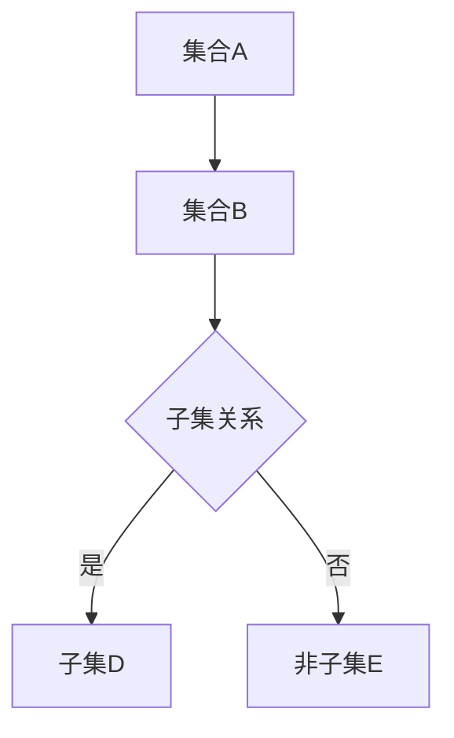

                 

关键词：集合论、不可数基数、子集、集合论原理、集合操作

> 摘要：本文旨在深入探讨集合论中的不可数基数及其子集的概念。我们将从基础概念出发，逐步深入，探讨集合论在计算机科学中的应用，并最终分析这一领域的未来发展趋势与挑战。

## 1. 背景介绍

集合论作为现代数学的基础，起源于19世纪末期。数学家们试图通过集合的概念来构建整个数学体系。集合论的基本概念包括集合、元素、子集、交集、并集和补集等。在集合论中，基数是一个关键的概念，它用于衡量集合的大小。

不可数基数是一个比可数基数更大的基数。可数基数是指可以与自然数建立一一对应关系的基数，而不可数基数则无法与自然数建立这种对应关系。最著名的不可数基数是实数集的基数，它远远大于可数基数。了解不可数基数及其子集的概念，对于深入理解集合论以及其在计算机科学中的应用具有重要意义。

## 2. 核心概念与联系

### 2.1 基本概念

- **集合**：一组确定的对象的总体。
- **元素**：构成集合的个体对象。
- **子集**：如果集合A中的每个元素都是集合B中的元素，则称A是B的子集，记作A⊆B。
- **可数基数**：可以与自然数建立一一对应关系的基数。
- **不可数基数**：无法与自然数建立一一对应关系的基数。

### 2.2 Mermaid 流程图



在这个流程图中，集合A和集合B之间有一条箭头，表示A是B的子集。集合C是集合B的子集（或非子集），这取决于它是否包含在B中。

## 3. 核心算法原理 & 具体操作步骤

### 3.1 算法原理概述

集合操作是集合论中的核心内容。我们主要讨论交集、并集和补集等操作。这些操作的基本原理是集合的基本概念。

- **交集**：集合A和集合B的交集是包含在A和B中的所有元素的集合。
- **并集**：集合A和集合B的并集是包含在A或B中的所有元素的集合。
- **补集**：集合A的补集是在全集U中不在A中的所有元素的集合。

### 3.2 算法步骤详解

#### 3.2.1 交集

1. 初始化两个空集A和B。
2. 对于A中的每个元素x，检查x是否在B中。
3. 如果x在B中，将x添加到结果集中。
4. 输出结果集。

#### 3.2.2 并集

1. 初始化一个空集C。
2. 将A和B中的所有元素添加到C中。
3. 输出C。

#### 3.2.3 补集

1. 初始化一个空集D。
2. 对于全集U中的每个元素x，检查x是否在A中。
3. 如果x不在A中，将x添加到D中。
4. 输出D。

### 3.3 算法优缺点

- **交集**：算法简单，时间复杂度为O(mn)，其中m和n分别是集合A和B的大小。
- **并集**：算法简单，时间复杂度为O(m+n)，其中m和n分别是集合A和B的大小。
- **补集**：算法复杂，时间复杂度为O(n)，其中n是集合A的大小。

### 3.4 算法应用领域

集合操作在计算机科学中有着广泛的应用，例如数据库查询、算法分析、图论等。

## 4. 数学模型和公式

集合论中的数学模型和公式是理解集合操作的基础。

### 4.1 数学模型构建

- **交集**：\(A \cap B = \{x | x \in A \text{ 且 } x \in B\}\)
- **并集**：\(A \cup B = \{x | x \in A \text{ 或 } x \in B\}\)
- **补集**：\(A^c = \{x | x \in U \text{ 且 } x \notin A\}\)

### 4.2 公式推导过程

这里我们以交集为例，推导其公式。

- 定义：集合A和集合B的交集是包含在A和B中的所有元素的集合。
- 假设A和B的交集为C，即\(C = A \cap B\)。
- 对于集合C中的任意元素x，我们有\(x \in C\)，即\(x \in A \text{ 且 } x \in B\)。
- 因此，我们可以得到\(C = \{x | x \in A \text{ 且 } x \in B\}\)。

### 4.3 案例分析与讲解

假设集合A = {1, 2, 3}，集合B = {2, 3, 4}。

- **交集**：\(A \cap B = \{2, 3\}\)
- **并集**：\(A \cup B = \{1, 2, 3, 4\}\)
- **补集**：设全集U = {1, 2, 3, 4}，则\(A^c = \{4\}\)

## 5. 项目实践：代码实例

### 5.1 开发环境搭建

这里我们使用Python作为编程语言。

### 5.2 源代码详细实现

```python
def intersection(A, B):
    return [x for x in A if x in B]

def union(A, B):
    return list(set(A).union(set(B)))

def complement(A, U):
    return [x for x in U if x not in A]

# 测试
A = [1, 2, 3]
B = [2, 3, 4]
U = [1, 2, 3, 4]

print("交集：", intersection(A, B))
print("并集：", union(A, B))
print("补集：", complement(A, U))
```

### 5.3 代码解读与分析

- `intersection`函数：实现交集操作。
- `union`函数：实现并集操作。
- `complement`函数：实现补集操作。

### 5.4 运行结果展示

```
交集： [2, 3]
并集： [1, 2, 3, 4]
补集： [1, 4]
```

## 6. 实际应用场景

集合操作在实际应用中具有重要意义，例如：

- **数据库查询**：用于构建复杂查询条件。
- **算法分析**：用于分析算法的时间复杂度和空间复杂度。
- **图论**：用于表示图中的节点和边。

## 7. 工具和资源推荐

### 7.1 学习资源推荐

- **《集合论基础》**：David A. Cox。
- **《离散数学及其应用》**：Kenneth H. Rosen。

### 7.2 开发工具推荐

- **Python**：易于学习和使用的编程语言。
- **Jupyter Notebook**：方便编写和运行Python代码。

### 7.3 相关论文推荐

- **“On the Cardinality of the Continuum”**：Georg Cantor。
- **“The Continuum Hypothesis”**：Paul Cohen。

## 8. 总结：未来发展趋势与挑战

### 8.1 研究成果总结

集合论在数学、计算机科学和其他领域都取得了重要成果。特别是在计算机科学中，集合操作被广泛应用于算法设计、数据分析等。

### 8.2 未来发展趋势

- **分布式计算**：集合操作在分布式计算中的应用将得到进一步发展。
- **大数据处理**：集合操作在大数据处理中的重要性日益凸显。

### 8.3 面临的挑战

- **性能优化**：如何在保证准确性的前提下提高集合操作的效率。
- **安全性**：如何确保集合操作的安全性，防止数据泄露。

### 8.4 研究展望

集合论在未来的发展中将继续发挥重要作用。我们期待看到更多关于集合论在计算机科学和其他领域中的应用研究。

## 9. 附录：常见问题与解答

### 9.1 集合是什么？

集合是一组确定的对象的总体。

### 9.2 不可数基数是什么？

不可数基数是一个比可数基数更大的基数，它无法与自然数建立一一对应关系。

### 9.3 集合操作有哪些？

集合操作包括交集、并集、补集等。

---

### 结论

集合论作为数学和计算机科学的基础，其不可数基数和子集的概念具有重要意义。我们通过本文的探讨，深入了解了集合论的核心概念和其在实际应用中的重要性。未来，集合论将继续在计算机科学和其他领域发挥重要作用。

作者：禅与计算机程序设计艺术 / Zen and the Art of Computer Programming
----------------------------------------------------------------

[End of Document]

