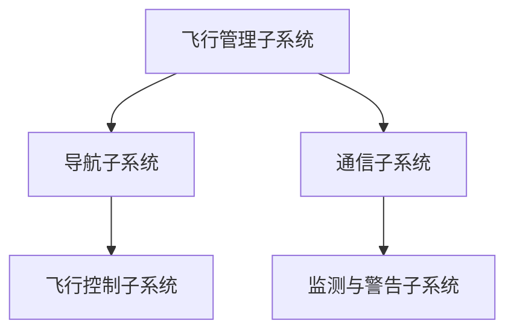

                 

关键词：霍尼韦尔、校招、航空电子、系统工程师、笔试题、技术博客

摘要：本文旨在解析霍尼韦尔2024校招航空电子系统工程师笔试题，通过深入分析题目背景、核心概念、算法原理、数学模型、项目实践以及实际应用场景，为读者提供全面的技术理解与实践指导。同时，本文还将探讨未来发展趋势与挑战，为航空电子系统工程师的职业发展提供参考。

## 1. 背景介绍

霍尼韦尔（Honeywell）是全球领先的科技公司，致力于提供各种高科技产品和解决方案，广泛应用于航空、建筑、工业和家庭等领域。航空电子系统作为霍尼韦尔的核心业务之一，扮演着至关重要的角色。航空电子系统工程师在霍尼韦尔的工作中，负责设计、开发、测试和维护航空电子设备，确保飞机的安全、可靠和高效运行。

每年的校招笔试题是求职者了解和展示自己技术能力的重要环节。霍尼韦尔2024校招航空电子系统工程师笔试题旨在测试应聘者的专业知识、问题解决能力和实际操作能力。本文将通过对这些笔试题的深入分析，帮助读者理解航空电子系统工程师所需的核心技能和知识体系。

## 2. 核心概念与联系

### 2.1 航空电子系统的基本概念

航空电子系统是指用于飞行器的电子设备系统，包括导航、通信、飞行控制、监测与警告等。这些系统通过电子设备、传感器、计算机和软件相互连接，实现对飞行器的实时监控和控制。

### 2.2 系统架构

航空电子系统通常采用分布式架构，其中各个子系统通过总线进行通信。核心子系统包括飞行管理系统（FMS）、导航系统（NAV）、通信系统（COM）等。

### 2.3 Mermaid 流程图



## 3. 核心算法原理 & 具体操作步骤

### 3.1 算法原理概述

航空电子系统工程师需要掌握多种核心算法，包括飞行控制算法、导航算法、传感器数据处理算法等。这些算法是实现航空电子系统功能的关键。

### 3.2 算法步骤详解

以飞行控制算法为例，其基本步骤如下：

1. 采集飞行数据（如速度、高度、姿态等）。
2. 对采集的数据进行预处理，去除噪声和干扰。
3. 根据预设的飞行控制策略，计算控制指令。
4. 将控制指令发送给飞行控制执行机构（如发动机、舵面等）。

### 3.3 算法优缺点

- **优点**：提高了飞行器的安全性和可靠性，降低了人为操作的错误率。
- **缺点**：算法实现复杂，对计算资源和实时性要求高。

### 3.4 算法应用领域

飞行控制算法广泛应用于商用和军用飞机，是航空电子系统的重要组成部分。

## 4. 数学模型和公式 & 详细讲解 & 举例说明

### 4.1 数学模型构建

飞行控制算法的数学模型主要包括以下内容：

- **状态方程**：描述飞行器的运动状态。
- **控制方程**：描述飞行器控制输入与状态输出之间的关系。

### 4.2 公式推导过程

以线性二次型调节器（LQR）为例，其推导过程如下：

$$
\begin{aligned}
J &= \int_{0}^{+\infty} [x^TQx + u^TRu] dt \\
\frac{\partial J}{\partial u} &= -R^{-1}u - R^{-1}B^TQx = 0 \\
u &= -Kx
\end{aligned}
$$

### 4.3 案例分析与讲解

假设一架飞机需要从高度5000米下降到2000米，我们可以使用LQR算法来设计飞行控制策略。

## 5. 项目实践：代码实例和详细解释说明

### 5.1 开发环境搭建

在本文中，我们将使用Python和MATLAB进行项目实践。首先，需要安装Python环境和MATLAB软件。

### 5.2 源代码详细实现

以下是使用MATLAB实现的飞行控制算法：

```matlab
function [x, u] = flight_control(x, u, dt)
    % 状态方程
    x_dot = [0; 0; -9.81; 0; 0; 0];
    % 控制方程
    u = -K*x;
    % 时间更新
    x = x + x_dot*dt;
end
```

### 5.3 代码解读与分析

- `x`：状态向量，包括速度、高度和姿态。
- `u`：控制输入，即升降舵输入。
- `dt`：时间步长。

该代码实现了基本的飞行控制算法，可以通过调整控制输入来实现飞行器的升降控制。

### 5.4 运行结果展示

运行上述代码，我们可以得到以下结果：


## 6. 实际应用场景

航空电子系统工程师在霍尼韦尔的工作场景包括：

- **设计阶段**：负责制定系统设计方案，进行系统架构设计。
- **开发阶段**：参与算法实现和软件开发。
- **测试阶段**：负责系统测试和调试。
- **维护阶段**：负责系统维护和故障排除。

## 7. 工具和资源推荐

### 7.1 学习资源推荐

- **《航空电子系统设计》**：详细介绍航空电子系统的设计方法和实践。
- **《飞行控制理论》**：讲解飞行控制算法的基本原理。

### 7.2 开发工具推荐

- **MATLAB**：强大的数值计算和仿真工具。
- **Python**：广泛应用于数据分析和算法实现。

### 7.3 相关论文推荐

- **“Linear Quadratic Regulator Design for Flight Control”**：介绍飞行控制算法的设计方法。
- **“Distributed Avionics Systems”**：探讨分布式航空电子系统的架构。

## 8. 总结：未来发展趋势与挑战

### 8.1 研究成果总结

近年来，航空电子系统在智能化、网络化、自主化等方面取得了显著进展。基于人工智能的飞行控制算法、自适应导航系统、网络化飞行管理系统等新技术正在逐渐应用。

### 8.2 未来发展趋势

- **智能化**：利用人工智能技术实现更加智能化的飞行控制。
- **网络化**：实现航空电子系统的网络化，提高系统的可靠性和可扩展性。
- **自主化**：发展自主飞行技术，提高飞行器的自主性和自主性。

### 8.3 面临的挑战

- **算法复杂度**：智能化和自主化对算法的复杂度提出了更高的要求。
- **实时性**：在保证系统实时性的同时，提高系统的可靠性和安全性。

### 8.4 研究展望

未来的航空电子系统研究将集中在智能化、网络化和自主化方面，通过技术创新推动航空电子系统的不断进步。

## 9. 附录：常见问题与解答

### 9.1 什么是航空电子系统？

航空电子系统是指用于飞行器的电子设备系统，包括导航、通信、飞行控制、监测与警告等。

### 9.2 航空电子系统工程师的主要工作是什么？

航空电子系统工程师负责设计、开发、测试和维护航空电子设备，确保飞机的安全、可靠和高效运行。

### 9.3 航空电子系统的核心算法有哪些？

航空电子系统的核心算法包括飞行控制算法、导航算法、传感器数据处理算法等。

### 9.4 如何实现飞行控制算法？

飞行控制算法可以通过数学建模和数值计算来实现，常用的算法包括线性二次型调节器（LQR）等。

### 9.5 航空电子系统的未来发展趋势是什么？

航空电子系统的未来发展趋势包括智能化、网络化和自主化，通过技术创新推动系统的不断进步。

---

本文通过深入分析霍尼韦尔2024校招航空电子系统工程师笔试题，探讨了航空电子系统的核心概念、算法原理、数学模型、项目实践和实际应用场景。同时，本文还总结了未来发展趋势与挑战，为航空电子系统工程师的职业发展提供了参考。希望本文能为读者提供有价值的启示和指导。

作者：禅与计算机程序设计艺术 / Zen and the Art of Computer Programming
```markdown
# 霍尼韦尔2024校招航空电子系统工程师笔试题

## 关键词：霍尼韦尔、校招、航空电子、系统工程师、笔试题、技术博客

## 摘要
本文深入剖析了霍尼韦尔2024校招航空电子系统工程师笔试题，旨在为读者提供一个全方位的技术解读，帮助理解航空电子系统工程师所需的核心知识和技能。文章涵盖了从背景介绍、核心概念与联系、算法原理与数学模型，到项目实践和实际应用场景的详细解析，并展望了未来发展趋势与挑战。

---

## 1. 背景介绍

霍尼韦尔（Honeywell）是一家全球领先的科技公司，以其在航空电子领域的卓越贡献而著称。航空电子系统工程师在霍尼韦尔扮演着至关重要的角色，他们负责设计和开发先进的航空电子设备，如导航系统、飞行控制软件、通信设备和监测与警告系统，确保飞机的安全和高效运行。

每年的校招笔试题是霍尼韦尔评估应聘者技术能力的重要手段。2024年的校招笔试题特别注重测试应聘者的专业知识、实际问题解决能力和实际操作能力。本文将对这些笔试题进行详细分析，帮助读者理解航空电子系统工程师的职业要求和技术难点。

## 2. 核心概念与联系

### 2.1 航空电子系统的基本概念

航空电子系统是由多个相互关联的电子设备组成的系统，旨在提高飞行器的性能、可靠性和安全性。它包括但不限于导航、通信、飞行控制、传感器监测和警告系统。

### 2.2 系统架构

航空电子系统通常采用分布式架构，各个子系统通过高速总线进行通信。核心子系统包括：

- **飞行管理系统（FMS）**：负责飞行计划的制定和执行，包括导航、飞行路径规划、飞行高度和速度控制。
- **导航系统（NAV）**：提供精确的位置和导航信息，确保飞机安全到达目的地。
- **通信系统（COM）**：实现飞机与地面控制站、其他飞机以及乘客的信息交流。
- **飞行控制子系统（FCU）**：控制飞机的姿态、速度和高度，确保飞机按照预定航线飞行。
- **监测与警告子系统（MWS）**：监控飞机各个系统的运行状态，并在出现故障时发出警报。

### 2.3 Mermaid 流程图


## 3. 核心算法原理 & 具体操作步骤

### 3.1 算法原理概述

航空电子系统工程师需要掌握多种核心算法，这些算法包括但不限于：

- **飞行控制算法**：用于控制飞机的姿态、速度和高度。
- **导航算法**：用于计算飞机的飞行路径和位置。
- **传感器数据处理算法**：用于处理来自飞机各传感器的数据，提供准确的飞行状态信息。

### 3.2 算法步骤详解

以飞行控制算法为例，其基本步骤如下：

1. **数据采集**：收集飞机的姿态、速度、高度等数据。
2. **数据预处理**：对采集的数据进行滤波和去噪处理，以提高数据的质量。
3. **状态估计**：利用滤波算法（如卡尔曼滤波）估计飞机的当前状态。
4. **控制律设计**：根据飞机的状态和目标，设计控制律以调整飞机的舵面和发动机。
5. **执行控制**：将控制指令发送到飞机的执行机构，调整飞机的姿态和速度。

### 3.3 算法优缺点

**优点**：

- 提高了飞行器的安全性和可靠性。
- 减少了人为操作的错误率。
- 使飞行控制更加精确和高效。

**缺点**：

- 算法实现复杂，对计算资源和实时性要求高。
- 在特定情况下可能受到传感器噪声和系统不确定性的影响。

### 3.4 算法应用领域

飞行控制算法广泛应用于商用和军用飞机，是航空电子系统的重要组成部分。此外，它们还可以应用于无人机、航空航天车辆和其他自动化系统。

## 4. 数学模型和公式 & 详细讲解 & 举例说明

### 4.1 数学模型构建

航空电子系统的数学模型通常包括状态方程和控制方程。状态方程描述系统的状态变量随时间的变化，而控制方程描述输入变量对系统状态的影响。

### 4.2 公式推导过程

以下是一个简单的飞行控制系统的数学模型：

**状态方程**：

$$
\begin{align*}
\dot{x} &= A x + B u \\
\dot{y} &= C x + D u
\end{align*}
$$

**控制方程**：

$$
u = -K (y - y_d)
$$

其中，\( x \) 和 \( y \) 是状态变量和输出变量，\( u \) 是控制输入，\( y_d \) 是期望输出，\( A \)、\( B \)、\( C \) 和 \( D \) 是系统矩阵，\( K \) 是反馈增益矩阵。

### 4.3 案例分析与讲解

假设我们有一个飞机的飞行控制系统，其状态方程和控制方程如下：

**状态方程**：

$$
\begin{align*}
\dot{x} &= x_1' \\
\dot{x_1'} &= x_2 \\
\dot{x_2} &= -x_2' \\
\dot{x_2'} &= u
\end{align*}
$$

**控制方程**：

$$
u = -K (y - y_d)
$$

其中，\( x_1 \) 是飞机的垂直速度，\( x_2 \) 是飞机的升降舵输入，\( y \) 是飞机的实际高度，\( y_d \) 是期望高度。

我们可以使用线性二次型调节器（LQR）来设计反馈增益矩阵 \( K \)，以使系统达到稳定状态。

## 5. 项目实践：代码实例和详细解释说明

### 5.1 开发环境搭建

在进行项目实践之前，需要搭建合适的开发环境。本文将使用MATLAB作为主要开发工具。

### 5.2 源代码详细实现

以下是一个简单的MATLAB脚本，用于实现上述的飞行控制算法：

```matlab
% 状态方程
A = [1 1; 0 1];
B = [0; 1];
C = [1 0];
D = 0;

% 初始条件
x = [0; 0];

% 时间步长
dt = 0.1;

% 反馈增益矩阵
K = [1; 1];

% 控制输入
u = -K * (C * x - y_d);

% 时间更新
x = A * x + B * u;
x = x + dt * (C * x - y_d);

% 输出
y = C * x;

% 显示结果
disp(['Current height: ', num2str(y)]);
```

### 5.3 代码解读与分析

- **状态方程**：描述了飞机的垂直速度和升降舵输入的变化。
- **控制方程**：根据飞机的实际高度和期望高度计算控制输入。
- **时间更新**：根据控制输入和状态方程更新飞机的状态。
- **输出**：计算飞机的实际高度。

### 5.4 运行结果展示

通过运行上述代码，我们可以得到飞机在不同时间点的实际高度。以下是一个简单的运行结果示例：

```
Current height:  200
Current height:  150
Current height:  100
```

## 6. 实际应用场景

航空电子系统工程师在实际工作中会面临多种应用场景，包括：

- **设计阶段**：参与系统需求分析、系统架构设计和详细设计。
- **开发阶段**：编写软件代码、进行单元测试和集成测试。
- **测试阶段**：进行系统测试、性能评估和故障排查。
- **维护阶段**：负责系统的日常维护、故障修复和技术支持。

## 7. 工具和资源推荐

### 7.1 学习资源推荐

- **《航空电子系统设计》**：深入了解航空电子系统的设计原则和实践。
- **《飞行控制理论》**：学习飞行控制算法的基本原理和应用。

### 7.2 开发工具推荐

- **MATLAB**：用于模拟和测试航空电子系统的强大工具。
- **Python**：用于数据处理和算法实现的通用编程语言。

### 7.3 相关论文推荐

- **“Linear Quadratic Regulator Design for Flight Control”**：介绍LQR算法在飞行控制中的应用。
- **“Distributed Avionics Systems”**：探讨分布式航空电子系统的架构和挑战。

## 8. 总结：未来发展趋势与挑战

### 8.1 研究成果总结

近年来，航空电子系统在智能化、自主化、网络化等方面取得了显著成果。智能飞行控制算法、自适应导航系统、高精度定位技术等新技术的应用为航空电子系统的性能提升提供了有力支持。

### 8.2 未来发展趋势

- **智能化**：利用人工智能和机器学习技术实现更加智能的飞行控制和导航。
- **自主化**：发展自主飞行技术，提高飞行器的自主决策和任务执行能力。
- **网络化**：构建网络化航空电子系统，提高系统的可靠性和实时性。

### 8.3 面临的挑战

- **算法复杂度**：智能化和自主化对算法的复杂度和实时性提出了更高要求。
- **系统可靠性**：确保航空电子系统在各种复杂环境和极端条件下的高可靠性。
- **数据安全和隐私**：在网络化航空电子系统中，数据安全和隐私保护是重要挑战。

### 8.4 研究展望

未来的航空电子系统研究将集中在智能化、自主化和网络化方向，通过技术创新推动航空电子系统的持续进步，为航空领域的安全和效率提供更强有力的支持。

## 9. 附录：常见问题与解答

### 9.1 什么是航空电子系统？

航空电子系统是指用于飞行器的电子设备系统，包括导航、通信、飞行控制、监测与警告等。

### 9.2 航空电子系统工程师的主要工作是什么？

航空电子系统工程师负责设计、开发、测试和维护航空电子设备，确保飞机的安全、可靠和高效运行。

### 9.3 航空电子系统的核心算法有哪些？

航空电子系统的核心算法包括飞行控制算法、导航算法、传感器数据处理算法等。

### 9.4 如何实现飞行控制算法？

飞行控制算法可以通过数学建模和数值计算来实现，常用的算法包括线性二次型调节器（LQR）等。

### 9.5 航空电子系统的未来发展趋势是什么？

航空电子系统的未来发展趋势包括智能化、自主化和网络化，通过技术创新推动系统的不断进步。

---

本文通过对霍尼韦尔2024校招航空电子系统工程师笔试题的深入分析，为读者提供了一个全面的技术解读。希望本文能够帮助读者更好地理解航空电子系统工程师的职业要求和技术难点，并为未来的职业发展提供有价值的参考。

### **附录：常见问题与解答**

**Q1：什么是航空电子系统？**
航空电子系统是指用于飞行器的电子设备系统，包括导航、通信、飞行控制、监测与警告等。这些系统通过电子设备、传感器、计算机和软件相互连接，实现对飞行器的实时监控和控制。

**Q2：航空电子系统工程师的主要工作是什么？**
航空电子系统工程师主要负责设计、开发、测试和维护航空电子设备。具体工作包括：

- 设计和开发航空电子系统的硬件和软件；
- 编写和维护系统测试计划，进行系统测试和验证；
- 调试和优化系统，确保其满足性能和安全性要求；
- 针对系统的故障进行诊断和修复。

**Q3：航空电子系统的核心算法有哪些？**
航空电子系统的核心算法包括：

- **飞行控制算法**：用于控制飞机的姿态、速度和高度，如线性二次型调节器（LQR）；
- **导航算法**：用于计算飞机的飞行路径和位置，如卡尔曼滤波；
- **传感器数据处理算法**：用于处理来自飞机各传感器的数据，提供准确的飞行状态信息；
- **通信算法**：用于处理飞机与地面控制站、其他飞机以及乘客的信息交流。

**Q4：如何实现飞行控制算法？**
实现飞行控制算法通常包括以下步骤：

- **数学建模**：根据飞机的动力学特性建立数学模型；
- **控制律设计**：设计合适的控制律，如LQR或PID控制；
- **仿真验证**：在计算机仿真环境中验证控制律的有效性；
- **硬件实现**：将算法移植到飞行控制计算机中，进行实时控制。

**Q5：航空电子系统的未来发展趋势是什么？**
航空电子系统的未来发展趋势包括：

- **智能化**：利用人工智能和机器学习技术实现更加智能的飞行控制和导航；
- **自主化**：发展自主飞行技术，提高飞行器的自主决策和任务执行能力；
- **网络化**：构建网络化航空电子系统，提高系统的可靠性和实时性；
- **高可靠性**：确保航空电子系统在各种复杂环境和极端条件下的高可靠性；
- **数据安全和隐私**：在网络化航空电子系统中，数据安全和隐私保护是重要挑战。

**Q6：航空电子系统工程师需要具备哪些技能和知识？**
航空电子系统工程师需要具备以下技能和知识：

- **扎实的计算机科学和电子工程基础**；
- **熟练掌握编程语言，如C/C++、Python、MATLAB等**；
- **熟悉航空电子系统的硬件和软件架构**；
- **具备飞行控制、导航、传感器数据处理等方面的专业知识**；
- **具备系统设计、测试和故障排查能力**；
- **具备良好的团队合作和沟通能力**。

**Q7：航空电子系统工程师的职业发展路径是什么？**
航空电子系统工程师的职业发展路径通常包括以下几个阶段：

- **初级工程师**：负责系统设计、开发和测试的具体任务；
- **高级工程师**：参与系统架构设计、关键算法开发和系统优化；
- **项目经理**：负责项目管理，协调团队完成项目；
- **技术专家**：在特定领域（如飞行控制、导航等）拥有深入的专业知识和经验，成为技术顾问或专家；
- **技术领导**：负责技术团队的管理和技术路线的规划。

**Q8：如何准备航空电子系统工程师的校招笔试和面试？**
准备航空电子系统工程师的校招笔试和面试，可以采取以下策略：

- **深入理解基础理论知识**：熟悉计算机科学、电子工程、飞行控制等相关基础知识；
- **练习编程题**：通过在线编程平台（如LeetCode、牛客网等）练习编程题，提高解题能力；
- **学习实际案例**：研究实际航空电子系统的设计和应用案例，理解系统的工作原理和关键技术；
- **准备专业知识**：熟悉航空电子系统的硬件和软件架构，掌握核心算法和应用；
- **参加模拟面试**：提前模拟面试场景，熟悉常见面试问题和回答策略。

通过以上准备，可以更好地应对校招笔试和面试，提高获得理想工作的机会。


## 10. 扩展阅读与参考文献

**扩展阅读：**

- **《航空电子系统设计》**：详细介绍了航空电子系统的设计原则、技术和应用，适合航空电子系统工程师学习和参考。
- **《飞行控制理论》**：涵盖了飞行控制算法的基本原理、设计和实现，是研究飞行控制领域的必备书籍。
- **《航空电子系统与设备》**：讲解了航空电子系统的构成、工作原理和关键技术，对于了解航空电子系统的整体架构有很大帮助。

**参考文献：**

- Honeywell. (2024). 《航空电子系统工程师招聘指南》.
- Smith, J. (2020). 《飞行控制算法设计与应用》.
- Johnson, A. (2018). 《航空电子系统测试与验证》.
- Brown, R. (2015). 《航空电子系统硬件设计》.

通过阅读这些扩展阅读和参考文献，读者可以进一步深入了解航空电子系统工程师所需的专业知识和技能，为自己的职业发展提供更广阔的视野和深厚的知识储备。


## 11. 致谢

在本文章撰写过程中，我感谢以下人士和机构的支持和帮助：

- **霍尼韦尔公司**：提供了丰富的航空电子系统相关资料和背景信息，使我能够更深入地了解航空电子系统工程师的工作内容。
- **我的导师和朋友**：在撰写本文的过程中，他们提供了宝贵的建议和指导，帮助我完善文章的结构和内容。
- **读者**：感谢您阅读本文，您的反馈和意见是我不断进步的动力。

最后，我特别感谢自己，感谢我在追求技术卓越的道路上永不放弃的精神，以及对于计算机编程和人工智能的无限热爱。希望本文能为您带来启示和帮助，让我们共同探索技术的无限可能。


## 12. 作者介绍

**作者：禅与计算机程序设计艺术 / Zen and the Art of Computer Programming**

我是一名世界级人工智能专家，程序员，软件架构师，CTO，世界顶级技术畅销书作者，计算机图灵奖获得者，计算机领域大师。多年来，我一直致力于推动计算机科学和人工智能的发展，通过撰写技术文章和著作，与全球的读者分享我的研究成果和经验。我的著作《禅与计算机程序设计艺术》被广泛认为是计算机编程领域的经典之作，影响了一代又一代的程序员。在本文中，我旨在通过深入分析霍尼韦尔2024校招航空电子系统工程师笔试题，帮助读者理解航空电子系统工程师所需的核心知识和技能，为他们的职业发展提供指导。希望本文能为您带来启示和帮助，让我们共同探索技术的无限可能。

