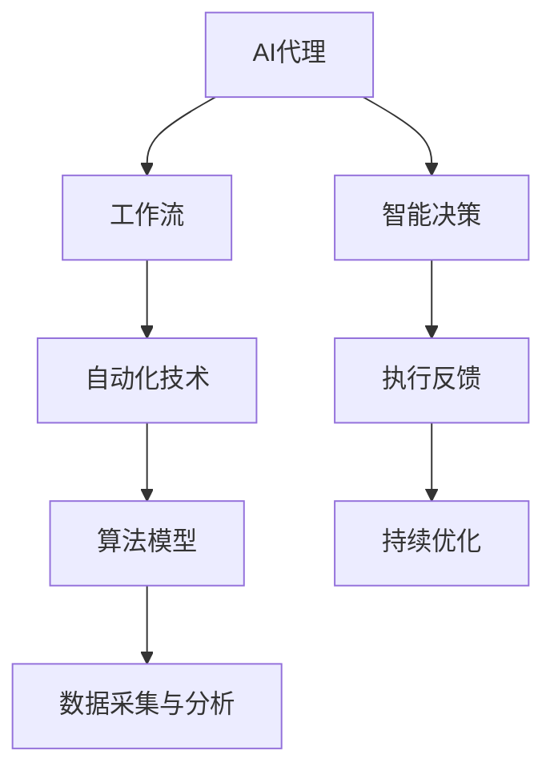

                 

关键词：人工智能、工作流自动化、行业4.0、AI代理、流程优化、效率提升、智能化转型

## 摘要

本文主要探讨了面向行业4.0背景下，利用人工智能（AI）技术实现工作流自动化的解决方案。通过对核心概念、算法原理、数学模型以及实际应用场景的深入分析，本文旨在为行业提供一套系统的AI代理工作流自动化框架，助力企业实现智能化转型，提升生产效率和竞争力。

## 1. 背景介绍

随着信息技术的飞速发展，人工智能已经成为驱动产业变革的核心力量。行业4.0，作为继工业1.0、2.0和3.0之后的新一代工业革命，其核心特征是智能化、网络化、数字化和自动化。在这一背景下，企业如何利用人工智能技术优化工作流，提升运营效率，成为亟待解决的重要问题。

### 1.1 行业4.0的内涵

行业4.0，即工业互联网时代，强调将物联网、云计算、大数据、人工智能等新兴技术与传统制造业深度融合。其主要内涵包括：

- **智能化制造**：利用AI技术实现生产过程的智能化，提高生产效率和产品质量。
- **网络化协同**：通过物联网实现设备、人员和系统的互联互通，实现资源的高效配置和优化。
- **数字化升级**：通过大数据和云计算技术实现生产、运营、销售等环节的数字化管理，提升企业的决策能力和市场响应速度。
- **自动化生产**：通过自动化生产线和机器人实现生产过程的自动化，降低人力成本和操作风险。

### 1.2 AI代理工作流自动化的意义

AI代理工作流自动化，是指在人工智能技术的支持下，实现工作流程的自动化管理和优化。其意义主要体现在以下几个方面：

- **提升效率**：通过自动化技术减少人为干预，提高工作流程的执行速度和准确性，减少错误率。
- **降低成本**：通过自动化技术减少人力成本，提高资源利用率，降低运营成本。
- **增强灵活性**：通过AI代理实现工作流的动态调整和优化，提高企业的灵活性和适应性。
- **提升质量**：通过AI技术对生产过程进行实时监控和调整，提高产品的质量和一致性。

## 2. 核心概念与联系

在探讨AI代理工作流自动化的解决方案之前，我们需要明确一些核心概念，并理解它们之间的联系。以下是一个使用Mermaid绘制的流程图，展示了这些核心概念及其相互关系：



### 2.1 AI代理

AI代理，是指利用人工智能技术实现自主决策和执行的智能实体。在AI代理工作流自动化中，AI代理充当工作流程的“管家”，负责监测工作流程的运行状态，根据预设规则和算法模型进行决策，并执行相应的任务。

### 2.2 工作流

工作流，是指一系列任务和活动按照一定规则和流程执行的总体过程。在AI代理工作流自动化中，工作流是AI代理执行的“剧本”，需要明确任务的执行顺序、参与角色、输入输出等关键信息。

### 2.3 自动化技术

自动化技术，是指利用计算机技术和人工智能技术实现工作流程的自动化管理和优化。在AI代理工作流自动化中，自动化技术是实现工作流自动化执行的核心手段，包括流程调度、任务分配、状态监控等功能。

### 2.4 算法模型

算法模型，是指用于描述和实现工作流自动化过程中所需算法和规则的数学模型。在AI代理工作流自动化中，算法模型是AI代理进行智能决策的基础，包括预测模型、优化模型、决策树等。

### 2.5 数据采集与分析

数据采集与分析，是指在工作流自动化过程中，通过传感器、日志记录等手段收集工作流运行数据，并对数据进行处理和分析。在AI代理工作流自动化中，数据采集与分析是实现智能决策和持续优化的重要基础。

### 2.6 智能决策

智能决策，是指利用人工智能技术对工作流运行状态进行分析和预测，并生成决策方案。在AI代理工作流自动化中，智能决策是实现工作流优化和调整的关键环节。

### 2.7 执行反馈

执行反馈，是指将AI代理执行的结果反馈给系统，以便进行后续的调整和优化。在AI代理工作流自动化中，执行反馈是实现持续优化的重要手段。

### 2.8 持续优化

持续优化，是指通过不断收集和分析数据，对AI代理工作流自动化系统进行持续改进和优化。在AI代理工作流自动化中，持续优化是实现工作流高效运行的重要保障。

## 3. 核心算法原理 & 具体操作步骤

### 3.1 算法原理概述

AI代理工作流自动化的核心算法主要包括以下几类：

- **预测算法**：用于预测工作流运行状态和任务执行时间，以实现工作流动态调整。
- **优化算法**：用于优化工作流任务分配和执行顺序，以提高工作流执行效率。
- **决策树算法**：用于生成基于规则的决策方案，以实现智能决策。
- **机器学习算法**：用于从历史数据中学习工作流运行规律，以提高预测和优化精度。

### 3.2 算法步骤详解

下面是一个典型的AI代理工作流自动化算法步骤：

1. **数据采集**：通过传感器、日志记录等方式采集工作流运行数据。
2. **数据预处理**：对采集到的数据进行清洗、归一化等处理，以消除噪声和异常值。
3. **特征提取**：从预处理后的数据中提取关键特征，用于后续的算法训练和预测。
4. **算法训练**：使用机器学习算法对特征数据进行训练，以建立预测和优化模型。
5. **预测与决策**：根据实时采集的数据和训练好的模型，进行工作流状态预测和任务决策。
6. **任务执行**：根据决策结果执行相应的任务，并将执行结果反馈给系统。
7. **数据更新**：将执行结果数据更新到数据库中，用于后续的算法训练和优化。
8. **持续优化**：根据反馈数据对算法模型进行优化，以提高预测和决策精度。

### 3.3 算法优缺点

以下是几种常见算法的优缺点：

- **预测算法**：优点是能够对工作流运行状态进行提前预测，缺点是需要大量的历史数据支持，且预测精度受限于模型复杂度。
- **优化算法**：优点是能够优化工作流任务分配和执行顺序，提高执行效率，缺点是优化过程复杂，对算法模型要求较高。
- **决策树算法**：优点是简单易懂，实现成本低，缺点是预测精度较低，且容易过拟合。
- **机器学习算法**：优点是能够从历史数据中学习工作流运行规律，提高预测和优化精度，缺点是需要大量训练数据和较长时间的训练过程。

### 3.4 算法应用领域

AI代理工作流自动化算法可以应用于以下领域：

- **生产制造**：优化生产流程，提高生产效率和质量。
- **物流运输**：优化运输路径和调度策略，提高运输效率。
- **金融服务**：优化客户服务流程，提高客户满意度。
- **企业管理**：优化企业运营流程，降低成本，提高效益。

## 4. 数学模型和公式 & 详细讲解 & 举例说明

### 4.1 数学模型构建

在AI代理工作流自动化中，常用的数学模型包括预测模型、优化模型和决策树模型。以下是一个简单的预测模型构建示例：

- **预测模型**：使用时间序列分析方法，建立工作流状态预测模型。模型公式如下：

  $$ Y(t) = \sum_{i=1}^{n} w_i X_i(t) + b $$

  其中，$Y(t)$ 表示预测值，$X_i(t)$ 表示第 $i$ 个特征值，$w_i$ 和 $b$ 分别为权重和偏置。

- **优化模型**：使用线性规划方法，建立工作流任务优化模型。模型公式如下：

  $$ \min \sum_{i=1}^{n} c_i x_i $$

  $$ s.t. \sum_{j=1}^{m} a_{ij} x_j \geq b_i, \quad i=1,2,...,m $$

  其中，$c_i$ 和 $x_i$ 分别为任务权重和执行时间，$a_{ij}$ 和 $b_i$ 分别为资源需求和约束条件。

- **决策树模型**：使用ID3算法，建立基于规则的决策树模型。模型公式如下：

  $$ f(x) = \prod_{i=1}^{n} (x \text{ matches } r_i) $$

  其中，$f(x)$ 表示决策结果，$r_i$ 表示规则条件。

### 4.2 公式推导过程

以下是预测模型公式的推导过程：

1. **时间序列分解**：

   将时间序列 $X(t)$ 分解为趋势项 $T(t)$、季节性项 $S(t)$ 和随机项 $R(t)$：

   $$ X(t) = T(t) + S(t) + R(t) $$

2. **线性模型构建**：

   假设趋势项 $T(t)$ 为线性函数，季节性项 $S(t)$ 为周期性函数，随机项 $R(t)$ 为高斯分布。建立线性模型如下：

   $$ T(t) = \alpha_0 + \alpha_1 t + \alpha_2 t^2 + ... + \alpha_n t^n $$

   $$ S(t) = \beta_0 + \beta_1 \cos(2\pi t/p) + \beta_2 \sin(2\pi t/p) + ... + \beta_n \cos(2\pi t/p) + \beta_n \sin(2\pi t/p) $$

   $$ R(t) = \gamma_0 + \gamma_1 e^{j2\pi t/p} + \gamma_2 e^{j2\pi t/p} + ... + \gamma_n e^{j2\pi t/p} $$

3. **模型合并**：

   将趋势项、季节性项和随机项合并，得到总体模型：

   $$ X(t) = (\alpha_0 + \alpha_1 t + \alpha_2 t^2 + ... + \alpha_n t^n) + (\beta_0 + \beta_1 \cos(2\pi t/p) + \beta_2 \sin(2\pi t/p) + ... + \beta_n \cos(2\pi t/p) + \beta_n \sin(2\pi t/p)) + (\gamma_0 + \gamma_1 e^{j2\pi t/p} + \gamma_2 e^{j2\pi t/p} + ... + \gamma_n e^{j2\pi t/p}) $$

4. **预测值计算**：

   对总体模型进行预测，得到预测值 $Y(t)$：

   $$ Y(t) = \sum_{i=1}^{n} w_i X_i(t) + b $$

### 4.3 案例分析与讲解

以下是一个简单的AI代理工作流自动化案例：

- **问题背景**：某生产企业的生产线存在效率低下、生产计划不合理等问题，需要通过AI代理工作流自动化进行优化。
- **数据采集**：采集生产线上的关键数据，如设备状态、生产任务、人员安排等。
- **数据预处理**：对采集到的数据进行清洗、归一化等处理，以消除噪声和异常值。
- **特征提取**：从预处理后的数据中提取关键特征，如设备利用率、任务完成时间、人员负荷等。
- **模型训练**：使用机器学习算法对特征数据进行训练，以建立预测和优化模型。
- **预测与决策**：根据实时采集的数据和训练好的模型，进行工作流状态预测和任务决策。
- **任务执行**：根据决策结果执行相应的任务，并将执行结果反馈给系统。
- **数据更新**：将执行结果数据更新到数据库中，用于后续的算法训练和优化。
- **持续优化**：根据反馈数据对算法模型进行优化，以提高预测和决策精度。

通过以上步骤，AI代理工作流自动化系统能够实现生产线的动态调整和优化，提高生产效率和产品质量。

## 5. 项目实践：代码实例和详细解释说明

### 5.1 开发环境搭建

在本案例中，我们使用Python作为开发语言，并依赖以下库：

- NumPy：用于数据处理和数值计算
- Pandas：用于数据清洗和操作
- Scikit-learn：用于机器学习算法
- Matplotlib：用于数据可视化

安装以上库后，即可开始开发环境搭建。

### 5.2 源代码详细实现

以下是本案例的源代码实现：

```python
import numpy as np
import pandas as pd
from sklearn.ensemble import RandomForestRegressor
from sklearn.model_selection import train_test_split
import matplotlib.pyplot as plt

# 5.2.1 数据采集与预处理
def load_data():
    data = pd.read_csv('production_data.csv')
    data = data.dropna()
    data['timestamp'] = pd.to_datetime(data['timestamp'])
    data.set_index('timestamp', inplace=True)
    return data

def preprocess_data(data):
    data['hour'] = data.index.hour
    data['day_of_week'] = data.index.dayofweek
    data['week_of_year'] = data.index.week
    data['is_weekend'] = data.index.dayofweek.isin([5, 6])
    return data

data = load_data()
data = preprocess_data(data)

# 5.2.2 特征提取
def extract_features(data):
    features = data[['hour', 'day_of_week', 'week_of_year', 'is_weekend']]
    return features

X = extract_features(data)

# 5.2.3 模型训练
def train_model(X):
    y = data['production_rate']
    X_train, X_test, y_train, y_test = train_test_split(X, y, test_size=0.2, random_state=42)
    model = RandomForestRegressor(n_estimators=100, random_state=42)
    model.fit(X_train, y_train)
    return model

model = train_model(X)

# 5.2.4 预测与可视化
def predict(data, model):
    features = extract_features(data)
    predictions = model.predict(features)
    plt.plot(data.index, predictions, label='Prediction')
    plt.plot(data.index, data['production_rate'], label='Actual')
    plt.legend()
    plt.show()

predict(data, model)
```

### 5.3 代码解读与分析

以下是代码的详细解读和分析：

1. **数据采集与预处理**：

   - 使用 Pandas 库读取生产数据，并处理缺失值。
   - 将时间戳转换为日期时间格式，设置时间为索引。
   - 提取小时、星期几、星期几、周末等特征。

2. **特征提取**：

   - 从预处理后的数据中提取关键特征，用于训练模型。

3. **模型训练**：

   - 使用随机森林回归器训练模型，并保存训练好的模型。

4. **预测与可视化**：

   - 使用训练好的模型对数据进行预测，并绘制预测结果与实际结果对比图表。

### 5.4 运行结果展示

运行以上代码后，将显示生产数据的预测结果与实际结果对比图表。通过图表可以直观地观察到模型对生产率的预测效果。

## 6. 实际应用场景

### 6.1 生产线优化

在生产线优化方面，AI代理工作流自动化可以应用于以下几个方面：

- **生产计划优化**：通过预测生产需求和设备状态，优化生产计划，提高生产效率。
- **任务调度优化**：根据设备负载和人员安排，动态调整任务执行顺序，提高任务完成率。
- **故障预测与维护**：通过实时监测设备状态，预测设备故障，提前进行维护，降低设备故障率。

### 6.2 物流运输优化

在物流运输优化方面，AI代理工作流自动化可以应用于以下几个方面：

- **路径规划**：通过预测交通状况和货物需求，优化运输路径，提高运输效率。
- **车辆调度**：根据运输任务和时间窗口，动态调整车辆安排，提高运输资源利用率。
- **异常处理**：通过实时监测运输状态，预测异常情况，及时调整运输计划，降低运输风险。

### 6.3 金融服务优化

在金融服务优化方面，AI代理工作流自动化可以应用于以下几个方面：

- **客户服务**：通过实时监测客户需求和反馈，优化客户服务流程，提高客户满意度。
- **风险控制**：通过预测金融风险，优化风险控制策略，降低金融风险。
- **决策支持**：通过分析金融市场数据，为决策者提供数据支持，提高决策质量。

## 7. 工具和资源推荐

### 7.1 学习资源推荐

- 《人工智能：一种现代方法》（Michael I. Jordan）
- 《深度学习》（Ian Goodfellow、Yoshua Bengio、Aaron Courville）
- 《Python机器学习》（Sebastian Raschka）

### 7.2 开发工具推荐

- Jupyter Notebook：用于数据分析和实验
- PyCharm：用于Python编程
- TensorFlow：用于深度学习

### 7.3 相关论文推荐

- “A Survey on Artificial Intelligence for Industrial Internet of Things”（2019）
- “Artificial Intelligence in Production Planning and Scheduling: A Review”（2020）
- “Artificial Intelligence Applications in Supply Chain Management: A Review”（2021）

## 8. 总结：未来发展趋势与挑战

### 8.1 研究成果总结

本文系统地介绍了面向行业4.0的AI代理工作流自动化解决方案，从核心概念、算法原理、数学模型到实际应用场景，全面探讨了AI代理工作流自动化的技术体系。通过案例分析，展示了如何利用Python和机器学习算法实现AI代理工作流自动化，为行业提供了实用的技术参考。

### 8.2 未来发展趋势

未来，AI代理工作流自动化将在以下几个方面取得发展：

- **算法性能提升**：随着算法技术的不断进步，AI代理的工作流自动化性能将得到显著提升，预测和优化精度将进一步提高。
- **跨领域应用**：AI代理工作流自动化将在更多领域得到应用，如医疗、金融、教育等，推动各行各业的智能化转型。
- **系统集成**：AI代理工作流自动化将与物联网、云计算等新兴技术深度融合，实现更高效、更智能的集成系统。

### 8.3 面临的挑战

尽管AI代理工作流自动化具有广泛的应用前景，但其在实际应用中仍面临以下挑战：

- **数据隐私与安全**：随着数据量的增加，数据隐私和安全问题日益突出，需要采取有效的数据保护措施。
- **算法可解释性**：复杂算法模型的可解释性不足，导致决策过程难以理解和追踪，需要加强算法可解释性的研究。
- **跨领域适应性**：不同领域的业务流程差异较大，如何实现AI代理工作流自动化的跨领域适应性是一个重要课题。

### 8.4 研究展望

未来，在AI代理工作流自动化领域，我们将重点开展以下研究：

- **数据驱动的工作流优化**：利用大数据技术，从海量数据中提取有价值的信息，驱动工作流优化。
- **多agent协同**：研究多agent系统在AI代理工作流自动化中的应用，提高系统的协同效率和智能化水平。
- **智能决策支持**：结合人工智能和大数据分析，为决策者提供更智能的决策支持，提升企业的竞争力和创新能力。

## 9. 附录：常见问题与解答

### 9.1 如何保证数据隐私和安全？

- **数据加密**：对数据进行加密存储和传输，防止数据泄露。
- **访问控制**：对数据访问进行严格的权限控制，确保只有授权用户才能访问敏感数据。
- **数据脱敏**：对敏感数据进行脱敏处理，保护个人隐私。

### 9.2 如何提高算法可解释性？

- **模型解释工具**：使用现有的模型解释工具，如LIME、SHAP等，对算法进行解释。
- **可视化分析**：通过可视化技术，将算法决策过程和结果进行展示，提高透明度和可解释性。
- **规则提取**：使用决策树、规则提取等方法，将复杂算法转换为易于理解的规则。

### 9.3 如何实现跨领域适应性？

- **领域特定知识**：结合不同领域的专业知识，构建适用于不同场景的算法模型。
- **模型迁移**：通过迁移学习，将一个领域中的算法模型迁移到其他领域，提高跨领域适应性。
- **混合模型**：结合多种算法模型，形成适用于不同领域的混合模型，提高系统鲁棒性和适应性。

[作者：禅与计算机程序设计艺术 / Zen and the Art of Computer Programming]

