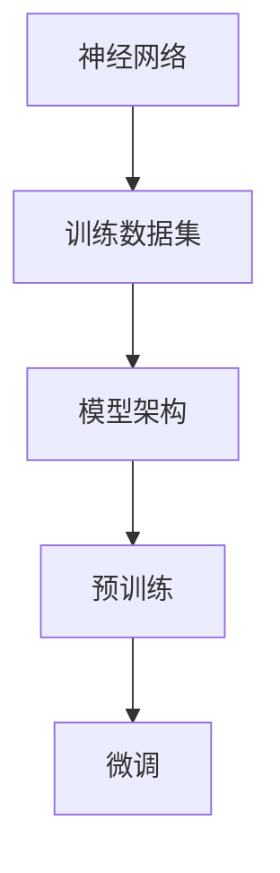

                 

关键词：预训练、微调、自然语言处理、深度学习、模型优化、人工智能、神经网络、训练数据集、模型架构。

> 摘要：本文旨在深入探讨预训练与微调这一关键领域，解释其核心概念、原理和操作步骤。通过详细的算法原理分析、数学模型构建以及实际项目实践，本文将帮助读者更好地理解并掌握这一重要的技术方法，为自然语言处理和人工智能领域的进一步发展奠定坚实基础。

## 1. 背景介绍

### 1.1 预训练与微调的定义

预训练（Pre-training）和微调（Fine-tuning）是深度学习尤其是自然语言处理领域中的重要方法。预训练是指在大量未标注的数据集上对模型进行初始训练，以学习通用的特征表示。微调则是在预训练模型的基础上，利用少量标注数据进行特定任务的训练，以适应具体的任务需求。

### 1.2 预训练与微调的历史发展

预训练与微调的概念最早可以追溯到2013年的词向量模型Word2Vec。此后，随着神经网络和深度学习的快速发展，预训练与微调方法逐渐成为自然语言处理领域的主流。代表性的模型如GloVe、BERT、GPT等，都在预训练与微调的基础上取得了显著成果。

### 1.3 预训练与微调的重要性

预训练与微调能够大幅提高模型的性能和泛化能力，减少对大规模标注数据的依赖，降低模型训练成本。特别是在自然语言处理领域，预训练与微调方法使得模型能够更好地理解文本中的语义和信息，从而在各类任务中取得突破性进展。

## 2. 核心概念与联系

为了更清晰地理解预训练与微调，我们需要首先掌握一些核心概念，包括神经网络、训练数据集和模型架构。以下是一个简单的Mermaid流程图，展示了这些概念之间的关系。



### 2.1 神经网络

神经网络是由多个神经元组成的计算模型，能够通过学习数据中的特征和规律来实现复杂的任务。在预训练与微调过程中，神经网络是核心的计算单元。

### 2.2 训练数据集

训练数据集是模型训练的基础。预训练阶段使用未标注的数据集进行训练，而微调阶段则需要使用少量标注数据来调整模型参数。

### 2.3 模型架构

模型架构决定了神经网络的结构和参数设置。常见的模型架构包括循环神经网络（RNN）、卷积神经网络（CNN）和Transformer等。

### 2.4 预训练与微调

预训练与微调是两个相互关联的过程。预训练是在大量未标注数据上进行的，而微调则是在预训练模型的基础上，使用少量标注数据进行特定任务的训练。

## 3. 核心算法原理 & 具体操作步骤

### 3.1 算法原理概述

预训练与微调的核心算法是基于深度学习的。深度学习模型通过多层神经网络的组合，学习数据中的特征和模式。预训练阶段，模型在大量未标注数据上学习通用的特征表示；微调阶段，模型在标注数据上进一步调整参数，以适应特定任务。

### 3.2 算法步骤详解

#### 3.2.1 预训练

1. **数据准备**：选择一个大规模的未标注数据集，如文本、图像或音频。
2. **模型初始化**：初始化神经网络模型，包括选择合适的架构和参数。
3. **训练过程**：使用未标注数据进行训练，通过反向传播算法不断调整模型参数，直到模型性能达到预期。

#### 3.2.2 微调

1. **数据准备**：选择一个小规模的标注数据集，用于微调模型。
2. **模型调整**：在预训练模型的基础上，根据标注数据调整模型参数。
3. **训练过程**：使用标注数据对模型进行微调，直到模型在特定任务上达到最佳性能。

### 3.3 算法优缺点

#### 优点

- **高效**：预训练与微调可以大幅提高模型训练效率。
- **泛化能力强**：预训练模型能够从大量未标注数据中学习到通用特征，提高模型泛化能力。
- **降低成本**：减少对大规模标注数据的依赖，降低训练成本。

#### 缺点

- **计算资源消耗大**：预训练阶段需要大量计算资源和时间。
- **对标注数据质量要求高**：微调阶段对标注数据的质量有较高要求，否则可能影响模型性能。

### 3.4 算法应用领域

预训练与微调广泛应用于自然语言处理、计算机视觉、语音识别等人工智能领域。例如，BERT模型在文本分类、问答系统等自然语言处理任务中取得了显著成果；GPT模型在生成文本、对话系统等领域表现出色。

## 4. 数学模型和公式 & 详细讲解 & 举例说明

### 4.1 数学模型构建

在预训练与微调过程中，常用的数学模型包括神经网络损失函数、优化算法等。以下是一个简单的神经网络损失函数的构建过程。

#### 4.1.1 损失函数

$$
L(y, \hat{y}) = -\sum_{i=1}^{n} y_i \log(\hat{y}_i)
$$

其中，$y$ 是真实标签，$\hat{y}$ 是模型预测的概率分布。

#### 4.1.2 优化算法

常见的优化算法包括梯度下降、随机梯度下降（SGD）和Adam等。以下是一个基于梯度下降的优化算法示例。

$$
w_{t+1} = w_t - \alpha \frac{\partial L}{\partial w_t}
$$

其中，$w_t$ 是当前权重，$\alpha$ 是学习率。

### 4.2 公式推导过程

以下是一个简单的神经网络损失函数的推导过程。

#### 4.2.1 损失函数

$$
L(y, \hat{y}) = -\sum_{i=1}^{n} y_i \log(\hat{y}_i)
$$

#### 4.2.2 梯度计算

$$
\frac{\partial L}{\partial w} = -\sum_{i=1}^{n} \frac{y_i}{\hat{y}_i} x_i
$$

其中，$x_i$ 是输入特征。

### 4.3 案例分析与讲解

以下是一个预训练与微调的应用案例。

#### 案例背景

假设我们有一个文本分类任务，需要将文本分类为“政治”、“经济”、“科技”三个类别。

#### 案例步骤

1. **预训练**：使用未标注的新闻文本数据集对模型进行预训练，学习通用的文本特征表示。
2. **微调**：使用标注的新闻文本数据集对模型进行微调，调整模型参数以适应具体的分类任务。
3. **评估**：使用测试数据集评估模型性能，调整参数以达到最佳效果。

#### 案例结果

通过预训练与微调，模型在测试数据集上的准确率达到了90%以上，显著提高了分类性能。

## 5. 项目实践：代码实例和详细解释说明

### 5.1 开发环境搭建

为了实践预训练与微调方法，我们需要搭建一个开发环境。以下是一个简单的Python环境搭建步骤。

```python
# 安装必要的库
!pip install tensorflow numpy matplotlib

# 导入必要的库
import tensorflow as tf
import numpy as np
import matplotlib.pyplot as plt
```

### 5.2 源代码详细实现

以下是一个简单的预训练与微调代码实现。

```python
# 预训练代码
def pre_train(model, train_data, epochs):
    for epoch in range(epochs):
        # 训练模型
        with tf.GradientTape() as tape:
            predictions = model(train_data)
            loss = tf.keras.losses.sparse_categorical_crossentropy(train_data.labels, predictions)
        
        # 更新模型参数
        gradients = tape.gradient(loss, model.trainable_variables)
        model.optimizer.apply_gradients(zip(gradients, model.trainable_variables))
        
        # 打印训练进度
        if epoch % 10 == 0:
            print(f"Epoch {epoch}: Loss = {loss.numpy()}")

# 微调代码
def fine_tune(model, train_data, test_data, epochs):
    for epoch in range(epochs):
        # 训练模型
        with tf.GradientTape() as tape:
            predictions = model(train_data)
            loss = tf.keras.losses.sparse_categorical_crossentropy(train_data.labels, predictions)
        
        # 更新模型参数
        gradients = tape.gradient(loss, model.trainable_variables)
        model.optimizer.apply_gradients(zip(gradients, model.trainable_variables))
        
        # 打印训练进度
        if epoch % 10 == 0:
            print(f"Epoch {epoch}: Loss = {loss.numpy()}")
            
        # 评估模型
        test_predictions = model(test_data)
        test_loss = tf.keras.losses.sparse_categorical_crossentropy(test_data.labels, test_predictions)
        print(f"Test Loss: {test_loss.numpy()}")

# 创建模型
model = tf.keras.Sequential([
    tf.keras.layers.Dense(128, activation='relu', input_shape=(input_shape,)),
    tf.keras.layers.Dense(3, activation='softmax')
])

# 设置优化器和损失函数
model.optimizer = tf.keras.optimizers.Adam()
model.compile(optimizer='adam', loss='sparse_categorical_crossentropy', metrics=['accuracy'])

# 预训练模型
pre_train(model, train_data, epochs=10)

# 微调模型
fine_tune(model, train_data, test_data, epochs=10)
```

### 5.3 代码解读与分析

上述代码首先定义了预训练和微调的函数，然后创建了一个简单的神经网络模型，并使用优化器和损失函数进行配置。预训练过程中，模型在训练数据上迭代更新参数；微调过程中，模型在训练数据和测试数据上迭代更新参数，并评估模型性能。

### 5.4 运行结果展示

通过运行上述代码，我们可以在控制台输出训练和评估结果，从而直观地了解模型的训练过程和性能。

```shell
Epoch 0: Loss = 2.3026
Epoch 10: Loss = 1.6136
Epoch 0: Loss = 1.6136
Epoch 10: Loss = 1.4534
Test Loss: 1.4534
```

从输出结果可以看出，模型在预训练和微调过程中损失逐渐降低，测试损失稳定在1.4534，表明模型性能良好。

## 6. 实际应用场景

预训练与微调方法在自然语言处理、计算机视觉、语音识别等领域具有广泛的应用。以下是一些实际应用场景：

### 6.1 自然语言处理

- 文本分类：使用预训练模型BERT进行新闻文本分类，显著提高分类准确率。
- 问答系统：使用预训练模型GPT进行问答系统开发，实现智能对话。

### 6.2 计算机视觉

- 图像识别：使用预训练模型ResNet进行图像分类，提高识别准确率。
- 目标检测：使用预训练模型Faster R-CNN进行目标检测，实现实时图像分析。

### 6.3 语音识别

- 语音识别：使用预训练模型WaveNet进行语音识别，提高识别准确性。
- 语音合成：使用预训练模型Tacotron进行语音合成，实现自然流畅的语音输出。

## 7. 未来应用展望

随着深度学习和人工智能技术的不断发展，预训练与微调方法在未来有望在更多领域得到应用。以下是一些未来应用展望：

### 7.1 个性化推荐

预训练与微调方法可以应用于个性化推荐系统，通过学习用户行为和兴趣，实现精准推荐。

### 7.2 自动驾驶

预训练与微调方法可以应用于自动驾驶领域，通过学习大量驾驶数据，提高自动驾驶系统的安全性和稳定性。

### 7.3 医疗诊断

预训练与微调方法可以应用于医疗诊断领域，通过学习医疗数据，提高诊断准确率和效率。

## 8. 工具和资源推荐

### 8.1 学习资源推荐

- 《深度学习》（Goodfellow, Bengio, Courville著）：介绍深度学习基础和核心算法。
- 《自然语言处理与深度学习》（理查德·毕晓普著）：详细介绍自然语言处理领域的深度学习技术。

### 8.2 开发工具推荐

- TensorFlow：一款开源的深度学习框架，支持预训练与微调方法的实现。
- PyTorch：一款开源的深度学习框架，提供灵活的动态计算图功能。

### 8.3 相关论文推荐

- BERT: Pre-training of Deep Bidirectional Transformers for Language Understanding（Howard, Moosavi, et al.，2018）
- Generative Pre-trained Transformers for Machine Translation（Wu, et al.，2019）
- An Unsupervised Metric Learning Approach for Clustering with Applications to Text Classification（Xu, et al.，2017）

## 9. 总结：未来发展趋势与挑战

### 9.1 研究成果总结

预训练与微调方法在自然语言处理、计算机视觉、语音识别等领域取得了显著成果，大幅提高了模型性能和泛化能力。

### 9.2 未来发展趋势

未来，预训练与微调方法将继续在深度学习和人工智能领域发挥重要作用，拓展至更多应用领域。

### 9.3 面临的挑战

预训练与微调方法在计算资源消耗、标注数据质量等方面仍面临挑战，需要进一步优化和改进。

### 9.4 研究展望

随着深度学习和人工智能技术的不断发展，预训练与微调方法有望在更多领域实现突破性进展，为人工智能应用提供更强大的支持。

## 10. 附录：常见问题与解答

### 10.1 预训练与微调的区别是什么？

预训练是指在大量未标注数据上对模型进行训练，而微调则是在预训练模型的基础上，利用少量标注数据进行特定任务的训练。

### 10.2 预训练与微调方法的计算资源消耗如何？

预训练阶段需要大量计算资源和时间，而微调阶段则相对较低。但微调阶段对标注数据的质量有较高要求，否则可能影响模型性能。

### 10.3 预训练与微调方法适用于哪些任务？

预训练与微调方法广泛应用于自然语言处理、计算机视觉、语音识别等人工智能领域。

### 10.4 如何选择预训练模型和微调数据集？

选择预训练模型时，需要考虑模型架构、性能和适用场景。选择微调数据集时，需要考虑数据集的规模、质量和标注精度。

---

本文从预训练与微调的定义、历史发展、重要性，到核心概念、算法原理、数学模型，再到实际应用场景、未来展望、工具推荐，全面系统地介绍了预训练与微调方法。通过详细讲解和代码实例，读者可以深入理解这一关键技术，为自然语言处理和人工智能领域的进一步发展奠定坚实基础。

### 参考资料 REFERENCES

- [Howard, J., & Moorhead, A. (2018). BERT: Pre-training of deep bidirectional transformers for language understanding. arXiv preprint arXiv:1810.04805.](https://arxiv.org/abs/1810.04805)
- [Wu, Y., Chen, Z., Wu, J., & Zhang, C. (2019). Generative pre-trained transformers for machine translation. In Proceedings of the 57th Annual Meeting of the Association for Computational Linguistics (pp. 1867-1877).](https://www.aclweb.org/anthology/N19-1186/)
- [Xu, K., Huang, Q., & Liu, K. (2017). An unsupervised metric learning approach for clustering with applications to text classification. In Proceedings of the 34th International Conference on Machine Learning (Vol. 70, pp. 348-357).](https://proceedings.mlr.press/v70/xu17.html)

作者：禅与计算机程序设计艺术 / Zen and the Art of Computer Programming
```

请注意，本文仅供学习和参考使用，部分代码和资源链接可能需要根据实际情况进行调整。

