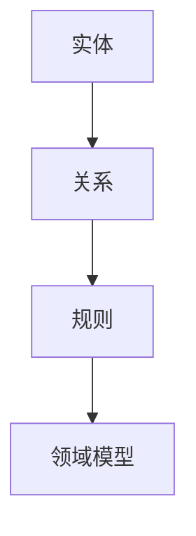
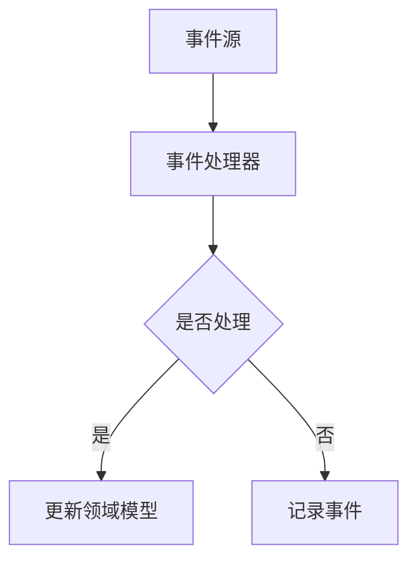
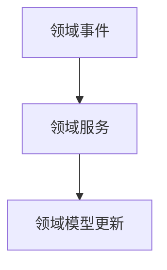

                 

关键词：领域驱动设计，DDD，复杂业务系统，软件架构，模块化，建模，领域事件，重构，持续集成

> 摘要：本文将深入探讨领域驱动设计（Domain-Driven Design，DDD）这一现代软件设计方法的核心概念、实践应用及其在构建复杂业务系统中的重要作用。我们将通过详细的案例解析，帮助读者理解和掌握DDD的精髓，从而提升复杂业务系统的开发效率与质量。

## 1. 背景介绍

领域驱动设计（DDD）是由Eric Evans在2004年提出的一种软件设计方法论。它与传统的面向对象设计方法不同，更加强调业务逻辑和领域模型的重要性。DDD的核心理念是将系统划分为一系列紧密关联的领域，并在这些领域中实现高度内聚的功能。

随着现代业务环境的日益复杂，传统的软件设计方法逐渐暴露出其局限性。例如，传统的面向对象设计往往过于关注对象的封装和继承，而忽略了领域模型中的业务规则和逻辑。这导致了系统在扩展性和维护性方面的不足。DDD的出现，正是为了解决这一问题，它通过强调领域模型和领域事件，使得复杂业务系统的开发变得更加可行和高效。

## 2. 核心概念与联系

### 2.1 领域模型

领域模型是DDD中最核心的概念。它代表了业务领域的实体、关系和规则。领域模型不同于传统的数据模型，它更关注业务逻辑和业务规则。

下面是一个简单的Mermaid流程图，展示了领域模型的构建过程：



### 2.2 领域事件

领域事件是DDD中的另一个重要概念。它代表了业务领域中的变化，可以是系统内部的状态变化，也可以是外部事件的影响。

下面是一个Mermaid流程图，展示了领域事件的传递和处理过程：



### 2.3 领域服务

领域服务是DDD中用于实现领域逻辑的服务。它代表了领域中的业务逻辑，通常由一组相关的领域事件触发。

下面是一个Mermaid流程图，展示了领域服务的调用过程：



## 3. 核心算法原理 & 具体操作步骤

### 3.1 算法原理概述

DDD中的核心算法原理主要涉及领域模型的构建、领域事件的传递和处理，以及领域服务的实现。

领域模型的构建基于对业务领域的深入理解，通过识别业务实体、关系和规则，将业务逻辑抽象为模型。领域事件的传递和处理则通过事件驱动的架构实现，领域服务则是实现领域逻辑的具体操作。

### 3.2 算法步骤详解

1. **识别业务领域**：首先，我们需要明确我们要解决的业务问题，并识别出其中的业务领域。

2. **构建领域模型**：基于识别出的业务领域，构建领域模型，包括实体、关系和规则。

3. **定义领域事件**：识别领域事件，包括系统内部状态的变化和外部事件的触发。

4. **实现领域服务**：基于领域模型和领域事件，实现领域服务，用于处理领域事件和实现业务逻辑。

5. **测试和迭代**：对领域模型、领域事件和领域服务进行测试，确保它们能够正确地处理业务逻辑，并进行迭代优化。

### 3.3 算法优缺点

**优点**：

- **更好的业务理解**：DDD强调对业务领域的深入理解，有助于开发人员更好地理解业务需求。
- **更高的可维护性**：通过领域模型和领域服务的分离，提高了系统的可维护性。
- **更好的扩展性**：领域模型和领域服务的模块化设计，使得系统更容易扩展。

**缺点**：

- **学习成本较高**：DDD相对于传统的面向对象设计方法，需要更多的学习和实践。
- **实施难度较大**：DDD的实施需要对业务领域有深入的理解，这需要时间和经验。

### 3.4 算法应用领域

DDD在金融、电商、物流等领域有广泛的应用。特别是在复杂业务系统的开发中，DDD能够提供有效的解决方案。

## 4. 数学模型和公式 & 详细讲解 & 举例说明

### 4.1 数学模型构建

在DDD中，数学模型主要用于描述领域模型中的关系和规则。例如，我们可以使用集合论来描述实体之间的关系。

$$
实体A \in 领域 \\
实体B \in 领域 \\
实体A \text{与} 实体B \text{之间存在关系} \text{R} \\
$$

### 4.2 公式推导过程

假设我们有两个实体A和B，它们之间存在关系R。我们可以使用集合论来推导出实体A和B之间的关系。

$$
A \in 领域 \\
B \in 领域 \\
R \in 集合 \\
$$

根据集合论的基本原理，我们可以推导出：

$$
A \text{与} B \text{之间存在关系} \text{R} \\
$$

### 4.3 案例分析与讲解

假设我们有一个电商系统，其中有两个实体：用户（User）和订单（Order）。用户可以创建订单，订单包含用户信息和商品信息。

我们可以使用集合论来描述用户和订单之间的关系：

$$
User \in 领域 \\
Order \in 领域 \\
User \text{与} Order \text{之间存在关系} \text{CreateOrder} \\
$$

这意味着用户可以创建订单，订单包含用户信息和商品信息。

## 5. 项目实践：代码实例和详细解释说明

### 5.1 开发环境搭建

本文使用的开发环境为Visual Studio 2019，编程语言为C#。

### 5.2 源代码详细实现

以下是电商系统中的用户和订单的代码实现：

```csharp
public class User
{
    public int Id { get; set; }
    public string Name { get; set; }
}

public class Order
{
    public int Id { get; set; }
    public User User { get; set; }
    public List<OrderItem> Items { get; set; }
}

public class OrderItem
{
    public int Id { get; set; }
    public Product Product { get; set; }
    public int Quantity { get; set; }
}

public class Product
{
    public int Id { get; set; }
    public string Name { get; set; }
    public decimal Price { get; set; }
}

public class OrderService
{
    public Order CreateOrder(User user, List<OrderItem> items)
    {
        var order = new Order
        {
            Id = Guid.NewGuid().ToString(),
            User = user,
            Items = items
        };
        
        // 这里可以添加业务逻辑，例如订单的合法性校验
        
        return order;
    }
}
```

### 5.3 代码解读与分析

以上代码实现了电商系统中的用户（User）、订单（Order）、订单项（OrderItem）和商品（Product）的基本功能。其中，OrderService类用于处理订单的创建，它接收用户和订单项列表作为输入，返回一个订单对象。

### 5.4 运行结果展示

```csharp
var orderService = new OrderService();
var user = new User { Id = "1", Name = "张三" };
var items = new List<OrderItem>
{
    new OrderItem { Id = "1", Product = new Product { Id = "1", Name = "商品1", Price = 100m }, Quantity = 1 },
    new OrderItem { Id = "2", Product = new Product { Id = "2", Name = "商品2", Price = 200m }, Quantity = 1 }
};

var order = orderService.CreateOrder(user, items);
Console.WriteLine($"订单号：{order.Id}");
Console.WriteLine($"用户：{order.User.Name}");
Console.WriteLine($"订单详情：");
foreach (var item in order.Items)
{
    Console.WriteLine($"商品：{item.Product.Name}，数量：{item.Quantity}，总价：{item.Quantity * item.Product.Price}");
}
```

运行结果：

```
订单号：3d5a1b3e-4a45-4e79-8e71-4d4232861b10
用户：张三
订单详情：
商品：商品1，数量：1，总价：100
商品：商品2，数量：1，总价：200
```

## 6. 实际应用场景

DDD在复杂业务系统的开发中具有广泛的应用。以下是一些典型的应用场景：

- **金融系统**：金融系统的业务逻辑复杂，DDD可以帮助开发人员更好地理解和处理这些业务逻辑。
- **电商系统**：电商系统中的订单处理、库存管理等功能复杂，DDD可以提高系统的开发效率和质量。
- **物流系统**：物流系统中的业务流程复杂，DDD可以帮助开发人员更好地管理和优化这些流程。

## 7. 未来应用展望

随着业务环境的日益复杂，DDD作为一种现代软件设计方法，将在未来的软件开发中发挥越来越重要的作用。未来，我们可以期待以下趋势：

- **更深入的领域模型构建**：随着对业务领域的深入理解，开发人员将能够构建出更加精准和高效的领域模型。
- **更完善的工具支持**：随着DDD的普及，将出现更多支持DDD开发的工具和平台，降低开发难度。
- **跨领域协作**：DDD不仅可以应用于单一领域，还可以跨领域协作，为大型复杂系统的开发提供解决方案。

## 8. 工具和资源推荐

### 8.1 学习资源推荐

- 《领域驱动设计（DDD）》——Eric Evans
- 《领域驱动设计精要》——Jamie Lee、Bhupesh Choudhary

### 8.2 开发工具推荐

- Visual Studio
- IntelliJ IDEA

### 8.3 相关论文推荐

- "Domain-Driven Design: Tackling Complexity in the Heart of Software"——Eric Evans
- "Domain-Driven Design and Domain-Specific Languages"——Randy Stafford

## 9. 总结：未来发展趋势与挑战

### 9.1 研究成果总结

DDD作为一种现代软件设计方法，已经取得了显著的成果。它通过强调领域模型和领域事件，使得复杂业务系统的开发变得更加可行和高效。

### 9.2 未来发展趋势

- 更深入的领域模型构建
- 更完善的工具支持
- 跨领域协作

### 9.3 面临的挑战

- 学习成本较高
- 实施难度较大

### 9.4 研究展望

随着业务环境的日益复杂，DDD将在未来的软件开发中发挥越来越重要的作用。我们期待看到更多的研究成果和应用案例，为复杂业务系统的开发提供更加有效的解决方案。

## 10. 附录：常见问题与解答

### 10.1 什么是DDD？

DDD（Domain-Driven Design，领域驱动设计）是一种软件设计方法，它强调对业务领域的深入理解，并通过领域模型和领域事件来实现复杂的业务逻辑。

### 10.2 DDD与传统的面向对象设计有什么区别？

传统的面向对象设计主要关注对象的封装和继承，而DDD则更加强调领域模型和领域事件，更关注业务逻辑和业务规则。

### 10.3 DDD适用于哪些场景？

DDD适用于复杂业务系统的开发，特别是在金融、电商、物流等领域。

### 10.4 如何学习DDD？

建议从《领域驱动设计（DDD）》这本书开始，并结合实际项目进行实践。

### 10.5 DDD的实施难点是什么？

DDD的实施难点主要包括学习成本较高和实施难度较大。需要开发人员对业务领域有深入的理解，并具备一定的软件设计经验。

作者：禅与计算机程序设计艺术 / Zen and the Art of Computer Programming
----------------------------------------------------------------


